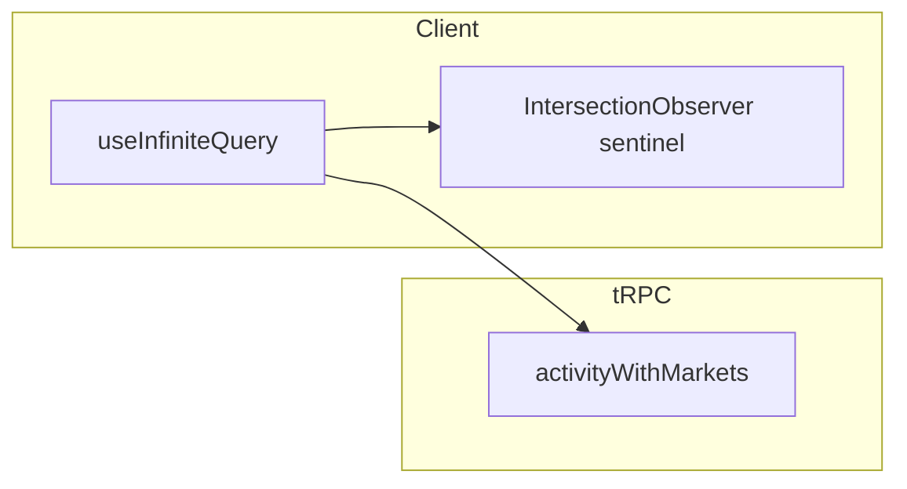

# Infinite scroll for activity lists

## API and pagination rule

- `[data.activityWithMarkets](apps/server/src/routers/data.ts)` accepts `limit` and `offset` and returns a **plain array** (no `hasMore` in the payload).
- **Next page:** `getNextPageParam` matches TradesTab: if `lastPage.length < PAGE_SIZE` then `undefined`, else `sum of prior page lengths` (offset for the next request).

## 1. Portfolio Activity History — [activity-history.tsx](apps/web/src/components/portfolio/activity-history.tsx)

**Today:** single `useQuery` with `limit: 500` and filters `type`, `start`, `end` ([lines 471–478](apps/web/src/components/portfolio/activity-history.tsx)).

**Changes:**

- Replace with `useInfiniteQuery` + `trpcClient.data.activityWithMarkets.query({ ...input, limit: PAGE_SIZE, offset: pageParam })`.
- **Stable query key:** base input must include `user`, `type`, `start`, `end` (same as today) plus a literal `"infinite"` suffix (pattern from [wallet-tracker-activity.ts](apps/web/src/components/wallet-tracker/wallet-tracker-activity.ts) / [trades-tab.tsx](apps/web/src/components/market/tabs/trades-tab.tsx)).
- **Flatten** `data.pages` for `ActivityHistoryContent`; keep client-side **sort** on the flattened list (same as today).
- **Scroll root:** the scrollable area is the card body — attach a `ref` to the element that actually scrolls (likely the inner `overflow-auto` / flex column used by embedded vs non-embedded layouts) and use it as `IntersectionObserver` `root` with `rootMargin: "200px"`.
- **Filter changes:** when `typeFilter` or `timeFilter` changes, TanStack Query should treat it as a new query if the query key includes those fields; call `resetQueries` or rely on key change (verify no stale pages).

**Constants:** `PAGE_SIZE = 50` (align with market TradesTab / wallet tracker).

---

## 2. Market History tab — [history-tab.tsx](apps/web/src/components/market/tabs/history-tab.tsx)

**Today:** `limit: 50`, no pagination — users with more than 50 rows see a silent cap ([lines 102–111](apps/web/src/components/market/tabs/history-tab.tsx)).

**Changes:**

- Same infinite pattern: `useInfiniteQuery` with inputs `user`, `market: [conditionId]`, `type: ["TRADE","SPLIT","MERGE"]`, `limit: 50`, `offset: pageParam`.
- **Query key:** include `conditionId` and `user` (or stable placeholder) + `"infinite"`.
- **Sentinel:** reuse the same approach as [trades-tab.tsx](apps/web/src/components/market/tabs/trades-tab.tsx) (sentinel at bottom, observer with `root` = scroll parent if the tab lives inside a scroll container — inspect [market-tabs.tsx](apps/web/src/components/market/market-tabs.tsx) / parent to set `root` correctly; fallback `root: null` viewport if no inner scroller).
- **Sort:** keep sorting `sortedHist` over **flattened** pages (current behavior).

---

## 3. Leaderboard profile modal — [leaderboard-profile-modal.tsx](apps/web/src/components/leaderboard/leaderboard-profile-modal.tsx)

**Today:** one `activityQuery` with `limit: 500` feeds both **header stats** (`tradesForStats` → `computeTradingStats`) and **History tab rows** ([lines 132–139, 165–201](apps/web/src/components/leaderboard/leaderboard-profile-modal.tsx)).

**Problem:** infinite list cannot use the same single 500-row fetch without reintroducing the heavy payload.

**Recommended split:**

| Concern                             | Approach                                                                                                                                                                                                                                                                                                                                                                                                                                                                                                                                                                                                                                                      |
| ----------------------------------- | ------------------------------------------------------------------------------------------------------------------------------------------------------------------------------------------------------------------------------------------------------------------------------------------------------------------------------------------------------------------------------------------------------------------------------------------------------------------------------------------------------------------------------------------------------------------------------------------------------------------------------------------------------------- |
| **History list**                    | `useInfiniteQuery` on `activityWithMarkets` with `limit: 50`, same `getNextPageParam` as above. Flatten pages for the History table.                                                                                                                                                                                                                                                                                                                                                                                                                                                                                                                          |
| **Header stats (`tradesForStats`)** | **Decouple** from the infinite list: either (a) derive fallbacks only from existing queries (`leaderboardLifetimeQuery`, `tradedQuery`, `valueQuery`, `positionsQuery`) and pass `**[]`** as the `trades` argument to `computeTradingStats` when those cover the UI, or (b) add a **small dedicated** `useQuery` to `trpc.data.trades` with `limit: 100` (or 500) **only** for volume/trade-count fallback used by `computeTradingStats`, without feeding the History table. Pick (a) if product accepts stats being entirely from Polymarket leaderboard/traded when present; pick (b) if you need client-computed volume when leaderboard rows are missing. |

- **Loading / skeleton:** `isLoading` currently gates on `activityQuery` among others — split into `historyInfinite.isPending` for History skeleton vs stats queries for header.
- **Scroll:** History tab already uses a fixed-height scroll div ([lines 523–525](apps/web/src/components/leaderboard/leaderboard-profile-modal.tsx)) — attach `ref` to that `overflow-y-auto` div as observer `root` and place sentinel after the last row.

---

## 4. Shared helpers (optional, small)

- Add a tiny shared helper (e.g. `getOffsetBasedNextPageParam(pageSize: number)`) in something like `[apps/web/src/lib/infinite-query.ts](apps/web/src/lib/infinite-query.ts)` **or** colocate next to the first consumer — to avoid copy-pasting `getNextPageParam` in three files. **Not required** if you prefer local duplication for minimal diff.

---

## 5. Verification

- Run `pnpm exec tsc --noEmit -p apps/web` and `pnpm fix`.
- Manually: change portfolio activity filters and confirm list resets; open market History with a wallet that has >50 rows; open leaderboard modal, scroll History, confirm loads more and header numbers still look sane.

## Out of scope (per prior triage)

- `[use-portfolio-data.ts](apps/web/src/app/portfolio/use-portfolio-data.ts)` `data.trades` 500 — portfolio summary; separate decision.
- Leaderboard **page** prev/next ([leaderboard-page.tsx](apps/web/src/app/leaderboard/leaderboard-page.tsx)) — different UX (explicit pagination).
- Server changes — not required; `offset`/`limit` already exist on `activityWithMarkets`.
