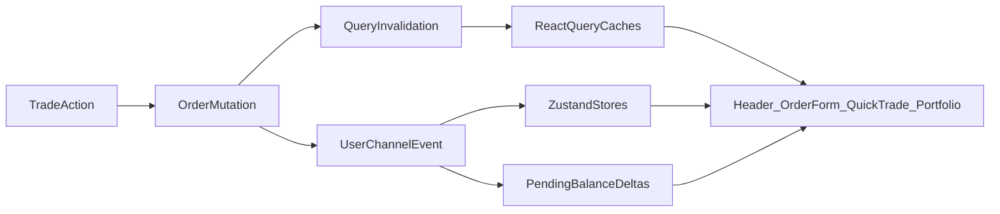

# Balance Sync Audit Plan

## Objective

Ensure balance-related data stays consistent across order entry, quick trade modal, and header/portfolio surfaces when trades occur (including fills, split/merge, redeem, and withdrawals).

## What I will audit and why

- Audit every balance consumer in the web app to ensure all user-visible balance surfaces are accounted for.
  - Primary files: [apps/web/src/components/layout/header-wallet-balance.tsx](/home/kaizen/dev/doji/apps/web/src/components/layout/header-wallet-balance.tsx), [apps/web/src/components/trading/orders/order-form.hooks.ts](/home/kaizen/dev/doji/apps/web/src/components/trading/orders/order-form.hooks.ts), [apps/web/src/components/market/instant-trade-popup.tsx](/home/kaizen/dev/doji/apps/web/src/components/market/instant-trade-popup.tsx), [apps/web/src/components/market/quick-sell-modal.tsx](/home/kaizen/dev/doji/apps/web/src/components/market/quick-sell-modal.tsx), [apps/web/src/app/portfolio/use-portfolio-data.ts](/home/kaizen/dev/doji/apps/web/src/app/portfolio/use-portfolio-data.ts)
- Audit all post-trade state propagation paths (mutation success handlers, invalidation utilities, polling, WebSocket stores) to find mismatch windows.
  - Primary files: [apps/web/src/lib/trpc/index.ts](/home/kaizen/dev/doji/apps/web/src/lib/trpc/index.ts), [apps/web/src/lib/trading/execute-market-order.ts](/home/kaizen/dev/doji/apps/web/src/lib/trading/execute-market-order.ts), [apps/web/src/hooks/use-user-channel.ts](/home/kaizen/dev/doji/apps/web/src/hooks/use-user-channel.ts), [apps/web/src/stores/pending-balance-deltas.ts](/home/kaizen/dev/doji/apps/web/src/stores/pending-balance-deltas.ts)
- Audit non-trade but balance-mutating flows (redeem/split/merge/withdraw) because they affect the same UI surfaces and can create hidden drift.
  - Primary files: [apps/web/src/hooks/use-split-merge.ts](/home/kaizen/dev/doji/apps/web/src/hooks/use-split-merge.ts), [apps/web/src/components/portfolio/redeem-tab.tsx](/home/kaizen/dev/doji/apps/web/src/components/portfolio/redeem-tab.tsx), [apps/web/src/hooks/use-redeem-positions.ts](/home/kaizen/dev/doji/apps/web/src/hooks/use-redeem-positions.ts), [apps/web/src/components/bridge/withdraw-flow.tsx](/home/kaizen/dev/doji/apps/web/src/components/bridge/withdraw-flow.tsx)

## Expected outcome

- A complete sync matrix of:
  - UI surface -> data source -> update trigger(s) -> known stale risk
- A prioritized list of concrete issues (highest user impact first), including where current invalidation scopes differ by flow.
- A remediation blueprint with clear implementation targets (no code changes in this phase), including a recommended single post-trade invalidation contract.

## Data flow map

## Deliverable format

- Findings grouped by severity (critical/high/medium), with exact file references.
- For each finding: trigger scenario, affected surfaces, root cause, and recommended fix path.

