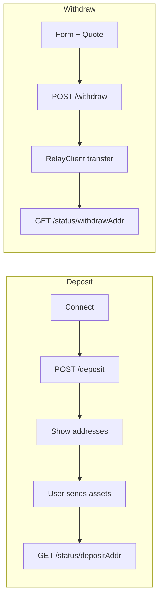

# Bridge implementation vs Polymarket docs – alignment and improvements

## Current alignment (already correct)

- **Deposit:** `POST /deposit` with `{ address }`; response `address: { evm, svm, btc, tvm? }`. We call on wallet connect and use the returned addresses. [apps/server/src/lib/polymarket/bridge.ts](apps/server/src/lib/polymarket/bridge.ts) and [apps/web/src/components/bridge/deposit-flow.tsx](apps/web/src/components/bridge/deposit-flow.tsx).
- **Withdraw:** `POST /withdraw` with `address`, `toChainId`, `toTokenAddress`, `recipientAddr`. We do **not** pre-generate; addresses are created on "Withdraw" click. One-click flow (get address → RelayClient transfer → track) is implemented. [apps/web/src/components/bridge/withdraw-flow.tsx](apps/web/src/components/bridge/withdraw-flow.tsx).
- **Quote:** Request params and response fields match the docs (`fromAmountBaseUnit`, `fromChainId`, `fromTokenAddress`, `recipientAddress`, `toChainId`, `toTokenAddress`; response `estToTokenBaseUnit`, `estCheckoutTimeMs`, `estInputUsd`, `estOutputUsd`, `estFeeBreakdown` with gasUsd, appFee*, fillCost*, maxSlippage, minReceived, swapImpact*, totalImpact*). [apps/server/src/lib/polymarket/schemas/bridge.ts](apps/server/src/lib/polymarket/schemas/bridge.ts), [apps/web/src/components/bridge/withdraw-quote-breakdown.tsx](apps/web/src/components/bridge/withdraw-quote-breakdown.tsx).
- **Status:** `GET /status/{address}`. We pass the **deposit or withdrawal address** (not the user wallet) to the status endpoint. Deposit flow uses `currentAddress` (from `depositAddresses[addressType]`); withdraw uses the generated withdraw address. Status enum matches: DEPOSIT_DETECTED, PROCESSING, ORIGIN_TX_CONFIRMED, SUBMITTED, COMPLETED, FAILED. [apps/web/src/lib/bridge/utils.ts](apps/web/src/lib/bridge/utils.ts) (labels/descriptions match doc).
- **Supported assets:** We consume `minCheckoutUsd`, token (name, symbol, address, decimals), chainId, chainName. Asset selector and withdraw flow show minimums and validate before submit.
- **Address types:** evm, svm, btc, tvm (optional) in schema and in `getAddressTypeForChain` for Tron. [apps/web/src/lib/bridge/utils.ts](apps/web/src/lib/bridge/utils.ts).
- **Large withdrawal:** Warning for >$50k with Uniswap/slippage note. [apps/web/src/components/bridge/withdraw-flow.tsx](apps/web/src/components/bridge/withdraw-flow.tsx) (lines 408–417).

---

## 1. Verify GET /supported-assets response shape

**Docs:** "Retrieve the full list of supported chains and tokens" but do not show whether the API returns a **raw array** or `{ supportedAssets: [...] }`.

**Current code:** [apps/server/src/lib/polymarket/bridge.ts](apps/server/src/lib/polymarket/bridge.ts) and [apps/server/src/lib/polymarket/schemas/bridge.ts](apps/server/src/lib/polymarket/schemas/bridge.ts) expect `SupportedAssetsResponseSchema` = `z.object({ supportedAssets: SupportedAssetsArraySchema })`, and we use `response.supportedAssets`.

**Risk:** If the Bridge API returns a bare array, validation fails and `getSupportedAssets()` throws.

**Action:** Call the live Bridge API once (or check Polymarket API reference / OpenAPI) to confirm response shape. If it is a raw array, normalize in the client: e.g. `const list = Array.isArray(json) ? json : json?.supportedAssets ?? [];` and validate each item with `SupportedAssetSchema`, then return the list. Update schema or bridge.ts accordingly so both shapes are accepted.

---

## 2. Status polling interval (docs: 10–30s)

**Docs:** "Poll every 10–30 seconds until COMPLETED or FAILED."

**Current code:**

- [apps/web/src/components/bridge/deposit-notification-card.tsx](apps/web/src/components/bridge/deposit-notification-card.tsx): `refetchInterval: 5000`
- [apps/web/src/components/bridge/withdraw-notification-card.tsx](apps/web/src/components/bridge/withdraw-notification-card.tsx): `refetchInterval: 5000`
- [apps/web/src/components/bridge/withdraw-status-tracker.tsx](apps/web/src/components/bridge/withdraw-status-tracker.tsx): dynamic `10_000` when no txs or non-terminal

**Action:** Move status poll interval to a single constant (e.g. in [apps/web/src/constants.ts](apps/web/src/constants.ts)) such as `BRIDGE_STATUS_POLL_MS = 15_000`, and use it in deposit-notification-card, withdraw-notification-card, and withdraw-status-tracker. This aligns with the doc range and slightly reduces load while keeping UX responsive.

---

## 3. Doc-recommended UX: warnings and links

**Unsupported token warning (Deposit):**  
Docs: "Sending unsupported tokens may cause **irrecoverable loss**. Always verify your token is listed in Supported Assets before depositing."

**Action:** In the deposit flow (e.g. [apps/web/src/components/bridge/deposit-flow.tsx](apps/web/src/components/bridge/deposit-flow.tsx)), add a short, visible note near the deposit address or asset selector: e.g. "Only send supported tokens to this address. Unsupported tokens may be lost. Check Supported Assets in the selector above."

**Deposit recovery (wrong token):**  
Docs: Ethereum deposits → [recovery.polymarket.com](https://recovery.polymarket.com/); Polygon deposits → [matic-recovery.polymarket.com](https://matic-recovery.polymarket.com/).

**Action:** In deposit flow or bridge page, add a small help line: "Sent the wrong token? [Ethereum recovery](https://recovery.polymarket.com/) · [Polygon recovery](https://matic-recovery.polymarket.com/)."

**Large deposits:**  
Docs: "For deposits over $50,000 originating from a chain other than Polygon, we recommend using a third-party bridge."

**Action:** Optional: in deposit flow, when the user has selected a chain other than Polygon, show a one-line note for large amounts (e.g. "For deposits over $50,000 from another chain, consider DeBridge, Across, or Portal to reduce slippage.") with links. Low priority if we want to keep deposit UI minimal.

---

## 4. Withdraw form UX (from existing audit)

[docs/WITHDRAW-UX-AUDIT.md](docs/WITHDRAW-UX-AUDIT.md) recommended:

- **"Use connected" for recipient:** Pre-fill recipient with the connected wallet (`safeAddress || address`) so users can withdraw to their own address on another chain without pasting.
- **"Max" for amount:** Button that sets amount to full available balance.

**Action:** In [apps/web/src/components/bridge/withdraw-flow.tsx](apps/web/src/components/bridge/withdraw-flow.tsx):

- Add a small "Use connected" control (e.g. button or link) next to the recipient input that sets `recipientAddress` to `walletAddress` when clicked.
- Next to the amount label/input, add a "Max" button that sets `setAmount(availableBalance != null ? availableBalance.toString() : "")` (with same formatting/decimals as display). Disable "Max" when `loadingBalance` or `availableBalance == null`.

---

## 5. Optional improvements

- **Quote breakdown:** We already show gasUsd, swapImpact, maxSlippage. Docs also define appFeeUsd, fillCostUsd, totalImpactUsd, minReceived. Optionally add these in the expandable section of [apps/web/src/components/bridge/withdraw-quote-breakdown.tsx](apps/web/src/components/bridge/withdraw-quote-breakdown.tsx) for power users.
- **WITHDRAW-UX-AUDIT.md:** Update the checklist to mark one-click Withdraw and Quote/breakdown as done; leave "Use connected" and "Max" as done after implementing them (or mark as optional if you decide to skip).

---

## 6. Summary diagram (no code change)

Our implementation follows this: deposit uses deposit address for status; withdraw generates address on action then transfers and tracks by that address.

---

## Implementation order

1. **Verify supported-assets response shape** (and normalize if needed) so we don’t break on API changes.
2. **Add `BRIDGE_STATUS_POLL_MS`** and use it in all three status-polling call sites.
3. **Deposit UX:** Unsupported-token warning + recovery links (and optionally large-deposit note).
4. **Withdraw UX:** "Use connected" and "Max" in withdraw-flow.
5. **Optional:** Extra fee breakdown fields; update WITHDRAW-UX-AUDIT.md.

No schema or API contract changes are required for the docs you provided; the main work is verification of supported-assets, aligning polling with the doc, and adding the recommended warnings and small UX improvements.
