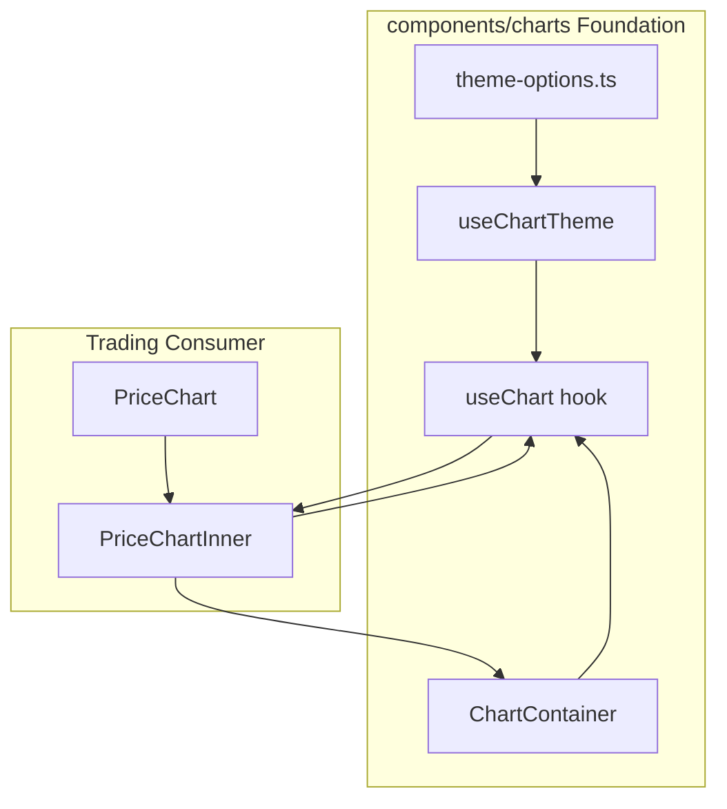

# Lightweight-Charts Foundation Plan

Layout-style plan for a new `components/charts/` directory that provides a reusable chart foundation using TradingView Lightweight Charts v5. Follows the layout foundation redesign structure: goals, domain context, roles, phases, and files.

---

## Goals and Success Criteria

**Goals**

1. **Single chart foundation** — One place for chart creation, theme options, resize handling, and cleanup. No ad-hoc `createChart` + `ResizeObserver` scattered across features.
2. **Role-based usage** — Low-level primitives (container, options, hooks) for power users; higher-level compositions (PriceChart, etc.) for domain features. Clear separation: foundation = engine, features = consumers.
3. **Theme-aware** — All chart options (grid, crosshair, text, series colors) derive from design tokens / next-themes. No hardcoded hex values in consumers.
4. **Framework-ready** — Proper React lifecycle (refs, effects, cleanup), Next.js dynamic import with `ssr: false`, and patterns for real-time data without re-render cascades.

**Success Criteria**

- Phase 1 done: Foundation components and hooks exist; theme utilities produce LWC options; `ChartContainer` + `useChart` pattern documented.
- Phase 2 done: Trading `PriceChart` uses the foundation; no duplicate createChart/resize logic; AGENTS.md documents usage.

---

## Domain Context: Prediction Markets and Trading Terminal

- **Data shape:** Polymarket uses trade-derived price points (time + value), not native OHLCV candles. Current chart is `AreaSeries` with `{ time, value }[]`.
- **Future needs:** Volume histogram (if we aggregate trades), multi-pane (price + volume + indicators), candlestick if candle data becomes available.
- **Indicators:** [lightweight-charts-indicators](references/lightweight-charts-indicators) expects `Bar[]` (OHLCV from oakscriptjs). Polymarket has no native bars — candle aggregation is a separate concern. Foundation should support both point-based (Area/Line) and bar-based (Candlestick, Histogram) series for future flexibility.
- **References:** Local source at [references/lightweight-charts](references/lightweight-charts) (v5.1); [references/lightweight-charts-indicators](references/lightweight-charts-indicators) for indicator patterns (ChartManager, overlay vs pane, `moveToPane`).

---

## Polymarket Data Validation

Data shapes and our mapping (validated against Polymarket docs). The chart foundation consumes **point-based** data `{ time: number, value: number }[]`; domain layers (e.g. `price-chart-utils`) handle API → LWC conversion.

### Historical (CLOB `/prices-history`)

| API      | Shape                                          | Our mapping                                                                 |
| -------- | ---------------------------------------------- | --------------------------------------------------------------------------- |
| Response | `{ history: [{ t: number, p: number }, ...] }` | `clob-read.ts` unwraps; returns `PriceHistoryPoint[]`                       |
| Point    | `t` = UTC Unix seconds, `p` = price            | `toChartData()` → `{ time: point.t, value: point.p }`                       |
| Schema   | —                                              | `PriceHistoryPointSchema` in `schemas/clob.ts` (`z.coerce.number` for t, p) |

Params: `market` (token ID), `interval` (1m, 1w, 1d, 6h, 1h, max), optional `startTs`/`endTs`/`fidelity`. Our intervals: 1h, 6h, 1d, 1w, max (no 1m).

### Real-time (WebSocket `last_trade_price`)

| API    | Shape                                                              | Our mapping                                                           |
| ------ | ------------------------------------------------------------------ | --------------------------------------------------------------------- |
| Event  | `timestamp`: string (Unix ms), `price`: string, `asset_id`: string | `parseInt(timestamp)/1000`; `parseFloat(price)`; filter by `assetIds` |
| Output | —                                                                  | `appendTradePoint(data, timestampSeconds, price)`                     |

### Documentation task

Add a "Data mapping" subsection to `components/charts/AGENTS.md` documenting: CLOB `{ t, p }` → LWC `{ time, value }`; `last_trade_price` → append point (ms→seconds). Reference `price-chart-utils.ts` for domain-specific conversion.

---

## Skills and Patterns

Per [mmt-tradingview-charts](.agents/skills/mmt-tradingview-charts):

- **Chart initialization:** [chart-initialization.md](.agents/skills/mmt-tradingview-charts/rules/chart-initialization.md) — `autoSize: true`, `ColorType.Solid`, container dimensions, `chart.remove()` on cleanup.
- **React integration:** [react-integration-patterns.md](.agents/skills/mmt-tradingview-charts/rules/react-integration-patterns.md) — create chart in `useEffect` with `[]`, store series in `useRef`, separate creation from data loading, `cancelled` flag for async, dynamic import with `ssr: false`.
- **Multi-pane:** LWC v5 has native panes: `series.moveToPane(index)` creates panes on demand; `chart.panes()`; `chart.addPane()`. No need for multiple `createChart` instances.

Per layout foundation and web component design:

- **Composition:** Compound components where appropriate; avoid boolean prop proliferation.
- **Tokens:** Use semantic design tokens from [apps/web/src/index.css](apps/web/src/index.css) (OKLCH, surface, text, border). Map to LWC `layout`, `grid`, `crosshair`, `rightPriceScale`, `timeScale` options.
- **Error boundaries:** Wrap chart components in error boundaries — canvas and external libs can fail.

---

## Foundation Roles (What We Need)

These are **responsibilities**, not fixed file names. Implement under `apps/web/src/components/charts/`.

### 2.1 Chart Theme (options from theme)

- **Responsibility:** Map resolved theme (light/dark) to LWC chart options. Single source of truth for background, text, grid, crosshair, scale borders, and semantic series colors (buy/sell, primary).
- **Behavior:** Function or hook that returns `DeepPartial<ChartOptions>` and series color sets. Consumes `useTheme()` from next-themes. Uses design tokens (CSS variables) where possible; fallbacks for LWC (which expects hex/rgba strings).
- **Implementation:** `getChartThemeOptions(theme: 'light' | 'dark')` and optionally `useChartTheme()`. Export types for partial overrides.

### 2.2 Chart Container (mount point + resize)

- **Responsibility:** Provides the DOM element for `createChart`, handles `ResizeObserver` (or relies on `autoSize: true`), and guarantees cleanup on unmount.
- **Behavior:** Renders a `div` with `className="h-full w-full"` and `style={{ minHeight }}`. Accepts `className`, `minHeight`. Does NOT create the chart — that is the hook’s job. Purely presentational.
- **Implementation:** `ChartContainer` — extends `ComponentProps<'div'>`; merges `cn()`; no ref forwarding needed if the hook receives a ref from the parent.

### 2.3 useChart Hook (lifecycle + refs)

- **Responsibility:** Creates chart on mount, applies theme options, returns chart ref. Handles cleanup. Separates chart creation (once) from data loading (effect keyed by deps).
- **Behavior:** `useChart(containerRef, options?)` — options merged with theme. Returns `chartRef`. Creation in `useEffect` with `[]`; theme changes in a separate effect. Cleanup: `chart.remove()`.
- **Implementation:** Follow [react-integration-patterns.md](.agents/skills/mmt-tradingview-charts/rules/react-integration-patterns.md). Store `IChartApi` in `useRef`.

### 2.4 useSeries Hook (optional; series creation)

- **Responsibility:** Add a series to a chart with typed options. Returns series ref. Handles removal on unmount or when series config changes.
- **Behavior:** `useSeries(chartRef, seriesType, options)` — creates series when chart exists, applies options. Cleanup: `chart.removeSeries(series)`.
- **Implementation:** Can be inlined in `useChart` or a separate hook. For Phase 1, a minimal `addSeries` helper may suffice; full hook in Phase 2 if we introduce multiple series per chart.

### 2.5 Base Chart Component (composition root)

- **Responsibility:** Composable root that combines container + useChart + optional children. Used by domain-specific charts (PriceChart, etc.) or as a low-level building block.
- **Behavior:** `Chart({ options, children, ...containerProps })`. Renders `ChartContainer`; inside, a child that receives `chartRef` via render prop or context. Alternatively: `Chart` provides context; `Chart.Series` (or similar) consumes it.
- **Implementation:** Phase 1 can use a simpler pattern: `ChartContainer` + `useChart` consumed by a wrapper. Phase 2 may add `ChartProvider` + `ChartContext` if compound composition is needed.

---

## When to Use

| Consumer                                  | Use                                                                                               |
| ----------------------------------------- | ------------------------------------------------------------------------------------------------- |
| Trading PriceChart                        | `ChartContainer` + `useChart` + `useChartTheme`; AreaSeries for now                               |
| Future: Volume chart                      | Same container + hook; add HistogramSeries                                                        |
| Future: Multi-pane (price + volume + RSI) | `useChart` + `series.moveToPane(1)` for volume/indicator panes                                    |
| Future: Indicators                        | When we have OHLCV data; lightweight-charts-indicators `calculate()` + LineSeries/HistogramSeries |

---

## Phase 1: Core Foundation

**Definition of done:** Chart theme utilities, `ChartContainer`, `useChart`, and `useChartTheme` exist. Barrel export. AGENTS.md documents usage. No migration of PriceChart yet.

### Tasks (execute in order)

1. **Add directory and theme utilities**
  - Create `apps/web/src/components/charts/`
  - Implement `theme-options.ts`: `getChartThemeOptions(theme)`, `getSeriesColors(theme)` (Area/Line, Candlestick up/down)
  - Map to design tokens; provide light and dark variants
2. **Implement ChartContainer**
  - Simple div with `h-full w-full`, `minHeight` prop, `className` merge via `cn()`
  - Export `ChartContainerProps`
3. **Implement useChart hook**
  - `useChart(containerRef, options?)` — merges theme options, creates chart on mount
  - `useChartTheme()` — wraps `useTheme()`, returns `getChartThemeOptions(resolvedTheme)`
  - useChart subscribes to theme and applies via `chart.applyOptions()` when theme changes
  - Cleanup: `chart.remove()`, `ResizeObserver.disconnect` (if not using autoSize) or rely on autoSize
4. **Implement useSeries helper (minimal)**
  - `addAreaSeries(chart, options)` or generic `addSeries(chart, SeriesType, options)` returning series ref
  - Used by PriceChartInner replacement in Phase 2
5. **Barrel and documentation**
  - `index.ts` exports: `ChartContainer`, `useChart`, `useChartTheme`, `getChartThemeOptions`, `getSeriesColors`
  - `AGENTS.md`: when to use, theme integration, usage examples, reference to mmt-tradingview-charts skill
  - `AGENTS.md` Data mapping subsection: CLOB `{ t, p }` → LWC `{ time, value }`; `last_trade_price` (ms→seconds); reference `trading/charts/price-chart-utils.ts` for domain conversion

---

## Phase 2: Migration and Enhancement

**Definition of done:** Trading `PriceChart` / `PriceChartInner` use the foundation. No duplicate theme or creation logic. Optional: extract `PriceChart` to consume from `components/charts/` or keep in `trading/charts` but use foundation internals.

### Tasks

1. **Refactor PriceChartInner**
  - Use `ChartContainer`, `useChart`, `useChartTheme`, `getSeriesColors`
  - Replace inline `getLayoutOptions`, `getGridOptions`, etc. with `getChartThemeOptions(theme)`
  - Keep AreaSeries and data update logic (setData/update) unchanged
  - Ensure dynamic import with `ssr: false` remains
2. **Update trading/charts imports**
  - PriceChart imports from `@/components/charts` for container/hook/theme
  - Or: PriceChart stays self-contained but its inner implementation uses the shared modules
3. **Optional: Multi-pane readiness**
  - Document how to add panes via `chart.addPane()` / `series.moveToPane()` for future volume/indicator use
  - No implementation required; readiness only

---

## File Summary

**Add (Phase 1)**

- `apps/web/src/components/charts/theme-options.ts` — Theme → LWC options
- `apps/web/src/components/charts/chart-container.tsx` — Container div
- `apps/web/src/components/charts/use-chart.ts` — useChart, useChartTheme
- `apps/web/src/components/charts/series.ts` — addSeries helper (optional, can live in use-chart)
- `apps/web/src/components/charts/index.ts` — Barrel
- `apps/web/src/components/charts/AGENTS.md` — Documentation

**Edit (Phase 2)**

- [apps/web/src/components/trading/charts/price-chart-inner.tsx](apps/web/src/components/trading/charts/price-chart-inner.tsx) — Use foundation
- [apps/web/AGENTS.md](apps/web/AGENTS.md) — Mention `components/charts` in project structure

---

## Indicators Reference (Future)

[lightweight-charts-indicators](references/lightweight-charts-indicators) provides 70+ indicators (SMA, EMA, RSI, MACD, etc.). They expect `Bar[]` (OHLCV). Polymarket does not have native candles; we would need:

1. Trade-to-candle aggregation (server or client)
2. Then: `calculateSMA(bars)`, `calculateRSI(bars)`, etc. → LineData / HistogramData for LWC

The foundation does NOT add lightweight-charts-indicators or oakscriptjs as dependencies in Phase 1. ChartManager’s `setIndicatorData`, `overlay`, `paneIndex`, and `moveToPane` patterns are useful references when we add indicators later.

---

## Architecture Diagram

