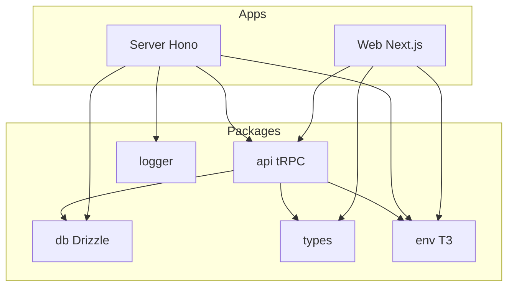

# Codebase Deep Audit

## Executive Summary

The Doji monorepo is well-structured with clear separation (apps/web, apps/server, packages). The audit identifies **formatting/utility duplication**, **logging inconsistencies**, **chain ID usage drift**, **LoadingSkeleton repetition**, and several **barrel-file vs code-standards** tensions. No critical architectural flaws; improvements are incremental and maintainability-focused.

---

## 1. DRY Violations — Formatting Utilities

### Problem

Multiple implementations of the same formatting logic across components:


| Function                | Canonical Location                                                                        | Duplicates                                                                                                                                                                                                            |
| ----------------------- | ----------------------------------------------------------------------------------------- | --------------------------------------------------------------------------------------------------------------------------------------------------------------------------------------------------------------------- |
| `formatVolume`          | [trading-utils.ts](apps/web/src/lib/trading-utils.ts)                                     | [event-card.tsx](apps/web/src/components/discovery/event-card.tsx) L199, [market-list.tsx](apps/web/src/components/event/market-list.tsx) L149, [live-volume.tsx](apps/web/src/components/market/live-volume.tsx) L12 |
| `formatEndDate`         | [trading-utils.ts](apps/web/src/lib/trading-utils.ts)                                     | [event-card.tsx](apps/web/src/components/discovery/event-card.tsx) L212                                                                                                                                               |
| `formatPrice` (cents)   | [trading-utils.ts](apps/web/src/lib/trading-utils.ts) `formatPriceCents`                  | [event-card.tsx](apps/web/src/components/discovery/event-card.tsx) L185 (inline `Math.round(price*100)¢`)                                                                                                             |
| `formatPrice` (decimal) | [position-table.tsx](apps/web/src/components/portfolio/position-table.tsx) L42            | Used by closed-positions; different semantics (decimal vs cents)                                                                                                                                                      |
| `formatPnl`             | [leaderboard-utils.ts](apps/web/src/lib/leaderboard-utils.ts) returns `{text, className}` | [position-table.tsx](apps/web/src/components/portfolio/position-table.tsx) L74 returns `string`; [profile-utils.ts](apps/web/src/lib/profile-utils.ts) has `formatProfilePnl`                                         |


### Recommendation

- **Consolidate** `formatVolume`, `formatEndDate`, `formatPriceCents` usage: replace inline implementations in event-card, market-list, live-volume with imports from `@/lib/trading-utils`.
- **Clarify** price semantics: `formatPriceCents` (0–1 → ¢) vs `formatPrice` (decimal display for positions). Add `formatPriceDecimal` to trading-utils if needed; keep position-table helpers only if they have portfolio-specific logic.
- **Unify** PnL formatting: either extend `leaderboard-utils.formatPnl` to support both `{text, className}` and plain string, or create a shared `formatPnl(value, options?)` in a new `lib/format.ts` and have leaderboard/profile/position-table use it.

---

## 2. LoadingSkeleton Duplication

### Problem

Six+ components define nearly identical `LoadingSkeleton` subcomponents:

- [activity-feed.tsx](apps/web/src/components/trading/activity/activity-feed.tsx) L44
- [whale-tracker.tsx](apps/web/src/components/trading/activity/whale-tracker.tsx)
- [position-table.tsx](apps/web/src/components/portfolio/position-table.tsx)
- [trade-history.tsx](apps/web/src/components/portfolio/trade-history.tsx)
- [closed-positions.tsx](apps/web/src/components/portfolio/closed-positions.tsx)
- [leaderboard/page.tsx](apps/web/src/app/leaderboard/page.tsx) `LeaderboardSkeleton`

### Recommendation

Create a shared `components/ui/loading-skeleton.tsx`:

```tsx
export function TableRowSkeleton({ rows = 5 }: { rows?: number }) {
  return (
    <div className="flex flex-col gap-1 p-3">
      {Array.from({ length: rows }, (_, i) => (
        <Skeleton className="h-8 w-full" key={i} />
      ))}
    </div>
  );
}
```

Use `TableRowSkeleton` (or variants like `CardGridSkeleton`) where appropriate. Route-level `loading.tsx` files can stay as-is (they are layout-specific).

---

## 3. Console Usage vs Code Standards

### Problem

[Code Standards](.agents/code-standards.md) state: *"No `console.log`, `debugger`, or `alert` in production code"*. Violations:


| File                                                                                 | Usage                                                          |
| ------------------------------------------------------------------------------------ | -------------------------------------------------------------- |
| [safe-onboarding.tsx](apps/web/src/components/onboarding/safe-onboarding.tsx)        | `console.warn`, `console.error`, `console.log` (6 occurrences) |
| [auth.ts](apps/server/src/routers/auth.ts)                                           | `console.error`                                                |
| [user-channel.ts](apps/web/src/lib/websocket/user-channel.ts)                        | `console.warn`                                                 |
| [manager.ts](apps/web/src/lib/websocket/manager.ts)                                  | `console.error`, `console.warn`                                |
| [market-channel.ts](apps/web/src/lib/websocket/market-channel.ts)                    | `console.warn`                                                 |
| [markets/page.tsx](apps/web/src/app/markets/page.tsx)                                | `console.error`                                                |
| [find-safe-address.ts](apps/web/src/lib/polymarket/find-safe-address.ts)             | `console.error`                                                |
| [login/callback/page.tsx](apps/web/src/app/login/callback/page.tsx)                  | `console.error`                                                |
| [baseline.ts](packages/db/src/baseline.ts), [migrate.ts](packages/db/src/migrate.ts) | `console.log` (CLI scripts — acceptable)                       |


### Recommendation

- **Web app**: Use `@doji/logger` or a small `lib/logger.ts` wrapper that uses `console` in dev and no-op in prod (or structured logging if available).
- **Server**: Already uses `@doji/logger`; replace `console.error` in auth router with `logger.error`.
- **CLI scripts** (db baseline, migrate): Keep `console.log` — these are run in terminal context.

---

## 4. Chain ID Inconsistency

### Problem

Two sources of truth for Polygon chain ID:

- `**@doji/types**`: `POLYGON_CHAIN_ID = 137` (constant)
- **Env**: `env.CHAIN_ID` (server), `env.NEXT_PUBLIC_CHAIN_ID` (web, string)

Usage:

- [clob-read.ts](apps/server/src/lib/polymarket/clob-read.ts): `POLYGON_CHAIN_ID` from types
- [clob router](apps/server/src/routers/clob.ts): `env.CHAIN_ID as Chain`
- [clob-factory](packages/api/src/lib/clob-factory.ts): `env.CHAIN_ID`
- Web: `POLYGON_CHAIN_ID` from types, or `Number(env.NEXT_PUBLIC_CHAIN_ID) || POLYGON_CHAIN_ID` in safe-onboarding

### Recommendation

- **Standardize**: Use `env.CHAIN_ID` (server) and `Number(env.NEXT_PUBLIC_CHAIN_ID)` (web) as the runtime source. Keep `POLYGON_CHAIN_ID` in types as a fallback/default only.
- **Document**: In `packages/env` AGENTS.md, state that `CHAIN_ID`/`NEXT_PUBLIC_CHAIN_ID` override `POLYGON_CHAIN_ID` when set.
- **Refactor** clob-read to use `env.CHAIN_ID` for consistency with other server CLOB usage.

---

## 5. Barrel Files vs Code Standards

### Problem

[Code Standards](.agents/code-standards.md): *"No barrel files (index re-exports)"*.

Packages use barrel files extensively:

- [packages/types/src/index.ts](packages/types/src/index.ts): `export * from "./auth"`, etc.
- [packages/db/src/index.ts](packages/db/src/index.ts): re-exports schema, queries
- [packages/api/src/index.ts](packages/api/src/index.ts): re-exports router, procedures
- [packages/api/src/lib/clob/index.ts](packages/api/src/lib/clob/index.ts)

### Recommendation

- **Clarify** the rule: Interpret "no barrel files" as applying to **app code** (apps/web, apps/server), not to **shared packages**. Packages benefit from a single entry point for consumers.
- **Optionally** add a note to code-standards: *"Avoid barrel files in app code; prefer direct imports. Packages may use index.ts for public API."*

---

## 6. tRPC Import Path

### Problem

Web app imports `AppRouter` from `"server/routers/index"`:

```ts
import type { AppRouter } from "server/routers/index";
```

This works via `"server": "workspace:*"` in web's package.json (resolves to apps/server). The path is non-obvious and differs from typical `@/` or `@doji/` patterns.

### Recommendation

- **Option A**: Add path alias in web tsconfig: `"@server/*": ["../server/src/*"]` and use `import type { AppRouter } from "@server/routers/index"`.
- **Option B**: Keep as-is but document in web AGENTS.md that `server` is a workspace package alias.
- **Low priority** — current setup works; improve only if it causes confusion.

---

## 7. File Size and Complexity

### Problem

Code standards suggest 1600-line max; some files approach or exceed maintainability thresholds:


| File                                                                              | Lines | Notes                                                               |
| --------------------------------------------------------------------------------- | ----- | ------------------------------------------------------------------- |
| [safe-onboarding.tsx](apps/web/src/components/onboarding/safe-onboarding.tsx)     | 670   | Complex flow; consider extracting steps into subcomponents          |
| [gamma.ts](apps/server/src/lib/polymarket/gamma.ts)                               | 726   | Many endpoints; could split by domain (events, markets, tags, etc.) |
| [clob.ts](apps/server/src/routers/clob.ts)                                        | 652   | Large router; consider splitting into sub-routers                   |
| [order-form.hooks.ts](apps/web/src/components/trading/orders/order-form.hooks.ts) | 552   | Dense; extract validation or side-effect logic                      |


### Recommendation

- **safe-onboarding**: Extract `DeployStep`, `RegisterStep`, `SearchStep` as separate components; keep orchestration in parent.
- **gamma.ts**: Split into `gamma-events.ts`, `gamma-markets.ts`, `gamma-tags.ts` with a thin `gamma.ts` re-exporting.
- **clob router**: Consider `clob-orders.ts`, `clob-book.ts` sub-routers merged in index.
- **order-form.hooks**: Extract `useOrderValidation` and `useOrderSubmission` if they exceed ~150 lines each.

---

## 8. Naming and Structure

### Minor Inconsistencies

- `**ORDER_CHAIN_ID**` in [order-utils.ts](apps/web/src/lib/polymarket/order-utils.ts): Alias for `POLYGON_CHAIN_ID`; redundant. Use `POLYGON_CHAIN_ID` directly.
- **Two `ActivityFeed` components**: [trading/activity/activity-feed.tsx](apps/web/src/components/trading/activity/activity-feed.tsx) (market trades) vs [portfolio/activity-feed.tsx](apps/web/src/components/portfolio/activity-feed.tsx) (user activity). Consider renaming to `MarketActivityFeed` and `PortfolioActivityFeed` to avoid confusion.
- `**formatProfilePnl` vs `formatPnl**`: profile-utils and leaderboard-utils have similar but not identical PnL formatting. Unify into one helper with options.

---

## 9. Test and Dev Artifacts

- [manual-test.ts](apps/server/src/__tests__/manual-test.ts): Contains `console.log`; either move to a `scripts/` folder or add a `// manual test` header and exclude from lint.
- [endpoints.test.ts](apps/server/src/__tests__/integration/endpoints.test.ts): Has `console.log` in test — acceptable for debugging; consider removing before merge or gating behind `process.env.DEBUG`.

---

## 10. Architecture Diagram




---

## Priority Matrix


| Priority | Category                                                  | Effort  | Impact |
| -------- | --------------------------------------------------------- | ------- | ------ |
| High     | Formatting DRY (formatVolume, formatEndDate, formatPrice) | Medium  | High   |
| High     | Console → Logger                                          | Low     | Medium |
| Medium   | LoadingSkeleton extraction                                | Low     | Medium |
| Medium   | Chain ID standardization                                  | Low     | Low    |
| Low      | Barrel file clarification                                 | Trivial | Low    |
| Low      | File splits (gamma, clob, safe-onboarding)                | High    | Medium |
| Low      | Naming (ActivityFeed, ORDER_CHAIN_ID)                     | Low     | Low    |


---

## Suggested Implementation Order

1. **Phase 1 (Quick wins)**: Replace console with logger; consolidate formatVolume/formatEndDate in event-card and market-list.
2. **Phase 2 (DRY)**: Create shared LoadingSkeleton; unify formatPnl; remove ORDER_CHAIN_ID alias.
3. **Phase 3 (Structure)**: Split gamma.ts; extract safe-onboarding steps; clarify barrel file rule.
4. **Phase 4 (Polish)**: Chain ID env consistency; ActivityFeed renaming; tRPC path alias (optional).

