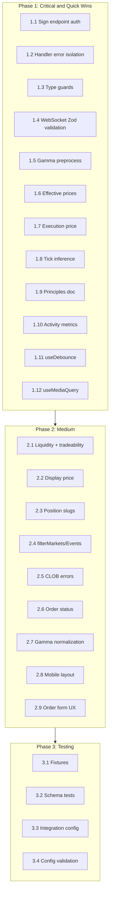

# Doji Master Improvement Plan

Synthesized from 13 reference audits (excluding trpc). Prioritized by impact, effort, and cross-audit consensus.

---

## Phase 1: Critical & Quick Wins (1-2 weeks)

### 1.1 Security: Protect Builder Sign Endpoint (CRITICAL)

**Source:** [polys_reference_audit](.cursor/plans/polys_reference_audit_27afbf4a.plan.md)

The sign route at `apps/server/src/routes/polymarket/sign.ts` has **no authentication**. Any caller who can reach the server can obtain builder signatures.

**Action:**

- Add Bearer token auth middleware to `/api/polymarket/sign`
- Env var `POLYMARKET_SIGN_TOKENS` (comma-separated valid tokens)
- Reject with 401 if `Authorization: Bearer <token>` missing or invalid
- Document in env schema and builder-signing docs

**Files:** [sign.ts](apps/server/src/routes/polymarket/sign.ts), [packages/env](packages/env), middleware

---

### 1.2 WebSocket: Handler Error Isolation (Low effort, High impact)

**Source:** [poly-websockets_reference_audit](.cursor/plans/poly-websockets_reference_audit_96dbdbd1.plan.md)

A single handler throw can break the loop and prevent other handlers from receiving events.

**Action:** Wrap each handler invocation in try-catch in [market-channel.ts](apps/web/src/lib/websocket/market-channel.ts); log and continue.

---

### 1.3 WebSocket: Type Guards for Events (Low effort)

**Sources:** [poly-websockets_reference_audit](.cursor/plans/poly-websockets_reference_audit_96dbdbd1.plan.md), [polymarket-kit_audit_ideas](.cursor/plans/polymarket-kit_audit_ideas_e5c1d55f.plan.md)

**Action:** Add and export type guards in [packages/types/src/websocket.ts](packages/types/src/websocket.ts): `isBookEvent`, `isLastTradePriceEvent`, `isPriceChangeEvent`, `isTickSizeChangeEvent`. Use in market-channel and hooks.

---

### 1.4 WebSocket: Message Validation (Zod) (High value)

**Source:** [polymarket-kit_audit_ideas](.cursor/plans/polymarket-kit_audit_ideas_e5c1d55f.plan.md)

**Action:** Add Zod schemas for market channel messages (book, price_change, last_trade_price, tick_size_change). Use `safeParseMarketChannelMessage` before dispatching; on failure, log and optionally call `onError` instead of passing invalid data through.

**Files:** New `apps/web/src/lib/websocket/schemas.ts` (or `packages/types`), [manager.ts](apps/web/src/lib/websocket/manager.ts) / [market-channel.ts](apps/web/src/lib/websocket/market-channel.ts)

---

### 1.5 Gamma: Zod Preprocess for Polymorphic Fields (High value)

**Source:** [pmkt_reference_audit](.cursor/plans/pmkt_reference_audit_2e2e5d5c.plan.md)

Gamma API returns `outcomes` / `outcomePrices` / `clobTokenIds` as JSON string or array inconsistently.

**Action:** Add `jsonStringOrArray` preprocessor in [schemas/gamma.ts](apps/server/src/lib/polymarket/schemas/gamma.ts); use for these fields in MarketSchema. Simplify or drop `synthesizeTokens` in [gamma.ts](apps/server/src/lib/polymarket/gamma.ts).

---

### 1.6 CLOB: Effective Prices and Arbitrage Helpers (Low effort)

**Source:** [poly_sdk_audit_ideas](.cursor/plans/poly_sdk_audit_ideas.plan.md)

Orderbook mirror: Buy YES @ P = Sell NO @ (1-P). Raw `yesAsk + noAsk` double-counts.

**Action:** Add `getEffectivePrices(yesAsk, yesBid, noAsk, noBid)` and `checkArbitrage(...)` in [packages/clob](packages/clob) (or shared util). Use in market UI and order preview.

---

### 1.7 CLOB: Execution Price from Order Book (Low effort)

**Source:** [pmxt_reference_audit](.cursor/plans/pmxt_reference_audit_fbbccee0.plan.md)

**Action:** Add `getExecutionPrice(orderBook, side, amount)` (volume-weighted avg) in packages/clob or shared util. Expose for order preview ("expected fill").

---

### 1.8 CLOB: Tick-Size Inference (Low effort)

**Source:** [pmxt_reference_audit](.cursor/plans/pmxt_reference_audit_fbbccee0.plan.md)

**Action:** Add `inferTickSize(orderBook): string` in [packages/clob](packages/clob). Use when tick size not provided in order placement.

---

### 1.9 Polymarket Principles Doc (Low effort, High long-term)

**Source:** [poly_sdk_audit_ideas](.cursor/plans/poly_sdk_audit_ideas.plan.md)

**Action:** Add `docs/polymarket-principles.md` (or `.agents/`): USDC.e for CTF, token IDs from CLOB, orderbook mirror and effective prices, dynamic outcome names, neg-risk. Link from AGENTS.md.

---

### 1.10 Activity Volume Metrics (Low effort)

**Source:** [polyme_reference_audit](.cursor/plans/polyme_reference_audit_7c4d38ef.plan.md)

**Action:** Add `activityVolumeMetrics(activities)` util (buy total, redeem total, difference). Surface summary on portfolio or activity view via existing `trpc.data.activity`.

---

### 1.11 useDebounce Hook (Low effort)

**Source:** [polyme_reference_audit](.cursor/plans/polyme_reference_audit_7c4d38ef.plan.md)

**Action:** Add `useDebounce<T>(value: T, delay: number): T` in [apps/web/src/hooks](apps/web/src/hooks). Use for address/search inputs that trigger fetches.

---

### 1.12 useMediaQuery Hook (Low effort)

**Source:** [polymarket-ui-sdk_audit](.cursor/plans/polymarket-ui-sdk_audit_115adc0d.plan.md)

**Action:** Add generic `useMediaQuery(query: string): boolean`. Refactor `useIsMobile()` to use it. Enables mobile layout in TradingLayout.

---

## Phase 2: Medium Effort, High Value (2-4 weeks)

### 2.1 Liquidity Metrics and Tradeability Cache

**Source:** [betmirror_audit_ideas](.cursor/plans/betmirror_audit_ideas_bc9a894c.plan.md)

- **Liquidity metrics:** `getLiquidityMetrics(tokenId)` — health, spread, spreadPercent, availableDepthUsd, bestPrice from order book
- **Tradeability cache:** `MarketTradeabilityCache` with 5-min cooldown for invalid token IDs to avoid repeated 404s

**Files:** `apps/server/src/lib/polymarket/liquidity-metrics.ts`, `tradeability-cache.ts`

---

### 2.2 Polymarket Display Price (Future Price Logic)

**Source:** [poly-websockets_reference_audit](.cursor/plans/poly-websockets_reference_audit_96dbdbd1.plan.md)

Polymarket rule: `displayPrice = spread > 0.1 ? lastTradePrice : midpoint`

**Action:** Add derived `displayPrice` in orderbook store; use in header, chart label, order form default.

---

### 2.3 Enriched Positions with Slugs

**Source:** [betmirror_audit_ideas](.cursor/plans/betmirror_audit_ideas_bc9a894c.plan.md)

**Action:** Add Gamma + CLOB slug-enrichment for positions; extend Position/DataPosition with `marketSlug`, `eventSlug` for deep links to polymarket.com.

---

### 2.4 filterMarkets / filterEvents

**Source:** [pmxt_reference_audit](.cursor/plans/pmxt_reference_audit_fbbccee0.plan.md)

**Action:** Add `filterMarkets(markets, criteria)` and `filterEvents(events, criteria)` — string, criteria object (volume, liquidity, resolution date ranges), or predicate. Use in tRPC procedures or client-side filtering.

---

### 2.5 CLOB / Polymarket Error Mapping

**Sources:** [polys_reference_audit](.cursor/plans/polys_reference_audit_27afbf4a.plan.md), [poly_sdk_audit_ideas](.cursor/plans/poly_sdk_audit_ideas.plan.md), [pmxt_reference_audit](.cursor/plans/pmxt_reference_audit_fbbccee0.plan.md)

**Action:** Add `ClobError` (and subtypes/codes) in packages/clob; map CLOB HTTP/API errors to typed errors with `retryable` flag. Use in retry logic and UI error messages.

---

### 2.6 Internal Order Status Model

**Source:** [poly_sdk_audit_ideas](.cursor/plans/poly_sdk_audit_ideas.plan.md)

**Action:** Add internal 7-state order status (PENDING, OPEN, PARTIALLY_FILLED, FILLED, CANCELLED, EXPIRED, REJECTED) with mapping from CLOB API statuses. Add `isTerminalStatus`, `canOrderBeCancelled` helpers. Use in order list and cancel button state.

---

### 2.7 Gamma Response Normalization

**Source:** [polymarket-kit_audit_ideas](.cursor/plans/polymarket-kit_audit_ideas_e5c1d55f.plan.md)

**Action:** Normalize `outcomes`, `outcomePrices`, `clobTokenIds` to arrays at Gamma client boundary (after fetch/validate). Narrow return types for normalized shape.

---

### 2.8 Mobile Trading Layout

**Source:** [polymarket-ui-sdk_audit](.cursor/plans/polymarket-ui-sdk_audit_115adc0d.plan.md)

**Action:** In [TradingLayout](apps/web/src/components/trading/trading-layout.tsx), use useMediaQuery for mobile: single column + sticky bottom bar or sheet with "Buy Yes" / "Buy No"; tap opens full OrderForm in Sheet.

---

### 2.9 Order Form UX Improvements

**Source:** [polymarket-ui-sdk_audit](.cursor/plans/polymarket-ui-sdk_audit_115adc0d.plan.md)

**Action:** Yes/No outcome toggle; optional Market vs Limit; quick amount buttons (+10, +50, +100, Max for buy; 25%, 50%, Max for sell); config for labels/disclaimer.

---

## Phase 3: Testing & Quality (ongoing)

### 3.1 Centralized Test Fixtures

**Source:** [pmkt_reference_audit](.cursor/plans/pmkt_reference_audit_2e2e5d5c.plan.md)

**Action:** Add `apps/server/src/lib/polymarket/__tests__/fixtures/` with `events.ts`, `markets.ts`, `comments.ts`, `tags.ts` (valid + invalid payloads). Use in unit and integration tests.

---

### 3.2 Schema Unit Tests with Fixtures

**Source:** [pmkt_reference_audit](.cursor/plans/pmkt_reference_audit_2e2e5d5c.plan.md)

**Action:** Add explicit schema tests: `safeParse(validFixture)` succeeds, `safeParse(invalidFixture)` fails. Document expected contract.

---

### 3.3 Integration Vitest Config

**Source:** [pmkt_reference_audit](.cursor/plans/pmkt_reference_audit_2e2e5d5c.plan.md)

**Action:** Add `vitest.integration.config.mts` for `*.integration.test.*` with node env, 30s timeout, retry 2. Script `pnpm test:integration`.

---

### 3.4 Config Validation at Startup

**Source:** [polys_reference_audit](.cursor/plans/polys_reference_audit_27afbf4a.plan.md)

**Action:** Extend server env schema for builder credentials and sign-endpoint tokens. Validate at startup; fail fast if builder sign enabled but credentials invalid.

---

## Phase 4: Optional / Larger Features

- **Trader scoring engine** (polyscope): Server-side scorer + tRPC `analyzeTrader` + profile section — high value but larger scope
- **Source/API status pills** (kBet): Compact status bar for Gamma/CLOB/Data/WS — low effort
- **Refresh for event list** (pmkt): Single refresh that refetches first page and resets
- **Shared formatting helpers** (pmkt): formatVolume, formatEndDate, formatPrice in `apps/web/src/lib/format.ts`
- **Connection timeout + ping jitter** (poly-websockets): 30s connection timeout; ping jitter to avoid thundering herd
- **Close when no subscriptions** (poly-websockets): Disconnect when last subscription removed
- **API types polish** (polymarket_api_types): Strict `0x${string}` where guaranteed; ImageOptimized naming; Array&lt;T&gt; consistency

---

## Implementation Order Summary

---

## Key Files

| Area       | Primary Files                                                                                                                                           |
| ---------- | ------------------------------------------------------------------------------------------------------------------------------------------------------- |
| Security   | [sign.ts](apps/server/src/routes/polymarket/sign.ts), [packages/env](packages/env)                                                                      |
| WebSocket  | [apps/web/src/lib/websocket/](apps/web/src/lib/websocket/), [packages/types/src/websocket.ts](packages/types/src/websocket.ts)                          |
| CLOB       | [packages/clob](packages/clob)                                                                                                                          |
| Gamma      | [apps/server/src/lib/polymarket/gamma.ts](apps/server/src/lib/polymarket/gamma.ts), [schemas/gamma.ts](apps/server/src/lib/polymarket/schemas/gamma.ts) |
| Hooks      | [apps/web/src/hooks](apps/web/src/hooks)                                                                                                                |
| Trading UI | [apps/web/src/components/trading](apps/web/src/components/trading)                                                                                      |

