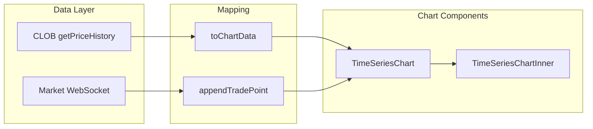
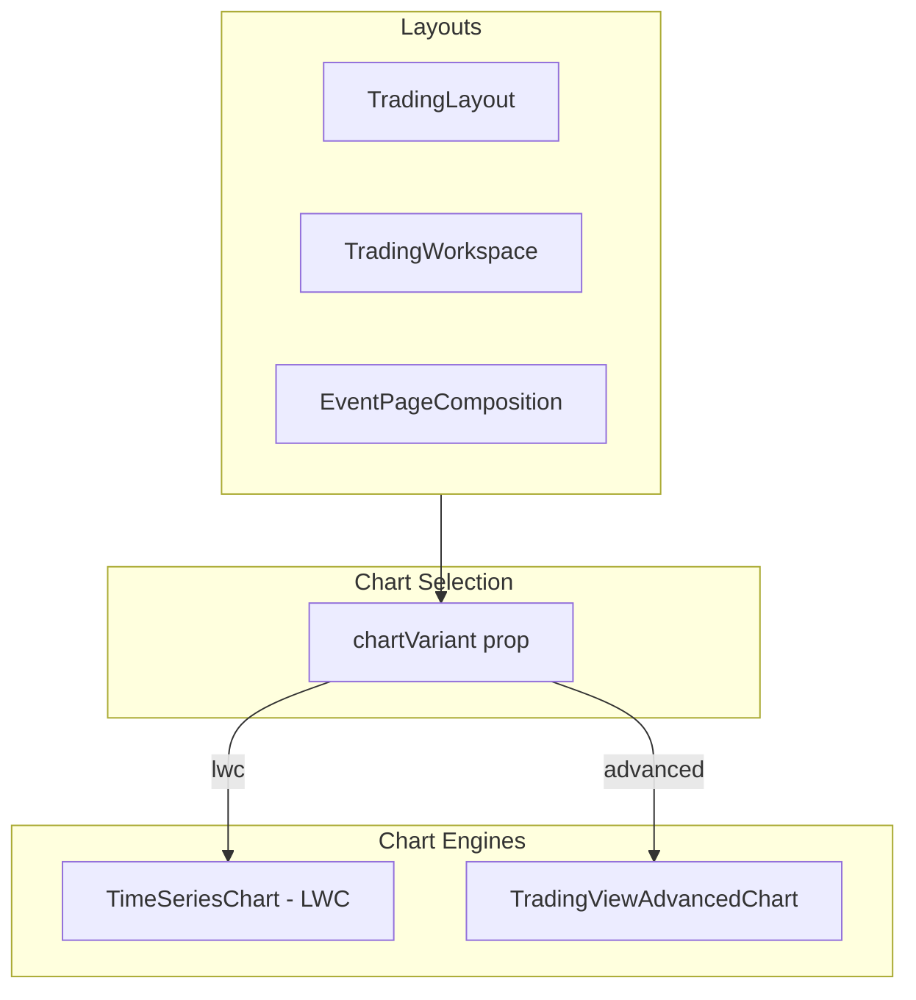
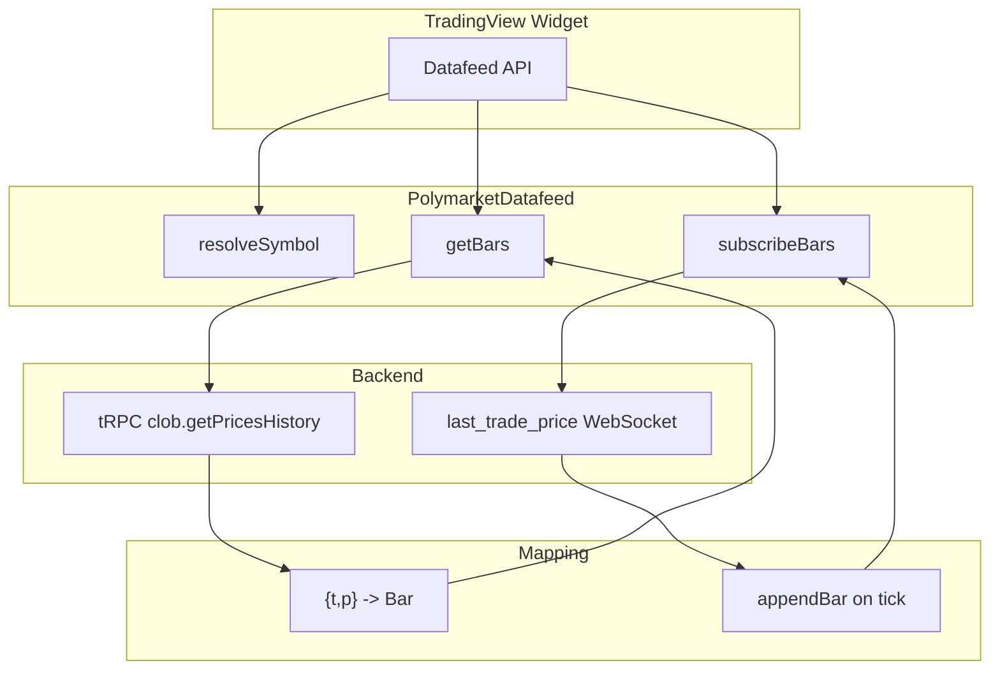

# Dual Chart Engine Support Plan

## Current State

- **Charts location:** [apps/web/src/components/charts/](apps/web/src/components/charts/)
- **LWC usage:** `TimeSeriesChart` wraps `TimeSeriesChartInner` (lightweight-charts). Used in `TradingLayout`, `TradingWorkspace`, and `EventPageComposition`.
- **Data flow:** tRPC `clob.getPricesHistory` → CLOB `{ t, p }[]` → `toChartData()` → LWC `{ time, value }[]`; real-time via `last_trade_price` WebSocket → `appendTradePoint`.

## Target Architecture

Two chart components with a shared props contract. Layouts decide which to render via a prop.

TradingView data flow (datafeed bridges library requests to Polymarket backend):

## Implementation Tasks

| ID     | Task                           | Depends    | Deliverables                                                                                         |
| ------ | ------------------------------ | ---------- | ---------------------------------------------------------------------------------------------------- |
| **T1** | TradingView setup              | —          | Access requested; copy script run; `public/static/charting_library/` + `public/static/datafeeds/`    |
| **T2** | Shared types & props           | —          | `ChartVariant`, `PolymarketChartProps`; exports in `charts/index.ts`                                 |
| **T3** | TradingViewAdvancedChart shell | T1         | `tradingview-advanced-chart.tsx`; dynamic import + client-only; mock datafeed; min 500×500 container |
| **T4** | Polymarket datafeed            | T3         | `polymarket-datafeed.ts`: resolveSymbol, getBars, subscribeBars, unsubscribeBars; tRPC + WebSocket   |
| **T5** | ChartSlot + layout wiring      | T2, T3, T4 | `chart-slot.tsx`; `chartVariant` on TradingLayout, TradingWorkspace, EventPageComposition            |
| **T6** | Docs & cache                   | T5         | AGENTS.md; `charting_library.js` cache headers in next.config                                        |

**Order:** T1 || T2 → T3 → T4 → T5 → T6

## File Changes Summary

| File                                                            | Task   | Action                                               |
| --------------------------------------------------------------- | ------ | ---------------------------------------------------- |
| `apps/web/public/static/charting_library/`                      | T1     | Add (via copy script; do not commit to public repos) |
| `apps/web/public/static/datafeeds/`                             | T1     | Add (via copy script)                                |
| `apps/web/src/components/charts/types.ts`                       | T2     | **New** — ChartVariant, PolymarketChartProps         |
| `apps/web/src/components/charts/index.ts`                       | T2, T5 | Export types, ChartSlot, TradingViewAdvancedChart    |
| `apps/web/src/components/charts/tradingview-advanced-chart.tsx` | T3     | **New** — widget wrapper                             |
| `apps/web/src/components/charts/polymarket-datafeed.ts`         | T4     | **New** — custom datafeed                            |
| `apps/web/src/components/charts/chart-slot.tsx`                 | T5     | **New** — variant switcher                           |
| `apps/web/src/components/trading/trading-layout.tsx`            | T5     | Add chartVariant prop                                |
| `apps/web/src/components/trading/trading-workspace.tsx`         | T5     | Add chartVariant prop                                |
| `apps/web/src/components/event/event-page-composition.tsx`      | T5     | Add chartVariant prop                                |
| `apps/web/next.config.ts`                                       | T6     | Cache headers for charting_library.js                |
| `apps/web/AGENTS.md`                                            | T6     | Document dual-engine support                         |

## Reference & Integration Patterns

**Local reference:** [references/charting-library-examples/nextjs/](references/charting-library-examples/nextjs/)

**Patterns to reuse (adapt for App Router):**

- **Dynamic import:** `dynamic(() => import(...).then(m => m.TradingViewAdvancedChart), { ssr: false })`
- **Copy script:** [nextjs/copy_charting_library_files.sh](references/charting-library-examples/nextjs/copy_charting_library_files.sh) clones charting_library repo, copies to `public/static/`
- **library_path:** `/static/charting_library/` (no trailing slash in datafeed URL if using UDF; we use custom datafeed)
- **App Router:** Use `'use client'` for TV chart component; dynamic import + Script (if needed) work in App Router

**Note:** Custom datafeed does not need UDF bundle; implement Datafeed API directly (no `Datafeeds.UDFCompatibleDatafeed`).

## Task Details

### T1 — TradingView Setup

- [Request access](https://www.tradingview.com/HTML5-stock-forex-bitcoin-charting-library/?feature=technical-analysis-charts)
- Run copy script (or NPM postinstall) to place `charting_library` + `datafeeds` in `public/static/`
- Library is **not redistributable**; do not commit to public repos

### T2 — Shared Types

- `ChartVariant = "lwc" | "advanced"`
- `PolymarketChartProps` (or align `TimeSeriesChartProps`) with `tokenId`, `assetIds`, `initialData`, `closed`

### T3 — TradingViewAdvancedChart Shell

- Widget Constructor, container div, `library_path`, `datafeed`
- Mock datafeed: resolveSymbol returns minimal LibrarySymbolInfo; getBars returns empty or fake bars
- `debug: true` in dev; container min 500×500 px

### T4 — Polymarket Datafeed

- **resolveSymbol:** LibrarySymbolInfo with `pricescale: 100`, `session: "24x7"`, `timezone: "Etc/UTC"`, `visible_plots_set: "c"`, `exchange`/`listed_exchange` set
- **getBars:** Call tRPC `clob.getPricesHistory`; map `{ t, p }[]` to `{ time, open, high, low, close }` with `open = high = low = close = p`; set `noData: true` when no more history; invoke callbacks asynchronously; pass copies of data
- **subscribeBars / unsubscribeBars:** Subscribe to `last_trade_price` WebSocket; only update last bar or add new bar; track listener by symbol+resolution

### T5 — ChartSlot + Layouts

- `ChartSlot`: `chartVariant` + `...chartProps`; renders TimeSeriesChart or TradingViewAdvancedChart
- Add `chartVariant?: ChartVariant` to layout props; default `"lwc"`

### T6 — Docs & Cache

- Set minimum cache expiration for `charting_library.js` (no hash; stale cache breaks updates)
- Document dual-engine support in AGENTS.md

## Appendix — Key TradingView Notes

**Datafeed methods (required):** `onReady`, `resolveSymbol`, `getBars`, `subscribeBars`, `unsubscribeBars`. See [Datafeed API](https://www.tradingview.com/charting-library-docs/latest/connecting_data/Datafeed-API).

**Symbology for Polymarket:** `pricescale: 100` (0.01), `session: "24x7"`, `timezone: "Etc/UTC"`, `visible_plots_set: "c"`, `exchange`/`listed_exchange` required to avoid "undefined" in Object tree.

**Common issues:** Invoke callbacks asynchronously; pass copies of data; set `noData: true` when no more history; bar `time` = start of interval; only update last bar or add new in subscribeBars.

**Bar format:** `open = high = low = close = p`. Bar `time` in UTC seconds; DWM bars use start of day 00:00 UTC.

**Widget options:** `theme` (sync with `useTheme()`), `mainSeriesProperties.style: 2` for Area, `disabled_features` for `header_symbol_search`, `create_volume_indicator_by_default`, etc.

**Full docs:** [TradingView Charting Library](https://www.tradingview.com/charting-library-docs/latest/)

## Open Questions

- **Use case:** Which routes or features should use Advanced Charts (e.g. fullscreen chart view, event-level comparison of multiple outcomes)? This affects where `chartVariant="advanced"` is passed.

