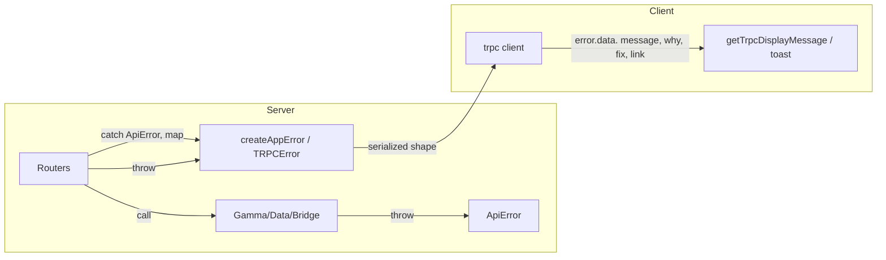

# Error Handling Audit and Improvement Plan

## Current state (audit summary)

### Three distinct error layers

| Layer                   | Location                                                                                                                                                               | Purpose                                                                                                                                |
| ----------------------- | ---------------------------------------------------------------------------------------------------------------------------------------------------------------------- | -------------------------------------------------------------------------------------------------------------------------------------- |
| **App/TRPC**            | [packages/api/src/lib/errors.ts](packages/api/src/lib/errors.ts), [packages/api/src/trpc.ts](packages/api/src/trpc.ts)                                                 | `createAppError(why, fix, link)` → TRPCError; formatter puts `zodError`, `why`, `fix`, `link` in `shape.data`                          |
| **Polymarket upstream** | [apps/server/src/lib/errors.ts](apps/server/src/lib/errors.ts), [apps/server/src/lib/polymarket/resilient-fetch.ts](apps/server/src/lib/polymarket/resilient-fetch.ts) | `ApiError` (NETWORK, AUTH, RATE_LIMIT, etc.) with `retryable`, `retryDelayMs`; used by gamma, data, bridge, circuit-breaker            |
| **Web**                 | Ad-hoc in components/hooks                                                                                                                                             | Local `extractErrorMessage`, `toOrderError`, `getUserMessage` (Magic); global `QueryCache.onError` → `toast.error(error.message)` only |

### Gaps and inconsistencies

1. **Rich app errors unused on client**
  Server uses `createAppError` in [auth](apps/server/src/routers/auth.ts) and [clob](apps/server/src/routers/clob.ts) (e.g. regional restriction, invalid signature) and tRPC formatter exposes `why`/`fix`/`link` in `error.data`, but the web app **never reads** `error.data` — only `error.message`. So structured UX (why/fix/link) is built but not consumed.
2. **Upstream ApiError reaches client as generic message**
  [markets](apps/server/src/routers/markets.ts), [events](apps/server/src/routers/events.ts), [data](apps/server/src/routers/data.ts), [bridge](apps/server/src/routers/bridge.ts) do not catch `ApiError`. When Polymarket clients throw (e.g. network, 5xx), tRPC serializes it as INTERNAL_SERVER_ERROR with `ApiError.message` (often technical: e.g. "gamma API network error for /markets: fetch failed"). Users see internal-style messages; no user-friendly copy or retry guidance.
3. **No shared, tRPC-aware display helper on client**
  [order-form.hooks.ts](apps/web/src/components/trading/orders/order-form.hooks.ts) has a local `extractErrorMessage(err)` that only checks `Error.message` and axios-style `response.data.error`; it does not handle tRPC error shape (`TRPCClientError` with `error.data.message`, `error.data.why`, etc.). Other call sites use `error.message` or `getUserMessage(err)` (Magic-only). No single place that: prefers `error.data?.message`, then `error.message`, and optionally uses `why`/`fix` for descriptions.
4. **Duplicated error boundaries**
  Six [error.tsx](apps/web/src/app/error.tsx) files (root, portfolio, bridge, market/[slug], leaderboard, profile/[address]) are nearly identical: title string + `error.message` + "Try again" button. No shared component; small copy changes (e.g. "Failed to load market" vs "Failed to load portfolio") could be a prop.
5. **Inconsistent handling patterns**
  Some flows use `toast.error(message)`, others `setError(state)` for inline UI, others raw `error.message` in JSX. Global `QueryCache.onError` always toasts `error.message` with no use of `error.data` (code, why, fix) for conditional behavior (e.g. redirect on UNAUTHORIZED, or show fix in description).
6. **Code standards**
  [.agents/code-standards.md](.agents/code-standards.md) says "Throw Error objects with descriptive messages" but does not mention when to use `createAppError` vs `TRPCError`, or that procedures must throw TRPCError/createAppError (not raw ApiError) for a consistent client contract.

### Guidance from project skills

Project error-handling skills ([.agents/skills](.agents/skills)) reinforce and extend this plan:

- **error-handling-standardizer** ([.agents/skills/error-handling-standardizer/SKILL.md](.agents/skills/error-handling-standardizer/SKILL.md)): Custom error taxonomy (code, message, statusCode, isOperational, details), safe client message (never expose internal errors), structured logging with context. **Alignment:** createAppError/TRPCError are our taxonomy; `getTrpcDisplayMessage` is the safe client message; log errors with requestId/path/code.
- **api-error-handling** ([.agents/skills/api-error-handling/SKILL.md](.agents/skills/api-error-handling/SKILL.md)): Standardized error response (code, message, requestId, details), global handler, log by severity, retry/circuit breaker for transient errors. **Alignment:** tRPC formatter and mapApiErrorToTRPC provide the standardized shape; server already has circuit-breaker for Polymarket; log 5xx vs 4xx appropriately.
- **error-handling-expert** ([.agents/skills/error-handling-expert/SKILL.md](.agents/skills/error-handling-expert/SKILL.md)): Distinguish application (4xx) vs system (5xx) errors, error boundaries for UI, retry with backoff. **Alignment:** Map ApiError to TRPC codes (NOT_FOUND, UNAUTHORIZED, TOO_MANY_REQUESTS, INTERNAL); shared ErrorFallback; optional retry UI later.
- **error-handling-patterns** ([.agents/skills/error-handling-patterns/SKILL.md](.agents/skills/error-handling-patterns/SKILL.md)): Recoverable vs unrecoverable, custom error classes, error aggregation, graceful degradation. **Alignment:** ApiError is internal (recoverable at router); TRPCError is client contract; CLOB/relayer multi-failure aggregation (e.g. DepositError-style) already documented in reference audits.
- **next-best-practices/error-handling** ([.agents/skills/next-best-practices/error-handling.md](.agents/skills/next-best-practices/error-handling.md)): `error.tsx` / `global-error.tsx`, **do not** wrap `redirect()` / `notFound()` / `forbidden()` / `unauthorized()` in try-catch in server actions (they throw; use `unstable_rethrow(error)` in catch if needed). **Alignment:** Consolidate error.tsx; document in standards that Next.js navigation APIs must not be caught as generic errors.
- **hono-routing/templates/error-handling** ([.agents/skills/hono-routing/templates/error-handling.ts](.agents/skills/hono-routing/templates/error-handling.ts)): HTTPException for HTTP APIs, onError with typed response, requestId in context for logging. **Alignment:** tRPC procedures throw TRPCError (not HTTPException); if we add non-tRPC Hono routes, use HTTPException + onError; include requestId in error logs.
- **trpc** ([.agents/skills/trpc/SKILL.md](.agents/skills/trpc/SKILL.md)): Throw `TRPCError({ code, message })`, use `errorFormatter` to add custom shape, client `onError` for redirect/login on UNAUTHORIZED. **Alignment:** We already use TRPCError and formatter (why/fix/link); step 1 and 6 add client onError using getTrpcDisplayMessage and optional UNAUTHORIZED handling.
- **logging-best-practices** ([.agents/skills/logging-best-practices/SKILL.md](.agents/skills/logging-best-practices/SKILL.md)): Wide events (one context-rich event per request), include error type/message and business context, never expose stack to client. **Alignment:** When logging procedure errors, include procedure name, code, message, requestId; do not put stack in tRPC response.
- **m06-error-handling** ([.agents/skills/m06-error-handling/SKILL.md](.agents/skills/m06-error-handling/SKILL.md)): Design questions — expected vs bug? who handles? what context? **Alignment:** ApiError = internal (router handles); TRPCError = user-facing; add context at boundaries (mapApiErrorToTRPC message, createAppError why/fix/link).

### tRPC error handling (official docs)

Source: [Error Handling | tRPC](https://trpc.io/docs/server/error-handling), [Error Formatting | tRPC](https://trpc.io/docs/server/error-formatting)

- **Error response shape:** Client receives `{ error: { message, code (numeric), data: { code, httpStatus, path?, stack? } } }`. **DefaultErrorShape:** `message`, `code`, `data` (DefaultErrorData). **Stack** is only in development.
- **errorFormatter:** `initTRPC.create({ errorFormatter(opts) })` where opts = `{ shape, error, type, path, input, ctx }`. Return `{ ...shape, data: { ...shape.data, customFields } }` to add custom data; formatting is inferred to the client. Example: add `zodError: error.code === 'BAD_REQUEST' && error.cause instanceof ZodError ? error.cause.flatten() : null` for validation errors. Our [packages/api](packages/api/src/trpc.ts) formatter adds `why`, `fix`, `link`, and `zodError` to `shape.data`.
- **Error codes:** BAD_REQUEST (400), UNAUTHORIZED (401), FORBIDDEN (403), NOT_FOUND (404), TOO_MANY_REQUESTS (429), INTERNAL_SERVER_ERROR (500), etc. Our `mapApiErrorToTRPC` and `createAppError` align with this set.
- **TRPCError:** Throw `new TRPCError({ code, message, cause? })`; `cause` retains original error stack.
- **onError:** All procedure errors go through `onError(opts)` before being sent to client. Opts: `{ error, type, path, input, ctx, req }`. Use this for step 4 (global ApiError safety net): when `error instanceof ApiError`, rethrow `mapApiErrorToTRPC(error)`; also log with `path`, `type`, `error.code`.
- **getHTTPStatusCodeFromError:** `import { getHTTPStatusCodeFromError } from '@trpc/server/http'` — use when you need HTTP status from a TRPCError on the server (e.g. middleware, adapter).

**Implication for our plan:** Our `getTrpcDisplayMessage` reads `error.data?.message` (and why/fix/link from our formatter); client receives the official shape with type inference. When `error.data?.zodError` exists (from formatter), return "Validation failed" or first issue message. Step 4 uses `onError` to catch ApiError and map. Our createAppError/TRPCError codes match tRPC's. Stack stays server-only (dev only per tRPC).

### Zod error customization (official docs)

Source: [Customizing errors | Zod](https://zod.dev/error-customization)

- **ZodError structure:** Instances have `.issues` array; each issue has `message` (human-readable) and structured metadata. tRPC formatter uses `error.cause.flatten()` when `error.cause instanceof ZodError` to produce `zodError` in shape.data.
- **Custom messages:** Schema methods accept optional `message` or `{ error: string | errorMap }`. Error map runs at parse time; return `undefined` to fall back. Precedence: schema-level > per-parse > global (`z.config()`) > locale.
- **getTrpcDisplayMessage:** When `error.data?.zodError` exists, use the first issue's `message` (from flattened `formErrors` or `fieldErrors`) for user-facing text, or "Validation failed" as fallback.
- **Out of scope for now:** Per-schema error maps for friendlier validation copy; `reportInput`; locales/i18n. Can be added later if we explicitly wire field-level display in forms.

### Next.js App Router (from .next-docs)

Official Next.js docs in [.next-docs](.next-docs) (App Router) describe error handling as follows. Use these as the source of truth for Next-specific behavior.

- **Expected vs uncaught** ([01-app/01-getting-started/10-error-handling.mdx](.next-docs/01-app/01-getting-started/10-error-handling.mdx)): **Expected errors** (e.g. validation, failed requests) should be handled explicitly: in Server Functions, model as **return values** (e.g. with `useActionState`), not try/catch + throw; in Server Components, check `res.ok` and return an error message or call `redirect`. **Uncaught exceptions** (bugs, unexpected failures) are handled by error boundaries by throwing; Next.js uses React Error Boundaries for these.
- **error.js** ([01-app/03-api-reference/03-file-conventions/error.mdx](.next-docs/01-app/03-api-reference/03-file-conventions/error.mdx)): Must be a **Client Component**. Receives `error: Error & { digest?: string }` and `reset: () => void`. **Production:** Errors from Server Components are serialized with a **generic message** and an identifier; the original message is not sent to the client to avoid leaking sensitive details — use `error.digest` to match server-side logs. Errors from Client Components keep the original `error.message`. Use `useEffect` to log to an error reporting service; `reset()` re-renders the boundary content. Errors bubble to the **nearest parent** error boundary. **global-error.js** must include its own `<html>` and `<body>` and replaces the root layout when active.
- **Event handlers / async:** Error boundaries do **not** catch errors in event handlers or async code (they run after render). For those, catch manually and store in state (e.g. `useState`), then show fallback UI. Errors inside `startTransition` from `useTransition` **do** bubble to the nearest error boundary.
- **notFound()** ([04-functions/not-found.mdx](.next-docs/01-app/03-api-reference/04-functions/not-found.mdx)): Throws `NEXT_HTTP_ERROR_FALLBACK;404` and terminates rendering; use a **not-found** file in the segment for 404 UI.
- **redirect()** ([04-functions/redirect.mdx](.next-docs/01-app/03-api-reference/04-functions/redirect.mdx)): **Throws** (e.g. `NEXT_REDIRECT`); does not return. In Server Actions and Route Handlers, **call redirect outside the try block** when using try/catch. Same idea for **permanentRedirect()**.
- **unauthorized() / forbidden()** ([04-functions/unauthorized.mdx](.next-docs/01-app/03-api-reference/04-functions/unauthorized.mdx), [04-functions/forbidden.mdx](.next-docs/01-app/03-api-reference/04-functions/forbidden.mdx)): Experimental (require `authInterrupts: true`). Throw to render 401/403 pages; use **unauthorized.js** / **forbidden.js** for UI. Cannot be called in root layout.
- **unstable_rethrow** ([04-functions/unstable_rethrow.mdx](.next-docs/01-app/03-api-reference/04-functions/unstable_rethrow.mdx)): When you use try/catch and the caught exception might be a **Next.js internal error** (e.g. from `notFound()`, `redirect()`, `permanentRedirect()`), call `unstable_rethrow(err)` at the top of the catch block so Next.js can handle it; otherwise the framework behavior (e.g. not-found UI, redirect) is suppressed. Only use when the catch may contain both application errors and framework-controlled exceptions.

**Implication for our plan:** (1) Our shared ErrorFallback and consolidated error.tsx align with the docs (Client Component, error + reset, log in useEffect, reset for retry). (2) In production, errors that originate in Server Components and bubble to the boundary may show a generic message + digest on the client; our `getTrpcDisplayMessage(error)` is still correct for **client-originated** tRPC errors (e.g. failed mutations/queries). (3) Step 5 already documents not wrapping redirect/notFound/forbidden/unauthorized in try-catch and using `unstable_rethrow` when needed; this subsection ties that to the official .next-docs. (4) When adding or editing Server Actions that use redirect/notFound, keep them outside try or use `unstable_rethrow` in catch.

### Builder Relayer Client (reference upstream)

Our Safe deployment flow uses [@polymarket/builder-relayer-client](references/builder-relayer-client) (or a wrapper). That reference only throws plain `Error` with fixed messages or a JSON-stringified payload. Key points:

- **Named errors** ([references/builder-relayer-client/src/errors.ts](references/builder-relayer-client/src/errors.ts)): singleton `Error` instances with messages `"signer is needed to interact with this endpoint!"`, `"safe already deployed!"`, `"safe not deployed!"`, `"config is not supported on the chainId"`. Used for state/contract checks in `client.ts` (e.g. `deploy()` throws `SAFE_DEPLOYED`, `executeSafeTransactions` throws `SAFE_NOT_DEPLOYED`, `signerNeeded()` throws `SIGNER_UNAVAILABLE`).
- **HTTP layer** ([references/builder-relayer-client/src/http-helpers/index.ts](references/builder-relayer-client/src/http-helpers/index.ts)): all Axios failures become `throw new Error(JSON.stringify(errPayload))` where `errPayload` is `{ error: "request error", status, statusText, data }` or `{ error: "connection error" }`. Callers must parse `error.message` to get status/data; no custom error classes or codes.
- **Other throws**: `splitSignature()` in utils throws `"Invalid signature"`; `getContractConfig(chainId)` in config throws `"Invalid network"` for unsupported chainId (only 137 and 80002).

**Implication for our plan:** Builder-relayer is another upstream that only throws plain `Error`. In [use-deploy-safe](apps/web/src/hooks/use-deploy-safe.ts) and/or [packages/api builder](packages/api/src/lib/builder.ts), catch these errors and map them to user-facing messages (and optionally to TRPC/createAppError when called via API). Optionally add a small `parseRelayerError(error)` that parses JSON from `error.message` when present, so we can show status/data instead of raw JSON string.

### Builder Signing SDK (reference upstream)

We use [@polymarket/builder-signing-sdk](references/builder-signing-sdk) for Builder auth (headers for relayer, CLOB client, token approvals, deploy). It throws plain `Error` in config and **swallows** remote signer failures. Key points:

- **Constructor throws** ([references/builder-signing-sdk/src/config.ts](references/builder-signing-sdk/src/config.ts)): `BuilderConfig` throws `new Error("invalid remote url!")` if remote URL is missing or not http(s); `"invalid auth token"` if token is defined but empty; `"invalid local builder credentials!"` if local creds (key/secret/passphrase) are missing or empty after trim.
- **ensureValid()** (same file): `generateBuilderHeaders()` calls `ensureValid()` first; it throws `new Error("invalid builder creds configured!")` when no local or remote config (i.e. `getBuilderType() === BuilderType.UNAVAILABLE`).
- **Remote signer: no throw** (same file, lines 75–86): When using REMOTE builder, `generateBuilderHeaders()` calls `post(url, payload)`. On any HTTP/network failure it **catches**, logs `console.error("error calling remote signer", err)`, and **returns `undefined**`. So callers never see an exception for remote signer failure — they get `undefined`. Our code (e.g. [packages/api/src/lib/clob-factory.ts](packages/api/src/lib/clob-factory.ts), [use-deploy-safe](apps/web/src/hooks/use-deploy-safe.ts)) passes the result to relayer/CLOB; relayer client’s `_generateBuilderHeaders` checks `if (builderHeaders !== undefined)` and otherwise proceeds without auth, which can lead to silent auth failure or a later generic error.
- **http-helpers** ([references/builder-signing-sdk/src/http-helpers/index.ts](references/builder-signing-sdk/src/http-helpers/index.ts)): no try/catch; Axios errors propagate. Only config.ts catches them and returns undefined.

**Implication for our plan:** (1) Map the four thrown messages to user-facing copy (or TRPC/createAppError) wherever we construct `BuilderConfig` or call `generateBuilderHeaders` (web: use-deploy-safe, use-clob-client, use-set-token-approvals, place-order-client, user-menu; api: builder.ts, clob-factory.ts). (2) Treat `generateBuilderHeaders()` returning `undefined` as “remote signer failed”: do not silently proceed without auth; surface a clear error (e.g. “Builder signer unavailable. Please try again.” or retry) instead of failing later with a generic message.

### CLOB Client (reference upstream)

We use [@polymarket/clob-client](references/clob-client) for orderbook, orders, and trading. It uses **named singleton errors** for auth and **returns** `{ error }` from HTTP helpers (does not throw on HTTP failure); call sites in client.ts then throw `new Error(result.error)`. Key points:

- **Named errors** ([references/clob-client/src/errors.ts](references/clob-client/src/errors.ts)): `L1_AUTH_UNAVAILABLE_ERROR` (“Signer is needed to interact with this endpoint!”), `L2_AUTH_NOT_AVAILABLE` (“API Credentials are needed to interact with this endpoint!”), `BUILDER_AUTH_NOT_AVAILABLE` (“Builder API Credentials needed to interact with this endpoint!”), `BUILDER_AUTH_FAILED` (“Builder key auth failed!”). Thrown when signer/creds/builder headers are missing or when `_getBuilderHeaders()` returns undefined (client.ts lines 736, 1430).
- **HTTP layer** ([references/clob-client/src/http-helpers/index.ts](references/clob-client/src/http-helpers/index.ts)): `get`/`post`/`put`/`del` do **not** throw on Axios errors. They call `errorHandling(err)` which **returns** `{ error: ... }` (and optionally `status`). Callers in client.ts (e.g. getTickSize, getNegRisk, getFeeRateBps) check `result.error` and then `throw new Error(result.error)`. So the thrown message is whatever the API returned (string or stringified data). `post()` has optional `retryOnError`: on transient errors (network, 5xx, timeouts) it retries once after 30 ms, then returns the error object.
- **Other throws in client.ts**: `"no orderbook"`, `"no match"` (empty orderbook or FOK no fill); `invalid price (...), min: ... - max: ...`; `invalid tick size (...), minimum for the market is ...`; `invalid user provided fee rate: ...`; `getSigner() function returned undefined or null` (order-builder/builder.ts). **config.ts**: `"Invalid network"` for unsupported chainId. **utilities.ts**: `"postOnly is only supported for GTC and GTD orders"`. **order-builder/helpers.ts**: `"no match"` in calculateBuyMarketPrice/calculateSellMarketPrice. **rfq-client.ts**: `"Error fetching RFQ quote: ..."`, `"RFQ quote not found"`, `"Error creating order"`, `"invalid match type"`, plus L1/L2 auth errors.

**Implication for our plan:** Our server [clob router](apps/server/src/routers/clob.ts) already has `throwIfClobError(result)` which maps CLOB response shape (`result.error`, `result.errorMsg`, `result.success === false`) to `createAppError` (regional restriction, invalid signature) or `TRPCError`. So API-side CLOB errors are already normalized. When the CLOB client is used **client-side** (e.g. orderbook read-only), or when named/auth errors bubble from server CLOB flow, ensure: (1) the four named auth errors are mapped to user-facing messages (or we rely on tRPC shape once we map them in the server path); (2) `getTrpcDisplayMessage` / order-form `toOrderError` handle CLOB-originated messages (e.g. “no orderbook”, “no match”, invalid price/tick) with friendly copy where needed. No change to HTTP helper contract (return object) — we only care about what gets thrown after client.ts checks `result.error`.

### CLOB Order Utils (reference upstream)

[@polymarket/clob-order-utils](references/clob-order-utils) (and `@polymarket/order-utils`) provide EIP-712 order building and types. The CLOB client uses them internally; we only import `SignatureType` from order-utils in [packages/api/src/lib/clob/client.ts](packages/api/src/lib/clob/client.ts). Key point:

- **Single throw** ([references/clob-order-utils/src/exchange.order.builder.ts](references/clob-order-utils/src/exchange.order.builder.ts), lines 65–68): `ExchangeOrderBuilder.buildOrder(orderData)` resolves `signer` from orderData (defaults to maker), then compares it to `await this.signer.getAddress()`. If they differ, it throws `new Error('signer does not match')`. So the only error from this package is a signer-address mismatch (wrong maker/signer passed vs the wallet used to sign).

**Implication for our plan:** If this surfaces in the createAndPostOrder flow (server builds order via CLOB client, which uses order-utils under the hood), map `"signer does not match"` to a user-facing message (e.g. “Order signer does not match connected wallet.”) in `getTrpcDisplayMessage` / `toOrderError` or in server `throwIfClobError` / createAppError so we never show the raw string. Low likelihood if our server always passes the correct signer from session.

### Magic SDK (reference upstream)

We use [magic-sdk](references/magic-js) (and @magic-ext/oauth2) for passwordless auth. The reference exposes **typed error classes** and **RPC/SDK error codes**; we already map them in [apps/web/src/lib/magic/errors.ts](apps/web/src/lib/magic/errors.ts). Key points:

- **Error classes** ([references/magic-js/packages/@magic-sdk/provider/src/core/sdk-exceptions.ts](references/magic-js/packages/@magic-sdk/provider/src/core/sdk-exceptions.ts)): **MagicRPCError** (code: RPCErrorCode | number, rawMessage, data) — thrown when the Magic iframe returns an RPC error (e.g. login failed, rate limited). **MagicSDKError** (code: SDKErrorCode, rawMessage) — thrown for SDK-level issues (missing API key, modal not ready, malformed response, invalid argument, extension not initialized, incompatible extensions). Message format: `Magic SDK Error: [${code}] ${rawMessage}` and `Magic RPC Error: [${code}] ${rawMessage}`.
- **SDKErrorCode** ([references/magic-js/packages/@magic-sdk/types/src/core/exception-types.ts](references/magic-js/packages/@magic-sdk/types/src/core/exception-types.ts)): MissingApiKey, ModalNotReady, ConnectionLost, MalformedResponse, InvalidArgument, ExtensionNotInitialized, IncompatibleExtensions. **RPCErrorCode**: standard JSON-RPC codes plus Magic-specific (e.g. MagicLinkFailedVerification, MagicLinkExpired, MagicLinkRateLimited, UserAlreadyLoggedIn, UpdateEmailFailed, etc.).
- **Key throw sites**: iframe-controller / view-controller when iframe not ready → **createModalNotReadyError()** (“Modal is not ready”); base-module request() on RPC response with error → **new MagicRPCError(res.payload.error)**; user.revealPrivateKey() → plain **Error** (“revealPrivateKey() has been decommissioned...”); rpc-provider sendAsync with undefined/null callback → **createInvalidArgumentError**.
- **Our handling** ([apps/web/src/lib/magic/errors.ts](apps/web/src/lib/magic/errors.ts)): We already have **isRPCError**, **isSDKError**, **isUserCancellation**, **getUserMessage**. getUserMessage maps cancellations → null, RPCError by code (e.g. MagicLinkRateLimited, UserAlreadyLoggedIn) or rawMessage, SDKError → “Authentication service error. Please try again.”, else message or fallback.

**Implication for our plan:** Keep using **getUserMessage** and **isUserCancellation** for Magic flows (login, callback, onboarding). No structural change required. Optional: extend getUserMessage for more RPC/SDK codes (e.g. ModalNotReady → “Please try again”, MissingApiKey → dev-only message) or surface **err.rawMessage** for SDK errors when it’s user-relevant; ensure we never show raw “Magic SDK Error: [MODAL_NOT_READY] Modal is not ready” in UI — we already map SDKError to a generic auth message.

### Magic Admin SDK (reference upstream)

We use [@magic-sdk/magic-admin](references/magic-admin-js) on the **server** to validate DID tokens and fetch user metadata ([apps/server/src/routers/auth.ts](apps/server/src/routers/auth.ts): `magic.token.validate(input.didToken)`, `magic.users.getMetadataByToken(input.didToken)`). The reference throws **MagicAdminSDKError** (exported as SDKError) with a fixed **ErrorCode** and message. Key points:

- **Error class** ([references/magic-admin-js/src/core/sdk-exceptions.ts](references/magic-admin-js/src/core/sdk-exceptions.ts)): **MagicAdminSDKError** (code: ErrorCode, message, data[]). Message format: `Magic Admin SDK Error: [${code}] ${message}`.
- **ErrorCode** ([references/magic-admin-js/src/types/exception-types.ts](references/magic-admin-js/src/types/exception-types.ts)): MissingAuthHeader, TokenExpired, TokenCannotBeUsedYet, IncorrectSignerAddress, FailedRecoveryProof, ApiKeyMissing, MalformedTokenError, ServiceError, ExpectedBearerString, AudienceMismatch.
- **token.validate()** ([references/magic-admin-js/src/modules/token/index.ts](references/magic-admin-js/src/modules/token/index.ts)): throws createMalformedTokenError (parse fail), createFailedRecoveringProofError (ecRecover fail), createIncorrectSignerAddressError (signer mismatch), createTokenExpiredError (ext &lt; now), createTokenCannotBeUsedYetError (nbf too far in future), createAudienceMismatchError (aud !== clientId).
- **REST** ([references/magic-admin-js/src/utils/rest.ts](references/magic-admin-js/src/utils/rest.ts)): fetch().then(res.json()).catch(err) → **createServiceError(err)**. So network/JSON errors become ServiceError with nested err in .data.
- **users module / sdk init**: getMetadataByIssuer, logoutByIssuer, etc. throw **createApiKeyMissingError()** if !secretApiKey; Magic.init throws same if !secretApiKey. **parseAuthorizationHeader()** throws **createExpectedBearerStringError()** if header is not `Bearer {token}`.
- **Our handling** ([apps/server/src/routers/auth.ts](apps/server/src/routers/auth.ts)): We catch after token.validate and map by **message string** (“expired” → TRPCError UNAUTHORIZED “DID token expired”; “malformed”/“parse” → BAD_REQUEST “Invalid DID token format”; else → UNAUTHORIZED “Invalid or expired DID token”). We do not check err.code. For getMetadataByToken we catch and map statusCode 429 → TOO_MANY_REQUESTS; else INTERNAL_SERVER_ERROR “Failed to fetch user metadata”.

**Implication for our plan:** We already convert Magic Admin errors to TRPCErrors in the auth router. Optional improvement: in the auth router catch block, detect **MagicAdminSDKError** (or err.code) and map by **ErrorCode** (e.g. TokenExpired, MalformedTokenError, IncorrectSignerAddress, AudienceMismatch, ServiceError) to TRPCError with precise messages, so we never leak raw “Magic Admin SDK Error: [ERROR_AUDIENCE_MISMATCH] ...” to the client and can return BAD_REQUEST for malformed vs UNAUTHORIZED for expired/signer/audience. ServiceError from rest.ts (e.g. network failure calling Magic API) should remain INTERNAL_SERVER_ERROR or be mapped to a generic “Authentication service temporarily unavailable” message.

### Magic Safe Builder Example (reference app, not dependency)

[magic-safe-builder-example](references/magic-safe-builder-example) is a **reference app** (Magic + Safe + Builder + CLOB); we reference it in [use-clob-client](apps/web/src/hooks/use-clob-client.ts), [docs](docs/magic-safe-builder-audit.md), and [.kiro/specs](.kiro/specs/magic-safe-implementation.md). It is not an npm dependency. Key error patterns:

- **Context guard** ([references/magic-safe-builder-example/providers/TradingProvider.tsx](references/magic-safe-builder-example/providers/TradingProvider.tsx)): `useTrading()` throws `new Error("useTrading must be used within TradingProvider")` if !ctx. Geoblock check throws `"Trading is not available in your region. Polymarket is geoblocked in your location."` before init.
- **Shared ErrorState** ([references/magic-safe-builder-example/components/shared/ErrorState.tsx](references/magic-safe-builder-example/components/shared/ErrorState.tsx)): accepts `error: Error | string | unknown`, `title?: string`; displays `title: errorMessage` where errorMessage = error.message or String(error). Used for markets, positions, orders, transfer modal.
- **Hooks**: useState<Error | null> for error; on catch, setError(err instanceof Error ? err : new Error("...")) and often rethrow. Plain Error throws: “Wallet not connected”, “CLOB client not initialized”, “Safe deployment failed”, “Failed to submit order”, “Failed to cancel order”, “Failed to transfer USDC.e”, “Geoblock API error: ${status}”, “Failed to derive Safe address”, “Failed to fetch markets”, “Price required for limit orders”, “Unable to get valid market price”, etc.
- **API routes** ([references/magic-safe-builder-example/app/api/...](references/magic-safe-builder-example/app/api/)): return `NextResponse.json({ error: "..." })` on failure; sometimes throw `new Error(...)` then catch and return `{ error: message }`. Sign route returns `{ error: "Builder credentials not configured" }`, `{ error: "Missing required parameters: method, path" }`, `{ error: "Failed to sign message" }`.

**Implication for our plan:** No new upstream errors to map (this is an example app, not a library). Our plan’s **ErrorFallback** (shared component with title + message + retry) and **getTrpcDisplayMessage** (normalized message from error) align with the example’s ErrorState and hook error handling. We can treat the example as validation that a single shared error UI component and normalized message source are the right pattern.

### Polymarket Examples (reference/examples — polymarket-examples)

[references/examples](references/examples) (polymarket-examples) is a **reference repo** for Safe + Proxy wallet examples (no Builder Relayer). We reference it in [docs/magic-safe-builder-audit.md](docs/magic-safe-builder-audit.md); we do not use it as an npm dependency. Key error points:

- **safe-helpers** ([references/examples/src/safe-helpers/index.ts](references/examples/src/safe-helpers/index.ts)): **abiEncodePacked** throws `new Error(\`unsupported type ${type})`when the ABI type is not supported (bytes/string, array, bytesN, int/uint, address). **signTransactionHash** throws`new Error("Invalid signature")` when the recovery byte (sigV) is not 0, 1, 27, or 28 — same pattern as [builder-relayer-client utils](references/builder-relayer-client/src/utils/index.ts) splitSignature.
- **ABIs** ([references/examples/src/abis/](references/examples/src/abis/)): contain Solidity `error` type definitions (e.g. negRiskAdapterAbi); these are type declarations, not JS throws.

**Implication for our plan:** No new upstream errors to map (reference only). If we ever reuse safe-helpers–style encoding or signature logic, map “Invalid signature” and “unsupported type …” to user-facing or dev-facing messages as appropriate. Our builder-relayer-client audit already covers “Invalid signature” from the relayer reference.

### Neg Risk CTF Adapter (reference — Solidity only)

[references/neg-risk-ctf-adapter](references/neg-risk-ctf-adapter) is a **Solidity reference** (Polymarket Neg Risk CTF adapter contracts). It contains **no JavaScript/TypeScript**; all “error” occurrences are **Solidity custom errors** (revert reasons), e.g. in [INegRiskAdapter.sol](references/neg-risk-ctf-adapter/src/interfaces/INegRiskAdapter.sol): DeterminedFlagAlreadySet, FeeBipsOutOfBounds, IndexOutOfBounds, InvalidIndexSet, LengthMismatch, MarketAlreadyDetermined, MarketAlreadyPrepared, MarketNotPrepared, NoConvertiblePositions, NotAdmin, NotApprovedForAll, OnlyOracle, UnexpectedCollateralToken. Similar errors exist in NegRiskOperator, MarketDataManager, IUmaCtfAdapter, WrappedCollateral, etc.

We use **negRisk** as a boolean (order param, market type) and contract addresses (NEG_RISK_CTF_EXCHANGE, negRiskAdapter) from config; we do not run or depend on this repo. When a user transaction calls Polymarket’s deployed Neg Risk/CTF contracts and a contract reverts, the failure is an **on-chain transaction revert** (wallet/ethers surface it), not an API or tRPC error.

**Implication for our plan:** No JS/TS upstream errors to map. Contract revert handling (e.g. decoding custom errors and showing “Market not prepared” vs “Not approved for all”) is **out of scope** for the current API/client error plan unless we later add explicit UX for transaction failure messages (e.g. in bridge/CTF flows). We can note this reference for completeness.

### Polymarket SDK (reference — transaction building only)

[references/polymarket-sdk](references/polymarket-sdk) is **@polymarket/sdk** (v6.0.1 in package.json): “SDK to simplify common interactions with the Polymarket proxy wallet”. We do **not** reference or depend on it in the doji codebase; it lives in references for comparison. **How up to date:** unknown — v6.0.1, ethers v5; our stack uses clob-client, builder-relayer-client, order-utils, etc.

- **No error handling in source:** Grep over `src/` finds **no** `throw`, `catch`, `new Error`, or `reject`. The SDK only **builds transaction payloads** (split, merge, redeem, buy, sell, conditional tokens, matic, debt, negRisk) and returns `Transaction` objects (`to`, `typeCode`, `data`, `value`). It does not execute; callers (e.g. RelayClient or wallet) execute. So there are **no JS error messages to map** from this SDK — failures would be from the relayer (builder-relayer-client) or from contract reverts when the tx is run.
- **Worth noting:** If we ever align with or reuse this SDK for encoding CTF/Proxy flows, we still wouldn’t get new “upstream” errors from it; we’d only get errors from the executor (relayer/contracts). Keep in mind for reference completeness and possible future alignment.

### Real-Time Data Client (reference — WebSocket RTDS)

[references/real-time-data-client](references/real-time-data-client) is a **WebSocket client** for Polymarket’s real-time data (comments, crypto prices). We **do not** import it as a dependency; we have our own [RtdsClient](apps/web/src/lib/websocket/rtds.ts) that follows the same protocol and is referenced in [comments-utils](apps/web/src/components/market/comments-utils.ts) (`@see https://github.com/Polymarket/real-time-data-client`).

- **No throws:** The reference **never throws**. [client.ts](references/real-time-data-client/src/client.ts): **onError** logs `console.error("error", err)` and, if `autoReconnect`, calls `this.connect()`. **onClose** logs `console.error("disconnected", "code", message.code, "reason", message.reason)` and notifies status; same reconnect. **ping** / **subscribe** / **unsubscribe** send callbacks: on send failure they `console.error(...)` and (for subscribe/unsubscribe) `this.ws.close()`. **onMessage** for non-payload messages: `console.log("onMessage error", { event })`. So there are **no error messages to map** from this reference — it only logs and reconnects.
- **Our implementation:** Our [rtds.ts](apps/web/src/lib/websocket/rtds.ts) uses a connection store (`useConnectionStore`: setStatus, markConnected, clearError). We catch constructor errors and schedule reconnect; `onerror` is a no-op (onclose handles reconnect). Malformed messages are ignored in a try/catch. We clear error on connect. So any RTDS connection error UX comes from our store/status, not from the reference.

**Implication for our plan:** No upstream error messages to map from the reference. If we want to surface RTDS connection failures in the UI (e.g. “Real-time feed disconnected”), we rely on our own connection store and status handlers; the reference does not expose errors to callers. Worth noting for completeness.

---

### Safe Wallet Integration (reference app)

[references/safe-wallet-integration](references/safe-wallet-integration) is a **reference app** (Safe + relay + CLOB + Next.js API routes); we do not import it as a dependency. Error patterns:

- **Context guards** ([providers/WalletContext.tsx](references/safe-wallet-integration/providers/WalletContext.tsx), [TradingProvider.tsx](references/safe-wallet-integration/providers/TradingProvider.tsx)): `useWallet()` / `useTrading()` throw `new Error("... must be used within ...Provider")` if used outside provider. TradingProvider exposes `sessionError` and throws when sessionError is set so callers cannot proceed.
- **Shared ErrorState** ([components/shared/ErrorState.tsx](references/safe-wallet-integration/components/shared/ErrorState.tsx)): `error: Error | string | unknown`, `title?`; display = `error instanceof Error ? error.message : String(error || "Unknown error")`. Used for markets, positions, orders, transfer modal.
- **Hooks:** Many hooks keep local `error` state, `console.error` on failure, and throw normalized `err instanceof Error ? err : new Error("...")` (e.g. [useSafeDeployment](references/safe-wallet-integration/hooks/useSafeDeployment.ts) "Safe deployment failed" / "Failed to deploy Safe"; [useRelayClient](references/safe-wallet-integration/hooks/useRelayClient.ts) "Wallet not connected" / "Failed to initialize relay client"; [useClobOrder](references/safe-wallet-integration/hooks/useClobOrder.ts) "Wallet not connected", "CLOB client not initialized", "Market order submission failed - no order ID", etc.). [useFeeCollection](references/safe-wallet-integration/hooks/useFeeCollection.ts) sets feeError but does not throw so fee failure does not fail the order.
- **parseOrderError** ([components/Trading/Positions/index.tsx](references/safe-wallet-integration/components/Trading/Positions/index.tsx)): Maps CLOB-style messages to friendly copy — e.g. "no orders found to match" → "No buyers available...", "insufficient" → "Insufficient balance..."; otherwise "Failed to sell position. Please try again."
- **API routes** ([app/api/polymarket/...](references/safe-wallet-integration/app/api/polymarket), [app/api/polymarket/sign](references/safe-wallet-integration/app/api/polymarket/sign/route.ts)): Return `NextResponse.json({ error: "..." })` (e.g. "User address is required", "Gamma API error", "Builder credentials not configured", "Missing required parameters: method, path", "Failed to sign message"). Some throw then catch and return `{ error: message }`.

**Implication for our plan:** Same alignment as magic-safe-builder-example: our ErrorFallback and getTrpcDisplayMessage (plus server TRPC/createAppError mapping) give us a single, richer contract than this reference's fetch + `{ error }`; our order-form toOrderError / parseOrderError pattern matches this reference's friendly CLOB message mapping.

### Magic Proxy Builder Example (reference app)

[references/magic-proxy-builder-example](references/magic-proxy-builder-example) is a **reference app** (Magic proxy wallet + Next.js API routes, no Safe); we do not import it as a dependency. Error patterns:

- **WalletProvider** ([providers/WalletProvider.tsx](references/magic-proxy-builder-example/providers/WalletProvider.tsx)): Fetches `/api/wallet`; on `!res.ok` sets `setError(data.error || "Failed to load wallet")`; on catch sets `setError("Failed to connect to wallet API")`. Exposes `error: string | null`. Context guard: `useWallet()` throws if used outside provider.
- **Hooks consuming API `{ error }`:** [useUserApiCredentials](references/magic-proxy-builder-example/hooks/useUserApiCredentials.ts) throws `new Error(data.error || "Failed to derive credentials")` or `"Invalid credentials returned from server"`. [useUsdcTransfer](references/magic-proxy-builder-example/hooks/useUsdcTransfer.ts), [useRedeemPosition](references/magic-proxy-builder-example/hooks/useRedeemPosition.ts), [useClobOrder](references/magic-proxy-builder-example/hooks/useClobOrder.ts), [useActiveOrders](references/magic-proxy-builder-example/hooks/useActiveOrders.ts) throw `new Error(data.error || "…")` when the API returns `{ error }`. Same normalize-then-throw pattern as safe-wallet-integration for catch blocks.
- **API routes** ([app/api/wallet/...](references/magic-proxy-builder-example/app/api/wallet), [app/api/orders/...](references/magic-proxy-builder-example/app/api/orders), [app/api/polymarket/...](references/magic-proxy-builder-example/app/api/polymarket)): Return `NextResponse.json({ error: "..." })` (e.g. "Wallet not configured", "Failed to derive wallet info", "Missing API credentials", "Order submission failed - no order ID returned", "Relay transaction failed"). [relay/route.ts](references/magic-proxy-builder-example/app/api/wallet/relay/route.ts) throws on relayer failure then catches and returns `{ error: error instanceof Error ? error.message : "Relay transaction failed" }`.
- **ErrorState / TradingProvider:** Same pattern as safe-wallet-integration: shared ErrorState (error.message or String(error)), TradingProvider sessionError and context guard.

**Implication for our plan:** These references use fetch + JSON `{ error }` rather than tRPC. Our plan's client-side getTrpcDisplayMessage (and optional use of why/fix/link) and server-side mapping to TRPC/createAppError give a single, consistent contract; when we call our tRPC procedures we can surface the same kinds of user-facing messages (and better) than these reference apps do with raw API error strings.

### Magic Mintlify Docs (reference — documentation only)

[references/magic-mintlify-docs](references/magic-mintlify-docs) is Magic's **Mintlify documentation** repo (MDX only); we do not import it as code. It documents error handling for Magic's server-wallets and embedded-wallets APIs and SDKs:

- **Express API** ([server-wallets/express-api/error-handling.mdx](references/magic-mintlify-docs/server-wallets/express-api/error-handling.mdx)): 422 validation errors with `detail[]` (`loc`, `msg`, `type`); 401 (invalid/expired JWT, API key, OIDC); 422 (invalid chain, malformed hash, base64); 500. Guidance: check status, log, meaningful user messages, retry transient errors.
- **Core API** ([server-wallets/core-api/error-handling.mdx](references/magic-mintlify-docs/server-wallets/core-api/error-handling.mdx)): Error shape `{ "error": { "code": "ERROR_CODE", "message": "...", "details": "..." } }`. Codes: INVALID_REQUEST_FIELDS, MISSING_REQUIRED_HEADER, INVALID_API_KEY, INVALID_USER_PASSCODE, METHOD_NOT_AVAILABLE, REQUEST_TIMEOUT, INTERNAL_SERVER_ERROR. Best practices: log, retry 5xx, meaningful user messages, never expose secrets.
- **Node (magic-admin)** ([embedded-wallets/sdk/server-side/node.mdx](references/magic-mintlify-docs/embedded-wallets/sdk/server-side/node.mdx)): `SDKError` with `ErrorCode` (TokenExpired, MalformedTokenError, IncorrectSignerAddress, ApiKeyMissing, ServiceError, ExpectedBearerString, AudienceMismatch, etc.); `err.data` for nested context. Example: `err instanceof SDKError` and switch on `err.code`.
- **Python SDK** ([embedded-wallets/sdk/server-side/python.mdx](references/magic-mintlify-docs/embedded-wallets/sdk/server-side/python.mdx)): Named exceptions: RateLimitingError, BadRequestError, AuthenticationError, ForbiddenError, APIError, APIConnectionError, ExpectedBearerStringError; inheritance MagicError → RequestError → …; catch by type for user-facing messages.
- **Embedded wallet examples** (e.g. multichain.mdx, wallet-pregen.mdx): Example throws (`Magic instance not initialized`, `useNetwork must be used within a NetworkProvider`); 400/401 response shapes (`"error": "MALFORMED_EMAIL"`, `"MagicClient not found."`).

**Implication for our plan:** No code to map from this repo (docs only). Useful for aligning our Magic API/SDK error handling: if we call Magic server-wallets or Core API, map their `error.code` / `error.message` to createAppError/TRPCError and user-facing copy; our existing [magic/errors.ts](apps/web/src/lib/magic/errors.ts) (magic-js) and any server-side magic-admin usage can follow the same documented codes and best practices (log, retry 5xx, never expose secrets).

### Relayer Deposits (reference upstream)

[references/relayer-deposits](references/relayer-deposits) is a **reference repo** (Polymarket relayer deposit server + SDK + contracts + autotask); we do **not** reference or depend on it in the doji codebase. Error patterns:

- **Named error** ([packages/sdk/src/DepositError.ts](references/relayer-deposits/packages/sdk/src/DepositError.ts)): `DepositError extends Error` with `errors: string[]`; `name = "DepositError"`. Used when all relayer attempts fail.
- **DepositClient** ([packages/sdk/src/DepositClient.ts](references/relayer-deposits/packages/sdk/src/DepositClient.ts)): Constructor throws `"Signer must be connected to a provider."`. Before submitting: throws `"Relayer fee is greater than maximum fee"`, `"Relayer minFee is greater than maximum accepted min fee"`. In `deposit()`, per-relayer failures are caught; error message is `error.response ? \`Deposit failed with status code ${status}: ${data} : error.message || error.error || error`; messages are pushed to` errors[]`; then throws` new DepositError("Unable to submit the deposit", errors)`.
- **Server handlers** ([packages/server/src/handlers.ts](references/relayer-deposits/packages/server/src/handlers.ts)): Koa `ctx.throw(400, message)` for unsupported chainId, signature split errors, fee too low, gas estimate failure; message includes `e.message` or request/chain details. Final catch returns `ctx.body = { error: error.toString() }`, `ctx.status = 400`.
- **Env/config** ([packages/server/src/env.ts](references/relayer-deposits/packages/server/src/env.ts), [utils.ts](references/relayer-deposits/packages/server/src/utils.ts), [depositContract.ts](references/relayer-deposits/packages/server/src/depositContract.ts), [chains.ts](references/relayer-deposits/packages/server/src/chains.ts)): Throw on missing INFURA_API_KEY, CHAIN_ID, MNEMONIC, RELAYER_URL; `"Couldn't find chain ${id}"`; defender signer unavailable. [packages/sdk/src/fees.ts](references/relayer-deposits/packages/sdk/src/fees.ts): throws `"Could not find ETH price"`.
- **Other**: getRelayers catches and logs; autotask catch logs and rethrows; contracts test helpers use callback `{ error: err.toString() }`.

**Implication for our plan:** We do not use this repo. If we later integrate deposit/relayer flows (e.g. tRPC procedure that calls a relayer or wraps DepositClient), map `DepositError.errors` (and server 400 body `{ error: string }`) to createAppError/TRPCError with user-facing messages (e.g. "Deposit could not be submitted; try again or use another relayer"); treat fee/minFee and signer-not-connected throws as validation/configuration errors. No change to current plan steps unless we add deposit-specific procedures.

---

## Architecture (target)

- **Server:** Procedures (or a thin wrapper) catch `ApiError` from Polymarket clients and convert to `TRPCError` / `createAppError` with user-facing message and appropriate code (e.g. NOT_FOUND for 404, UNAVAILABLE or INTERNAL for 5xx/network). Auth and CLOB continue using `createAppError` where why/fix/link add value.
- **Client:** One canonical way to get display text and optional details: `getTrpcDisplayMessage(error)` (and optionally `getTrpcDisplayDetails(error)`) that read `error.data` first, then fall back to `error.message`. Use in global onError, mutations, and inline UI. Error boundaries use a shared component with configurable title and message source.

---

## Execution guidance

**Recommended order:** (1) Step 1 first — no dependencies; wire `getTrpcDisplayMessage` into `QueryCache.onError` for immediate value across all mutations/queries. (2) Step 2 (ErrorFallback) and Step 3 (mapApiErrorToTRPC) in parallel; Step 2 depends on Step 1 for message extraction. (3) Step 4 (global interceptor) as part of initial rollout — low effort, high safety. (4) Steps 3b–3d incrementally; 3c (builder-signing-sdk undefined) is highest impact (fixes silent auth failure). **Quick win:** Step 1 + QueryCache.onError change gives immediate UX improvement.

---

## Implementation plan

### 1. Client: tRPC-aware display helpers

- **Add** a small module (e.g. `apps/web/src/lib/errors.ts` or `utils/trpc-errors.ts`) with:
  - `getTrpcDisplayMessage(error: unknown): string` — use a type guard for TRPCClientError-like (`error.data?.code` or `error.shape`). If `error.data?.message` exists, use it; else `error.message`; else safe fallback (e.g. "Something went wrong"). For **zodError**: when `error.data?.zodError` exists, return "Validation failed" or the first issue message. In production, Server Component errors may show generic message + digest; fallback is acceptable.
  - Optionally `getTrpcDisplayDetails(error: unknown): { why?: string; fix?: string; link?: string } | null` for use in toast descriptions or inline hints.
  - **Magic vs tRPC:** Use `getTrpcDisplayMessage` when error has tRPC shape (`error.data?.code`); use `getUserMessage` from [magic/errors.ts](apps/web/src/lib/magic/errors.ts) for Magic SDK errors (login, social flows). Document this branching in the module.
- **Use** `getTrpcDisplayMessage` (and details where useful) in:
  - [apps/web/src/utils/trpc.ts](apps/web/src/utils/trpc.ts) — `QueryCache.onError`: toast message (and optionally description from why/fix).
  - Order form and other mutation/query handlers that currently use `extractErrorMessage` or raw `error.message` for user-facing text (e.g. [order-form.hooks.ts](apps/web/src/components/trading/orders/order-form.hooks.ts), [open-orders.tsx](apps/web/src/components/trading/orders/open-orders.tsx), [leaderboard/page.tsx](apps/web/src/app/leaderboard/page.tsx), bridge flows).
- **Refactor** `extractErrorMessage` in order-form.hooks to call the shared helper and keep only order-specific mapping (e.g. regional restriction, balance/allowance) on top of it.

### 2. Client: Consolidate error boundaries

- **Add** a shared `ErrorFallback` component (e.g. in `apps/web/src/components/error-fallback.tsx`) that accepts `title: string`, `error: Error & { digest?: string }`, `reset: () => void`, and optionally `messageOverride?: string`. It renders the same layout as today (title, message, "Try again" button) and uses `getTrpcDisplayMessage(error)` when no override is provided. **Logging:** In `useEffect`, log the error (and digest if present) to our logger or error reporting service (e.g. `logger.error` or `reportError`) — per [.next-docs error.mdx](.next-docs/01-app/03-api-reference/03-file-conventions/error.mdx).
- **Replace** the six `error.tsx` implementations with imports of `ErrorFallback` and route-specific titles (e.g. "Failed to load market", "Failed to load portfolio"). This keeps behavior and styling consistent and centralizes any future change (e.g. logging, retry behavior).
- **global-error.tsx:** Doji does not currently have `global-error.tsx`. Consider adding `app/global-error.tsx` for root-layout crashes — it must include `<html>` and `<body>` and can use ErrorFallback (or a minimal layout). See [.next-docs error.mdx](.next-docs/01-app/03-api-reference/03-file-conventions/error.mdx#global-error).

### 3. Server: Map ApiError to TRPC errors at router boundary

- **Introduce** a small helper (e.g. in `packages/api` or `apps/server/src/lib`) such as `mapApiErrorToTRPC(apiError: ApiError): TRPCError` that:
  - Maps 404 / NOT_FOUND-like cases to `TRPCError({ code: "NOT_FOUND", message: "…" })`.
  - Maps 401/403 / AUTH to `TRPCError({ code: "UNAUTHORIZED" })` or FORBIDDEN with a user-facing message.
  - Maps RATE_LIMIT to `TRPCError({ code: "TOO_MANY_REQUESTS", … })`.
  - Maps NETWORK / SERVER (5xx) to a user-friendly message (e.g. "This service is temporarily unavailable. Please try again.") with code INTERNAL_SERVER_ERROR or a custom code if preferred.
  - Uses generic user-facing message for UNKNOWN/VALIDATION so we never send raw "gamma API error for /path" to the client.
- **Apply** this in routers that call Polymarket clients:
  - **Option B (recommended):** Create a small wrapper (e.g. `withPolymarketError`) that runs the procedure body and catches `ApiError` and rethrows the mapped TRPCError. Use it in data/markets/events/bridge routers to avoid repetitive try/catch. Signature: `<T>(fn: () => Promise<T>) => Promise<T>`.
  - **Option A:** In each procedure that calls gamma/data/bridge, wrap in try/catch; on `ApiError`, throw `mapApiErrorToTRPC(error)`.
- **Do not** change the existing use of `createAppError` in auth and clob for domain-specific errors (regional restriction, signature rejection, etc.); those already provide good UX once the client uses `error.data`.

### 3b. Server/Web: Map builder-relayer-client errors

- **Builder-relayer** (reference) only throws plain `Error` with known messages or JSON in `.message`. In [use-deploy-safe](apps/web/src/hooks/use-deploy-safe.ts) and/or [packages/api/src/lib/builder.ts](packages/api/src/lib/builder.ts): catch relayer errors and map to user-facing messages (and to TRPC/createAppError when the deploy path goes through the API).
- **Known messages to map**: `"safe already deployed!"`, `"safe not deployed!"`, `"signer is needed to interact with this endpoint!"`, `"config is not supported on the chainId"`, `"Invalid network"`, `"Invalid signature"`, plus HTTP payload when `error.message` is JSON (`parseRelayerError(error)` to get status/data and then map to a friendly message).
- **Optional:** Add a small `parseRelayerError(error: unknown)` (e.g. in web lib or api package) that tries `JSON.parse(error.message)` and returns `{ error, status?, statusText?, data? }` when valid, so we can show status or server message instead of raw JSON.

### 3c. Server/Web: Map builder-signing-sdk errors and handle undefined

- **Builder-signing-sdk** throws in constructor and in `generateBuilderHeaders()` (via `ensureValid()`); remote signer failures return **undefined**, not throw. In all call sites that use `BuilderConfig` / `generateBuilderHeaders()`:
  - **Map thrown messages** to user-facing copy (or TRPC/createAppError when via API): `"invalid remote url!"`, `"invalid auth token"`, `"invalid local builder credentials!"`, `"invalid builder creds configured!"`.
  - **Treat `undefined` from `generateBuilderHeaders()` as failure:** do not proceed without auth. Surface a clear error (e.g. “Builder signer unavailable. Please try again.”) or retry, instead of silently sending unauthenticated and failing later. Call sites: [use-deploy-safe](apps/web/src/hooks/use-deploy-safe.ts), [use-clob-client](apps/web/src/hooks/use-clob-client.ts), [use-set-token-approvals](apps/web/src/hooks/use-set-token-approvals.ts), [place-order-client](apps/web/src/lib/polymarket/place-order-client.ts), [user-menu](apps/web/src/components/auth/user-menu.tsx), [packages/api builder](packages/api/src/lib/builder.ts), [clob-factory](packages/api/src/lib/clob-factory.ts).

### 3d. CLOB client errors (reference already handled in server; client display only)

- **Server:** [clob router](apps/server/src/routers/clob.ts) already maps CLOB response shape via `throwIfClobError` (regional restriction → createAppError, invalid signature → createAppError, else TRPCError). No change required for API CLOB flow.
- **Client:** When CLOB-originated errors reach the UI (e.g. from createAndPostOrder mutation or orderbook/read flows), ensure `getTrpcDisplayMessage` / order-form `toOrderError` produce friendly copy for: the four named auth errors (L1/L2/Builder auth); “no orderbook”, “no match”; invalid price/tick/fee messages; “signer does not match” (from order-utils when signer !== connected wallet). Optional: map CLOB auth error messages to the same UX strings we use for builder-signing-sdk “Builder signer unavailable” so messaging is consistent.

### 4. Global tRPC error interceptor (server) — recommended

- **Implement** as part of initial rollout. Add an `onError` (or equivalent) in the tRPC creation that, when the caught error is `ApiError`, rethrows `mapApiErrorToTRPC(error)` so the client always receives a TRPC shape. This is a safety net for any procedure that forgets to catch ApiError; the main fix remains explicit mapping at the router/procedure level. Low effort, high safety.

### 5. Documentation and standards

- **Update** [.agents/code-standards.md](.agents/code-standards.md) (or a dedicated error-handling section):
  - Procedures that return data to the client must throw `TRPCError` or `createAppError` (not raw `Error` or `ApiError`).
  - Use `createAppError` when why/fix/link improve UX (e.g. auth, trading errors); use `TRPCError` for simple cases.
  - Polymarket client errors must be caught at the router boundary and converted via `mapApiErrorToTRPC` (or equivalent) so the client never receives internal ApiError messages.
  - **Next.js server actions:** Do not wrap `redirect()`, `notFound()`, `forbidden()`, or `unauthorized()` in try-catch; they throw internally. If you must catch in the same block, use `unstable_rethrow(error)` to re-throw Next.js navigation errors. See [next-best-practices/error-handling](.agents/skills/next-best-practices/error-handling.md) and [.next-docs unstable_rethrow](.next-docs/01-app/03-api-reference/04-functions/unstable_rethrow.mdx).
- **Update** [packages/api/AGENTS.md](packages/api/AGENTS.md) and [apps/server/AGENTS.md](apps/server/AGENTS.md) (or [apps/server/src/lib/AGENTS.md](apps/server/src/lib/AGENTS.md)) to describe when to use `createAppError` vs `TRPCError` and the ApiError → TRPC mapping at the router layer.
- **Add** a short comment in [packages/api/src/lib/errors.ts](packages/api/src/lib/errors.ts) that the client should use `error.data.message` / `error.data.why` / `error.data.fix` / `error.data.link` for display.

### 6. Cleanup and small wins

- **Normalize** toast usage where we switch to `getTrpcDisplayMessage`: use message as title and optionally `error.data.why` or `error.data.fix` as description for important flows (e.g. order placement, auth).
- **UNAUTHORIZED handling:** Decide and document in AGENTS.md whether `QueryCache.onError` should redirect to login on UNAUTHORIZED or only toast. Avoid redirect loops when session is stale — consider clearing session first, then redirect, or only toast for now.
- **Keep** Magic-specific `getUserMessage` and `isUserCancellation` in [apps/web/src/lib/magic/errors.ts](apps/web/src/lib/magic/errors.ts); call the shared tRPC helper only when the error is from tRPC (e.g. after a failed mutation/query), and use `getUserMessage` for Magic SDK errors.
- **Logging:** When logging procedure or router errors (server), include context: procedure/route name, error code, message, requestId; do not put stack or internal details in tRPC response (align with [logging-best-practices](.agents/skills/logging-best-practices/SKILL.md) and [error-handling-standardizer](.agents/skills/error-handling-standardizer/SKILL.md)).

---

## File-level summary

| Action                                      | Files                                                                                                                                                                                                                                        |
| ------------------------------------------- | -------------------------------------------------------------------------------------------------------------------------------------------------------------------------------------------------------------------------------------------- |
| Add client display helpers                  | New: `apps/web/src/lib/errors.ts` (or `utils/trpc-errors.ts`)                                                                                                                                                                                |
| Use helpers in global + call sites          | `apps/web/src/utils/trpc.ts`, `order-form.hooks.ts`, `open-orders.tsx`, leaderboard page, bridge flows, etc.                                                                                                                                 |
| Add shared ErrorFallback                    | New: `apps/web/src/components/error-fallback.tsx`                                                                                                                                                                                            |
| Replace error.tsx implementations           | `apps/web/src/app/error.tsx`, `portfolio/error.tsx`, `bridge/error.tsx`, `(trading)/market/[slug]/error.tsx`, `leaderboard/error.tsx`, `profile/[address]/error.tsx`; consider `app/global-error.tsx` if not present                         |
| Add ApiError → TRPC mapper                  | New: e.g. `packages/api/src/lib/map-api-error.ts` or `apps/server/src/lib/map-api-error.ts`                                                                                                                                                  |
| Use mapper in routers                       | `apps/server/src/routers/markets.ts`, `events.ts`, `data.ts`, `bridge.ts` (or via wrapper)                                                                                                                                                   |
| Map builder-relayer errors                  | `apps/web/src/hooks/use-deploy-safe.ts`, `packages/api/src/lib/builder.ts`; optional: `parseRelayerError()` in web lib or api                                                                                                                |
| Map builder-signing-sdk + handle undefined  | `use-deploy-safe.ts`, `use-clob-client.ts`, `use-set-token-approvals.ts`, `place-order-client.ts`, `user-menu.tsx`, `builder.ts`, `clob-factory.ts` — map thrown messages; treat `generateBuilderHeaders()` returning `undefined` as failure |
| CLOB client display (auth + order messages) | Server clob router already has throwIfClobError; ensure `getTrpcDisplayMessage` / `toOrderError` (order-form.hooks) give friendly copy for CLOB auth and order errors                                                                        |
| Global error interceptor (step 4)           | `packages/api` tRPC creation — add onError that catches ApiError and rethrows mapApiErrorToTRPC(error)                                                                                                                                       |
| Docs and standards                          | `.agents/code-standards.md`, `packages/api/AGENTS.md`, `apps/server/AGENTS.md`, `packages/api/src/lib/errors.ts`                                                                                                                             |
| Add unit tests                              | `tests/unit/trpc-display-message.test.ts`, `tests/unit/map-api-error.test.ts` — assert getTrpcDisplayMessage for TRPCClientError-like, plain Error, null/undefined, zodError; mapApiErrorToTRPC for each ApiError type                       |

---

## Out of scope (for later)

- Changing how ApiError is used inside resilient-fetch, retry, circuit-breaker (internal behavior stays as-is).
- Adding retry UI on the client based on `retryable` (would require sending that in tRPC shape; can be a follow-up).
- Zod validation error UX beyond what the formatter already provides (e.g. field-level display of `zodError`) unless we explicitly wire it in forms.

