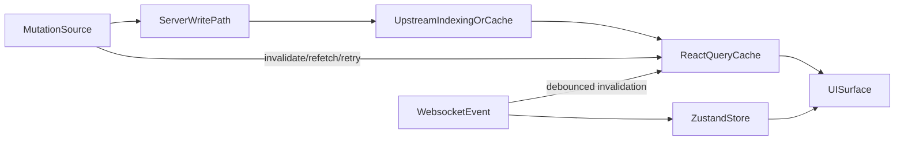

# Full Sync/State Audit Plan

## Scope

- Audit **every file** in [apps/web/src](/home/kaizen/dev/doji/apps/web/src) and [apps/server/src](/home/kaizen/dev/doji/apps/server/src).
- Focus on:
  - data freshness/sync issues (query invalidation scope, retries, polling, websocket-driven updates)
  - state consistency issues (duplicate sources of truth, race windows, timing drift between store/query/server)
- Exclude broad style/perf-only concerns unless they directly cause stale or inconsistent user-visible data.

## Audit Method

- Build a complete file inventory for both trees and track completion so each file is reviewed exactly once.
- Use a strict per-file rubric:
  - **State sources** used (React Query, Zustand, websocket, local component state, server cache)
  - **Mutation/write paths** present (tRPC mutate, CLOB operations, bridge/auth DB writes)
  - **Sync mechanisms** present (invalidate/refetch/poll/debounce/retry)
  - **Drift risks** (missing invalidation keys, stale TTL windows, duplicated derivation logic, event/query ordering races)
- For files with no sync/state logic, mark as low-risk reviewed with reason.

## High-Risk Pass First (to prevent blind spots)

- Frontend sync backbone:
  - [apps/web/src/lib/trpc/index.ts](/home/kaizen/dev/doji/apps/web/src/lib/trpc/index.ts)
  - [apps/web/src/hooks/use-user-channel.ts](/home/kaizen/dev/doji/apps/web/src/hooks/use-user-channel.ts)
  - [apps/web/src/stores/pending-balance-deltas.ts](/home/kaizen/dev/doji/apps/web/src/stores/pending-balance-deltas.ts)
  - [apps/web/src/stores/orders.ts](/home/kaizen/dev/doji/apps/web/src/stores/orders.ts)
  - [apps/web/src/stores/positions.ts](/home/kaizen/dev/doji/apps/web/src/stores/positions.ts)
- Frontend mutation surfaces:
  - order/trade/redeem/bridge/approval paths under [apps/web/src/components/trading](/home/kaizen/dev/doji/apps/web/src/components/trading), [apps/web/src/components/market](/home/kaizen/dev/doji/apps/web/src/components/market), [apps/web/src/components/portfolio](/home/kaizen/dev/doji/apps/web/src/components/portfolio), [apps/web/src/components/bridge](/home/kaizen/dev/doji/apps/web/src/components/bridge), [apps/web/src/components/auth](/home/kaizen/dev/doji/apps/web/src/components/auth), [apps/web/src/hooks](/home/kaizen/dev/doji/apps/web/src/hooks)
- Server freshness/mutation backbone:
  - [apps/server/src/routers/clob.ts](/home/kaizen/dev/doji/apps/server/src/routers/clob.ts)
  - [apps/server/src/routers/bridge.ts](/home/kaizen/dev/doji/apps/server/src/routers/bridge.ts)
  - [apps/server/src/routers/auth.ts](/home/kaizen/dev/doji/apps/server/src/routers/auth.ts)
  - [apps/server/src/lib/polymarket/data.ts](/home/kaizen/dev/doji/apps/server/src/lib/polymarket/data.ts)
  - [apps/server/src/lib/polymarket/resilient-fetch.ts](/home/kaizen/dev/doji/apps/server/src/lib/polymarket/resilient-fetch.ts)

## Full File-by-File Sweep

- Traverse every remaining file in both trees, grouped by directory, and classify:
  - no sync/state impact
  - indirect sync/state impact
  - direct sync/state impact
- For each direct/indirect file, map to affected user surfaces (header balance, order forms, quick trade, positions, portfolio, bridge, activity).

## Cross-Layer Consistency Matrix

- Build a final matrix (in-chat) of:
  - **Mutation action** → **frontend update path** (store/query/poll/ws) → **server freshness behavior** (cache/indexing/TTL)
  - identify where frontend retry timing and server/data-index timing can diverge.

## Output and Prioritization

- Deliver a prioritized findings set:
  - `P0`: confirmed stale/incorrect user-visible data states
  - `P1`: high-probability race/drift windows
  - `P2`: consistency hardening opportunities
- For each finding: exact path, root cause, blast radius, and concrete remediation target.
- Include a remediation sequence optimized to reduce regression risk (shared infra first, then call-sites).

## Execution Guardrails

- No broad refactors during audit.
- Keep existing architecture/patterns; identify minimal safe changes.
- Validate all proposed fixes against affected surfaces and post-mutation expectations before implementation.

## execution status

Audit execution is complete for this plan. All plan to-dos were run in order and
marked complete during execution:

1. Build complete file inventory for `apps/web/src` and `apps/server/src`.
2. Audit high-risk sync backbone files.
3. Audit frontend files file-by-file.
4. Audit server files file-by-file.
5. Build cross-layer consistency matrix.
6. Deliver prioritized findings and remediation order.

## findings summary (from full sweep)

### P0 confirmed stale or incorrect user-visible states

- `apps/web/src/lib/trpc/index.ts`: `invalidateRealtimeQueries()` invalidates
`trpc.data.activityWithMarkets.queryKey()` but does not invalidate
`trpc.data.activity.queryKey()`. Components using `trpc.data.activity`
directly can remain stale after mutation flows that only call the centralized
realtime invalidator.

### P1 high-probability race or drift windows

- `apps/web/src/components/market/tabs/positions-tab.tsx` and
`apps/web/src/components/portfolio/position-table.tsx`: position composition
differs (local websocket-enriched path vs query-first path), so the same user
can see temporary cross-surface mismatch after fills.
- `apps/web/src/components/bridge/deposit-notification-card.tsx`,
`apps/web/src/components/bridge/withdraw-status-tracker.tsx`, and
`apps/web/src/components/bridge/withdraw-notification-card.tsx`: terminal
bridge invalidation is balance-focused and can leave activity views behind.
- `apps/server/src/lib/polymarket/data.ts` with
`apps/web/src/lib/trpc/index.ts`: external indexing delay + server cache TTL +
fixed retry windows can leave brief stale windows after writes.

### P2 consistency hardening opportunities

- `apps/server/src/lib/polymarket/clob-read.ts`,
`apps/server/src/lib/polymarket/bridge.ts`,
`apps/server/src/lib/polymarket/subgraph/client.ts`: resilience behavior is
not uniform across all upstream access paths.
- `apps/web/src/stores/pending-balance-deltas.ts` and
`apps/web/src/hooks/use-user-channel.ts`: module-level mutable sync helpers
are practical but fragile under edge lifecycle sequences and multi-surface
timing.

## cross-layer consistency matrix

| Mutation action                    | Frontend update path                                                               | Server freshness behavior                                     | Drift window  |
| ---------------------------------- | ---------------------------------------------------------------------------------- | ------------------------------------------------------------- | ------------- |
| Place/fill trade                   | Optimistic pending delta + websocket trade + `invalidatePostTradeQueriesWithRetry` | Data API indexing + selective cache TTL                       | Medium        |
| Cancel/update order                | Websocket order store + targeted invalidation (`openOrders`, allowance)            | CLOB is near-immediate                                        | Low           |
| Redeem/split/merge                 | Mutation success + call-site invalidations + allowance refresh                     | On-chain finality then CLOB/Data indexing                     | Medium        |
| Bridge deposit/withdraw completion | Status polling + bridge activity store + terminal invalidation                     | Bridge API + on-chain fallback + Data API conversion timeline | Medium        |
| Auth/safe/approval flows           | Wallet store updates + auth/allowance invalidations                                | DB write + on-chain approval checks                           | Low to Medium |

## remediation sequence (safe order)

1. **Shared invalidation contract first**

- Update `apps/web/src/lib/trpc/index.ts` so `includeActivity` invalidates
 both `data.activityWithMarkets` and `data.activity`.

1. **Bridge terminal parity**

- Expand bridge completion invalidation scope to include activity surfaces.

1. **Position composition parity**

- Align market and portfolio position derivation to one shared merge
 contract.

1. **Freshness timing hardening**

- Tune cache TTL and/or retry schedule for post-write-sensitive reads.

1. **Resilience consistency pass**

- Normalize high-value server upstream fetch paths under one resilience
 contract.

1. **Lifecycle hardening for module-scope sync helpers**

- Add explicit reset and ownership boundaries for module-level sync state.

## remediation progress (continuation)

- `apps/server/src/lib/polymarket/bridge.ts`
  - Applied retry policy to bridge POST mutation requests by wrapping
  `postJson()` in `withRetry(...)`.
  - Keeps structured error classification (`classifyHttpError`,
  `classifyNetworkError`) so only retryable upstream failures are retried.
- `apps/server/src/lib/polymarket/subgraph/client.ts`
  - Applied retry policy to `querySubgraph(...)` by wrapping subgraph fetches in
  `withRetry(...)`.
  - Upgraded non-2xx/network/GraphQL failures into typed `ApiError` forms so
  retry behavior is explicit and consistent with other server upstream
  clients.
- `apps/server/src/lib/polymarket/clob-read.ts`
  - Hardened high-impact read paths (`getBook`, `getPriceHistory`) under typed
  retry + timeout handling using `withClobRetry(...)`.
  - Converted direct fetch paths (`getHeartbeat`, `getGeoblock`) to typed
  classify + retry behavior (`classifyHttpError`/`classifyNetworkError`) with
  explicit validation error mapping for geoblock schema failures.
- `apps/server/src/lib/polymarket/gamma.ts`
  - Updated `getStatus()` to use timeout + typed classify + retry semantics so
  health checks follow the same resilient error contract.
- `apps/server/src/lib/polymarket/data.ts`
  - Updated `getAccountingSnapshot()` (binary payload endpoint) to use timeout +
  typed classify + retry semantics, removing a remaining raw fetch/error path.
- `apps/web/src/hooks/use-split-merge.ts`
  - Replaced manual key invalidation set with
  `invalidateRealtimeQueriesWithRetry(...)` using a split/merge-focused scope,
  so activity/value/positions/allowance invalidation follows centralized
  retry-aware behavior.
  - Preserved immediate on-chain refetch and background polling behavior for
  faster post-confirmation UI updates.
- `apps/web/src/components/bridge/withdraw-flow.tsx`
  - Enabled `includeActivity: true` on successful withdraw send so activity
  surfaces refresh consistently in parallel with USDC balance updates.
- `apps/web/src/components/auth/auth-guard.tsx`
  - Hardened auth failure/session-expiry handling to clear local auth session
  and user-scoped realtime stores (`orders`, `positions`,
  `pending-balance-deltas`) before redirecting to login.
  - Prevents stale user-specific state from lingering in the UI when Magic
  reports logged-out or `auth.me` verification fails.
- `apps/web/src/hooks/use-clob-client.ts`
  - On successful credential persistence (`auth.storeCredentials`), now also
  invalidates `trpc.auth.me` query cache.
  - Keeps query-driven auth surfaces (credentials status consumers) in sync with
  the local wallet store update path.
- `apps/web/src/components/onboarding/safe-onboarding.tsx`
  - Added cache refresh after successful onboarding mutations
  (`registerSafe`/approval paths/manual recovery) to invalidate
  `auth.me`, `auth.checkApprovalStatus`, and `clob.getBalanceAllowance`.
  - Keeps query-driven auth/approval surfaces synchronized with onboarding’s
  local-store updates and reduces stale state after recovery flows.
