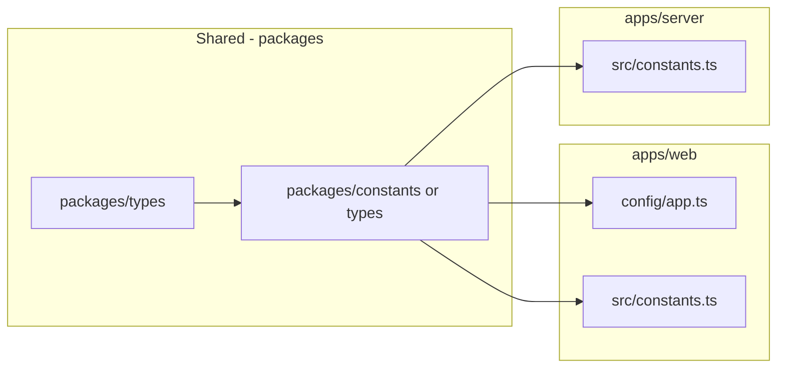

# 100% audit: candidates for global constants.ts

**Naming:** Use the **Canonical names** table (under "Re-audit") for all new constants. It applies namespace prefixes (`CLOB_`, `POLYMARKET_`, `API_PATH_`, etc.) and consistent suffixes (`_MS`, `_SHARES`, `_USD`, `_THRESHOLD`) so terminology and scope are clear.

## Current state

- **No** repo-wide `constants.ts` exists.
- **Existing centralization:**
  - [packages/types/src/polymarket.ts](packages/types/src/polymarket.ts): `POLYGON_CHAIN_ID`, `RELAYER_URL`, `CLOB_HOST`, `SAFE_SIGNATURE_TYPE`
  - [packages/types/src/clob.ts](packages/types/src/clob.ts): `TickSize` type (`"0.1" | "0.01" | "0.001" | "0.0001"`)
  - [apps/web/src/config/app.ts](apps/web/src/config/app.ts): `APP_NAME`, `APP_TITLE`, `APP_DESCRIPTION`, `APP_KEYWORDS`, `BASE_URL` (env-derived)
- **Env:** Runtime config (URLs, keys, chain ID) lives in `packages/env` (server + web). Those stay in env; this audit is for **non-secret, semantic constants** that are duplicated or magic-numbered.

---

## How to define good constants (research summary)

### What makes a good constant

- **Single, stable meaning** — The value represents one concept (e.g. “CLOB min tradeable price”) and is not overloaded for different purposes elsewhere.
- **Documentation by name** — The name explains *why* or *what* (e.g. `CLOB_PRICE_MIN`, `ORDER_GTD_BUFFER_SECONDS`), not just “a number.”
- **Single source of truth** — Same value used in multiple places; changing it in one place should be the only correct way to update behavior.
- **Immutability** — Use `const` and, for objects/arrays, `as const` or `Object.freeze` so the reference and (where applicable) shape cannot change.
- **Appropriate scope** — Shared across packages → shared package; app-only → app-level constants; single module → top-of-file constant.

### Naming conventions (TypeScript/JS)

- **UPPER_SNAKE_CASE** for true constants (especially numeric/semantic values) so they stand out from variables (ESLint `no-magic-numbers`, style guides).
- **camelCase** is also common for `const` that are “config-like” but not “magic number” constants; the project’s [.agents/code-standards.md](.agents/code-standards.md) says “Extract magic numbers into named constants” and prefers const assertions.
- Name should reflect **domain meaning** (e.g. `CLOB_SIZE_DISPLAY_THRESHOLD`, `CLOB_ORDER_BATCH_MAX`) not the literal (“ZERO_POINT_ZERO_ONE”).

### Namespace and terminology (avoid jargon confusion)

Use **prefixes** and **consistent suffixes** so the domain and unit are clear. This prevents mixing Polymarket/CLOB jargon with Doji app concepts and keeps names unambiguous.

**Prefixes (namespace by source or domain):**

| Prefix                          | Use for                                                                                 | Examples                                                           |
| ------------------------------- | --------------------------------------------------------------------------------------- | ------------------------------------------------------------------ |
| `CLOB_`                         | Polymarket CLOB API / orderbook rules (prices, ticks, batch limits)                     | `CLOB_PRICE_MIN`, `CLOB_TICK_SIZE_DEFAULT`, `CLOB_ORDER_BATCH_MAX` |
| `POLYMARKET_`                   | Polymarket-wide: URLs, docs, retention, geoblock                                        | `POLYMARKET_GEOBLOCK_URL`, `POLYMARKET_NOTIFICATIONS_RETENTION_MS` |
| `ORDER_`                        | Order lifecycle (validation, GTD, post-only) — still CLOB-related but “order” semantics | `ORDER_GTD_BUFFER_SECONDS`, `ORDER_POST_ONLY_TYPES`                |
| `CONTRACT_` or keep `CONTRACTS` | On-chain contract addresses (CTF, NegRisk)                                              | `CONTRACTS` object (existing) or `CONTRACT_CTF_EXCHANGE` etc.      |
| `API_PATH_`                     | Doji server route paths (path segment only, no origin)                                  | `API_PATH_POLYMARKET_SIGN`, `API_PATH_GEOBLOCK`, `API_PATH_HEALTH` |
| `PATH_`                         | App/page paths (unlock, login)                                                          | `PATH_UNLOCK`, `PATH_API_UNLOCK`                                   |
| `QUERY_`                        | React Query / data-fetching (staleTime, cache)                                          | `QUERY_STALE_5MIN_MS`                                              |
| `UI_` or none                   | Doji app UI (bridge display delay, chart size) — optional prefix                        | `BRIDGE_MIN_PROCESSING_DISPLAY_MS` (bridge is domain)              |
| `*_URL` vs `*_PATH`             | Full URL = `*_URL`; path segment = `*_PATH`                                             | `POLYMARKET_GEOBLOCK_URL`, `API_PATH_POLYMARKET_SIGN`              |

**Suffixes (unit and meaning):**

| Suffix          | Meaning                               | Examples                                                    |
| --------------- | ------------------------------------- | ----------------------------------------------------------- |
| `_MS`           | Milliseconds                          | `*_STALE_5MIN_MS`, `*_DISPLAY_MS`, `*_DELAYS_MS`            |
| `_SECONDS`      | Seconds                               | `ORDER_GTD_BUFFER_SECONDS`                                  |
| `_SHARES`       | Share count (outcome tokens)          | `CLOB_MIN_ORDER_SIZE_SHARES`, `CLOB_MARKET_SELL_MIN_SHARES` |
| `_USD`          | US dollar amount                      | `CLOB_MARKET_BUY_MIN_USD`                                   |
| `_URL`          | Full URL string                       | `POLYMARKET_GEOBLOCK_URL`, `POLYMARKET_GEOBLOCK_DOCS_URL`   |
| `_PATH`         | Path segment (no origin)              | `API_PATH_*`                                                |
| `_THRESHOLD`    | Below/above this = different behavior | `CLOB_SIZE_DISPLAY_THRESHOLD` (dust)                        |
| `_MIN` / `_MAX` | Inclusive bounds                      | `CLOB_PRICE_MIN`, `CLOB_ORDER_BATCH_MAX`                    |

**Terminology (consistent words):**

| Concept                          | Use                                                         | Avoid                                                                            |
| -------------------------------- | ----------------------------------------------------------- | -------------------------------------------------------------------------------- |
| Price (0–1 decimal)              | “price” (e.g. 0.55 = 55¢)                                   | Mixing “cents” in constant names unless value is literally cents                 |
| Minimum tradeable size in shares | `*_MIN_*_SHARES` or `*_MIN_ORDER_SIZE_SHARES`               | `MIN_SIZE` (ambiguous: bytes? shares?)                                           |
| Minimum market BUY in dollars    | `CLOB_MARKET_BUY_MIN_USD`                                   | `MARKETABLE_BUY_MIN` (unclear unit)                                              |
| Positions below display cutoff   | “size display threshold” or “dust display threshold”        | “dust” alone (jargon); prefer “below X we hide/suppress” in comment              |
| Good-Til-Date buffer             | `ORDER_GTD_BUFFER_SECONDS`                                  | `GTD_SECURITY_THRESHOLD` (buffer is clearer)                                     |
| Tick size                        | “tick size” (CLOB term); default = `CLOB_TICK_SIZE_DEFAULT` | “price step” (unless we standardize on that)                                     |
| Batch of orders                  | “order batch”; min/max count                                | “batch size” (could mean bytes) → `CLOB_ORDER_BATCH_MIN`, `CLOB_ORDER_BATCH_MAX` |

**Reserved / do not overload:**

- `MIN_` / `MAX_` alone are ambiguous: always pair with the quantity, e.g. `CLOB_PRICE_MIN`, `CLOB_ORDER_BATCH_MAX`.
- “Default” = fallback when API doesn’t specify: `CLOB_TICK_SIZE_DEFAULT`, `CLOB_MIN_ORDER_SIZE_SHARES_DEFAULT`.
- “Threshold” = boundary for a decision (show/hide, health tier): `CLOB_SIZE_DISPLAY_THRESHOLD`, `LIQUIDITY_SPREAD_*`.

### When to extract → **do make it a constant**

1. **Reused** — Same value in 2+ places (risk of drift if changed in only one).
2. **Likely to change** — Business rule, API contract, or threshold you expect to tune (one change point).
3. **Meaning not obvious** — Reader would ask “why 0.01?” or “why 15?” (e.g. CLOB price bounds, batch size limits, dust thresholds).
4. **Contract / protocol** — Value is part of an external contract (Polymarket CLOB, chain decimals, contract addresses).
5. **Testability** — Tests or code need to reference the same value; named constant avoids magic in assertions.

### When NOT to extract → **leave as literal or local const**

1. **Obvious in context** — `0`, `1`, `-1`, `2` as loop indices, lengths, or simple math (e.g. `i < count`, `data.length - 1`). Same for `100` as percentage, `24` in “hours per day” time math.
2. **Inherent to the operation** — Part of the formula (e.g. `1/x`, `* 2` for doubling); the number is the math, not a config.
3. **One-off, never reused** — Used once and meaning is clear at the call site; extraction adds indirection without reuse benefit.
4. **Meaningless names** — Would force names like `const THREE = 3`; no extra meaning, just extra lookup (over-engineering).
5. **Type/structure, not value** — Discriminated unions with `z.literal("success")` or type codes; use types/strategy, not a bag of numeric constants.
6. **Already centralized** — Value lives in one module and is exported (e.g. rate-limit config); no need to move again unless sharing across apps.

### Refactoring.Guru + ESLint takeaways

- **Replace Magic Number with Symbolic Constant**: Use when the number has a *meaning* that isn’t obvious; the constant becomes live documentation. Same number in different contexts may need *different* constants (e.g. 0.01 as “min price” vs “dust threshold” — same value, different concepts; name accordingly or use one constant only if they are the same rule).
- **ESLint `no-magic-numbers`**: Typically allows `ignore` for 0, 1, -1; `ignoreArrayIndexes`; `ignoreDefaultValues`; so “obvious” literals stay. Use it to catch non-obvious numbers and enforce named constants where meaning matters.

### Applying this to the audit

- **Extract**: CLOB price bounds, tick sizes, size-display threshold, batch limits, contract addresses, geoblock URL, API path segments, post-trade delays, debounce/poll intervals — they are reused, may change, or encode protocol/config.
- **Keep inline or local**: Loop bounds, `data[0]`, `length - 1`, `1000` in “ms per second” next to `Date.now()`, one-off layout numbers that are clear in the component. Optional: `MS_PER_SECOND` in sign route if you want consistency with other time constants.
- **Don’t create**: Constants that are just aliases for 0/1/2 with no domain meaning; leave those as literals.

### Quick decision guide (constant vs not)

| If the value…                                                              | Then                                   |
| -------------------------------------------------------------------------- | -------------------------------------- |
| Is reused in 2+ files or might change as a single rule                     | **Constant** (shared or app-level)     |
| Encodes protocol/API/chain (price bounds, tick size, contracts)            | **Constant** (shared)                  |
| Is a threshold or limit with business meaning (dust, batch max, page size) | **Constant**                           |
| Is 0, 1, -1, or obvious in context (index, length, “per day”)              | **Leave as literal**                   |
| Is used only once and meaning is clear at the call site                    | **Leave as literal or local const**    |
| Already lives in one module as the single source of truth                  | **No change** (e.g. rate-limit-config) |

---

## Re-audit: constants that make sense (filtered by criteria)

Second pass over the codebase applying the rules above. Only values that are **reused**, **protocol/business meaning**, or **not obvious** are recommended.

### Strong yes — extract (reused and/or protocol)

**Use the Canonical names table below for the exact names to implement;** the “Suggested name” column here may show pre-namespace names.

| Constant                               | Why it qualifies                                                                                                                                                                  | Location today                                | Suggested name                                                                | Place                          |
| -------------------------------------- | --------------------------------------------------------------------------------------------------------------------------------------------------------------------------------- | --------------------------------------------- | ----------------------------------------------------------------------------- | ------------------------------ |
| CLOB min/max tradeable price           | Protocol; reused in 5+ files (order-validation, execute-market-order, order-form.hooks, orderbook, clob message)                                                                  | Multiple                                      | `PRICE_MIN_CLOB`, `PRICE_MAX_CLOB`                                            | Shared                         |
| Default tick size `"0.01"`             | Protocol; reused in clob router, place-order-client, order-form-ui, market-sell-shared, trading-utils                                                                             | Multiple                                      | `DEFAULT_TICK_SIZE`                                                           | Shared                         |
| Tick size enum for validation          | Single source of truth for Zod schema + type; reused server + types                                                                                                               | clob.ts, types                                | `TICK_SIZES` array; derive schema from it                                     | Shared                         |
| Dust/size threshold 0.01               | Reused (trading-utils, use-portfolio-data, trading-layout-terminal, orderbook comment); business meaning                                                                          | Multiple                                      | `DUST_DISPLAY_THRESHOLD` (already in trading-utils; move to shared)           | Shared                         |
| Min sell shares 0.001                  | Protocol (Polymarket min); already constant in market-sell-shared; also in positions-tab, redeem-utils, instant-trade-popup                                                       | market-sell-shared, etc.                      | `MARKET_SELL_MIN_SHARES`; align redeem/dust to same or `MIN_TRADEABLE_SHARES` | Shared                         |
| Order batch min/max (1, 15)            | Protocol (CLOB batch limit); reused in validation + server                                                                                                                        | order-validation, server                      | `ORDER_BATCH_MIN`, `ORDER_BATCH_MAX`                                          | Shared                         |
| Post-only order types (GTC, GTD)       | Protocol; single place today but documents rule                                                                                                                                   | order-validation                              | `POST_ONLY_ORDER_TYPES`                                                       | Shared                         |
| GTD buffer 60s                         | Protocol (Polymarket 1-min security); documents why 60                                                                                                                            | order-utils                                   | `GTD_BUFFER_SECONDS`                                                          | Shared                         |
| USDC decimals 6                        | Chain/protocol; single place but shared if server ever needs                                                                                                                      | order-utils                                   | `USDC_DECIMALS`                                                               | Shared                         |
| CTF contract addresses                 | Protocol; server may need for verification                                                                                                                                        | order-utils                                   | `CONTRACTS` (move to shared)                                                  | Shared                         |
| Polymarket geoblock URL                | Reused: server clob-read + web api/geoblock route; same URL                                                                                                                       | clob-read.ts, geoblock/route.ts               | `POLYMARKET_GEOBLOCK_URL`                                                     | Shared                         |
| Sign endpoint path                     | Repeated 7+ times (order-form, quick-sell, user-menu, execute-market-order, withdraw-flow, safe-onboarding, positions-tab)                                                        | Multiple                                      | `API_PATH_POLYMARKET_SIGN` + `getSigningEndpointUrl()`                        | Web                            |
| Default min order size (5 shares)      | Polymarket default; reused in order-validation fallback + order-form.hooks mock                                                                                                   | order-validation, order-form.hooks            | `DEFAULT_MIN_ORDER_SIZE_SHARES`                                               | Shared                         |
| Market BUY min $1                      | Protocol; already `MARKETABLE_BUY_MIN_USD` in order-form.hooks; used in validation override                                                                                       | order-form.hooks                              | Move to shared as `MARKET_BUY_MIN_USD`                                        | Shared                         |
| Post-trade invalidation delays         | Business rule (Data API indexing); single place but meaningful                                                                                                                    | trpc/index.ts                                 | `POST_TRADE_INVALIDATION_DELAYS_MS`                                           | Web                            |
| Bridge “min processing” display 2000ms | **Duplicate**: same value in withdraw-notification-card and deposit-notification-card                                                                                             | Both cards                                    | `BRIDGE_MIN_PROCESSING_DISPLAY_MS`                                            | Web                            |
| 5-minute query staleTime               | Reused 10+ times (notifications, related-tags, related-markets, event-table-cells, wallet-tracker, calendar, explore, market-header, data.ts, tradeability-cache, markets router) | Multiple                                      | `QUERY_STALE_5MIN_MS`                                                         | Web (or shared if server uses) |
| Notifications max age 48h              | Protocol (“match Polymarket server retention”); documents why 48                                                                                                                  | notifications-bell                            | `NOTIFICATIONS_MAX_AGE_MS`                                                    | Web                            |
| Geoblock docs URL                      | External link; one place but naming clarifies intent                                                                                                                              | restricted-region-content                     | `GEOBLOCK_DOCS_URL` (already named; could move to web constants)              | Web                            |
| Liquidity health thresholds            | Business meaning (spread 0.02/0.05/0.1, depth 1000/500/100); one file but non-obvious                                                                                             | liquidity-metrics.ts                          | `LIQUIDITY_SPREAD_HIGH`, `LIQUIDITY_DEPTH_HIGH_USD`, etc.                     | Server (or shared)             |
| Subgraph/enrich limit 200              | Reused in subgraph/index.ts (two call sites); API cap                                                                                                                             | subgraph/index.ts, enrich-markets-with-events | `SUBGRAPH_FIRST_MAX` / `ENRICH_MAX_EVENTS`                                    | Server                         |
| Price history fidelity (1 vs 5)        | CLOB rule (span <= 60 min → 1, else 5); non-obvious                                                                                                                               | clob router                                   | `PRICE_HISTORY_FIDELITY_1M`, `PRICE_HISTORY_FIDELITY_5M`                      | Server                         |

### Canonical names (namespace + terminology applied)

Apply the namespace/suffix/terminology rules above. Use these names in code so we don’t confuse jargon and keep namespaces clear.

**Shared (trading / protocol):**

| Concept                                       | Canonical name                                                    | Notes                                                         |
| --------------------------------------------- | ----------------------------------------------------------------- | ------------------------------------------------------------- |
| CLOB tradeable price floor (1¢)               | `CLOB_PRICE_MIN`                                                  | Decimal 0.01                                                  |
| CLOB tradeable price ceiling (99.9¢)          | `CLOB_PRICE_MAX`                                                  | Decimal 0.999                                                 |
| Default tick size when API missing            | `CLOB_TICK_SIZE_DEFAULT`                                          | `"0.01"` (TickSize string)                                    |
| Allowed tick size values                      | `CLOB_TICK_SIZES`                                                 | Array; derive Zod schema + type from it                       |
| Size below which we hide/suppress display     | `CLOB_SIZE_DISPLAY_THRESHOLD`                                     | 0.01 (align with Polymarket sizeThreshold)                    |
| Min shares for market SELL                    | `CLOB_MARKET_SELL_MIN_SHARES`                                     | 0.001                                                         |
| Min order count per batch                     | `CLOB_ORDER_BATCH_MIN`                                            | 1                                                             |
| Max order count per batch                     | `CLOB_ORDER_BATCH_MAX`                                            | 15                                                            |
| Order types allowed for post-only             | `ORDER_POST_ONLY_TYPES`                                           | Set or tuple: GTC, GTD                                        |
| GTD expiration buffer (seconds)               | `ORDER_GTD_BUFFER_SECONDS`                                        | 60                                                            |
| USDC decimals (chain)                         | `USDC_DECIMALS`                                                   | 6 (no prefix; chain standard)                                 |
| CTF / NegRisk contract addresses              | `CONTRACTS`                                                       | Object (existing); keep or split `CONTRACT_CTF_EXCHANGE` etc. |
| Default min order size in shares (Polymarket) | `CLOB_MIN_ORDER_SIZE_SHARES_DEFAULT`                              | 5                                                             |
| Min notional for market BUY (USD)             | `CLOB_MARKET_BUY_MIN_USD`                                         | 1                                                             |
| Redeemable position min size (shares)         | Use `CLOB_MARKET_SELL_MIN_SHARES` or `CLOB_MIN_REDEEMABLE_SHARES` | Same 0.001; one constant if same rule                         |
| Polymarket geoblock API URL                   | `POLYMARKET_GEOBLOCK_URL`                                         | Full URL                                                      |
| Geoblock docs (blocked countries)             | `POLYMARKET_GEOBLOCK_DOCS_URL`                                    | So we don’t overload GEOBLOCK_ with two concepts              |

**Web (paths + timing + UI):**

| Concept                                    | Canonical name                            | Notes                              |
| ------------------------------------------ | ----------------------------------------- | ---------------------------------- |
| Doji server path: Polymarket sign          | `API_PATH_POLYMARKET_SIGN`                | `"/api/polymarket/sign"`           |
| Doji server path: geoblock proxy           | `API_PATH_GEOBLOCK`                       | `"/api/geoblock"`                  |
| Doji server path: health                   | `API_PATH_HEALTH`                         | `"/api/health"`                    |
| App path: unlock page                      | `PATH_UNLOCK`                             | `"/unlock"`                        |
| App path: unlock API                       | `PATH_API_UNLOCK`                         | `"/api/unlock"`                    |
| Query staleTime 5 min                      | `QUERY_STALE_5MIN_MS`                     | `5 * 60 * 1000`                    |
| Post-trade invalidation delays             | `QUERY_POST_TRADE_INVALIDATION_DELAYS_MS` | Array [3000, 8000, 15_000, 30_000] |
| Notifications retention (match Polymarket) | `POLYMARKET_NOTIFICATIONS_RETENTION_MS`   | 48h                                |
| Bridge “min processing” display delay      | `BRIDGE_MIN_PROCESSING_DISPLAY_MS`        | 2000                               |

**Server:**

| Concept                             | Canonical name                           | Notes                                     |
| ----------------------------------- | ---------------------------------------- | ----------------------------------------- |
| Liquidity: spread “high” (cents)    | `LIQUIDITY_SPREAD_HIGH_MAX`              | ≤ 0.02                                    |
| Liquidity: spread “medium” max      | `LIQUIDITY_SPREAD_MEDIUM_MAX`            | 0.05                                      |
| Liquidity: depth “high” min (USD)   | `LIQUIDITY_DEPTH_HIGH_MIN_USD`           | 1000                                      |
| Liquidity: depth “medium” min (USD) | `LIQUIDITY_DEPTH_MEDIUM_MIN_USD`         | 500                                       |
| Liquidity: spread “low” max         | `LIQUIDITY_SPREAD_LOW_MAX`               | 0.1                                       |
| Liquidity: depth “low” min (USD)    | `LIQUIDITY_DEPTH_LOW_MIN_USD`            | 100                                       |
| Subgraph first/limit cap            | `SUBGRAPH_FIRST_MAX`                     | 200                                       |
| Enrich max events per batch         | `ENRICH_MAX_EVENTS`                      | 200 (or reuse SUBGRAPH_FIRST_MAX if same) |
| Price history fidelity (≤1h span)   | `CLOB_PRICE_HISTORY_FIDELITY_PER_MINUTE` | 1                                         |
| Price history fidelity (>1h span)   | `CLOB_PRICE_HISTORY_FIDELITY_5MIN`       | 5                                         |

**Format/utils (web):**

| Concept                           | Canonical name                          | Notes                                                    |
| --------------------------------- | --------------------------------------- | -------------------------------------------------------- |
| USD 2 decimal toLocaleString opts | `FORMAT_USD_FRACTION_OPTIONS` or helper | `{ minimumFractionDigits: 2, maximumFractionDigits: 2 }` |
| Compact number threshold (1K, 1M) | `FORMAT_COMPACT_NUMBER_THRESHOLD`       | 1000                                                     |

**Deprecated / avoid:** `PRICE_MIN_CLOB` → use `CLOB_PRICE_MIN`. `DEFAULT_TICK_SIZE` → `CLOB_TICK_SIZE_DEFAULT`. `DUST_DISPLAY_THRESHOLD` → `CLOB_SIZE_DISPLAY_THRESHOLD`. `MARKET_SELL_MIN_SHARES` → `CLOB_MARKET_SELL_MIN_SHARES`. `DEFAULT_MIN_ORDER_SIZE_SHARES` → `CLOB_MIN_ORDER_SIZE_SHARES_DEFAULT`. `MARKET_BUY_MIN_USD` → `CLOB_MARKET_BUY_MIN_USD`. `NOTIFICATIONS_MAX_AGE_MS` → `POLYMARKET_NOTIFICATIONS_RETENTION_MS`. `GEOBLOCK_DOCS_URL` → `POLYMARKET_GEOBLOCK_DOCS_URL` (namespace).

### Yes — extract (good documentation or one duplicate)

| Constant                      | Why                                                                                  | Canonical name (use this)                                     | Place     |
| ----------------------------- | ------------------------------------------------------------------------------------ | ------------------------------------------------------------- | --------- |
| Redeemable min size 0.001     | Same as min sell; align with shared constant                                         | `CLOB_MARKET_SELL_MIN_SHARES` or `CLOB_MIN_REDEEMABLE_SHARES` | Shared    |
| API path `/api/geoblock`      | Used in web geoblock fetch + proxy; path segment                                     | `API_PATH_GEOBLOCK`                                           | Web       |
| Unlock paths                  | proxy.ts; path segments                                                              | `PATH_UNLOCK`, `PATH_API_UNLOCK`                              | Web       |
| USD 2-decimal format opts     | Repeated 6+ times (portfolio, quick-sell, redeem, execute-market-order, trade-utils) | `FORMAT_USD_FRACTION_OPTIONS`                                 | Web utils |
| Compact number threshold 1000 | Reused in format.ts, position-table, global-search-utils, watchlist, orderbook       | `FORMAT_COMPACT_NUMBER_THRESHOLD`                             | Web utils |

### Optional / keep in one module

| Item                             | Recommendation                                             |
| -------------------------------- | ---------------------------------------------------------- |
| RTDS backoff, PING_INITIAL_MS    | Already in rtds.ts; keep there (single source of truth).   |
| Live trades BATCH_MS, DEDUPE_MS  | One file; optional move to web constants for consistency.  |
| PRICE_CHANGE_DEBOUNCE_MS 120     | One file; meaning clear; optional.                         |
| LIVE_PRICE_POLL_INTERVAL_MS 6000 | One file; optional.                                        |
| SPLIT_MERGE_POLL_MS 2000         | One file; optional.                                        |
| PROFILE_HOVER_STALE_MS           | One file; optional.                                        |
| Balance poll 5000, refetch 5000  | Could be `BALANCE_POLL_MS` if reused; else leave.          |
| Chart min size 500               | One component; UI detail; leave or single constant in web. |
| Trade history MAX_PAGE_SIZE 500  | One file; keep as file-level constant.                     |
| Workspace OB_WIDTH_*             | Already in store; no change.                               |
| Rate limit config numbers        | Already centralized in rate-limit-config.ts; no change.    |

### Do not extract (per criteria)

| Value                                           | Reason                                                                           |
| ----------------------------------------------- | -------------------------------------------------------------------------------- |
| `0`, `1`, `-1`, indices, `length - 1`           | Obvious in context.                                                              |
| `Date.now() / 1000` (ms→s)                      | Obvious conversion.                                                              |
| `60` in “minutes” time math (e.g. diffSec < 60) | Clear in context; only extract if reused as “seconds per minute” in many places. |
| `Array.from({ length: 5 })` for skeletons       | One-off UI; “5” is arbitrary.                                                    |
| `duration-200`, `transition` values in Tailwind | Styling; not business logic.                                                     |
| `step="0.01"` in one input                      | Could use `DEFAULT_TICK_SIZE` from shared if we add it.                          |
| `MS_PER_SECOND = 1000` in sign route            | Trivial; optional for consistency.                                               |
| Portfolio chart “5 *365* 86_400_000” (5 years)  | One-off range; could name `CHART_MAX_RANGE_MS` if we want.                       |

### Newly found in re-audit (not in original tables)

- **MIN_PROCESSING_DISPLAY_MS 2000** — duplicate in deposit + withdraw notification cards → single constant.
- **5 min staleTime** — `5 * 60 * 1000` or `5 * 60_000` in 10+ files → `QUERY_STALE_5MIN_MS`.
- **DEFAULT_MIN_ORDER_SIZE (5)** — Polymarket default; order-validation and order-form.hooks mock.
- **MARKETABLE_BUY_MIN_USD (1)** — already constant in order-form.hooks; promote to shared.
- **NOTIFICATIONS_MAX_AGE_MS (48h)** — protocol; notifications-bell.
- **GEOBLOCK_DOCS_URL** — already named in restricted-region-content; optional move to constants.
- **Liquidity thresholds** — 0.02, 0.05, 0.1, 1000, 500, 100 in liquidity-metrics.ts; name in file or shared.
- **Subgraph/enrich limit 200** — subgraph index + enrich-markets-with-events.

### Summary (filtered audit)

- **Strong yes:** 21 items — shared (trading, protocol, URLs) + web (paths, timing, query stale, notifications, bridge display) + server (liquidity, subgraph, price history fidelity).
- **Yes:** 5 items — redeem min, API path geoblock, unlock paths, USD format, compact threshold.
- **Optional:** 10 items — keep in current module or move to app constants for consistency.
- **Do not extract:** 7 categories — literals that are obvious, one-off, or styling.

**Suggested implementation order (filtered):** (1) Shared: CLOB price bounds, tick sizes, size-display threshold, min shares, batch limits, GTD/USDC, CONTRACTS, geoblock URLs, default min order size, market buy min USD. (2) Web: sign path + helper, QUERY_STALE_5MIN_MS, BRIDGE_MIN_PROCESSING_DISPLAY_MS, QUERY_POST_TRADE_INVALIDATION_DELAYS_MS, POLYMARKET_NOTIFICATIONS_RETENTION_MS, API_PATH_GEOBLOCK, unlock paths, FORMAT_* in utils. (3) Server: POLYMARKET_GEOBLOCK_URL usage, liquidity thresholds, SUBGRAPH_FIRST_MAX, ENRICH_MAX_EVENTS, price history fidelity.

---

## Reference: detailed audit tables (sections 1–7)

The tables below are the original full audit. **For implementation, use the Canonical names table and Implementation order above;** where a name here differs from the Canonical name, use the Canonical name.

---

## 1. Trading / CLOB (high value — many duplicates)

| Constant                       | Current locations                                                                                                                                                                                                                                                                                                                                                                                                                                                                                      | Suggested name                                                                            | Place                                       |
| ------------------------------ | ------------------------------------------------------------------------------------------------------------------------------------------------------------------------------------------------------------------------------------------------------------------------------------------------------------------------------------------------------------------------------------------------------------------------------------------------------------------------------------------------------ | ----------------------------------------------------------------------------------------- | ------------------------------------------- |
| Min tradeable price (1¢)       | [order-validation.ts](apps/web/src/lib/trading/order-validation.ts) `MIN_PRICE=0`, `MAX_PRICE=1`; [execute-market-order.ts](apps/web/src/lib/trading/execute-market-order.ts) `PRICE_MIN=0.01`, `PRICE_MAX=0.999`; [order-form.hooks.ts](apps/web/src/components/trading/orders/order-form.hooks.ts) `PRICE_MIN`, `PRICE_MAX`; [orderbook.ts](apps/web/src/stores/orderbook.ts) `MIN_VALID_PRICE=0.0001`, `MAX_VALID_PRICE=0.9999`; [clob.ts](apps/server/src/routers/clob.ts) "0.01 and 0.99" message | `PRICE_MIN_CLOB`, `PRICE_MAX_CLOB` (e.g. 0.01, 0.999)                                     | **Shared** (types or new `@doji/constants`) |
| Default tick size              | `"0.01"` in clob router, place-order-client, order-form-ui, market-sell-shared, trading-utils fallbacks                                                                                                                                                                                                                                                                                                                                                                                                | `DEFAULT_TICK_SIZE`                                                                       | Shared                                      |
| Tick size enum values          | [clob.ts](apps/server/src/routers/clob.ts) `z.enum(["0.1","0.01","0.001","0.0001"])`; types has `TickSize` type                                                                                                                                                                                                                                                                                                                                                                                        | Already typed; add `TICK_SIZES` array / schema source of truth                            | Shared                                      |
| Dust / size threshold (0.01)   | [trading-utils.ts](apps/web/src/lib/trading/trading-utils.ts) `DUST_DISPLAY_THRESHOLD`; [orderbook.ts](apps/web/src/stores/orderbook.ts) comment; [use-portfolio-data.ts](apps/web/src/app/portfolio/use-portfolio-data.ts) `sizeThreshold: 0.01`; [trading-layout-terminal.tsx](apps/web/src/components/trading/trading-layout-terminal.tsx) `sizeThreshold: 0.01`                                                                                                                                    | Keep single export from trading-utils or move to shared                                   | Shared or web lib                           |
| Market sell min shares         | [market-sell-shared.ts](apps/web/src/lib/trading/market-sell-shared.ts) `MARKET_SELL_MIN_SHARES = 0.001`                                                                                                                                                                                                                                                                                                                                                                                               | Keep; re-export from shared if trading constants centralized                              | Shared                                      |
| Order batch size               | [order-validation.ts](apps/web/src/lib/trading/order-validation.ts) `MIN_BATCH_SIZE=1`, `MAX_BATCH_SIZE=15`                                                                                                                                                                                                                                                                                                                                                                                            | `ORDER_BATCH_MIN`, `ORDER_BATCH_MAX`                                                      | Shared                                      |
| Post-only order types          | [order-validation.ts](apps/web/src/lib/trading/order-validation.ts) `POST_ONLY_ALLOWED_TYPES` (GTC, GTD)                                                                                                                                                                                                                                                                                                                                                                                               | `POST_ONLY_ORDER_TYPES`                                                                   | Shared                                      |
| GTD security buffer            | [order-utils.ts](apps/web/src/lib/trading/order-utils.ts) `GTD_SECURITY_THRESHOLD_SECONDS = 60`                                                                                                                                                                                                                                                                                                                                                                                                        | `GTD_BUFFER_SECONDS`                                                                      | Shared                                      |
| USDC decimals                  | [order-utils.ts](apps/web/src/lib/trading/order-utils.ts) `USDC_DECIMALS = 6`                                                                                                                                                                                                                                                                                                                                                                                                                          | `USDC_DECIMALS`                                                                           | Shared                                      |
| CTF/NegRisk contract addresses | [order-utils.ts](apps/web/src/lib/trading/order-utils.ts) `CONTRACTS`                                                                                                                                                                                                                                                                                                                                                                                                                                  | Already a const object; move to shared package so server can use same addresses if needed | Shared (types or constants)                 |
| Redeemable size threshold      | [redeem-utils.ts](apps/web/src/lib/redeem-utils.ts) `>= 0.001`; [instant-trade-popup.tsx](apps/web/src/components/market/instant-trade-popup.tsx) `DUST_THRESHOLD = 0.001`                                                                                                                                                                                                                                                                                                                             | `REDEEM_MIN_SIZE` / `DUST_THRESHOLD`                                                      | Shared or web                               |

---

## 2. API paths and URLs (non-env)

| Constant           | Current locations                                                                                                                                                                                                                                                                                                                                                                                                                                                                                                                                                                        | Suggested name                                                                                       | Place                                                        |
| ------------------ | ---------------------------------------------------------------------------------------------------------------------------------------------------------------------------------------------------------------------------------------------------------------------------------------------------------------------------------------------------------------------------------------------------------------------------------------------------------------------------------------------------------------------------------------------------------------------------------------- | ---------------------------------------------------------------------------------------------------- | ------------------------------------------------------------ |
| Geoblock URL       | [clob-read.ts](apps/server/src/lib/polymarket/clob-read.ts) `"https://polymarket.com/api/geoblock"`; [apps/web/src/app/api/geoblock/route.ts](apps/web/src/app/api/geoblock/route.ts) `POLYMARKET_GEOBLOCK_URL`                                                                                                                                                                                                                                                                                                                                                                          | `POLYMARKET_GEOBLOCK_URL`                                                                            | Shared (default; server can override via env if ever needed) |
| Sign endpoint path | Repeated `${BASE_URL}/api/polymarket/sign` in [order-form.hooks.ts](apps/web/src/components/trading/orders/order-form.hooks.ts), [quick-sell-modal.tsx](apps/web/src/components/market/quick-sell-modal.tsx), [user-menu.tsx](apps/web/src/components/auth/user-menu.tsx), [execute-market-order.ts](apps/web/src/lib/trading/execute-market-order.ts), [withdraw-flow.tsx](apps/web/src/components/bridge/withdraw-flow.tsx), [safe-onboarding.tsx](apps/web/src/components/onboarding/safe-onboarding.tsx), [positions-tab.tsx](apps/web/src/components/market/tabs/positions-tab.tsx) | `API_PATH_POLYMARKET_SIGN` = `"/api/polymarket/sign"` (build full URL from `BASE_URL` in one helper) | Web constants or config                                      |
| Unlock path        | [proxy.ts](apps/web/src/proxy.ts) `"/unlock"`, `"/api/unlock"`                                                                                                                                                                                                                                                                                                                                                                                                                                                                                                                           | `PATH_UNLOCK`, `PATH_API_UNLOCK`                                                                     | Web constants                                                |
| Health path        | Server/docs reference `/api/health`                                                                                                                                                                                                                                                                                                                                                                                                                                                                                                                                                      | `API_PATH_HEALTH`                                                                                    | Shared or server                                             |
| tRPC path          | [trpc/index.ts](apps/web/src/lib/trpc/index.ts) `${env.NEXT_PUBLIC_SERVER_URL}/trpc`                                                                                                                                                                                                                                                                                                                                                                                                                                                                                                     | Path segment `"/trpc"` as constant if building URLs elsewhere                                        | Web (optional)                                               |

---

## 3. Time / delays (ms or seconds)

| Constant                        | Current locations                                                                                                                                | Suggested name                                              | Place              |
| ------------------------------- | ------------------------------------------------------------------------------------------------------------------------------------------------ | ----------------------------------------------------------- | ------------------ |
| Post-trade invalidation delays  | [trpc/index.ts](apps/web/src/lib/trpc/index.ts) `POST_TRADE_DELAYS_MS = [3000, 8000, 15_000, 30_000]`                                            | `POST_TRADE_INVALIDATION_DELAYS_MS`                         | Web constants      |
| RTDS backoff                    | [rtds.ts](apps/web/src/lib/websocket/rtds.ts) `RTDS_INITIAL_BACKOFF_MS`, `RTDS_MAX_BACKOFF_MS`, `PING_INTERVAL_MS`                               | Keep in rtds or move to websocket constants                 | Web lib            |
| Live trades batch/dedup         | [use-live-trades.ts](apps/web/src/hooks/use-live-trades.ts) `BATCH_MS = 2000`, `DEDUPE_MS = 3000`                                                | `LIVE_TRADES_BATCH_MS`, `LIVE_TRADES_DEDUPE_MS`             | Web constants      |
| Price change debounce           | [use-orderbook.ts](apps/web/src/hooks/use-orderbook.ts) `PRICE_CHANGE_DEBOUNCE_MS = 120`                                                         | `ORDERBOOK_PRICE_DEBOUNCE_MS`                               | Web constants      |
| Live price poll                 | [market-trading-context.tsx](apps/web/src/components/market/market-trading-context.tsx) `LIVE_PRICE_POLL_INTERVAL_MS = 6000`                     | `LIVE_PRICE_POLL_MS`                                        | Web constants      |
| Withdraw display min processing | [withdraw-notification-card.tsx](apps/web/src/components/bridge/withdraw-notification-card.tsx) `MIN_PROCESSING_DISPLAY_MS = 2000`; refetch 5000 | `WITHDRAW_MIN_PROCESSING_DISPLAY_MS`, `WITHDRAW_REFETCH_MS` | Web constants      |
| Split/merge poll                | [use-split-merge.ts](apps/web/src/hooks/use-split-merge.ts) `pollIntervalMs = 2000`                                                              | `SPLIT_MERGE_POLL_MS`                                       | Web constants      |
| Profile hover stale             | [profile-hover-card.tsx](apps/web/src/components/profile/profile-hover-card.tsx) `HOVER_STALE_TIME = 60 * 1000`                                  | `PROFILE_HOVER_STALE_MS`                                    | Web constants      |
| Default retry delay             | [server errors](apps/server/src/lib/errors/errors.ts) `DEFAULT_RETRY_DELAY_MS = 1000`                                                            | Keep in server or add to shared resilience constants        | Server or shared   |
| Rate limit config numbers       | [rate-limit-config.ts](apps/server/src/lib/resilience/rate-limit-config.ts) (15_000, 1000, 10_000, etc.)                                         | Keep in that file (already the single source of truth)      | Server (no change) |

---

## 4. UI / discovery / search

| Constant                        | Current locations                                                                                                                                                                                         | Suggested name                                                                  | Place                     |
| ------------------------------- | --------------------------------------------------------------------------------------------------------------------------------------------------------------------------------------------------------- | ------------------------------------------------------------------------------- | ------------------------- |
| Search tabs                     | [global-search-utils.ts](apps/web/src/components/layout/global-search-utils.ts) `SEARCH_TABS`, `VOLUME_OPTIONS`, `EXPIRING_OPTIONS`, `SECTION_LABELS`, `SEARCH_ROW_HEIGHT_PX`, `SEARCH_RESULTS_HEIGHT_PX` | Keep in global-search-utils (feature-specific) or move to `constants/search.ts` | Web (layout or constants) |
| Quick amounts (buy/merge)       | [order-form.hooks.ts](apps/web/src/components/trading/orders/order-form.hooks.ts) `QUICK_AMOUNTS_BUY`, `QUICK_AMOUNTS_MERGE`                                                                              | `QUICK_AMOUNTS_BUY`, `QUICK_AMOUNTS_MERGE`                                      | Web constants (trading)   |
| Instant trade defaults          | [instant-trade-popup.tsx](apps/web/src/components/market/instant-trade-popup.tsx) `DEFAULT_BUY_AMOUNTS`, `DEFAULT_SELL_PERCENTS`                                                                          | `INSTANT_BUY_AMOUNTS`, `INSTANT_SELL_PERCENTS`                                  | Web constants             |
| Workspace layout                | [workspace-layout.ts](apps/web/src/stores/workspace-layout.ts) `OB_WIDTH_DEFAULT`, `OB_WIDTH_MIN`, `OB_WIDTH_MAX`                                                                                         | Keep in store (layout state) or constants                                       | Web                       |
| Wallet tracker size             | [wallet-tracker-widget.tsx](apps/web/src/components/wallet-tracker/wallet-tracker-widget.tsx) `MIN_WIDTH`, `MAX_WIDTH`, `DEFAULT_WIDTH`, `DEFAULT_HEIGHT`                                                 | `WALLET_TRACKER_MIN_WIDTH` etc.                                                 | Web constants (optional)  |
| Chart min size                  | [tradingview-advanced-chart.tsx](apps/web/src/components/charts/tradingview-advanced-chart.tsx) `MIN_CHART_SIZE = 500`                                                                                    | `TV_CHART_MIN_SIZE`                                                             | Web constants             |
| Trade history page size         | [trade-history.tsx](apps/web/src/components/portfolio/trade-history.tsx) `MAX_PAGE_SIZE = 500`                                                                                                            | `TRADE_HISTORY_PAGE_SIZE`                                                       | Web constants             |
| Watchlist limit                 | [use-watchlist.ts](apps/web/src/hooks/use-watchlist.ts) `limit: 200`                                                                                                                                      | `WATCHLIST_QUERY_LIMIT`                                                         | Web constants             |
| Market channel subscription cap | [market-channel.ts](apps/web/src/lib/websocket/market-channel.ts) `MAX_SUBSCRIPTIONS = 100`                                                                                                               | Keep in file or `WEBSOCKET_MAX_MARKET_SUBSCRIPTIONS`                            | Web lib                   |
| Sidebar cookie max age          | [sidebar.tsx](apps/web/src/components/ui/sidebar.tsx) `SIDEBAR_COOKIE_MAX_AGE`                                                                                                                            | Optional UI constant                                                            | Web (optional)            |

---

## 5. Formatting / display

| Constant                        | Current locations                                                                                                                                                                                                                                                                                                                                                                                                                                                                                                                                             | Suggested name                                                                                  | Place                  |
| ------------------------------- | ------------------------------------------------------------------------------------------------------------------------------------------------------------------------------------------------------------------------------------------------------------------------------------------------------------------------------------------------------------------------------------------------------------------------------------------------------------------------------------------------------------------------------------------------------------- | ----------------------------------------------------------------------------------------------- | ---------------------- |
| USD 2 decimal opts              | Repeated `minimumFractionDigits: 2, maximumFractionDigits: 2` in [portfolio-account-card.tsx](apps/web/src/components/portfolio/portfolio-account-card.tsx), [quick-sell-modal.tsx](apps/web/src/components/market/quick-sell-modal.tsx), [redeem-modal.tsx](apps/web/src/components/portfolio/redeem-modal.tsx), [execute-market-order.ts](apps/web/src/lib/trading/execute-market-order.ts), [redeem-success-modal.tsx](apps/web/src/components/portfolio/redeem-success-modal.tsx), [trade-utils.tsx](apps/web/src/components/market/tabs/trade-utils.tsx) | `USD_FRACTION_OPTIONS` or `formatUsdOptions` in [utils/format.ts](apps/web/src/utils/format.ts) | Web utils or constants |
| Compact number threshold (1000) | [format.ts](apps/web/src/utils/format.ts), [position-table.tsx](apps/web/src/components/portfolio/position-table.tsx), [global-search-utils.ts](apps/web/src/components/layout/global-search-utils.ts)                                                                                                                                                                                                                                                                                                                                                        | `COMPACT_NUMBER_THRESHOLD` in format utils                                                      | Web utils              |
| PNL chart price format          | [pnl-chart-inner.tsx](apps/web/src/components/charts/pnl-chart-inner.tsx) `PNL_PRICE_FORMAT` (minMove 0.01)                                                                                                                                                                                                                                                                                                                                                                                                                                                   | Keep local or reference shared price format                                                     | Web (optional)         |

---

## 6. Server-only

| Constant                    | Current locations                                                                                         | Suggested name                                           | Place             |
| --------------------------- | --------------------------------------------------------------------------------------------------------- | -------------------------------------------------------- | ----------------- |
| CLOB timeout                | [clob-read.ts](apps/server/src/lib/polymarket/clob-read.ts) `CLOB_TIMEOUT_MS` (if defined)                | In server polymarket constants                           | Server            |
| Price history fidelity      | [clob.ts](apps/server/src/routers/clob.ts) spanMinutes <= 60 ? 1 : 5                                      | `PRICE_HISTORY_FIDELITY_1M`, `PRICE_HISTORY_FIDELITY_5M` | Server or shared  |
| Data API limits             | [data.ts](apps/server/src/lib/polymarket/data.ts) max 10_000, 500, 50, 200, 5*60_000 TTL                  | Keep in data.ts or server constants                      | Server            |
| Balance max blocks          | [onchain/balance.ts](apps/server/src/lib/onchain/balance.ts) `MAX_BLOCKS = 100_000`                       | `BALANCE_MAX_BLOCKS`                                     | Server constants  |
| Sign route timestamp        | [routes/polymarket/sign.ts](apps/server/src/routes/polymarket/sign.ts) `MS_PER_SECOND = 1000`             | Trivial; optional constant                               | Server (optional) |
| Liquidity metric thresholds | [liquidity-metrics.ts](apps/server/src/lib/polymarket/liquidity-metrics.ts) spread <= 0.02, depth >= 1000 | `LIQUIDITY_SPREAD_GOOD`, `LIQUIDITY_DEPTH_MIN_USD`       | Server or shared  |

---

## 7. Error / dev messages

| Constant                       | Current locations                                                                                    | Suggested name                                                                          | Place                       |
| ------------------------------ | ---------------------------------------------------------------------------------------------------- | --------------------------------------------------------------------------------------- | --------------------------- |
| Server unreachable (port 3001) | [lib/trpc/errors.ts](apps/web/src/lib/trpc/errors.ts) "Check that the API is running (port 3001)..." | Use `env.NEXT_PUBLIC_SERVER_URL` or a single `SERVER_UNREACHABLE_MESSAGE` built from it | Web (avoid hardcoding port) |

---

## Recommended placement strategy

1. **Shared (packages)**

- **Option A:** Extend [packages/types](packages/types) with a `constants.ts` (or `polymarket-constants.ts`) for: CLOB price bounds, default tick size, tick size list, size-display threshold, batch min/max, GTD buffer, USDC decimals, contract addresses, geoblock URL.  
- **Option B:** New `packages/constants` with shared trading + API path constants; types stays types-only.

1. **Web (apps/web)**

- `**src/constants.ts`** (or split: `constants/trading.ts`, `constants/api-paths.ts`, `constants/timing.ts`):  
  - Re-export shared trading constants used by web.  
  - API path segments (`/api/polymarket/sign`, `/api/geoblock`, `/unlock`).  
  - Timing (post-trade delays, debounce, poll intervals, hover stale).  
  - UI (quick amounts, instant trade defaults, page sizes, chart min size, wallet tracker dimensions).
- **config/app.ts:** Keep `BASE_URL`, app name, meta; add `getSigningEndpointUrl()` = `BASE_URL + API_PATH_POLYMARKET_SIGN` to remove repeated string building.

1. **Server (apps/server)**

- `**src/constants.ts`** (or `lib/constants.ts`):  
  - Re-export shared where used.  
  - Server-only: balance max blocks, liquidity thresholds, price history fidelity, any CLOB timeouts.

1. **Do not move**

- Env-derived values (already in `packages/env`).  
- Rate limit config (already centralized in [rate-limit-config.ts](apps/server/src/lib/resilience/rate-limit-config.ts)).  
- Feature-specific labels/tabs (e.g. `SECTION_LABELS`) unless you want a single “search” constants file.

---

## Implementation order (suggested)

Use **canonical names** from the Re-audit → Canonical names table. Sections 1–7 below are reference only; where names differ, the Canonical names table wins.

1. **Shared:** Add trading + geoblock constants to `packages/types` (or new package). Export: `CLOB_PRICE_MIN`, `CLOB_PRICE_MAX`, `CLOB_TICK_SIZE_DEFAULT`, `CLOB_TICK_SIZES`, `CLOB_SIZE_DISPLAY_THRESHOLD`, `CLOB_MARKET_SELL_MIN_SHARES`, `CLOB_ORDER_BATCH_MIN`/`MAX`, `ORDER_POST_ONLY_TYPES`, `ORDER_GTD_BUFFER_SECONDS`, `USDC_DECIMALS`, `CONTRACTS`, `CLOB_MIN_ORDER_SIZE_SHARES_DEFAULT`, `CLOB_MARKET_BUY_MIN_USD`, `POLYMARKET_GEOBLOCK_URL`, `POLYMARKET_GEOBLOCK_DOCS_URL`.
2. **Web:** Add `apps/web/src/constants.ts` (or split under `constants/`). Define `API_PATH_POLYMARKET_SIGN`, `API_PATH_GEOBLOCK`, `API_PATH_HEALTH`, `PATH_UNLOCK`, `PATH_API_UNLOCK`; `QUERY_STALE_5MIN_MS`, `QUERY_POST_TRADE_INVALIDATION_DELAYS_MS`, `POLYMARKET_NOTIFICATIONS_RETENTION_MS`, `BRIDGE_MIN_PROCESSING_DISPLAY_MS`; `getSigningEndpointUrl()`. Add `FORMAT_USD_FRACTION_OPTIONS`, `FORMAT_COMPACT_NUMBER_THRESHOLD` to format utils.
3. **Server:** Add `apps/server/src/constants.ts`. Re-export shared; add liquidity constants (`LIQUIDITY_SPREAD_HIGH_MAX`, `LIQUIDITY_SPREAD_MEDIUM_MAX`, `LIQUIDITY_SPREAD_LOW_MAX`, `LIQUIDITY_DEPTH_HIGH_MIN_USD`, `LIQUIDITY_DEPTH_MEDIUM_MIN_USD`, `LIQUIDITY_DEPTH_LOW_MIN_USD`), `SUBGRAPH_FIRST_MAX`, `ENRICH_MAX_EVENTS`, `CLOB_PRICE_HISTORY_FIDELITY_PER_MINUTE`, `CLOB_PRICE_HISTORY_FIDELITY_5MIN`. Use `POLYMARKET_GEOBLOCK_URL` in clob-read and geoblock route.
4. **Cleanup:** Remove duplicate local constants from trading-utils, order-validation, execute-market-order, order-form.hooks, orderbook store, redeem-utils, instant-trade-popup, etc.; import from shared or web constants. Run `pnpm fix` and typecheck.

---

## File count impact (summary)

| Area                      | Files to touch (approx)                                 |
| ------------------------- | ------------------------------------------------------- |
| Shared (types or new pkg) | 1–2 new/edited                                          |
| Web                       | 1 new constants (+ optional split), 15+ files importing |
| Server                    | 1 new constants, 5+ files importing                     |
| Tests                     | Update any tests that assert messages or magic numbers  |

This gives a single source of truth for CLOB/trading semantics, consistent API path construction, and one place to adjust timing/UI limits without hunting literals.

---

## Final pass summary

- **Single source of truth for names:** Re-audit → **Canonical names** table. All new constants use those names (namespace + terminology).
- **Single source of truth for “constant vs not”:** Re-audit → Strong yes / Yes / Optional / Do not extract. Criteria live in “How to define good constants” and the Quick decision guide.
- **Implementation:** Follow Implementation order (shared → web → server → cleanup). Sections 1–7 are reference only; canonical names override any older names there.
- **Before coding:** Run `pnpm fix` and `pnpm check-types` after changes; update tests that assert on magic numbers or error messages.
