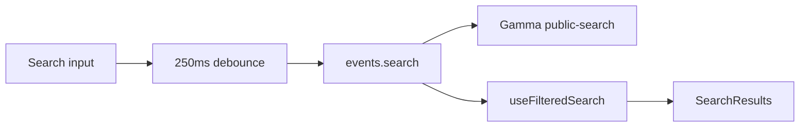

# Global search: performance + search quality

## Context

Global search lives in [`apps/web/src/components/layout/global-search.tsx`](apps/web/src/components/layout/global-search.tsx) (tRPC `events.search` + [`use-filtered-search.ts`](apps/web/src/components/layout/use-filtered-search.ts)). Server work is in [`apps/server/src/lib/polymarket/gamma.ts`](apps/server/src/lib/polymarket/gamma.ts) (`searchMarkets` → Gamma `GET /public-search`), cached via resilient fetch (60s TTL).



---

## Part A — Performance (unchanged intent)

### A1. Stop queries and debounce bleed after close (high value)

**Problem:** `closeSearch` clears `query` but not `debouncedQuery`, so for up to ~250ms `normalizedQuery` can still satisfy `searchEnabled`, keeping `useQuery` active while the dialog is closed.

**Changes in [`global-search.tsx`](apps/web/src/components/layout/global-search.tsx):**

- Set `enabled: open && searchEnabled` on the `useQuery` spread.
- In `closeSearch`, also call `setDebouncedQuery("")`.

### A2. Split card mapping from filters in `useFilteredSearch` (medium value)

**Problem:** One `useMemo` depends on `volumeFilter`, `expiringFilter`, and `data`. Every chip change re-runs `gammaMarketToDiscoveryCard` for all raw markets.

**Approach:**

- **Memo A:** `data?.markets` → `MarketWithCard[]` (same try/catch). Depends on `data`.
- **Memo B:** Apply volume then expiring filter. Depends on memo A, `volumeFilter`, `expiringFilter`, `now`.

Keep `events: data?.events ?? []` unchanged.

### A3. Optional: React Query `staleTime` for search only

On `events.search` `useQuery`, add `staleTime: 60_000` to align with server-side Gamma cache (60s), unless product prefers fresher results (keep default 30s).

### A4. Minor follow-ups (optional)

- Derive `profileCount` from `filteredProfiles.length` to avoid duplicate passes.

---

## Part B — Search quality / “bad results” (new)

### B1. What users are seeing (symptoms)

- Exact or “obvious” queries miss expected markets/events; **partial** spellings sometimes work better.
- That pattern usually comes from **how the upstream index tokenizes and ranks** (prefix/substring behavior, phrase vs term matching), not from a typo-tolerant fuzzy engine we control.

**Important:** Full relevance parity with Google-style search is **not** achievable purely in the app without a **separate search index** (e.g. Typesense/Algolia/Meilisearch) or Gamma product changes.

### B2. What we control today

[`searchMarkets`](apps/server/src/lib/polymarket/gamma.ts) only passes:

```ts
{ q: query, search_profiles: "true" }
```

Polymarket’s OpenAPI for `GET /public-search` documents additional query parameters, including:

| Parameter             | Role (per OpenAPI)             |
| --------------------- | ------------------------------ |
| `search_tags`         | Include tags in search         |
| `limit_per_type`      | Cap results per type           |
| `sort` / `ascending`  | Ordering                       |
| `events_status`       | Filter event status            |
| `page`                | Pagination                     |
| `keep_closed_markets` | Include/exclude closed markets |
| `cache`               | Cache control                  |
| `optimized`           | Optimized response flag        |

We do **not** currently send `search_tags: true`, so tag-only matches may be missing. Defaults for `limit_per_type` may truncate useful hits when many profiles/events compete for the same budget.

**Client-side:** Volume and “Expiring in” filters **remove** rows after the API returns—users may think “search is broken” when filters are on.

### B3. Recommended investigation (before coding)

**References (Polymarket):**

- [Search markets, events, and profiles](https://docs.polymarket.com/api-reference/search/search-markets-events-and-profiles) (human-readable)
- OpenAPI: `GET /public-search` in [gamma-openapi.yaml](https://docs.polymarket.com/api-spec/gamma-openapi.yaml) (full parameter list)

**Steps:**

1. **Manual API comparison:** Call `GET https://gamma-api.polymarket.com/public-search` with the same `q` and compare responses with vs without `search_tags=true`, different `limit_per_type`, and `sort`. Document which params change result sets meaningfully.
2. **Reproduce with filters off:** Confirm bad results still happen with volume “off” and expiring “All” to separate **API** issues from **UI filter** issues.
3. **Pagination:** If the first page is thin, consider exposing `page` or “Load more” only if product wants it (extra UI work).
4. **Reset filters on query change:** Decide explicitly (default in plan: **decide during spike**): reset volume/expiry when `query` changes so stale filters do not empty results, or keep filters until user clears them.

### B4. Likely code changes (after spike)

- Extend `events.search` input (Zod) with **optional** fields mirroring safe Gamma params (`search_tags`, `limit_per_type`, `page`, `sort`, etc.) and forward them from [`searchMarkets`](apps/server/src/lib/polymarket/gamma.ts) via `toStringParams`.
- Default `search_tags: "true"` if spike shows no downside (validate response shape still matches `SearchResultSchema`).
- **Do not** add fuzzy/spellcheck in-process unless product explicitly wants a second index; scope is large.

### B5. UX mitigations (low code)

- When the user edits the query, **reset** volume/expiry filters to defaults so prior filters do not hide new results (behavior change—confirm with product).
- Empty state copy: distinguish “no API results” vs “filtered out” when filters are active.

---

## Part C — Verification

- **Performance:** Close dialog after typing—no trailing search request; chip toggles do not remap all markets (Profiler).
- **Quality:** Spot-check 3–5 real queries with params on/off; confirm tags search if enabled.
- Run `pnpm fix` and `pnpm check-types`; tests touching [`global-search-utils`](apps/web/src/components/layout/global-search-utils.ts) if logic moves.

---

## Scope note

- **Performance items (A)** are localized to web layout + hook.
- **Quality items (B)** touch the server router and `gamma.ts` and require **API spike** first so we do not ship blind defaults that shrink or break search.
