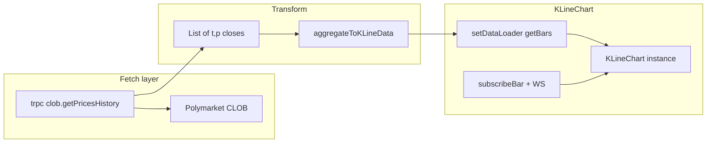

# KLineChart migration and OHLC data pipeline

**Canonical reference (Polymarket + KLineChart ideas, WS gems, OHLC recipe, risks):** `[docs/CHARTING-KLINE-POLYMARKET.md](../docs/CHARTING-KLINE-POLYMARKET.md)`

## What the reference docs say (KLineChart)

Your clone at `references/KLineChart` matches the published docs: [Data](https://www.klinecharts.com/en-US/guide/data-source) defines `**KLineData`**with `**timestamp` in milliseconds**, required `**open` / `high` / `low` / `close`**, optional `volume` / `turnover`. v10 loads data only through `**setDataLoader`**:

- `**getBars({ type, timestamp, symbol, period, callback })**` — `type` is `'init' | 'forward' | 'backward' | 'update'`; you call `callback(rows, more?)` with `KLineData[]`.
- Optional `**subscribeBar` / `unsubscribeBar**` for realtime bars (maps cleanly to today’s `last_trade_price` WebSocket path).

`Period` is `{ type: 'minute' | 'hour' | ..., span: number }` (e.g. 1-hour bars = `{ type: 'hour', span: 1 }`).

**Version decision: use klinecharts 10.x.** Pin the **exact** version published on npm (reference clone may show `10.0.0-beta1`; prefer the latest 10.x that satisfies the repo). Implement against **v10 APIs only** — data flows through `setDataLoader` (not legacy `applyNewData` / `updateData`). Background on breaking changes: `references/KLineChart/docs/en-US/guide/v9-to-v10.md`. Treat `**node_modules/klinecharts` typings** as the source of truth when docs and changelog disagree.

## Current Doji charting (to remove)

| Area        | Files / behavior                                                                                                                                                                                                                                                                                                                                                                                                                                                                                                              |
| ----------- | ----------------------------------------------------------------------------------------------------------------------------------------------------------------------------------------------------------------------------------------------------------------------------------------------------------------------------------------------------------------------------------------------------------------------------------------------------------------------------------------------------------------------------- |
| LWC         | `[apps/web/package.json](apps/web/package.json)` `lightweight-charts`; `[use-chart.ts](apps/web/src/components/charts/use-chart.ts)`, `[time-series-chart-inner.tsx](apps/web/src/components/charts/time-series-chart-inner.tsx)`, `[theme-options.ts](apps/web/src/components/charts/theme-options.ts)`, `[series.ts](apps/web/src/components/charts/series.ts)`, `[chart-time-format.ts](apps/web/src/components/charts/chart-time-format.ts)`, `[chart-container.tsx](apps/web/src/components/charts/chart-container.tsx)` |
| TradingView | `[tradingview-advanced-chart.tsx](apps/web/src/components/charts/tradingview-advanced-chart.tsx)`, `[polymarket-datafeed.ts](apps/web/src/components/charts/polymarket-datafeed.ts)`, `[tradingview-polymarket-timeframes.ts](apps/web/src/components/charts/tradingview-polymarket-timeframes.ts)`, `[create-mock-datafeed.ts](apps/web/src/components/charts/create-mock-datafeed.ts)`, `pnpm charting:setup`, `[apps/web/next.config.ts](apps/web/next.config.ts)` transpile + `/static/charting_library` headers          |
| Slot        | `[chart-slot.tsx](apps/web/src/components/charts/chart-slot.tsx)` branches `lwc` vs `advanced`; props thread through `[trading-layout.tsx](apps/web/src/components/trading/trading-layout.tsx)`, `[trading-layout-terminal.tsx](apps/web/src/components/trading/trading-layout-terminal.tsx)`, `[event-page-composition.tsx](apps/web/src/components/event/event-page-composition.tsx)`, `[event-page-layout.tsx](apps/web/src/components/event/event-page-layout.tsx)`                                                       |
| Markers     | `[use-trade-markers.ts](apps/web/src/components/charts/use-trade-markers.ts)` is LWC `SeriesMarker`-specific — must be reimplemented with KLineChart **overlays** (see reference `docs/en-US/guide/overlay.md`) or another supported primitive                                                                                                                                                                                                                                                                                |

Docs to refresh during implementation: **Quick start** (incl. `docs/@views/quick-start/create-chart/react.md`), **Data**, **Styles** (`guide/styles.md` — full default config is included from `@views/styles/config.md`), **FAQ**, **Indicator**, **Overlay**, **Figure**, **v9-to-v10**, and chart/instance APIs `**init`**, `**setDataLoader`**, `**setSymbol**`, `**createOverlay**`, `**scrollToRealTime**`, `**dispose**`, `**resize**`.

### Additional documentation notes (deep read)

- **React lifecycle:** Official pattern is `useEffect` → `init('chart')` (or an `HTMLElement`) → `chart.setSymbol` → `chart.setPeriod` → `chart.setDataLoader({ getBars })` → cleanup `dispose('chart')`. Container must have **explicit height** (FAQ: “only one line” is usually zero-height container).
- `**init(dom, options?)`:** Supports `layout` (pane types `candle` | `indicator` | `xAxis`, per-pane `order`, `axis` with `position`, `createRange`, `createTicks`, etc.), `locale` (`zh-CN` / `en-US`), `timezone` (IANA name), `styles` (built-in name or registered styles), `formatter` (`formatDate`, `formatBigNumber`), `thousandsSeparator`, `decimalFold`, `zoomAnchor` (`last_bar` | `cursor`).
- **Symbol / precision:** `setSymbol({ ticker, pricePrecision, volumePrecision })`. FAQ: if candles look like a flat line, **raise `pricePrecision`** (important for Polymarket 0–1 prices / cents display).
- **“Realtime” look:** FAQ recommends `chart.setStyles({ candle: { type: 'area' } })` for area-style series (optional product mode).
- **Indicators:** Large built-in set (MA, EMA, BOLL, MACD, RSI, …). Some indicators can overlay the candle pane: `chart.createIndicator('MA', true, { id: 'candle_pane' })` — compatible overlays include BBI, BOLL, EMA, MA, SAR, SMA per docs.
- **Overlays / trade marks:** FAQ explicitly recommends `**simpleAnnotation`**via `**createOverlay({ name: 'simpleAnnotation', ... })`** for buy/sell style points. Built-in overlay types also include line tools (`segment`, `priceLine`, …), `simpleTag`, etc. `createOverlay` accepts `points`, `extendData`, `styles`, and many mouse lifecycle callbacks; returns overlay id(s).
- **Scrolling:** `scrollToRealTime(animationDuration?)` for “jump to latest” (same role as your current LWC “Latest” control).
- **Architecture (for contributors):** Module stack `Figure` → `View` → `Widget` → `Pane` → `Chart` (from `guide/local-development.md`).
- **v10 changelog nuance:** Beta changelog mentions removal/replacement of several APIs; trust the **v9-to-v10** migration doc and the **installed package’s `d.ts`** for `setSymbol` vs precision helpers — verify against npm version you pin.

## Data reality: Polymarket vs your friend’s recipe

**Source today:** `[clob.getPricesHistory](apps/server/src/routers/clob.ts)` → `[getPriceHistory](apps/server/src/lib/polymarket/clob-read.ts)` returns `**{ t, p }[]`** — one sample per CLOB bucket. That `p` behaves like a **close** for that bucket; there is **no native tick stream** in this endpoint.

**Fidelity** is “minutes between points” (`[apps/server/src/constants.ts](apps/server/src/constants.ts)`): e.g. `max` uses **1440** (one point per day). `[resolvePriceHistoryRequest](apps/server/src/routers/clob.ts)` already picks defaults; Polymarket can **reject** too-fine fidelity for long spans.

**Mapping to your friend’s steps:**

1. **Highest granularity:** For each chart load / pan, request the **finest fidelity the CLOB accepts** for that `startTs`–`endTs` (often **1** for short windows; larger for long). You may need **chunked requests** (multiple ranges) if a single call hits limits or payload size.
2. **Treat each `{t,p}` as a measurement** (close-only series).
3. **Aggregate to the chart’s `period`** (user-selected or KLineChart period):

- `**open`:** `previous.close` (carry) for a **continuous chain** — matches “zero gaps” between **bars that exist**.
- `**high` / `low`:** min/max of **closes** in the bucket (and include `open`/`close` of that bucket in min/max so the first/last point affect the range).
- `**close`:** last sample in the bucket.
- Alternative `**open` = first tick in bucket** is better when many intrabucket samples exist; with CLOB you often have **one point per sub-bucket**, so **carry-open** is the usual choice for prediction markets.

1. **Frontend:** Feed `**KLineData`** with **timestamps in ms** (`t * 1000` if CLOB stays in seconds). Align bucket boundaries to UTC (e.g. hour open) consistently.

**Important limitation:** OHLC for a **1h** bar is only as rich as the **underlying samples**. If the API only gives **one daily** point for old history, a “1h” view **cannot** recover true hourly high/low — you either **refetch** a finer window when the user zooms in, or **accept** coarse history (single-point candles = `O=H=L=C`).

**“Lack of data for full candles”:** This is expected for **illiquid** markets (few buckets). Mitigations:

- **Sparse mode:** if aggregated bar count < threshold, switch chart type to **line** (KLineChart supports time line) or keep candles but expect **doji-like** bars — product choice.
- **Never invent** missing buckets as fake trades; optional **flat carry** segments are a deliberate UX decision (can look like a step chart).

## Architecture

## Implementation phases

### 1. Dependencies and cleanup targets

- Add `**klinecharts@10**` to `[apps/web/package.json](apps/web/package.json)` with an **exact or caret-pinned 10.x** version from npm (avoid accidentally resolving to 9.x).
- Remove `**lightweight-charts`**, TV setup script usage, and **conditional `chartVariant`** plumbing (or collapse to a single chart implementation).
- Update `[apps/web/next.config.ts](apps/web/next.config.ts)`: drop `lightweight-charts` from `transpilePackages`; remove TradingView static route if nothing else serves `/static/charting_library`.
- Update `[apps/web/AGENTS.md](apps/web/AGENTS.md)`, `[apps/web/src/components/charts/AGENTS.md](apps/web/src/components/charts/AGENTS.md)`, `[apps/web/src/components/trading/AGENTS.md](apps/web/src/components/trading/AGENTS.md)`, and root references to **charting:setup** / dual-engine.

### 2. Pure aggregation module (testable)

- New util (e.g. under `apps/web/src/utils/` or `apps/web/src/components/charts/`): `**aggregatePricePointsToKLineData(points, periodMs, { carryOpen: true })`**.
  - Input: sorted `{ t: number; p: number }[]` (seconds), dedupe same-`t` like `[toChartData](apps/web/src/components/charts/time-series-chart-utils.ts)`.
  - Output: `KLineData[]` with **ms** timestamps at **bucket starts**.
- Unit tests (Vitest): empty, single point, two points, multiple buckets, carry-open chain, identical closes (doji).

### 3. React bridge component

- `**dynamic(..., { ssr: false })`**wrapper: `init` on a container `div`, `dispose` on unmount, `**ResizeObserver`** → `chart.resize()`.
- `**setDataLoader`:** implement `getBars`:
  - Map KLineChart `**period`** → bucket size in ms.
  - From `type` / `timestamp`, compute `startTs`/`endTs` (seconds) for tRPC.
  - Call `**trpcClient.clob.getPricesHistory`** with explicit range + **finest valid `fidelity`** (start with **1** when span allows; on `BAD_REQUEST`, retry with coarser fidelity from a small ladder — mirrors existing error handling in the router).
  - Run `**aggregatePricePointsToKLineData`**, then `callback(data, more)`; set `more.backward` / `more.forward` if history may exist outside range (based on oldest returned `t` vs requested window).
- `**subscribeBar`:**wire `**marketChannel`** `last_trade_price` (same filtering as `[polymarket-datafeed.ts](apps/web/src/components/charts/polymarket-datafeed.ts)`) to emit an **updated last bar** or new bar depending on period alignment.

### 4. Theming and UX

- `**setStyles`** / overrides to match Doji tokens (doji green accent, dark surfaces) — follow `[apps/web/src/index.css](apps/web/src/index.css)` semantic colors; no hardcoded one-off hex except where the chart API requires it.
- Replicate interval presets (1H / 6H / 1D / …) by `**setPeriod`**+ optional `**scrollToRealTime`**-style control if exposed (reference has `scrollToRealTime` on instance).

### 5. Trade markers

- Replace LWC markers with KLineChart **overlays** (or documented marker API if any): map user trades to overlay annotations at trade time; keep tRPC trade fetch logic, drop `SeriesMarker` types from `[index.ts](apps/web/src/components/charts/index.ts)`.

### 6. SSR / consumers

- Replace `**TimeSeriesChart`**+ `**ChartSlot`** with one `**PolymarketKLineChart**` (name TBD) used from trading and event layouts.
- `[apps/web/src/app/(trading)/market/[slug]/page.tsx](../apps/web/src/app/(trading)`/market/[slug]/page.tsx) / `[apps/web/src/app/(trading)/event/[slug]/page.tsx](../apps/web/src/app/(trading)`/event/[slug]/page.tsx): continue passing initial history for hydration if desired — **convert** server-fetched `{ t, p }[]` through the same aggregator for first paint, or let the client loader handle everything for simplicity (pick one to avoid double logic).

### 7. Optional server enhancement (later)

- If client-side chunking becomes painful, add a thin procedure `**clob.getPricesHistoryAggregated`** that returns **pre-bucketed OHLC** (same carry-open rules) to shrink payloads — not required for v1.

## Risk register

| Risk                             | Mitigation                                                                                                                        |
| -------------------------------- | --------------------------------------------------------------------------------------------------------------------------------- |
| **klinecharts 10.x** API churn   | Pin exact version; read release notes before upgrades; verify behavior against `d.ts` + [main docs](https://www.klinecharts.com). |
| CLOB **fidelity / range** errors | Retry ladder; surface a short user message when only coarse data exists.                                                          |
| **Sparse** markets               | Line fallback or expect flat candles; document in UI copy if needed.                                                              |
| **Trade markers** parity         | Overlays may differ visually from LWC circles — acceptable if documented.                                                         |

## Suggested commit sequence

1. `feat(web): add klinecharts bridge + aggregation utils + tests`
2. `feat(web): migrate ChartSlot/trading layouts to KLineChart`
3. `chore(web): remove lightweight-charts, TradingView, charting setup`
4. `docs: update AGENTS for single chart engine`
