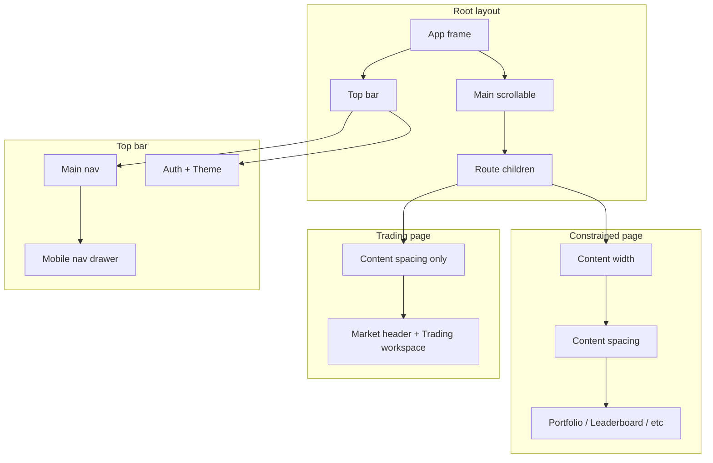

# Layout foundation and responsive redesign

Layout is defined by **roles and responsibilities**, not by fixed component names. The app is a **trading terminal / prediction-market / crypto dashboard**: dense, information-rich, full-bleed trading workspace where it matters, constrained readable width for account/settings pages. Implementation chooses concrete component names (e.g. AppFrame, PageWidth, ContentArea, MainNav—or any consistent naming the team prefers).

This plan follows 15 skills (see [Skills quick reference](#skills-quick-reference)): building-components, frontend-design, interaction-design, interface-design, responsive-design, shadcn/ui, tailwind-design-system, ui-ux-pro-max, vercel-composition-patterns, visual-design-foundations, web-component-design, web-design-guidelines, vercel-react-best-practices, next-best-practices.

**Plan structure:** [Goals & success criteria](#goals--success-criteria) → [Skills quick reference](#skills-quick-reference) → [Domain (§1)](#1-domain-trading-terminal--crypto-dashboard) → [Skill references (§1.5–1.17)](#skills-quick-reference) → [Layout roles (§2)](#2-layout-roles-what-the-app-needs) → [When to use (§3)](#3-when-to-use-which-layout) → [Phase 1 (§6)](#6-phase-1-migration) → [Phase 2 (§7)](#7-phase-2-feature-component-redesign-start-fresh) → [Files (§8)](#8-files-to-add-or-touch).

**Pre-implementation audit:** [CODEBASE_AUDIT.md](./layout_foundation_redesign_CODEBASE_AUDIT.md) — dead code, plan vs code misalignments, delete vs edit recommendations, naming collisions.

---

## Goals & success criteria

**Goals**

1. **Single layout foundation** — One app frame, one content-width system, one top bar + main nav. No ad-hoc padding or max-width scattered across pages.
2. **Role-based usage** — Constrained pages (portfolio, leaderboard, profile) get narrow/default width; trading pages get full-bleed. Clear mapping per page type.
3. **Responsive chrome** — Desktop: inline nav. Mobile: hamburger + Sheet/Drawer with nav. Touch targets, focus management, semantic HTML.
4. **Phase 2 foundation** — Clean, compound-component structure for market, event, and trading; composable inside layout; no document-level layout in feature components.

**Success criteria**

- **Phase 1 done:** All pages use layout roles; no `mx-auto max-w-* p-4` patterns; mobile nav works; layout docs exist.
- **Phase 2 done:** New workspace, order form, orderbook, chart, market/event compositions; pages wired; old usage removed; Web Interface Guidelines compliance passed.

---

## Skills quick reference

| §    | Skill                       | Focus                                                    |
| ---- | --------------------------- | -------------------------------------------------------- |
| 1.5  | frontend-design             | Tone, typography, color, motion, spatial composition     |
| 1.6  | interaction-design          | Timing, easing, prefers-reduced-motion, skeletons        |
| 1.7  | interface-design            | Intent, craft foundations, states, swap/signature checks |
| 1.8  | responsive-design           | Mobile-first, container queries, fluid type, 44px touch  |
| 1.9  | shadcn/ui                   | cn(), asChild, CVA, Radix, Sheet, RHF+Zod                |
| 1.10 | tailwind-design-system      | Semantic tokens, @theme, OKLCH, CVA                      |
| 1.11 | ui-ux-pro-max               | Pre-delivery checklist, contrast, no emoji icons         |
| 1.12 | vercel-composition-patterns | Compound components, no boolean props                    |
| 1.13 | visual-design-foundations   | Type scale, 8pt grid, WCAG, icon sizing                  |
| 1.14 | web-component-design        | API design, memoization, error boundaries                |
| 1.15 | web-design-guidelines       | Compliance review, a11y, focus, forms                    |
| 1.16 | vercel-react-best-practices | Waterfalls, bundle, RSC, re-renders                      |
| 1.17 | next-best-practices         | File conventions, RSC, async, next/image                 |

---

## 1. Domain: trading terminal / crypto dashboard

**Reference feel:** Think or Swim, Axiom, Photon, DEX Screener, Polymarket—prediction markets, memecoins, crypto, gambling-adjacent UIs.

**Implications:**

- **Trading workspace (market/event pages):** Use full viewport width. Chart, orderbook, and order form should not be squeezed into a narrow column; the workspace is the hero. No max-width on the main trading area.
- **Non-trading pages (portfolio, leaderboard, profile, bridge, settings):** Constrained width + consistent padding for readability and scanability. Single source of truth for max-width and horizontal padding.
- **Top bar:** Dense; logo, main nav, account, theme. Mobile: collapse nav into hamburger + drawer/sheet.
- **Visual:** Already theme-aware (surface tokens, dark-friendly). Keep using design tokens only; no hardcoded colors.

---

## 1.5 Design direction and aesthetics (frontend-design skill)

Before implementation, commit to a clear aesthetic direction and execute it with precision. Per [.cursor/skills/frontend-design](.cursor/skills/frontend-design):

**Design thinking (pre-build)**

- **Purpose:** Trading terminal for prediction markets / crypto; used by traders who need dense, scannable data and quick actions.
- **Tone:** For this domain, lean **industrial / utilitarian** or **brutalist / raw**—Think or Swim, DEX Screener, terminal UIs. Dense but scannable; restraint and precision over maximalism. Elegance from executing the vision well, not from decoration.
- **Differentiation:** What makes it memorable? Pick one thing (e.g. distinctive typography, unexpected spatial composition, or a signature micro-interaction) and commit to it. Avoid cookie-cutter layout and generic AI aesthetics.

**Typography**

- Avoid generic fonts (Inter, Roboto, Arial, system-ui). Use distinctive, characterful choices—e.g. a technical/monospaced display font paired with a refined body font, or a geometric sans that reads well at small sizes for dense tables.
- Pair fonts intentionally: display for headings/brand, body for readable content.

**Color and theme**

- Commit to a cohesive palette. Use CSS variables and design tokens for consistency. Dominant base colors with sharp accents (e.g. buy/sell, status, highlights) outperform timid, evenly-distributed palettes.
- Trading UIs often use dark-dominant with accent colors for states (green/red for buy/sell, etc.). Ensure sufficient contrast and theme support (light/dark).

**Motion**

- Use animations for high-impact moments, not scattered micro-interactions. One well-orchestrated sequence (e.g. staggered reveal on workspace load, order confirmation feedback) creates more delight than many small effects.
- CSS-first where possible; Motion (or similar) for React when needed. Scroll-triggering and hover states that surprise without distracting from the task.
- For a terminal: restraint. Subtle transitions (e.g. sheet open/close, tab switches) over flashy animations.

**Spatial composition**

- Unexpected layouts, asymmetry, overlap, and grid-breaking elements can differentiate. For trading: controlled density and generous negative space around the workspace so data breathes; avoid cramped, default grid-only layouts.
- Consider overlap or diagonal flow for headers or section dividers if it fits the chosen tone.

**Backgrounds and visual details**

- Create atmosphere and depth rather than flat solid colors. Subtle grain, gradient meshes, or layered transparencies can add character. For a terminal: darker surfaces, subtle borders, and depth through elevation (surface tokens) rather than decoration.
- Match complexity to the aesthetic: industrial/utilitarian needs restraint—precision in spacing, typography, and subtle details.

**Anti-patterns (avoid)**

- Overused fonts (Inter, Roboto, Space Grotesk).  
- Cliched color schemes (purple gradients on white, etc.).  
- Predictable, symmetrical layouts that lack context-specific character.  
- Generic AI-generated aesthetics; every design should feel intentionally designed for a trading terminal.

---

## 1.6 Interaction design (interaction-design skill)

Motion and feedback must communicate, not decorate. Per [.cursor/skills/interaction-design](.cursor/skills/interaction-design):

**Purposeful motion**

- **Feedback:** Confirm user actions (order placed, tab changed, form submitted).
- **Orientation:** Show where elements come from or go to (sheet slides up, drawer slides in).
- **Focus:** Direct attention to important changes (order confirmation, error state).
- **Continuity:** Maintain context during transitions (e.g. market → event).

**Timing scale**

- **100–150ms:** Micro-feedback (hovers, clicks, button press).
- **200–300ms:** Small transitions (toggles, dropdowns, collapsible sections).
- **300–500ms:** Medium transitions (modals, sheet open/close, page changes).
- **500ms+:** Complex choreographed sequences only when justified.

Use a consistent timing scale across the app; avoid ad-hoc durations.

**Easing**

- `ease-out` (decelerate) for entering; `ease-in` (accelerate) for exiting; `ease-in-out` for movement between states.
- Prefer spring/elastic easing for natural feel (toggles, interactive elements); linear only when appropriate.

**Performance**

- Animate only `transform` and `opacity` for smooth 60fps. Avoid animating `width`, `height`, `top`, `left` (causes jank).
- Use `will-change` sparingly; clean up animation listeners on unmount.

**Accessibility: reduced motion (critical)**

- **Always** respect `prefers-reduced-motion: reduce`. When set, reduce or eliminate animations (e.g. duration → 0.01ms or skip animations).
- Provide CSS: `@media (prefers-reduced-motion: reduce) { animation-duration: 0.01ms !important; transition-duration: 0.01ms !important; }`
- In React/Motion: check `matchMedia("(prefers-reduced-motion: reduce)")` before applying animated transitions.

**Loading and feedback**

- **Skeleton screens:** Preserve layout while loading (event cards, orderbook, chart).
- **Progress indicators:** Use for determinate progress (e.g. bridge, upload).
- **State transitions:** Smooth toggles, tab switches; never block user input during animations.
- **Interruptible:** Allow users to cancel or override long animations.

**Anti-patterns**

- Over-animation causes fatigue; for a terminal, restrain motion.
- Never prevent user input during animations.
- Jank from animating layout properties.

---

## 1.7 Interface design (interface-design skill)

For dashboards, tools, and data interfaces—not marketing. Per [.cursor/skills/interface-design](.cursor/skills/interface-design):

**Intent first**

- **Who is this human?** The actual person: where they are, what's on their mind, what they did 5 minutes ago and will do next. A trader at market open is not a casual browser.
- **What must they accomplish?** The verb: place an order, scan opportunities, manage positions. That drives what leads, what follows, what hides.
- **What should this feel like?** Specific words—"clean and modern" means nothing. Dense like a trading floor? Cold like a terminal? Calm like a reading app? Intent must shape color, type, spacing, density—everything.
- **Every choice must be a choice:** For layout, color, typeface, spacing—explain WHY. If the answer is "it's common" or "it works," you've defaulted.
- **Intent must be systemic:** If the intent is dense, spacing and type size must be dense. If cold, surfaces and borders must be cold. One stated intent, every token reinforces it.

**Where defaults hide**

- **Typography:** It isn't holding your design—it *is* your design. A trading terminal needs cold, precise type, not warm and handmade. Reach for type that fits the domain.
- **Navigation:** It isn't around your product—it *is* your product. Where you are, where you can go, what matters most. The nav teaches people how to think about the space.
- **Data:** A number on screen is not design. What does this number *mean* to the person? What will they do with it? A progress ring and a stacked label both show "3 of 10"—one tells a story.
- **Token names:** `--ink` and `--parchment` evoke a world. `--gray-700` and `--surface-2` evoke a template. Tokens should sound like they belong to this product's world.

**Craft foundations**

- **Subtle layering:** Surfaces must be barely different but still distinguishable. Study Vercel, Linear—elevation changes so subtle you almost can't see them, but you feel hierarchy. Not dramatic jumps. Whisper-quiet shifts.
- **Borders:** Light but not invisible. Disappear when you're not looking, findable when you need structure. If borders are the first thing you notice, they're too strong.
- **Squint test:** Blur your eyes. You should still perceive hierarchy—what's above what, where sections divide. Nothing should jump out harshly.
- **Infinite expression:** No interface should look the same. Same concepts (sidebar, cards, metrics)—infinite expressions. Linear ≠ Notion ≠ Stripe. Architecture emerges from the task and data.
- **Color lives somewhere:** The palette should feel like it came FROM the product's world, not applied TO it. Color carries meaning—status, action, emphasis. One accent used with intention beats five used without thought.

**Design principles**

- **Spacing:** Pick a base unit; stick to multiples. Consistency matters more than the specific number.
- **Padding:** Symmetrical unless there's a clear reason not to.
- **Depth:** Choose ONE approach—borders-only (technical, dense) / subtle shadows (soft) / layered shadows (premium). Don't mix.
- **Border radius:** Sharper = technical; rounder = friendly. Apply consistently.
- **Typography:** Headlines need weight and tight tracking; body needs readability; data needs monospace.
- **Color & surfaces:** Build from primitives—foreground, background, border, brand, semantic. No random hex; everything maps to the system.
- **States:** Every interactive element: default, hover, active, focus, disabled. Data: loading, empty, error. Missing states feel broken.

**Avoid**

- Harsh borders, dramatic surface jumps, inconsistent spacing
- Mixed depth strategies
- Missing interaction states (hover, focus, disabled, loading, error)
- Dramatic drop shadows
- Multiple accent colors—dilutes focus
- Gradients and color for decoration—color should mean something

**The checks (before presenting)**

- **Swap test:** Swap the typeface or layout for a common alternative—would anyone notice? If not, you defaulted.
- **Signature test:** Can you point to five specific elements where your signature appears?
- **Token test:** Do CSS variables sound like they belong to this product's world?

---

## 1.8 Responsive design (responsive-design skill)

Layouts must adapt seamlessly across screen sizes. Per [.cursor/skills/responsive-design](.cursor/skills/responsive-design):

**Mobile-first**

- Start with mobile styles; enhance for larger screens with `min-width` media queries. Base styles = mobile; breakpoints add complexity.
- Breakpoints based on **content**, not devices—when does the layout break or feel wrong? sm: 640px, md: 768px, lg: 1024px, xl: 1280px, 2xl: 1536px (Tailwind). Document which breakpoint drives top bar hamburger (e.g. below lg).

**Container queries**

- Use for **component-level** responsiveness—a card, orderbook, or chart responding to its container width, not the viewport. Enables reusable components that adapt wherever they're placed.
- `container-type: inline-size`; `@container (min-width: X)` for layout shifts. Container query units (`cqi`, `cqw`, `cqh`) for fluid sizing within a component.
- Fallbacks for older browsers if needed.

**Fluid typography and spacing**

- Prefer `clamp(min, preferred, max)` for typography and spacing—fluid scaling between bounds instead of fixed breakpoint jumps.
- `clamp(0.75rem, 0.7rem + 0.25vw, 0.875rem)` pattern: min size, fluid preferred, max size.
- Viewport-relative units (`vw`, `dvh`, `svh`) with bounds; avoid raw `vw` without `clamp`.

**Layout patterns**

- **CSS Grid** for 2D layouts (workspace grid, card grids); `repeat(auto-fit, minmax(min(Xpx, 100%), 1fr))` for responsive grids.
- **Flexbox** for 1D distribution (nav, header, rows).
- Named grid areas for complex page layouts that reflow by breakpoint.

**Viewport and height**

- Avoid `100vh` on mobile—browser chrome causes issues. Use `100dvh` (dynamic viewport) or `100svh` (small viewport) for full-height layouts. App frame: `min-h-svh` or `min-h-dvh`.

**Touch targets**

- Maintain minimum 44×44px touch targets on mobile for interactive elements (buttons, nav links, form controls).

**Responsive tables**

- For data tables: horizontal scroll with `overflow-x-auto` and `min-width`, or card-based layout on mobile (table hidden, cards shown).

**Best practices**

- **Fluid over fixed:** Prefer fluid typography/spacing over breakpoint-only changes where it improves continuity.
- **Test real devices:** Simulators miss viewport quirks, touch behavior, performance.
- **Logical properties:** Use `inline`/`block` instead of `left`/`right` for future i18n (RTL).
- **Performance:** Lazy load off-screen content; optimize images with `srcset` and `sizes`.

**Common issues to avoid**

- Horizontal overflow (content breaking viewport)
- Fixed widths (px) where relative units or `min()` would adapt
- Font too small on mobile
- Touch targets too small
- Z-index stacking problems on different screen sizes

---

## 1.9 shadcn/ui patterns (shadcn + shadcn-ui skills)

Doji uses shadcn/ui (Radix primitives + Tailwind). Per [.cursor/skills/shadcn](.cursor/skills/shadcn) and [.cursor/skills/shadcn-ui](.cursor/skills/shadcn-ui):

**Component architecture**

- **Use `cn()` for class merging:** Required by every shadcn component; prevents Tailwind conflicts. Never override with `!important`.
- **Use `asChild` for custom triggers:** When wrapping a button, link, or custom element—e.g. `SheetTrigger asChild`, `DialogTrigger asChild`—so behavior composes onto the child.
- **Extend variants with CVA:** Use Class Variance Authority (`cva`) for type-safe variant props (e.g. `variant`, `size`); isolate base styles from variant-specific styles.
- **Forward refs:** Composable components that integrate with forms or focus management must forward refs.
- **Preserve Radix structure:** Don't break the compound component hierarchy; Radix provides keyboard nav, focus trap, and ARIA.

**Accessibility**

- **Preserve ARIA attributes:** Keep Radix ARIA intact; don't strip or override without reason.
- **Icon buttons:** Add `aria-label` or wrap in `` for screen reader labels.
- **Dialogs/Sheets:** Always include `DialogTitle` / `SheetTitle` (can be visually hidden with `sr-only` if needed) for screen reader announcements.
- **Forms:** Associate labels with controls; use `aria-invalid` for error states; wrap Checkbox with Label for click target.
- **Focus visible:** Preserve `:focus-visible` styles for keyboard navigation.

**Layout and composition**

- **Sheet for mobile nav:** Use Sheet (not Dialog) for mobile navigation overlay—slide-in behavior fits nav. Plan already uses Sheet for order form and mobile nav.
- **Drawer for mobile modals:** Use Drawer (e.g. Vaul) for modal-like interactions on mobile; reduces touch distance.
- **Compound components:** Compose with Card, Form, etc. using the compound pattern (CardHeader, CardContent, etc.).

**Forms**

- **React Hook Form + Zod:** Use for form state and validation; Zod for schema and type inference.
- **Validation:** Show errors at appropriate times; debounce async validation; reset form state after submission.
- **FormField:** Use shadcn Form with FormField, FormControl, FormLabel, FormMessage for consistent structure.

**Data and loading**

- **Skeleton for loading:** Use Skeleton component for loading states; preserves layout and prevents shift.
- **Empty states:** Provide actionable empty states with guidance, not blank space.
- **Large lists/tables:** Virtualize 100+ items; paginate server-side for large datasets.

**Theming**

- **CSS variables:** Use for theme colors (already in index.css); enable dark mode via variables.
- **Tailwind theme extend:** Add custom tokens via `theme.extend`; don't hardcode colors.

**Setup**

- **Use CLI to add components:** `npx shadcn@latest add <component>`—ensures correct imports and structure. Avoid copy-paste.
- **components.json:** Configure before adding; path aliases must match.

---

## 1.10 Tailwind design system (tailwind-design-system skill)

Doji uses Tailwind v4 with CSS-first configuration. Per [.cursor/skills/tailwind-design-system](.cursor/skills/tailwind-design-system):

**Design token hierarchy**

- **Brand → Semantic → Component:** Abstract brand values map to semantic tokens (e.g. `--color-primary`, `--color-background`) which components use (`bg-primary`, `text-foreground`). No raw hex in component classes.
- **OKLCH colors:** Already used in [apps/web/src/index.css](apps/web/src/index.css); better perceptual uniformity than HSL. Continue using OKLCH for new tokens.

**Configuration (v4)**

- `**@theme` in CSS:** Theme tokens belong in `@theme` or `:root`/`.dark`; avoid `tailwind.config.ts` for tokens when using v4.
- `**@custom-variant dark`:** Dark mode via `@custom-variant dark (&:is(.dark *))` (or similar); class-based `.dark` on root. Already in use.
- `**@import "tailwindcss"`:** v4 import; no `@tailwind base/components/utilities`.
- **Animations:** Define `@keyframes` in `@theme` or CSS; reference via `--animate-*` or `data-[state=open]:animate-*`. Native CSS over JS animation libs where possible.

**Component styling**

- **Semantic tokens only:** Use `bg-primary`, `text-muted-foreground`, `border-border`—never `bg-blue-500` or arbitrary color values in components.
- **CVA for variants:** Same as shadcn; variant/size props via `cva()`.
- `**size-*` shorthand:** Prefer `size-10` over `h-10 w-10` for square elements.
- **Focus states:** Use `focus-visible:ring-2 focus-visible:ring-ring focus-visible:ring-offset-2` (or equivalent) for keyboard focus.

**Layout tokens**

- **Content width / container:** Can use CVA with size variants (`sm`, `md`, `lg`, `xl`, `full`) mapping to `max-w-*`; matches our content-width role. Responsive padding via `px-4 sm:px-6 lg:px-8`.
- **Grid:** Responsive grid with `grid-cols-1 sm:grid-cols-2 lg:grid-cols-*` or CVA-based `Grid` with `cols` and `gap` variants.

**Custom utilities**

- `**@utility` (v4):** Define reusable utilities in CSS when Tailwind's built-ins don't suffice. Prefer extending `@theme` over arbitrary values (`[...]`).

**Best practices**

- Use `@theme` blocks for design tokens.
- Use OKLCH for new color tokens.
- Compose with CVA for type-safe variants.
- Use semantic tokens; no hardcoded colors in components.
- Test dark mode; ensure all surfaces use tokens.
- Avoid arbitrary values where `@theme` can define a token.

---

## 1.11 UI/UX professional rules (ui-ux-pro-max skill)

Per [.cursor/skills/ui-ux-pro-max](.cursor/skills/ui-ux-pro-max)—common rules that distinguish professional UI from unprofessional:

**Icons and visual elements**

- **No emoji icons:** Use SVG icons (Lucide, Heroicons, Simple Icons), never emojis as UI icons.
- **Stable hover states:** Use color/opacity transitions; avoid `scale` transforms that cause layout shift.
- **Consistent icon sizing:** Fixed viewBox (e.g. 24×24) with consistent Tailwind size (`w-6 h-6`).
- **Brand logos:** Use correct SVG from Simple Icons when referencing brands.

**Interaction and cursor**

- **Cursor pointer:** Add `cursor-pointer` to all clickable elements (buttons, links, cards, interactive areas).
- **Hover feedback:** Provide clear visual feedback (color, shadow, border) on hover; no dead zones.
- **Smooth transitions:** 150–300ms for state changes; avoid instant or overly slow (>500ms).
- **Loading buttons:** Disable and show loading state during async operations; prevent double-submit.
- **Error feedback:** Display errors near the problem (inline, below field); clear, actionable messages.

**Light/dark mode contrast**

- **Text contrast:** Minimum 4.5:1 for normal text; avoid light gray (`slate-400`) for body text in light mode.
- **Muted text:** Use `slate-600` or darker for secondary text in light mode; `gray-400` is too light.
- **Glass/transparent:** In light mode, use sufficient opacity (e.g. `bg-white/80`) so content is readable.
- **Borders:** Ensure borders are visible in both modes; avoid `border-white/10` in light mode.

**Layout and spacing**

- **Viewport meta:** `width=device-width, initial-scale=1`; no `user-scalable=no`.
- **Readable font size:** Minimum 16px body text on mobile to prevent zoom on focus.
- **No horizontal scroll:** Content must fit viewport width on mobile.
- **Z-index scale:** Define a consistent scale (e.g. 10, 20, 30, 50, 100) for overlays, modals, toasts.
- **Fixed elements:** Account for fixed nav height when setting `padding-top` or `scroll-margin` on content.
- **Floating navbar:** If floating, add spacing from edges (`top-4 left-4 right-4`); don't cram to viewport edge.
- **Consistent max-width:** Use same container max-width across related pages.

**Typography**

- **Line height:** 1.5–1.75 for body text.
- **Line length:** Limit to 65–75 characters per line for readability.

**Pre-delivery checklist**

Before presenting UI: no emoji icons; cursor-pointer on clickables; hover and focus states; transitions 150–300ms; sufficient contrast in light and dark; no content hidden behind fixed nav; responsive at 375px, 768px, 1024px, 1440px; no horizontal scroll; alt text, labels, `prefers-reduced-motion`.

**Optional: design system generation**

For greenfield or major redesign, the skill provides a CLI to generate a design system: `python3 skills/ui-ux-pro-max/scripts/search.py "<product industry keywords>" --design-system -p "Project Name"`. Use when defining direction for a new section or product type.

---

## 1.12 React composition (vercel-composition-patterns skill)

Per [.cursor/skills/vercel-composition-patterns](.cursor/skills/vercel-composition-patterns)—patterns that scale for flexible, maintainable components:

**Avoid boolean prop proliferation**

- Don't add boolean props (`isThread`, `isEditing`, `showAttachments`) to customize behavior. Each boolean doubles possible states and creates unmaintainable conditionals.
- Use **composition** instead: explicit variant components that compose the pieces they need. e.g. `ThreadComposer`, `EditComposer`, `ForwardComposer`—each renders exactly what it needs; no hidden modes.

**Compound components with shared context**

- Structure complex components (e.g. order form, workspace) as compound components with a shared context. Subcomponents access state via context, not props.
- Export as object: `OrderForm.Frame`, `OrderForm.Input`, `OrderForm.Submit`, `OrderForm.Footer`. Consumers compose the pieces they need.
- No monolithic component with `renderHeader`, `renderFooter`, `showX`, `showY`—use children composition.

**State management**

- **Decouple:** The provider is the only place that knows how state is managed. UI components consume a context interface—they don't know if state comes from `useState`, Zustand, or server sync.
- **Generic context interface:** Define `state`, `actions`, and `meta` in the context. Any provider can implement this interface—enables the same UI to work with different state sources (local form, global channel, etc.).
- **Lift state:** Move state into provider components so siblings can access it via context.

**Explicit variant components**

- Instead of one component with many boolean modes, create explicit variants: `MarketTradingWorkspace`, `EventBinaryWorkspace`, `EventMultiWorkspace`. Each is self-contained and self-documenting.
- Shared building blocks (orderbook, chart, form) are composed inside each variant; the variant controls what appears and in what order.

**Children over render props**

- Prefer `children` for composition instead of `renderHeader`, `renderFooter`, etc. Children are more readable and compose naturally.
- Use render props only when the parent must pass data back to the child (e.g. `renderItem={({ item }) => <Item item={item} />}`).

**React 19 (if applicable)**

- `ref` is a regular prop; no `forwardRef` needed.
- Use `use(Context)` instead of `useContext(Context)`; `use()` can be called conditionally.

---

## 1.13 Visual design foundations (visual-design-foundations skill)

Per [.cursor/skills/visual-design-foundations](.cursor/skills/visual-design-foundations)—implementation-level guidance for cohesive visual systems. Apply when establishing or refining design tokens, layout spacing, and component styling.

**Typography scale**

- Use a modular type scale (e.g. xs 12px → 5xl 48px) with consistent line heights: headings 1.1–1.3, body 1.5–1.7, UI labels 1.2–1.4.
- Fluid typography with `clamp()` for responsive headings and body. Max-width 65ch for readable prose.
- Limit font weights (2–3 per family). Avoid font overload.

**Spacing system**

- 8-point grid as baseline: 4, 8, 12, 16, 20, 24, 32, 40, 48, 64px (or equivalent rem).
- Component spacing: card padding 16–24px; section gap 32–64px; form field gap 16–24px; icon–text gap 8px.
- Maintain vertical rhythm: consistent spacing between related elements; headings get more space before/after.

**Color and contrast**

- Semantic tokens (primary, success, warning, error, neutrals)—name by purpose, not appearance. Plan dark mode from the start (bg-primary, text-primary, border tokens).
- WCAG: body text ≥ 4.5:1 (AA), large text ≥ 3:1, UI components ≥ 3:1. Use contrast checker before shipping.

**Iconography**

- Icon sizing scale: xs 12, sm 16, md 20, lg 24, xl 32px. Consistent sizing per context.
- `aria-hidden="true"` on decorative icons; `inline-block flex-shrink-0` to prevent layout shift.

**Best practices**

- Establish constraints: limit choices to maintain consistency.
- Use semantic tokens; no magic numbers or arbitrary values where a token exists.
- Test accessibility: contrast, touch targets (44px on mobile), focus/hover/disabled states.
- Document decisions in a living style guide.

**Common pitfalls (avoid)**

- Inconsistent spacing (undefined scale). Poor contrast (failing WCAG). Font overload. Missing hover/focus/disabled states. Retrofitting dark mode.

---

## 1.14 Web component design (web-component-design skill)

Per [.cursor/skills/web-component-design](.cursor/skills/web-component-design)—patterns for reusable, maintainable UI components. Doji uses React + Tailwind; apply these when building or refactoring components.

**Component API design**

- **Semantic prop names:** Use `isLoading`, `isDisabled` (not `loading`, `disabled` for booleans) for clarity.
- **Sensible defaults:** Provide default variants and sizes; consumers override when needed.
- **Composition via `children`:** Support `children` and slots (e.g. `leftIcon`, `rightIcon` for buttons) instead of prop explosion.
- **Style overrides:** Accept `className` and spread remaining props to underlying element; use `cn()` to merge. Avoid `!important`.

**Single responsibility**

- Each component does one thing well. Split large components; use composition for variants.

**Controlled vs uncontrolled**

- Support both patterns where appropriate (e.g. inputs, selects, accordions). Use `value` + `onChange` for controlled; internal state for uncontrolled.

**Memoization**

- Use `React.memo` for components that receive stable props but render often (e.g. orderbook rows, list items). Use `useMemo` for expensive derived values. Profile with React DevTools before over-memoizing.

**Error boundaries**

- Wrap components that may fail (chart, external widgets, dynamic imports) in error boundaries so a failure does not take down the whole app.

**Styling approach**

- Tailwind + CVA for variants (align with section 1.9, 1.10). No runtime CSS-in-JS for new components.

**Common pitfalls (avoid)**

- Prop explosion—use composition (section 1.12). Style conflicts—use `cn()` and scoped tokens. Re-render cascades—profile before memoizing. Accessibility gaps—test with keyboard and screen reader. Bundle bloat—tree-shake unused variants.

---

## 1.15 Web Interface Guidelines (web-design-guidelines skill)

Per [.cursor/skills/web-design-guidelines](.cursor/skills/web-design-guidelines)—Vercel Web Interface Guidelines. Run compliance review before shipping. Fetch latest from `https://raw.githubusercontent.com/vercel-labs/web-interface-guidelines/main/command.md` or apply rules below.

**Accessibility** — Icon-only buttons `aria-label`; form controls `<label>` or `aria-label`; interactive elements keyboard handlers; `<button>` for actions, `<a>`/`<Link>` for nav (not `
`); images `alt` or `alt=""` if decorative; decorative icons `aria-hidden="true"`; async updates `aria-live="polite"`; semantic HTML before ARIA; headings hierarchical; skip link; `scroll-margin-top` on anchors.

**Focus** — Visible focus `focus-visible:ring-*`; never `outline-none` without replacement; `:focus-visible` over `:focus`; `:focus-within` for compound controls.

**Forms** — Inputs `autocomplete`, `name`, correct `type`/`inputmode`; never block paste; labels clickable; `spellCheck={false}` on codes; checkbox/radio single hit target; submit enabled until request; errors inline, focus first on submit; placeholders with `…`; `autocomplete="off"` on non-auth; warn before nav with unsaved changes.

**Animation** — Honor `prefers-reduced-motion`; animate `transform`/`opacity` only; never `transition: all`; correct `transform-origin`; SVG transforms on `<g>` with `transform-box: fill-box`; interruptible animations.

**Typography** — Ellipsis `…` not `...`; curly quotes; non-breaking spaces; loading `"Loading…"`; `font-variant-numeric: tabular-nums` for numbers; `text-wrap: balance`/`text-pretty` on headings.

**Content & layout** — Text: `truncate`, `line-clamp-*`, `break-words`; flex children `min-w-0`; handle empty states; anticipate long user content.

**Images** — Explicit `width`/`height`; below-fold `loading="lazy"`; critical `priority` or `fetchpriority="high"`.

**Performance** — Lists >50: virtualize or `content-visibility: auto`; no layout reads in render; batch DOM; prefer uncontrolled inputs; `preconnect` for CDN; `preload` critical fonts.

**Navigation & state** — URL reflects state; links `<a>`/`<Link>`; deep-link stateful UI; destructive = confirmation or undo.

**Touch & layout** — `touch-action: manipulation`; modals `overscroll-behavior: contain`; full-bleed `env(safe-area-inset-*)`.

**Dark mode** — `color-scheme: dark` on `<html>`; `<meta name="theme-color">`; native select explicit `background-color` and `color`.

**Locale** — `Intl.DateTimeFormat` and `Intl.NumberFormat`; detect via `Accept-Language`/`navigator.languages`.

**Hydration** — Inputs with `value` need `onChange`; guard date/time mismatch; `suppressHydrationWarning` sparingly.

**Anti-patterns (flag)** — `user-scalable=no`; `onPaste`+`preventDefault`; `transition: all`; `outline-none` without focus-visible; click nav without `<a>`; `
`/`` click (use `<button>`); images without dimensions; large `.map()` without virtualization; inputs without labels; icon buttons without `aria-label`; hardcoded dates/numbers; unjustified `autoFocus`.

---

## 1.16 React & Next.js performance (vercel-react-best-practices skill)

Per [.agents/skills/vercel-react-best-practices](.agents/skills/vercel-react-best-practices)—Vercel’s 57-rule performance guide. Critical for a dense trading UI (orderbook, chart, real-time).

**Eliminate waterfalls (CRITICAL)**

- Use `Promise.all()` for independent fetches. Defer `await` into branches where used. Restructure components so Header, Sidebar, Content fetch in parallel (composition, not sequential awaits). Use Suspense boundaries to stream content—wrapper shows immediately, data streams in.

**Bundle optimization (CRITICAL)**

- Avoid barrel imports (lucide-react, @mui, lodash)—use `optimizePackageImports` in next.config or direct imports. Use `next/dynamic` for heavy components (chart, Monaco). Defer analytics/logging until after hydration.

**Server-side**

- `React.cache()` for per-request deduplication (auth, DB). Minimize serialization at RSC boundaries—pass only fields client needs. LRU cache for cross-request data. Use `after()` for non-blocking work (logging, analytics).

**Re-render optimization**

- Derive state during render, not in effects. Functional `setState` for updates based on current state. Lazy `useState` init for expensive values. `startTransition` for non-urgent updates. Extract to memoized components for expensive work.

**Rendering**

- `content-visibility: auto` for long lists (orderbook, message list). Animate SVG wrapper, not SVG element. Ternary for conditionals (not `&&` when value can be 0). `useTransition` over manual loading state.

**No layout reads in render**

- Batch DOM reads and writes; avoid interleaving. Prefer CSS classes over inline styles for layout.

---

## 1.17 Next.js conventions (next-best-practices skill)

Per [.agents/skills/next-best-practices](.agents/skills/next-best-practices)—file conventions, RSC boundaries, data patterns.

**File conventions** — Route segments (dynamic, catch-all, groups). Parallel/intercepting routes. `middleware` vs `proxy` (v16).

**RSC boundaries** — No async client components. Non-serializable props at server→client boundary.

**Async patterns** — Async `params`, `searchParams`, `cookies()`, `headers()` (Next.js 15+).

**Data** — Avoid waterfalls (`Promise.all`, Suspense, preload). Server Components vs Server Actions vs Route Handlers.

**Images** — `next/image` over ``; `sizes`; blur placeholders; priority for LCP.

**Error handling** — `error.tsx`, `not-found.tsx`, `redirect`, `forbidden`, `unauthorized`.

**Metadata** — `generateMetadata`, OG images.

---

## 2. Layout roles (what the app needs)

These are **responsibilities**, not required file or component names. Implement each with one or more components under `apps/web/src/components/layout/` (or navigation where it already lives).

### 2.1 App frame (viewport + chrome)

- **Responsibility:** Full-viewport wrapper: optional top bar + scrollable main content. Ensures `<main>` landmark and a single place for “header + main” structure.
- **Behavior:** Min height 100svh, flex or grid so main area grows and scrolls. Root layout uses this so every route gets the same chrome unless a route uses a different layout (e.g. auth/onboarding).
- **Implementation:** One component that accepts e.g. `header?: ReactNode` and `children`; renders wrapper + optional header + `<main>{children}</main>`. Extend native div props; export `*Props`; spread props last; use `cn()` for className.

### 2.2 Content width (constrain + pad)

- **Responsibility:** Single source of truth for max-width and horizontal padding. Supports **constrained** (narrow / default / wide) for list, portfolio, leaderboard, profile, bridge—and **full-bleed** (no max-width) for trading pages so market/event content can use full width.
- **Behavior:** `mx-auto`, responsive horizontal padding (e.g. `px-4 sm:px-6 lg:px-8`), and optional max-width by variant. Optional `asChild` so callers can merge onto `<main>` or another element.
- **Implementation:** One component with a `variant` or `size` prop (e.g. `narrow` | `default` | `wide` | `full`). Map to `max-w-2xl`, `max-w-4xl`, `max-w-6xl`, or no max-width. Extend `ComponentProps<'div'>`; export props type; spread props last.

### 2.3 Content spacing (vertical rhythm)

- **Responsibility:** Consistent vertical spacing and flex/grid for the content inside a page. Used inside the content-width wrapper so padding and gap are predictable.
- **Behavior:** e.g. `flex flex-col gap-4 py-4` or similar; overridable via `className`. Optional `asChild`.
- **Implementation:** One small component; extend div props; merge className.

### 2.4 Top bar (site header)

- **Responsibility:** Sticky top bar structure: left area (logo + nav), right area (auth, theme, etc.). On small viewports: hide nav, show menu button that opens a drawer/sheet with nav links.
- **Behavior:** Composes slots (e.g. `nav`, `actions`) so the app supplies logo, links, and actions. Menu button: `aria-expanded`, `aria-controls`, `aria-label`; drawer has focus trap and focus restore; Escape closes. Use `data-state="open"|"closed"` on trigger/drawer for styling.
- **Implementation:** One component; root is `<header>`; slots for nav and actions; mobile menu uses existing Sheet or Drawer from ui. Export props; extend `<header>` props.

### 2.5 Main nav (navigation links)

- **Responsibility:** List of site nav links; reusable in top bar (desktop) and in mobile drawer. Active route indicated for screen readers and styling.
- **Behavior:** `<nav aria-label="Main navigation">`; links with `aria-current="page"` for current route. Orientation: horizontal in header, vertical in drawer with larger touch targets (min 44px) on mobile.
- **Implementation:** One component: `links: { href, label }[]`, `orientation?: 'horizontal' | 'vertical'`. Extend `<nav>` props.

---

## 3. When to use which layout

| Page type                               | App frame             | Content width                   | Content spacing                                 |
| --------------------------------------- | --------------------- | ------------------------------- | ----------------------------------------------- |
| Root layout                             | Yes (frame + top bar) | —                               | —                                               |
| Markets list, discovery                 | —                     | Constrained (default or wide)   | Yes                                             |
| Portfolio, Leaderboard, Profile, Bridge | —                     | Constrained (narrow or default) | Yes                                             |
| Market detail, Event detail             | —                     | Full-bleed                      | Yes (optional wrapper for vertical rhythm only) |

Phase 1 provides the outer structure. **Phase 2** (section 7) redesigns and restructures the trading workspace and all market/event/trading feature components from scratch so they compose inside this layout.

---

## 4. Responsive and accessibility

- **Breakpoints:** Mobile-first; use Tailwind (sm/md/lg/xl). Document the breakpoint at which top bar switches to hamburger + drawer (e.g. below `lg`). See section 1.8 for full responsive patterns.
- **Reduced motion:** See section 1.6—always respect `prefers-reduced-motion: reduce` for all transitions and animations.
- **Top bar:** Desktop = inline nav + actions. Mobile = logo + actions visible; nav in drawer.
- **Main nav in drawer:** Vertical stack; min 44px touch targets; focus trap in drawer; focus returns to menu button on close; Escape closes (verify Sheet/Drawer).
- **Semantic HTML:** Frame content area = `<main>`; top bar = `<header>`; nav = `<nav aria-label="Main navigation">`; active link = `aria-current="page"`.
- **Focus and contrast:** Visible focus (`:focus-visible`); rely on design tokens for contrast.

---

## 5. Composition (high level)

- Root layout: one “app frame” component with top bar slot and `{children}` in `<main>`.
- Constrained pages: wrap content in content-width (with chosen variant) + content-spacing.
- Trading pages: full-bleed; use content-spacing only if desired for vertical rhythm; trading workspace stays full width.
- Top bar: composes main nav + actions; mobile = hamburger + drawer with same nav.

---

## 6. Phase 1 migration

**Prerequisite:** Commit design direction per §1.5 (tone, typography, palette) before or in parallel with implementation.

**Definition of done:** All pages use layout roles; no ad-hoc `mx-auto max-w-* p-4`; mobile nav (hamburger + Sheet) works; layout documented in `components/layout/AGENTS.md`.

### 6.1 Tasks (execute in order)

1. **Delete dead code (pre-step)** — Remove `components/navigation/header.tsx` and `components/navigation/sidebar.tsx`; neither is imported anywhere. See audit.
2. **Add layout components**
  Implement the five roles (app frame, content width, content spacing, top bar, main nav) in `components/layout/` (and navigation if that’s where top bar/nav live). Use any consistent naming (e.g. AppFrame, PageWidth, ContentArea, SiteHeader, MainNav). Export from a barrel; extend native props; export `*Props`; document purpose, props, and a11y.
3. **Refactor root layout**
  Replace inline grid with the app-frame component. Refactor `main-header.tsx` into the new top bar + main nav structure (evolve the existing header, do not replace with a different file).
4. **Extract main nav and mobile menu**
  Move nav links and active logic into the main-nav component. In the top bar, on mobile render menu button + Sheet/Drawer with main nav (vertical). Wire existing logo and actions into top bar slots.
5. **Migrate pages by role**
  - Markets list: content-width (default or wide) + content-spacing; remove ad-hoc padding/max-width.  
  - Portfolio, Leaderboard, Profile: content-width (narrow or default) + content-spacing; replace `mx-auto max-w-* p-4`.  
  - Bridge: content-width (narrow) + content-spacing.  
  - Market and Event pages: full-bleed (content-width with full variant or no wrapper); keep vertical spacing consistent via content-spacing if used; remove ad-hoc outer padding.
6. **Document**
  In `components/layout/AGENTS.md` (or equivalent): when to use each role, content-width variants, responsive breakpoints, and accessibility. Note in root AGENTS.md that pages should use these layout roles for chrome and content width.

After Phase 1 passes definition of done → proceed to **Phase 2** (section 7).

---

## 7. Phase 2: Feature component redesign (start fresh)

Market, event, and trading (and discovery) are **redesigned and restructured from scratch**. They do not preserve the current implementations as-is; the goal is a clean, consistent structure that composes inside the new layout and matches trading-terminal / crypto-dashboard best practices.

### 7.1 Principles

- **Logic vs presentation:** Business logic and state live in hooks (or script layers); presentational components are prop-driven and avoid direct store/API calls where it improves testability and reuse. Names are up to the implementer (e.g. `useOrderForm` + `OrderFormUI`, or a single component with a thin wrapper).
- **Composable:** Feature components receive data and callbacks via props or context where appropriate; they compose inside the layout’s content-width or full-bleed area and **do not** set document-level padding or max-width.
- **Responsive:** Trading workspace has a defined desktop grid and a mobile behavior (e.g. stacked orderbook + chart, bottom bar that opens order form in a sheet). Use a single breakpoint strategy (e.g. `useMediaQuery` or existing `useIsMobile`).
- **Theme-aware:** Use design tokens only; charts and dense UI respect light/dark (e.g. grid, text, series colors from theme).
- **Accessible:** Semantic HTML, ARIA where needed, keyboard and focus behavior, touch targets on mobile (see building-components skill).
- **Design direction:** Align with section 1.5—typography, color, motion, spatial composition, and background/visual details. Avoid generic AI aesthetics; execute the chosen tone (industrial/utilitarian, brutalist) with precision. Match implementation complexity to the aesthetic (restraint for a terminal).
- **Interaction design:** Align with section 1.6—purposeful motion, timing scale, easing, and performance (transform/opacity only). **Always** respect `prefers-reduced-motion`. Use skeleton screens for loading; never block input during animations.
- **Interface design:** Align with section 1.7—intent first, craft foundations (subtle layering, borders, squint test), depth strategy (pick one), states for every element and data. Run the swap/signature/token checks before presenting.
- **Responsive design:** Align with section 1.8—mobile-first, container queries for component-level responsiveness (orderbook, cards), fluid typography/spacing where appropriate, `dvh`/`svh` for full-height, 44px touch targets, content-based breakpoints.
- **shadcn/ui:** Align with section 1.9—use `cn()`, `asChild`, CVA for variants; preserve Radix structure and ARIA; Sheet for mobile nav, Drawer for mobile modals; React Hook Form + Zod for order form; Skeleton for loading; no `!important`.
- **Tailwind design system:** Align with section 1.10—semantic tokens only (`bg-primary`, `text-muted-foreground`); OKLCH for new colors; `@theme` for tokens; CVA for content-width/Grid variants; `size-*` shorthand; no hardcoded colors or arbitrary values where theme can extend.
- **UI/UX professional rules:** Align with section 1.11—cursor-pointer on clickables; stable hover states; no emoji icons; sufficient contrast in light/dark; z-index scale; no horizontal scroll; run pre-delivery checklist before presenting.
- **React composition:** Align with section 1.12—avoid boolean prop proliferation; use compound components with shared context (e.g. OrderForm.Frame, OrderForm.Input); decouple state (provider owns implementation, UI consumes context interface); explicit variants (MarketWorkspace, EventBinaryWorkspace) over one component with modes; children over render props.
- **Visual design foundations:** Align with section 1.13—modular typography scale and line heights; 8-point spacing grid; semantic color tokens and WCAG contrast; icon sizing scale; consistent vertical rhythm; no magic numbers; document token decisions.
- **Web component design:** Align with section 1.14—semantic prop names (`isLoading`), sensible defaults, `className` override via `cn()`; single responsibility; controlled/uncontrolled where appropriate; memoize expensive list/item renders; wrap fallible components (chart, dynamic imports) in error boundaries; avoid prop explosion via composition.
- **Web Interface Guidelines:** Align with section 1.15—run compliance review before ship. Icon buttons `aria-label`; form labels; focus-visible; no `outline-none` without replacement; no `transition: all`; `prefers-reduced-motion`; ellipsis `…`; `tabular-nums` for numbers; virtualize lists >50; URL reflects state; destructive = confirm; `Intl.*` for dates/numbers; images with dimensions; no anti-patterns (block paste, div click, etc.).
- **React & Next.js performance:** Align with section 1.16—eliminate waterfalls (Promise.all, Suspense, parallel composition); avoid barrel imports; dynamic import chart/heavy components; React.cache for dedup; minimize RSC serialization; content-visibility for long lists; no layout reads in render.
- **Next.js conventions:** Align with section 1.17—file conventions, RSC boundaries, async params/headers; next/image; error.tsx/not-found; generateMetadata.

### 7.2 Target structure (roles, not file names)

**Trading workspace (the terminal core)**

- **Current state:** Two layouts exist—`TradingLayout` (market: orderbook | chart | form) and `TradingWorkspace` (event multi: orderbook+form | chart). Phase 2 must consolidate into one Workspace or support both via composition. Plan §7.2 describes orderbook | chart | form—aligns with TradingLayout. See audit.
- **Responsibility:** The main trading area: orderbook + chart + order form + open orders (and optionally activity feed, whale tracker, top holders). Desktop: grid (e.g. orderbook | chart | order form; open orders below). Mobile: orderbook + chart stack, sticky bottom bar with “Buy Yes” / “Buy No” that opens the full order form in a sheet.
- **Pieces to redesign:**
  - **Orderbook:** Depth, spread, last trade. Optional: collapsible section, refresh control, width-based typography for narrow panels. Logic: subscribe to orderbook (existing store or hook); UI receives bids/asks or reads from a single source.
  - **Order form:** Side (buy/sell), outcome (Yes/No) toggle, price, size, submit. Optional: market vs limit, limit price stepper, quick amounts (+$10, +$50, Max; 25%, 50%, Max for sell). Validation and submit in a hook; form UI is prop-driven.
  - **Chart:** Price history; theme-aware colors. Existing chart lib is fine; ensure grid/series/tooltip respect theme.
  - **Open orders:** List with cancel; scoped to market. Can stay as-is or be restructured to match the same patterns.
- **Composition:** One “workspace” component that composes these pieces and owns the responsive switch (desktop grid vs mobile stack + bottom bar + sheet). It does not own document-level layout; the page supplies full-bleed content width.

**Market page surface**

- **Responsibility:** A single market: page-level header (question, outcomes, metadata, volume/liquidity) + trading workspace + optional blocks (comments, sports/crypto widgets, top holders).
- **Restructure:** Define a clear “market page” composition: page header (presentational or with a small hook for derived data) + workspace (tokenIds, conditionId, price history from page) + optional sections. No document-level padding; page uses content-width full-bleed + content-spacing and passes children into this composition.

**Event page surface**

- **Responsibility:** An event (one or many markets): event header (title, description, meta) + either binary layout (e.g. Yes/No orderbooks + chart + form) or multi-outcome layout (market selector + selected market’s workspace) + market list.
- **Restructure:** Event header + event-specific layout component (binary vs multi) + market list/selector. Same workspace building blocks reused where possible; event layout composes them. No document-level padding.

**Discovery (markets list / home)**

- **Responsibility:** List of events (cards), filters, search. Fits in constrained content-width + content-spacing.
- **Restructure:** Align with new layout (use content-width + content-spacing from the page). Cards and filters can be refactored for consistent patterns (logic in hooks, UI prop-driven) and visual consistency with the rest of the app.

**Shared building blocks (optional)**

- Reusable pieces used across market/event/workspace: e.g. outcome selector (Yes/No), price/size inputs, depth bar, or small primitives. Introduce only where they reduce duplication and keep the API clear.

### 7.3 Data and routes

- **No change to routes or backend:** `/market/[slug]`, `/event/[slug]`, tRPC, CLOB, WebSocket, and Gamma semantics stay. Phase 2 only restructures how the UI is built and composed; pages still fetch market/event data and pass it into the new components.
- **Stores:** Orderbook and orders stores can stay; the new workspace and order form can use them via hooks so the UI stays decoupled.

### 7.4 Phase 2 migration

**Prerequisite:** Phase 1 complete (layout foundation in place).

**Definition of done:** New workspace, market page, event page, discovery compositions wired; old usage removed; Web Interface Guidelines compliance review passed.

### 7.5 Tasks (execute in order)

| #   | Task                            | Checklist                                                                                                                                                                         |
| --- | ------------------------------- | --------------------------------------------------------------------------------------------------------------------------------------------------------------------------------- |
| 1   | **Define APIs and composition** | Workspace, market page, event page, discovery—roles and props per §7.2.                                                                                                           |
| 2   | **Implement components**        | Workspace (orderbook, order form, chart, open orders), market page composition, event page composition, discovery. Reuse or adapt existing hooks/stores. Apply principles (§7.1). |
| 3   | **Wire pages**                  | market/[slug], event/[slug], home (and discovery routes) → new compositions. Use Phase 1 layout (content-width full-bleed, content-spacing).                                      |
| 4   | **Remove or archive**           | Old trading-layout, trading-workspace, market-header, event-header, event-page-layout, etc. once new flow verified. Orderbook and order-form may be refactored in place.          |
| 5   | **Compliance review**           | Run Web Interface Guidelines review (§1.15) on new components. Fix findings before considering Phase 2 complete.                                                                  |

---

## 8. Files to add or touch

**Phase 1 (layout)**

- **Add:** Layout components for app frame, content width, content spacing, top bar, main nav (exact filenames at implementer’s discretion). Barrel `index.ts`.
- **Delete:** [apps/web/src/components/navigation/header.tsx](apps/web/src/components/navigation/header.tsx), [apps/web/src/components/navigation/sidebar.tsx](apps/web/src/components/navigation/sidebar.tsx) (unused; see audit).
- **Edit:** [apps/web/src/app/layout.tsx](apps/web/src/app/layout.tsx) (use app frame + top bar). [apps/web/src/components/navigation/main-header.tsx](apps/web/src/components/navigation/main-header.tsx) (refactor into top bar + main nav + mobile menu; evolve existing file).
- **Edit:** [apps/web/src/app/page.tsx](apps/web/src/app/page.tsx), portfolio, leaderboard, profile, bridge, market/[slug], event/[slug] (and loading/error wrappers as needed) to use content-width and content-spacing per section 3.
- **Edit:** Layout docs (e.g. [apps/web/src/components/layout/AGENTS.md](apps/web/src/components/layout/AGENTS.md)).

**Phase 2 (feature components)**

- **Add or replace:** Under [apps/web/src/components/trading](apps/web/src/components/trading): workspace composition, orderbook, order form (and hooks), chart (theme-aware), open orders; shared pieces as needed. Under [apps/web/src/components/market](apps/web/src/components/market): market page composition, market page header; comments, sports/crypto, etc. as blocks. Under [apps/web/src/components/event](apps/web/src/components/event): event page composition, event header, event layout (binary vs multi), market list/selector. Under [apps/web/src/components/discovery](apps/web/src/components/discovery): event list, filters, cards aligned with new layout and patterns.
- **Edit:** [apps/web/src/app/(trading)/market/[slug]/page.tsx](apps/web/src/app/(trading)/market/[slug]/page.tsx), [apps/web/src/app/(trading)/event/[slug]/page.tsx](apps/web/src/app/(trading)/event/[slug]/page.tsx), and discovery/home page to use new compositions and Phase 1 layout.
- **Remove or archive:** Old trading-layout, trading-workspace, market-header, event-header, event-page-layout, etc. after new flow is wired and verified. Orderbook and order-form may be refactored in place. **Naming collision:** `app/(trading)/layout.tsx` exports `TradingLayout`—same name as the trading UI component; rename route layout export to avoid confusion (see audit).

---

## 9. Out of scope (for later)

- Sidebar-based nav or multi-column chrome (e.g. left sidebar watchlist). Can be added later as an optional layout variant.
- Backend/API changes: routes, tRPC, CLOB, WebSocket, Gamma semantics stay; Phase 2 is front-end restructure only.
- New design system package; everything stays in `apps/web`.

