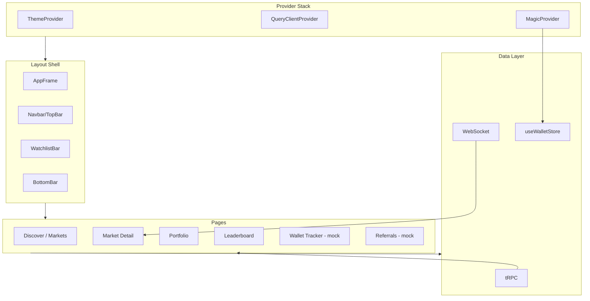

# New UI Migration Plan

Migrate the partner-built `new-ui/` into `apps/web`, replacing current UI components while preserving auth, onboarding, and integrating real data. Validate against references (when available). Standards draw from [.agents/skills](.agents/skills).

---

## Scope Summary

| Aspect        | New UI (source)                                | Doji (target)                                                                                     |
| ------------- | ---------------------------------------------- | ------------------------------------------------------------------------------------------------- |
| **Auth**      | None (mock profile)                            | Magic + OAuth, session token, wallet store                                                        |
| **Routes**    | `market/[id]`, `/referrals`, `/wallet-tracker` | `market/[slug]`, `/event/[slug]`, `/referrals`, `/wallet-tracker` (mock data until backend ready) |
| **Data**      | `lib/mock-data.ts` (Market, LeaderboardEntry)  | tRPC (gamma, clob, auth, leaderboard)                                                             |
| **Charts**    | `lightweight-charts`, recharts, sparkline      | Dual-engine: LWC + TradingView; `ChartSlot`                                                       |
| **Orderbook** | `generateOrders()` mock                        | WebSocket + orderbook store                                                                       |
| **Trading**   | Mock balance, no submit                        | `trpcClient.clob.createAndPostOrder`, `useWalletStore`                                            |
| **Layout**    | AppShell, Navbar, WatchlistBar, BottomBar      | AppFrame, TopBar, MainNav, layout roles                                                           |

---

## Execution Strategy

**Recommended order:** Page-by-page wiring to reduce integration risk.

1. **Phase 1** — Shell + auth (verification: app renders, login/onboarding works).
2. **Phase 2.1 + 3** — Create adapter layer; migrate components with mock data first where needed.
3. **Wire per page:** Discovery → Market detail → Portfolio → Leaderboard → wallet-tracker/referrals (mock).
4. **Phase 4** — Swap mock for real data per page; verify each before moving on.
5. **Phase 5** — Remove old components only after corresponding new page is verified; optional feature flag for gradual rollout.

---

## Phase 1: Foundation and Provider Integration

**Goal:** Wire Magic, auth, and onboarding into new UI shell. No data integration yet.

### 1.1 Provider Stack

- **Preserve:** `MagicProvider`, `ThemeProvider`, `QueryClientProvider`, `NotificationsSetup` from [apps/web/src/components/providers.tsx](apps/web/src/components/providers.tsx).
- **Integrate:** New UI's `ThemeProvider` supports `polymarket-classic` theme; keep this and merge options (attribute, defaultTheme) with existing.
- **Replace:** New UI's bare `AppShell` with a version that wraps `Providers` and injects `MagicProvider` children. `AppShell` becomes the layout chrome (navbar, watchlist bar, bottom bar) inside Providers.

### 1.2 Layout Shell Migration

- Migrate `AppShell`, `Navbar`, `BottomBar`, `WatchlistBar` from [new-ui/components/](new-ui/) into `apps/web/src/components/layout/` or `components/navigation/` per layout foundation.
- **Adapt to layout roles:** Use `AppFrame`, `TopBar`, `ContentWidth`, `ContentSpacing` from [layout foundation](.cursor/plans/layout_foundation_redesign_b49deab9.plan.md). The new Navbar replaces or evolves `MainHeader`; ensure mobile Sheet/Drawer for nav per section 1.9 (shadcn).
- **Structure:** AppFrame (viewport + chrome) + TopBar (evolved from Navbar) + Main content area. BottomBar and WatchlistBar become layout slots composed inside the frame.
- **CommentsContext:** New UI AppShell has `CommentsContext` (showComments, setShowComments) for toggling the comments sidebar on market pages. Migrate this context into the layout shell; keep toggle UX. Wire to RTDS when Market page is wired (Phase 4.4).

### 1.3 Auth Integration in Navbar

- **Replace mock profile:** Navbar profile dropdown, balance, and "Log out" must use:
  - `useWalletStore` (sessionToken, address, safeAddress, email)
  - `AuthButton` / `UserMenu` patterns from [apps/web/src/components/auth/](apps/web/src/components/auth/)
- **Auth state:** Show login CTA when unauthenticated; when authenticated, show balance from tRPC (e.g. `auth.me` or portfolio summary), Safe/Owner addresses from wallet store.
- **Preserve:** Login flow (`/login`, `/login/callback`), `AuthGuard`, `OnboardingGuard` for protected routes.

### 1.4 Route Structure Alignment

- **Slug-based routing:** Doji uses `market/[slug]` and `event/[slug]` (Gamma slug, not numeric id). Migrated market page must use `[slug]` and fetch via `gamma.getMarketBySlug` or equivalent tRPC.
- **New pages to add (with mock data for now):**
  - `wallet-tracker` — Add page using mock data from new-ui's `WalletTrackerContent`; wire to tRPC when backend is ready.
  - `referrals` — Add page using mock data; wire to tRPC when backend is ready.
- **Remove or redirect:** New UI's `market/[id]` → use `market/[slug]` with slug param.

---

## Phase 2: Data Mapping and Type Alignment

**Goal:** Replace all mock data with tRPC/WebSocket. Define mapping layers between API shapes and UI props.

**Data flow (audit-alignment):** Trace Router input → Client params (snake_case for API) → Client response → Schema validation → UI adapter. For WebSocket: Raw message → Zod schema → `@doji/types` → handlers. Ensure no param drops and no type assertions that hide mismatches.

### 2.1 Type Mapping (Critical)

New UI types vs Doji API (validate against `references/` when present):

| New UI (mock)         | Doji API / Gamma / CLOB                                                                                                                                  |
| --------------------- | -------------------------------------------------------------------------------------------------------------------------------------------------------- |
| `Market.id`           | `conditionId` or `clobTokenIds`; use `slug` for routing                                                                                                  |
| `Market.title`        | `question` from Gamma                                                                                                                                    |
| `Market.price`        | Yes price (0–100); from CLOB mid or last trade                                                                                                           |
| `Market.chartData`    | `{ t, p }[]` → LWC `{ time, value }[]` via `toChartData()`                                                                                               |
| `Market.volume`       | `volume` from Gamma (format via `formatUsdCompact`)                                                                                                      |
| `LeaderboardEntry`    | Leaderboard tRPC schema                                                                                                                                  |
| **Binary vs NegRisk** | Binary: 2 token IDs (Yes/No). NegRisk: `negRisk: true` in order params; multiple outcomes, one resolves Yes. Adapter and TradingPanel must support both. |

**Action:** Create adapter types and mapper functions in `lib/markets/` or component-local `*-utils.ts` per [utils standardization](.cursor/plans/utils_standardization_refactor_bb48c427.plan.md). Keep pure formatters in `utils/format.ts`; domain mappers in `lib/`.

### 2.2 Discovery Pages (Home, Markets, Events)

- **Home:** New UI home is "Discover" (CategoryTabs, MarketsGrid, MarketsTable). Map to Doji `/markets` or `/` redirect. Replace `markets` from mock-data with tRPC `gamma.getMarkets` or `events.getEvents` with pagination.
- **MarketsGrid / MarketsTable:** Accept data from tRPC; use `queryOptions`, `useQuery`, `skipToken` per [AGENTS.md tRPC conventions](apps/web/AGENTS.md).
- **CategoryTabs:** Wire to real category/tag filters from Gamma if available.

### 2.3 Market Detail Page

- **Data source:** `gamma.getMarketBySlug` or equivalent; CLOB orderbook via WebSocket; price history via `clob.getPricesHistory`.
- **Components to migrate and wire:**
  - `MarketHeader` — Props: question, outcomes, volume, resolution date from Gamma/CLOB
  - `MarketChart` — Replace mock sparkline with `ChartSlot` (LWC or TradingView) using `toChartData()` and real-time `last_trade_price`
  - `OrderBook` — Replace `generateOrders()` with `useOrderbookStore` or WebSocket subscription
  - `TradingPanel` — Wire to `trpcClient.clob.createAndPostOrder.mutate`, `useWalletStore` (safeAddress, hasCredentials), real balance from tRPC
  - `MarketTabs` / `MarketComments` — Integrate with existing market components (comments-utils, etc.) or stub

### 2.4 Portfolio, Leaderboard

- **Portfolio:** Use `portfolio` tRPC; replace `PortfolioOverview` and `PositionsTable` mock data.
- **Leaderboard:** Use leaderboard tRPC; replace mock `leaderboardData` with real API. Ensure field mapping (rank, pnl, volume, etc.) matches schema.

### 2.5 Navbar Search (Cmd+K Overlay)

- **Data source:** Wire to Gamma `publicSearch` (GET /public-search?q=) or equivalent tRPC; debounce query input via `useDebounce` from [@doji/hooks](packages/hooks/AGENTS.md).
- **Params:** `q` (required), `limit_per_type`, `events_tag`, `keep_closed_markets`, `search_tags`, `search_profiles`, etc. per Gamma OpenAPI.
- **Results:** events[], tags[], profiles[]; map to search overlay display. Start with client-side filter of discovery data if needed; upgrade to API when ready.

### 2.6 Wallet Tracker and Referrals (Mock for Now)

- **Wallet tracker:** Add `/wallet-tracker` page. Migrate `WalletTrackerContent` from new-ui; use mock data initially. Stub pages are acceptable; replace with tRPC when backend is ready.
- **Referrals:** Add `/referrals` page. Use mock data (referral links, stats, etc.) until backend exists. Implement real integration when backend is ready.

---

## Phase 3: Component Migration and Code Standards

**Goal:** Migrate UI components into `apps/web` structure, applying layout foundation, shadcn, and composition patterns.

### 3.1 Directory Placement

Per [AGENTS.md](apps/web/AGENTS.md) structure:

- Layout chrome: `components/layout/` or `components/navigation/`
- Trading: `components/trading/` (OrderBook, TradingPanel, chart)
- Market: `components/market/` (MarketHeader, MarketTabs, MarketComments)
- Discovery: `components/discovery/` (MarketsGrid, MarketsTable, CategoryTabs)
- Portfolio: `components/portfolio/`
- UI primitives: `components/ui/` — merge new-ui shadcn components only where we don't already have equivalent; prefer existing via `npx shadcn add` to avoid drift

### 3.2 Standards to Enforce

**Essential:** cn() for class merging; semantic tokens (`bg-primary`, `text-muted-foreground`); compound components over boolean props; `utils/` = pure helpers, `lib/` = domain; ChartSlot for charts; mobile-first; 44px touch targets. See subsections 3.2.1–3.2.14 for full guidance.

**Standards at a glance**

| Domain            | Key rules                                                                                                            |
| ----------------- | -------------------------------------------------------------------------------------------------------------------- |
| **Accessibility** | Semantic HTML; aria-label on icon buttons; focus-visible ring; prefers-reduced-motion; color + icon + text for state |
| **Composition**   | Compound components + Context; avoid boolean props; children over render props; lift state to provider               |
| **Forms**         | Label + htmlFor/id; never block paste; autocomplete; inline errors; Intl for dates/numbers                           |
| **Visual**        | 8pt grid; semantic tokens; WCAG 4.5:1; dark mode from start; subtle layering                                         |
| **Performance**   | Promise.all; defer await; barrel imports (optimizePackageImports); next/dynamic for heavy; virtualize >50 items      |
| **Motion**        | transform/opacity only; 150–300ms; honor prefers-reduced-motion; no transition-all                                   |

### 3.2.1 Building-Components Gems

Per [.agents/skills/building-components](.agents/skills/building-components):

- **Semantic HTML first:** Use `<button>` for actions, `<a>`/`<Link>` for nav—never `
`. Preserves keyboard, focus, and screen reader behavior.
- **Composition naming:** For compound components, use Root, Trigger, Content, Header, Body, Footer, Title, Description. Use Context for shared state between sub-components; avoid single-component prop explosion.
- **asChild for triggers:** SheetTrigger, DialogTrigger, PopoverTrigger, etc. support `asChild` to merge behavior onto custom elements (e.g. `<Link>`, `IconButton`). Use for nav links, custom buttons—avoids wrapper hell.
- **Controlled/uncontrolled:** Support both modes for toggles, inputs, selects (e.g. `value` + `onValueChange` vs `defaultValue`). Use `useControllableState` (Radix) when merging both.
- **Touch targets:** Min 44×44px for interactive elements on mobile; add invisible padding for small icons if needed.
- **Focus management:** Modals: focus trap, restore focus on close, Escape to close. Tabs: arrow keys, Home/End. `:focus-visible` (not `:focus`) for keyboard-only focus ring.
- **Live regions:** `aria-live="polite"` for dynamic updates (search results, loading); `role="alert"` for errors. `aria-busy` during load.
- **Color independence:** Never convey info via color alone (e.g. error state = color + icon + text).
- **Icon buttons:** Always `aria-label` or ``; never empty icon-only buttons.

### 3.2.2 Frontend-Design Gems

Per [.agents/skills/frontend-design](.agents/skills/frontend-design):

- **Intentional aesthetic:** Choose a clear tone (minimal, maximalist, refined, playful, etc.) and execute consistently; avoid generic "AI slop."
- **Typography:** Pair a distinctive display font with a refined body font; avoid Inter, Roboto, Arial, system fonts by default.
- **Color & theme:** Dominant colors with sharp accents; use semantic CSS variables; avoid timid, evenly-distributed palettes and purple-on-white cliches.
- **Motion:** Prioritize high-impact moments (e.g. one orchestrated page load with staggered reveals) over scattered micro-interactions; use scroll-triggering and hover states that add character.
- **Spatial composition:** Asymmetry, overlap, diagonal flow, grid-breaking elements; generous negative space or controlled density—not cookie-cutter layouts.
- **Backgrounds:** Add depth with gradients, noise, patterns, layered transparency; avoid flat solid fills.
- **Complexity match:** Maximalist designs need elaborate code; minimalist designs need restraint and precision in spacing/typography.

### 3.2.3 Interaction-Design Gems

Per [.agents/skills/interaction-design](.agents/skills/interaction-design):

- **Purposeful motion:** Motion communicates feedback, orientation, focus, continuity—not decoration.
- **Timing scale:** 100–150ms (hovers, clicks); 200–300ms (toggles, dropdowns); 300–500ms (modals, page transitions); 500ms+ (choreographed sequences).
- **Easing:** Use semantic easings—`--ease-out` (entering), `--ease-in` (exiting), `--ease-in-out` (moving), `--spring` (playful)—avoid linear.
- **prefers-reduced-motion:** Always respect; collapse animations to 0.01ms when set.
- **Performance:** Animate only `transform` and `opacity` for 60fps; avoid `width`, `height`, `top`, `left`.
- **Interruptible:** Allow users to cancel or skip long animations.
- **Avoid:** Over-animation (fatigue), blocking input during animations, memory leaks from unmounted listeners.

### 3.2.4 Interface-Design Gems

Per [.agents/skills/interface-design](.agents/skills/interface-design) (dashboards, data interfaces, trading tools):

- **Subtle layering:** Surfaces barely different but distinguishable; borders light but findable. Elevation changes whisper-quiet (Vercel, Linear, Supabase). Squint test: hierarchy still reads when blurred; nothing jumps out harshly.
- **Depth strategy:** Pick ONE and commit—borders-only (dense tools), subtle shadows (approachable), or layered shadows (presence). Don't mix.
- **Spacing:** Base unit + multiples; no random values. Symmetrical padding unless clear reason.
- **Data design:** Numbers mean something—what will the user do with it? Choose display (hero, sparkline, delta, badge) from task; avoid generic "number-on-label."
- **Token naming:** CSS variables should evoke this product's world; `--ink`/`--parchment` vs generic `--gray-700`/`--surface-2`.
- **States:** Every interactive: default, hover, active, focus, disabled. Data: loading, empty, error. Missing states feel broken.
- **Avoid:** Harsh borders, dramatic surface jumps, inconsistent spacing, mixed depth strategies, missing interaction states, dramatic drop shadows, multiple accent colors, gradients/color for decoration only.

### 3.2.5 Next.js Best-Practices Gems

Per [.agents/skills/next-best-practices](.agents/skills/next-best-practices):

- **Async params/searchParams (Next 15+):** Type as `Promise<{ slug: string }>`; always `await params` and `await searchParams` in pages/layouts. Use `use(params)` in non-async components. Same for route handlers and `generateMetadata`.
- **RSC boundaries:** No async client components (`'use client'` + async = invalid). Props to client must be JSON-serializable: serialize `Date` to `.toISOString()`; convert `Map`/`Set` to object/array; no plain functions (Server Actions with `'use server'` are OK).
- **Data waterfalls:** Avoid sequential awaits; use `Promise.all` or Suspense boundaries for parallel fetches. Pass from Server Component to Client when possible.
- **Error handling:** Never wrap `redirect()`, `notFound()`, `forbidden()`, `unauthorized()` in try-catch; they throw. Use `unstable_rethrow(error)` in catch blocks to re-throw Next.js internal errors. `error.tsx` must be client; `global-error.tsx` must include `<html>` and `<body>`.
- **Suspense boundaries:** `useSearchParams` and `usePathname` (in dynamic routes) cause CSR bailout—wrap in `<Suspense>` or entire page becomes client-rendered.
- **Route conventions:** Add `loading.tsx`, `error.tsx`, `not-found.tsx` per segment where needed. Use `_components/` prefix for non-routed folders.
- **Images:** Always `next/image`; configure `remotePatterns` for external domains (market images, avatars); use `sizes` with `fill`; `priority` for LCP images.

### 3.2.6 Responsive-Design Gems

Per [.agents/skills/responsive-design](.agents/skills/responsive-design):

- **Mobile-first:** Start with mobile styles, enhance with `sm:`, `md:`, `lg:` breakpoints (640, 768, 1024, 1280, 1536). Content-based breakpoints (e.g. "where sidebar fits") not device names.
- **Container queries:** Use `@container` and `@md`/`@lg` for component-level responsiveness when a component should adapt to its container, not viewport (cards in grids, sidebar width). Use `inline-size` not `size` (performance). Fallback: `@supports (container-type: inline-size)`.
- **Container units:** `cqi`, `cqw`, `cqh` for fluid sizing within container (e.g. `font-size: clamp(1rem, 4cqi, 2rem)`).
- **Fluid typography/spacing:** Prefer `clamp()` and fluid tokens (`--text-base`, `--space-md`) over fixed px; `min()`/`max()` for responsive sizing without media queries.
- **Fluid containers:** `min(100% - 2rem, 65rem)` for max-widths; `full-bleed` via `margin-inline: calc(-50vw + 50%)`.
- **Viewport height:** Use `dvh`/`svh`/`lvh` instead of `vh` on mobile—100vh ignores browser chrome. Safe area: `env(safe-area-inset-*)` for notched devices.
- **Grid patterns:** `repeat(auto-fit, minmax(min(300px, 100%), 1fr))` for responsive grids; avoid overflow from fixed min-widths.
- **Responsive tables:** `overflow-x-auto` with `min-w-[...]` for scroll, or card layout for mobile (`hidden md:table` + `md:hidden` cards).
- **Responsive nav:** Sheet/Drawer on mobile, horizontal links on desktop; `aria-expanded` and `aria-controls` on toggle.
- **Logical properties:** Use `padding-inline`, `padding-block`, `margin-inline` for i18n and RTL.
- **Avoid:** Horizontal overflow, fixed widths for type/spacing, 100vh on mobile, small touch targets, images without aspect-ratio, nested container overuse.

### 3.2.7 shadcn-ui Gems

Per [.agents/skills/shadcn](.agents/skills/shadcn) and [.agents/skills/shadcn-ui](.agents/skills/shadcn-ui):

- **Copy, not package:** shadcn is components you own—add via `npx shadcn@latest add <component>`; customize in place. Compare `new-ui/components/ui/*` with `apps/web` before merging; prefer existing, add net-new via CLI only.
- **asChild:** DialogTrigger, SheetTrigger, Button support `asChild` to merge behavior onto custom elements (e.g. `<Link>`, `IconButton`). Use for nav, custom triggers—avoids wrapper divs.
- **Forms:** React Hook Form + Zod + `Form`; use `FormField` with `control`, `name`, `render`; wrap inputs in `FormControl`; `FormLabel` + `htmlFor`/`id` linkage; `FormMessage` for errors.
- **Toast:** Add `<Toaster />` in root layout; `useToast()` for imperative calls. Use `variant: "destructive"` for errors; optional `action` for retry.
- **Theming:** CSS variables in `globals.css`—`--background`, `--foreground`, `--primary`, `--muted`, `--border`, `--radius`. Use `hsl(var(--token))` format; `dark` class for dark mode.
- **Client boundary:** Interactive components need `"use client"`; when used from Server Components, wrap in a thin client wrapper that passes props.
- **Labels:** Always pair `Label` with `Input` via `htmlFor` and `id`; never placeholder-only labels.
- **Tables:** Use `TableCaption` for accessibility; `TableHead`/`TableCell` for structure.
- **Card compound:** CardHeader, CardTitle, CardDescription, CardContent, CardFooter—compose, don't flatten.

### 3.2.8 UI/UX Pro-Max Gems

Per [.agents/skills/ui-ux-pro-max](.agents/skills/ui-ux-pro-max):

- **Icons:** Use SVG (Lucide, Heroicons)—never emojis as UI icons. Consistent viewBox (24x24), fixed w-6 h-6.
- **Interaction:** `cursor-pointer` on all clickable elements. Hover feedback (color, shadow, border); avoid scale that causes layout shift. Transitions 150–300ms.
- **Loading/async:** Disable button + show spinner during async; skeleton or spinner for operations >300ms. Reserve space for async content to avoid layout jump.
- **Error/success:** Error message near problem field; success feedback (toast, checkmark). Never silent failure.
- **Destructive actions:** Confirmation dialog before delete/irreversible actions.
- **Z-index scale:** Define system (10, 20, 30, 50)—avoid arbitrary `z-[9999]`. Understand stacking context.
- **Light/dark contrast:** Glass cards `bg-white/80` minimum in light mode; text `#0F172A` or darker; borders visible in both modes. 4.5:1 minimum for body text.
- **Forms:** Never block paste; use `autocomplete`; inline errors; label with `for`/`id`. Semantic input types (email, tel, number).
- **Viewport:** No `user-scalable=no` or `maximum-scale=1`—never disable zoom.
- **Performance:** Avoid `transition-all`—specify properties. Virtualize lists >50 items. Lazy-load below-fold images.
- **Anti-patterns:** No emoji icons; no layout shift from hover; no invisible borders in light mode.

### 3.2.9 Tailwind Design-System Gems

Per [.agents/skills/tailwind-design-system](.agents/skills/tailwind-design-system):

- **Semantic tokens:** Use `bg-primary`, `text-muted-foreground`, `border-border`—never raw colors or arbitrary values. Extend `@theme` for new tokens.
- **Color format:** Prefer OKLCH over HSL for better perceptual uniformity; `oklch(45% 0.2 260)` vs `hsl(220 70% 50%)`.
- **CVA for variants:** Use `class-variance-authority` for type-safe variant composition (variant, size); compose with `cn()`.
- **Focus ring:** `focus-visible:outline-none focus-visible:ring-2 focus-visible:ring-ring focus-visible:ring-offset-2`; never remove outline without replacement.
- **Disabled state:** `disabled:pointer-events-none disabled:opacity-50` on interactive elements.
- **Input error:** Pass `error` prop; apply `border-destructive`, `aria-invalid`, `aria-describedby` linking to error `id`; `role="alert"` on error message.
- **Dark mode:** Use `@custom-variant dark` (v4) or `darkMode: "class"` (v3); `.dark` overrides for semantic tokens. Test both themes.
- **v4 migration (when applicable):** Replace `tailwind.config.ts` with `@theme` in CSS; `@import "tailwindcss"`; keyframes in `@theme`; `size-*` for w+h shorthand; no `forwardRef` (React 19).
- **Avoid:** Hardcoded colors; arbitrary values; extending theme in config when `@theme` available; forgetting dark mode tokens.

### 3.2.10 Vercel Composition-Patterns Gems

Per [.agents/skills/vercel-composition-patterns](.agents/skills/vercel-composition-patterns):

- **Avoid boolean props:** Don't add `isThread`, `isEditing`, `showAttachments`—each boolean doubles states and creates conditional sprawl. Use composition: different parent components render different child combinations.
- **Compound components + Context:** Structure complex components as `Component.Root`, `Component.Header`, `Component.Input`, etc. Subcomponents read shared state via Context, not props. Consumers compose exactly what they need.
- **Context interface:** Define generic `{ state, actions, meta }`—any provider can implement it. UI components consume the interface; swap providers (local state vs global) without changing UI.
- **Lift state to provider:** Put state in `Component.Provider`, not inside the visual frame. Sibling components (dialog actions, previews) outside the frame can access state/actions via `use(ComponentContext)`—no prop drilling.
- **Explicit variants:** Prefer `ThreadComposer`, `EditComposer`, `ForwardComposer` over one component with `isThread`/`isEditing`/`isForwarding`. Each variant composes shared pieces; no impossible states.
- **Children over render props:** Use `children` for static structure; reserve `renderItem`-style props for when parent must pass data/state to child.
- **Provider boundary:** Components needing shared state don't need visual nesting—they just need to be inside the provider. `ForwardButton` outside `Composer.Frame` can still call `actions.submit`.

### 3.2.11 Vercel React Best-Practices Gems

Per [.agents/skills/vercel-react-best-practices](.agents/skills/vercel-react-best-practices):

- **Async parallel:** Use `Promise.all()` for independent fetches; sequential await creates waterfalls (2–10× slower). Restructure RSC so children (Header, Sidebar) fetch in parallel as siblings, not nested after parent await.
- **Defer await:** Move `await` into branches where actually used; avoid fetching before early-return checks (e.g. fetch resource first, then permissions only if resource exists).
- **Barrel imports:** Avoid `import { Icon } from "lucide-react"`—loads 1500+ modules. Use direct imports or `optimizePackageImports` in next.config. Affects lucide-react, @mui, @radix-ui, date-fns.
- **Dynamic imports:** Use `next/dynamic` with `ssr: false` for heavy components (charts, Monaco, rich editors) not needed on initial render.
- **Derived state:** Compute during render; don't store in state or sync via useEffect. `const fullName = firstName + " " + lastName` not `useEffect(() => setFullName(...))`.
- **Conditional render:** Use ternary `count > 0 ? <Badge /> : null` not `count && <Badge />`—`0` and `NaN` render as text.
- **Transitions:** Use `startTransition` for frequent non-urgent updates (scroll, search filter) to keep UI responsive.
- **Suspense:** Use Suspense boundaries to stream content; avoid blocking entire page on slow fetches.

### 3.2.12 Visual-Design-Foundations Gems

Per [.agents/skills/visual-design-foundations](.agents/skills/visual-design-foundations). See also 3.2.9 for semantic tokens.

- **Typography scale:** Use modular scale (ratio-based); line-height 1.1–1.3 headings, 1.5–1.7 body, 1.2–1.4 UI labels. Limit to 2–3 font weights per family.
- **Line length:** `max-width: 65ch` for prose; avoid full-viewport paragraphs.
- **8-point grid:** Base unit 4px; spacing scale as multiples (4, 8, 12, 16, 24, 32, 48, 64). No magic numbers—use tokens.
- **Spacing guidelines:** Card padding 16–24px; section gap 32–64px; form field gap 16–24px; icon-text gap 8px.
- **WCAG contrast:** Body 4.5:1 (AA), large text 18px+ 3:1, UI 3:1. Verify both light and dark.
- **Semantic tokens:** Name by purpose (--color-primary, --bg-card); two-tier: primitives → semantic. Plan dark mode from start.
- **Icon sizing:** Consistent scale (12, 16, 20, 24, 32px); `aria-hidden` for decorative icons.
- **Font loading:** `font-display: swap`; reserve space or similar fallback to prevent layout shift.
- **Avoid:** Inconsistent spacing, poor contrast, font overload, magic numbers, missing hover/focus/disabled, retrofitting dark mode.

### 3.2.13 Web-Component-Design Gems

Per [.agents/skills/web-component-design](.agents/skills/web-component-design):

- **Single responsibility:** Each component does one thing; split when it grows.
- **Prop API:** Semantic names (`isLoading`, `isDisabled`); sensible defaults; support `className`/`style` for overrides.
- **Context + compound:** Compound components share state via Context; throw clear error when used outside provider (`Must be used within <Tabs>`).
- **Error boundaries:** Wrap components that may fail (charts, WebSocket, heavy third-party); prevent cascade.
- **Memoization:** Use `React.memo` and `useMemo` for expensive subtree renders; profile with DevTools before optimizing.
- **Ref forwarding:** Allow parent DOM access; React 19 passes ref as prop.
- **Modal/Dialog:** Focus trap; restore focus on close; Escape to close; `body.style.overflow = "hidden"` when open; `role="dialog"`, `aria-modal`, `aria-labelledby`.
- **Tabs:** `role="tablist"`, `role="tab"`, `aria-selected`, `aria-controls` linking to panel; `tabIndex={isActive ? 0 : -1}`.
- **Avoid:** Prop explosion (use composition); style conflicts (scoped styles, cn()); re-render cascades; accessibility gaps; unused variant bundle weight.

### 3.2.14 Web-Design-Guidelines Gems

Per [.agents/skills/web-design-guidelines](.agents/skills/web-design-guidelines) (Vercel Web Interface Guidelines):

- **Heading anchors:** `scroll-margin-top` on targets so fixed-nav doesn't hide content.
- **Compound controls:** Use `:focus-within` to group focus styling (e.g. label + input).
- **Placeholders:** End with `…`; show example pattern; never placeholder-only label.
- **autocomplete:** `off` on non-auth fields to avoid password manager triggers; correct values on auth fields.
- **Unsaved changes:** Warn before navigation (beforeunload or router guard).
- **Typography:** Use `…` not `...`; curly quotes; `&nbsp;` for units (`10&nbsp;MB`), shortcuts (`⌘&nbsp;K`). Loading: `"Loading…"`, `"Saving…"`. `font-variant-numeric: tabular-nums` for number columns. `text-wrap: balance` or `text-pretty` on headings.
- **Text truncation:** Flex children need `min-w-0` for truncate/line-clamp to work.
- **Dark mode:** `color-scheme: dark` on `<html>`; `<meta name="theme-color">` matches background; native `<select>` with explicit `background-color` and `color`.
- **Touch:** `touch-action: manipulation`; set `-webkit-tap-highlight-color` intentionally; `overscroll-behavior: contain` in modals/drawers.
- **Copy:** Active voice; specific button labels ("Save API Key" not "Continue"); error messages include fix/next step.
- **i18n:** Use `Intl.DateTimeFormat`, `Intl.NumberFormat`; never hardcoded date/number formats.

### 3.3 Watchlist Context

- New UI has `WatchlistProvider` with in-memory state. Doji may need persistence (DB or localStorage). Decide: stub with `useState` for now, or add tRPC mutations. Keep interface (`toggle`, `isStarred`) stable for UI.

### 3.4 Loading, Error, and Empty States

- **Loading:** Use Skeleton components per shadcn; preserve layout during load (Discovery cards, Market header, Orderbook, Portfolio table).
- **Error boundaries:** Wrap chart, WebSocket-dependent, and heavy components in error boundaries (see 3.2.13); prevent cascading failures.
- **Empty states:** Provide actionable empty states (no markets, no positions, no comments) with guidance per shadcn data-empty-states.

### 3.5 New UI Components to Merge Carefully

- **shadcn and cn imports:** new-ui uses `@/lib/utils` for `cn`; apps/web uses `@/utils/cn`. Prefer existing `apps/web` shadcn components—they already have correct imports. Do not migrate new-ui `components/ui/*` shadcn files unless we lack the component; add net-new via `npx shadcn add` only (see 3.2.7).
- **Non-shadcn in new-ui/ui:** Only `use-mobile.tsx` is not shadcn. Do not migrate it—use `useMobile` / `useIsMobile` from [@doji/hooks](packages/hooks/AGENTS.md). New-ui also has `use-toast.ts` and radix `toast.tsx`/`toaster.tsx`, but layout uses sonner; ignore those. Use existing apps/web sonner + `use-notifications` for toast.
- **Non-shadcn outside ui:** [new-ui/components/sparkline.tsx](new-ui/components/sparkline.tsx) is a custom SVG sparkline used by MarketsTable. Migrate it to `components/discovery/sparkline.tsx` (or `components/ui/` if treated as reusable); no cn import, so no path change. Plan Phase 4.1 says use LWC or simple SVG from `toChartData`—Sparkline fits as the inline/simple option for table cells.
- **Unused new-ui/ui files (skip):** `sidebar.tsx` (AppShell uses Navbar + WatchlistBar + BottomBar, not Sidebar), `chart.tsx` (recharts—Portfolio uses raw recharts; MarketChart uses TradingView), `toast.tsx`/`toaster.tsx`/`use-toast.ts` (layout uses sonner).
- **ThemeProvider:** New UI has `polymarket-classic` theme. Merge options into existing ThemeProvider.

### 3.6 Hooks from @doji/hooks

Shared UI hooks live in [@doji/hooks](packages/hooks/AGENTS.md). Use these during migration; do not duplicate in new-ui or apps/web.

| Hook                        | Phase | Use                                                          |
| --------------------------- | ----- | ------------------------------------------------------------ |
| `useMobile` / `useIsMobile` | 1, 3  | Navbar, BottomBar, Sheet/Drawer, responsive layout           |
| `useMediaQuery`             | 1, 3  | Custom breakpoints (e.g. 1024px for TradingLayout)           |
| `useDebounce`               | 2, 4  | Search overlay (Cmd+K), filter inputs, API-triggering inputs |
| `useLockFn`                 | 4     | Prevent double-submit on order placement (3.2.8)             |
| `useBeforeUnload`           | 3     | Unsaved forms (3.2.14)                                       |
| `useCopyToClipboard`        | 2     | Referral links, wallet address copy                          |
| `useIntersection`           | 2     | Lazy loading, infinite scroll for discovery                  |
| `useMeasure`                | 4     | Charts, orderbook, dynamic sizing                            |
| `useDocumentVisibility`     | 4     | Pause WebSocket when tab hidden (optional)                   |
| `useMemoizedFn`             | 2–4   | Stable callbacks in event handlers                           |

---

## Phase 4: Charts and Trading Integration

**Goal:** Replace mock chart and orderbook with real data and dual-engine support.

### 4.1 Chart Integration

- **MarketChart in new UI:** Uses `chartData: number[]` (sparkline). Replace with `ChartSlot` from [apps/web/src/components/charts/](apps/web/src/components/charts/) using:
  - `clob.getPricesHistory` → `toChartData()` → LWC `{ time, value }[]
  - `last_trade_price` WebSocket for real-time append
- **Sparkline (e.g. MarketsGrid):** Use lightweight LWC or simple SVG from `toChartData`; do not duplicate chart creation logic.

### 4.2 Orderbook (WebSocket Integration)

- Replace `generateOrders()` with subscription via `use-orderbook.ts` and orderbook store. Use CLOB market channel:
  - **Subscribe:** `assets_ids` (token IDs from `clobTokenIds`); market channel uses token IDs, not condition IDs.
  - **Events:** `book` (bids/asks, OrderLevel `{ price, size }` strings), `best_bid_ask` (spread when `custom_feature_enabled`).
  - **Schema:** Raw message → `safeParseMarketChannelMessage` (schemas.ts) before dispatch; types align with `@doji/types` websocket (BookEvent, BestBidAskEvent).
  - **Store:** Orderbook Zustand store receives book events; `subscription-registry` ref-counts assets to avoid duplicate subscriptions.
- Map CLOB OrderLevel (price, size strings) to UI display format; use `formatUsdCompact` / `formatVolumeLike` for totals.

### 4.3 Chart + last_trade_price (WebSocket)

- **Price history (REST):** `clob.getPricesHistory` → `{ history: { t, p }[] }` → `toChartData()` → LWC `{ time, value }[]`.
- **Real-time:** Market channel `last_trade_price` event (asset_id, price, side, size); `appendTradePoint()` for chart; polymarket-datafeed uses same pattern for TradingView.
- **Params:** `market` = CLOB token ID; `interval` (1h, 6h, 1d, 1w, max). See [charts AGENTS.md](apps/web/src/components/charts/AGENTS.md) data mapping.

### 4.4 MarketComments (RTDS Integration)

- **Initial fetch:** Gamma API `comments.list` (parent_entity_type: market, parent_entity_id).
- **Real-time:** RTDS topic `comments`; subscribe with filters `parentEntityID`, `parentEntityType`; handlers for `comment_created`, `comment_removed`.
- **Conversion:** `comments-utils.ts` `rtdsToComment` maps RTDS CommentPayload to component shape; use `buildRtdsCommentFilter` for subscription.

### 4.5 Trading Panel (CLOB Alignment)

- Wire to `trpcClient.clob.createAndPostOrder.mutate`; use `useWalletStore` (safeAddress, hasCredentials); `AuthGuard` / `OnboardingGuard`.
- **Double-submit prevention:** Wrap submit handler with `useLockFn` from [@doji/hooks](packages/hooks/AGENTS.md); disable button and show spinner during async (3.2.8).
- **Order options:** `tickSize` and `negRisk` from market (fetch via `getMarket(tokenID)` or gamma) — required by CLOB; pass to createAndPostOrder. For NegRisk events, `negRisk: true` must be set; adapter must support binary (2 token IDs) and multi-outcome.
- **User vs Builder credentials:** Order placement uses User API credentials (from createOrDeriveApiKey); Builder credentials only for attribution (server handles).
- **Validation:** Min size, balance/allowance checks; handle insert errors (INVALID_ORDER_MIN_TICK_SIZE, NOT_ENOUGH_BALANCE, etc.) via `getTrpcDisplayMessage`.
- **Router namespace:** Use correct tRPC path (e.g. `clob.createAndPostOrder`, not `markets.*`).

---

## Phase 5: Cleanup and Validation

### 5.1 Remove Old Components

- **When:** Remove only after the corresponding new page/flow is verified end-to-end. Avoid big-bang deletion.
- **What:** `TradingLayout`, `TradingWorkspace`, `MarketPageComposition`, `EventPageComposition` (or equivalent) per layout plan Phase 2 cleanup.
- **Optional:** Keep both old and new temporarily behind a feature flag for gradual rollout.
- **Keep:** Shared building blocks (ChartSlot, OrderForm logic) that are reused.

### 5.2 References Validation

- When `references/` is available: validate data shapes against `references/gamma-openapi.json`, `references/clob-openapi.md`, Polymarket docs.
- Ensure token IDs, condition IDs, slug usage follow [AGENTS.md Polymarket Glossary](AGENTS.md).

### 5.3 Alignment Audit (Post-Migration)

Run the [audit-alignment](.cursor/commands/audit-alignment.md) checklist (or relevant subset) after wiring real data to ensure layers stay consistent:

**WebSocket & RTDS**

- Market channel: `use-orderbook` subscribes via `assets_ids`; `schemas.ts` Zod schemas match `@doji/types` (BookEvent, LastTradePriceEvent, etc.); no raw message handling without `safeParseMarketChannelMessage`.
- Chart/datafeed: `last_trade_price` used for real-time append; token ID (not condition ID) for market subscription.
- RTDS comments: `useComments` fetches initial via Gamma; subscribes to RTDS `comment_created`/`comment_removed`; `rtdsToComment` conversion correct.
- Env: `NEXT_PUBLIC_WS_MARKET_URL`, `NEXT_PUBLIC_RTDS_URL` in packages/env and .env.example.

**tRPC & Types**

- Router input shapes match client params (snake_case for API, camelCase in input where applicable).
- UI adapter types (gamma-to-ui mappers) map from validated schema shapes; no type assertions that hide mismatches.
- Frontend consumers use correct router namespace (e.g. `events.publicProfile` not `markets.publicProfile`).

**Trading**

- `tickSize` and `negRisk` passed from market to order placement.
- Error handling: `withPolymarketError` / `handleClobProcedureError` on server; `getTrpcDisplayMessage` on client.

**Docs**

- Update AGENTS.md in touched lib/routers (websocket, magic, trading, markets).
- JSDoc / `@see` links on new adapter functions and hooks.

### 5.4 Final Checklist

- All mock imports removed (except wallet-tracker and referrals, which may keep mock data until backend ready)
- `pnpm fix` passes
- `pnpm check-types` passes
- Auth flow: login → onboarding → trade
- Market page loads with real data
- Orderbook and chart show live data
- AGENTS.md updated (routes, components)
- Web Interface Guidelines compliance (optional per plan)

---

## Architecture Diagram

---

## File Changes Summary

| Action     | Location                                                                                                     |
| ---------- | ------------------------------------------------------------------------------------------------------------ |
| **Add**    | Layout: AppShell, Navbar, BottomBar, WatchlistBar (adapted)                                                  |
| **Add**    | Discovery: CategoryTabs, MarketsGrid, MarketsTable, Sparkline (wired to tRPC)                                |
| **Add**    | Market: MarketHeader, MarketChart (ChartSlot), OrderBook, TradingPanel, MarketTabs, MarketComments (adapted) |
| **Add**    | Portfolio/Leaderboard: PortfolioOverview, PositionsTable, LeaderboardTable (wired)                           |
| **Add**    | Wallet tracker: `/wallet-tracker` page + WalletTrackerContent (mock data initially)                          |
| **Add**    | Referrals: `/referrals` page (mock data initially)                                                           |
| **Add**    | Adapters: `lib/markets/gamma-to-ui.ts` or similar mappers                                                    |
| **Edit**   | `app/layout.tsx` — Ensure Providers + MagicProvider wrap AppShell                                            |
| **Edit**   | `app/page.tsx`, `markets/`, `events/` — Use new discovery components                                         |
| **Edit**   | `app/(trading)/market/[slug]/page.tsx` — Use new market composition                                          |
| **Edit**   | Navbar — Auth, UserMenu, real balance                                                                        |
| **Merge**  | ThemeProvider options (polymarket-classic)                                                                   |
| **Use**    | @doji/hooks for useMobile, useDebounce, useLockFn, etc.; existing apps/web shadcn (no cn path migration)     |
| **Delete** | `new-ui/lib/mock-data.ts` (do not copy)                                                                      |
| **Remove** | Old trading/market components after verification                                                             |

---

## Related

- [audit-alignment](.cursor/commands/audit-alignment.md) — Full checklist for schema/client/router/WebSocket/RTDS alignment; run after migration for comprehensive validation.
- [apps/web/src/lib/websocket/AGENTS.md](apps/web/src/lib/websocket/AGENTS.md) — WebSocket and RTDS client usage.

## Out of Scope / Later

- **Wallet tracker and referrals:** Add pages now with mock data (acceptable); implement tRPC integration when backend is ready
- Event page: similar migration pattern; can follow market page
- Design system package: keep in `apps/web` per existing convention

