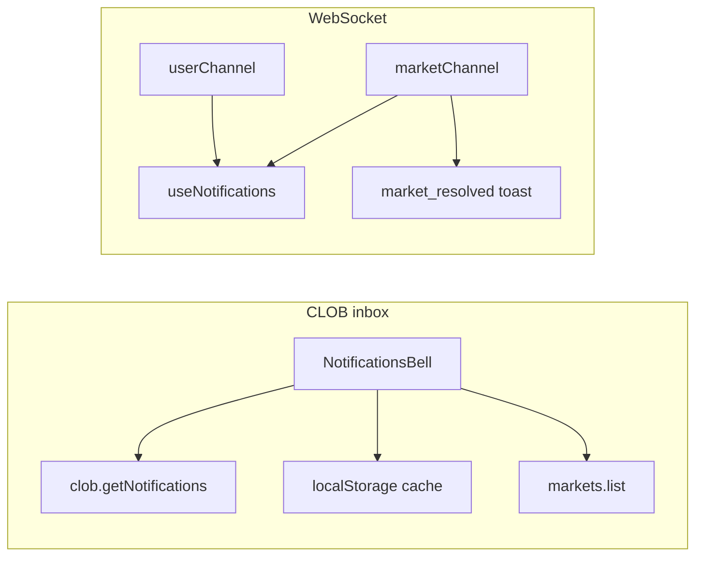

# Notification systems audit (Doji)

## What exists (inventory)

| Surface                                  | Location                                                                                                                                                                                    | Behavior                                                                                                                                                                     |
| ---------------------------------------- | ------------------------------------------------------------------------------------------------------------------------------------------------------------------------------------------- | ---------------------------------------------------------------------------------------------------------------------------------------------------------------------------- |
| **CLOB notification inbox**              | `[apps/web/src/components/layout/notifications-bell.tsx](apps/web/src/components/layout/notifications-bell.tsx)`                                                                            | `trpc.clob.getNotifications` + localStorage cache per Safe + Gamma `markets.list` for titles/images; unread dot via `lastSeenCount`                                          |
| **Realtime trade/cancel (browser only)** | `[apps/web/src/hooks/use-notifications.ts](apps/web/src/hooks/use-notifications.ts)` + `[apps/web/src/components/notifications-setup.tsx](apps/web/src/components/notifications-setup.tsx)` | User-channel events; toasts intentionally skipped (order flow uses `[order-toast.ts](apps/web/src/lib/trading/order-toast.ts)`); optional `Notification` API when tab hidden |
| **Price alerts**                         | `[apps/web/src/stores/notifications.ts](apps/web/src/stores/notifications.ts)` + same hook                                                                                                  | `last_trade_price` on market channel → `checkPriceAlerts` → Sonner + optional browser                                                                                        |
| **Global “Market Resolved” toasts**      | `[apps/web/src/lib/websocket/market-channel.ts](apps/web/src/lib/websocket/market-channel.ts)` (lines 116–121)                                                                              | Unconditional `toast.success` on every `market_resolved` message before handler dispatch                                                                                     |
| **Server proxy**                         | `[apps/server/src/routers/clob.ts](apps/server/src/routers/clob.ts)`                                                                                                                        | `getNotifications` (non-array → `[]`), `dropNotifications`                                                                                                                   |

**Out of scope unless you expand the ticket:** Bridge `[deposit-notification-card](apps/web/src/components/bridge/deposit-flow.tsx)` / `[withdraw-notification-card](apps/web/src/components/bridge/withdraw-flow.tsx)` are inline status UIs, not the same subsystem as the bell or `useNotifications`.

---

## Bugs and edge cases

### 1. Price-alert race (real bug)

In `[use-notifications.ts](apps/web/src/hooks/use-notifications.ts)`, the market-channel handler closes over `priceAlerts` from React. `triggerPriceAlert` updates Zustand synchronously, but the **next** `last_trade_price` in the same tick (or before re-render) can still see **stale** `priceAlerts` with `triggered: false`, so `checkPriceAlerts` may fire duplicate toasts for the same alert.

**Fix:** Inside the handler, read fresh alerts from `useNotificationsStore.getState().priceAlerts` (and optionally merge with `event` in one pass) instead of relying on the hook closure. Consider moving trigger + notify into a single store action that updates and returns which IDs fired to avoid split logic.

### 2. Price alerts are effectively dead + effect churn

`addPriceAlert` / `removePriceAlert` are **only defined** in `[stores/notifications.ts](apps/web/src/stores/notifications.ts)`; there are **no call sites** in `apps/web` (grep confirms). The market-channel effect still depends on `[priceAlerts, triggerPriceAlert]` and re-registers the wildcard handler whenever the array reference changes—unnecessary work for a feature users cannot create.

**Fix options:** (a) Ship a minimal UI to create alerts (chart/header) + persist; or (b) Remove the wildcard subscription and related code until the feature ships; or (c) Keep store helpers for tests only and gate the hook subscription on `priceAlerts.length > 0` with a stable ref read inside the handler to reduce re-subscribes.

### 3. Notification preferences are non-functional in practice

`[NotificationPreferences](apps/web/src/stores/notifications.ts)` (trade / cancellation / price alert / browser) is **not persisted** (no `persist` middleware). `[setPreference](apps/web/src/stores/notifications.ts)` is only used when granting browser permission in `[requestBrowserNotificationPermission](apps/web/src/hooks/use-notifications.ts)`. `[Settings](apps/web/src/app/settings/page.tsx)` has **no** notification section.

**Impact:** Toggles reset on reload; users cannot opt out without code changes; docs in `[hooks/AGENTS.md](apps/web/src/hooks/AGENTS.md)` describe a **different** `useNotifications` API (toast helpers + `addNotification`) than the real hook—misleading for agents and humans.

### 4. Browser permission never requested from UI

`useNotifications()` returns `requestPermission`, but only `[NotificationsSetup](apps/web/src/components/notifications-setup.tsx)` calls the hook and **ignores** the return value. So `Notification.requestPermission()` is never invoked from product UI; background `Notification` paths in `[handleTradeEvent](apps/web/src/hooks/use-notifications.ts)` / cancellations almost never run.

### 5. Global `market_resolved` toast spam / wrong audience

`[market-channel.ts](apps/web/src/lib/websocket/market-channel.ts)` shows a success toast for **every** parsed `market_resolved` on the connection. Subscribed users can see many resolutions unrelated to their positions; no preference, no deduplication, no “only if I have a position” filter.

**Fix directions:** Gate behind a preference; scope to user positions or watchlist; or move to a quieter pattern (single digest, or only when `assets_ids` intersects a user-derived set). Optionally debounce/dedupe by `(condition_id|question)` per session.

### 6. CLOB inbox: unread state and persistence

`[lastSeenCount](apps/web/src/components/layout/notifications-bell.tsx)` starts at `0` every load, so the green dot treats **all** items as unseen after a full refresh even if the user previously opened the panel. Consider persisting `lastSeenCount` or a “last seen newest ts” per `safeAddress` alongside the notification cache.

### 7. `dropNotifications` unused

Server exposes `[dropNotifications](apps/server/src/routers/clob.ts)`; the bell UI never calls it—users cannot dismiss/clear server-side items from Doji (only rely on Polymarket expiry).

### 8. Minor / defensive

- `**parseNotificationTimestamp`:** Missing timestamps become `Date.now()`, which can reorder items oddly; prefer stable fallbacks (e.g. `0` or omit from sort).
- **Panel position:** `[notifications-bell.tsx](apps/web/src/components/layout/notifications-bell.tsx)` sets `panelPos` when `open` changes but not on window resize while open—minor layout glitch.
- `**hasPriceCrossedTarget`** when `initialPrice === targetPrice`: any move off target triggers; may be noisy if combined with (1).

---

## Performance notes

1. **Wildcard market handler:** `[use-notifications.ts](apps/web/src/hooks/use-notifications.ts)` uses `marketChannel.addHandler` (wildcard). Docs in `[websocket/AGENTS.md](apps/web/src/lib/websocket/AGENTS.md)` recommend `addScopedHandler` for hot paths. For price alerts, scoping to subscribed token IDs would reduce work once alerts are user-created.
2. **Re-subscribe on `priceAlerts`:** The effect re-runs whenever `priceAlerts` changes; with a ref-based store read, dependencies could be reduced to a stable `[]` + cleanup pattern.

---

## Suggested implementation order

1. **Fix price-alert stale state** (correctness).
2. **Decide product stance on price alerts** (remove dead wiring vs minimal UI + persist).
3. **Tame `market_resolved` toasts** (UX + perf).
4. **Persist notification preferences + optional Settings UI**; wire `**requestPermission`** (or remove dead API).
5. **Persist last-seen for bell**; optional `**dropNotifications`** + dismiss UI.
6. **Update `[hooks/AGENTS.md](apps/web/src/hooks/AGENTS.md)`** (and `[stores/AGENTS.md](apps/web/src/stores/AGENTS.md)` notification section) to match real APIs.
7. **Tests:** Unit tests for `checkPriceAlerts` / `hasPriceCrossedTarget` (NaN, boundary, `initial === target`, rapid duplicate events with store-driven handler).

---

## Files likely touched

- `[apps/web/src/hooks/use-notifications.ts](apps/web/src/hooks/use-notifications.ts)` — store reads, optional scope
- `[apps/web/src/lib/websocket/market-channel.ts](apps/web/src/lib/websocket/market-channel.ts)` — resolution toast gating
- `[apps/web/src/stores/notifications.ts](apps/web/src/stores/notifications.ts)` — persist, maybe combined alert action
- `[apps/web/src/components/layout/notifications-bell.tsx](apps/web/src/components/layout/notifications-bell.tsx)` — last-seen persistence, optional drop
- `[apps/web/src/app/settings/page.tsx](apps/web/src/app/settings/page.tsx)` — if adding toggles / browser permission
- Docs: `[apps/web/src/hooks/AGENTS.md](apps/web/src/hooks/AGENTS.md)`, `[apps/web/src/stores/AGENTS.md](apps/web/src/stores/AGENTS.md)`
