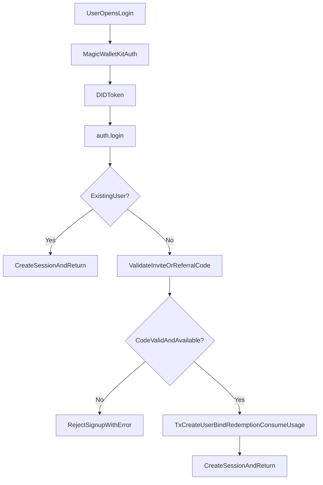

---

name: Private Referral Gate Rollout
overview: Implement a private referral-gated signup flow using `DOJI100` (max 100 uses), while allowing existing users to log in normally. Build the full referral data model and APIs behind feature flags so the public referrals program can be launched later without re-architecture.
todos:

- id: design-db-referrals
content: Design and add referral schema/migration for codes, aliases, redemptions, usage limits
status: pending
- id: enforce-new-user-gate
content: Update auth login flow to require referral code only for first-time user creation
status: pending
- id: wire-referrals-router
content: Implement tRPC referrals router for code management and metrics/list endpoints
status: pending
- id: replace-referral-mocks
content: Connect web referrals page and onboarding/landing flow to real referral APIs behind flags
status: pending
- id: env-flags-rollout
content: Add/align env feature flags and rollout controls for private gate vs public referrals
status: pending
  - id: remove-legacy-site-gate
  content: Remove/disable legacy SITE_PASSWORD unlock gate so landing-page referral admission is the only pre-login gate
  status: pending
- id: test-concurrency-limit
content: Add tests for max-use enforcement, race safety, existing-user bypass, and alias non-reuse
status: pending
isProject: false

---

# Private Referral Gate + Referral Foundation Plan

## Confirmed Product Decisions

- Existing users can always log in without re-entering a code.
- Only brand-new accounts require a valid referral/invite code.
- `DOJI100` is the initial limited code with max usage `100`.
- Referral attribution binds on first successful account creation/login.
- Build full referral system now, but keep public-facing usage behind feature flags.

## Magic Docs Constraints (applied to plan)

- Magic Embedded Wallets provision wallets when users authenticate; there is no native "OAuth login only for existing users" switch.
- Correct control point is app backend policy (DB check + auth flow branching), not Magic provider configuration.
- Wallet Kit stays as-is for UX; signup-vs-login restriction is enforced in server auth/referral logic.
- Wallet Kit success payload must be handled by method:
  - `email` => `result.didToken`
  - `oauth` => `result.magic.idToken`
  - `wallet` => `result.walletAddress` plus `magic.user.getIdToken()` for backend auth
- Dashboard controls Email/OAuth provider visibility; code controls external wallets. We should not rely on widget configuration alone for access control.
- OAuth web flow remains redirect-based under Magic (`loginWithRedirect` / `getRedirectResult`) and still culminates in backend DID verification; no provider-side toggle exists for "existing users only".
- OAuth redirect payload shape should be treated as source-of-truth:
  - token: `result.magic.idToken`
  - metadata: `result.magic.userMetadata`
  - provider context: `result.oauth.provider` + optional user profile fields
- SDK compatibility note: wallet address in metadata differs by SDK generation (`wallets.ethereum.publicAddress` in v30+, legacy `publicAddress` in older SDKs). Our code should use the v30+ path (already current) and keep fallback-safe parsing where practical.

## Implementation Strategy (What + Why + Impact)

- **Enforce gate at account-creation boundary in server auth**
  - What: Extend auth login flow to detect whether user already exists before final upsert, and require a valid invite code only for first-time account creation.
  - Why: Satisfies "existing users can log in directly" even after cache/device changes.
  - Impact: Returning users unaffected; new-user creation blocked unless code policy passes.
- **Introduce referral DB model with alias/history + usage limits**
  - What: Add normalized tables for codes, aliases, and redemptions with strict usage-limit controls.
  - Why: Supports current gated launch + later marketing/public referral rollout without schema rewrite.
  - Impact: Durable attribution, auditable code changes, configurable limits (`DOJI100` now; unlimited codes later).
- **Bind referral on first successful signup transaction**
  - What: In one transaction, create user + consume/record referral redemption for first-time accounts.
  - Why: Prevent orphaned redemptions from abandoned flows; guarantees attribution integrity.
  - Impact: Accurate ownership and anti-abuse behavior.
- **Feature-flag rollout split (private gate vs public referrals UI)**
  - What: Keep existing referrals flag for UI surfaces and add separate gate flag/controls for private invite enforcement.
  - Why: You can run private access now and flip public referral surfaces later.
  - Impact: Safe staged launch, no accidental public exposure.
- **Retire legacy site-password gate**
  - What: Remove/disable old `/unlock` + `SITE_PASSWORD` middleware/proxy flow if currently active.
  - Why: Product direction is landing-page-based referral admission only.
  - Impact: One clear gate path, no double-gating/conflicting entry flows.
- **Replace mock referrals page data with backend-backed queries (still flag-guarded)**
  - What: Wire `/referrals` to real tRPC endpoints for code management + referral stats.
  - Why: Build now, keep hidden until launch toggle.
  - Impact: Launch-ready referral dashboard when marketing drop happens.

## Data Flow

## Target File Changes

- Server auth and router wiring:
  - [apps/server/src/routers/auth.ts](/home/kaizen/dev/doji/apps/server/src/routers/auth.ts)
  - [apps/server/src/routers/index.ts](/home/kaizen/dev/doji/apps/server/src/routers/index.ts)
  - New: `/home/kaizen/dev/doji/apps/server/src/routers/referrals.ts`
- DB schema + queries + migrations:
  - [packages/db/src/schema/index.ts](/home/kaizen/dev/doji/packages/db/src/schema/index.ts)
  - New schema files in `/home/kaizen/dev/doji/packages/db/src/schema/` (`referral-codes`, `referral-code-aliases`, `referral-redemptions`)
  - New query module: `/home/kaizen/dev/doji/packages/db/src/queries/referrals.ts`
  - New migration under `/home/kaizen/dev/doji/packages/db/src/migrations/`
- Web auth/referral UX + flags:
  - [apps/web/src/components/auth/wallet-kit-login.tsx](/home/kaizen/dev/doji/apps/web/src/components/auth/wallet-kit-login.tsx)
  - [apps/web/src/lib/magic/auth.ts](/home/kaizen/dev/doji/apps/web/src/lib/magic/auth.ts)
  - [apps/web/src/components/landing/experimental-landing-page.tsx](/home/kaizen/dev/doji/apps/web/src/components/landing/experimental-landing-page.tsx)
  - [apps/web/src/app/referrals/page.tsx](/home/kaizen/dev/doji/apps/web/src/app/referrals/page.tsx)
  - [apps/web/src/app/referrals/referrals-page.tsx](/home/kaizen/dev/doji/apps/web/src/app/referrals/referrals-page.tsx)
  - [apps/web/src/config/feature-flags.ts](/home/kaizen/dev/doji/apps/web/src/config/feature-flags.ts)
  - [apps/web/src/proxy.ts](/home/kaizen/dev/doji/apps/web/src/proxy.ts)
  - [apps/web/src/app/unlock/page.tsx](/home/kaizen/dev/doji/apps/web/src/app/unlock/page.tsx)
  - [apps/web/src/app/api/unlock/route.ts](/home/kaizen/dev/doji/apps/web/src/app/api/unlock/route.ts)
- Env + docs updates:
  - [packages/env/src/web.ts](/home/kaizen/dev/doji/packages/env/src/web.ts)
  - [apps/web/.env.example](/home/kaizen/dev/doji/apps/web/.env.example)
  - [apps/server/.env.example](/home/kaizen/dev/doji/apps/server/.env.example)

## Current Login + Magic Audit (as-is baseline)

- **Login entrypoint**
  - `apps/web/src/app/login/page.tsx` wraps login UI with `LoginRedirect` and renders `WalletKitLogin`.
- **Magic client bootstrap**
  - `apps/web/src/lib/magic/provider.tsx` initializes `Magic` with `WalletKitExtension`, Polygon network config, and WalletConnect project ID from env.
- **Wallet Kit success handling**
  - `apps/web/src/components/auth/wallet-kit-login.tsx` calls `handleWalletKitLogin`, sets wallet store session, conditionally attempts Safe import for wallet-logins, then redirects via `getPostAuthRedirectPath`.
- **Client auth token extraction**
  - `apps/web/src/lib/magic/auth.ts` already branches by method:
    - email -> `didToken`
    - oauth -> `magic.idToken`
    - wallet -> `magic.user.getIdToken()` + wallet address
  - All paths call `trpcClient.auth.login` with `{ didToken, walletAddress }`.
- **OAuth callback path**
  - `apps/web/src/app/login/callback/login-callback-page.tsx` still uses `handleOAuthCallback` path and sets auth session directly.
  - Notable behavior difference: callback currently redirects to `/` when Safe exists, while main WalletKit path resolves to `/explore` via onboarding util.
- **Server auth behavior today**
  - `apps/server/src/routers/auth.ts` `auth.login` validates DID, resolves issuer/metadata, and **always upserts** user (`upsertUser`) with no referral/admission check yet.
  - Existing and first-time account creation are currently treated identically.
- **Auth/session guard behavior**
  - `apps/web/src/components/auth/login-redirect.tsx` and `apps/web/src/components/auth/auth-guard.tsx` use `magic.user.isLoggedIn()` + persisted `sessionToken` to gate/redirect.
  - `AuthGuard` also calls `auth.me` to sync `safeAddress`/`hasCredentials`.
- **Persisted auth state**
  - `apps/web/src/stores/wallet.ts` persists `sessionToken`, `userId`, `email`, `address`, `safeAddress`, `hasCredentials`, `onboardingCompleted`, `authMethod`.
- **Current referral pre-login behavior**
  - `apps/web/src/components/landing/experimental-landing-page.tsx` validates only non-empty referral input and stores it in `sessionStorage` under `doji-referral-code`.
  - No server-side consumer currently enforces or binds this code.
  - `apps/web/src/lib/onboarding-utils.ts` `validateReferralCode` currently only checks non-empty input.

### Audit-Derived Plan Adjustments

- Extend `auth.login` to distinguish existing user vs first-time user before create/upsert commit.
- Add referral gate enforcement only on first-time account creation path.
- Thread optional `referralCode` from landing/login client to `auth.login`.
- Harmonize post-login redirect behavior between WalletKit and OAuth callback paths to avoid inconsistent destinations.
- Replace client-only non-empty referral validation with server-authoritative code validation and capped usage transaction logic.
- Remove/disable legacy `SITE_PASSWORD` unlock gating so unauthenticated users enter through landing page flow only.

## API/Behavior Design

- `auth.login` input extends with optional `referralCode` and client context metadata.
- For existing users: ignore referral requirement and proceed login.
- For new users: require valid code under gate flag.
- Add `referrals` router procedures (all protected unless noted):
  - `getMyCode`, `updateMyCode` (with alias retention, old codes never reusable)
  - `getMyStats` (referred users, volume/pnl placeholders or computed)
  - `listMyReferrals`
  - `validateCode` (public/internal for precheck)
- Seed/init path for `DOJI100` with `maxUses=100` and active status.

## Proposed Referral Schema (implementation baseline)

- `**referral_codes`** (canonical active code records)
  - Purpose: stores both system/private codes (e.g. `DOJI100`) and user-owned referral codes.
  - Columns:
    - `id` (uuid, pk)
    - `user_id` (uuid, nullable fk -> `users.id`; nullable for global/system codes)
    - `code` (text)
    - `is_active` (boolean, default true)
    - `max_uses` (int, nullable => unlimited), `use_count` (int, default 0)
    - `created_at`, `updated_at`
  - Constraints:
    - unique `code`
    - unique `user_id` (Postgres allows multiple `NULL`s) => one canonical active code per user
- `**referral_code_aliases`** (historical codes after user edits)
  - Purpose: preserves old user codes and permanently blocks their reuse.
  - Columns:
    - `id` (uuid, pk)
    - `referral_code_id` (uuid fk -> `referral_codes.id`)
    - `user_id` (uuid fk -> `users.id`)
    - `old_code`
    - `replaced_at` (timestamptz)
  - Constraints:
    - unique `old_code` (global non-reuse forever)
- `**referral_redemptions`** (attribution bind ledger)
  - Purpose: immutable attribution created on first successful new-account creation/login.
  - Columns:
    - `id` (uuid, pk)
    - `referral_code_id` (uuid fk -> `referral_codes.id`)
    - `referrer_user_id` (uuid nullable fk -> `users.id`)
    - `referee_user_id` (uuid fk -> `users.id`)
    - `code`
    - `source` (text, default `login_gate`)
    - `created_at`
  - Constraints:
    - unique `referee_user_id` (one permanent attribution per user)
    - index on `referrer_user_id` for dashboards

### Schema Invariants

- `DOJI100` seeded as a system code in `referral_codes`:
  - `user_id = null`, `code = 'DOJI100'`, `max_uses = 100`, `is_active = true`.
- Existing users are never blocked by referral gate; only first-time account creation enforces code admission.
- Code admission, usage increment, user creation, and redemption bind happen in one DB transaction with row-level locking on `referral_codes` to enforce max-use safely under concurrency.
- On user code edit:
  - move prior code to `referral_code_aliases`,
  - write new canonical code to `referral_codes`,
  - old code remains permanently unavailable due to alias uniqueness.

## Schema Alignment Tweaks (matched to current `@doji/db` style)

- Keep timestamp type consistent with existing tables:
  - use `timestamp` (`created_at` / `updated_at`) instead of `timestamptz` for this codebase.
- Keep FK deletion behavior consistent:
  - user-owned referral rows use `onDelete: "cascade"` where appropriate (aliases/redemptions tied to a user lifecycle).
  - system/global code rows remain nullable `user_id`.
- Prefer explicit named constraints/indexes (same style as `tracked_wallets` / `watchlist_items`).
- Add DB-level guard checks for usage integrity:
  - `use_count >= 0`
  - `max_uses IS NULL OR max_uses > 0`
  - `max_uses IS NULL OR use_count <= max_uses`
- Important namespace caveat:
  - uniqueness on `referral_codes.code` and `referral_code_aliases.old_code` is not a single global unique namespace across both tables.
  - enforce non-reuse in a transaction that checks both tables before code create/update (or introduce a dedicated reserved-code namespace table if we later want pure DB-level global enforcement).

## Wallet Kit Integration Notes (for implementation)

- Keep `MagicWidget` in `apps/web/src/components/auth/wallet-kit-login.tsx` as the primary auth UI.
- Ensure frontend always forwards the correct backend token source by login method:
  - `email`: send `didToken`.
  - `oauth`: send `magic.idToken`.
  - `wallet`: derive DID with `magic.user.getIdToken()` and include connected address.
- Preserve existing wallet options and avoid UX regressions; gating logic lives in backend response handling (new-account denied vs existing-account allowed).
- Optional hardening for production: set WalletConnect/Reown `projectId` explicitly in Magic extension config to avoid default dev limits.

## OAuth-Specific Guardrails (for this repo)

- Do not create a separate OAuth gate path; keep one unified `auth.login` backend contract so all methods (email/oauth/wallet) share the same first-time-account referral policy.
- If OAuth callback handling is touched (`apps/web/src/app/login/callback/login-callback-page.tsx`), preserve method-specific token extraction and keep failure states explicit (timeout/init/no params) before redirecting.
- Keep backend as final authority: frontend may pre-collect referral input, but signup admission and usage-limit consumption happen only server-side in a transaction.
- Keep SDK v30+ metadata assumptions explicit (`wallets.ethereum.publicAddress`) and avoid relying on legacy `publicAddress` fields.

## Google OAuth Operational Guardrails

- **Redirect URI parity is required**: the OAuth `redirectURI` used by the app must exactly match the URI configured in both Google Cloud OAuth app and Magic Dashboard social login settings.
- **Publishing status check**: if users see `Access blocked: magic.link has not completed the Google verification process`, move Google consent from Testing to In production in Google Cloud.
- **Provider setup is environment-sensitive**: staging and production should each have explicit OAuth client credentials and redirect allowlists to avoid cross-env callback failures.
- **Gmail linking behavior affects identity semantics**:
  - If enabled in Magic Dashboard, email OTP + Google login with same email can resolve to one wallet identity.
  - This must not break existing-user detection logic; user matching should remain issuer/wallet authoritative in DB and avoid duplicate account creation.
  - This informs migration/testing: verify one user record is reused when linked auth methods are used.

## JavaScript SDK Guardrails

- **Token / auth primitives**
  - `magic.user.getIdToken()` remains the canonical backend auth token source after authenticated client session checks.
  - For OAuth-specific callback paths, continue using `oauth2.getRedirectResult()` and extract `result.magic.idToken`.
- **Session behavior**
  - Magic client session can persist (default up to ~7 days); existing-user bypass must rely on backend account existence checks, not local cache/session assumptions.
- `**useStorageCache` caveat**
  - If this option is ever enabled, wire `magic.user.onUserLoggedOut(...)` to avoid stale `isLoggedIn` state causing UI/backend mismatch.
- **Error handling requirements**
  - Normalize SDK error classes (`SDKError`, `RPCError`, extension errors) in auth UI layer and map to user-safe messages.
  - Include targeted handling for relevant RPC codes in flows we touch (e.g., `UserAlreadyLoggedIn`, `AccessDeniedToUser`, generic OAuth redirect/callback failures).
- **PromiEvent flows**
  - Keep current async handling compatible with PromiEvent-based methods and avoid assumptions that every method is plain Promise-only.

## Polygon / EVM Integration Notes (relevance-scoped)

- Referral gating work does not require chain-level changes, but auth/session code touching Magic provider must preserve existing Polygon network settings (`chainId 137`) used by wallet/signer flows.
- Keep current ethers compatibility assumptions intact (project currently uses ethers v5 wrappers around `magic.rpcProvider` in key paths); avoid introducing mixed-provider regressions while changing auth flow inputs/outputs.
- Do not change signing primitives (`personal_sign`, typed data, transaction flow) as part of referral work; treat as non-goal unless required by tests.

## Polymarket Builder-Flow Non-Regression Requirements

- Referral-gated signup policy must not alter established Magic -> Safe -> CLOB credential flow:
  - authenticate user
  - derive/deploy Safe
  - derive or create CLOB API credentials
  - store encrypted creds server-side
  - proceed to trading session
- Existing `auth.login` behavior for returning users must remain transparent so previously onboarded traders can immediately access Safe-based trading without re-gating.
- Do not move builder credentials or signing logic client-side; preserve server-only handling for Builder secrets and remote signing path.
- Treat trading and referral as orthogonal concerns:
  - referral admission and attribution happen at account-creation/login boundary
  - trading flows (order placement, approvals, balances, order history) remain untouched except for user identity continuity validation.
- Add targeted validation scenario to test plan:
  - user admitted through `DOJI100` can complete onboarding, obtain credentials, and place/cancel orders with no regressions in Safe/Builder flow.

## External Wallet (SIWE) Parity Requirements

- Referral admission policy must be auth-method agnostic:
  - email OTP, OAuth, and external wallet/SIWE flows should all enforce the same first-time-account rule.
- For external wallet logins, preserve current DID-backed backend auth path used by app code; do not introduce a separate referral gate implementation only for SIWE.
- Existing users authenticating with SIWE must bypass referral requirement exactly like existing users on other methods.
- New users authenticating via external wallets must be subject to the same code validation and usage-limit transaction semantics as other methods.
- Add a specific validation scenario:
  - first-time external-wallet login without code is denied (when gate enabled),
  - first-time external-wallet login with valid code succeeds and binds attribution.

## Node Admin SDK Guardrails (server auth)

- `apps/server/src/routers/auth.ts` must continue to treat `@magic-sdk/admin` as the source of truth for DID verification:
  - `magic.token.validate(didToken)` for authenticity + expiry checks.
  - `magic.token.getIssuer(didToken)` for stable identity keying.
  - `magic.users.getMetadataByToken(didToken)` for email/provider metadata enrichment.
- Keep initialization semantics consistent with Node SDK:
  - `Magic.init(SECRET_KEY)` lazy singleton is acceptable; initialization failures must map to controlled auth errors.
- Error mapping should explicitly handle Admin SDK token failures:
  - expired token, malformed token, incorrect signer, audience mismatch, service errors.
  - preserve user-safe messages externally and structured diagnostics internally.
- Backend referral gate must execute **after** token validity is confirmed and **before** first-time user creation commit.
- Maintain issuer-first identity semantics for anti-duplication; do not rely on provider-specific assumptions (Google/email linking behavior can vary by dashboard settings).

## Validation & Safety Checks

- Unit/integration cases to add:
  - Existing user login succeeds with no code.
  - New user login fails without code when gate is on.
  - `DOJI100` usage increments and blocks at 100.
  - Concurrent signup race at limit boundary does not exceed max uses.
  - Code rename keeps old alias associated to owner and prevents global reuse.
- Run quality gates after implementation:
  - `pnpm check-types`
  - `pnpm test` (or targeted suites for auth/db/router)
  - `pnpm fix`

## Rollout Plan

- Phase 1: Enable private gate + seeded `DOJI100`; keep public referrals UI flag off.
- Phase 2: Internal validation and metric verification.
- Phase 3: Flip public referrals feature flag and marketing launch without backend rework.
