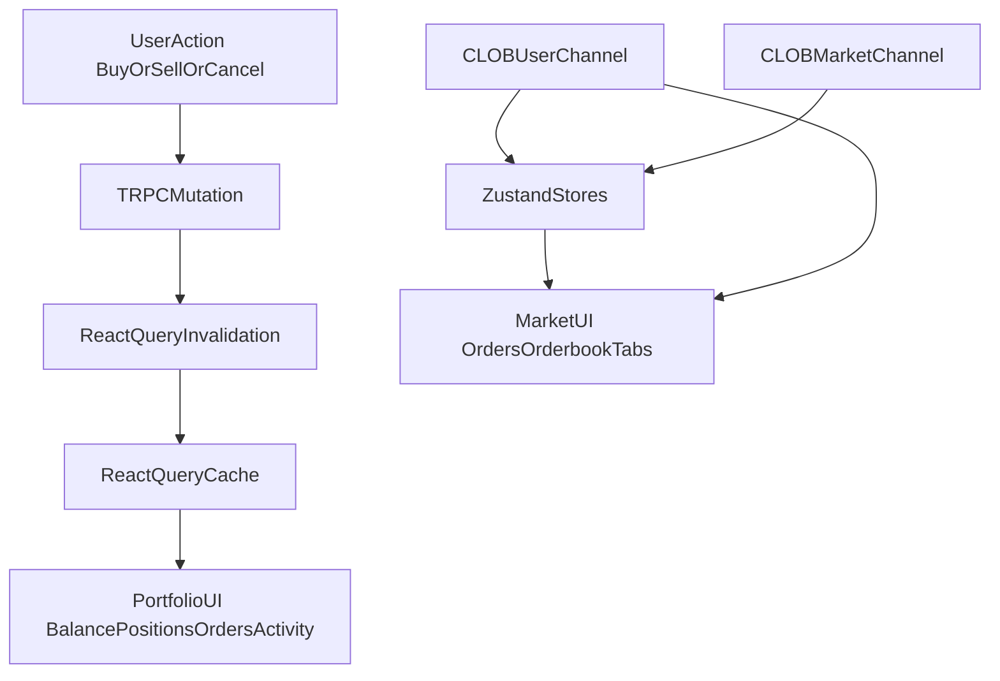

# Realtime Consistency Audit and Hardening

## Current Realtime Architecture (confirmed)

- UI uses a mixed model: **Zustand + WebSocket** for market-local live data and **tRPC + React Query** for portfolio/account surfaces.
- Order/trade/balance updates are partially realtime, but cross-page consistency depends on mutation invalidations and polling intervals.
- Server provides no app-level push channel (no server WebSocket/SSE), so client correctness is driven by CLOB user/market channels + cache strategy.

## Critical Findings To Address First

- **Missing post-trade invalidations** in `[/home/kaizen/dev/doji/apps/web/src/components/trading/orders/order-form.hooks.ts](/home/kaizen/dev/doji/apps/web/src/components/trading/orders/order-form.hooks.ts)` and `[/home/kaizen/dev/doji/apps/web/src/components/market/quick-sell-modal.tsx](/home/kaizen/dev/doji/apps/web/src/components/market/quick-sell-modal.tsx)`: currently invalidates positions only, not all dependent balance/activity/orders surfaces.
- **Cancel flows not consistently invalidating portfolio orders** in `[/home/kaizen/dev/doji/apps/web/src/components/trading/orderbook.tsx](/home/kaizen/dev/doji/apps/web/src/components/trading/orderbook.tsx)` and `[/home/kaizen/dev/doji/apps/web/src/components/trading/orders/open-orders.tsx](/home/kaizen/dev/doji/apps/web/src/components/trading/orders/open-orders.tsx)`.
- **Dual orders sources can drift**: market tabs consume Zustand while portfolio table consumes React Query (`getOpenOrdersWithMarkets`).
- **Trades tab uses custom query key** in `[/home/kaizen/dev/doji/apps/web/src/components/market/tabs/trades-tab.tsx](/home/kaizen/dev/doji/apps/web/src/components/market/tabs/trades-tab.tsx)`, so global `trpc.data.trades` invalidation can miss it.
- **Bridge completion consistency gap**: deposit writes bridge activity immediately, withdraw path does not mirror equivalent immediate activity entry; balance/value invalidation style is inconsistent.
- **Contract shape mismatches** across Data API vs CLOB responses increase stale/merge risk in client mapping layers (notably trades/orders payloads).

## Implementation Plan

### 1) Establish a canonical invalidation contract

- Create a single shared invalidation map for mutation outcomes (buy/sell/quick-sell/cancel/redeem/split/merge/deposit/withdraw).
- Apply it to every mutation success path so all critical surfaces refresh deterministically.
- Primary target files:
  - `[/home/kaizen/dev/doji/apps/web/src/components/trading/orders/order-form.hooks.ts](/home/kaizen/dev/doji/apps/web/src/components/trading/orders/order-form.hooks.ts)`
  - `[/home/kaizen/dev/doji/apps/web/src/components/market/quick-sell-modal.tsx](/home/kaizen/dev/doji/apps/web/src/components/market/quick-sell-modal.tsx)`
  - `[/home/kaizen/dev/doji/apps/web/src/components/trading/orderbook.tsx](/home/kaizen/dev/doji/apps/web/src/components/trading/orderbook.tsx)`
  - `[/home/kaizen/dev/doji/apps/web/src/components/trading/orders/open-orders.tsx](/home/kaizen/dev/doji/apps/web/src/components/trading/orders/open-orders.tsx)`
  - `[/home/kaizen/dev/doji/apps/web/src/components/bridge/withdraw-flow.tsx](/home/kaizen/dev/doji/apps/web/src/components/bridge/withdraw-flow.tsx)`

### 2) Eliminate orders source drift

- Decide and enforce one synchronization strategy between `useOrdersStore` and `clob.getOpenOrdersWithMarkets`.
- Keep market tabs realtime via store, but ensure portfolio table is immediately coherent via shared invalidation and/or a small optimistic reconciliation step after cancel/place.
- Key files:
  - `[/home/kaizen/dev/doji/apps/web/src/hooks/use-user-channel.ts](/home/kaizen/dev/doji/apps/web/src/hooks/use-user-channel.ts)`
  - `[/home/kaizen/dev/doji/apps/web/src/stores/orders.ts](/home/kaizen/dev/doji/apps/web/src/stores/orders.ts)`
  - `[/home/kaizen/dev/doji/apps/web/src/components/market/tabs/orders-tab.tsx](/home/kaizen/dev/doji/apps/web/src/components/market/tabs/orders-tab.tsx)`
  - `[/home/kaizen/dev/doji/apps/web/src/components/portfolio/orders-table.tsx](/home/kaizen/dev/doji/apps/web/src/components/portfolio/orders-table.tsx)`

### 3) Normalize query keys for cross-page refetch correctness

- Replace ad hoc query keys with canonical tRPC keys where possible (especially trades infinite query).
- Standardize `data.value.queryKey()` usage (with or without input) based on explicit scope rules.
- Key files:
  - `[/home/kaizen/dev/doji/apps/web/src/components/market/tabs/trades-tab.tsx](/home/kaizen/dev/doji/apps/web/src/components/market/tabs/trades-tab.tsx)`
  - `[/home/kaizen/dev/doji/apps/web/src/components/bridge/deposit-status-tracker.tsx](/home/kaizen/dev/doji/apps/web/src/components/bridge/deposit-status-tracker.tsx)`
  - `[/home/kaizen/dev/doji/apps/web/src/components/bridge/withdraw-status-tracker.tsx](/home/kaizen/dev/doji/apps/web/src/components/bridge/withdraw-status-tracker.tsx)`

### 4) Close bridge and activity realtime gaps

- Align deposit/withdraw completion behavior so both appear immediately in activity surfaces.
- Ensure balance/value + activity invalidations are symmetric on completion paths.
- Key files:
  - `[/home/kaizen/dev/doji/apps/web/src/components/bridge/deposit-status-tracker.tsx](/home/kaizen/dev/doji/apps/web/src/components/bridge/deposit-status-tracker.tsx)`
  - `[/home/kaizen/dev/doji/apps/web/src/components/bridge/withdraw-status-tracker.tsx](/home/kaizen/dev/doji/apps/web/src/components/bridge/withdraw-status-tracker.tsx)`
  - `[/home/kaizen/dev/doji/apps/web/src/stores/bridge-activity.ts](/home/kaizen/dev/doji/apps/web/src/stores/bridge-activity.ts)`
  - `[/home/kaizen/dev/doji/apps/web/src/components/portfolio/bridge-activity-table.tsx](/home/kaizen/dev/doji/apps/web/src/components/portfolio/bridge-activity-table.tsx)`

### 5) Contract hardening for predictable client reconciliation

- Standardize server response shapes for orders/trades where client currently handles multiple shapes.
- Add consistent metadata fields (`fetchedAt`/normalized IDs) where helpful for stale detection and dedupe.
- Key files:
  - `[/home/kaizen/dev/doji/apps/server/src/routers/clob.ts](/home/kaizen/dev/doji/apps/server/src/routers/clob.ts)`
  - `[/home/kaizen/dev/doji/apps/server/src/routers/data.ts](/home/kaizen/dev/doji/apps/server/src/routers/data.ts)`
  - `[/home/kaizen/dev/doji/apps/web/src/hooks/use-user-channel.ts](/home/kaizen/dev/doji/apps/web/src/hooks/use-user-channel.ts)`

### 6) Verification matrix and failure-mode testing

- Build an explicit mutation-to-surface test matrix and run manual + automated checks for each critical path:
  - Place BUY/SELL (market + quick-sell)
  - Cancel (orders tab, orderbook, open-orders panel, portfolio table)
  - Redeem/split/merge
  - Deposit/withdraw completion
- Validate immediate sync on:
  - Header balance/value
  - Market positions/orders/history tabs
  - Portfolio positions/orders/activity/bridge activity
- Run repo quality gates after changes: `pnpm fix`, targeted tests, and lints for edited files.

## Expected Outcome

- Any critical user mutation (trade/order/bridge) reflects across all relevant UI surfaces in one deterministic update cycle, without waiting for unrelated polling windows or tab switches.

