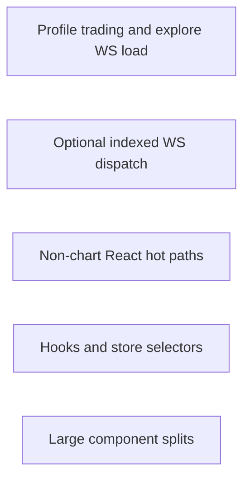

# Repo-wide performance optimization plan

## Scope (per your instructions)

- **In scope:** `apps/web` (components, hooks, stores, websocket client), shared `packages/`* where relevant, [apps/web/next.config.ts](apps/web/next.config.ts), Turborepo/task shape at a high level.
- **Out of scope for now:** **Charts / KLine / kline-aggregation / chart inner** — no chart pipeline work until you want to revisit.
- **Also out of scope:** Server-side API surfaces (Hono/tRPC routers, [apps/server/src/lib/polymarket/data.ts](apps/server/src/lib/polymarket/data.ts) fetch logic), Gamma/CLOB HTTP tuning, DB query design.

---

## 1. Charts (deferred)

Previously identified items (Tukey per-bucket cost, `setBarsEpoch` in `getBars`, render-phase token sync in `polymarket-kline-chart.tsx`) are **parked**. Skip profiling and implementation for this track.

---

## 2. React patterns and compiler interaction (non-chart)

**Where:** Components using `"use no memo"` outside charts: [events-discovery.tsx](apps/web/src/components/explore/events-discovery.tsx), [orderbook.tsx](apps/web/src/components/trading/orderbook.tsx), [position-table.tsx](apps/web/src/components/portfolio/position-table.tsx), [data-table.tsx](apps/web/src/components/ui/data-table.tsx), etc. See [apps/web/AGENTS.md](apps/web/AGENTS.md) for compiler exclusions.

**Findings**

- Large trees opt out of the React Compiler — **manual** memoization (`useMemo`/`useCallback`, stable props) and **child boundaries** matter more.
- Prefer **narrow child components** that are not opted out where hot, or stable props to reduce subtree work (without re-enabling compiler on whole tables if unsupported).

**Recommendations**

1. Pick one high-traffic surface (e.g. explore list or orderbook row rendering) and verify unnecessary rerenders with React DevTools.
2. Split heavy subtrees or memoize row props where profiling shows churn.

---

## 3. WebSocket client: fan-out cost

**Where:** [apps/web/src/lib/websocket/market-channel.ts](apps/web/src/lib/websocket/market-channel.ts) (`onMessage` iterates `this.handlers` for every parsed event).

**Findings**

- Each `book` / `price_change` / `last_trade_price` / … message runs **all** registered handlers; handlers usually filter by `asset_id`. With many subscribers (orderbook, volume, chart when enabled, etc.), cost scales as **O(messages × handlers)** on the main thread.

**Recommendations**

1. **Indexed dispatch:** maintain `Map<assetId, Set<handler>>` (or per-event-type maps) so handlers only run for relevant assets. Keep compatibility with [subscription-registry.ts](apps/web/src/lib/websocket/subscription-registry.ts).
2. Measure first: log handler count and message rate in dev behind a flag to justify the refactor.

---

## 4. Hooks and store subscriptions

**Examples:** [apps/web/src/hooks/use-orderbook.ts](apps/web/src/hooks/use-orderbook.ts), [use-merged-market-positions.ts](apps/web/src/hooks/use-merged-market-positions.ts).

**Findings**

- `useOrderbook`’s `refetch` uses `[queryResults]` as a dependency — `useQueries` return identity may change frequently, causing **refetch callback churn** if passed down.
- `useMergedMarketPositions` subscribes to `usePendingBalanceDeltasStore((s) => s.entries)` without a shallow/minimal selector — can trigger **extra rerenders** if `entries` churns.

**Recommendations**

1. Stabilize `refetch` (e.g. depend on stable refetch fns from the query layer).
2. Use `useShallow` or a tighter selector for pending deltas if profiling shows noise.

---

## 5. Discovery / tables

**Where:** [events-discovery.tsx](apps/web/src/components/explore/events-discovery.tsx), [use-filtered-search.ts](apps/web/src/components/layout/use-filtered-search.ts).

**Positive:** Trade counts use chunked client calls with **concurrency 2** — good for URL limits and burst control.

**Watch:** `useFilteredSearch` runs `gammaMarketToDiscoveryCard` in a loop for every market on each memo recompute — if lists grow, consider **precomputed card fields** or per-market memoization when parent data is stable.

---

## 6. Very large components

**Line counts (indicative):** `trading-layout-terminal.tsx` ~1013, `leaderboard-profile-modal.tsx` ~910, `position-table.tsx` ~897, `events-table.tsx` ~765.

**Recommendation:** Split by feature (workspace chrome vs tabs vs websocket wiring) for clearer boundaries and fewer accidental **context-driven** rerenders.

---

## 7. Build and bundle

**Where:** [apps/web/next.config.ts](apps/web/next.config.ts).

**Already in place:** `reactCompiler: true`, `cacheComponents: true`, `experimental.optimizePackageImports` for lucide/date-fns/recharts/tanstack table, `transpilePackages`, long TTL for Polymarket images.

**Optional:** Extend `optimizePackageImports` if bundle analyzer shows large barrel imports from other deps.

---

## 8. `apps/docs` and `packages/`*

- **Docs:** Fumadocs — skip unless specific slow pages show up.
- **Packages:** No broad sweep required for this pass; focus stays on web runtime behavior above.

---

## Suggested order of work

1. Profile trading + explore: market-channel traffic and main-thread long tasks.
2. Indexed market-channel dispatch if handler count × message rate is high.
3. Non-chart React optimizations where profiling points.
4. Hook/store stability improvements.
5. Component splits as a parallel maintainability track.
