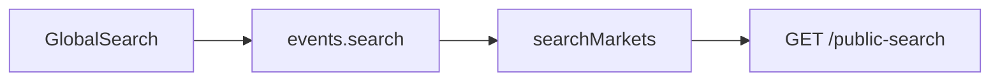

# Audit: `search-v2` vs Doji global search

## What Polymarket.com calls (your capture)

| Aspect | Value                                                                                                              |
| ------ | ------------------------------------------------------------------------------------------------------------------ |
| URL    | `https://gamma-api.polymarket.com/search-v2`                                                                       |
| Params | `q`, `optimized=true`, `limit_per_type=6`, `type=events`, `search_tags=true`, `search_profiles=true`, `cache=true` |

**Note:** Response headers show `Access-Control-Allow-Origin: https://polymarket.com` — that only affects browser calls from their origin. Doji’s server calls Gamma from the backend, so CORS does not apply.

## What Doji does today

- **tRPC** `[apps/server/src/routers/events.ts](apps/server/src/routers/events.ts)`: `search` accepts only `{ query: string }` (`[searchInput](apps/server/src/routers/events.ts)` at line ~105).
- **Client** `[apps/web/src/components/layout/global-search.tsx](apps/web/src/components/layout/global-search.tsx)`: `trpc.events.search.queryOptions({ query: normalizedQuery })` with `staleTime: 60_000` when the dialog is open and query length ≥ 2.
- **Gamma client** `[apps/server/src/lib/polymarket/gamma.ts](apps/server/src/lib/polymarket/gamma.ts)`: `searchMarkets(query)` calls `fetchJson("/public-search", SearchResultSchema, { q: query, search_profiles: "true", search_tags: "true" })` — **no** `optimized`, `limit_per_type`, `type`, or `cache`. It then flattens markets from nested events and runs `normalizeMarketAtBoundary` / `synthesizeTokens` / `sanitizeImageUrls` on markets.

**Already in the codebase but not used by global search:** `publicSearch(params: SearchParams)` hits the **same** `/public-search` path with a richer `[SearchParams](apps/server/src/lib/polymarket/gamma.ts)` object (`cache`, `events_status`, `limit_per_type`, `page`, `sort`, `ascending`, `optimized`, etc.). `**SearchParams` does not currently include `type`** (Polymarket sends `type=events`). That is a concrete parity gap if `type` is meaningful for `/public-search` as well as for `search-v2`.

**Docs alignment:** Official docs link in code points to [Search markets, events, and profiles](https://docs.polymarket.com/api-reference/search/search-markets-events-and-profiles) — that is the **documented** `/public-search` surface, not `search-v2`.

## Audit questions to answer (empirical)

1. **Equivalence:** For fixed `q` and comparable params, does `GET /search-v2` return the same JSON **shape** as `GET /public-search` (e.g. `events`, `tags`, `profiles`, `pagination`), or different fields / nesting?
2. **Ranking and counts:** Do result order and per-bucket sizes differ when using Polymarket’s bundle (`optimized`, `limit_per_type`, `type=events`, `cache`) vs Doji’s minimal `/public-search` call?
3. **Parameter coverage:** Does `type` apply only to `search-v2`, or does Gamma accept it on `/public-search` too? (Quick test: add `type=events` to a `/public-search` request and see if the response changes.)
4. **Operational:** If you ever switched the implementation path to `/search-v2`, update `[apps/server/src/lib/resilience/rate-limit-config.ts](apps/server/src/lib/resilience/rate-limit-config.ts)` — today only `[/public-search](apps/server/src/lib/resilience/rate-limit-config.ts)` is listed (350 req / 10s). Treat `search-v2` as a distinct path until you confirm it shares the same upstream bucket.

## Empirical results (curl)

Recorded against live Gamma (`q=r`, `search_tags=true`, `search_profiles=true` on both). `**search-v2`** also used `optimized=true`, `limit_per_type=6`, `type=events`, `cache=true` (Polymarket.com-style).

### Shared envelope (both endpoints)

- **Top-level keys:** `events`, `tags`, `profiles`, `pagination` — identical set.
- `**pagination`:** `{ "hasMore": boolean, "totalResults": number }`.
- **First tag object:** four fields on both — `id`, `label`, `slug`, `event_count`.
- **First profile object:** four fields on both — `name`, `pseudonym`, `proxyWallet`, `displayUsernamePublic`.
- **Order:** First event id/slug matched (`197892` / `save-act-signed-into-law-in-2026`).

### Differences that matter

| Observation                  | `GET /public-search`                      | `GET /search-v2` (above params) |
| ---------------------------- | ----------------------------------------- | ------------------------------- |
| Approx. body size            | ~34 KB                                    | ~9.5 KB                         |
| Rows per bucket              | 5 events / 5 tags / 5 profiles            | 6 / 6 / 6 (`limit_per_type=6`)  |
| `pagination.totalResults`    | 1051                                      | 1437                            |
| First **event** field count  | ~42 keys                                  | ~11 keys (trimmed projection)   |
| First **market** field count | ~82 keys                                  | ~13 keys (trimmed projection)   |
| `conditionId` on market      | present                                   | **absent**                      |
| `clobTokenIds` on market     | present                                   | **absent**                      |
| `outcomes` / `outcomePrices` | JSON **strings** (e.g. serialized arrays) | JSON **arrays**                 |

**Conclusion:** Same high-level **search result** schema (`events` / `tags` / `profiles` / `pagination`), but `**search-v2` returns a slim listing projection**; `**/public-search` returns full Gamma entities** suitable for Doji’s `searchMarkets()` post-processing (`normalizeMarketAtBoundary`, `synthesizeTokens`, `sanitizeImageUrls`), which expects `clobTokenIds` and related fields.

**Implication:** Swapping global search to `search-v2` only is **not drop-in** — you would need a **hydration step** (e.g. refetch market/event by id or slug via `GET /markets/...` / `GET /events/...`) or keep `**/public-search`** for the current pipeline.

## Suggested methodology (read-only / scripts)

**Done:** Baseline `public-search` vs Polymarket-style `search-v2` — see [Empirical results (curl)](#empirical-results-curl).

**Optional follow-ups:**

- `public-search` with `optimized=true&limit_per_type=6&cache=true` only (isolate param effects vs `search-v2` path).
- Add `type=events` to `**/public-search`** only and diff — answers whether `type` is search-v2-only (see todo `param-type`).
- Capture TTFB if comparing `cache=true` behavior.

## Gap summary (before any code change)

| Area                                     | Polymarket.com (`search-v2`) | Doji today                      |
| ---------------------------------------- | ---------------------------- | ------------------------------- |
| Path                                     | `/search-v2`                 | `/public-search`                |
| `optimized` / `cache` / `limit_per_type` | Sent                         | Not sent by `searchMarkets`     |
| `type`                                   | `events`                     | Not sent; not on `SearchParams` |
| tRPC surface                             | N/A                          | Query string only               |

## If the audit says “align with Polymarket” (implementation sketch — **not** part of this audit-only step)

- **Option A — Stay on `/public-search`:** Extend `searchMarkets` (or `events.search` input) to pass `optimized`, `limit_per_type`, `cache`, and add `type` to `SearchParams` if the API accepts it; keep Zod validation and existing market post-processing.
- **Option B — Use `/search-v2`:** Add something like `fetchJson("/search-v2", ...)` with the same schema validation **after** confirming the response matches `SearchResultSchema` / `SearchSchema`; duplicate or share rate-limit entry for `/search-v2`.

---

**Deliverable:** This plan file now holds the written comparison (endpoint behavior, schema/projection differences, recommendation: keep `/public-search` for full markets or hydrate after `search-v2`). Copy to `docs/` only if you want it in-repo under version control.
