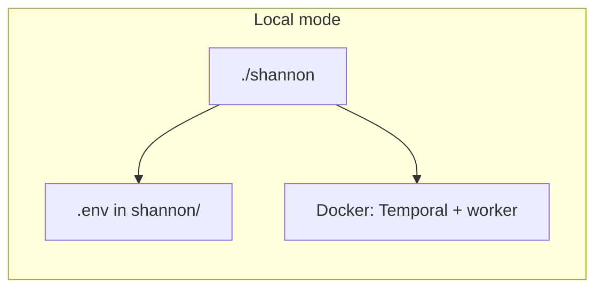

# Shannon local setup plan

## What is in `shannon/`

- **Standalone repo**: Contains its own `[.git](shannon/.git)` and is **not** listed in the root `[pnpm-workspace.yaml](pnpm-workspace.yaml)` (`apps/`*/ `packages/`* only). Treat it as a separate project under Doji.
- **Stack**: Root `[package.json](shannon/package.json)` — Turborepo + Biome; packages `[apps/cli](shannon/apps/cli)` (CLI) and `[apps/worker](shannon/apps/worker)` (Temporal worker, built into a Docker image).
- **Entry point**: The `[shannon](shannon/shannon)` script sets `SHANNON_LOCAL=1` then runs the built CLI — this activates **local mode** (loads `[shannon/.env](shannon/.env)`, builds/pulls worker image locally per `[apps/cli/src/mode.ts](shannon/apps/cli/src/mode.ts)` and `[start.ts](shannon/apps/cli/src/commands/start.ts)`).



## Prerequisites (from [README](shannon/README.md))

- **Docker** (daemon running) — Temporal and the worker run in containers.
- **Node.js 18+** and **pnpm** (Shannon pins `pnpm@10.12.1` in root `packageManager`).
- **AI credentials** — typically `ANTHROPIC_API_KEY` (or OAuth / Bedrock / Vertex / router); see `[shannon/.env.example](shannon/.env.example)`.

## Setup steps (after you approve execution)

1. **Go to the Shannon tree**
  `cd /home/kaizen/dev/doji/shannon`
2. **Credentials (local mode)**

- Copy `cp .env.example .env` and set at least `ANTHROPIC_API_KEY` (and recommended `CLAUDE_CODE_MAX_OUTPUT_TOKENS=64000`).  
- **Note:** The interactive `setup` wizard writes `~/.shannon/config.toml`, which is used in **npx** mode; **local mode** reads `**shannon/.env` only** (`[apps/cli/src/env.ts](shannon/apps/cli/src/env.ts)`).

1. **Install and build**

- `pnpm install`  
- `pnpm build` (builds CLI + worker via Turbo)

1. **Infrastructure**

- From `shannon/`: `docker compose up -d` — starts Temporal on **127.0.0.1:7233** (gRPC) and **127.0.0.1:8233** (Web UI), per `[docker-compose.yml](shannon/docker-compose.yml)`.  
- **Optional router** (OpenAI / OpenRouter): `ROUTER=true docker compose --profile router up -d` and use `ROUTER=true ./shannon start ...` as documented in the README.

1. **Run a scan**

- `./shannon start -u https://your-app.com -r /absolute/or/relative/path/to/repo`  
- First run will ensure the **local Docker image** for the worker (clone-and-build path); workspaces/logs land under Shannon’s configured workspace dir (see README “Workspaces and Resuming”).

## Testing against local Doji (web + API)

**Goal:** White-box pentest of the Doji stack Shannon can reach in the browser and over HTTP, using the real monorepo as `-r`.

1. **Run Doji locally** (from repo root `/home/kaizen/dev/doji`, not `shannon/`): `pnpm dev` so the Next.js app and Hono API are up. Default ports per [AGENTS.md](/home/kaizen/dev/doji/AGENTS.md): **web 3000**, **server 3001**.
2. **Target URL (`-u`) — do not use `http://localhost:...` from Shannon.** The worker runs **inside Docker** on `shannon-net`. `localhost` inside that container is the container itself, not your host. Shannon’s CLI already adds `--add-host host.docker.internal:host-gateway` on Linux (see `[docker.ts](shannon/apps/cli/src/docker.ts)` `addHostFlag`), so use:

- **Primary (UI + typical flow):** `-u http://host.docker.internal:3000`
- **API-only emphasis:** `-u http://host.docker.internal:3001` if you want the base URL to be the Hono API (ensure dev server listens on `0.0.0.0`, not only `127.0.0.1`).

1. **Repository path (`-r`):** Point at the **Doji monorepo root** for white-box context: `-r /home/kaizen/dev/doji` (absolute path is clearest from `shannon/`).
2. **Example command** (from `shannon/` after build + compose):

```bash
./shannon start -u http://host.docker.internal:3000 -r /home/kaizen/dev/doji
```

1. **Auth / env:** If Shannon must log in (Magic, etc.), you may need test credentials or Shannon-supported config (see Shannon README “Credentials and Configuration”). Doji secrets stay in app `.env` files; Shannon only needs `shannon/.env` for the LLM provider.
2. **Scope / safety:** Shannon runs **real exploit attempts**. Use a **local dev database** and non-production keys; avoid shared staging unless allowed.

## Optional: npx workflow (no local build)

If you prefer the published CLI and Hub image: from anywhere, `npx @keygraph/shannon setup` then `npx @keygraph/shannon start ...` — still requires Docker; does not use the nested `shannon/` source unless you point at it explicitly.

## Gotchas

- Always use `./shannon` from the `shannon/` directory for local development — not plain `node apps/cli/dist/...` without `SHANNON_LOCAL=1`, or you get npx-style behavior and wrong env loading.
- **Local target URL:** Use `host.docker.internal` with the host port, not `localhost`, when scanning apps running on the host (see section above).
- **Ports**: 7233/8233 for Temporal; 3456 if the router profile is up; Doji web 3000 / server 3001.
- **License**: Shannon Lite is **AGPL-3.0** (`[apps/cli/package.json](shannon/apps/cli/package.json)`); use only on apps you’re allowed to test.

No changes to the Doji monorepo are required unless you later decide to document Shannon as a sibling tool or add a workspace pointer (out of scope unless you ask).
