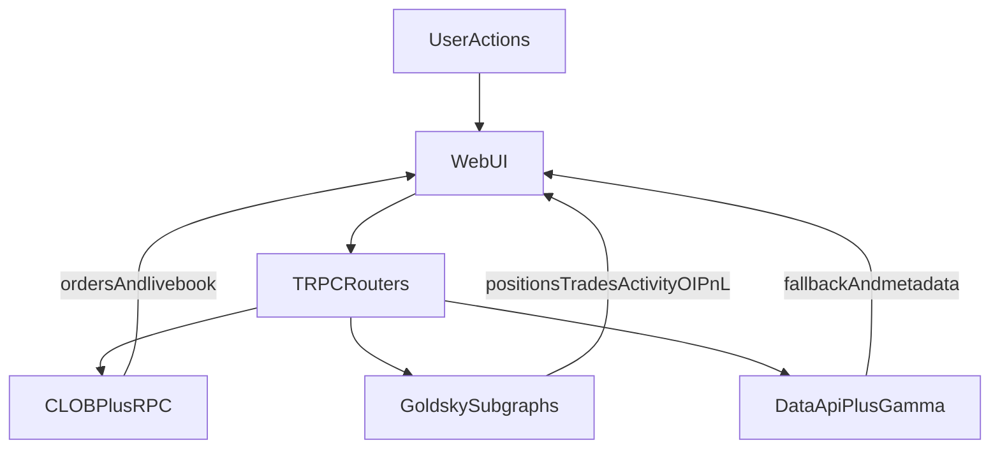

# Subgraph Leverage Audit Plan

## Audit Snapshot (researched)

- Server currently mixes Data API, Gamma, CLOB, and direct RPC in `[/home/kaizen/dev/doji/apps/server/src/routers/data.ts](/home/kaizen/dev/doji/apps/server/src/routers/data.ts)`, `[/home/kaizen/dev/doji/apps/server/src/routers/clob.ts](/home/kaizen/dev/doji/apps/server/src/routers/clob.ts)`, `[/home/kaizen/dev/doji/apps/server/src/routers/wallets.ts](/home/kaizen/dev/doji/apps/server/src/routers/wallets.ts)`, and `[/home/kaizen/dev/doji/apps/server/src/lib/balance.ts](/home/kaizen/dev/doji/apps/server/src/lib/balance.ts)`.
- Frontend critical views depend heavily on `data.*` + `clob.*` procedures (portfolio/market/history/trades), especially in `[/home/kaizen/dev/doji/apps/web/src/app/portfolio/use-portfolio-data.ts](/home/kaizen/dev/doji/apps/web/src/app/portfolio/use-portfolio-data.ts)`, `[/home/kaizen/dev/doji/apps/web/src/components/market/tabs/trades-tab.tsx](/home/kaizen/dev/doji/apps/web/src/components/market/tabs/trades-tab.tsx)`, `[/home/kaizen/dev/doji/apps/web/src/components/portfolio/activity-history.tsx](/home/kaizen/dev/doji/apps/web/src/components/portfolio/activity-history.tsx)`, and `[/home/kaizen/dev/doji/apps/web/src/components/market/market-header-trading.tsx](/home/kaizen/dev/doji/apps/web/src/components/market/market-header-trading.tsx)`.
- Best near-term subgraph opportunities: **open interest**, **trade counts**, **activity enrichment**, and **historical trades**.
- Keep current sources for **live orderbook/open orders/order placement** (CLOB) and **immediate balances** (RPC/CLOB allowance).
- Local path `references/polymarket-subgraph` is not present in the current workspace snapshot, so schema truth should come from Goldsky endpoint introspection + official GitHub source.

## Recommended Target State

## Phase Plan

### 1) Build source-of-truth mapping matrix

- Inventory every `data.*` and `wallets.*` read procedure and map to subgraph candidates.
- Start with:
  - `[/home/kaizen/dev/doji/apps/server/src/routers/data.ts](/home/kaizen/dev/doji/apps/server/src/routers/data.ts)`
  - `[/home/kaizen/dev/doji/apps/server/src/routers/wallets.ts](/home/kaizen/dev/doji/apps/server/src/routers/wallets.ts)`
  - `[/home/kaizen/dev/doji/apps/server/src/lib/polymarket/data.ts](/home/kaizen/dev/doji/apps/server/src/lib/polymarket/data.ts)`
- Output: procedure-by-procedure decision (`replace`, `augment`, `keep`) with rationale.

### 2) Low-risk replacement first: Open Interest

- Introduce subgraph-backed OI fetcher and wire it behind `data.openInterest` with fallback to current Data API.
- Validate parity and latency against existing behavior used by:
  - `[/home/kaizen/dev/doji/apps/web/src/hooks/use-open-interest.ts](/home/kaizen/dev/doji/apps/web/src/hooks/use-open-interest.ts)`
  - `[/home/kaizen/dev/doji/apps/web/src/components/market/market-header-trading.tsx](/home/kaizen/dev/doji/apps/web/src/components/market/market-header-trading.tsx)`

### 3) High-value optimization: tradeCountsByMarket

- Replace expensive batched Data API trade counting with Orders subgraph aggregation.
- Target:
  - `[/home/kaizen/dev/doji/apps/server/src/routers/data.ts](/home/kaizen/dev/doji/apps/server/src/routers/data.ts)` (`tradeCountsByMarket`)
  - Consumer: `[/home/kaizen/dev/doji/apps/web/src/components/explore/events-discovery.tsx](/home/kaizen/dev/doji/apps/web/src/components/explore/events-discovery.tsx)`

### 4) Activity/trades migration (blended)

- Move historical activity/trades to subgraph-backed reads, keep CLOB/WebSocket for live immediacy.
- Start with `data.activity`, `data.activityWithMarkets`, `data.trades`.
- Frontend impact surfaces:
  - `[/home/kaizen/dev/doji/apps/web/src/components/market/tabs/history-tab.tsx](/home/kaizen/dev/doji/apps/web/src/components/market/tabs/history-tab.tsx)`
  - `[/home/kaizen/dev/doji/apps/web/src/components/market/tabs/trades-tab.tsx](/home/kaizen/dev/doji/apps/web/src/components/market/tabs/trades-tab.tsx)`
  - `[/home/kaizen/dev/doji/apps/web/src/components/portfolio/activity-history.tsx](/home/kaizen/dev/doji/apps/web/src/components/portfolio/activity-history.tsx)`

### 5) Positions/PnL feasibility pass before replacement

- Evaluate if subgraph PnL/position entities cover all current UI fields (`avgPrice`, `curPrice`, `mergeable`, etc.).
- If gaps exist, implement augmentation strategy (subgraph core + existing enrichment), not full swap.
- Key consumers:
  - `[/home/kaizen/dev/doji/apps/web/src/app/portfolio/use-portfolio-data.ts](/home/kaizen/dev/doji/apps/web/src/app/portfolio/use-portfolio-data.ts)`
  - `[/home/kaizen/dev/doji/apps/web/src/components/market/tabs/positions-tab.tsx](/home/kaizen/dev/doji/apps/web/src/components/market/tabs/positions-tab.tsx)`

### 6) Cache/invalidation policy for mixed sources

- Extend realtime invalidation contract to include new subgraph-backed procedures so cross-page sync remains deterministic.
- Center this work around:
  - `[/home/kaizen/dev/doji/apps/web/src/lib/trpc/index.ts](/home/kaizen/dev/doji/apps/web/src/lib/trpc/index.ts)`

### 7) Safety gates and rollout strategy

- Add feature flag for subgraph routes per domain (`oi`, `tradeCounts`, `activity`, `trades`, `positions`).
- Define fallbacks + SLA checks: timeout/backoff/fallback to Data API.
- Validate with side-by-side parity and latency logging before default switch.

## Deliverables

- Prioritized migration matrix (`replace`/`augment`/`keep`) by procedure and UI consumer.
- Subgraph query spec per domain (entities + field mapping + fallback behavior).
- Phased rollout plan with measurable success criteria (latency, staleness incidents, query volume reduction).

