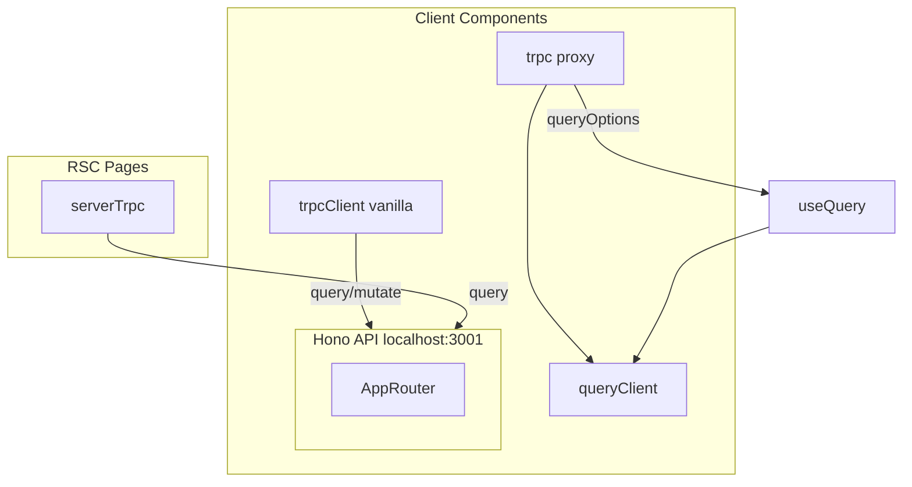

# tRPC Setup and Usage Standardization

## Current State Summary

**Client setup** ([apps/web/src/utils/trpc.ts](apps/web/src/utils/trpc.ts)): Already follows tRPC TanStack React Query "3c - without React context" (singleton `queryClient` + `trpcClient`, `createTRPCOptionsProxy`). Queries use `useQuery(trpc.path.queryOptions(...))`; mutations use imperative `trpcClient.x.mutate()`.

**Server setup** ([apps/web/src/utils/trpc-server.ts](apps/web/src/utils/trpc-server.ts)): Plain `createTRPCClient` for RSC; no auth headers (all RSC calls are public procedures). Timeout wrapper prevents indefinite hangs.

**Inconsistencies**:

- Manual `queryKey` arrays in 5+ files (can drift from router structure)
- Ad-hoc `useQuery({ queryFn: () => trpcClient.x.query(...), queryKey: [...] })` instead of `trpc.x.queryOptions`
- `enabled: Boolean(x)` + fallback empty input instead of `skipToken`
- Single `invalidateQueries` uses hardcoded `["data", "positions"]`

---

## tRPC Doc Reference (Key Gems)

Distilled from Concepts, Quickstart, Define Routers, Procedures, Validators, Non-JSON, Merging Routers, Context, Middlewares, Server Side Calls, Authorization, Error Handling, Error Formatting, Data Transformers, Metadata, Response Caching, Subscriptions, WebSockets, Client Overview, TanStack React Query (setup, usage, migrating), RSC setup, Inferring Types, useInfiniteQuery, useSubscription, useUtils, createTRPCQueryUtils, useQueries, Suspense, getQueryKey, Aborting, Disabling Queries, Vanilla Client (setup, infer-types, aborting), Links (overview, httpLink, httpBatchLink, httpBatchStreamLink, httpSubscriptionLink, splitLink, loggerLink, retryLink, localLink, wsLink), Custom headers, CORS, FAQ, HTTP RPC Spec, and @hono/trpc-server docs. Reference when implementing or auditing.

**Routers**

- Initialize tRPC **exactly once** per app; multiple instances cause issues
- Export `type AppRouter = typeof appRouter` only — never the router value on client
- Child router merging: `router({ user: userRouter, post: postRouter })` → namespaced routes
- `lazy(() => import('./router.js'))` reduces cold starts; usage unchanged

**Procedures**

- Reusable base procedures: `publicProcedure`, `authedProcedure`, `organizationProcedure` via `.use()`
- Middleware narrows context: `opts.next({ ctx: { user: ctx.user } })` → non-nullable downstream
- `inferProcedureBuilderResolverOptions<typeof proc>` for shared handler types

**Validators**

- `.input()` can be stacked in base procedures (input merging) for shared middleware input
- Output validation optional; use for untrusted sources or limiting exposed data (failure → `INTERNAL_SERVER_ERROR`)
- Zod is default; Zod/Valibot/ArkType/etc. via Standard Schema

**Context**

- Inner vs outer: split request-free (DB, always available) from request-dependent (session) for testing + `createServerSideHelpers`
- Infer `Context` from **inner** context for procedures
- Batch limit: throw `TOO_MANY_REQUESTS` in `createContext` when `opts.info.calls.length > MAX`

**Non-JSON (FormData/File)**

- Use `splitLink` so non-JSON → `httpLink`, JSON → `httpBatchLink`
- Don’t parse body (e.g. `express.json()`) before tRPC; mount only on non-tRPC routes

**Middlewares**

- Context extension via `opts.next({ ctx: { ... } })`
- Piped middleware order matters — context types must overlap/chain correctly
- `experimental_standaloneMiddleware` for reusable cross-instance middlewares

**Server-Side Calls**

- **Never call procedures from inside other procedures** via `createCaller` — re-runs context, middlewares, validation. Extract shared logic into a plain function and call from both.
- `createCallerFactory(appRouter)` → `createCaller(ctx)` for server-side or integration tests. Pass full `Context` (including `user` for protected procedures).
- `router.createCaller(ctx)` alternative; middlewares run before procedure.
- `onError` option on `createCaller` / `createCallerFactory` for custom error handling.
- Use `createContextInner` for tests; protected procedures need `{ user: { id } }` in context.

**Authorization**

- Option 1: Check in resolver (`if (!opts.ctx.user) throw TRPCError({ code: 'UNAUTHORIZED' })`).
- Option 2: `protectedProcedure` middleware — reuse, context narrowing, cleaner.
- Decode user from `req.headers.authorization` in `createContext`.

**Error Handling**

- Use `TRPCError` with `code`, `message`, optional `cause` (retains stack for `INTERNAL_SERVER_ERROR`).
- `getHTTPStatusCodeFromError(error)` from `@trpc/server/http` for HTTP status.
- `onError(opts)` in handler receives `{ error, type, path, input, ctx, req }`; use for logging, bug reporting.
- Error codes: `BAD_REQUEST` (400), `UNAUTHORIZED` (401), `FORBIDDEN` (403), `NOT_FOUND` (404), `INTERNAL_SERVER_ERROR` (500), `TOO_MANY_REQUESTS` (429), etc.

**Error Formatting**

- `errorFormatter(opts)` in `initTRPC.create({ errorFormatter })` — `{ shape, error, type, path, input, ctx }`.
- Add custom `shape.data` (e.g. `zodError: error.cause instanceof ZodError ? error.cause.flatten() : null`) for client field-level validation UX.
- Inferred to client: `mutation.error?.data?.zodError`.

**Data Transformers**

- Must be added to both server (`initTRPC.create({ transformer })`) and client (links: `httpLink`, `httpBatchLink`).
- **SuperJSON**: Dates, Maps, Sets work over the wire without manual serialize/deserialize. TypeScript will prompt for `transformer` on client once server has it.
- **Devalue**: Better performance, smaller payloads; use `parse`/`stringify` (XSS-safe). Same pattern.
- **Different up/down**: `CombinedDataTransformer` with `input` and `output` for direction-specific transforms.
- `DataTransformer` interface: `{ serialize(object), deserialize(object) }`.

**Metadata**

- `.meta<Meta>()` on `initTRPC`; procedure-specific `meta` available in all middleware `opts`.
- Per-route settings: `procedure.meta({ authRequired: true })` then check in middleware `if (meta?.authRequired && !ctx.user)`.
- `defaultMeta` in `create()` for defaults; chained `.meta()` shallow-merges.
- Use with trpc-openapi for REST-compatible endpoints.

**Response Caching**

- Use with care — avoid caching personal data. Skip cache headers if auth header/cookie present, or use `splitLink` for public vs private.
- **App caching**: `responseMeta(opts)` in `createTRPCNext` — return `headers` with `cache-control` (e.g. `s-maxage=1, stale-while-revalidate=86400`). Propagate `clientErrors[0].data?.httpStatus` on errors.
- **API caching**: `responseMeta` on adapter (e.g. `createNextApiHandler`) — check `paths`, `errors`, `type`; only cache when `allPublic && allOk && isQuery`. Same `cache-control` headers.

**Subscriptions**

- Real-time event stream; client reconnects and recovers via `tracked()`. Use SSE (httpSubscriptionLink) or WebSockets (wsLink). SSE recommended for simpler setup.
- `publicProcedure.subscription(async function* (opts) { ... })` — async generator; `opts.signal` aborts on disconnect.
- **tracked(id, data)**: include `id` with each `yield` so client sends `lastEventId` on reconnect and resumes. Input `lastEventId` for catch-up.
- Subscribe before fetching backlog so new events aren’t missed while yielding historical batch.
- Stop from server: `return` in generator. Client: `.unsubscribe()`. Cleanup: `try { ... } finally { ... }`.
- 5xx in subscription → client auto-reconnects with last tracked id; other errors → cancel.
- Output validation: `zAsyncIterable({ yield, tracked })` for subscription output.

**WebSockets**

- `applyWSSHandler({ wss, router, createContext })`; `keepAlive: { enabled, pingMs, pongWaitMs }`.
- `createWSClient({ url })` + `wsLink({ client })`. Use `splitLink` to route queries/mutations to HTTP, subscriptions to WS.
- `connectionParams` for auth (non-web: cookies not sent). Server: `opts.info.connectionParams?.token`.
- `broadcastReconnectNotification()` before `wss.close()` on SIGTERM.

**Client Overview**

- Use a **client** for typesafety, autocomplete, correct types, validation errors. Vanilla client for non-React; React Query integration for React (caching, invalidation, loading/error).
- **TanStack React Query** (recommended) vs classic `@trpc/react-query`. New client: `queryOptions`, `mutationOptions`, `queryKey` factories — more TanStack-native.

**TanStack React Query Setup**

- **3a Context**: SSR — per-request QueryClient, `createTRPCContext` → `TRPCProvider`, `useTRPC()`. `getQueryClient()` server=new, browser=singleton.
- **3b Key prefixing**: Multiple backends → `createTRPCContext<Router, { keyPrefix: true }>()`, `keyPrefix="billing"` on provider.
- **3c Singleton**: SPA/CSR — `createTRPCOptionsProxy`, shared `queryClient` + `trpcClient`, no provider. Import `trpc` directly.
- **Optional**: Integration not required; vanilla client + manual `queryKey`/`queryFn` works but less DX.

**TanStack React Query Usage**

- `queryOptions(input, { staleTime, trpc: { context } })` — second arg = TanStack options; `trpc.context` for link options.
- `skipToken` as first arg for conditional disable: `condition ? { ... } : skipToken`.
- `infiniteQueryOptions` for cursor input; `queryKey()`, `pathKey()`, `router.pathKey()` for type-safe keys.
- `queryFilter` / `pathFilter` with `predicate` for selective invalidation.
- `mutationOptions({ onSuccess })`; `subscriptionOptions` for `useSubscription` (needs httpSubscriptionLink or wsLink).
- **Infer types**: `inferRouterInputs<AppRouter>`, `inferRouterOutputs<AppRouter>`; `inferInput`/`inferOutput` from `@trpc/tanstack-react-query` for single procedure.
- **Client access**: `useTRPCClient()` with context; import client directly with singleton.

**Migrating Classic → TanStack**

- New and classic **coexist**; query keys identical. Migrate gradually.
- `trpc.x.useQuery({ ... })` → `useQuery(trpc.x.queryOptions({ ... }))`.
- `trpc.useUtils().x.invalidate(...)` → `queryClient.invalidateQueries(trpc.x.queryFilter(...))`.
- `trpc.x.useMutation()` → `useMutation(trpc.x.mutationOptions())`.
- Codemod: `npx @trpc/upgrade` (transforms: migrate hooks, context setup).

**RSC with TanStack**

- `createTRPCOptionsProxy` with `ctx` (caller) or `client` (separate server); `cache(makeQueryClient)` for request-stable client.
- **Server**: `prefetchQuery` (stream) or `await fetchQuery` (block); `dehydrate` + `HydrationBoundary`. Caller for server-only data (not in cache).
- **Client**: `useQuery` / `useSuspenseQuery` with same `queryOptions`. Data hydrates from server.
- `shouldDehydrateQuery`: include `status === 'pending'` so in-flight prefetches stream.
- Caller vs prefetch: caller = server-only, no cache; prefetch = hydrates to client.

**Classic React** (`createTRPCReact`)

- `trpc.x.useQuery()`, `trpc.x.useMutation()`; `trpc.useUtils()` for invalidation. Still supported, not recommended for new projects.

**useInfiniteQuery**

- Procedure must accept `cursor` input (any type). Return `{ items, nextCursor }`; `take: limit + 1`, pop last for nextCursor.
- `getNextPageParam: (lastPage) => lastPage.nextCursor`. Optional `initialCursor`.
- Classic: `utils.x.getInfiniteData()`, `utils.x.setInfiniteData()`. TanStack: `queryClient.getQueryData(trpc.x.infiniteQueryKey(...))`, `setQueryData`.

**useSubscription**

- `useSubscription(input | skipToken, { onData, onError, onStarted, onComplete })`. `skipToken` pauses.
- Return: `{ status: 'idle'|'connecting'|'pending'|'error', data, error, reset }`.
- Needs httpSubscriptionLink or wsLink.

**useUtils** (classic)

- Thin wrappers: `fetch`, `prefetch`, `fetchInfinite`, `prefetchInfinite`, `ensureData`, `invalidate`, `refetch`, `cancel`, `setData`, `getData`, `setInfiniteData`, `getInfiniteData`.
- `utils.post.all.invalidate()`; `utils.post.byId.invalidate({ id })` (input filter); `utils.post.invalidate()` (router); `utils.invalidate()` (all).
- `utils.client.x.mutate()` — proxy client for imperative calls.
- Override `onSuccess` in `createTRPCReact` to invalidate full cache on every mutation (pragmatic when tracking is hard).

**createTRPCQueryUtils**

- Same helpers as useUtils but for **outside React** (loaders, etc.). Pass `{ queryClient, client }`.
- Don’t use in components — use `useUtils` there. Per-request: create new queryClient for SSR/loaders to avoid cross-request leakage.

**useQueries**

- Variable number of queries in one hook. `trpc.useQueries((t) => ids.map((id) => t.post.byId({ id })))`.
- With httpBatchLink/wsLink → single HTTP call. Per-query options in second param.
- Best for same-type queries; `suspense` enables parallel suspend vs waterfall with multiple useQuery.

**Suspense**

- `useSuspenseQuery`, `useSuspenseInfiniteQuery`, `useSuspenseQueries` — return `[data, query]` tuple.
- Prefetch: route loader `utils.post.byId.ensureData()`, or `usePrefetchQuery` / `usePrefetchInfiniteQuery` at component level (“render-as-you-fetch”).
- With Next.js automatic SSR: failed query crashes full page even with ErrorBoundary.

**getQueryKey** (classic)

- `getQueryKey(procedure, input?, type?)` — `type`: `'query'` | `'infinite'` | `'any'`. `any` matches all via fuzzy matching.
- `getQueryKey(router)` for router-level key. Use with `useIsFetching`, `setQueryDefaults`, etc.
- `getMutationKey(procedure)` for mutations. Same underlying function as getQueryKey.
- TanStack equivalent: `trpc.path.queryKey()`, `trpc.router.pathKey()`.

**Aborting Procedure Calls**

- Default: tRPC does **not** cancel on unmount. Opt in: `abortOnUnmount: true` globally in `createTRPCReact` config or per-query in `{ trpc: { abortOnUnmount: true } }`.
- Only queries supported (not mutations); uses AbortController.

**Disabling Queries**

- `skipToken` as first argument to `useQuery` / `useInfiniteQuery` — prevents execution. Type-safe conditional: `name ? { name } : skipToken`.

**Vanilla Client Setup**

- `createTRPCClient<AppRouter>({ links: [httpBatchLink({ url, headers })] })`. `import type` for AppRouter.
- Typed Proxy: `client.getUser.query('id')`, `client.createUser.mutate({ name })`.
- `headers` can be async (`async headers() => ({ authorization: ... })`).

**Vanilla Type Inference**

- `inferRouterInputs<AppRouter>`, `inferRouterOutputs<AppRouter>` from `@trpc/server`. Access via path: `RouterInput['post']['create']`.
- `TRPCClientError<AppRouter>` — `cause instanceof TRPCClientError` for typed error handling; `cause.data` has procedure-specific shape.

**Vanilla Aborting**

- Pass `AbortSignal` to query/mutation: `proxy.userById.query('id', { signal: ac.signal })`. `ac.abort()` to cancel. Standard AbortController.

**Links Overview**

- Links modify or observe operations. Composed in array; executed in order on request, reverse on response. One terminating link required (last in chain).
- Custom link: `TRPCLink` — `() => ({ next, op }) => observable((observer) => { ... next(op).subscribe(...) })`. Use `@trpc/server/observable`.
- **Terminating link**: Sends to server, returns `OperationResultEnvelope`. `httpBatchLink` (recommended), `httpLink`, `wsLink`, `localLink`.
- **Context**: `op.context` — read/modify per-operation metadata. Set via `query(..., { context: { ... } })` or `trpc` options in queryOptions.

**httpLink / httpBatchLink**

- `httpLink`: one req per op. `httpBatchLink`: batches ops into single HTTP req. `Promise.all([...queries])` → one request.
- Options: `url`, `fetch`, `AbortController`, `transformer`, `headers` (sync or async). Batch: `maxURLLength`, `maxItems`. `methodOverride: 'POST'` for large URLs.
- Disable batching: server `allowBatching: false` or replace with `httpLink`.

**httpBatchStreamLink**

- Like httpBatchLink but streams responses as ready (chunked). For long-running; async generators. No `responseMeta` data (headers sent before data).
- Server: `initTRPC.create({ jsonl: { pingMs } })`. AWS Lambda not supported; Cloudflare needs `streams_enable_constructors`.

**httpSubscriptionLink**

- SSE for subscriptions. Use with `splitLink`: `condition: (op) => op.type === 'subscription'`. Same-domain: cookies sent; cross-domain: `withCredentials: true`.
- `eventSourceOptions` (sync/async) for headers; `connectionParams` for auth (in URL). EventSource polyfill for RN. `retryLink` + subscription for auth refresh (recreates connection).
- Server: `sse: { ping, maxDurationMs, client: { reconnectAfterInactivityMs } }`.

**splitLink**

- `splitLink({ condition: (op) => ..., true: linkOrArray, false: linkOrArray })`. Each branch needs terminating link. Example: `op.context.skipBatch` → httpLink vs httpBatchLink.

**loggerLink**

- `loggerLink({ enabled, logger, console, colorMode })`. `enabled: (opts) => ...` — e.g. dev only or `opts.direction === 'down' && opts.result instanceof Error`.

**retryLink**

- `retryLink({ retry: (opts) => ..., retryDelayMs })`. With React Query usually unnecessary. For subscriptions with `tracked()`: includes last event ID on retry.

**localLink** (unstable)

- `unstable_localLink({ router, createContext, onError })` — direct procedure calls, no HTTP. Useful for same-process testing or edge.

**wsLink**

- `createWSClient({ url, connectionParams, WebSocket, retryDelayMs, onOpen, onError, onClose, lazy, keepAlive })`. Pass client to `wsLink({ client })`.

**Custom Headers**

- `headers` in httpBatchLink/httpLink: object or function. Function called per request — use for dynamic auth (token from store, cookies).
- Pattern: `setToken()` on login success; `headers() { return { Authorization: token } }`.

**Cross-Origin Cookies**

- `fetch(url, { ...options, credentials: 'include' })` in link config to send cookies cross-origin. Server must enable CORS.

**FAQ / Troubleshooting**

- `**any` everywhere**: `strict: true`, matching `@trpc/*` versions, TypeScript >= 5.7.2, workspace TS in VSCode (`typescript.tsdk`, `enablePromptUseWorkspaceTsdk`).
- **Monorepo**: Same `@trpc/*` versions; `strict` in all tsconfig; client `paths` mirrors server for same file resolution.
- **No monorepo**: Publish private npm package with backend types; consume in frontend.
- **Router middleware**: Use base procedures, not router-level. **Dynamic output by input**: Not supported (needs HKT).
- **unstable_**: API may change in minors; safe to use; used in production. **experimental_**: Likely to change; less tested; upgrade at your own risk.
- **Semver**: Strict; no breaking changes in minor; exported type changes = major.

**HTTP RPC Spec**

- GET → `.query()`; input in query param. POST → `.mutation()`; input in body. Subscriptions not over HTTP.
- **Path**: Nested procedures = dots: `/api/trpc/post.byId`.
- **Batching**: Same-method calls combined; pathname = comma-separated; `input` = `Record<index, input>`; `batch=1` query. Mixed statuses → `207 Multi-Status`.
- **methodOverride**: Client `methodOverride: 'POST'`; server `allowMethodOverride: true` — queries as POST (e.g. large URLs).
- Error codes map to HTTP status (BAD_REQUEST→400, UNAUTHORIZED→401, etc.) and JSON-RPC codes.

**@hono/trpc-server**

- `trpcServer({ router, createContext? })` — mount on `app.use('/trpc/*', trpcServer(...))`. Works on Cloudflare Workers, Deno, Bun.
- **Context**: `initTRPC.context<HonoContext>()` — procedures get `ctx.env`, `ctx.req`, etc. Optional `createContext: (_opts, c) => ({ ... })` for custom mapping from Hono context.
- **Custom endpoint**: `endpoint: '/api/trpc'` must match middleware path (`/api/trpc/*`) so tRPC extracts procedure paths correctly.

---

## Architecture Diagram

---

## Implementation Plan

### Phase 1: Type-Safe Query Keys and Invalidation

Replace manual query keys with `trpc.path.queryKey()` / `trpc.router.pathKey()` so invalidation stays type-safe and refactor-friendly.

| File                                                                                   | Current                           | Target                                                                         |
| -------------------------------------------------------------------------------------- | --------------------------------- | ------------------------------------------------------------------------------ |
| [position-table.tsx](apps/web/src/components/portfolio/position-table.tsx) L349        | `queryKey: ["data", "positions"]` | `queryKey: trpc.data.positions.queryKey()`                                     |
| [position-table.tsx](apps/web/src/components/portfolio/position-table.tsx) (post-sell) | Same                              | Consider `trpc.data.pathKey()` to invalidate value, positions, trades together |

### Phase 2: Migrate Ad-Hoc Queries to queryOptions

Several components use raw `useQuery` with `queryFn` + manual `queryKey` instead of `trpc.path.queryOptions`. Migrate so React Query cache keys align with tRPC and stay type-safe.

| File                                                                                       | Procedure                   | Current pattern                                                    | Target                                                                                  |
| ------------------------------------------------------------------------------------------ | --------------------------- | ------------------------------------------------------------------ | --------------------------------------------------------------------------------------- |
| [trading-workspace.tsx](apps/web/src/components/trading/trading-workspace.tsx) L75-80      | `clob.getMidpoint`          | `useQuery({ queryFn, queryKey: ["clob","getMidpoint", tokenId] })` | `useQuery(trpc.clob.getMidpoint.queryOptions({ tokenId }), { enabled: ... })` or spread |
| [trading-layout.tsx](apps/web/src/components/trading/trading-layout.tsx) L79-84            | Same                        | Same                                                               | Same                                                                                    |
| [order-form.hooks.ts](apps/web/src/components/trading/orders/order-form.hooks.ts) L311-332 | `clob.calculateMarketPrice` | Custom queryKey with tokenId, side, amount                         | `useQuery(trpc.clob.calculateMarketPrice.queryOptions({ ... }), { enabled: ... })`      |
| [orderbook.tsx](apps/web/src/components/trading/orderbook.tsx) L78-82                      | `clob.getLiquidityMetrics`  | `queryKey: ["clob","getLiquidityMetrics", tokenId]`                | `useQuery(trpc.clob.getLiquidityMetrics.queryOptions({ tokenId }))`                     |

For `calculateMarketPrice`, the input includes `tokenId`, `side`, `amount`, `orderType`. Ensure the procedure exists and input schema matches; use spread for `enabled`, `staleTime`.

### Phase 3: Use skipToken for Conditional Queries

Replace `enabled: Boolean(x)` + `input: x ?? ""` with `skipToken` when input is conditionally missing. Clearer intent and no invalid input.

| File                                                                                  | Query                      | Current                                                      | Target                                                                                             |
| ------------------------------------------------------------------------------------- | -------------------------- | ------------------------------------------------------------ | -------------------------------------------------------------------------------------------------- |
| [header-wallet-balance.tsx](apps/web/src/components/layout/header-wallet-balance.tsx) | `data.value`               | `{ user: userAddress ?? "" }, enabled: Boolean(...)`         | `isAuthenticated && userAddress ? trpc.data.value.queryOptions({ user: userAddress }) : skipToken` |
| [header-wallet-balance.tsx](apps/web/src/components/layout/header-wallet-balance.tsx) | `clob.getBalanceAllowance` | Same pattern                                                 | Same                                                                                               |
| [use-safe-balance.ts](apps/web/src/hooks/use-safe-balance.ts)                         | `data.usdcBalance`         | `{ address: safeAddress ?? "" }, enabled: !!safeAddress`     | `safeAddress ? trpc.data.usdcBalance.queryOptions({ address: safeAddress }) : skipToken`           |
| [trading-workspace.tsx](apps/web/src/components/trading/trading-workspace.tsx)        | `data.positions`           | `{ user: safeAddress ?? "" }, enabled: Boolean(safeAddress)` | `safeAddress ? trpc.data.positions.queryOptions({ user: safeAddress }) : skipToken`                |
| [trading-layout.tsx](apps/web/src/components/trading/trading-layout.tsx)              | `data.positions`           | Same                                                         | Same                                                                                               |

Import: `import { skipToken } from "@tanstack/react-query"`.

### Phase 4: Documentation and Conventions

1. **Inline comment in trpc.ts** (around L94-96): Add one-line note that setup follows tRPC TanStack React Query "3c - without React context".
2. **Web AGENTS.md** (or trpc section): Document conventions:
  - Use `trpc.path.queryOptions()` for queries; spread for `enabled`, `staleTime`
  - Use `trpc.path.queryKey()` for invalidation; `trpc.router.pathKey()` for broad invalidation
  - Use `skipToken` when input is conditionally absent
  - Use `trpcClient` for imperative mutations and non-hook queries

---

## Out of Scope (Future Consideration)

- **infiniteQueryOptions**: markets.list and events.list use offset-based Gamma API (`limit`, `offset`). tRPC `infiniteQueryOptions` expects cursor-style `getNextPageParam`. Migration would require server changes; current manual refetch + offset works.
- **mutationOptions + useMutation**: Optional for postOrder, cancelOrder to get `isPending`, `error`, and `onSuccess` invalidation. Current imperative `trpcClient.mutate()` is sufficient.
- **serverTrpc auth**: RSC currently calls only public procedures. Cookie/header forwarding would be needed if protected procedures are used from RSC later.
- **Query key prefixing**: Only relevant with multiple tRPC backends; not needed for current single-AppRouter setup.

---

## File Change Summary

| File                                                         | Changes                                                                  |
| ------------------------------------------------------------ | ------------------------------------------------------------------------ |
| `apps/web/src/utils/trpc.ts`                                 | Add setup-pattern comment                                                |
| `apps/web/src/utils/trpc-server.ts`                          | No changes                                                               |
| `apps/web/src/components/portfolio/position-table.tsx`       | Replace invalidateQueries queryKey with `trpc.data.positions.queryKey()` |
| `apps/web/src/components/trading/trading-workspace.tsx`      | Use `trpc.clob.getMidpoint.queryOptions`; `skipToken` for positions      |
| `apps/web/src/components/trading/trading-layout.tsx`         | Same as trading-workspace                                                |
| `apps/web/src/components/trading/orders/order-form.hooks.ts` | Use `trpc.clob.calculateMarketPrice.queryOptions`                        |
| `apps/web/src/components/trading/orderbook.tsx`              | Use `trpc.clob.getLiquidityMetrics.queryOptions`                         |
| `apps/web/src/components/layout/header-wallet-balance.tsx`   | Use `skipToken` for value and balance queries                            |
| `apps/web/src/hooks/use-safe-balance.ts`                     | Use `skipToken` for usdcBalance                                          |
| `apps/web/AGENTS.md`                                         | Add tRPC usage conventions section                                       |

---

## Audit Findings (Pre-Execution)

**Already using queryOptions correctly:** portfolio/page (data.value), portfolio/activity-feed (data.activity), portfolio/trade-history (data.trades), portfolio/closed-positions (data.closedPositions), trading/activity-feed (data.trades), whale-tracker (data.holders), withdraw-flow (bridge.supportedAssets, bridge.quote), deposit-flow (bridge.supportedAssets), leaderboard (data.builderLeaderboard), position-table positionsQuery (data.positions).

**Manual refetch pattern (no change):** markets-discovery.tsx and event-list.tsx use `enabled: false` with `refetch()` for "load more" pagination. Correct; skipToken would also prevent execution. Leave as-is.

**Procedure schemas verified:** clob.getMidpoint `{ tokenId }`, clob.getLiquidityMetrics `{ tokenId }`, clob.calculateMarketPrice `{ tokenId, side, amount, orderType? }`, clob.getBalanceAllowance `{ asset_type }`, data.value `{ user }`, data.usdcBalance `{ address }`, data.positions `{ user }` — all match client usage.

**Debug panel:** Uses `slug ?? ""` + enabled for events.getBySlug and markets.getBySlug. Added to Phase 3 for skipToken migration.

---

## Verification

- `pnpm check-types` passes
- `pnpm fix` (format/lint)
- Manual: sell position in portfolio; verify positions refetch
- Manual: header balance, trading workspace load correctly when logged in and when not

