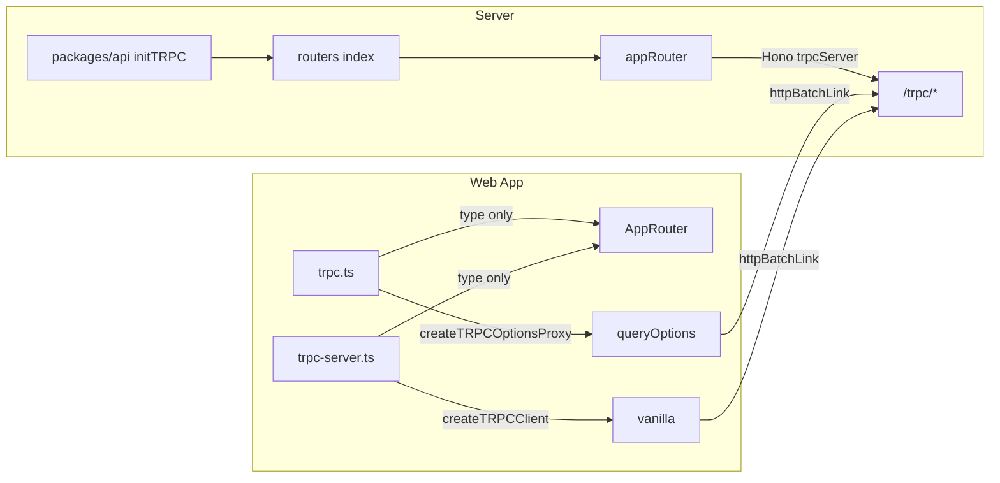

# tRPC Usage Audit and Fixes

## Audit summary (vs. provided docs)

### What already matches the docs

- **Single init**: tRPC is initialized exactly once in [packages/api/src/index.ts](packages/api/src/index.ts) with `initTRPC.context<Context>().create()` and exported helpers (`router`, `publicProcedure`). No duplicate inits.
- **Export type only on client**: Web app uses `import type { AppRouter } from "server/routers/index"` in [apps/web/src/utils/trpc.ts](apps/web/src/utils/trpc.ts) and [apps/web/src/utils/trpc-server.ts](apps/web/src/utils/trpc-server.ts). No router value is imported on the client.
- **Procedures**: Queries use `.query()`, mutations use `.mutation()`, inputs use `.input(z...)`, resolvers use `({ input })` or `({ ctx, input })` consistently across [apps/server/src/routers/](apps/server/src/routers/) (auth, clob, data, events, markets, bridge).
- **Vanilla client usage**: `serverTrpc` and `trpcClient` use `.query(...)` and `.mutate(...)` with the correct input shapes (e.g. `serverTrpc.events.getBySlug.query({ slug })`, `trpcClient.auth.login.mutate({ didToken, walletAddress })`).
- **Server adapter**: Hono mounts tRPC at `/trpc/*` with `trpcServer({ router: appRouter, createContext })` in [apps/server/src/index.ts](apps/server/src/index.ts).
- **Return shapes**: `data.positions` returns `Position[]`, `events.search` returns `SearchResult` with `.events`; client usage (e.g. `r.events`, `positions.length`) matches.

### Items to verify or fix

1. **Test context for createCaller**
  [apps/server/src/**tests**/integration/endpoints.test.ts](apps/server/src/__tests__/integration/endpoints.test.ts) and [apps/server/src/**tests**/manual-test.ts](apps/server/src/__tests__/manual-test.ts) use `appRouter.createCaller({})`. The docs don’t show `createCaller`; in tRPC v11 the router has a `.createCaller(ctx)` method. Passing `{}` does not satisfy your full `Context` type (`honoContext`, `session`).  
  - **Action**: Keep as-is for current tests (they only hit public procedures). Document that tests for protected procedures must pass a proper context (e.g. `{ honoContext: mockHonoContext, session: { userId: '...' } }`), or add a small helper that builds a valid test context.
2. **React client API (createTRPCOptionsProxy)**
  Verified against [TanStack React Query](https://trpc.io/docs/client/tanstack-react-query/setup) and [usage](https://trpc.io/docs/client/tanstack-react-query/usage) docs. We use the **recommended** client: `createTRPCOptionsProxy` with singleton `queryClient` + `trpcClient` (“3c. Set up without React context”) and `useQuery(trpc.path.queryOptions(...))` throughout. No `createTRPCContext`/`TRPCProvider`/`useTRPC`; we import `trpc` directly. Mutations use `trpcClient.x.mutate()` in auth/onboarding (vanilla); optional to use `useMutation(trpc.x.mutationOptions())` in components.  
  - **Action**: None required. Optionally add a one-line comment in [apps/web/src/utils/trpc.ts](apps/web/src/utils/trpc.ts) that the setup follows tRPC TanStack React Query “3c – without React context.”
3. **Optional input and `.query()` / `.mutate()` usage**
  Some procedures use `.input(z.object({...}).optional())` (e.g. `data.trades`, `events.list`). Call sites pass objects or omit optional fields; no mismatch found.  
  - **Action**: No change; optionally add a one-line comment in one router that optional input is intentional for that procedure.
4. **Profile page `positions` usage**
  [apps/web/src/app/profile/[address]/page.tsx](apps/web/src/app/profile/[address]/page.tsx) uses `serverTrpc.data.positions.query({ user: address }).catch(() => [])`. `data.positions` returns `Position[]`, so the fallback `[]` is correct.  
  - **Action**: No change.
5. **CLOB price history input**
  [apps/server/src/routers/clob.ts](apps/server/src/routers/clob.ts) defines `getPricesHistory` with `priceHistoryParamsSchema` (market, startTs, endTs, fidelity, interval). [apps/web/src/components/trading/price-chart.tsx](apps/web/src/components/trading/price-chart.tsx) passes `{ market: tokenId, startTs, interval }`. Schema allows optional `interval` with enum `["max", "1w", "1d", "6h", "1h"]`.  
  - **Action**: Confirm the value passed as `interval` from the chart (e.g. from `getStartTimestamp`/dropdown) is one of those enum values; if not, align client with the schema or extend the schema once and document.
6. **Server-side calls: don’t call procedures from within procedures**
  The [Server Side Calls](https://trpc.io/docs/server/server-side-calls) doc says not to use `createCaller` inside another procedure (it re-runs context, middlewares, validation). Extract shared logic into a plain function and call it from both procedures.  
  - **Action**: When adding or refactoring procedures, avoid using a caller inside procedure handlers; keep shared logic in separate functions.

### Out of scope for this audit

- Non-JSON content types (FormData / File): not used in your procedures; no change.
- Subscriptions: not used; no change.
- Output validators (`.output(z...)`): not required by the snippets you sent; optional follow-up.

---

## Merging Routers (additional docs)

- **Current pattern**: [apps/server/src/routers/index.ts](apps/server/src/routers/index.ts) uses **merging with child routers**: `router({ healthCheck: ..., auth: authRouter, bridge: bridgeRouter, ... })`. Each sub-router is under its own namespace (`auth.*`, `clob.*`, `data.*`, etc.). This matches the docs’ recommended pattern.
- **Inline sub-routers**: Not used; we use explicit `router()` in each file. No change.
- **mergeRouters**: We do not use `t.mergeRouters()` (flat namespace). Not needed; namespaced routes are clearer.
- **Lazy loading**: We do not use `lazy(() => import('./router'))`. Optional future improvement if cold starts become an issue (e.g. serverless).

**Action**: None required. Optionally add a one-line comment in `routers/index.ts` that the app uses “child router merging” per tRPC docs.

---

## Context (additional docs)

- **Context type**: [packages/api/src/context.ts](packages/api/src/context.ts) defines `createContext(opts: CreateContextOptions)` and `Context = Awaited<ReturnType<typeof createContext>>`. The init uses `initTRPC.context<Context>().create()` in [packages/api/src/index.ts](packages/api/src/index.ts). Matches “define context type during initialization.”
- **Creating context**: The Hono adapter in [apps/server/src/index.ts](apps/server/src/index.ts) passes `createContext` to `trpcServer({ router, createContext: (_opts, context) => createContext({ context }) })`. Context is created per request; batched requests share context per the adapter. Matches “createContext() must be passed to the handler.”
- **Session in context**: Our context returns `{ honoContext, session: null }`. The **middleware** (protectedProcedure) populates `session` after verifying the Bearer token. So “session” is request-dependent and lives in middleware, not in the initial context. This is valid; the docs’ example puts session in createContext (e.g. from getSession(req)), we do it in middleware (from Authorization header). No change required.
- **Inner and outer context**: The docs recommend splitting “inner” context (e.g. db, always available) and “outer” context (request-dependent, e.g. session) so that **testing** and **server-side helpers** can call `createContextInner({ session: mockSession })` without a real `req`/`res`. We currently have a single `createContext` that requires Hono context. For tests, we use `appRouter.createCaller({})`, which does not satisfy the full `Context` type (missing `honoContext`).  
  - **Action**: Consider adding `createContextInner(opts?: { honoContext?: HonoContext; session?: AuthSession | null })` in [packages/api/src/context.ts](packages/api/src/context.ts), inferring `Context` from it, and having `createContext` (used by Hono) call `createContextInner` with the request-derived session (after parsing auth in middleware or in createContext). Then tests and createCaller can use `createContextInner({ session: { userId, issuer } })` for protected procedure tests. This is an optional improvement; current tests only hit public procedures.
- **Batch size limiting**: Not implemented. Add only if you need to reject batches over a size limit (e.g. `if (opts.info.calls.length > MAX_BATCH_SIZE) throw new TRPCError({ code: 'TOO_MANY_REQUESTS' })`). No change unless required.

---

## Middlewares (additional docs)

- **Current pattern**: [packages/api/src/middleware/auth.ts](packages/api/src/middleware/auth.ts) uses `t.middleware(async ({ ctx, next }) => { ... return next({ ctx: { ...ctx, session } }); })` and `protectedProcedure = t.procedure.use(authMiddleware)`. This is the standard “context extension” pattern: the middleware adds/overrides `session` on the context, and procedures receive the new context. Matches the docs.
- **Reusable base procedures**: We export `publicProcedure` and `protectedProcedure` (from middleware). No `.pipe()` or `.concat()` or `experimental_standaloneMiddleware` in use. Not needed for current scope.

**Action**: None required.

---

## Procedures (additional docs)

Audit against [Define Procedures](https://trpc.io/docs/server/procedures).

- **Procedure types**: We use **queries** (`.query()`) for reads and **mutations** (`.mutation()`) for writes; no subscriptions. Matches the doc: “Query – fetch data; Mutation – send data.”
- **Builder pattern**: Procedures are built with `.input(z...).query(...)` or `.input(z...).mutation(...)`; some have no input (e.g. `healthCheck: publicProcedure.query(() => "OK")`). Resolvers receive `(opts)` and use `opts.input`, `opts.ctx` as in the doc. Immutable builder pattern is respected.
- **Reusable base procedures**: We export `publicProcedure` (= `t.procedure`) and `protectedProcedure` (= `t.procedure.use(authMiddleware)`). This matches the doc’s “rename and export t.procedure as publicProcedure” and “create other named procedures for specific use cases” (e.g. authedProcedure, organizationProcedure). We have two bases: public and protected (session required).
- **Context extension in base procedure**: `protectedProcedure` uses middleware that throws `UNAUTHORIZED` when `!ctx.session` and returns `next({ ctx: { ...ctx, session } })`, so downstream resolvers get non-null `ctx.session`. Same pattern as the doc’s `authedProcedure` and `organizationProcedure`.
- **Resolver opts**: We use `({ input })`, `({ ctx, input })`, or `({ ctx })` depending on whether the procedure needs session and/or input. Matches the doc’s `(opts) =>` / `async (opts) =>` with destructuring.
- **inferProcedureBuilderResolverOptions**: Not used. The doc recommends it for extracting handler logic into a shared function (e.g. `getMembersOfOrganization(opts)`). Optional: use when refactoring repeated logic across procedures that share a base (e.g. `protectedProcedure`).
- **Subscriptions**: Doc links to subscriptions guide; we don’t use subscriptions. No change.

**Summary**: Procedure usage matches the doc (query/mutation, base procedures, middleware-based protectedProcedure, input + opts destructuring). No changes. Optional: use `inferProcedureBuilderResolverOptions` when extracting shared resolver logic.

---

## Server Side Calls (additional docs)

- **Current usage**: [apps/server/src/**tests**/integration/endpoints.test.ts](apps/server/src/__tests__/integration/endpoints.test.ts) and [apps/server/src/**tests**/manual-test.ts](apps/server/src/__tests__/manual-test.ts) use `**appRouter.createCaller({})**`. The docs support two patterns: (1) `createCallerFactory(router)` then `createCaller(ctx)`, or (2) `router.createCaller(ctx)` directly. We use (2), which is valid. Passing `{}` does not satisfy our full `Context` (`honoContext`, `session`); it works only for **public** procedures because they don’t read `session`, and our middleware isn’t run with an empty context for protected procedures (would throw UNAUTHORIZED).
- **Don’t call procedures from within procedures**: The docs warn that using a caller inside another procedure re-runs context creation, all middlewares, and input validation. Instead, extract shared logic into a plain function and call it from both procedures. **Action**: When adding or refactoring procedures, avoid `createCaller`/caller usage inside procedure handlers; extract shared logic and call it directly.
- **Recommended test pattern**: The doc’s integration test example uses `createContextInner({})` and a **exported** `createCaller` built via `createCallerFactory(appRouter)`: `const ctx = await createContextInner({}); const caller = createCaller(ctx);`. That gives a typed context and a single place to create callers. We currently don’t export `createCaller` from the app router and don’t have `createContextInner`; tests use `appRouter.createCaller({})` inline.
- **Protected procedure tests**: The “Context with middleware” example shows that calling a protected procedure with `createCaller({})` fails; you must pass a context that satisfies the middleware (e.g. `createCaller({ user: { id: 'KATT' } })`). For us, that means `session: { userId, issuer }` (and optionally a mock `honoContext` if any procedure reads it). **Action**: Align with task #2 and #4: document or add `createContextInner` and use it in tests; for protected procedure tests, pass `createContextInner({ session: { userId, issuer } })` (or equivalent) into `createCaller(ctx)`.
- **createCallerFactory**: The docs recommend `const createCaller = createCallerFactory(appRouter)` and exporting `createCaller` so server-side code and tests can do `createCaller(ctx)`. **Action (optional)**: In [apps/server/src/routers/index.ts](apps/server/src/routers/index.ts) (or a shared server entry), add `export const createCaller = t.createCallerFactory(appRouter)` (requires exporting `t` from `@doji/api` or creating the factory where `appRouter` and `t` are available). Then use `createCaller(ctx)` in tests and any server-side call sites instead of `appRouter.createCaller(ctx)`. This is optional if we keep using `appRouter.createCaller(ctx)` and ensure `ctx` is valid.
- **Error handling**: `createCallerFactory` and `createCaller` can accept an `onError` option (e.g. second argument to `createCaller(ctx, { onError })`). No change unless we need custom error handling for server-side calls.

**Summary**: Keep “don’t call procedures from within procedures”; use a valid context for protected procedure tests; optionally adopt `createCallerFactory` + exported `createCaller` and `createContextInner` for consistency with the doc’s examples.

---

## Error Handling and Error Formatting (additional docs)

- **Throwing errors**: Routers use `TRPCError` correctly: [packages/api/src/middleware/auth.ts](packages/api/src/middleware/auth.ts), [apps/server/src/routers/auth.ts](apps/server/src/routers/auth.ts), and [apps/server/src/routers/clob.ts](apps/server/src/routers/clob.ts) throw `new TRPCError({ code, message })` with codes such as `UNAUTHORIZED`, `NOT_FOUND`, `INTERNAL_SERVER_ERROR`, `BAD_REQUEST`, `PRECONDITION_FAILED`. Optional `cause` is not currently used; consider passing the original error as `cause` for `INTERNAL_SERVER_ERROR` to retain stack traces in development. Matches the [Error Handling](https://trpc.io/docs/server/error-handling) doc.
- **Error codes**: Our usage aligns with the doc's code to HTTP mapping (e.g. UNAUTHORIZED to 401, NOT_FOUND to 404). No change.
- **getHTTPStatusCodeFromError**: Not used. The doc exposes this from `@trpc/server/http` to map `TRPCError` to HTTP status. **Action**: Use only if we add custom HTTP routes or server-side call sites that catch tRPC errors and need to set `res.status(httpCode)`. No change for current setup.
- **Server-side onError**: The doc says all procedure errors go through the handler's `onError` before being sent to the client. We mount tRPC via @hono/trpc-server in [apps/server/src/index.ts](apps/server/src/index.ts) with `trpcServer({ router, createContext })` only. **Action**: If the Hono tRPC adapter supports an `onError` option, add it (e.g. log errors, send INTERNAL_SERVER_ERROR to bug reporting). Optional.
- **Client-side error handling**: [apps/web/src/utils/trpc.ts](apps/web/src/utils/trpc.ts) uses React Query's `QueryCache.onError` to show a toast and retry; errors still have the tRPC shape. No change required.
- **Error formatting**: [Error Formatting](https://trpc.io/docs/server/error-formatting) allows customizing the error shape via `initTRPC.context<Context>().create({ errorFormatter(opts) { ... } })`. We use `create()` with no options in [packages/api/src/index.ts](packages/api/src/index.ts), so the default shape is used. **Action (optional)**: To expose Zod validation details (e.g. `error.cause instanceof ZodError` → `zodError` in `shape.data`), add an `errorFormatter` so the client can use `mutation.error?.data?.zodError` for field-level messages. Only if we want richer validation UX.

**Summary**: Throwing `TRPCError` is correct. Optionally: add `cause` for internal errors; add server `onError` if the adapter supports it; add `errorFormatter` for Zod validation details on the client; use `getHTTPStatusCodeFromError` only in custom non-tRPC endpoints.

---

## Data Transformers (additional docs)

- **Current state**: No transformer is used. [packages/api/src/index.ts](packages/api/src/index.ts) calls `initTRPC.context<Context>().create()` with no `transformer`. [apps/web/src/utils/trpc.ts](apps/web/src/utils/trpc.ts) and [apps/web/src/utils/trpc-server.ts](apps/web/src/utils/trpc-server.ts) use `httpBatchLink` without a `transformer`. Default JSON serialization is used; types like `Date`/`Map`/`Set` would be serialized to JSON-friendly forms (e.g. Date to string) and not rehydrated on the client.
- **When to add**: Per [Data Transformers](https://trpc.io/docs/server/data-transformers), add a transformer (e.g. [superjson](https://github.com/blitz-js/superjson)) if procedures return or accept `Date`, `Map`, `Set`, `BigInt`, or other non-JSON types and you want them to round-trip correctly. The same transformer must be set on both server (`initTRPC.create({ transformer: superjson })`) and client (e.g. `httpBatchLink({ url, transformer: superjson })`). If using only JSON-serializable data, no change is required.
- **Action**: None unless we introduce non-JSON types over the wire. If we do, add superjson (or devalue) to server init and to all client links (including serverTrpc if used with such types).

---

## Metadata (additional docs)

- **Current state**: We do not use procedure metadata. [packages/api/src/index.ts](packages/api/src/index.ts) uses `initTRPC.context<Context>().create()` with no `.meta<Meta>()`. Auth is enforced by a dedicated `protectedProcedure` (middleware that always checks session), not by per-procedure `meta({ authRequired: true })`.
- **When to add**: [Metadata](https://trpc.io/docs/server/metadata) is useful for per-route options (e.g. `authRequired`, `role`) so a single procedure base can branch in middleware via `opts.meta`. We already have separate `publicProcedure` and `protectedProcedure`; metadata would help if we later need multiple auth levels (e.g. `adminProcedure`) or integration with [trpc-openapi](https://github.com/jlalmes/trpc-openapi) for REST-compatible endpoints.
- **Action**: None. Optional later: add `initTRPC.context<Context>().meta<Meta>().create({ defaultMeta: { authRequired: false } })` and use `.meta({ authRequired: true })` on protected procedures if we want to consolidate into one procedure type with meta-driven auth.

---

## Response Caching (additional docs)

- **Current state**: We do not use tRPC-level response caching. No `responseMeta` on the server (Hono tRPC adapter may or may not support it), no cache headers set in tRPC handlers, and no `splitLink` on the client to separate public vs private requests. Caching is handled elsewhere (e.g. Polymarket API client cache in server lib) if at all.
- **When to add**: [Response Caching](https://trpc.io/docs/server/caching) is relevant when using SSR or edge caching (e.g. Vercel): use `responseMeta` to set `cache-control` (e.g. `s-maxage`, `stale-while-revalidate`) for public queries, and avoid caching when auth headers/cookies are present or when paths include user-specific data. The doc warns that batching can mix public and private calls, so either set cache headers only when safe or use `splitLink` to route public vs private.
- **Action**: None for now. If we add edge/SSR caching later: (1) confirm whether @hono/trpc-server supports `responseMeta` or equivalent; (2) set cache headers only for public, non-batched or split links; (3) do not cache requests that include auth or personal data.

---

## Subscriptions (additional docs)

- **Current state**: We do not use tRPC subscriptions. No `.subscription()` procedures, no `httpSubscriptionLink` or `wsLink` on the client, and no `tracked()` usage. Real-time updates (e.g. orderbook, price ticks) are handled via a separate WebSocket layer (e.g. market channel) outside tRPC, not via tRPC’s subscription procedures.
- **When to add**: Per [Subscriptions](https://trpc.io/docs/server/subscriptions), use tRPC subscriptions when you need server-push over a persistent connection with automatic reconnect and optional resume via `lastEventId`. Transport options: **SSE** ([httpSubscriptionLink](https://trpc.io/docs/client/links/httpSubscriptionLink), simpler) or **WebSockets** ([WebSockets page](https://trpc.io/docs/server/websockets)). Server: add `publicProcedure.subscription(async function* (opts) { ... yield data; })`, use `opts.signal` for abort/cleanup, and use `tracked(id, data)` when you want the client to resume from `lastEventId` after reconnect. Client: add the subscription link and use the subscription (e.g. `trpc.onPostAdd.subscribe()` or framework-specific hook). Use `try...finally` in the generator for cleanup when the subscription stops.
- **Reference**: Doc links to [SSE example](https://github.com/trpc/examples-next-sse-chat) and [WebSockets example](https://github.com/trpc/examples-next-prisma-starter-websockets). Output validation for async iterators is possible via a custom Zod helper (e.g. `zAsyncIterable`) if needed.
- **Action**: None. If we later move real-time flows into tRPC subscriptions, add procedures with `.subscription()`, choose SSE or WebSockets, wire the matching client link, and use `tracked()` for reconnect/resume where appropriate.

---

## TanStack React Query (client) (additional docs)

- **Recommended client**: The [TanStack React Query](https://trpc.io/docs/client/tanstack-react-query/setup) integration is the recommended (non-classic) client: it provides `queryOptions`, `mutationOptions`, `queryKey`, `queryFilter`, etc., and works with TanStack Query hooks directly. We use this client.
- **Setup (3c – without React context)**: [apps/web/src/utils/trpc.ts](apps/web/src/utils/trpc.ts) matches the doc’s **“3c. Set up without React context”** pattern: singleton `QueryClient`, `createTRPCClient<AppRouter>` with `httpBatchLink`, and `createTRPCOptionsProxy<AppRouter>({ client: trpcClient, queryClient })`. We use `import type { AppRouter }` (type-only). We do not use `createTRPCContext` / `TRPCProvider` / `useTRPC`; we import `trpc` directly. [apps/web/src/components/providers.tsx](apps/web/src/components/providers.tsx) wraps the app in `QueryClientProvider` only. This matches the doc’s 3c example.
- **Usage – Queries**: Components use `useQuery(trpc.path.to.query.queryOptions({ ... }))` (e.g. [apps/web/src/components/event/event-list.tsx](apps/web/src/components/event/event-list.tsx), [apps/web/src/app/portfolio/page.tsx](apps/web/src/app/portfolio/page.tsx), portfolio and trading components). This is the recommended pattern. We do not use the classic `trpc.x.useQuery()`.
- **Usage – Mutations**: Auth and onboarding call `trpcClient.auth.login.mutate()`, `trpcClient.auth.registerSafe.mutate()`, etc. (vanilla client) from [apps/web/src/lib/magic/auth.ts](apps/web/src/lib/magic/auth.ts) and [apps/web/src/components/onboarding/safe-onboarding.tsx](apps/web/src/components/onboarding/safe-onboarding.tsx). The doc also supports `useMutation(trpc.path.to.mutation.mutationOptions())` in components. Both are valid; vanilla is fine for imperative one-off calls (e.g. login). Optional: use `useMutation(trpc.auth.login.mutationOptions())` in client components if we want cache invalidation or loading state via the hook.
- **Invalidation / queryKey / queryFilter**: We do not currently use `queryClient.invalidateQueries(trpc.x.queryFilter(...))` or `trpc.x.queryKey()` in the codebase. The doc recommends these for type-safe invalidation. Optional: use when we need to invalidate or refetch after mutations.
- **RSC / Server Components**: We use a **vanilla** tRPC client ([apps/web/src/utils/trpc-server.ts](apps/web/src/utils/trpc-server.ts), `serverTrpc`) in server components and RSC, calling `serverTrpc.x.query()` directly. We do not use the [RSC guide](https://trpc.io/docs/client/tanstack-react-query/server-components) pattern of `createTRPCOptionsProxy` with `router` + `getQueryClient` + `prefetchQuery` + `HydrationBoundary`. Our approach is simpler (no prefetch/hydration from server to client); data is either fetched on the server and passed as props or fetched on the client with `useQuery`. No change required unless we want “render as you fetch” with hydration.
- **Migration**: We are already on the new API (queryOptions, no classic hooks). No migration from the classic React client is needed.

**Summary**: We are aligned with the recommended TanStack React Query tRPC client (3c setup, queryOptions + useQuery). Task #1 can be closed as “verified; matches docs.” Optional: use `mutationOptions` + `useMutation` and `queryFilter`/`queryKey` where they would simplify invalidation or loading state.

---

## FAQ, HTTP RPC spec, and v11 migration (additional docs)

- **FAQ – “Getting `any` everywhere”**: [FAQ](https://trpc.io/docs/faq) recommends: no type errors, `"strict": true` in tsconfig, matching `@trpc/*` versions, TypeScript >=5.7.2, and editor using the project’s TypeScript. We have `strict: true` in [packages/config/tsconfig.base.json](packages/config/tsconfig.base.json) and app tsconfigs; [.vscode/settings.json](.vscode/settings.json) has `typescript.tsdk: "node_modules/typescript/lib"`. Optional: add `"typescript.enablePromptUseWorkspaceTsdk": true` so the editor prompts to use the workspace TS version. We use `catalog:` for `@trpc/client` and `@trpc/server` in web/api/server, so versions are consistent across the monorepo.
- **FAQ – Monorepo**: Same `@trpc/*` versions and strict mode across packages; client imports `AppRouter` type from server (path alias `server/routers/index`). No dedicated server/client tsconfig path mismatch observed. We follow the FAQ’s monorepo checklist.
- **FAQ – Middleware changing context**: We use [context extension](https://trpc.io/docs/server/middlewares#context-extension) via `protectedProcedure` (middleware adds `session` to context). No change.
- **FAQ – Middleware on full router**: We use base procedures (`publicProcedure`, `protectedProcedure`) instead of per-router middleware. No change.
- **HTTP RPC spec**: [RPC spec](https://trpc.io/docs/rpc): GET = `.query()`, POST = `.mutation()`; subscriptions not over HTTP. We use queries and mutations only. Nested paths (e.g. `auth.login`, `data.positions`) map to `/trpc/auth.login`, etc. We use `httpBatchLink`; batching is per the spec (comma-separated path, `batch=1`, `input` as Record). Error codes and HTTP status mapping already covered in the Error Handling section. No `methodOverride` in use; add only if we hit URL length limits.
- **v10 → v11 migration**: We are on the v11-style client (TanStack React Query integration, `createTRPCOptionsProxy`, queryOptions). [Migration guide](https://trpc.io/docs/migrate-from-v10-to-v11): transformers (if any) go on links; we don’t use transformers. React Query v5 is required; we use `@tanstack/react-query` v5. TypeScript >=5.7.2 required; we use catalog TypeScript. No migration steps needed if already on v11. For reference: use `inferProcedureInput` (not deprecated `inferHandlerInput`); `TRPCProcedureOptions` from `@trpc/client` if needed.

**Summary**: We meet FAQ and RPC spec requirements (strict, tsdk, consistent @trpc, batching, error codes). Optional: add `typescript.enablePromptUseWorkspaceTsdk` in .vscode/settings.json. v11 migration N/A if already on v11.

---

## Client Links (additional docs)

Audit of [Links Overview](https://trpc.io/docs/client/links), [httpLink](https://trpc.io/docs/client/links/httpLink), [httpBatchLink](https://trpc.io/docs/client/links/httpBatchLink), [httpBatchStreamLink](https://trpc.io/docs/client/links/httpBatchStreamLink), [httpSubscriptionLink](https://trpc.io/docs/client/links/httpSubscriptionLink), [localLink](https://trpc.io/docs/client/links/localLink), [wsLink](https://trpc.io/docs/client/links/wsLink), [splitLink](https://trpc.io/docs/client/links/splitLink), [loggerLink](https://trpc.io/docs/client/links/loggerLink), [retryLink](https://trpc.io/docs/client/links/retryLink), and [Custom header](https://trpc.io/docs/client/headers).

- **Link chain**: [apps/web/src/utils/trpc.ts](apps/web/src/utils/trpc.ts) and [apps/web/src/utils/trpc-server.ts](apps/web/src/utils/trpc-server.ts) use a single link: `httpBatchLink({ url })`. The chain has exactly one link, which is a **terminating link** (httpBatchLink sends the request). Order is correct; no non-terminating links before it. Per the docs, the chain runs request → link → server and response → link (reverse). We have no custom links and no side-effect links (e.g. logger).
- **Terminating link**: [httpBatchLink](https://trpc.io/docs/client/links/httpBatchLink) is the recommended terminating link. We use it in both client files. No change.
- **Managing context**: Links can read/modify `op.context`; the client can pass context per operation (e.g. `useQuery(undefined, { trpc: { context: { skipBatch: true } } })`). We do not use `op.context` or per-operation context. If we ever need to disable batching for specific requests (e.g. very long URLs or cache-control needs), we would add [splitLink](https://trpc.io/docs/client/links/splitLink) with `condition: (op) => Boolean(op.context.skipBatch)`, `true: httpLink(...)`, `false: httpBatchLink(...)`. No change for now.
- **httpLink**: We use httpBatchLink, not httpLink. httpLink sends one operation per request (no batching). Use only if we disable batching (server `allowBatching: false` or splitLink for selected requests).
- **httpBatchLink options**: We pass only `url`. Available options we don’t use: `transformer` (add if we add superjson on server); `headers` or `headers(() => ...)` (add if we need Authorization or other headers, e.g. [Custom header](https://trpc.io/docs/client/headers)); `maxURLLength` (add if we see 413/414/404 from long batch URLs; doc suggests e.g. 2083 or `methodOverride: 'POST'`); `maxItems` (cap batch size); `fetch` / `AbortController` (ponyfills). **Action**: None unless we need auth headers, transformers, or hit URL length limits.
- **httpBatchStreamLink**: Not used. Use only if we want to stream batch responses (e.g. long-running queries, async generators in procedures). Doc notes that streaming doesn’t support setting response headers after the stream starts; use httpBatchLink if we need to set cookies/headers from procedures. No change.
- **httpSubscriptionLink**: Not used (no tRPC subscriptions). If we add subscriptions later, we’d use [splitLink](https://trpc.io/docs/client/links/splitLink) with `condition: (op) => op.type === 'subscription'`, `true: httpSubscriptionLink(...)`, `false: httpBatchLink(...)`. SSE requires server `sse` config (e.g. ping, reconnectAfterInactivityMs). No change.
- **localLink** (`unstable_localLink`): Not used. For in-process calls without HTTP (e.g. server-side same process). We use HTTP to the server app. No change.
- **wsLink**: Not used. Alternative to httpSubscriptionLink for subscriptions. No change.
- **splitLink**: Not used. Use for: (1) subscriptions vs queries/mutations (condition on `op.type`), or (2) disable batching per request (condition on `op.context.skipBatch`). No change.
- **loggerLink**: Not used. Doc example: `loggerLink({ enabled: (opts) => process.env.NODE_ENV === 'development' && typeof window !== 'undefined' || (opts.direction === 'down' && opts.result instanceof Error) })` for dev logs and production errors. **Action**: Optional; add before httpBatchLink in [apps/web/src/utils/trpc.ts](apps/web/src/utils/trpc.ts) if we want request/response logging in dev.
- **retryLink**: Not used. [Retry Link](https://trpc.io/docs/client/links/retryLink) says: “If you use @trpc/react-query you will generally **not** need this link” because React Query’s useQuery/useMutation have built-in retry. We use TanStack React Query; no retryLink needed. Add only for vanilla client retry behavior (e.g. serverTrpc) if desired.
- **Custom headers**: We do not pass `headers` to httpBatchLink. Per [Custom header](https://trpc.io/docs/client/headers), we can set `headers: () => ({ Authorization: token })` (or static object) if procedures require auth; the Hono adapter would need to read the same header in createContext/middleware. Our auth is currently via procedure input (e.g. `didToken`, `walletAddress`) or session established elsewhere; if we move to Bearer tokens on the client, add `headers` to httpBatchLink and read in server context. No change for current setup.

**Summary**: Single-link chain with httpBatchLink (recommended terminating link); no transformer, headers, logger, retry, or split. Aligned with docs. Optional: add loggerLink for dev; add headers/maxURLLength/transformer only when needed (auth, long URLs, non-JSON types).

---

## @hono/trpc-server adapter (additional docs)

Audit against the [@hono/trpc-server](https://github.com/honojs/middleware/tree/main/packages/trpc-server) README (tRPC server middleware for Hono).

- **Mount**: [apps/server/src/index.ts](apps/server/src/index.ts) uses `app.use('/trpc/*', trpcServer({ router: appRouter, createContext: (_opts, context) => createContext({ context }) }))`. Matches the README pattern: path `/trpc/*` and `trpcServer` with `router` and optional `createContext`.
- **createContext**: The adapter calls `createContext(_opts, c)` where `c` is the Hono context. We pass it through: `createContext: (_opts, context) => createContext({ context })`, and [packages/api/src/context.ts](packages/api/src/context.ts) returns `{ honoContext: opts.context, session: null }`. So tRPC `ctx` gets our typed context (including `honoContext` for middleware to read headers). Matches the README’s “optional createContext that receives the hono context as 2nd argument.”
- **Context type**: Our tRPC init uses `initTRPC.context<Context>().create()` where `Context` is `{ honoContext, session }`, not the raw Hono env type. The README’s “access c.env from ctx” example uses `context<HonoContext>()` and no createContext (so the adapter likely passes Hono context as ctx). We use a custom context shape and createContext; our procedures receive `ctx.honoContext` and `ctx.session`. No change.
- **Custom endpoint**: We mount at `/trpc/*` and the client uses `${serverUrl}/trpc`. The README says: for custom paths (e.g. `/api/trpc/*`), set `endpoint: '/api/trpc'` so tRPC can extract procedure paths. We don’t use a prefix; no `endpoint` option needed. If we later move to `/api/trpc/*`, add `endpoint: '/api/trpc'` to `trpcServer()`.

**Summary**: Our use of @hono/trpc-server matches the README (mount path, router, createContext with Hono context as 2nd arg). No changes. Add `endpoint` only if we change the mount path (e.g. to `/api/trpc/*`).

---

## Recommended fix list (concise)

| #   | Task                                                                                                                                | Location                                                                                                                                                               | Effort |
| --- | ----------------------------------------------------------------------------------------------------------------------------------- | ---------------------------------------------------------------------------------------------------------------------------------------------------------------------- | ------ |
| 1   | (Done) TanStack React Query setup verified; matches doc 3c + queryOptions. Optional: comment in trpc.ts                             | [apps/web/src/utils/trpc.ts](apps/web/src/utils/trpc.ts)                                                                                                               | Tiny   |
| 2   | Document or add test context helper for createCaller when testing protected procedures                                              | [apps/server/src/**tests**/](apps/server/src/__tests__/) or [packages/api](packages/api)                                                                               | Small  |
| 3   | Confirm price-chart `interval` values match clob `priceHistoryIntervalSchema`                                                       | [apps/web/src/components/trading/price-chart.tsx](apps/web/src/components/trading/price-chart.tsx), [apps/server/src/routers/clob.ts](apps/server/src/routers/clob.ts) | Tiny   |
| 4   | (Optional) Add createContextInner for tests/server-side helpers; infer Context from it                                              | [packages/api/src/context.ts](packages/api/src/context.ts)                                                                                                             | Small  |
| 5   | (Optional) Comment in routers/index.ts that app uses child-router merging per tRPC docs                                             | [apps/server/src/routers/index.ts](apps/server/src/routers/index.ts)                                                                                                   | Tiny   |
| 6   | (Optional) Export createCaller via createCallerFactory(appRouter); use in tests/server-side                                         | [apps/server/src/routers/index.ts](apps/server/src/routers/index.ts) (or where appRouter + t are available)                                                            | Small  |
| 7   | (Optional) Error handling/formatting: add cause for INTERNAL_SERVER_ERROR; errorFormatter for zodError; onError if adapter supports | [packages/api/src/index.ts](packages/api/src/index.ts), [apps/server/src/index.ts](apps/server/src/index.ts)                                                           | Small  |

No structural or breaking changes to routers or procedure signatures are required. The codebase is aligned with the concepts, quickstart, merging-routers, context, middlewares, server-side-calls, and error-handling/formatting docs (using `router.createCaller(ctx)`; adopt `createCallerFactory` + `createContextInner` and optional errorFormatter/onError/cause for consistency).

---

## Diagram (current tRPC flow)

