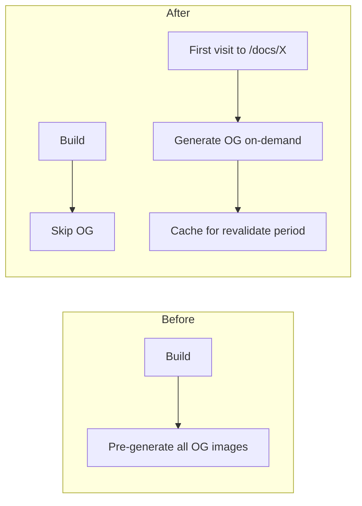

# Vercel Build Time Optimization Plan

## Context

Doji differs from the blog author's setup: the web app uses `force-dynamic` (SSR) for market/event pages, so no content is pre-built. Images are remote (Polymarket S3). The main build-time opportunities are (1) Turbo Remote Caching, (2) docs app OG pre-generation, and (3) optional ISR/standalone improvements.

**Turbopack:** Next.js 16 uses Turbopack by default for both `next dev` and `next build`. No migration needed. Optional: enable `turbopackFileSystemCacheForBuild` (experimental) for incremental build caching.

---

## Diagnosis: Why Is the Build Slow? (Vercel Community)

Before optimizing, identify the bottleneck ([source](https://community.vercel.com/t/how-can-i-optimize-build-times-for-a-large-next-js-app-on-vercel/16802/4)):


| Symptom                            | Likely cause                          | Apply                                                                  |
| ---------------------------------- | ------------------------------------- | ---------------------------------------------------------------------- |
| Each page takes long               | Slow data fetches, request waterfalls | Phase 2 (OG), Phase 5.4 (unstable_cache), parallelize with Promise.all |
| Lots of pages                      | Pre-building too much at deploy       | Phase 2.1, Phase 3.1 (defer generation)                                |
| Dependencies rebuild every deploy  | No remote cache                       | Phase 1.1 (Turbo Remote Caching)                                       |
| Deployment fails / API rate limits | Per-file upload in prebuilt deploy    | Phase 0.1 (`--archive=tgz`; prebuilt only)                             |


Doji: Web uses `force-dynamic` (no page pre-build). Market/event pages already use `Promise.all` for parallel fetches. Docs app pre-builds all doc + OG pages. Deploys via Vercel Git integration (not prebuilt), so Phase 0.1 does not apply. **Region:** Montréal, Canada (East) — `yul1` for API and frontend. Main wins: Phase 1.1, Phase 2, Phase 3.1 (docs).

---

## Phase 0: Vercel Platform Settings (Dashboard)

Platform-level options from [Vercel Managing Builds](https://vercel.com/docs/builds/managing-builds). No code changes; configure in Dashboard.


| Situation                        | Solution                                                                                                       | Where                                  |
| -------------------------------- | -------------------------------------------------------------------------------------------------------------- | -------------------------------------- |
| Builds slow or OOM               | [Turbo/Enhanced build machines](https://vercel.com/docs/builds/managing-builds#larger-build-machines) (Pro)    | Team or Project → Build and Deployment |
| Builds frequently queued         | [On-Demand Concurrent Builds](https://vercel.com/docs/builds/managing-builds#on-demand-concurrent-builds)      | Project → Build and Deployment         |
| Production stuck behind previews | [Prioritize Production Builds](https://vercel.com/docs/builds/managing-builds#prioritize-production-builds)    | Project → Build and Deployment         |
| Identify bottlenecks             | [Build Diagnostics](https://vercel.com/d?to=%2F%5Bteam%5D%2F%5Bproject%5D%2Fobservability%2Fbuild-diagnostics) | Observability tab                      |
| Urgent deploy queued             | Force build via **Start Building Now** on deployment                                                           | Deployments list → three dots          |


**Build machine tiers (Pro default: Turbo):**


| Type     | vCPUs | RAM   | Best for                 |
| -------- | ----- | ----- | ------------------------ |
| Standard | 4     | 8 GB  | Hobby / small apps       |
| Enhanced | 8     | 16 GB | Medium apps              |
| Turbo    | 30    | 60 GB | Large apps, complex deps |


**Note:** Hobby plan is limited to Standard. Pro enables Turbo by default for new projects. Doji already uses [Ignored Build Step](https://vercel.com/docs/project-configuration/project-settings#ignored-build-step) (`turbo-ignore`). Ensure [build cache](https://vercel.com/docs/deployments/troubleshoot-a-build#understanding-build-cache) is enabled (default by framework).

---

### 0.1 — archive=tgz (Prebuilt Deployments Only)

**When this applies:** Only if you use **prebuilt deployments** (build in CI or locally, then `vercel deploy --prebuilt`). Doji currently uses **Vercel Git integration** (push → Vercel builds on their servers) — in that flow, build and deploy happen on Vercel; there is no per-file upload from client, so `--archive=tgz` does **not** apply.

**If switching to prebuilt:** [Maria Kim / Medium](https://medium.com/@mariaHelllo/how-we-solved-vercel-api-rate-limits-and-cut-deployment-time-by-50-134bb46c6301) — large projects (10k+ files) hitting API rate limits can use:

```bash
vercel deploy --prebuilt --prod --archive=tgz --token=$VERCEL_TOKEN
```

- **Effect:** 15,000 API requests → 1 (single `.tar.gz` upload). Eliminates rate limits; ~50% faster upload phase.
- **Trade-off:** Loses incremental deploys — every deploy uploads full archive, even for a 1-line change.
- **Use when:** 10k+ files, hitting rate limits, CI/CD with clean builds, many static assets.
- **Skip when:** Small project, frequent small updates, standard Vercel Git deploys (current Doji setup).

---

## Phase 1: Quick Wins (Config Only)

### 1.1 Enable Turbo Remote Caching

**Impact:** High — skips unchanged packages (e.g. `@doji/*` deps) on every deploy.

**Steps:**

- In Vercel Dashboard: Project Settings → Environment Variables → add `TURBO_TOKEN` and `TURBO_TEAM` (from [Vercel Remote Caching](https://vercel.com/docs/monorepos/remote-caching))
- From repo root: run `pnpm vercel:link` once
- Update [docs/production-checklist.md](docs/production-checklist.md) Build time section: check the Remote Cache item

**Note:** Each Vercel project (web, server, docs) needs its own env vars if deployed separately.

---

### 1.2 Enable Standalone Output (Web)

**Impact:** Medium — smaller server bundle, faster cold starts.

**Steps:**

- In [apps/web/next.config.ts](apps/web/next.config.ts), add `output: "standalone"` to the config root
- Verify locally: `pnpm build` (from apps/web or root) then `pnpm start` — ensure app runs correctly before deploying
- Update production checklist to mark this complete

---

### 1.3 Turbopack Filesystem Cache (Experimental)

**Impact:** Low–Medium — incremental build caching; Vercel may already use similar caching.

**Source:** [Next.js Turbopack docs](https://nextjs.org/docs/app/api-reference/config/next-config-js/turbopack) — `turbopackFileSystemCacheForBuild` persists build data to `.next` for faster subsequent builds.

**Steps:**

- In [apps/web/next.config.ts](apps/web/next.config.ts) and [apps/docs/next.config.mjs](apps/docs/next.config.mjs) (if docs deploys separately), add to `experimental`:
  - `turbopackFileSystemCacheForBuild: true`
- Ensure `.next` is in turbo `outputs` (already is per [turbo.json](turbo.json))

**Note:** Marked experimental for production in Next.js docs. Test locally before relying on it.

---

### 1.4 TypeScript Incremental Build (Optional)

**Impact:** Low — faster `pnpm check-types`; `next build` uses Turbopack which has its own caching.

**Source:** [DEV Community](https://dev.to/pipipi-dev/vercel-optimization-reducing-build-time-and-improving-response-2eji) — `incremental: true` + `tsBuildInfoFile` skips recompilation of unchanged files.

**Current:** [apps/web/tsconfig.json](apps/web/tsconfig.json) already has `incremental: true`. Add explicit cache path:

```json
"tsBuildInfoFile": ".next/cache/tsconfig.tsbuildinfo"
```

**Steps:** Add to `compilerOptions` in web and docs `tsconfig.json`. Helps `tsc --noEmit` and any pre-build type checks.

---

## Phase 2: Docs App — OG Images On-Demand

### 2.1 Remove Pre-Build of OG Images

**Current:** [apps/docs/src/app/og/docs/[...slug]/route.tsx](apps/docs/src/app/og/docs/[...slug]/route.tsx) uses `generateStaticParams` so every doc page's OG image is built at deploy time.

**Change:** Remove `generateStaticParams` and add `revalidate` so OG images are generated on first request and cached.

**Steps:**

1. Delete the `generateStaticParams` function from the OG route
2. Replace `export const revalidate = false` with `export const revalidate = 3600` (or 86400 for daily)
3. Add `export const runtime = "edge"` — Edge runtime runs OG generation closer to users, faster cold starts ([DEV Community](https://dev.to/pipipi-dev/vercel-optimization-reducing-build-time-and-improving-response-2eji)). Verify fumadocs OG (`DefaultImage` from `fumadocs-ui/og`) works in Edge before deploying.
4. The existing `GET` handler remains; it will run on first request per slug and serve from cache afterward




---

## Phase 3: Optional ISR (If Desired)

### 3.1 Docs Pages — Defer Generation (Vercel KB Pattern)

**Current:** [apps/docs/src/app/docs/[[...slug]]/page.tsx](apps/docs/src/app/docs/[[...slug]]/page.tsx) uses `generateStaticParams` to pre-build all doc pages at deploy time.

**Vercel KB:** ["Not pre-rendering any pages during the build"](https://vercel.com/kb/guide/how-do-i-reduce-my-build-time-with-next-js-on-vercel) — return empty/minimal paths from `generateStaticParams` so pages generate on first visit. ISR caches them at the edge.

**Options:**

- **A:** Add `export const revalidate = 3600` — keep pre-building; cache at edge (build time unchanged)
- **B:** Restrict `generateStaticParams` to a small subset (e.g. index + key pages) — only those built; rest on-demand
- **C:** Return `[]` from `generateStaticParams` — no docs pages built; all generated on first visit, then cached (aggressive, max build-time savings)

**Recommendation:** Option B or C if doc count is large (50+). Option C is the Vercel KB "fallback" approach: fastest builds, first visitor to each page pays render cost.

**Cache warmer (Vercel Community):** After deploy, fire-and-forget requests to key paths (e.g. `/docs`, `/docs/getting-started`) to warm the cache. First real user then gets a cache hit. Can be a post-deploy script or Vercel cron hitting your own URLs.

---

### 3.2 Web Market/Event Pages — ISR

**Current:** [apps/web/src/app/(trading)/market/[slug]/page.tsx](apps/web/src/app/(trading)/market/[slug]/page.tsx) and [apps/web/src/app/(trading)/event/[slug]/page.tsx](apps/web/src/app/(trading)/event/[slug]/page.tsx) use `force-dynamic`.

**Change:** Remove `dynamic = "force-dynamic"` and add `revalidate = 60` (or 300 for 5 min). First visitor gets SSR; subsequent visitors get cached response until revalidation.

**Trade-off:** Price and activity become up to N seconds stale.

**CRITICAL (trading app):** Doji is a Polymarket trading terminal. Users placing orders on market/event pages may see stale prices with ISR. Consider: (a) skip ISR for market/event detail pages and keep `force-dynamic`, or (b) use shorter revalidate (e.g. 30s) and accept brief staleness, or (c) apply ISR only to discovery pages (`/markets`, `/events`) and keep detail pages dynamic.

---

## Phase 4: Minor Optimizations

### 4.1 Broader optimizePackageImports

**Current:** [apps/web/next.config.ts](apps/web/next.config.ts) optimizes `lucide-react`, `date-fns`, `recharts`.

**Change:** Add tree-shakeable packages per [DEV Community](https://dev.to/pipipi-dev/vercel-optimization-reducing-build-time-and-improving-response-2eji). Doji-relevant candidates from `package.json`:

- `@radix-ui/react-slot` (shadcn uses other radix packages — add `@radix-ui/*` if more are pulled in)
- `embla-carousel-react`, `react-resizable-panels` (if tree-shakeable)

Only add packages where tree-shaking yields meaningful gains. Test bundle size before/after.

---

## Phase 5: Response-Time Optimizations (Runtime, Not Build)

These do not reduce build time but improve production response (cold starts, TTFB). Apply when response slowness is observed.

### 5.1 Region Alignment

**Impact:** High if DB and Functions are in different regions ([DEV Community](https://dev.to/pipipi-dev/vercel-optimization-reducing-build-time-and-improving-response-2eji) — 5s → 2s when aligning Tokyo DB with Tokyo Functions).

**Doji:** Montréal, Canada (East) — use `yul1` (ca-central-1).

**Steps:** In [apps/server/vercel.json](apps/server/vercel.json) and [apps/web/vercel.json](apps/web/vercel.json), add:

```json
"regions": ["yul1"]
```

Place API and frontend in the same region so tRPC calls stay local. If DB (Neon/Supabase) is in ca-central-1, align to `yul1`. Verify via `x-vercel-id` response header (2nd segment = Functions region).

### 5.2 Cache-Control Headers

**Current:** [apps/web/next.config.ts](apps/web/next.config.ts) has headers for charting_library. Consider adding:

- `/_next/static/(.*)` → `public, max-age=31536000, immutable` (Next.js may set this by default)
- API routes → `no-cache, no-store, must-revalidate` if returning user-specific data

### 5.3 API Timeout (Server)

Doji server is Hono (not Next.js). Hono on Vercel uses different function config than Next.js API routes. Consult [Vercel Functions duration](https://vercel.com/docs/functions/configuring-functions/duration) and Hono's Vercel adapter docs for the correct path pattern. Next.js-style `"src/api/route.ts"` paths do not apply to the server app structure (entry: [apps/server/src/index.ts](apps/server/src/index.ts)).

### 5.4 unstable_cache (If Page Builds Are Slow)

If individual pages are slow due to slow tRPC/API calls during render, wrap fetches in `unstable_cache` with a revalidation tag. Doji market/event pages use `force-dynamic` (no build-time render), so this applies only if moving to ISR/SSG.

---

## Gotchas and Verification (Reddit / Community)

**MDX + Turbopack:** One user reported MDX build failures after switching to Turbopack; fixing required upgrading `@next/mdx` to 16.0.3. Doji's docs use [fumadocs-mdx](https://fumadocs.dev) (not `@next/mdx`). If docs build fails after enabling Turbopack cache or other changes, check fumadocs/Fumadocs compatibility with Next.js 16 Turbopack.

**Import extensions:** Another user hit Turbopack errors for imports using `.js` extensions that pointed to `.ts` files. Doji does not use that pattern (grep found only a static script path). If similar errors appear, a custom loader is one option; proper refactoring is preferred long-term.

**Pre-change verification:** Run `pnpm build` locally before and after each phase to confirm no regressions.

**Bun:** [DEV Community](https://dev.to/pipipi-dev/vercel-optimization-reducing-build-time-and-improving-response-2eji) suggests Bun for faster local `install`. Doji mandates pnpm (AGENTS.md). Skip unless project rules change.

---

## Summary Table


| Phase | Item                       | Build Time Impact       | Effort                |
| ----- | -------------------------- | ----------------------- | --------------------- |
| 0     | Vercel platform settings   | Varies (plan-dependent) | Dashboard only        |
| 1.1   | Turbo Remote Caching       | High                    | Config only           |
| 1.2   | Standalone output          | Low (cold start)        | 1 line                |
| 1.3   | Turbopack filesystem cache | Low–Medium              | 1 line (experimental) |
| 1.4   | TypeScript tsBuildInfoFile | Low                     | 1 line                |
| 2.1   | Docs OG on-demand + Edge   | Medium (if many docs)   | Small                 |
| 3.1   | Docs pages defer/ISR       | Medium–High (B/C)       | Optional              |
| 3.2   | Web market/event ISR       | None (runtime only)     | Optional              |
| 4.1   | optimizePackageImports     | Low                     | Audit + 1 line        |
| 5.x   | Region, cache, timeout     | None (runtime)          | Response-time only    |


---

## Recommended Order

1. **Phase 0** — Check Build Diagnostics; enable Prioritize Production if applicable; consider Turbo machines if on Pro
2. **Phase 1** (config) — no code risk, fast
3. **Phase 2** — docs OG on-demand + Edge — clear build-time win if docs have many pages
4. **Phase 3** — only if you want edge caching for market/event or docs
5. **Phase 4** — low priority
6. **Phase 5** — apply when response slowness is observed (region, caching, timeout)

---

## Sources

- [Vercel KB: Reduce build time with Next.js](https://vercel.com/kb/guide/how-do-i-reduce-my-build-time-with-next-js-on-vercel) — getStaticPaths fallback, ISR, image optimization
- [Vercel Community: Optimize large Next.js app](https://community.vercel.com/t/how-can-i-optimize-build-times-for-a-large-next-js-app-on-vercel/16802/4) — diagnosis (slow pages vs lots of pages), build essential / warm needed / defer rest, cache warmer
- [DEV Community: Vercel optimization](https://dev.to/pipipi-dev/vercel-optimization-reducing-build-time-and-improving-response-2eji) — optimizePackageImports, TypeScript incremental, region alignment, Cache-Control, Edge for OG
- [Reddit: Turborepo 47.6% build reduction](https://www.reddit.com/r/buildinpublic/comments/1p3ggir/) — Turbopack, MDX compatibility, import-extension gotchas
- [Next.js Turbopack docs](https://nextjs.org/docs/app/api-reference/config/next-config-js/turbopack) — Next 16 default, filesystem cache
- [Vercel: Managing Builds](https://vercel.com/docs/builds/managing-builds) — Turbo machines, on-demand concurrency, prioritization, Build Diagnostics
- [Medium: Vercel API rate limits + 50% faster deploy](https://medium.com/@mariaHelllo/how-we-solved-vercel-api-rate-limits-and-cut-deployment-time-by-50-134bb46c6301) — `--archive=tgz` for prebuilt deployments (10k+ files, rate limits)
- [.next-docs](.next-docs/) — Local Next.js App Router docs (version-16, caching, turbopack, ISR)

---

## Audit Notes (Sequential Thinking Review)


| Item                   | Finding                                                                                                                                                                                                                                                 |
| ---------------------- | ------------------------------------------------------------------------------------------------------------------------------------------------------------------------------------------------------------------------------------------------------- |
| Phase 1.2 Standalone   | Added local verification step (`pnpm build` then `pnpm start`) before deploying                                                                                                                                                                         |
| Phase 2.1 Edge runtime | Added note to verify fumadocs OG works in Edge before deploying                                                                                                                                                                                         |
| Phase 3.2 Web ISR      | **Critical:** Trading app context — market/event pages show prices; ISR can serve stale data to users placing orders. Added caveat: consider skipping ISR for detail pages or using shorter revalidate; alternatively limit ISR to discovery pages only |
| Phase 5.3 API Timeout  | Hono server uses different config than Next.js; updated to point to Vercel/Hono docs instead of Next.js-style paths                                                                                                                                     |
| Plan accuracy          | Core claims (Next.js 16 Turbopack default, force-dynamic, Git integration) verified against codebase                                                                                                                                                    |
| Phase 0.1              | Correctly scoped to prebuilt only; N/A for current Doji setup                                                                                                                                                                                           |


---

## .next-docs Verification

Cross-checked against `.next-docs/` (Next.js App Router docs):


| Plan claim                                                          | Source                                   | Status                                                                                               |
| ------------------------------------------------------------------- | ---------------------------------------- | ---------------------------------------------------------------------------------------------------- |
| Next.js 16: Turbopack default for dev + build                       | version-16.mdx L90-92                    | Confirmed                                                                                            |
| turbopackFileSystemCacheForBuild: opt-in, experimental              | turbopackFileSystemCache.mdx             | Confirmed; stable for dev, experimental for build                                                    |
| turbopack config: top-level in v16 (not experimental)               | version-16.mdx L144-178                  | Confirmed                                                                                            |
| generateStaticParams return [] = no build-time pages                | caching.mdx L582-589                     | Confirmed: "return an empty array (no paths will be rendered at build time)"                         |
| generateStaticParams partial list = subset at build, rest on-demand | caching.mdx L568-580                     | Confirmed                                                                                            |
| ISR requires Node.js runtime                                        | incremental-static-regeneration.mdx L573 | Applies to **pages**; Route Handlers (OG) can use Edge. Phase 2.1 OG route is a handler — Edge valid |
| Standalone output                                                   | custom-server.mdx L14                    | Confirmed; outputs minimal server.js                                                                 |


