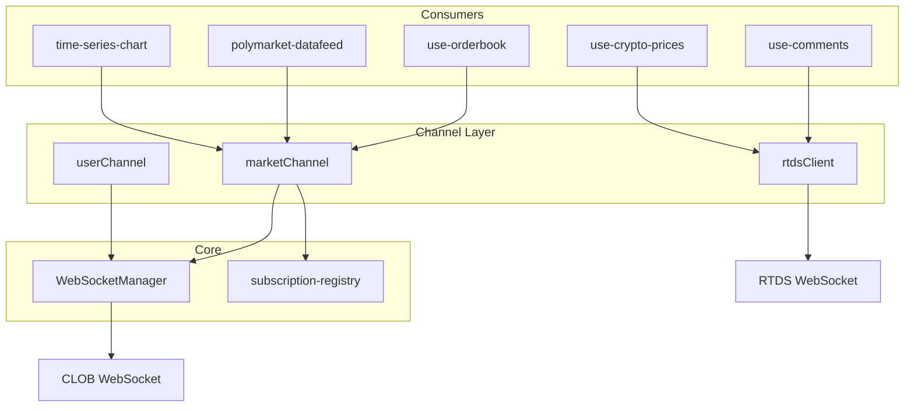
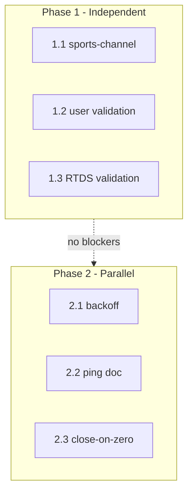

# WebSocket Implementation Audit and Refactoring Plan

## Executive Summary

Doji has three WebSocket layers: **WebSocketManager** (shared CLOB market/user), **RtdsClient** (standalone RTDS), and singleton channels (marketChannel, userChannel). The market channel is well-structured with Zod validation; the user channel and RTDS lack validation. Several patterns are duplicated, and one documented module (sports-channel) is missing.

---

## Architecture Overview

---

## Audit Findings

### 1. What Works Well

| Area                      | Implementation                                                                                                                                                           |
| ------------------------- | ------------------------------------------------------------------------------------------------------------------------------------------------------------------------ |
| Market channel validation | [schemas.ts](apps/web/src/lib/websocket/schemas.ts) – full Zod discriminated union for 7 event types                                                                     |
| Reference counting        | [subscription-registry.ts](apps/web/src/lib/websocket/subscription-registry.ts) – prevents duplicate subscriptions                                                       |
| Handler error isolation   | [market-channel.ts](apps/web/src/lib/websocket/market-channel.ts) L78-82, [user-channel.ts](apps/web/src/lib/websocket/user-channel.ts) L121-125 – try-catch per handler |
| Type guards               | [packages/types/src/websocket.ts](packages/types/src/websocket.ts) – isBookEvent, isLastTradePriceEvent, etc.                                                            |
| price_change schema       | New schema (price_changes[], best_bid/best_ask per change) – aligned with Sept 2025 migration                                                                            |
| Intentional close flag    | Both manager and RTDS use `intentionalClose` to avoid reconnect on explicit disconnect                                                                                   |

### 2. Gaps and Issues

#### A. Missing sports-channel.ts (High)

- [AGENTS.md](apps/web/src/lib/websocket/AGENTS.md) documents `sportsChannel` and usage examples
- The file **does not exist** in `apps/web/src/lib/websocket/`
- [knip-audit-verified.md](docs/knip-audit-verified.md) lists it as unused/dead
- **Decision point** (choose before implementation):
  - **A1** Remove docs only – Clean; use if sports is not a product need
  - **A2** Implement full `sports-channel.ts` – Per spec: `wss://sports-api.polymarket.com/ws`, server PING / client PONG within 10s, `sport_result` messages
  - **A3** Add stub that throws "not implemented" – Preserves API surface for future work

#### B. User Channel Lacks Validation (Medium)

- [user-channel.ts](apps/web/src/lib/websocket/user-channel.ts) L117: `const typed = event as unknown as UserChannelEvent`
- No Zod/runtime validation before dispatch
- Risk: Malformed API responses could reach handlers and cause downstream errors
- **Note:** UserTradeEvent and UserOrderEvent have optional fields (fee_rate_bps, status, created_at) – schemas must use `.optional()` where appropriate

#### C. RTDS Lacks Payload Validation (Medium)

- [rtds.ts](apps/web/src/lib/websocket/rtds.ts) L273: Only checks `data.topic && KNOWN_TOPICS.has(data.topic)`
- CommentPayload and CryptoPricePayload are never validated
- Risk: Invalid payload shapes may cause handler crashes
- **Strategy:** Validate top-level RtdsMessage, then payload by topic: `comments` → CommentPayloadSchema, `crypto_prices*` → CryptoPricePayloadSchema

#### D. Duplicate Backoff Logic (Low)

- [manager.ts](apps/web/src/lib/websocket/manager.ts) L32-34: `computeBackoffDelay`
- [rtds.ts](apps/web/src/lib/websocket/rtds.ts) L111-113: `computeRtdsBackoffDelay`
- Same formula; could be centralized in a shared utility

#### E. Ping/Heartbeat Format Inconsistency (Verify)

- **Manager:** Sends `{ type: "ping" }` JSON every 30s ([manager.ts](apps/web/src/lib/websocket/manager.ts) L285)
- **RTDS:** Sends literal `"PING"` every 5s ([rtds.ts](apps/web/src/lib/websocket/rtds.ts) L339)
- **Polymarket docs:** RTDS says "send PING messages"; CLOB WSS overview does not document ping at all; Sports says server sends PING, client must PONG
- **Refined action:** Document current behavior and uncertainty in code. Do NOT change default until verified with live CLOB (reference SDK uses literal `"PING"` but protocol is undocumented). Optional: add debug/config flag to try literal PING for empirical testing.

#### F. No Close When Zero Subscriptions (Low)

- Market channel stays connected when all components unsubscribe (registry goes to 0)
- Reference audit suggested closing the socket when no active subscriptions to free resources

#### G. No Subscription Batching (Low)

- Subscribe/unsubscribe sends immediately; no debounce
- When many components mount (orderbook + chart + volume + …), multiple subscribe messages fire
- Reference had 100ms flush interval to batch

---

## Refactoring Plan

### Phase 1: Fix Critical Gaps

**Validation failure policy (all phases):** Log invalid messages and skip; never throw to handlers. Use `logger.warn` with parsed error details.

| Task                             | Files                                       | Description                                                                                                                                                                                                                          |
| -------------------------------- | ------------------------------------------- | ------------------------------------------------------------------------------------------------------------------------------------------------------------------------------------------------------------------------------------ |
| 1.1 Resolve sports-channel       | `AGENTS.md`, optionally `sports-channel.ts` | Choose A1 (remove docs), A2 (implement), or A3 (stub). Update AGENTS.md accordingly.                                                                                                                                                 |
| 1.2 Add user channel Zod schemas | `schemas.ts`, `user-channel.ts`             | Add UserTradeEventSchema, UserOrderEventSchema (match `@doji/types` interfaces; use `.optional()` for optional fields). Validate in `dispatchEvent()` before cast; on failure: log, return.                                          |
| 1.3 Add RTDS payload validation  | `rtds-schemas.ts` (new), `rtds.ts`          | New file `apps/web/src/lib/websocket/rtds-schemas.ts` to avoid bloating schemas.ts. Export CommentPayloadSchema, CryptoPricePayloadSchema, safeParseRtdsEvent. In onmessage: parse, validate payload by topic, skip unknown/invalid. |

### Phase 2: Unify and Clean

| Task                            | Files               | Description                                                                                                                                                                                                                                                                                                       |
| ------------------------------- | ------------------- | ----------------------------------------------------------------------------------------------------------------------------------------------------------------------------------------------------------------------------------------------------------------------------------------------------------------- |
| 2.1 Centralize backoff          | `backoff.ts`        | New file `apps/web/src/lib/websocket/backoff.ts`. Export `computeBackoffDelay(attempt, options?: { initialMs?: number; maxMs?: number })`. Manager and RTDS use same defaults (1000, 30000). Replace both copies.                                                                                                 |
| 2.2 Document CLOB ping          | `manager.ts`        | Add code comment documenting current `{ type: "ping" }` behavior, CLOB docs silence, and reference SDK’s literal `"PING"`. Optional: add `pingFormat?: "json"                                                                                                                                                     |
| 2.3 Close when no subscriptions | `market-channel.ts` | In `unsubscribe()`, after `manager.unsubscribeAssets(toUnsubscribe)`, if `subscriptionRegistry.getSubscriptions(CHANNEL_NAME).length === 0` then `manager.disconnect()`. Edge case: two rapid unsubscribes in same tick – first disconnect is fine; second is no-op. Reconnect on next `connect()` from consumer. |

### Phase 3: Optional Enhancements (Reference Audit)

| Task                                 | Effort | Impact    | Notes                                                                        |
| ------------------------------------ | ------ | --------- | ---------------------------------------------------------------------------- |
| Pending subscription batching        | Medium | Medium    | 100ms flush; reduces message volume on rapid mount/unmount                   |
| Event filtering by subscribed assets | Low    | Medium    | Filter at channel before dispatching; handlers already filter, so marginal   |
| Polymarket display price             | Medium | High (UX) | `displayPrice = spread > 0.1 ? lastTradePrice : midpoint` in orderbook store |
| Connection timeout on open           | Low    | Medium    | 30s timeout; reconnect if OPEN not reached                                   |
| Ping jitter                          | Low    | Low       | ±5s jitter to avoid thundering herd across tabs                              |

---

## File-Level Summary

| File                                                                            | Current                                       | Changes                                                     |
| ------------------------------------------------------------------------------- | --------------------------------------------- | ----------------------------------------------------------- |
| [manager.ts](apps/web/src/lib/websocket/manager.ts)                             | CLOB WS; `{ type: "ping" }`; no close-on-zero | Document ping; use shared backoff                           |
| [market-channel.ts](apps/web/src/lib/websocket/market-channel.ts)               | Zod + registry + handlers                     | Add close-when-zero in unsubscribe                          |
| [user-channel.ts](apps/web/src/lib/websocket/user-channel.ts)                   | Raw cast; handler try-catch                   | Add Zod validation before dispatch                          |
| [rtds.ts](apps/web/src/lib/websocket/rtds.ts)                                   | Topic filter only                             | Add payload validation via rtds-schemas; use shared backoff |
| [schemas.ts](apps/web/src/lib/websocket/schemas.ts)                             | Market channel only                           | Add UserTradeEventSchema, UserOrderEventSchema              |
| `rtds-schemas.ts` (new)                                                         | –                                             | CommentPayload, CryptoPricePayload, safeParseRtdsEvent      |
| `backoff.ts` (new)                                                              | –                                             | computeBackoffDelay; used by manager and RTDS               |
| [subscription-registry.ts](apps/web/src/lib/websocket/subscription-registry.ts) | Ref counting                                  | No changes                                                  |
| [AGENTS.md](apps/web/src/lib/websocket/AGENTS.md)                               | Docs sports-channel                           | Update based on 1.1                                         |

---

## Dependency Graph

- Phase 1 tasks (1.1, 1.2, 1.3) are independent; no cross-dependencies
- Phase 2 tasks can run in parallel with Phase 1 or after

---

## Acceptance Criteria

| Phase  | Criteria                                                                                                                                                                            |
| ------ | ----------------------------------------------------------------------------------------------------------------------------------------------------------------------------------- |
| 1.1    | AGENTS.md no longer references non-existent sports-channel, or sports-channel.ts exists and matches chosen option                                                                   |
| 1.2    | Malformed user event in test → handler not called; valid event → handler called; invalid messages logged                                                                            |
| 1.3    | Malformed RTDS payload in test → handler not called; valid payload → handler called; invalid messages logged                                                                        |
| 2.1    | `computeBackoffDelay` used by manager and RTDS; tests pass; no behavioral change                                                                                                    |
| 2.2    | Code comment documents ping behavior; optional config present if implemented                                                                                                        |
| 2.3    | Unsubscribe last asset → `manager.disconnect()` invoked (verify via mock); new subscribe → new connection opens                                                                     |
| Global | No regression in use-orderbook, polymarket-datafeed, use-comments; invalid messages never throw to handlers; close-on-zero does not prevent reconnect when new subscription arrives |

---

## Testing Approach

- **Unit tests:** Mock WebSocketManager or raw WebSocket; simulate open → message (valid/invalid) → close
- **User channel:** Send malformed `{ event_type: "trade", ... }` with missing required fields → assert handler not called, logger.warn invoked
- **RTDS:** Send malformed CommentPayload → assert handler not called
- **Close-on-zero:** Mock manager; subscribe A, unsubscribe A; assert disconnect() called
- **Existing flows:** Manual or E2E smoke: orderbook updates, chart real-time, comments stream

---

## Rollback

All changes are additive (new schemas, new utility) or localized (validation, disconnect logic). No breaking API changes. To rollback: revert commits per phase; validation can be disabled by short-circuiting the safeParse check if needed.

---

## Key Concerns (Alignment Audit)

- **sports-channel.ts** — Implemented (option A2). Uses `NEXT_PUBLIC_WS_SPORTS_URL`, `sports-schemas.ts` for validation, `backoff.ts` for reconnect. Task 1.1 resolved.
- **backoff.ts** — Extracted; shared by manager, RTDS, and sports-channel. Task 2.1 done.
- **Schema alignment** — `schemas.ts` (market) and `sports-schemas.ts` (sports) validated; user channel and RTDS payload validation still pending per Phase 1.2/1.3.
- **Integration with rest of codebase** — `use-orderbook`, `polymarket-datafeed`, `use-comments` depend on market-channel and RTDS; changes must not break these consumers.

## Recommended Priority

1. **Phase 1.2** – User channel validation (security/resilience)
2. ~~**Phase 1.1** – sports-channel resolution~~ — Done (sports-channel implemented)
3. **Phase 1.3** – RTDS validation (resilience)
4. **Phase 2.3** – Close when no subscriptions (resource use)
5. **Phase 2.1** – Centralize backoff (DRY)
6. **Phase 2.2** – Verify CLOB ping (protocol correctness)

Phase 3 items can be scheduled after Phase 1–2 based on product priorities.