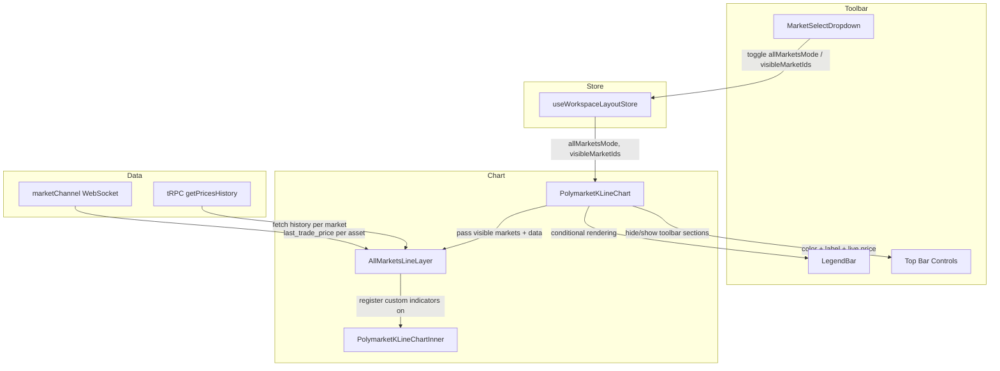

# Design Document: All Markets Multi-Line Chart

## Overview

This design adds an "All Markets" mode to the Polymarket trading terminal chart. When activated from the market selector dropdown, the chart switches from a single-market OHLC/line view to a multi-line overlay showing price history for multiple outcomes within a GMP event on a shared time axis. Each visible market gets a distinct color-coded line, a legend bar in the toolbar, and a hover tooltip card. Users can add/remove individual markets from the overlay via +/− controls in the dropdown.

The feature is scoped entirely to the client — no new tRPC endpoints or server changes are needed. Price history for each market is fetched via the existing `clob.getPricesHistory` procedure, and real-time updates arrive through the existing `marketChannel` WebSocket singleton.

### Key Design Decisions

1. **KLineChart v10 multi-series via technical indicators**: Rather than managing multiple chart instances, we render additional market lines as custom KLineChart technical indicator overlays on the single candle pane. Each "indicator" draws a line from its own price data. This avoids forking the chart lifecycle and reuses the existing pan/zoom/resize infrastructure.

2. **Zustand store extension**: `useWorkspaceLayoutStore` gains `allMarketsMode: boolean` and `visibleMarketIds: string[]`. These are persisted so the mode survives page refresh within the same event, but reset on event navigation.

3. **Dropdown stays open in edit mode**: When All Markets mode is active, clicking +/− icons in the dropdown toggles market visibility without closing the popover, matching the UX of multi-select filter patterns.

4. **Line-only rendering**: All Markets mode forces `area` (line) display type on all series. OHLC candles are not meaningful when overlaying multiple assets.

## Architecture



### Data Flow

1. User selects "All Markets" from `MarketSelectDropdown`.
2. Store sets `allMarketsMode: true`, `visibleMarketIds` defaults to top 4 by Yes price.
3. `PolymarketKLineChart` reads store, hides timeframe/chart-type/drawing-tools, shows `LegendBar`.
4. `AllMarketsLineLayer` fetches `getPricesHistory` for each visible market (parallel, deduplicated via TanStack Query).
5. For each visible market, a custom KLineChart technical indicator is registered that draws a colored line from the fetched data.
6. WebSocket subscriptions are managed for all visible market asset IDs; `last_trade_price` events update the trailing point of each line and the legend bar price.
7. On hover, a custom tooltip renderer shows per-market prices at the crosshair timestamp.

## Components and Interfaces

### Modified Components

#### `MarketSelectDropdown`

New props:
```typescript
interface MarketSelectDropdownProps {
  "aria-label"?: string;
  items: SelectorMarket[];
  onSelectMarket: (conditionId: string) => void;
  selectedMarketId: string;
  // New props for All Markets mode
  allMarketsMode?: boolean;
  visibleMarketIds?: string[];
  onToggleAllMarkets?: () => void;
  onAddMarket?: (conditionId: string) => void;
  onRemoveMarket?: (conditionId: string) => void;
}
```

Changes:
- Renders an "All Markets" row at the top when `items.length >= 2`.
- When `allMarketsMode` is true, shows "All Markets" in the trigger text.
- When `allMarketsMode` is true, each market row shows a +/− icon button instead of being a simple select item. Clicking the icon calls `onAddMarket`/`onRemoveMarket` without closing the dropdown.
- Switches from `<Select>` to a `<Popover>` + custom list when in All Markets mode so the dropdown stays open on +/− clicks.

#### `PolymarketKLineChart`

Changes:
- Reads `allMarketsMode` and `visibleMarketIds` from `useWorkspaceLayoutStore`.
- When `allMarketsMode` is true:
  - Hides `TimeframeSegment` buttons, `ChartTypePicker`, and `KlineLeftToolbar`.
  - Renders `LegendBar` in the top bar.
  - Passes visible market data to `AllMarketsLineLayer`.
  - Keeps screenshot and fullscreen buttons visible.

#### `useWorkspaceLayoutStore`

New state fields:
```typescript
interface WorkspaceLayoutState {
  // ... existing fields ...
  allMarketsMode: boolean;
  visibleMarketIds: string[];
  setAllMarketsMode: (active: boolean) => void;
  setVisibleMarketIds: (ids: string[]) => void;
  addVisibleMarket: (id: string) => void;
  removeVisibleMarket: (id: string) => void;
  resetAllMarketsMode: () => void;
}
```

The `allMarketsMode` and `visibleMarketIds` are persisted via the existing Zustand persist middleware. `resetAllMarketsMode` sets `allMarketsMode: false` and clears `visibleMarketIds`.

### New Components

#### `AllMarketsLineLayer`

```typescript
interface AllMarketsLineLayerProps {
  /** KLineChart instance ref */
  chartRef: RefObject<PolymarketKLineChartInnerHandle | null>;
  /** Markets to render as lines */
  visibleMarkets: Array<{
    conditionId: string;
    tokenId: string;
    assetIds: string[];
    label: string;
    color: string;
  }>;
  /** Callback when a market's live price updates */
  onPriceUpdate?: (conditionId: string, price: number) => void;
}
```

Responsibilities:
- Fetches price history for each visible market via `trpc.clob.getPricesHistory`.
- Registers a custom KLineChart technical indicator per market that renders a colored line.
- Manages WebSocket subscriptions for all visible market asset IDs.
- Updates the trailing data point on `last_trade_price` events.
- Calls `onPriceUpdate` so the legend bar can show live prices.
- On mount/visible market change, calls `chart.fitContent()` to auto-scale all data into view.

#### `LegendBar`

```typescript
interface LegendBarProps {
  items: Array<{
    conditionId: string;
    label: string;
    color: string;
    price: number; // current Yes price as decimal (0-1)
  }>;
}
```

Renders a horizontal row of legend items in the chart top bar. Each item: colored dot + truncated label + price as percentage. Horizontally scrollable if items overflow.

#### `AllMarketsTooltip`

Custom KLineChart crosshair tooltip renderer. When the crosshair moves, reads the data value at the hovered timestamp for each visible market indicator and renders a card with:
- Date (e.g. "April 30, 2026")
- Per-market row: colored dot + label + price in cents (e.g. "81.0¢")

Styled as an opaque card with border, consistent with existing PnL tooltip.

### Color Assignment

A utility function `assignMarketColors` generates distinct colors for up to ~12 markets. Uses a predefined palette of high-contrast colors suitable for dark backgrounds:

```typescript
const MARKET_COLORS = [
  "#4ADE80", // green
  "#60A5FA", // blue
  "#F472B6", // pink
  "#FBBF24", // amber
  "#A78BFA", // violet
  "#34D399", // emerald
  "#FB923C", // orange
  "#38BDF8", // sky
  "#E879F9", // fuchsia
  "#F87171", // red
  "#2DD4BF", // teal
  "#FACC15", // yellow
];

function assignMarketColors(marketIds: string[]): Map<string, string> {
  return new Map(marketIds.map((id, i) => [id, MARKET_COLORS[i % MARKET_COLORS.length]]));
}
```

Colors are assigned by index in the `visibleMarketIds` array, so they remain stable as long as the order doesn't change.

## Data Models

### Store State

```typescript
// Added to WorkspaceLayoutState
allMarketsMode: boolean;          // false by default
visibleMarketIds: string[];       // conditionIds of visible markets
```

### Visible Market Data (runtime)

```typescript
interface VisibleMarketData {
  conditionId: string;
  tokenId: string;          // Yes token ID for price history
  assetIds: string[];        // For WebSocket subscription
  label: string;             // Outcome label from getOutcomeLabel()
  color: string;             // Assigned line color
  priceHistory: PriceHistoryPoint[];  // Fetched via getPricesHistory
  currentPrice: number;      // Latest Yes price (0-1), updated via WS
}
```

### KLineChart Custom Indicator Data

Each visible market registers a technical indicator named `allMarkets_{conditionId}`. The indicator's `calc` function returns the price data mapped to the chart's time axis. The `draw` function renders a colored line using the assigned color.

### Interaction Constraints (All Markets Mode)

When `allMarketsMode` is true, the chart instance is configured:
- Y-axis drag disabled: `chart.setStyles({ yAxis: { scrollZoomEnabled: false } })` or equivalent KLineChart v10 API.
- Horizontal pan: enabled (default).
- Scroll zoom: enabled (default).
- Drawing overlays: disabled (left toolbar hidden, no overlay creation).


## Correctness Properties

*A property is a characteristic or behavior that should hold true across all valid executions of a system — essentially, a formal statement about what the system should do. Properties serve as the bridge between human-readable specifications and machine-verifiable correctness guarantees.*

### Property 1: Default visible markets are the top markets by Yes price

*For any* list of active `SelectorMarket[]` with associated Yes prices, the default `visibleMarketIds` selection SHALL contain exactly `min(4, N)` markets (where N is the number of active markets), and those markets SHALL be the ones with the highest Yes prices in descending order.

**Validates: Requirements 2.2, 2.6**

### Property 2: Color assignment uniqueness

*For any* set of visible market IDs with size ≤ palette length, `assignMarketColors` SHALL return a mapping where every market ID maps to a distinct color string (no two markets share the same color).

**Validates: Requirements 2.3**

### Property 3: Legend item content completeness

*For any* visible market with a label string, a hex color, and a Yes price in [0, 1], the rendered legend item SHALL contain the color value, the label text, and the price formatted as a percentage string (e.g. "18.8%").

**Validates: Requirements 4.1, 4.2**

### Property 4: Tooltip row content completeness

*For any* set of visible markets and a valid timestamp, the tooltip content SHALL contain one row per visible market, and each row SHALL include the market's assigned color, outcome label, and price at that timestamp formatted as cents (e.g. "81.0¢").

**Validates: Requirements 5.2**

### Property 5: Tooltip date formatting

*For any* valid Unix timestamp (within reasonable range 2020–2030), the tooltip date formatter SHALL produce a string matching the pattern "Month Day, Year" (e.g. "April 30, 2026") where Month is the full English month name and Day is the numeric day.

**Validates: Requirements 5.3**

### Property 6: Add/remove market round-trip on visibleMarketIds

*For any* `visibleMarketIds` set and any market ID not in the set, calling `addVisibleMarket(id)` SHALL result in the set containing that ID. Subsequently calling `removeVisibleMarket(id)` SHALL result in the set no longer containing that ID, with all other IDs unchanged.

**Validates: Requirements 6.3, 6.4**

## Error Handling

| Scenario | Handling |
|----------|----------|
| `getPricesHistory` fails for one market | Show the remaining markets' lines; omit the failed market from the legend with no error toast. Retry on next interval change or mode re-entry. |
| WebSocket disconnects | Existing `marketChannel` reconnection logic applies. Legend prices freeze at last known value; lines stop updating until reconnection. |
| Event has 0 or 1 markets | "All Markets" row is not shown in the dropdown (requires ≥ 2 markets). No error state needed. |
| All visible markets removed | `removeVisibleMarket` checks if `visibleMarketIds` would become empty; if so, calls `resetAllMarketsMode()` to exit to single-market view for the first active market. |
| Color palette exhausted (>12 markets) | Colors wrap around via modulo. Duplicate colors are possible but unlikely in practice (most GMP events have <12 outcomes). |
| KLineChart indicator registration fails | Catch silently; the market's line won't render but other lines and the legend remain functional. |

## Testing Strategy

### Unit Tests (Example-Based)

- **MarketSelectDropdown**: Renders "All Markets" row when items ≥ 2; does not render when items < 2. Trigger shows "All Markets" text when `allMarketsMode` is true. +/− icons render correctly based on `visibleMarketIds`.
- **PolymarketKLineChart toolbar visibility**: Timeframe buttons, chart type picker, and left toolbar are hidden when `allMarketsMode` is true. Screenshot and fullscreen buttons remain visible.
- **Store actions**: `setAllMarketsMode`, `addVisibleMarket`, `removeVisibleMarket`, `resetAllMarketsMode` produce correct state transitions. Removing the last visible market triggers mode exit.
- **Event navigation reset**: Changing `conditionId` / `tokenId` props resets `allMarketsMode` to false.

### Property-Based Tests

Property-based tests use `fast-check` (already available in the project's test toolchain via Vitest). Each property test runs a minimum of 100 iterations.

- **Property 1** (default selection): Generate random arrays of `{ conditionId, yesPrice }` objects (1–20 items, prices in [0,1]). Verify `getDefaultVisibleMarkets` returns the correct top-N subset.
  - Tag: `Feature: all-markets-chart, Property 1: Default visible markets are the top markets by Yes price`
- **Property 2** (color uniqueness): Generate random arrays of string IDs (1–12 items). Verify `assignMarketColors` returns all-unique color values.
  - Tag: `Feature: all-markets-chart, Property 2: Color assignment uniqueness`
- **Property 3** (legend content): Generate random `{ label, color, price }` tuples. Verify formatted legend item string contains all three pieces.
  - Tag: `Feature: all-markets-chart, Property 3: Legend item content completeness`
- **Property 4** (tooltip rows): Generate random visible market arrays and a timestamp. Verify tooltip output has correct row count and content.
  - Tag: `Feature: all-markets-chart, Property 4: Tooltip row content completeness`
- **Property 5** (date format): Generate random timestamps in [2020, 2030]. Verify output matches `/{FullMonth} \d{1,2}, \d{4}/`.
  - Tag: `Feature: all-markets-chart, Property 5: Tooltip date formatting`
- **Property 6** (add/remove round-trip): Generate random initial sets and a market ID. Verify add then remove is identity on the rest of the set.
  - Tag: `Feature: all-markets-chart, Property 6: Add/remove market round-trip on visibleMarketIds`

### Integration Tests

- Activate All Markets mode → verify `getPricesHistory` called for each visible market's tokenId.
- Mock WebSocket `last_trade_price` event → verify legend bar price updates.
- Verify `marketChannel.connect()` / `unsubscribe()` called with correct asset IDs when markets are added/removed.
