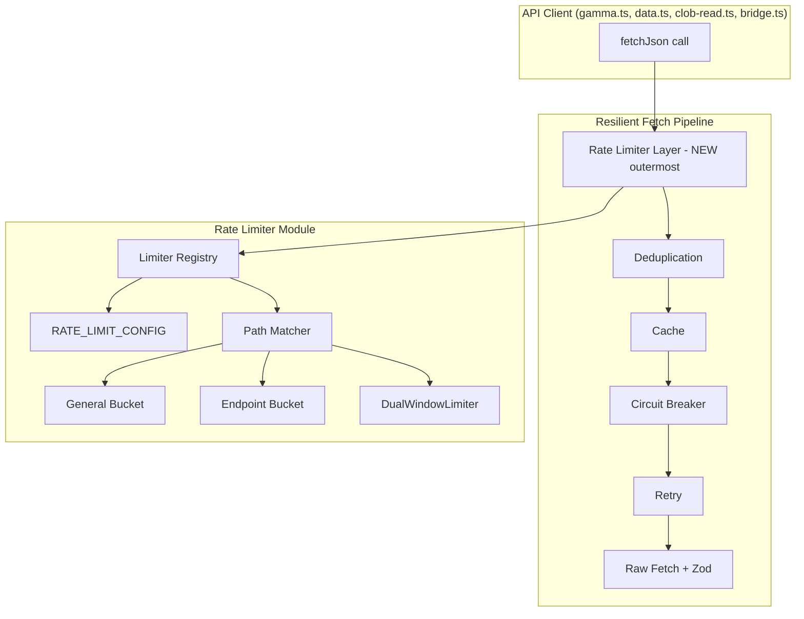

# Design Document: API Rate Limiting

## Overview

This design replaces the existing partial rate limiter (`apps/server/src/lib/rate-limiter.ts`) with a comprehensive, configuration-driven system that enforces all documented Polymarket API rate limits. The key changes are:

1. A declarative `RATE_LIMIT_CONFIG` constant covering all 6 API families and every endpoint-specific limit
2. A `DualWindowLimiter` class for CLOB trading endpoints that enforces both burst (10s) and sustained (10min) windows
3. Hierarchical enforcement: each request checks both its endpoint-specific bucket and the API family general bucket
4. Automatic integration into the `resilient-fetch` pipeline as the outermost middleware layer
5. JSON-serializable configuration with Zod validation for external loading

The existing `TokenBucket` class is retained and enhanced. The `SERVER_RATE_LIMITS` constant and `getRateLimiter`/`destroyAllLimiters` functions are replaced with the new registry.

## Architecture



The rate limiter sits as the outermost layer in the resilient-fetch pipeline. When `createResilientFetch` is called with a `source` (e.g., "gamma", "data", "clob"), the pipeline resolves the source to an API family, then for each request:

1. Matches the request path against endpoint-specific patterns
2. Acquires tokens from the endpoint-specific bucket (if matched) AND the general bucket
3. For dual-window endpoints, acquires from both burst and sustained buckets plus the general bucket
4. Only after all tokens are acquired does the request proceed to deduplication

## Components and Interfaces

### 1. Rate Limit Configuration (`rate-limit-config.ts`)

```typescript
/** Single-window rate limit. */
interface SingleWindowLimit {
  type: "single";
  limit: number;
  windowMs: number;
}

/** Dual-window rate limit (burst + sustained). */
interface DualWindowLimit {
  type: "dual";
  burst: { limit: number; windowMs: number };
  sustained: { limit: number; windowMs: number };
}

type RateLimit = SingleWindowLimit | DualWindowLimit;

/** Configuration for one API family. */
interface ApiFamilyConfig {
  general: SingleWindowLimit;
  endpoints: Record<string, RateLimit>;
}

/** Full rate limit configuration. */
type RateLimitConfig = Record<string, ApiFamilyConfig>;

/** Source-to-family mapping. */
const SOURCE_TO_FAMILY: Record<string, string>;

/** The complete configuration constant. */
const RATE_LIMIT_CONFIG: RateLimitConfig;

/** Zod schema for validation. */
const RateLimitConfigSchema: z.ZodType<RateLimitConfig>;
```

### 2. Token Bucket (enhanced `TokenBucket`)

The existing `TokenBucket` class is retained with no interface changes. It already supports:
- `acquire(): Promise<void>` — wait for a token
- `tryAcquire(): boolean` — non-blocking check
- `getQueueLength(): number`
- `destroy(): void`

### 3. Dual Window Limiter (`DualWindowLimiter`)

```typescript
class DualWindowLimiter {
  private burst: TokenBucket;
  private sustained: TokenBucket;

  constructor(config: DualWindowLimit);

  /** Acquire from both burst and sustained buckets. */
  async acquire(): Promise<void>;

  /** Non-blocking check against both buckets. */
  tryAcquire(): boolean;

  getQueueLength(): number;
  destroy(): void;
}
```

### 4. Limiter Registry (`LimiterRegistry`)

```typescript
class LimiterRegistry {
  constructor(config: RateLimitConfig);

  /**
   * Acquire rate limit tokens for a request.
   * Resolves the family from source, matches endpoint pattern,
   * acquires from all applicable buckets.
   */
  async acquire(source: string, path: string): Promise<void>;

  /** Destroy all buckets and clear the registry. */
  destroyAll(): void;
}
```

The registry lazily creates `TokenBucket` or `DualWindowLimiter` instances on first access and caches them by a composite key of `family:endpoint` or `family:general`.

### 5. Integration with Resilient Fetch

`createResilientFetch` gains an optional `rateLimiter` parameter (defaulting to a shared global `LimiterRegistry`). The pipeline order becomes:

```
rateLimiter.acquire(source, path) → dedup → cache → circuitBreaker → retry → rawFetch
```

### 6. Path Matching

Endpoint keys in the config use simple string prefixes (e.g., `/trades`, `/events`, `/book`). The matcher iterates endpoint keys for the family and returns the first match where the request path starts with the key. If no match, only the general bucket applies.

For method-sensitive endpoints (CLOB trading), the key encodes the method: `POST /order`, `DELETE /order`, etc. The matcher receives both method and path.

## Data Models

### Rate Limit Configuration Shape

```typescript
const RATE_LIMIT_CONFIG: RateLimitConfig = {
  general: {
    general: { type: "single", limit: 15000, windowMs: 10_000 },
    endpoints: {
      "/": { type: "single", limit: 100, windowMs: 10_000 },
    },
  },
  data: {
    general: { type: "single", limit: 1000, windowMs: 10_000 },
    endpoints: {
      "/trades": { type: "single", limit: 200, windowMs: 10_000 },
      "/positions": { type: "single", limit: 150, windowMs: 10_000 },
      "/closed-positions": { type: "single", limit: 150, windowMs: 10_000 },
      "/": { type: "single", limit: 100, windowMs: 10_000 },
    },
  },
  gamma: {
    general: { type: "single", limit: 4000, windowMs: 10_000 },
    endpoints: {
      "/comments": { type: "single", limit: 200, windowMs: 10_000 },
      "/events": { type: "single", limit: 500, windowMs: 10_000 },
      "/markets": { type: "single", limit: 300, windowMs: 10_000 },
      "/tags": { type: "single", limit: 200, windowMs: 10_000 },
      "/search": { type: "single", limit: 350, windowMs: 10_000 },
    },
  },
  clob: {
    general: { type: "single", limit: 9000, windowMs: 10_000 },
    endpoints: {
      "GET /balance-allowance": { type: "single", limit: 200, windowMs: 10_000 },
      "UPDATE /balance-allowance": { type: "single", limit: 50, windowMs: 10_000 },
      "/book": { type: "single", limit: 1500, windowMs: 10_000 },
      "/books": { type: "single", limit: 500, windowMs: 10_000 },
      "/price": { type: "single", limit: 1500, windowMs: 10_000 },
      "/prices": { type: "single", limit: 500, windowMs: 10_000 },
      "/midprice": { type: "single", limit: 1500, windowMs: 10_000 },
      "/midprices": { type: "single", limit: 500, windowMs: 10_000 },
      "/ledger": { type: "single", limit: 900, windowMs: 10_000 },
      "/data/orders": { type: "single", limit: 500, windowMs: 10_000 },
      "/data/trades": { type: "single", limit: 500, windowMs: 10_000 },
      "/notifications": { type: "single", limit: 125, windowMs: 10_000 },
      "/price-history": { type: "single", limit: 1000, windowMs: 10_000 },
      "/tick-size": { type: "single", limit: 200, windowMs: 10_000 },
      "/api-keys": { type: "single", limit: 100, windowMs: 10_000 },
      "POST /order": {
        type: "dual",
        burst: { limit: 3500, windowMs: 10_000 },
        sustained: { limit: 36000, windowMs: 600_000 },
      },
      "DELETE /order": {
        type: "dual",
        burst: { limit: 3000, windowMs: 10_000 },
        sustained: { limit: 30000, windowMs: 600_000 },
      },
      "POST /orders": {
        type: "dual",
        burst: { limit: 1000, windowMs: 10_000 },
        sustained: { limit: 15000, windowMs: 600_000 },
      },
      "DELETE /orders": {
        type: "dual",
        burst: { limit: 1000, windowMs: 10_000 },
        sustained: { limit: 15000, windowMs: 600_000 },
      },
      "DELETE /cancel-all": {
        type: "dual",
        burst: { limit: 250, windowMs: 10_000 },
        sustained: { limit: 6000, windowMs: 600_000 },
      },
      "DELETE /cancel-market-orders": {
        type: "dual",
        burst: { limit: 1000, windowMs: 10_000 },
        sustained: { limit: 1500, windowMs: 600_000 },
      },
    },
  },
  relayer: {
    general: { type: "single", limit: 25, windowMs: 60_000 },
    endpoints: {},
  },
  user_pnl: {
    general: { type: "single", limit: 200, windowMs: 10_000 },
    endpoints: {},
  },
};
```

### Source-to-Family Mapping

```typescript
const SOURCE_TO_FAMILY: Record<string, string> = {
  gamma: "gamma",
  data: "data",
  clob: "clob",
  bridge: "general",
  relayer: "relayer",
  user_pnl: "user_pnl",
};
```


## Correctness Properties

*A property is a characteristic or behavior that should hold true across all valid executions of a system — essentially, a formal statement about what the system should do. Properties serve as the bridge between human-readable specifications and machine-verifiable correctness guarantees.*

### Property 1: Rate limit entry structure validity

*For any* rate limit entry in the configuration, if the entry has `type: "single"` it must have `limit` and `windowMs` fields with positive numbers, and if it has `type: "dual"` it must have `burst` and `sustained` sub-objects each with `limit` and `windowMs` fields with positive numbers.

**Validates: Requirements 1.2, 1.3**

### Property 2: Token bucket capacity enforcement

*For any* `TokenBucket` with configured limit N, exactly N consecutive `tryAcquire()` calls (without any time passing) should return `true`, and the (N+1)th call should return `false`. The total number of successful acquisitions must equal the configured limit.

**Validates: Requirements 2.1, 2.4**

### Property 3: Token bucket queuing guarantees no drops

*For any* `TokenBucket` with limit N and any number of excess requests E submitted via `acquire()` after draining all tokens, the queue length should equal E, and all E promises should eventually resolve (no request is ever dropped).

**Validates: Requirements 2.2, 2.5**

### Property 4: Token bucket refill rate correctness

*For any* `TokenBucket` with limit L and window W, the refill rate should equal L/W tokens per millisecond. After draining all tokens and waiting T milliseconds, the number of available tokens should be approximately `min(L, T * L / W)` (within a tolerance of ±1 for timing imprecision).

**Validates: Requirements 2.3**

### Property 5: Dual-window limiter requires both buckets

*For any* `DualWindowLimiter`, `tryAcquire()` should return `true` only when both the burst bucket and the sustained bucket have available tokens. If either bucket is drained, `tryAcquire()` must return `false`. Successful acquisition must consume exactly one token from each bucket.

**Validates: Requirements 3.1, 3.2, 3.4**

### Property 6: Hierarchical limit resolution

*For any* request with a source and path, if the path matches an endpoint-specific pattern in the resolved API family, the registry must acquire tokens from both the endpoint-specific bucket and the general bucket. If the path does not match any endpoint pattern, only the general bucket should have a token consumed. The path matcher must return the most specific match.

**Validates: Requirements 4.1, 4.2, 4.3, 4.4, 6.2**

### Property 7: Backoff delay monotonicity with cap

*For any* backoff configuration with baseDelayMs, multiplier, and maxDelayMs, the computed delay for attempt N should be greater than or equal to the delay for attempt N-1 (monotonically non-decreasing), and no delay should ever exceed maxDelayMs.

**Validates: Requirements 7.1, 7.2, 7.4**

### Property 8: Registry destroy lifecycle

*For any* `LimiterRegistry` with active buckets and queued requests, calling `destroyAll()` should resolve all queued promises and clear the internal bucket map. After `destroyAll()`, subsequent `acquire()` calls should create fresh bucket instances (not reuse destroyed ones).

**Validates: Requirements 8.1, 8.2**

### Property 9: Configuration serialization round-trip

*For any* valid `RateLimitConfig` object, `JSON.parse(JSON.stringify(config))` should produce an object that is deeply equal to the original. The Zod schema should successfully validate the deserialized result.

**Validates: Requirements 9.2**

### Property 10: Invalid configuration rejection

*For any* object that does not conform to the `RateLimitConfig` schema (missing fields, wrong types, negative numbers, missing type discriminator), the Zod schema validation should return a failure result with at least one error message.

**Validates: Requirements 9.3**

## Error Handling

| Scenario | Behavior |
|---|---|
| Rate limiter has no tokens | Request is queued (throttled), not rejected. Resolves when tokens refill. |
| Unknown source passed to registry | Falls back to "general" API family limits. Logs a warning. |
| Unknown path (no endpoint match) | Only the general bucket is applied. No error. |
| Destroy called with active queue | All queued promises resolve immediately. Timers cleared. |
| Invalid config passed to Zod schema | Returns `ZodError` with descriptive issue array. Does not throw. |
| Upstream 429 response despite local limiting | Handled by existing retry middleware with `Retry-After` header parsing. Rate limiter is not bypassed. |

## Testing Strategy

### Property-Based Testing

Library: `fast-check` (already a devDependency in `apps/server` and `packages/types`)

Each correctness property maps to one property-based test with minimum 100 iterations. Tests are placed alongside the implementation in `apps/server/src/lib/__tests__/rate-limiter.property.test.ts`.

| Property | Test Description | Min Iterations |
|---|---|---|
| P1 | Generate random rate limit entries, validate structure matches type | 100 |
| P2 | Generate random bucket limits (1-500), verify exactly N tryAcquire succeed | 100 |
| P3 | Generate random bucket limits and excess counts, verify queue length and resolution | 50 (async) |
| P4 | Generate random limits and windows, verify refill math | 100 |
| P5 | Generate random dual configs, drain one or both buckets, verify tryAcquire behavior | 100 |
| P6 | Generate random configs with endpoints, random paths, verify correct bucket selection | 100 |
| P7 | Generate random backoff configs, verify monotonicity and cap | 100 |
| P8 | Generate random registries with queued requests, verify destroyAll behavior | 50 (async) |
| P9 | Generate random valid configs, verify JSON round-trip | 100 |
| P10 | Generate random invalid objects, verify Zod rejection | 100 |

### Unit Testing

Unit tests cover specific examples, edge cases, and integration points:

- Config contains all 6 API families with correct values
- CLOB trading endpoints have dual-type entries
- Path matcher handles exact matches, prefix matches, and method-prefixed keys
- Resilient fetch pipeline calls rate limiter before other middleware
- `destroyAllLimiters` is called during server shutdown
- Edge cases: zero-token bucket, single-request burst, window boundary timing

### Test Tagging

Each property test is tagged with:
```
Feature: api-rate-limiting, Property N: [property title]
```
