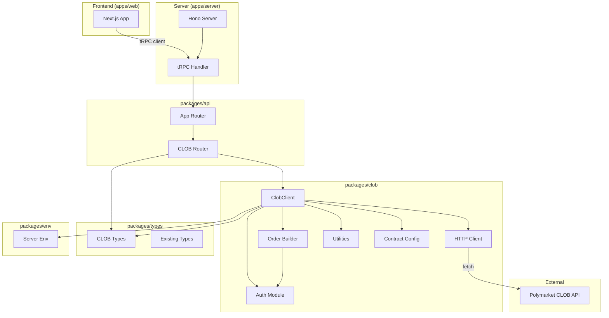
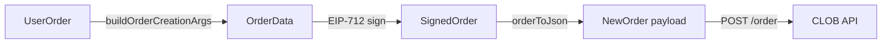

# Design Document: CLOB Client Service

## Overview

This design introduces a new `packages/clob` package that wraps the Polymarket CLOB REST API as a server-side TypeScript service. The package provides authentication (L1 EIP-712 and L2 HMAC-SHA256), order building with tick-size-aware rounding, market data retrieval, order management, trade history, balance queries, and heartbeat support. It integrates into the existing monorepo via tRPC routers in `packages/api` and shared types in `packages/types`.

Key design decisions:
- Use native `fetch` instead of axios to minimize dependencies
- Use `viem` instead of `ethers` v5 for EIP-712 signing (modern, tree-shakeable, TypeScript-first)
- Keep all wallet/signing operations server-side only
- Expose read-only market data through tRPC queries and order operations through tRPC mutations

## Architecture



The architecture follows a layered approach:
1. `packages/types` — CLOB type definitions shared across packages
2. `packages/clob` — Core service with auth, order building, HTTP client, and utilities
3. `packages/api` — tRPC router exposing CLOB operations
4. `packages/env` — Environment variable validation for CLOB config

## Components and Interfaces

### 1. CLOB Types (`packages/types/src/clob.ts`)

New file exporting all CLOB-specific types. Re-exported from `packages/types/src/index.ts`.

```typescript
// Enums
export enum Side { BUY = "BUY", SELL = "SELL" }
export enum OrderType { GTC = "GTC", FOK = "FOK", GTD = "GTD", FAK = "FAK" }
export enum Chain { POLYGON = 137, AMOY = 80002 }
export enum AssetType { COLLATERAL = "COLLATERAL", CONDITIONAL = "CONDITIONAL" }
export enum PriceHistoryInterval { MAX = "max", ONE_WEEK = "1w", ONE_DAY = "1d", SIX_HOURS = "6h", ONE_HOUR = "1h" }

// Core types
export type TickSize = "0.1" | "0.01" | "0.001" | "0.0001";
export interface RoundConfig { readonly price: number; readonly size: number; readonly amount: number }
export interface OrderSummary { price: string; size: string }
export interface OrderBookSummary {
  market: string; asset_id: string; timestamp: string;
  bids: OrderSummary[]; asks: OrderSummary[];
  min_order_size: string; tick_size: string; neg_risk: boolean;
  last_trade_price: string; hash: string;
}

// Auth types
export interface ApiKeyCreds { key: string; secret: string; passphrase: string }
export interface L1PolyHeader { POLY_ADDRESS: string; POLY_SIGNATURE: string; POLY_TIMESTAMP: string; POLY_NONCE: string }
export interface L2PolyHeader { POLY_ADDRESS: string; POLY_SIGNATURE: string; POLY_TIMESTAMP: string; POLY_API_KEY: string; POLY_PASSPHRASE: string }

// Order types
export interface UserOrder { tokenID: string; price: number; size: number; side: Side; feeRateBps?: number; nonce?: number; expiration?: number; taker?: string }
export interface UserMarketOrder { tokenID: string; amount: number; side: Side; price?: number; feeRateBps?: number; nonce?: number; taker?: string; orderType?: OrderType.FOK | OrderType.FAK }
export interface CreateOrderOptions { tickSize: TickSize; negRisk?: boolean }

// Response types
export interface OrderResponse { success: boolean; errorMsg: string; orderID: string; transactionsHashes: string[]; status: string; takingAmount: string; makingAmount: string }
export interface BalanceAllowanceResponse { balance: string; allowance: string }
export interface HeartbeatResponse { readonly heartbeat_id: string; readonly error?: string }
export interface MarketPrice { t: number; p: number }
export interface PaginationPayload { readonly limit: number; readonly count: number; readonly next_cursor: string; readonly data: unknown[] }

// Contract config
export interface ContractConfig { exchange: string; negRiskAdapter: string; negRiskExchange: string; collateral: string; conditionalTokens: string }

// Params
export interface BookParams { token_id: string; side: Side }
export interface TradeParams { id?: string; maker_address?: string; market?: string; asset_id?: string; before?: string; after?: string }
export interface OpenOrderParams { id?: string; market?: string; asset_id?: string }
export interface BalanceAllowanceParams { asset_type: AssetType; token_id?: string }
export interface PriceHistoryFilterParams { market?: string; startTs?: number; endTs?: number; fidelity?: number; interval?: PriceHistoryInterval }
export interface OrderMarketCancelParams { market?: string; asset_id?: string }

// Cancel response
export interface CancelOrdersResponse { canceled: string[]; not_canceled: string[] }

// Status enums/types
export enum TradeStatus { MATCHED = "MATCHED", MINED = "MINED", CONFIRMED = "CONFIRMED", RETRYING = "RETRYING", FAILED = "FAILED" }
export type OrderStatus = "matched" | "live" | "delayed" | "unmatched";

// Simplified market
export interface SimplifiedMarket {
  condition_id: string; question: string; description?: string;
  tokens: Array<{ token_id: string; outcome: string; price: number; winner: boolean }>;
  end_date_iso?: string; active: boolean; closed: boolean;
  neg_risk?: boolean; min_order_size?: number; tick_size?: string;
}

// Notification types
export interface Notification { id: string; type: string; message: string; created_at: string; read: boolean; metadata?: Record<string, unknown> }

// Order scoring types
export interface OrderScoring { scoring_enabled: boolean; scores?: Record<string, unknown> }

// Builder operation types
export interface BuilderOperation { id?: string; operation_type: string; condition_id?: string; params: Record<string, unknown>; status?: string; created_at?: string }

// Order insert error
export interface OrderInsertError { error: string; order?: Record<string, unknown> }
```

### 2. Rounding Utilities (`packages/clob/src/utilities.ts`)

Pure functions for tick-size-aware rounding and validation.

```typescript
export const ROUNDING_CONFIG: Record<TickSize, RoundConfig> = {
  "0.1":    { price: 1, size: 2, amount: 3 },
  "0.01":   { price: 2, size: 2, amount: 4 },
  "0.001":  { price: 3, size: 2, amount: 5 },
  "0.0001": { price: 4, size: 2, amount: 6 },
};

export function roundNormal(num: number, decimals: number): number;
export function roundDown(num: number, decimals: number): number;
export function roundUp(num: number, decimals: number): number;
export function decimalPlaces(num: number): number;
export function priceValid(price: number, tickSize: TickSize): boolean;
export function isTickSizeSmaller(a: TickSize, b: TickSize): boolean;
export function generateOrderBookSummaryHash(orderbook: OrderBookSummary): Promise<string>;
```

### 3. Contract Configuration (`packages/clob/src/config.ts`)

Chain-specific contract addresses and constants.

```typescript
export const COLLATERAL_TOKEN_DECIMALS = 6;
export const CONDITIONAL_TOKEN_DECIMALS = 6;
export function getContractConfig(chainId: number): ContractConfig;
```

### 4. Auth Module (`packages/clob/src/auth/`)

Two sub-modules for L1 and L2 authentication.

**`hmac.ts`** — L2 HMAC-SHA256 signing:
```typescript
export async function buildPolyHmacSignature(
  secret: string, timestamp: number, method: string, requestPath: string, body?: string
): Promise<string>;
```

**`eip712.ts`** — L1 EIP-712 signing using viem:
```typescript
export async function buildClobEip712Signature(
  walletClient: WalletClient, chainId: Chain, timestamp: number, nonce: number
): Promise<string>;
```

**`headers.ts`** — Header generation:
```typescript
export async function createL1Headers(walletClient: WalletClient, chainId: Chain, nonce?: number): Promise<L1PolyHeader>;
export async function createL2Headers(address: string, creds: ApiKeyCreds, args: L2HeaderArgs): Promise<L2PolyHeader>;
```

### 5. Order Builder (`packages/clob/src/order-builder/`)

**`helpers.ts`** — Amount calculation and order data construction:
```typescript
export function getOrderRawAmounts(side: Side, size: number, price: number, roundConfig: RoundConfig): { side: number; rawMakerAmt: number; rawTakerAmt: number };
export function getMarketOrderRawAmounts(side: Side, amount: number, price: number, roundConfig: RoundConfig): { side: number; rawMakerAmt: number; rawTakerAmt: number };
export function buildOrderCreationArgs(signer: string, maker: string, userOrder: UserOrder, roundConfig: RoundConfig): OrderData;
export function buildMarketOrderCreationArgs(signer: string, maker: string, userMarketOrder: UserMarketOrder, roundConfig: RoundConfig): OrderData;
export function calculateBuyMarketPrice(positions: OrderSummary[], amountToMatch: number, orderType: OrderType): number;
export function calculateSellMarketPrice(positions: OrderSummary[], amountToMatch: number, orderType: OrderType): number;
```

**`builder.ts`** — High-level order builder using viem for signing:
```typescript
export class OrderBuilder {
  constructor(walletClient: WalletClient, chainId: Chain, funderAddress?: string);
  async buildOrder(userOrder: UserOrder, options: CreateOrderOptions): Promise<SignedOrder>;
  async buildMarketOrder(userMarketOrder: UserMarketOrder, options: CreateOrderOptions): Promise<SignedOrder>;
}
```

### 6. HTTP Client (`packages/clob/src/http.ts`)

Fetch-based HTTP client with retry logic.

```typescript
export interface RequestOptions { headers?: Record<string, string>; data?: unknown; params?: Record<string, string> }

export async function httpGet(endpoint: string, options?: RequestOptions): Promise<unknown>;
export async function httpPost(endpoint: string, options?: RequestOptions): Promise<unknown>;
export async function httpPut(endpoint: string, options?: RequestOptions): Promise<unknown>;
export async function httpDel(endpoint: string, options?: RequestOptions): Promise<unknown>;
```

POST requests retry once on transient errors (5xx, network errors) after a 30ms delay.

### 7. CLOB Client (`packages/clob/src/client.ts`)

Main service class composing all modules.

```typescript
export class ClobClient {
  constructor(config: {
    host: string;
    chainId: Chain;
    walletClient?: WalletClient;
    creds?: ApiKeyCreds;
    funderAddress?: string;
  });

  // Public (no auth)
  async getServerTime(): Promise<string>;
  async getGeoRestriction(): Promise<{ restricted: boolean }>;
  async getOrderBook(tokenID: string): Promise<OrderBookSummary>;
  async getOrderBooks(params: BookParams[]): Promise<OrderBookSummary[]>;
  async getMidpoint(tokenID: string): Promise<unknown>;
  async getMidpoints(tokenIds: string[]): Promise<Record<string, string>>;
  async getPrice(tokenID: string, side: string): Promise<unknown>;
  async getPrices(params: { tokenIds: string[]; side: Side }): Promise<Record<string, string>>;
  async getSpread(tokenID: string): Promise<unknown>;
  async getSpreads(tokenIds: string[]): Promise<Record<string, string>>;
  async getLastTradePrice(tokenID: string): Promise<unknown>;
  async getLastTradePrices(tokenIds: string[]): Promise<Record<string, string>>;
  async getTickSize(tokenID: string): Promise<TickSize>;
  async getNegRisk(tokenID: string): Promise<boolean>;
  async getFeeRateBps(tokenID: string): Promise<number>;
  async getPricesHistory(params: PriceHistoryFilterParams): Promise<MarketPrice[]>;
  async calculateMarketPrice(tokenID: string, side: Side, amount: number, orderType?: OrderType): Promise<number>;
  getOrderBookHash(orderbook: OrderBookSummary): Promise<string>;

  // Market discovery (no auth)
  async getMarket(conditionId: string): Promise<unknown>;
  async getMarkets(nextCursor?: string): Promise<PaginationPayload>;
  async getSimplifiedMarket(conditionId: string): Promise<SimplifiedMarket>;
  async getSimplifiedMarkets(nextCursor?: string): Promise<PaginationPayload>;
  async getSamplingMarkets(nextCursor?: string): Promise<PaginationPayload>;
  async getSamplingSimplifiedMarkets(nextCursor?: string): Promise<PaginationPayload>;

  // L1 (wallet required)
  async createApiKey(nonce?: number): Promise<ApiKeyCreds>;
  async deriveApiKey(nonce?: number): Promise<ApiKeyCreds>;
  async createOrDeriveApiKey(nonce?: number): Promise<ApiKeyCreds>;
  async createOrder(userOrder: UserOrder, options?: Partial<CreateOrderOptions>): Promise<SignedOrder>;
  async createMarketOrder(userMarketOrder: UserMarketOrder, options?: Partial<CreateOrderOptions>): Promise<SignedOrder>;

  // L2 (API creds required)
  async postOrder(order: SignedOrder, orderType?: OrderType, postOnly?: boolean): Promise<OrderResponse>;
  async postOrders(orders: SignedOrder[], orderType?: OrderType, postOnly?: boolean): Promise<OrderResponse[]>;
  async cancelOrder(orderID: string): Promise<CancelOrdersResponse>;
  async cancelOrders(orderIDs: string[]): Promise<CancelOrdersResponse>;
  async cancelAll(): Promise<CancelOrdersResponse>;
  async cancelMarketOrders(params: OrderMarketCancelParams): Promise<CancelOrdersResponse>;
  async getOpenOrders(params?: OpenOrderParams): Promise<unknown>;
  async getTrades(params?: TradeParams): Promise<unknown>;
  async getBalanceAllowance(params?: BalanceAllowanceParams): Promise<BalanceAllowanceResponse>;
  async updateBalanceAllowance(params?: BalanceAllowanceParams): Promise<void>;
  async postHeartbeat(heartbeatId?: string): Promise<HeartbeatResponse>;
  async getApiKeys(): Promise<unknown>;
  async deleteApiKey(): Promise<unknown>;

  // Notifications (L2)
  async getNotifications(): Promise<Notification[]>;
  async dropNotifications(ids: string[]): Promise<void>;

  // Order scoring (no auth)
  async getOrderScoring(): Promise<OrderScoring>;
  async areOrdersScoring(): Promise<{ scoring: boolean }>;

  // Builder operations (L2)
  async getBuilderOperations(): Promise<BuilderOperation[]>;
  async postBuilderOperation(operation: BuilderOperation): Promise<unknown>;
}
```

### 8. Order Serialization (`packages/clob/src/order-json.ts`)

```typescript
export function orderToJson<T extends OrderType>(
  order: SignedOrder, owner: string, orderType: T, deferExec?: boolean, postOnly?: boolean
): NewOrder<T>;
```

### 9. Pagination Helpers (`packages/clob/src/pagination.ts`)

```typescript
export const INITIAL_CURSOR = "MA==";
export const END_CURSOR = "LTE=";

export async function collectAllPages<T>(
  fetchPage: (cursor: string) => Promise<PaginationPayload>
): Promise<T[]>;
```

### 10. tRPC Router (`packages/api/src/routers/clob.ts`)

```typescript
export const clobRouter = router({
  // Queries (public)
  getServerTime: publicProcedure.query(...),
  getGeoRestriction: publicProcedure.query(...),
  getOrderBook: publicProcedure.input(z.object({ tokenId: z.string() })).query(...),
  getOrderBooks: publicProcedure.input(z.array(bookParamsSchema)).query(...),
  getMidpoint: publicProcedure.input(z.object({ tokenId: z.string() })).query(...),
  getMidpoints: publicProcedure.input(z.object({ tokenIds: z.array(z.string()) })).query(...),
  getPrice: publicProcedure.input(z.object({ tokenId: z.string(), side: sideSchema })).query(...),
  getPrices: publicProcedure.input(z.object({ tokenIds: z.array(z.string()), side: sideSchema })).query(...),
  getSpread: publicProcedure.input(z.object({ tokenId: z.string() })).query(...),
  getSpreads: publicProcedure.input(z.object({ tokenIds: z.array(z.string()) })).query(...),
  getLastTradePrice: publicProcedure.input(z.object({ tokenId: z.string() })).query(...),
  getLastTradePrices: publicProcedure.input(z.object({ tokenIds: z.array(z.string()) })).query(...),
  getPricesHistory: publicProcedure.input(priceHistorySchema).query(...),

  // Market discovery (public)
  getMarket: publicProcedure.input(z.object({ conditionId: z.string() })).query(...),
  getMarkets: publicProcedure.input(z.object({ nextCursor: z.string().optional() })).query(...),
  getSimplifiedMarket: publicProcedure.input(z.object({ conditionId: z.string() })).query(...),
  getSimplifiedMarkets: publicProcedure.input(z.object({ nextCursor: z.string().optional() })).query(...),
  getSamplingMarkets: publicProcedure.input(z.object({ nextCursor: z.string().optional() })).query(...),
  getSamplingSimplifiedMarkets: publicProcedure.input(z.object({ nextCursor: z.string().optional() })).query(...),

  // Queries (authenticated)
  getOpenOrders: publicProcedure.input(openOrderParamsSchema.optional()).query(...),
  getTrades: publicProcedure.input(tradeParamsSchema.optional()).query(...),
  getBalanceAllowance: publicProcedure.input(balanceAllowanceParamsSchema).query(...),
  getNotifications: publicProcedure.query(...),
  getOrderScoring: publicProcedure.query(...),
  areOrdersScoring: publicProcedure.query(...),
  getBuilderOperations: publicProcedure.query(...),

  // Mutations
  createAndPostOrder: publicProcedure.input(createOrderSchema).mutation(...),
  createAndPostOrders: publicProcedure.input(createBatchOrderSchema).mutation(...),
  cancelOrder: publicProcedure.input(z.object({ orderId: z.string() })).mutation(...),
  cancelOrders: publicProcedure.input(z.object({ orderIds: z.array(z.string()) })).mutation(...),
  cancelAll: publicProcedure.mutation(...),
  cancelMarketOrders: publicProcedure.input(orderMarketCancelSchema).mutation(...),
  postHeartbeat: publicProcedure.input(z.object({ heartbeatId: z.string().optional() })).mutation(...),
  dropNotifications: publicProcedure.input(z.object({ ids: z.array(z.string()) })).mutation(...),
  postBuilderOperation: publicProcedure.input(builderOperationSchema).mutation(...),
});
```

### 11. Endpoint Constants (`packages/clob/src/endpoints.ts`)

In addition to the existing order, auth, market data, trade, balance, and heartbeat endpoints, the following new endpoint constants are added:

```typescript
// Server info
export const GET_SERVER_TIME = "/time";
export const GET_GEO_RESTRICTION = "/geo";

// Market discovery
export const GET_MARKET = "/markets"; // GET /markets/{condition_id}
export const GET_MARKETS = "/markets"; // GET /markets
export const GET_SIMPLIFIED_MARKET = "/simplified-markets"; // GET /simplified-markets/{condition_id}
export const GET_SIMPLIFIED_MARKETS = "/simplified-markets"; // GET /simplified-markets

// Batch price endpoints
export const GET_MIDPOINTS = "/midpoints";
export const GET_PRICES = "/prices";
export const GET_SPREADS = "/spreads";
export const GET_LAST_TRADE_PRICES = "/last-trade-price";

// Batch orders
export const POST_ORDERS = "/orders"; // POST /orders (array)

// Notifications
export const GET_NOTIFICATIONS = "/notifications";
export const DROP_NOTIFICATIONS = "/drop-notifications";

// Order scoring
export const GET_ORDER_SCORING = "/order-scoring";
export const ARE_ORDERS_SCORING = "/are-orders-scoring";

// Sampling
export const GET_SAMPLING_MARKETS = "/sampling-markets";
export const GET_SAMPLING_SIMPLIFIED_MARKETS = "/sampling-simplified-markets";

// Builder operations
export const GET_BUILDER_OPERATIONS = "/builder-operations";
export const POST_BUILDER_OPERATIONS = "/builder-operations";
```

### 12. Order Insert Error Handling

The CLOB API returns specific error messages when orders are rejected. The HTTP client and ClobClient parse these into structured `OrderInsertError` objects. Known error messages include:
- `"order price is not a multiple of the tick size"`
- `"order size below minimum"`
- `"order size above maximum"`
- `"insufficient balance"`

The `postOrder` and `postOrders` methods check for non-success responses and throw/return `OrderInsertError` with the original error message and rejected order details when available.

### 13. Environment Config (`packages/env/src/server.ts`)

Additional env vars:
```typescript
CLOB_API_URL: z.string().url().default("https://clob.polymarket.com"),
CHAIN_ID: z.coerce.number().default(137),
```

## Data Models

### Order Data Flow



1. **UserOrder** — Simple input: `{ tokenID, price, size, side }`
2. **OrderData** — Intermediate: amounts calculated with tick-size rounding, converted to on-chain units (6 decimals)
3. **SignedOrder** — EIP-712 signed, includes salt and signature
4. **NewOrder** — JSON payload for the API with owner, orderType, deferExec

### Rounding Pipeline

For a BUY order with tick size `"0.01"` (RoundConfig: `{ price: 2, size: 2, amount: 4 }`):

1. `rawPrice = roundNormal(price, 2)` — e.g., 0.65
2. `rawTakerAmt = roundDown(size, 2)` — e.g., 100.00
3. `rawMakerAmt = rawTakerAmt * rawPrice` — e.g., 65.00
4. If `decimalPlaces(rawMakerAmt) > 4`: try `roundUp(rawMakerAmt, 8)`, then `roundDown(rawMakerAmt, 4)`
5. Convert to on-chain: `parseUnits(rawMakerAmt.toString(), 6)`

### Pagination Model

Cursor-based pagination using base64-encoded cursors:
- Initial cursor: `"MA=="` (base64 of "0")
- End cursor: `"LTE="` (base64 of "-1")
- Each page returns `{ data, next_cursor, limit, count }`

### Contract Addresses

| Contract | Polygon (137) | Amoy (80002) |
|----------|--------------|--------------|
| Exchange | `0x4bFb41d5B3570DeFd03C39a9A4D8dE6Bd8B8982E` | `0xdFE02Eb6733538f8Ea35D585af8DE5958AD99E40` |
| NegRiskAdapter | `0xd91E80cF2E7be2e162c6513ceD06f1dD0dA35296` | `0xd91E80cF2E7be2e162c6513ceD06f1dD0dA35296` |
| NegRiskExchange | `0xC5d563A36AE78145C45a50134d48A1215220f80a` | `0xC5d563A36AE78145C45a50134d48A1215220f80a` |
| Collateral | `0x2791Bca1f2de4661ED88A30C99A7a9449Aa84174` | `0x9c4e1703476e875070ee25b56a58b008cfb8fa78` |
| ConditionalTokens | `0x4D97DCd97eC945f40cF65F87097ACe5EA0476045` | `0x69308FB512518e39F9b16112fA8d994F4e2Bf8bB` |


## Correctness Properties

*A property is a characteristic or behavior that should hold true across all valid executions of a system — essentially, a formal statement about what the system should do. Properties serve as the bridge between human-readable specifications and machine-verifiable correctness guarantees.*

The following properties are derived from the acceptance criteria prework analysis. Each property is universally quantified and references the requirements it validates.

### Property 1: Rounding functions preserve decimal precision bounds

*For any* number `n` and non-negative integer `d`, `roundNormal(n, d)`, `roundDown(n, d)`, and `roundUp(n, d)` should each produce a result with at most `d` decimal places. Additionally, `roundDown(n, d) <= n <= roundUp(n, d)` should hold. When `decimalPlaces(n) <= d`, all three functions should return `n` unchanged.

**Validates: Requirements 2.1, 2.2, 2.3, 2.4, 2.5**

### Property 2: Price validation matches tick size range

*For any* price `p` and tick size `ts`, `priceValid(p, ts)` should return `true` if and only if `p >= parseFloat(ts)` and `p <= 1 - parseFloat(ts)`.

**Validates: Requirements 2.7**

### Property 3: Limit order raw amounts are correctly rounded

*For any* valid side (BUY or SELL), positive size, price in (0, 1), and RoundConfig, `getOrderRawAmounts` should produce `rawMakerAmt` and `rawTakerAmt` where both have at most `roundConfig.amount` decimal places, and the primary amount (takerAmt for BUY, makerAmt for SELL) equals `roundDown(size, roundConfig.size)`.

**Validates: Requirements 3.1, 3.2, 3.6**

### Property 4: Market order raw amounts are correctly rounded

*For any* valid side (BUY or SELL), positive amount, price in (0, 1), and RoundConfig, `getMarketOrderRawAmounts` should produce `rawMakerAmt` and `rawTakerAmt` where both have at most `roundConfig.amount` decimal places, and `rawMakerAmt` equals `roundDown(amount, roundConfig.size)`.

**Validates: Requirements 3.3, 3.4**

### Property 5: Neg risk flag selects correct exchange contract

*For any* chain ID in {137, 80002} and boolean `negRisk`, when `negRisk` is true the order builder should use `contractConfig.negRiskExchange`, and when false it should use `contractConfig.exchange`.

**Validates: Requirements 4.2**

### Property 6: Order salts are unique

*For any* sequence of generated order salts, no two salts should be equal.

**Validates: Requirements 4.3**

### Property 7: L2 HMAC headers are well-formed and URL-safe

*For any* valid API credentials, HTTP method, request path, and optional body, the generated L2 headers should contain all five required fields (POLY_ADDRESS, POLY_SIGNATURE, POLY_TIMESTAMP, POLY_API_KEY, POLY_PASSPHRASE), and the POLY_SIGNATURE should not contain `+` or `/` characters (URL-safe base64).

**Validates: Requirements 5.1, 5.2, 5.3**

### Property 8: OrderBook hash generation is idempotent

*For any* OrderBookSummary, calling `generateOrderBookSummaryHash` twice should produce the same hash value, and the hash should be a non-empty hex string.

**Validates: Requirements 8.1**

### Property 9: Market price calculation respects order book depth

*For any* non-empty order book (asks for BUY, bids for SELL) and positive target amount, `calculateBuyMarketPrice` should return a price that exists in the asks, and `calculateSellMarketPrice` should return a price that exists in the bids. When the total depth is sufficient, the returned price should be the level at which the cumulative amount meets or exceeds the target.

**Validates: Requirements 9.1, 9.2**

### Property 10: orderToJson serialization correctness

*For any* valid SignedOrder, owner string, and order type, `orderToJson` should produce a NewOrder containing all order fields with matching values. When `postOnly` is true and orderType is FOK or FAK, the function should throw an error. When `postOnly` is true and orderType is GTC or GTD, the output should include `postOnly: true`.

**Validates: Requirements 10.3, 11.1, 11.2, 11.3**

### Property 11: Auto-pagination collects all pages

*For any* sequence of paginated responses where each page has a `next_cursor` and the final page has cursor `"LTE="`, the `collectAllPages` function should accumulate all `data` arrays from every page and return the concatenated result.

**Validates: Requirements 12.2**

### Property 12: Unsupported chain ID rejection

*For any* chain ID that is not 137 or 80002, `getContractConfig` should throw an error.

**Validates: Requirements 16.3**

### Property 13: Batch price query parameter construction

*For any* non-empty array of token ID strings, the batch price methods (`getMidpoints`, `getPrices`, `getSpreads`, `getLastTradePrices`) should construct a query parameter containing all token IDs joined by commas, and the resulting comma-separated string should split back into the original array of token IDs.

**Validates: Requirements 24.1, 24.2, 24.3, 24.4**

### Property 14: Batch order serialization preserves all orders

*For any* array of valid SignedOrders and a valid order type, `postOrders` should serialize each order via `orderToJson` and the resulting payload array should have the same length as the input array, with each serialized order containing the correct field values from its source SignedOrder.

**Validates: Requirements 25.1, 25.2**

### Property 15: Cancel response contains disjoint sets

*For any* `CancelOrdersResponse`, the `canceled` and `not_canceled` arrays should be disjoint (no order ID appears in both), and their union should equal the set of all order IDs that were submitted for cancellation.

**Validates: Requirements 21.1, 21.2**

### Property 16: Order insert error parsing preserves error message

*For any* API error response body containing an `error` string field, parsing it into an `OrderInsertError` should produce an object whose `error` field exactly matches the original error string from the response.

**Validates: Requirements 27.4**

### Property 17: Market endpoint URL construction

*For any* non-empty condition ID string, `getMarket(conditionId)` and `getSimplifiedMarket(conditionId)` should construct request URLs where the path ends with the exact condition ID, and the condition ID is retrievable by splitting the URL path.

**Validates: Requirements 23.1, 23.3**

## Error Handling

### HTTP Layer Errors
- **Network errors / 5xx responses on POST**: Retry once after 30ms delay, then return structured error
- **4xx responses**: Parse error body, return `{ error: string, status: number }`
- **Non-JSON responses**: Return raw text as error message

### Auth Errors
- **Missing wallet client for L1 operations**: Throw `Error("Signer is needed to interact with this endpoint")`
- **Missing API credentials for L2 operations**: Throw `Error("API Credentials are needed to interact with this endpoint")`

### Order Validation Errors
- **Invalid price (outside tick size range)**: Throw before signing with descriptive message
- **Post-only on non-GTC/GTD**: Throw `Error("postOnly is only supported for GTC and GTD orders")`
- **Empty order book for FOK market order**: Throw `Error("no match")`

### Contract Config Errors
- **Unsupported chain ID**: Throw `Error("Invalid network")`

### Order Insert Errors
- **Price not a tick size multiple**: API returns `"order price is not a multiple of the tick size"` — surfaced as `OrderInsertError`
- **Size below minimum**: API returns `"order size below minimum"` — surfaced as `OrderInsertError`
- **Size above maximum**: API returns `"order size above maximum"` — surfaced as `OrderInsertError`
- **Insufficient balance**: API returns `"insufficient balance"` — surfaced as `OrderInsertError`
- All order rejection errors are parsed into `OrderInsertError { error: string; order?: Record<string, unknown> }`

### Environment Errors
- **Missing required env vars**: T3 Env throws at startup with descriptive Zod validation errors

## Testing Strategy

### Testing Framework
- **Unit tests**: Vitest (already configured in the monorepo)
- **Property-based tests**: `fast-check` via Vitest (already a dependency in `packages/types`)

### Unit Tests
Focus on specific examples and edge cases:
- Contract config returns correct addresses for known chains
- ROUNDING_CONFIG has correct values for each tick size
- Enum values match expected CLOB API constants
- Default values (zero address, "0" feeRateBps, "0" nonce)
- HTTP retry behavior with mocked fetch
- Error parsing from API responses
- Pagination constants (INITIAL_CURSOR, END_CURSOR)

### Property-Based Tests
Each correctness property maps to a single property-based test with minimum 100 iterations:

| Property | Test File | Generator Strategy |
|----------|-----------|-------------------|
| 1: Rounding precision | `packages/clob/src/__tests__/utilities.test.ts` | Random floats (0-10000) × random decimals (0-10) |
| 2: Price validation | `packages/clob/src/__tests__/utilities.test.ts` | Random floats (0-1) × all 4 tick sizes |
| 3: Limit order amounts | `packages/clob/src/__tests__/order-builder.test.ts` | Random side × random size (0.01-10000) × random price (0.01-0.99) × all RoundConfigs |
| 4: Market order amounts | `packages/clob/src/__tests__/order-builder.test.ts` | Random side × random amount (0.01-10000) × random price (0.01-0.99) × all RoundConfigs |
| 5: Neg risk exchange | `packages/clob/src/__tests__/config.test.ts` | Both chains × both negRisk values |
| 6: Salt uniqueness | `packages/clob/src/__tests__/order-builder.test.ts` | Generate N salts, verify all unique |
| 7: L2 HMAC headers | `packages/clob/src/__tests__/auth.test.ts` | Random creds × random methods × random paths × optional bodies |
| 8: OrderBook hash idempotence | `packages/clob/src/__tests__/utilities.test.ts` | Random OrderBookSummary objects |
| 9: Market price from depth | `packages/clob/src/__tests__/order-builder.test.ts` | Random order books × random amounts |
| 10: orderToJson correctness | `packages/clob/src/__tests__/order-json.test.ts` | Random SignedOrders × all order types × boolean postOnly |
| 11: Auto-pagination | `packages/clob/src/__tests__/pagination.test.ts` | Random page sequences with mock fetch |
| 12: Unsupported chain | `packages/clob/src/__tests__/config.test.ts` | Random integers excluding 137 and 80002 |
| 13: Batch price query params | `packages/clob/src/__tests__/client.test.ts` | Random arrays of token ID strings |
| 14: Batch order serialization | `packages/clob/src/__tests__/order-json.test.ts` | Random arrays of SignedOrders × all order types |
| 15: Cancel response disjoint sets | `packages/clob/src/__tests__/client.test.ts` | Random arrays of order IDs split into canceled/not_canceled |
| 16: Order insert error parsing | `packages/clob/src/__tests__/http.test.ts` | Random error message strings × optional order objects |
| 17: Market endpoint URL construction | `packages/clob/src/__tests__/client.test.ts` | Random condition ID strings |

### Test Tagging
Each property test must include a comment referencing the design property:
```typescript
// Feature: clob-client-service, Property 1: Rounding functions preserve decimal precision bounds
```

### Test Configuration
- Minimum 100 iterations per property test
- Use `fc.configureGlobal({ numRuns: 100 })` or per-test `{ numRuns: 100 }`
- Tests run via `pnpm vitest --run` in `packages/clob`
