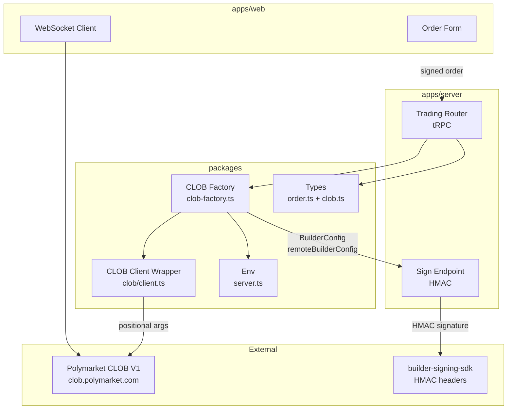
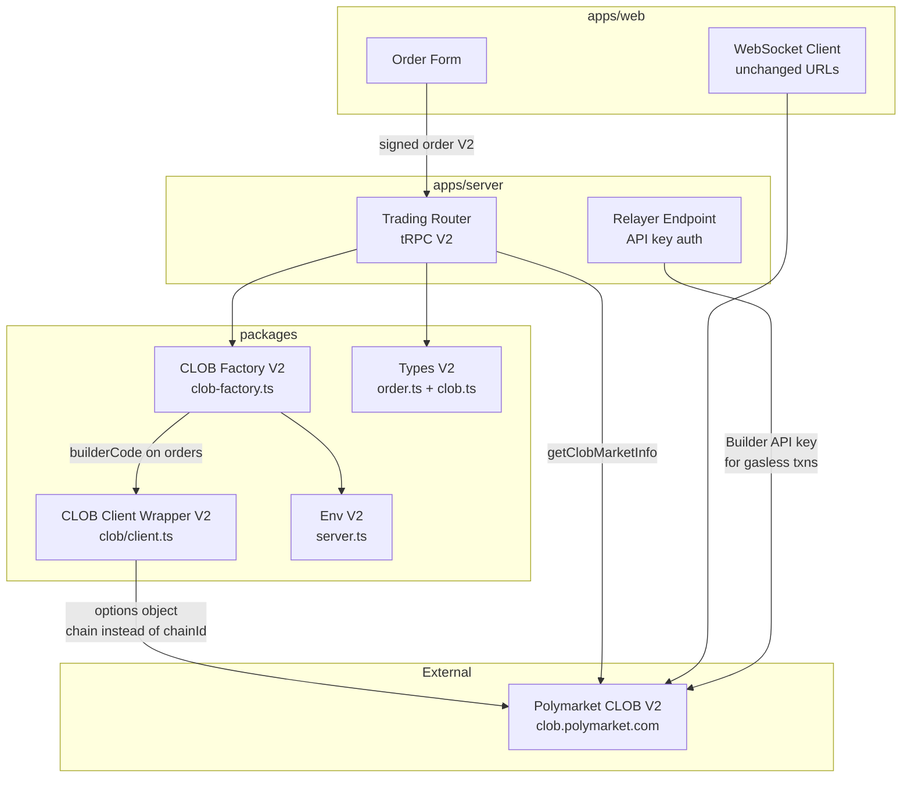
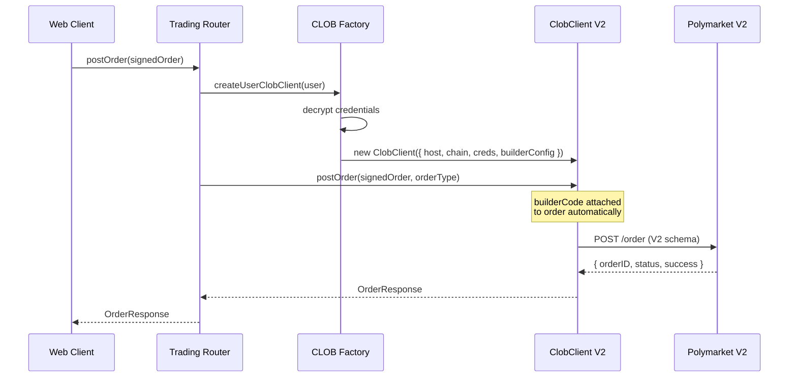
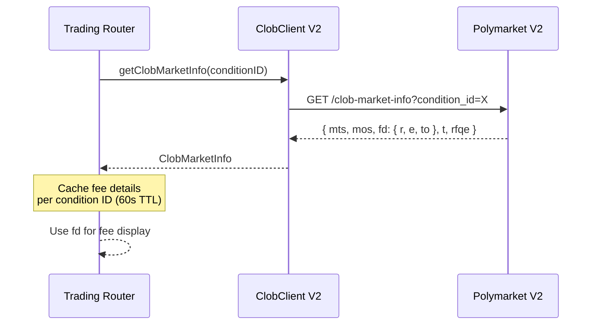
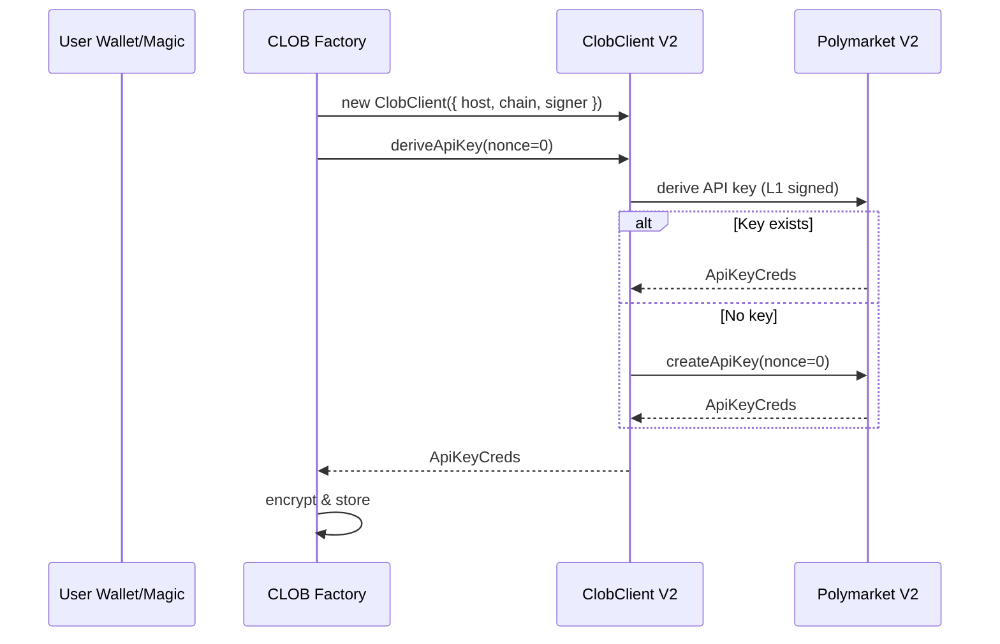

# Design Document: CLOB V2 Migration

## Overview

This migration upgrades Doji's Polymarket integration from CLOB V1 (`@polymarket/clob-client`) to CLOB V2 (`@polymarket/clob-client-v2`). The V2 protocol introduces breaking changes across the SDK constructor, order schema, fee model, builder program, collateral token, and EIP-712 domain — all coordinated around Polymarket's go-live on April 28, 2026 (~11:00 UTC) with approximately 1 hour of downtime during which all open orders are wiped.

The migration touches every layer of the trading stack: shared types (`@doji/types`), the CLOB client wrapper (`packages/api`), the server-side factory and trading router (`apps/server`), the builder sign endpoint, and environment configuration. The client-side web app requires minimal changes since order signing is already delegated to the server, and WebSocket payloads remain largely unchanged.

The design prioritizes a clean cutover approach — V1 code is replaced in-place rather than maintaining dual-version support — since Polymarket's V1 endpoints will be permanently decommissioned at go-live. A feature flag (`CLOB_V2_ENABLED`) gates the rollout for pre-go-live testing against V2 staging endpoints.

## Architecture

### Before (V1)



### After (V2)



## Sequence Diagrams

### Order Creation Flow (V2)



### Fee Query Flow (V2)



### Credential Derivation Flow (V2)



## Components and Interfaces

### Component 1: CLOB Client Wrapper V2

**Purpose**: Wraps `@polymarket/clob-client-v2` ClobClient, extending it with Doji-specific endpoints (builder operations, simplified markets). Adapts the V2 options-object constructor.

**Interface**:

```typescript
interface ClobClientConfigV2 {
  host: string;
  chain: number;                          // renamed from chainId
  signer?: Wallet | JsonRpcSigner;
  signerAddress?: string;
  creds?: ApiKeyCreds;
  signatureType?: SignatureType;
  funderAddress?: string;
  useServerTime?: boolean;
  builderConfig?: { builderCode: string }; // new shape — bytes32 hex
  retryOnError?: boolean;
  throwOnError?: boolean;
}

interface DojiClobClientV2 {
  // Inherited from BaseClobClient V2
  postOrder(order: SignedOrderV2, orderType: OrderType): Promise<OrderResponse>;
  cancelOrder(orderId: string): Promise<CancelOrdersResponse>;
  cancelAll(): Promise<CancelOrdersResponse>;
  cancelMarketOrders(params: OrderMarketCancelParams): Promise<CancelOrdersResponse>;
  getOpenOrders(params?: OpenOrderParams): Promise<OpenOrder[]>;
  getOrderBook(tokenId: string): Promise<OrderBookSummary>;
  getClobMarketInfo(conditionId: string): Promise<ClobMarketInfo>;
  
  // Doji extensions
  getBuilderOperations(): Promise<unknown[]>;
  postBuilderOperation(operation: Record<string, unknown>): Promise<unknown>;
  getSimplifiedMarketByConditionId(conditionId: string): Promise<unknown>;
}

function createClobClient(config: ClobClientConfigV2): DojiClobClientV2;
```

**Responsibilities**:

- Translate Doji config into V2 SDK options object
- Provide address-only signer fallback for server-side L2 operations
- Extend base client with builder-operations and simplified-market endpoints
- Normalize credential format (key/apiKey compat)

### Component 2: CLOB Factory V2

**Purpose**: Creates per-user and read-only ClobClient instances with decrypted credentials, Safe funder address, and V2 builder config.

**Interface**:

```typescript
function createUserClobClient(user: UserWithCredentials): DojiClobClientV2;
function createUserClobClientForQueries(user: UserWithCredentials): DojiClobClientV2;
function deriveUserCredentials(signer: Wallet | JsonRpcSigner): Promise<string>;
```

**Responsibilities**:

- Decrypt user credentials from DB (AES)
- Construct V2 client with `builderConfig: { builderCode }` instead of remote HMAC signing
- Omit builderConfig for query-only clients (prevents returning all builder-attributed orders)
- Derive/create API credentials for new users via V2 SDK

### Component 3: Trading Router V2

**Purpose**: tRPC procedures for all CLOB operations, updated for V2 fee model and order schema.

**Responsibilities**:

- Query fees via `getClobMarketInfo()` instead of embedding in orders
- Pass `userUSDCBalance` on market buy orders for fee-adjusted fill amounts
- Remove `feeRateBps` from order creation inputs
- Add `getClobMarketInfo` procedure for client-side fee display
- Maintain error mapping (geo-blocking, invalid signature, etc.)

### Component 4: Builder Sign Endpoint (Simplified)

**Purpose**: In V2, HMAC signing is no longer needed for order attribution. The sign endpoint is simplified to only handle Relayer gasless transactions (which still use Builder API key auth).

**Responsibilities**:

- Remove `buildHmacSignature` logic for order attribution
- Retain Builder API key credentials for Relayer operations only
- Simplify or deprecate the `/api/polymarket/sign` endpoint

## Data Models

### SignedOrderV2

```typescript
interface SignedOrderV2 {
  // Retained from V1
  expiration: string;
  maker: string;
  makerAmount: string;
  salt: string;
  side: 0 | 1;
  signature: string;
  signatureType: number;
  signer: string;
  takerAmount: string;
  tokenId: string;

  // NEW in V2
  timestamp: string;           // milliseconds since epoch
  metadata?: string;           // optional order metadata
  builder?: string;            // builderCode (bytes32 hex)

  // REMOVED from V1 (do NOT include)
  // nonce: string;            — removed
  // feeRateBps: string;       — removed (protocol-set at match time)
  // taker: string;            — removed
}
```

**Validation Rules**:

- `timestamp` must be a valid millisecond epoch string, not older than 5 minutes
- `signature` must be valid EIP-712 signature with Exchange domain version "2"
- `builder` if present must be a valid bytes32 hex string (66 chars with 0x prefix)
- `side` must be 0 (BUY) or 1 (SELL)
- `makerAmount` and `takerAmount` must be positive numeric strings

### UserOrderV2

```typescript
interface UserOrderV2 {
  tokenID: string;
  price: number;
  size: number;
  side: Side;
  expiration?: number;
  builderCode?: string;        // optional bytes32 hex

  // REMOVED from V1
  // nonce?: number;           — removed
  // feeRateBps?: number;      — removed
  // taker?: string;           — removed
}
```

### ClobMarketInfo

```typescript
interface ClobMarketInfo {
  mts: string;                 // min tick size
  mos: string;                 // min order size
  fd: {                        // fee details
    r: string;                 // fee rate
    e: string;                 // fee exponent
    to: string;                // fee token
  };
  t: Array<{                   // tokens
    token_id: string;
    outcome: string;
  }>;
  rfqe: boolean;               // RFQ enabled
}
```

### BuilderConfigV2

```typescript
// V1 (being removed)
interface BuilderConfigV1 {
  localBuilderCreds?: BuilderApiKeyCreds;
  remoteBuilderConfig?: { url: string; token?: string };
}

// V2 (replacement)
interface BuilderConfigV2 {
  builderCode: string;         // bytes32 hex string
}
```

### Environment Variables (Changes)

```typescript
// NEW
POLY_BUILDER_CODE: z.string().regex(/^0x[a-fA-F0-9]{64}$/).optional();

// RETAINED (for Relayer gasless transactions)
POLYMARKET_BUILDER_ID: z.string().min(1);

// POTENTIALLY DEPRECATED (evaluate if Relayer still needs them)
POLYMARKET_BUILDER_SIGNING_KEY: z.string().min(1);
POLYMARKET_BUILDER_PASSPHRASE: z.string().min(1);
```

## Key Functions with Formal Specifications

### Function 1: createClobClient()

```typescript
function createClobClient(config: ClobClientConfigV2): DojiClobClientV2
```

**Preconditions:**

- `config.host` is a valid URL string, non-empty
- `config.chain` is a valid chain ID (137 for Polygon, 80002 for Amoy)
- If `config.signer` is provided, it implements ethers Signer interface
- If `config.creds` is provided, it has non-empty `key`, `secret`, `passphrase`
- If `config.builderConfig` is provided, `builderCode` is a valid bytes32 hex string

**Postconditions:**

- Returns a DojiClobClientV2 instance
- Client is configured with options-object constructor (not positional args)
- `chain` field is used (not `chainId`)
- If `signerAddress` provided without `signer`, an address-only signer is created
- `throwOnError` defaults to `true`

**Loop Invariants:** N/A

### Function 2: createUserClobClient()

```typescript
function createUserClobClient(user: UserWithCredentials): DojiClobClientV2
```

**Preconditions:**

- `user.safeAddress` is non-null (user has deployed Gnosis Safe)
- `user.encryptedCreds` is non-null (user has derived CLOB credentials)
- `user.walletAddress` is a valid Ethereum address
- `CREDENTIAL_ENCRYPTION_KEY` env var is a 64-char hex string
- `POLY_BUILDER_CODE` env var is set (for order attribution)

**Postconditions:**

- Returns a DojiClobClientV2 with decrypted credentials
- `builderConfig` is `{ builderCode: env.POLY_BUILDER_CODE }` (not remote HMAC)
- `signatureType` is 2 (Gnosis Safe)
- `funderAddress` is `user.safeAddress`
- `useServerTime` is `true`
- No network calls to sign endpoint are made for builder attribution

**Loop Invariants:** N/A

### Function 3: getClobMarketInfo()

```typescript
async function getClobMarketInfo(conditionId: string): Promise<ClobMarketInfo>
```

**Preconditions:**

- `conditionId` is a valid condition ID string (hex)
- CLOB client is initialized and connected

**Postconditions:**

- Returns `ClobMarketInfo` with fee details (`fd`), tick size (`mts`), min order size (`mos`)
- Result is cacheable (fee details change infrequently)
- If condition ID is invalid, throws descriptive error

**Loop Invariants:** N/A

### Function 4: migrateSignedOrder() (type-level migration helper)

```typescript
function toSignedOrderV2(v1: SignedOrderV1): SignedOrderV2
```

**Preconditions:**

- `v1` is a valid V1 SignedOrder with all required fields
- `v1.nonce`, `v1.feeRateBps`, `v1.taker` are present (V1 fields)

**Postconditions:**

- Returns SignedOrderV2 without `nonce`, `feeRateBps`, `taker`
- `timestamp` is set to current time in milliseconds
- All other fields are preserved unchanged
- `builder` is set if builderCode is configured

**Loop Invariants:** N/A

## Algorithmic Pseudocode

### Migration Algorithm: Package Swap

```typescript
// Step 1: Update package.json across all workspaces
// packages/api/package.json:
//   "@polymarket/clob-client": "^5.8.1" → "@polymarket/clob-client-v2": "^1.x.x"
// apps/server/package.json:
//   Remove "@polymarket/builder-signing-sdk": "^1.0.0"
// apps/web/package.json:
//   Remove "@polymarket/builder-signing-sdk": "^1.0.0"
//   Remove "@polymarket/builder-relayer-client": "^0.0.8"

// Step 2: Update all imports
// BEFORE:
import { ClobClient } from "@polymarket/clob-client";
import { BuilderConfig } from "@polymarket/builder-signing-sdk";
import { buildHmacSignature } from "@polymarket/builder-signing-sdk";

// AFTER:
import { ClobClient } from "@polymarket/clob-client-v2";
// BuilderConfig is now a simple { builderCode: string } — no SDK needed
// buildHmacSignature is removed entirely
```

### Migration Algorithm: Client Construction

```typescript
// BEFORE (V1 — positional args):
const client = new ClobClient(
  host,        // arg 1
  chainId,     // arg 2
  signer,      // arg 3
  creds,       // arg 4
  sigType,     // arg 5
  funder,      // arg 6
  geoToken,    // arg 7
  useServerTime, // arg 8
  builderConfig, // arg 9 (BuilderConfig from SDK)
  undefined,   // arg 10
  retryOnError,// arg 11
  undefined,   // arg 12
  true         // arg 13 (throwOnError)
);

// AFTER (V2 — options object):
const client = new ClobClient({
  host,
  chain: chainId,              // renamed: chainId → chain
  signer,
  creds,
  signatureType: sigType,
  funderAddress: funder,
  useServerTime,
  builderConfig: {
    builderCode: process.env.POLY_BUILDER_CODE,  // new shape
  },
  retryOnError,
  throwOnError: true,
});
```

**Preconditions:**

- V2 SDK is installed and importable
- `POLY_BUILDER_CODE` env var is set
- All existing config values are valid for V2

**Postconditions:**

- Client connects to same CLOB host
- Builder attribution uses `builderCode` field on orders (not HMAC headers)
- All L2 operations (post, cancel) work with new constructor

### Migration Algorithm: Order Schema

```typescript
// BEFORE (V1 SignedOrder):
const v1Order: SignedOrderV1 = {
  expiration: "1714000000",
  feeRateBps: "100",          // ← REMOVED in V2
  maker: "0xabc...",
  makerAmount: "55000000",
  nonce: "12345",             // ← REMOVED in V2
  salt: "0xdef...",
  side: 0,
  signature: "0x...",
  signatureType: 2,
  signer: "0xabc...",
  taker: "0x000...000",      // ← REMOVED in V2
  takerAmount: "100000000",
  tokenId: "0x123...",
};

// AFTER (V2 SignedOrder):
const v2Order: SignedOrderV2 = {
  expiration: "1714000000",
  maker: "0xabc...",
  makerAmount: "55000000",
  salt: "0xdef...",
  side: 0,
  signature: "0x...",         // EIP-712 domain version "2"
  signatureType: 2,
  signer: "0xabc...",
  takerAmount: "100000000",
  tokenId: "0x123...",
  timestamp: "1714000000000", // ← NEW (milliseconds)
  builder: "0x...",           // ← NEW (optional builderCode)
};
```

### Migration Algorithm: Fee Model

```typescript
// BEFORE (V1 — fees embedded in order):
const order = await client.createOrder({
  tokenID,
  price: 0.55,
  size: 100,
  side: Side.BUY,
  feeRateBps: 100,            // ← embedded in signed order
});

// AFTER (V2 — fees queried separately):
const marketInfo = await client.getClobMarketInfo(conditionId);
// marketInfo.fd = { r: "100", e: "6", to: "0x..." }
// Fee is protocol-set at match time — NOT in the order

const order = await client.createOrder({
  tokenID,
  price: 0.55,
  size: 100,
  side: Side.BUY,
  // No feeRateBps — protocol handles fees
});

// For market buy orders, pass userUSDCBalance for fee-adjusted fill:
const order = await client.createMarketBuyOrder({
  tokenID,
  amount: 100,
  side: Side.BUY,
  userUSDCBalance: 500,       // ← NEW: enables fee-adjusted fill calculation
});
```

### Migration Algorithm: Builder Program

```typescript
// BEFORE (V1 — HMAC signing via remote endpoint):
import { BuilderConfig } from "@polymarket/builder-signing-sdk";
import { buildHmacSignature } from "@polymarket/builder-signing-sdk";

const builderConfig = new BuilderConfig({
  remoteBuilderConfig: {
    url: `${env.SERVER_URL}/api/polymarket/sign`,
    token: signToken,
  },
});
// Every order request → sign endpoint → HMAC headers attached

// AFTER (V2 — builderCode on orders):
const builderConfig = {
  builderCode: env.POLY_BUILDER_CODE,  // bytes32 hex, set once
};
// builderCode is attached to each order automatically by SDK
// No HMAC signing, no remote sign endpoint needed for attribution
```

## Example Usage

### Creating a V2 Read-Only Client

```typescript
import { createClobClient } from "@doji/api/lib/clob";
import { env } from "@doji/env/server";

const readOnlyClient = createClobClient({
  host: env.CLOB_API_URL,
  chain: env.CHAIN_ID,
});

const orderbook = await readOnlyClient.getOrderBook(tokenId);
const marketInfo = await readOnlyClient.getClobMarketInfo(conditionId);
```

### Creating a V2 User Client (Server-Side)

```typescript
import { createUserClobClient } from "@doji/api/lib/clob-factory";

const client = createUserClobClient({
  safeAddress: user.safeAddress,
  encryptedCreds: user.encryptedCreds,
  walletAddress: user.walletAddress,
});

// Post a pre-signed order (L2)
const result = await client.postOrder(signedOrder, "GTC");

// Cancel an order
await client.cancelOrder(orderId);
```

### Querying V2 Fee Information

```typescript
// In trading router — new procedure
const marketInfo = await client.getClobMarketInfo(conditionId);

const feeRate = marketInfo.fd.r;       // e.g. "100" (basis points)
const minTickSize = marketInfo.mts;     // e.g. "0.01"
const minOrderSize = marketInfo.mos;    // e.g. "5"
const rfqEnabled = marketInfo.rfqe;     // boolean
```

### V2 Order Form Input (No Fee Embedding)

```typescript
// Client-side order creation — feeRateBps no longer needed
const userOrder: UserOrderV2 = {
  tokenID: market.tokenId,
  price: 0.55,
  size: 100,
  side: Side.BUY,
  expiration: Math.floor(Date.now() / 1000) + 86400, // 24h
  // builderCode is set by the SDK via builderConfig, not by the user
};

const signedOrder = await client.createOrder(userOrder);
const result = await client.postOrder(signedOrder, OrderType.GTC);
```

## Correctness Properties

*A property is a characteristic or behavior that should hold true across all valid executions of a system — essentially, a formal statement about what the system should do. Properties serve as the bridge between human-readable specifications and machine-verifiable correctness guarantees.*

### Property 1: V2 order field exclusion

*For any* order created through the V2 code path (regardless of side, order type, or market), the signed order payload SHALL NOT contain `nonce`, `feeRateBps`, or `taker` keys. No order creation function SHALL accept `feeRateBps` as an input parameter.

**Validates: Requirements 1.2, 3.2, 4.3**

### Property 2: Timestamp freshness

*For any* V2 order created by the CLOB_Client_Wrapper, the `timestamp` field SHALL be a valid numeric string representing milliseconds since epoch, and the value SHALL be within 5 minutes of the current server time (`Date.now()`).

**Validates: Requirements 3.1, 3.4**

### Property 3: Builder attribution consistency

*For any* order posted via a client created by `createUserClobClient` when `POLY_BUILDER_CODE` is set, the `builder` field on the order SHALL equal `env.POLY_BUILDER_CODE`. The `builderConfig` passed to the SDK SHALL be `{ builderCode: env.POLY_BUILDER_CODE }`.

**Validates: Requirements 3.3, 5.1**

### Property 4: Constructor options shape

*For any* call to `createClobClient`, the underlying V2 SDK ClobClient SHALL be constructed with a single options object (not positional arguments), and the chain identifier SHALL be passed as the `chain` field, never as `chainId`.

**Validates: Requirements 2.1, 2.2**

### Property 5: Builder code format validation

*For any* string value used as a builder code (whether from `POLY_BUILDER_CODE` env var, `builderConfig.builderCode`, or the `builder` field on an order), only strings matching the pattern `^0x[a-fA-F0-9]{64}$` SHALL be accepted. All other strings SHALL be rejected with a descriptive validation error.

**Validates: Requirements 3.5, 5.5, 6.1**

### Property 6: Query client omits builder config

*For any* client created by `createUserClobClientForQueries`, the client configuration SHALL NOT include a `builderConfig` property, preventing the client from returning all builder-attributed orders.

**Validates: Requirements 5.2**

### Property 7: Credential encryption round-trip

*For any* valid `ApiKeyCreds` object (with non-empty `key`, `secret`, `passphrase`), encrypting with AES using `CREDENTIAL_ENCRYPTION_KEY` and then decrypting SHALL produce an object equivalent to the original credentials. Existing V1-encrypted credentials SHALL decrypt successfully in the V2 factory.

**Validates: Requirements 7.1**

### Property 8: Credential normalization

*For any* credentials object that uses either `apiKey` or `key` as the field name for the API key, `normalizeCreds` SHALL produce an object with non-empty `key`, `secret`, and `passphrase` fields.

**Validates: Requirements 7.4**

## Error Handling

### Error Scenario 1: V2 SDK Not Available Pre-Go-Live

**Condition**: Migration code is deployed before Polymarket V2 endpoints are live
**Response**: Feature flag `CLOB_V2_ENABLED` gates all V2 code paths; when disabled, V1 paths are used
**Recovery**: Toggle flag off to revert to V1 behavior instantly

### Error Scenario 2: Invalid Builder Code

**Condition**: `POLY_BUILDER_CODE` env var is missing or malformed (not valid bytes32 hex)
**Response**: Throw descriptive error at client construction time with validation message
**Recovery**: Set correct `POLY_BUILDER_CODE` in environment; orders without builder attribution still work (attribution is optional)

### Error Scenario 3: Stale Fee Cache

**Condition**: `getClobMarketInfo()` returns outdated fee details after Polymarket updates fee structure
**Response**: Cache TTL of 60 seconds limits staleness; fee display may be briefly inaccurate
**Recovery**: Cache auto-expires; manual cache invalidation available via admin procedure

### Error Scenario 4: Order Rejected — V1 Fields Present

**Condition**: A code path accidentally includes `nonce`, `feeRateBps`, or `taker` in a V2 order
**Response**: Polymarket V2 API rejects the order with a validation error
**Recovery**: TypeScript compiler catches this at build time via `SignedOrderV2` type (fields are absent, not optional)

### Error Scenario 5: Credential Derivation Failure on V2

**Condition**: `deriveOrCreateApiKey` fails against V2 endpoints (different API behavior)
**Response**: Existing derive-first-then-create pattern with NONCE_ALREADY_USED retry should work unchanged
**Recovery**: If V2 changes the derivation API, update `deriveOrCreateApiKey` to handle new error codes

### Error Scenario 6: Geo-Blocking / Regional Restrictions

**Condition**: Polymarket V2 maintains geo-blocking (unchanged from V1)
**Response**: Existing `mapApiErrorToTRPC` error mapping handles geo-block errors
**Recovery**: No change needed — error mapping is response-text based, not SDK-version specific

## Testing Strategy

### Unit Testing Approach

- **Type compatibility tests**: Verify `SignedOrderV2` excludes V1-only fields (`nonce`, `feeRateBps`, `taker`) at compile time
- **Client construction tests**: Verify `createClobClient` produces correct options-object shape with `chain` (not `chainId`)
- **Builder config tests**: Verify `builderConfig` shape is `{ builderCode }` not `{ remoteBuilderConfig }`
- **Fee model tests**: Verify no order creation function accepts `feeRateBps` parameter
- **Credential normalization tests**: Verify `normalizeCreds` handles both `key` and `apiKey` field names
- **Environment validation tests**: Verify `POLY_BUILDER_CODE` regex validation (bytes32 hex)

### Property-Based Testing Approach

**Property Test Library**: fast-check (already in devDependencies via Vitest ecosystem)

- **Order field exclusion property**: For any generated order input, the output `SignedOrderV2` never contains `nonce`, `feeRateBps`, or `taker` keys
- **Timestamp freshness property**: For any generated order, `timestamp` is within 5 minutes of `Date.now()`
- **Builder code format property**: For any `builderCode` value passed to config, it matches `/^0x[a-fA-F0-9]{64}$/`
- **Round-trip credential property**: For any `ApiKeyCreds`, `normalizeCreds(creds)` produces an object with non-empty `key`, `secret`, `passphrase`

### Integration Testing Approach

- **V2 staging endpoint tests**: Post orders to Polymarket V2 staging (pre-go-live) to verify end-to-end flow
- **Fee query integration**: Verify `getClobMarketInfo` returns valid `ClobMarketInfo` for known condition IDs
- **WebSocket compatibility**: Verify existing WebSocket subscriptions work unchanged against V2 endpoints
- **Credential derivation**: Verify `deriveOrCreateApiKey` works against V2 API

## Performance Considerations

- **Fee caching**: `getClobMarketInfo` results should be cached with 60-second TTL (LRU cache) to avoid per-order API calls. Fee details change infrequently.
- **Client reuse**: The read-only singleton pattern is preserved — one shared client for public queries, per-user clients created on-demand for authenticated operations.
- **No HMAC overhead**: Removing the remote sign endpoint call from the order posting hot path eliminates one network round-trip per order. Builder attribution is now a static field on the order.
- **Reduced dependencies**: Removing `@polymarket/builder-signing-sdk` and `@polymarket/builder-relayer-client` reduces bundle size and install time.

## Security Considerations

- **Builder code protection**: `POLY_BUILDER_CODE` is a server-side secret (not exposed to client). It identifies Doji as a builder for revenue sharing — leaking it allows others to attribute orders to Doji.
- **Credential encryption unchanged**: AES encryption of `ApiKeyCreds` in the database is unaffected by the migration. The credential shape is identical between V1 and V2.
- **Sign endpoint deprecation**: The HMAC sign endpoint (`/api/polymarket/sign`) should be deprecated and eventually removed. While active, it should retain Bearer token auth and timing-safe comparison.
- **EIP-712 domain change**: The Exchange domain version changes from "1" to "2" with new verifying contracts. Client-side signing code must use the correct domain — using V1 domain produces invalid signatures that V2 rejects.
- **Relayer API key**: Builder API key credentials (`POLYMARKET_BUILDER_ID`, etc.) are still needed for Relayer gasless transactions. These must remain server-side secrets.

## Dependencies

### New Dependencies

- `@polymarket/clob-client-v2` — V2 CLOB SDK (replaces `@polymarket/clob-client`)

### Removed Dependencies

- `@polymarket/clob-client` — V1 CLOB SDK
- `@polymarket/builder-signing-sdk` — HMAC signing (no longer needed for order attribution)
- `@polymarket/builder-relayer-client` — Relayer client (evaluate if V2 SDK includes this)

### Unchanged Dependencies

- `@ethersproject/providers` — ethers signers for L1 auth
- `@ethersproject/wallet` — Wallet type for credential derivation
- All other Doji packages (`@doji/types`, `@doji/env`, `@doji/logger`, etc.)
