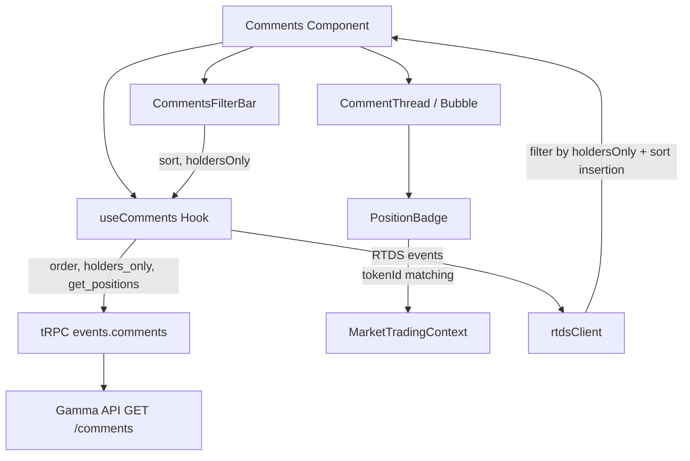

# Design Document: Comments Filter Bar

## Overview

This feature adds a filter/sort toolbar and position badges to the Comments tab on market pages. The toolbar provides sort (Newest / Most Liked) and filter (Holders only) controls that drive Gamma API query parameters. Position badges display next to commenter names showing their market position size and outcome, color-coded by side.

The implementation extends the existing `Comments` component and `useComments` hook with filter state management, passes new API parameters (`order`, `holders_only`, `get_positions`) to the tRPC `events.comments` procedure, and adds a `PositionBadge` component that matches token IDs from the API response against the current market's tokens via `MarketTradingContext`.

### Key Design Decisions

1. **Server-side filtering for holders**: The Gamma API supports `holders_only` natively, so we filter server-side rather than client-side. This reduces payload size and avoids fetching comments we'd discard.

2. **Server-side sorting**: The `order` parameter is passed to the API (`createdAt` or `reactionCount`) to avoid re-sorting potentially paginated results client-side.

3. **Position data always requested**: We always pass `get_positions: true` so badges are available regardless of the holders filter state (Requirement 3.7).

4. **Filter state in component**: Filter state lives in the `Comments` component via `useState` (not Zustand) since it's local to the comments section and doesn't need cross-component sharing. Sort/filter changes wrapped in `startTransition` per project conventions.

5. **Reuse existing toolbar patterns**: The filter bar uses the same `TradesFilterPill` chip pattern from the Trades tab toolbar for visual consistency.

## Architecture



### Data Flow

1. User interacts with `CommentsFilterBar` → updates local state (`sortMode`, `holdersOnly`)
2. State change triggers `useComments` re-fetch with new API params
3. API returns comments with position data (when `get_positions: true`)
4. Comments render with `PositionBadge` matching `profile.positions[].tokenId` against market token IDs from `useMarketTrading()`
5. Real-time RTDS comments are filtered/inserted according to current filter state

## Components and Interfaces

### CommentsFilterBar

```typescript
interface CommentsFilterBarProps {
  sortMode: SortMode;
  holdersOnly: boolean;
  onSortChange: (mode: SortMode) => void;
  onHoldersChange: (enabled: boolean) => void;
}

type SortMode = "newest" | "most_liked";
```

A horizontal toolbar rendered above the comment list. Uses `TradesFilterPill`-style chips for sort options and a checkbox-style pill for the holders filter.

### PositionBadge

```typescript
interface PositionBadgeProps {
  /** Position size as a string from the API (e.g. "354800.5") */
  positionSize: string;
  /** Token ID of the held position */
  tokenId: string;
  /** Yes token ID from the current market */
  yesTokenId: string;
  /** No token ID from the current market */
  noTokenId: string;
  /** Outcome label for Yes (e.g. "Yes", "Duke", "Over 145.5") */
  yesOutcomeLabel: string;
  /** Outcome label for No (e.g. "No", "UNC", "Under 145.5") */
  noOutcomeLabel: string;
}
```

A pill-shaped inline element showing formatted position size + outcome label. Green background for Yes-side positions, red for No-side.

### Updated useComments Hook

```typescript
interface UseCommentsOptions {
  sortMode: SortMode;
  holdersOnly: boolean;
}

interface UseCommentsResult {
  comments: Comment[];
  error: Error | null;
  isConnected: boolean;
  isLoading: boolean;
  refetch: () => void;
}
```

The hook accepts filter options and passes them as API parameters:
- `sortMode: "newest"` → `order: "createdAt", ascending: false`
- `sortMode: "most_liked"` → `order: "reactionCount", ascending: false`
- `holdersOnly: true` → `holders_only: true`
- Always passes `get_positions: true`

### Updated Comment Type

```typescript
export interface CommentPosition {
  tokenId: string | null;
  positionSize: string | null;
}

export interface Comment {
  // ... existing fields ...
  /** Positions held by the commenter (from get_positions API param) */
  positions: CommentPosition[];
}
```

### Position Matching Logic (Pure Function)

```typescript
interface MatchedPosition {
  side: "yes" | "no";
  size: number;
  outcomeLabel: string;
}

export function matchPosition(
  positions: CommentPosition[],
  yesTokenId: string,
  noTokenId: string,
  yesOutcomeLabel: string,
  noOutcomeLabel: string
): MatchedPosition | null;
```

Iterates through positions, returns the first match against the market's token IDs. Returns `null` if no position matches.

### Position Size Formatting (Pure Function)

```typescript
export function formatPositionSize(size: number): string;
```

Formats position size with compact suffixes: `354800` → `"354.8K"`, `1200000` → `"1.2M"`. Reuses the project's `formatCompactNumber` utility pattern.

## Data Models

### Gamma API Comment Response (with positions)

When `get_positions: true`, each comment's `profile` includes:

```typescript
{
  profile: {
    name: string | null;
    pseudonym: string | null;
    displayUsernamePublic: boolean | null;
    proxyWallet: string | null;
    profileImage: string | null;
    positions: Array<{
      tokenId: string | null;
      positionSize: string | null;  // numeric string, e.g. "354800.5"
    }>;
  }
}
```

### Filter State

```typescript
interface CommentsFilterState {
  sortMode: SortMode;      // "newest" | "most_liked"
  holdersOnly: boolean;    // maps to holders_only API param
}

const DEFAULT_FILTER_STATE: CommentsFilterState = {
  sortMode: "newest",
  holdersOnly: false,
};
```

### API Parameter Mapping

| Filter State | API Parameter | Value |
|---|---|---|
| `sortMode: "newest"` | `order` | `"createdAt"` |
| `sortMode: "most_liked"` | `order` | `"reactionCount"` |
| `holdersOnly: true` | `holders_only` | `true` |
| Always | `get_positions` | `true` |
| Always | `ascending` | `false` |


## Correctness Properties

*A property is a characteristic or behavior that should hold true across all valid executions of a system — essentially, a formal statement about what the system should do. Properties serve as the bridge between human-readable specifications and machine-verifiable correctness guarantees.*

### Property 1: Sort order invariant

*For any* list of comments and any valid sort mode ("newest" or "most_liked"), applying the sort function SHALL produce a list ordered by the corresponding field (`createdAt` timestamp descending for "newest", `reactionCount` descending for "most_liked"), and the output list SHALL contain exactly the same elements as the input.

**Validates: Requirements 1.2, 1.3**

### Property 2: Position matching correctness

*For any* comment with a positions array and any pair of market token IDs (yesTokenId, noTokenId), the `matchPosition` function SHALL return `{ side: "yes", ... }` when a position's tokenId equals yesTokenId, `{ side: "no", ... }` when it equals noTokenId, and `null` when no position's tokenId matches either market token ID. The returned `outcomeLabel` SHALL correspond to the matched side.

**Validates: Requirements 3.2, 3.3, 5.1, 5.2, 5.3, 5.4**

### Property 3: Position size formatting

*For any* non-negative numeric position size, `formatPositionSize` SHALL produce a string with the correct compact suffix: values ≥ 1,000,000 use "M", values ≥ 1,000 use "K", and values < 1,000 use no suffix. The numeric portion SHALL be parseable back to a value within rounding tolerance of the original.

**Validates: Requirements 3.4**

### Property 4: RTDS holder filtering

*For any* incoming RTDS comment and any holdersOnly filter state, when holdersOnly is true the comment SHALL be included in the displayed list if and only if its positions array contains a tokenId matching one of the current market's token IDs. When holdersOnly is false, all comments SHALL be included regardless of position data.

**Validates: Requirements 6.1, 6.3**

### Property 5: RTDS insertion maintains sort order

*For any* existing sorted comment list and any new comment arriving via RTDS, inserting the comment according to the current sort mode SHALL produce a list that remains sorted by the active sort field (createdAt or reactionCount) in descending order.

**Validates: Requirements 6.2**

## Error Handling

| Scenario | Handling |
|---|---|
| API returns error on filter change | Display `InlineQueryError` with retry button (existing pattern). Filter bar remains interactive with current state. |
| API returns empty results with holders filter | Show existing `EmptyState` with adjusted copy: "No comments from holders yet." |
| Position data missing from API response | Treat commenter as non-holder. No badge displayed. Comment still shown (unless holdersOnly is active). |
| Invalid/null tokenId in position data | Skip that position entry in matching. If no valid positions match, no badge. |
| Invalid/null positionSize in position data | Skip badge display for that position (cannot format null). |
| RTDS comment arrives during re-fetch | Existing dedup logic in `appendComment` prevents duplicates. New comment respects current filter state. |
| Market trading context unavailable | Graceful degradation: no badges displayed, filter bar still functional for sort/holders API params. |

## Testing Strategy

### Property-Based Tests (fast-check)

The feature's pure logic functions are well-suited for property-based testing:

- **Library**: `fast-check` (already used in the project — see `tests/unit/`)
- **Minimum iterations**: 100 per property
- **Tag format**: `Feature: comments-filter-bar, Property {N}: {title}`

Target functions for PBT:
1. Sort logic (comment array sorting by mode)
2. `matchPosition` (position → market token matching)
3. `formatPositionSize` (numeric formatting)
4. RTDS comment filtering (holdersOnly logic)
5. RTDS sorted insertion

### Unit Tests (Example-Based)

- Filter bar renders with correct default state (sort: "newest", holders: unchecked)
- Filter bar displays both sort options
- Holders checkbox toggles correctly
- Position badge renders green for Yes, red for No
- Position badge not rendered when no position matches
- Badge visible regardless of holdersOnly state
- Filter bar remains interactive during loading
- API parameter mapping: sortMode → order param

### Integration Tests

- `useComments` hook re-fetches when sort mode changes
- `useComments` hook re-fetches when holdersOnly changes
- `useComments` hook always passes `get_positions: true`
- RTDS events respect current filter state
