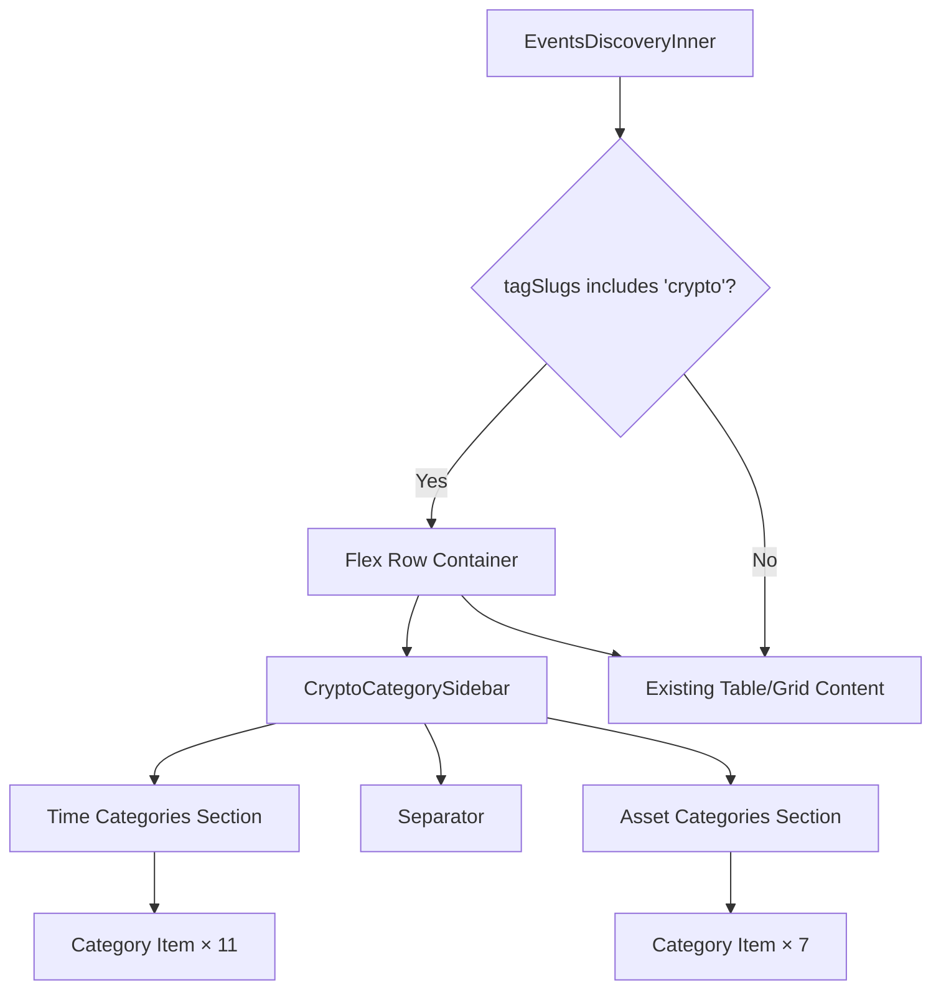

# Design Document: Crypto Category Sidebar

## Overview

The Crypto Category Sidebar adds a vertical navigation panel to the Explore page that appears exclusively when the Crypto topic tab is active. It provides two groups of filter categories — time-based (All, 5 Min, 15 Min, 1 Hour, 4 Hours, Daily, Weekly, Monthly, Yearly, Pre-Market, ETF) and asset-based (Bitcoin, Ethereum, Solana, XRP, Dogecoin, BNB, Microstrategy) — each with a Lucide icon, label, and live market count. Selecting a category applies client-side filtering on the already-fetched crypto events. The main content (table or card grid) shifts right via a flex layout to accommodate the sidebar.

The sidebar integrates with the existing `EventsDiscovery` component and URL state management. It uses the project's design system tokens throughout (Doji green active states, 6-size type scale, `font-normal`/`font-medium` only).

## Architecture

The sidebar is a client component (`CryptoCategorySidebar`) rendered conditionally inside `EventsDiscoveryInner` when the active topic tag slug is `"crypto"`. It sits in a horizontal flex container alongside the existing table/grid content.



### Data Flow

1. `EventsDiscovery` fetches crypto-tagged events via the existing `events.list` tRPC query (tag_slug = `"crypto"`)
2. The sidebar reads the full event list and computes market counts per category via client-side matching
3. When a user selects a category, the sidebar updates a URL search param (`crypto_cat`) via `window.history.replaceState`
4. `EventsDiscoveryInner` reads this param and applies an additional client-side filter on `displayEvents` before rendering

### Visibility Logic

The sidebar renders when all of these are true:
- `tagSlugs` contains `"crypto"` (the Crypto topic tab is active)
- `activeModeId` is `null` (a topic tag is selected, not a mode like Trending/New/All)
- Viewport width ≥ `sm` breakpoint (640px)

## Components and Interfaces

### New Components

#### `CryptoCategorySidebar` (`apps/web/src/components/explore/crypto-category-sidebar.tsx`)

Client component. Renders the sidebar panel with time and asset category lists.

```typescript
interface CryptoCategorySidebarProps {
  /** Currently selected crypto category slug, or null for "all" */
  activeCategorySlug: string | null;
  /** All crypto events from the current query (for computing counts) */
  events: Event[];
  /** Callback when user selects a category */
  onCategoryChange: (slug: string | null) => void;
}
```

#### `CryptoCategoryItem` (inline in same file)

Renders a single row: icon + label + count. Handles active/hover states.

```typescript
interface CryptoCategoryItemProps {
  active: boolean;
  count: number;
  icon: LucideIcon;
  label: string;
  onClick: () => void;
}
```

### Category Definitions

#### `CRYPTO_TIME_CATEGORIES` and `CRYPTO_ASSET_CATEGORIES` (`apps/web/src/components/explore/crypto-sidebar-constants.ts`)

Pure constant arrays defining the sidebar categories. Safe to import from Server Components (no React).

```typescript
import type { LucideIcon } from "lucide-react";

interface CryptoCategoryDef {
  /** Lucide icon component */
  icon: LucideIcon;
  /** Display label */
  label: string;
  /** Matcher: returns true if an event belongs to this category */
  match: (event: Event) => boolean;
  /** URL slug for this category */
  slug: string;
}
```

Time categories use question-text pattern matching (regex on market question strings) to classify events by resolution timeframe. Asset categories match on event/market tags or question text containing the asset name.

### Modified Components

#### `EventsDiscoveryInner` (in `events-discovery.tsx`)

Changes:
- Read `crypto_cat` from URL search params via `useExploreUrlState`
- When crypto sidebar is visible, wrap table/grid in a flex row with the sidebar
- Apply `filterByCryptoCategory(events, activeCryptoCategory)` before rendering
- Add `handleCryptoCategoryChange` callback that updates the `crypto_cat` URL param

#### `useExploreUrlState` (in `use-explore-url-state.ts`)

Add parsing of `crypto_cat` search param to the returned state object.

### Icon Mapping

| Category | Lucide Icon |
|----------|-------------|
| All | `LayoutGrid` |
| 5 Min | `Timer` |
| 15 Min | `Clock3` |
| 1 Hour | `Clock` |
| 4 Hours | `Clock4` |
| Daily | `CalendarDays` |
| Weekly | `CalendarRange` |
| Monthly | `Calendar` |
| Yearly | `CalendarClock` |
| Pre-Market | `Sunrise` |
| ETF | `Landmark` |
| Bitcoin | `Bitcoin` |
| Ethereum | `Hexagon` |
| Solana | `Sun` |
| XRP | `Droplets` |
| Dogecoin | `Dog` |
| BNB | `Diamond` |
| Microstrategy | `Building2` |

## Data Models

### URL State

A new optional search param `crypto_cat` is added to the explore URL:

```
/explore?tags=crypto&crypto_cat=bitcoin
/explore?tags=crypto&crypto_cat=5min
/explore?tags=crypto              (defaults to "all")
```

When the crypto tab is deselected, `crypto_cat` is removed from the URL.

### Category Matching

Each category definition includes a `match(event: Event): boolean` function:

- **Time categories**: Match against market question text patterns. For example, `"5min"` matches questions containing "5 minute" or "5-minute" or "5 min". `"etf"` matches questions containing "ETF". `"pre-market"` matches questions containing "pre-market" or "premarket".
- **Asset categories**: Match against event tags (slug contains the asset name) or market question text containing the asset name (e.g., "Bitcoin", "BTC", "Ethereum", "ETH").
- **"All"**: Always returns `true` (shows all crypto events).

### Market Count Computation

Counts are computed client-side by iterating over the fetched crypto events and running each category's `match` function. This is memoized with `useMemo` keyed on the events array reference.

```typescript
const categoryCounts = useMemo(() => {
  const counts: Record<string, number> = {};
  for (const cat of [...CRYPTO_TIME_CATEGORIES, ...CRYPTO_ASSET_CATEGORIES]) {
    counts[cat.slug] = events.filter(cat.match).length;
  }
  counts["all"] = events.length;
  return counts;
}, [events]);
```


## Correctness Properties

*A property is a characteristic or behavior that should hold true across all valid executions of a system — essentially, a formal statement about what the system should do. Properties serve as the bridge between human-readable specifications and machine-verifiable correctness guarantees.*

### Property 1: Sidebar visibility is determined solely by the crypto tag

*For any* tag slug string, the sidebar visibility function should return `true` if and only if the slug is `"crypto"`. For any mode category ID (trending, new, all) with no topic tag, the sidebar should not be visible.

**Validates: Requirements 1.1, 1.2, 1.3, 1.4**

### Property 2: Category filtering returns exactly matching events

*For any* array of crypto events and *for any* category definition (time or asset), filtering the events by that category should return exactly the subset of events for which the category's `match` function returns `true`. No matching events should be excluded, and no non-matching events should be included.

**Validates: Requirements 3.3, 4.3, 10.1, 10.2, 10.3**

### Property 3: Market counts equal the number of matching events

*For any* array of crypto events and *for any* category (including "All"), the computed market count for that category should equal the number of events in the array for which the category's `match` function returns `true`. For the "All" category specifically, the count should equal the total length of the events array.

**Validates: Requirements 3.2, 6.2**

### Property 4: Single selection invariant

*For any* sequence of category selections starting from the initial state ("all"), exactly one category should be active at any point. Selecting a new category should deactivate the previously active category.

**Validates: Requirements 8.1, 8.2**

### Property 5: Toggle-to-reset behavior

*For any* active category that is not "all", selecting that same category again should reset the active category to "all".

**Validates: Requirements 8.3**

## Error Handling

| Scenario | Handling |
|----------|----------|
| No events match selected category | Display empty state message within the table/grid area. Sidebar remains visible with count showing `0`. |
| Events query fails | Sidebar does not render (no events to count). Existing explore error handling applies. |
| Invalid `crypto_cat` URL param | Treat as "all" — ignore unrecognized slugs and default to showing all crypto events. |
| Category match function throws | Wrap match calls in try-catch; treat errors as non-match (event excluded from that category). Log warning. |

## Testing Strategy

### Unit Tests

- Verify `CRYPTO_TIME_CATEGORIES` has exactly 11 entries in the specified order (All, 5 Min, 15 Min, 1 Hour, 4 Hours, Daily, Weekly, Monthly, Yearly, Pre-Market, ETF)
- Verify `CRYPTO_ASSET_CATEGORIES` has exactly 7 entries in the specified order (Bitcoin, Ethereum, Solana, XRP, Dogecoin, BNB, Microstrategy)
- Verify each category definition has a non-empty `slug`, `label`, `icon`, and `match` function
- Verify the default active category is "all" when no `crypto_cat` param is present
- Verify the sidebar visibility function returns `false` for each mode category (trending, new, all)
- Verify empty state is shown when filter returns zero events

### Property-Based Tests

Use `fast-check` (already available in the project's Vitest setup) for property-based testing. Each test should run a minimum of 100 iterations.

- **Feature: crypto-category-sidebar, Property 1: Sidebar visibility is determined solely by the crypto tag** — Generate random tag slug strings and verify the visibility function returns `true` only for `"crypto"`.
- **Feature: crypto-category-sidebar, Property 2: Category filtering returns exactly matching events** — Generate random arrays of mock events (with varied question text and tags) and random category selections. Verify the filter output matches the expected subset.
- **Feature: crypto-category-sidebar, Property 3: Market counts equal the number of matching events** — Generate random event arrays and verify computed counts match manual counting via the match function for each category.
- **Feature: crypto-category-sidebar, Property 4: Single selection invariant** — Generate random sequences of category slug selections and simulate the state machine. After each selection, verify exactly one category is active.
- **Feature: crypto-category-sidebar, Property 5: Toggle-to-reset behavior** — Generate random non-"all" category slugs, simulate selecting them twice, and verify the state resets to "all".

Property tests validate the pure logic (visibility, filtering, counting, selection state). Unit tests cover specific examples, constant ordering, and edge cases. Together they provide comprehensive coverage of the sidebar's functional requirements.
