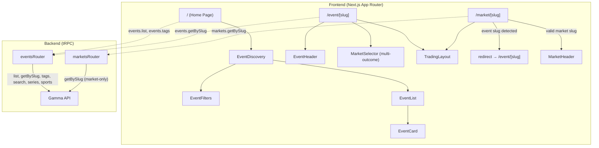

# Design Document: Event-Centric Navigation

## Overview

This design restructures the Poly app to align with Polymarket's canonical Event → Market → Token hierarchy. The core changes are:

1. Replace the flattened market-centric home page with an event-centric one
2. Add a new `/event/[slug]` route as the primary detail page
3. Clean up `/market/[slug]` to do market-only lookups with a redirect for event slugs
4. Rename components and routers to match the data model
5. Split the tRPC `marketsRouter` into `eventsRouter` + `marketsRouter`

The trading UI (Orderbook, OrderForm, PriceChart, OpenOrders) remains unchanged — it already operates on Market/Token data and will be composed within the new Event detail page.

## Architecture



### Route Structure

| Route | Purpose | Data Source |
|---|---|---|
| `/` | Home page — browse events | `events.list` + `events.tags` |
| `/event/[slug]` | Event detail — all markets + trading | `events.getBySlug` |
| `/market/[slug]` | Market detail — single market trading | `markets.getBySlug` (redirect if event slug) |

### Request Flow

1. Home page calls `events.list` → gets `Event[]` with nested `Market[]` → renders `EventCard` per event
2. User clicks EventCard → navigates to `/event/{slug}`
3. Event detail page calls `events.getBySlug` → gets single `Event` with all `Market[]`
4. For binary events: renders TradingLayout directly with the single market
5. For multi-outcome events: renders MarketSelector + TradingLayout for selected market
6. Old `/market/{event-slug}` links → 308 redirect to `/event/{slug}`

## Components and Interfaces

### New Components

#### EventCard (`apps/web/src/components/event/event-card.tsx`)

Replaces `MarketCard`. Accepts an `Event` instead of a `Market`.

```typescript
interface EventCardProps {
  event: Event;
}
```

Displays:
- Event image + title (not market question)
- For binary events: Yes/No prices from the single market
- For multi-outcome events: top outcomes with prices, "+N more" indicator
- Volume (summed across markets), end date
- Links to `/event/{event.slug}`

#### EventList (`apps/web/src/components/event/event-list.tsx`)

Replaces `MarketList`. Operates on `Event[]` directly — no `flattenMarkets`.

```typescript
interface EventListProps {
  initialEvents: Event[];
  initialOffset: number;
  tag: string | null;
  sort: string;
}
```

Infinite scroll loads more events via `events.list`. Each item is an `EventCard`.

#### EventDiscovery (`apps/web/src/components/event/event-discovery.tsx`)

Replaces `MarketDiscovery`. Composes `EventFilters` + `EventList`.

```typescript
interface EventDiscoveryProps {
  events: Event[];
  tags: Tag[];
  initialTag: string | null;
  initialOffset: number;
  sort: string;
}
```

#### EventFilters (`apps/web/src/components/event/event-filters.tsx`)

Replaces `MarketFilters`. Functionally identical — tag tabs, sort dropdown, search input. Renamed for consistency.

#### EventHeader (`apps/web/src/components/trading/event-header.tsx`)

New component for the event detail page header. Displays event-level info.

```typescript
interface EventHeaderProps {
  event: Event;
}
```

Displays: event title, description, image, aggregate volume, end date, market count.

#### MarketSelector (`apps/web/src/components/trading/market-selector.tsx`)

New component for multi-outcome events. Renders a selectable list/tabs of markets within an event.

```typescript
interface MarketSelectorProps {
  markets: Market[];
  selectedMarketId: string;
  onSelectMarket: (conditionId: string) => void;
}
```

Each item shows: market question, outcome prices. Clicking selects that market for the trading UI.

### Modified Components

#### TradingLayout (`apps/web/src/components/trading/trading-layout.tsx`)

No interface changes. Already accepts `Market` + `primaryTokenId`. Will be rendered by both the event detail page and the market detail page.

#### MarketHeader (`apps/web/src/components/trading/market-header.tsx`)

Kept as-is for the `/market/[slug]` route. The event detail page uses `EventHeader` instead.

### Removed Code

- `flattenMarkets()` function in `market-list.tsx` — no longer needed
- Old `MarketCard`, `MarketList`, `MarketDiscovery`, `MarketFilters` files — replaced by event equivalents
- Hacky event fallback in `getMarketBySlug` in `gamma.ts`

### tRPC Router Split

#### eventsRouter (`apps/server/src/routers/events.ts`)

```typescript
export const eventsRouter = router({
  list: publicProcedure.input(eventListInput).query(/* getEvents */),
  getBySlug: publicProcedure.input(slugInput).query(/* getEventBySlug */),
  search: publicProcedure.input(searchInput).query(/* searchMarkets */),
  tags: publicProcedure.query(/* getTags */),
  series: publicProcedure.query(/* getSeries */),
  sports: publicProcedure.query(/* getSportsMetadata */),
  publicProfile: publicProcedure.input(addressInput).query(/* getPublicProfile */),
});
```

#### marketsRouter (`apps/server/src/routers/markets.ts`)

Slimmed down to market-only operations:

```typescript
export const marketsRouter = router({
  getBySlug: publicProcedure.input(slugInput).query(/* getMarketBySlug — no event fallback */),
});
```

#### appRouter update (`apps/server/src/routers/index.ts`)

```typescript
export const appRouter = router({
  healthCheck: publicProcedure.query(() => "OK"),
  events: eventsRouter,
  markets: marketsRouter,
  data: dataRouter,
  bridge: bridgeRouter,
  clob: clobRouter,
});
```

## Data Models

No new types are needed. The existing types in `packages/types/src/market.ts` already model the hierarchy correctly:

- `Event` contains `markets: Market[]`
- `Market` contains `tokens: MarketToken[]`
- `Tag` is used for filtering

### Key Data Flows

#### Home Page Data Flow

```
events.list({ limit, offset, tag_slug, order }) → Event[]
  └─ Each Event has .slug, .title, .image, .markets[]
     └─ EventCard reads markets[] for outcome summary
```

#### Event Detail Data Flow

```
events.getBySlug({ slug }) → Event
  └─ Event.markets[] → determine binary vs multi-outcome
     ├─ Binary: markets[0] → TradingLayout(market, primaryTokenId)
     └─ Multi: MarketSelector → selected Market → TradingLayout(market, primaryTokenId)
```

#### Market Detail Data Flow (cleaned up)

```
markets.getBySlug({ slug }) → Market | 404
  ├─ Success: MarketHeader + TradingLayout
  └─ 404: try events.getBySlug → if found, redirect 308 to /event/{slug}
                                → if not found, 404 page
```

The redirect logic lives in the Next.js page component, not in the Gamma API wrapper. This keeps `getMarketBySlug` clean.

### Helper: isBinaryEvent

```typescript
function isBinaryEvent(event: Event): boolean {
  return event.markets.length === 1 
    && event.markets[0].tokens.length === 2 
    && !event.neg_risk;
}
```

This replaces the current `isBinary` check that operates on a single market. The event-level check accounts for the full hierarchy.


## Correctness Properties

*A property is a characteristic or behavior that should hold true across all valid executions of a system — essentially, a formal statement about what the system should do. Properties serve as the bridge between human-readable specifications and machine-verifiable correctness guarantees.*

### Property 1: EventList preserves event count

*For any* list of Events passed to EventList, the number of rendered EventCards SHALL equal the number of input Events (no flattening, no deduplication, no loss).

**Validates: Requirements 1.1**

### Property 2: EventCard renders event information correctly

*For any* Event (binary or multi-outcome), the EventCard SHALL render the event title and outcome prices appropriate to its type — Yes/No prices for binary events, and a summary of outcome prices across markets for multi-outcome events.

**Validates: Requirements 1.2, 1.3, 2.5**

### Property 3: Event links use event slug

*For any* Event with a non-empty slug, all links generated for that event (in EventCard, search results, etc.) SHALL have href equal to `/event/{event.slug}`.

**Validates: Requirements 1.4, 6.1**

### Property 4: Binary vs multi-outcome rendering

*For any* Event, the event detail page SHALL render MarketSelector if and only if the event has more than one market (multi-outcome). Equivalently, `isBinaryEvent(event)` returns true if and only if the event has exactly one market with two tokens and `neg_risk` is false.

**Validates: Requirements 2.2, 2.3**

### Property 5: Event slug redirect from market route

*For any* slug that resolves to an Event but not to a Market, navigating to `/market/{slug}` SHALL result in a redirect to `/event/{slug}`.

**Validates: Requirements 3.2, 7.1**

### Property 6: Event API responses contain nested markets

*For any* Event returned by `events.list` or `events.getBySlug`, the Event object SHALL contain a `markets` array, and each Market in that array SHALL contain a `tokens` array.

**Validates: Requirements 5.3, 5.4**

## Error Handling

### Event Detail Page (`/event/[slug]`)

- If `events.getBySlug` throws a 404, call `notFound()` to render the Next.js 404 page.
- If the slug is empty or `"undefined"`, call `notFound()` immediately (same pattern as current market page).

### Market Detail Page (`/market/[slug]`)

- If `markets.getBySlug` throws a 404:
  1. Try `events.getBySlug` with the same slug.
  2. If the event exists, `redirect("/event/{slug}", 308)`.
  3. If the event also 404s, call `notFound()`.
- This redirect logic lives in the Next.js page component, NOT in the Gamma API wrapper.

### Gamma API Wrapper

- `getMarketBySlug`: Remove the try/catch event fallback. Let 404s propagate as errors.
- `getEventBySlug`: No changes — already throws on 404.

### tRPC Router

- Rate limiting remains on all procedures (unchanged).
- Input validation via Zod schemas remains (unchanged).

## Testing Strategy

### Property-Based Testing

Use **fast-check** (already in the project) with **Vitest** for property-based tests.

Each property test:
- Runs minimum 100 iterations
- References its design document property in a comment tag
- Tag format: `Feature: event-centric-navigation, Property N: {property_text}`

Property tests focus on:
- `isBinaryEvent` helper logic (Property 4)
- EventCard link generation (Property 3)
- EventList count invariant (Property 1)
- Event data shape invariants (Property 6)
- Redirect logic (Property 5)

### Unit Testing

Unit tests complement property tests for specific examples and edge cases:
- Router structure verification (existing pattern in `router-structure.test.ts`)
- Input schema validation (existing pattern in `routers.test.ts`)
- 404 handling in event/market pages
- `getMarketBySlug` no longer falls back to event lookup
- EventCard rendering for specific known events (binary + multi-outcome examples)

### Test Organization

- `apps/server/src/routers/router-structure.test.ts` — update for new `events` router
- `apps/server/src/routers/routers.test.ts` — update schemas for split routers
- `apps/web/src/components/event/__tests__/` — new tests for EventCard, EventList
- `apps/web/src/lib/__tests__/` — tests for `isBinaryEvent` helper and redirect logic
