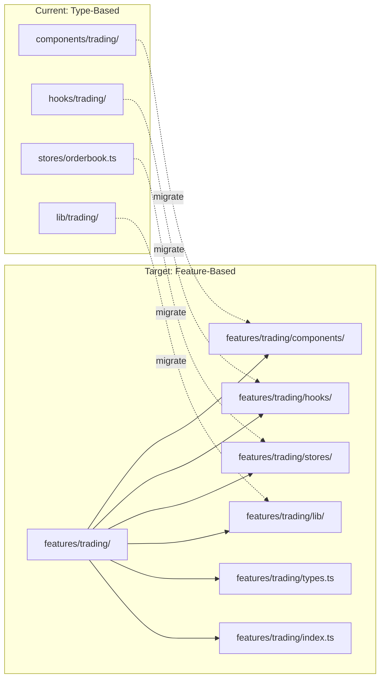
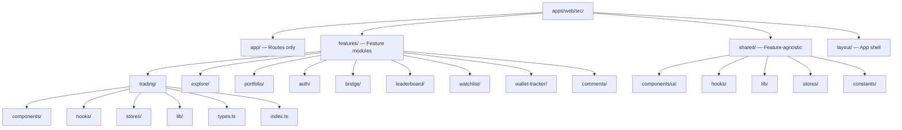
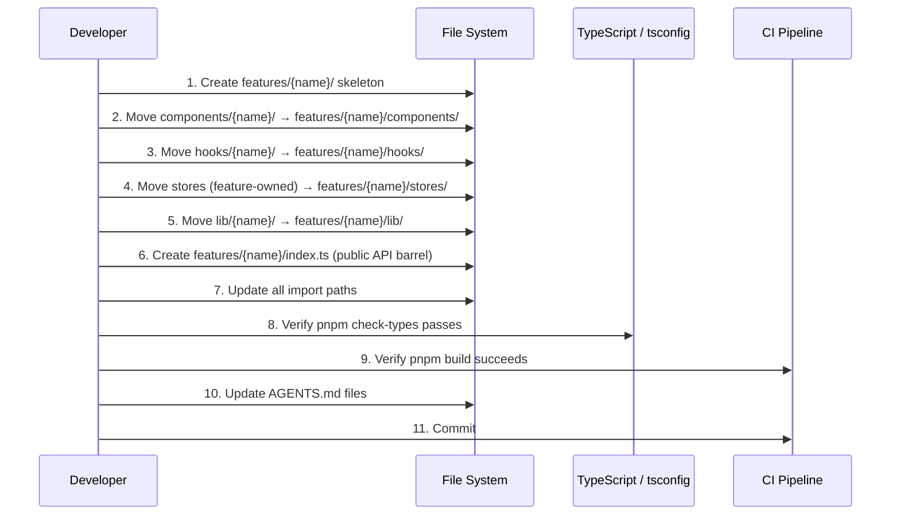

# Design Document: Feature-Based Structure Refactor

## Overview

This design covers the incremental migration of `apps/web/src/` from a type-based layout (components/, hooks/, stores/, lib/ at the top level, grouped by domain within each) to a feature-based layout where each feature module is self-contained. The goal is co-location: a feature's components, hooks, stores, lib, and types live together under `features/{name}/`, making ownership clear and reducing cross-directory navigation.

The migration must be incremental — one feature at a time — with the app remaining fully functional at every commit. The existing `@/*` import alias continues to work throughout, and a new set of feature-scoped aliases are introduced to enforce public API boundaries.

## Architecture

### Current vs Target Layout



### Target Directory Structure



### Migration Flow (Per Feature)



## Components and Interfaces

### Feature Module Structure

Each feature module follows a consistent internal structure:

```typescript
// features/{name}/index.ts — Public API barrel
// Only exports that other features or app/ routes need

export { TradingLayout } from "./components/trading-layout"
export { TradingLayoutTerminal } from "./components/trading-layout-terminal"
export { OrderForm } from "./components/orders/order-form"
export { Orderbook } from "./components/orderbook"
export type { TradingLayoutProps } from "./types"
```

**Responsibilities per directory:**

| Directory | Contents | Import Rule |
|-----------|----------|-------------|
| `components/` | React components (client + server) | Internal: direct import. External: via `index.ts` |
| `hooks/` | Custom React hooks | Internal: direct import. External: via `index.ts` |
| `stores/` | Zustand stores owned by this feature | Internal: direct import. External: via `index.ts` |
| `lib/` | Utilities, adapters, pure functions | Internal: direct import. External: via `index.ts` |
| `types.ts` | Feature-scoped TypeScript types | Internal: direct import. External: via `index.ts` |
| `index.ts` | Public API barrel (re-exports only) | The ONLY file other features may import from |

### Cross-Feature Import Rules

```typescript
// ✅ ALLOWED: Import from another feature's public API
import { Orderbook } from "@/features/trading"

// ✅ ALLOWED: Import from shared
import { Button } from "@/shared/components/ui/button"
import { useDebounce } from "@/shared/hooks/use-debounce"

// ✅ ALLOWED: Import from layout
import { AppShell } from "@/layout/app-shell"

// ❌ FORBIDDEN: Reach into another feature's internals
import { Orderbook } from "@/features/trading/components/orderbook"

// ❌ FORBIDDEN: Import from old type-based paths (after migration)
import { Orderbook } from "@/components/trading/orderbook"
```

### Shared Module Interface

```typescript
// shared/ — passes the "would I use this in a different app?" test

shared/
├── components/
│   └── ui/           // shadcn/ui components (Button, Input, Tooltip, etc.)
├── hooks/
│   ├── use-hydrated.ts
│   ├── use-sliding-tab-indicator.ts
│   ├── use-table-time-tick.ts
│   └── use-widget-resize.tsx
├── lib/
│   ├── trpc/         // tRPC client, query-client, types
│   ├── trpc-server.ts
│   ├── websocket/    // WebSocket client & schemas
│   ├── datadog/      // Datadog logger + RUM
│   ├── seo/          // SEO utilities
│   ├── server-cache.ts
│   ├── server-utils.ts
│   ├── api-queue.ts
│   ├── app-toast.ts
│   ├── infinite-query.ts
│   ├── notification-sound.ts
│   ├── session-manager.ts
│   └── table-formats.ts
├── stores/
│   ├── wallet.ts         // Auth/wallet state (used by all features)
│   ├── connection.ts     // WebSocket connection state
│   ├── notifications.ts  // Toast notifications
│   └── crypto-prices.ts  // Live crypto prices
├── constants/
│   ├── query.ts          // staleTime tiers
│   └── index.ts          // Web-only constants
└── utils/
    ├── cn.ts
    ├── format.ts
    ├── type-guards.ts
    ├── cached-storage.ts
    ├── extract-date-from-text.ts
    ├── profile.ts
    └── doji-green.ts
```

## Data Models

### Feature-to-File Mapping

This is the complete mapping of current files to their target feature module.

#### `features/trading/`

| Current Path | Target Path |
|-------------|-------------|
| `components/trading/*` | `features/trading/components/*` |
| `components/charts/*` | `features/trading/components/charts/*` |
| `components/market/*` | `features/trading/components/market/*` |
| `components/event/*` | `features/trading/components/event/*` |
| `hooks/trading/*` | `features/trading/hooks/*` |
| `hooks/realtime/use-live-trades.ts` | `features/trading/hooks/use-live-trades.ts` |
| `hooks/realtime/use-user-channel.ts` | `features/trading/hooks/use-user-channel.ts` |
| `hooks/sports/*` | `features/trading/hooks/sports/*` |
| `hooks/use-market-volume.ts` | `features/trading/hooks/use-market-volume.ts` |
| `hooks/use-prefetch-market.ts` | `features/trading/hooks/use-prefetch-market.ts` |
| `stores/orderbook.ts` | `features/trading/stores/orderbook.ts` |
| `stores/orders.ts` | `features/trading/stores/orders.ts` |
| `stores/positions.ts` | `features/trading/stores/positions.ts` |
| `stores/order-form.ts` | `features/trading/stores/order-form.ts` |
| `stores/market-volume.ts` | `features/trading/stores/market-volume.ts` |
| `stores/workspace-layout.ts` | `features/trading/stores/workspace-layout.ts` |
| `stores/workspace-layout-chart-fr-boot.ts` | `features/trading/stores/workspace-layout-chart-fr-boot.ts` |
| `stores/trading-ui-preferences.ts` | `features/trading/stores/trading-ui-preferences.ts` |
| `stores/pending-balance-deltas.ts` | `features/trading/stores/pending-balance-deltas.ts` |
| `stores/pending-position-tokens.ts` | `features/trading/stores/pending-position-tokens.ts` |
| `stores/cash-balance-pulse.ts` | `features/trading/stores/cash-balance-pulse.ts` |
| `lib/trading/*` | `features/trading/lib/*` |
| `lib/markets/*` | `features/trading/lib/markets/*` |
| `lib/resolution/*` | `features/trading/lib/resolution/*` |

#### `features/explore/`

| Current Path | Target Path |
|-------------|-------------|
| `components/explore/*` | `features/explore/components/*` |

#### `features/portfolio/`

| Current Path | Target Path |
|-------------|-------------|
| `components/portfolio/*` | `features/portfolio/components/*` |
| `hooks/portfolio/*` | `features/portfolio/hooks/*` |
| `lib/portfolio/*` | `features/portfolio/lib/*` |
| `stores/portfolio-layout.ts` | `features/portfolio/stores/portfolio-layout.ts` |

#### `features/auth/`

| Current Path | Target Path |
|-------------|-------------|
| `components/auth/*` | `features/auth/components/*` |
| `components/onboarding/*` | `features/auth/components/onboarding/*` |
| `lib/magic/*` | `features/auth/lib/magic/*` |

#### `features/bridge/`

| Current Path | Target Path |
|-------------|-------------|
| `components/bridge/*` | `features/bridge/components/*` |
| `lib/bridge/*` | `features/bridge/lib/*` |
| `stores/bridge-activity.ts` | `features/bridge/stores/bridge-activity.ts` |

#### `features/leaderboard/`

| Current Path | Target Path |
|-------------|-------------|
| `components/leaderboard/*` | `features/leaderboard/components/*` |
| `lib/leaderboard/*` | `features/leaderboard/lib/*` |

#### `features/watchlist/`

| Current Path | Target Path |
|-------------|-------------|
| `components/watchlist/*` | `features/watchlist/components/*` |
| `hooks/use-watchlist.ts` | `features/watchlist/hooks/use-watchlist.ts` |

#### `features/wallet-tracker/`

| Current Path | Target Path |
|-------------|-------------|
| `components/wallet-tracker/*` | `features/wallet-tracker/components/*` |
| `hooks/realtime/use-wallet-tracker-live-trades.ts` | `features/wallet-tracker/hooks/use-wallet-tracker-live-trades.ts` |
| `stores/wallet-tracker-sound.ts` | `features/wallet-tracker/stores/wallet-tracker-sound.ts` |

#### `features/comments/`

| Current Path | Target Path |
|-------------|-------------|
| `hooks/use-comments.ts` | `features/comments/hooks/use-comments.ts` |

#### `features/profile/`

| Current Path | Target Path |
|-------------|-------------|
| `components/profile/*` | `features/profile/components/*` |
| `lib/profile/*` | `features/profile/lib/*` |

#### `layout/`

| Current Path | Target Path |
|-------------|-------------|
| `components/layout/app-shell.tsx` | `layout/app-shell.tsx` |
| `components/layout/site-header.tsx` | `layout/site-header.tsx` |
| `components/layout/bottom-bar.tsx` | `layout/bottom-bar.tsx` |
| `components/layout/dock-shell.tsx` | `layout/dock-shell.tsx` |
| `components/layout/global-search.tsx` | `layout/global-search.tsx` |
| `components/providers.tsx` | `layout/providers.tsx` |
| `stores/dock-layout.ts` | `layout/stores/dock-layout.ts` |

#### `shared/`

| Current Path | Target Path |
|-------------|-------------|
| `components/ui/*` | `shared/components/ui/*` |
| `components/error-fallback.tsx` | `shared/components/error-fallback.tsx` |
| `components/analytics-scripts.tsx` | `shared/components/analytics-scripts.tsx` |
| `components/datadog-*.tsx` | `shared/components/datadog-*.tsx` |
| `components/theme-provider.tsx` | `shared/components/theme-provider.tsx` |
| `components/notifications-setup.tsx` | `shared/components/notifications-setup.tsx` |
| `components/user-channel-setup.tsx` | `shared/components/user-channel-setup.tsx` |
| `hooks/use-hydrated.ts` | `shared/hooks/use-hydrated.ts` |
| `hooks/use-sliding-tab-indicator.ts` | `shared/hooks/use-sliding-tab-indicator.ts` |
| `hooks/use-table-time-tick.ts` | `shared/hooks/use-table-time-tick.ts` |
| `hooks/use-widget-resize.tsx` | `shared/hooks/use-widget-resize.tsx` |
| `hooks/use-geoblock.ts` | `shared/hooks/use-geoblock.ts` |
| `hooks/use-crypto-prices.ts` | `shared/hooks/use-crypto-prices.ts` |
| `hooks/use-notifications.ts` | `shared/hooks/use-notifications.ts` |
| `hooks/use-prefetch-bottom-bar-widgets.ts` | `shared/hooks/use-prefetch-bottom-bar-widgets.ts` |
| `hooks/use-resolved-color-experiment.ts` | `shared/hooks/use-resolved-color-experiment.ts` |
| `hooks/realtime/use-global-activity-feed.ts` | `shared/hooks/realtime/use-global-activity-feed.ts` |
| `stores/wallet.ts` | `shared/stores/wallet.ts` |
| `stores/connection.ts` | `shared/stores/connection.ts` |
| `stores/notifications.ts` | `shared/stores/notifications.ts` |
| `stores/crypto-prices.ts` | `shared/stores/crypto-prices.ts` |
| `stores/balances-hidden.ts` | `shared/stores/balances-hidden.ts` |
| `lib/trpc/*` | `shared/lib/trpc/*` |
| `lib/trpc-server.ts` | `shared/lib/trpc-server.ts` |
| `lib/websocket/*` | `shared/lib/websocket/*` |
| `lib/datadog/*` | `shared/lib/datadog/*` |
| `lib/seo/*` | `shared/lib/seo/*` |
| `lib/server-cache.ts` | `shared/lib/server-cache.ts` |
| `lib/server-utils.ts` | `shared/lib/server-utils.ts` |
| `lib/api-queue.ts` | `shared/lib/api-queue.ts` |
| `lib/app-toast.ts` | `shared/lib/app-toast.ts` |
| `lib/infinite-query.ts` | `shared/lib/infinite-query.ts` |
| `lib/notification-sound.ts` | `shared/lib/notification-sound.ts` |
| `lib/session-manager.ts` | `shared/lib/session-manager.ts` |
| `lib/table-formats.ts` | `shared/lib/table-formats.ts` |
| `utils/*` | `shared/utils/*` |
| `constants/*` | `shared/constants/*` |
| `constants.ts` | `shared/constants/index.ts` |
| `config/*` | `shared/config/*` |

### Store Ownership Classification

Stores are classified by which feature owns them. A store belongs to the feature that is its primary consumer and mutator.

```typescript
// Feature-owned stores (move to features/{name}/stores/)
const TRADING_STORES = [
  "orderbook",        // Trading feature only
  "orders",           // Trading feature only
  "positions",        // Trading feature (portfolio reads via public API)
  "order-form",       // Trading feature only
  "market-volume",    // Trading feature only
  "workspace-layout", // Trading terminal layout
  "workspace-layout-chart-fr-boot", // Trading terminal chart
  "trading-ui-preferences", // Trading UI prefs
  "pending-balance-deltas", // Trading post-trade
  "pending-position-tokens", // Trading post-trade
  "cash-balance-pulse", // Trading post-trade
] as const

const PORTFOLIO_STORES = ["portfolio-layout"] as const
const BRIDGE_STORES = ["bridge-activity"] as const
const WALLET_TRACKER_STORES = ["wallet-tracker-sound"] as const
const LAYOUT_STORES = ["dock-layout"] as const

// Shared stores (move to shared/stores/)
const SHARED_STORES = [
  "wallet",           // Used by auth, trading, portfolio, bridge
  "connection",       // WebSocket state, used everywhere
  "notifications",    // Toast system, used everywhere
  "crypto-prices",    // Live prices, used by multiple features
  "balances-hidden",  // Privacy toggle, used by portfolio + trading
] as const
```

## Algorithmic Pseudocode

### Migration Algorithm (Per Feature)

```typescript
/**
 * ALGORITHM: migrateFeature
 * 
 * Migrates a single feature from type-based to feature-based layout.
 * The app must remain functional after each step.
 * 
 * PRECONDITIONS:
 * - Feature mapping exists (current paths → target paths)
 * - No circular dependencies between the feature and others
 * - All tests pass before starting
 * 
 * POSTCONDITIONS:
 * - All feature files live under features/{name}/
 * - All imports updated to new paths
 * - pnpm check-types passes
 * - pnpm build succeeds
 * - All tests pass
 */
function migrateFeature(featureName: string, mapping: FileMapping[]): void {
  // Phase 1: Create skeleton
  createDirectory(`features/${featureName}/components`)
  createDirectory(`features/${featureName}/hooks`)
  createDirectory(`features/${featureName}/stores`)
  createDirectory(`features/${featureName}/lib`)
  createFile(`features/${featureName}/types.ts`)
  createFile(`features/${featureName}/index.ts`)

  // Phase 2: Move files (one category at a time)
  for (const category of ["components", "hooks", "stores", "lib"]) {
    const categoryFiles = mapping.filter(m => m.category === category)
    
    for (const file of categoryFiles) {
      moveFile(file.currentPath, file.targetPath)
    }
  }

  // Phase 3: Build public API barrel
  const publicExports = identifyPublicExports(featureName)
  writeBarrelFile(`features/${featureName}/index.ts`, publicExports)

  // Phase 4: Update all imports across the codebase
  const consumers = findAllImporters(featureName)
  for (const consumer of consumers) {
    updateImports(consumer, {
      from: oldPathPattern(featureName),
      to: `@/features/${featureName}`,
    })
  }

  // Phase 5: Clean up empty directories
  removeEmptyDirectories(["components", "hooks", "stores", "lib"])

  // Final verification
  assert(typeCheckPasses())
  assert(buildSucceeds())
  assert(allTestsPass())
}
```

### Shared Dependency Resolution During Migration

```typescript
/**
 * ALGORITHM: resolveSharedDependencies
 * 
 * During migration, some files are imported by multiple features.
 * This algorithm determines whether a file should go to shared/
 * or to a specific feature.
 * 
 * PRECONDITIONS:
 * - Import graph is available (via static analysis)
 * 
 * POSTCONDITIONS:
 * - Each file is assigned to exactly one location
 * - No circular dependencies introduced
 */
function classifyFile(
  filePath: string,
  importGraph: ImportGraph
): "shared" | FeatureName {
  const importers = importGraph.getImporters(filePath)
  const featureImporters = importers.map(i => getFeatureOwner(i))
  const uniqueFeatures = new Set(featureImporters)

  // Rule 1: If used by 0-1 features → belongs to that feature
  if (uniqueFeatures.size <= 1) {
    return uniqueFeatures.values().next().value ?? "shared"
  }

  // Rule 2: If used by 2+ features → shared
  // UNLESS one feature is clearly the "owner" (creates/mutates)
  // and others only read
  const primaryOwner = findPrimaryOwner(filePath, importGraph)
  if (primaryOwner && isReadOnlyForOthers(filePath, importGraph, primaryOwner)) {
    // Export from the owning feature's public API
    return primaryOwner
  }

  return "shared"
}
```

### Import Path Update Algorithm

```typescript
/**
 * ALGORITHM: updateImportPaths
 * 
 * Batch-updates all import paths in the codebase after a feature migration.
 * Uses AST-based transforms (not string replacement) for safety.
 * 
 * PRECONDITIONS:
 * - pathMapping contains all old→new path pairs
 * - No ambiguous mappings (each old path maps to exactly one new path)
 * 
 * POSTCONDITIONS:
 * - All imports referencing old paths now reference new paths
 * - No broken imports
 * - Relative imports within the same feature remain relative
 */
function updateImportPaths(pathMapping: Map<string, string>): void {
  const allTsFiles = glob("apps/web/src/**/*.{ts,tsx}")

  for (const file of allTsFiles) {
    const ast = parseAST(file)
    let modified = false

    for (const importDecl of ast.imports) {
      const resolvedPath = resolveImport(importDecl.source, file)

      if (pathMapping.has(resolvedPath)) {
        const newPath = pathMapping.get(resolvedPath)!

        // If importer and target are in the same feature, use relative
        if (sameFeature(file, newPath)) {
          importDecl.source = toRelativePath(file, newPath)
        } else {
          // Use the feature's public API barrel
          const featureName = getFeatureName(newPath)
          importDecl.source = `@/features/${featureName}`
        }
        modified = true
      }
    }

    if (modified) {
      writeAST(file, ast)
    }
  }
}
```

## Key Functions with Formal Specifications

### `createFeatureSkeleton()`

```typescript
function createFeatureSkeleton(featureName: string): void
```

**Preconditions:**

- `featureName` is a valid kebab-case string
- `features/{featureName}/` does not already exist

**Postconditions:**

- Directory `features/{featureName}/` exists with subdirectories: `components/`, `hooks/`, `stores/`, `lib/`
- `features/{featureName}/types.ts` exists (may be empty)
- `features/{featureName}/index.ts` exists with placeholder exports
- No existing files modified

### `identifyPublicExports()`

```typescript
function identifyPublicExports(featureName: string): ExportDeclaration[]
```

**Preconditions:**

- Feature files have been moved to `features/{featureName}/`
- Import graph is available

**Postconditions:**

- Returns only exports that are imported by files outside `features/{featureName}/`
- Does not include internal-only exports
- Each export has a unique name (no conflicts)

### `validateMigration()`

```typescript
function validateMigration(featureName: string): ValidationResult
```

**Preconditions:**

- Feature migration steps have been completed

**Postconditions:**

- `result.typeCheck` is true if `pnpm check-types` passes
- `result.build` is true if `pnpm build` succeeds
- `result.tests` is true if `pnpm test` passes
- `result.noOldImports` is true if no files import from old paths
- `result.noCircularDeps` is true if no circular feature imports exist

## Example Usage

### Feature Barrel File (Public API)

```typescript
// features/trading/index.ts
// Public API — the ONLY file other features may import from

// Components
export { TradingLayout } from "./components/trading-layout"
export { TradingLayoutTerminal } from "./components/trading-layout-terminal"
export { TradingTerminalSkeleton } from "./components/trading-terminal-skeleton"
export { Orderbook } from "./components/orderbook"
export { OrderForm, OpenOrders, RelatedMarkets } from "./components/orders"
export { ChartSlot } from "./components/charts/chart-slot"
export { MarketHeader } from "./components/market/market-header"
export { EventPageLayout } from "./components/event/event-page-layout"

// Hooks
export { useOrderbook } from "./hooks/use-orderbook"
export { useSafeBalance } from "./hooks/use-safe-balance"
export { useDeploySafe } from "./hooks/use-deploy-safe"
export { useLiveTrades } from "./hooks/use-live-trades"

// Stores
export { useOrderbookStore } from "./stores/orderbook"
export { useOrdersStore } from "./stores/orders"
export { usePositionsStore } from "./stores/positions"

// Types
export type { TradingLayoutProps, OrderFormProps } from "./types"
```

### Route File (Thin Composition)

```typescript
// app/(trading)/market/[slug]/page.tsx
// Routes are thin — import from features, compose, export

import { MarketHeader, TradingLayout } from "@/features/trading"
import { getCachedMarketBySlug } from "@/shared/lib/trpc/query-client"

export default async function MarketPage({
  params,
}: {
  params: Promise<{ slug: string }>
}) {
  const { slug } = await params
  const market = await getCachedMarketBySlug(slug)

  return (
    <TradingLayout market={market}>
      <MarketHeader market={market} />
    </TradingLayout>
  )
}
```

### Cross-Feature Import via Public API

```typescript
// features/portfolio/components/positions-table.tsx
// Portfolio reads positions store from trading's public API

import { usePositionsStore } from "@/features/trading"
import { useWalletStore } from "@/shared/stores/wallet"

export function PositionsTable() {
  const positions = usePositionsStore(state => state.positions)
  const userId = useWalletStore(state => state.userId)
  // ...
}
```

## Import Alias Strategy

### tsconfig.json Path Updates

```jsonc
// apps/web/tsconfig.json
{
  "compilerOptions": {
    "paths": {
      "@/*": ["./src/*"]
      // The @/* alias already covers all new paths:
      // @/features/trading → ./src/features/trading
      // @/shared/lib/trpc  → ./src/shared/lib/trpc
      // @/layout/app-shell → ./src/layout/app-shell
    }
  }
}
```

The existing `@/*` alias maps to `./src/*`, which already covers the new directory structure. No new aliases are needed — `@/features/trading`, `@/shared/components/ui/button`, and `@/layout/app-shell` all resolve correctly through the existing `@/*` mapping.

### Import Alias Strategy — No Changes Needed

The existing `@/*` alias maps to `./src/*`, which already covers the new directory structure. No new aliases are needed — `@/features/trading`, `@/shared/components/ui/button`, and `@/layout/app-shell` all resolve correctly through the existing `@/*` mapping.

Since this is a single-sweep migration, all imports are updated at once. No re-export shims or temporary backward-compatibility files are needed.

## Correctness Properties

*A property is a characteristic or behavior that should hold true across all valid executions of a system — essentially, a formal statement about what the system should do. Properties serve as the bridge between human-readable specifications and machine-verifiable correctness guarantees.*

### Property 1: Build Integrity

*For any* commit during migration, `pnpm build` SHALL succeed. No intermediate state breaks the production build.

**Validates: Requirements 10.1, 10.2**

### Property 2: Type Safety

*For any* file move during migration, `pnpm check-types` SHALL pass. All imports resolve to valid TypeScript modules.

**Validates: Requirements 1.3, 4.5, 6.3, 10.1**

### Property 3: No Orphaned Imports (Barrel Enforcement)

*For any* feature module and *for any* file outside that feature, all imports from that feature SHALL reference the feature's barrel file (`@/features/{name}`), not internal paths (`@/features/{name}/components/...`).

**Validates: Requirements 3.2, 3.4**

### Property 4: Feature Isolation (No Circular Dependencies)

*For any* pair of feature modules A and B, if A imports from B, then B SHALL NOT import from A. Shared dependencies go to `shared/`.

**Validates: Requirements 11.1, 11.2**

### Property 5: Shared Purity

*For any* file in `shared/`, that file SHALL be imported by at least two different feature modules (or by `app/` routes), confirming it is genuinely cross-cutting and not feature-specific.

**Validates: Requirements 2.1, 2.2, 5.3**

### Property 6: Store Ownership Uniqueness

*For any* Zustand store in the codebase, that store SHALL exist in exactly one location: either `features/{name}/stores/` or `shared/stores/`. No store file appears in both.

**Validates: Requirements 5.1, 5.4**

### Property 7: Store Placement Matches Import Graph

*For any* store in `features/{name}/stores/`, the majority of its importers SHALL be within that same feature. *For any* store in `shared/stores/`, it SHALL be imported by at least two different feature modules.

**Validates: Requirements 5.2, 5.3**

### Property 8: No Old-Path Imports Remain

*For any* TypeScript/TSX file in the codebase (including tests and dynamic imports), zero import statements SHALL reference old-style paths (e.g., `@/components/trading/`, `@/hooks/trading/`, `@/stores/orderbook`, `@/lib/trading/`).

**Validates: Requirements 1.4, 4.1, 4.3, 4.4**

### Property 9: Feature Module Internal Structure

*For any* web feature module, the directory SHALL contain at minimum: `components/`, `hooks/`, `stores/`, `lib/`, `types.ts`, and `index.ts`. *For any* server feature module, the directory SHALL contain at minimum: `router.ts`.

**Validates: Requirements 1.2, 6.2**

### Property 10: Clean Removal

*For any* old top-level directory (`components/`, `hooks/`, `stores/`, `lib/` in web; `routers/`, `lib/`, `config/`, `routes/` in server), that directory SHALL be empty or deleted after migration. No orphaned files remain.

**Validates: Requirements 12.1, 12.2, 12.3**

## Error Handling

### Circular Dependency Detection

**Condition**: Feature A imports from Feature B, and Feature B imports from Feature A.
**Response**: Extract the shared dependency into `shared/` or create a new shared module.
**Recovery**: Run `madge --circular` or TypeScript's `--noEmit` to detect cycles before committing.

### Ambiguous Ownership

**Condition**: A file (e.g., a store or hook) is used by multiple features and it's unclear who owns it.
**Response**: Apply the classification algorithm: if one feature creates/mutates and others read, the creator owns it and exports via public API. If truly shared, move to `shared/`.
**Recovery**: Check the import graph. The feature with the most imports of the file is the likely owner.

### Breaking Import During Migration

**Condition**: Moving a file breaks imports in other files.
**Response**: The re-export shim at the old path should prevent this. If it doesn't, the shim was not created correctly.
**Recovery**: Verify the re-export shim exists and has the correct path. Run `pnpm check-types` to find all broken imports.

### Dynamic Import Breakage

**Condition**: `next/dynamic` imports use string paths that aren't updated.
**Response**: Search for all `dynamic(() => import("..."))` calls and update paths.
**Recovery**: `grep -r "dynamic(" apps/web/src/` to find all dynamic imports.

## Testing Strategy

### Unit Testing Approach

Existing tests in `tests/unit/` reference files by their `@/` import paths. After migration:

1. Update test import paths to match new file locations
2. Verify all test files compile: `pnpm check-types`
3. Run full test suite: `pnpm test`

No new unit tests are needed for the migration itself — this is a structural refactor, not a behavior change.

### Verification Checklist (Per Feature Migration)

```bash
# 1. Type check
pnpm check-types

# 2. Build
pnpm build

# 3. Tests
pnpm test

# 4. Lint
pnpm check

# 5. No old imports remain (after shim removal)
grep -r "from \"@/components/{feature}" apps/web/src/ --include="*.ts" --include="*.tsx"
grep -r "from \"@/hooks/{feature}" apps/web/src/ --include="*.ts" --include="*.tsx"
grep -r "from \"@/stores/{feature}" apps/web/src/ --include="*.ts" --include="*.tsx"
grep -r "from \"@/lib/{feature}" apps/web/src/ --include="*.ts" --include="*.tsx"

# 6. No circular deps
npx madge --circular --extensions ts,tsx apps/web/src/features/

# 7. React health
pnpm react-doctor
```

### Integration Testing Approach

The app should be manually smoke-tested after each feature migration:

1. Navigate to all routes that use the migrated feature
2. Verify real-time features (WebSocket, orderbook) still work
3. Verify SSR/PPR still works (check page source for prerendered content)
4. Verify dynamic imports load correctly (trading terminal lazy load)

## Performance Considerations

- **No runtime impact**: This is a file structure change only. No runtime behavior changes.
- **Build performance**: The `@/*` alias resolution is unchanged. No additional path resolution overhead.
- **Bundle size**: Re-export barrels (`index.ts`) could theoretically affect tree-shaking, but Next.js + React Compiler handle this well. Feature barrels only re-export what's needed.
- **Code splitting**: Dynamic imports (`next/dynamic`) continue to work — just update the import paths. The chunk boundaries remain the same.

## Security Considerations

- No security impact. This is a structural refactor with no changes to authentication, authorization, or data handling.
- The `import "server-only"` guards in `shared/lib/trpc-server.ts` and similar files must be preserved during the move.

## Dependencies

No new dependencies are required. The migration uses only existing tooling:

- **TypeScript** — path resolution via `tsconfig.json` paths
- **Next.js** — App Router file conventions unchanged
- **pnpm** — package manager (no changes)
- **Biome/Ultracite** — linting/formatting (no config changes)
- **Vitest** — test runner (update import paths only)
- **Optional**: `madge` for circular dependency detection (already available or `npx madge`)

## Migration Order

Since this is a single-sweep migration (one branch, one PR), the order is about reducing merge conflicts and keeping the diff reviewable, not about intermediate compilability. Move in dependency order — shared infrastructure first, then features from simplest to most complex:

```
Step 1: shared/ + layout/ (infrastructure that everything depends on)
Step 2: Simple features (comments, leaderboard, watchlist, wallet-tracker, bridge, profile)
Step 3: auth (depends on shared/stores/wallet)
Step 4: explore (depends on shared, trading types)
Step 5: portfolio (depends on trading stores via public API)
Step 6: trading (largest, most cross-references — last)
Step 7: Delete empty old directories, update all AGENTS.md files
Step 8: Final verification (pnpm check-types, pnpm build, pnpm test, pnpm check)
```

## AGENTS.md Update Strategy

Each feature module gets its own AGENTS.md:

```
features/trading/AGENTS.md    — Migrated from components/trading/AGENTS.md
features/explore/AGENTS.md    — Migrated from components/explore/AGENTS.md
features/portfolio/AGENTS.md  — New (consolidates portfolio docs)
features/auth/AGENTS.md       — New (consolidates auth + onboarding docs)
features/bridge/AGENTS.md     — New
shared/AGENTS.md              — New (documents shared module boundaries)
layout/AGENTS.md              — Migrated from components/layout/AGENTS.md
```

The root `apps/web/AGENTS.md` must be updated to reflect the new structure, replacing the current "Project Structure" section with the feature-based layout and updating all cross-references.

---

## Server App (`apps/server`) — Feature-Based Refactor

### Current Server Structure

```
apps/server/src/
├── routers/          # tRPC routers (auth, clob, data, events, markets, bridge, wallets, watchlist, referrals)
├── routes/           # Raw HTTP routes (polymarket/sign)
├── lib/
│   ├── polymarket/   # ALL Polymarket API clients (gamma, data, clob-read, bridge, subgraph/, enrich/, schemas/)
│   ├── resilience/   # cache, retry, circuit-breaker, rate-limiter, deduplicator
│   ├── onchain/      # Polygon balance + approval checks
│   └── errors/       # ApiError + tRPC mapping
├── config/           # Bridge config
├── app.ts            # Hono app setup
├── index.ts          # Entry point
└── constants.ts      # Server constants
```

**Problems:**

- `lib/polymarket/` is a 15-file monolith mixing market data, position data, CLOB operations, bridge operations, subgraph queries, enrichment, and schemas.
- `routers/clob.ts` is 1900 lines — procedures, error mapping, Zod schemas, and CLOB client logic all in one file.
- `routers/data.ts` is 800+ lines with similar mixing of concerns.
- No clear boundary between "trading domain" and "discovery domain."
- Schemas, enrichment, and API clients for different domains share a single `lib/polymarket/` namespace.

### Target Server Structure

```
apps/server/src/
├── app.ts                        # Hono app setup (middleware, error handling)
├── index.ts                      # Entry point
├── router.ts                     # Root tRPC router (composes feature routers)
│
├── features/                     # Feature modules — mirrors web features
│   ├── auth/
│   │   ├── router.ts             # auth tRPC router
│   │   └── lib/                  # Magic admin, session helpers
│   ├── trading/
│   │   ├── router.ts             # clob tRPC router (orders, orderbook, prices)
│   │   ├── lib/
│   │   │   ├── clob-read.ts      # Read-only CLOB client
│   │   │   ├── clob-factory.ts   # Per-user CLOB client
│   │   │   ├── tradeability-cache.ts
│   │   │   └── liquidity-metrics.ts
│   │   └── schemas/
│   │       └── clob.ts           # CLOB Zod schemas
│   ├── markets/
│   │   ├── router.ts             # markets tRPC router
│   │   ├── lib/
│   │   │   ├── gamma.ts          # Gamma API client
│   │   │   ├── filters.ts        # Market filtering logic
│   │   │   └── enrich/           # Market enrichment (events, search profiles)
│   │   └── schemas/
│   │       └── gamma.ts          # Gamma Zod schemas
│   ├── data/
│   │   ├── router.ts             # data tRPC router (positions, trades, leaderboard)
│   │   ├── lib/
│   │   │   ├── data-api.ts       # Polymarket Data API client
│   │   │   ├── subgraph/         # Goldsky subgraph client + fallback
│   │   │   └── enrich/           # Position enrichment (slugs, prices)
│   │   └── schemas/
│   │       └── data.ts           # Data API Zod schemas
│   ├── events/
│   │   ├── router.ts             # events tRPC router
│   │   └── lib/                  # Event-specific logic
│   ├── bridge/
│   │   ├── router.ts             # bridge tRPC router
│   │   ├── routes/
│   │   │   └── sign.ts           # Builder remote signing HTTP route
│   │   ├── lib/
│   │   │   └── bridge-api.ts     # Bridge API client
│   │   ├── config/
│   │   │   └── bridge.ts         # Chain/token config
│   │   └── schemas/
│   │       └── bridge.ts         # Bridge Zod schemas
│   ├── portfolio/
│   │   ├── router.ts             # wallets + watchlist tRPC routers
│   │   └── lib/                  # Wallet tracking, watchlist logic
│   └── referrals/
│       └── router.ts             # referrals tRPC router
│
├── shared/                       # Feature-agnostic infrastructure
│   ├── resilience/               # cache, retry, circuit-breaker, rate-limiter, dedup
│   ├── errors/                   # ApiError, mapApiErrorToTRPC, withPolymarketError
│   ├── onchain/                  # Polygon RPC, balance checks, approval checks
│   ├── resilient-fetch.ts        # createResilientFetch factory
│   └── constants.ts              # Server-wide constants
│
└── health/                       # Health + OpenAPI (infrastructure, not a feature)
    ├── router.ts                 # health tRPC router
    └── openapi.ts                # OpenAPI doc generation
```

### Web ↔ Server Feature Alignment

The feature names are intentionally aligned so developers working on a domain touch the same-named directory in both apps:

| Domain | Web Feature | Server Feature | Shared Concern |
|--------|------------|----------------|----------------|
| Trading | `features/trading/` | `features/trading/` | Orderbook, orders, CLOB |
| Discovery | `features/explore/` | `features/markets/` + `features/events/` | Market/event listing |
| Portfolio | `features/portfolio/` | `features/data/` + `features/portfolio/` | Positions, trades, leaderboard |
| Auth | `features/auth/` | `features/auth/` | Magic, sessions, Safe |
| Bridge | `features/bridge/` | `features/bridge/` | Bridge, signing |
| Watchlist | `features/watchlist/` | `features/portfolio/` | Wallet tracking, watchlist |
| Referrals | — | `features/referrals/` | Referral codes |

**Note:** The server splits "discovery" into `markets/` and `events/` because they have separate Gamma API clients and routers. The web combines them under `explore/` because the UI is a single page. This is intentional — the server's domain boundaries follow API boundaries, the web's follow UI boundaries.

### Server Feature Module Structure

Each server feature module follows a consistent pattern:

```typescript
// features/{name}/router.ts — tRPC router (the public API)
// features/{name}/lib/       — API clients, business logic
// features/{name}/schemas/   — Zod validation schemas
// features/{name}/config/    — Feature-specific configuration (optional)
// features/{name}/routes/    — Raw HTTP routes (optional, e.g. bridge/sign)
```

**Import rules (same as web):**

```typescript
// ✅ ALLOWED: Import from another feature's public API
import { getMarkets } from "@/features/markets/lib/gamma"

// ✅ ALLOWED: Import from shared
import { withRetry } from "@/shared/resilience/retry"
import { ApiError } from "@/shared/errors/errors"

// ❌ FORBIDDEN: Reach into another feature's internals from a router
// (lib-to-lib cross-feature imports are OK when necessary)
```

**Server features are thinner than web features** — no components, hooks, or stores. A server feature is typically:

- A router file (tRPC procedures)
- A lib directory (API clients, business logic)
- A schemas directory (Zod input/output validation)

### Server File-to-Feature Mapping

#### `features/trading/`

| Current Path | Target Path |
|-------------|-------------|
| `routers/clob.ts` | `features/trading/router.ts` |
| `lib/polymarket/clob-read.ts` | `features/trading/lib/clob-read.ts` |
| `lib/polymarket/tradeability-cache.ts` | `features/trading/lib/tradeability-cache.ts` |
| `lib/polymarket/liquidity-metrics.ts` | `features/trading/lib/liquidity-metrics.ts` |
| `lib/polymarket/schemas/clob.ts` | `features/trading/schemas/clob.ts` |

#### `features/markets/`

| Current Path | Target Path |
|-------------|-------------|
| `routers/markets.ts` | `features/markets/router.ts` |
| `lib/polymarket/gamma.ts` | `features/markets/lib/gamma.ts` |
| `lib/polymarket/filters.ts` | `features/markets/lib/filters.ts` |
| `lib/polymarket/enrich/enrich-markets-with-events.ts` | `features/markets/lib/enrich/enrich-markets-with-events.ts` |
| `lib/polymarket/enrich/enrich-search-profiles.ts` | `features/markets/lib/enrich/enrich-search-profiles.ts` |
| `lib/polymarket/schemas/gamma.ts` | `features/markets/schemas/gamma.ts` |

#### `features/data/`

| Current Path | Target Path |
|-------------|-------------|
| `routers/data.ts` | `features/data/router.ts` |
| `lib/polymarket/data.ts` | `features/data/lib/data-api.ts` |
| `lib/polymarket/subgraph/*` | `features/data/lib/subgraph/*` |
| `lib/polymarket/enrich/enrich-positions.ts` | `features/data/lib/enrich/enrich-positions.ts` |
| `lib/polymarket/enrich/enrich-leaderboard.ts` | `features/data/lib/enrich/enrich-leaderboard.ts` |
| `lib/polymarket/schemas/data.ts` | `features/data/schemas/data.ts` |

#### `features/events/`

| Current Path | Target Path |
|-------------|-------------|
| `routers/events.ts` | `features/events/router.ts` |

#### `features/auth/`

| Current Path | Target Path |
|-------------|-------------|
| `routers/auth.ts` | `features/auth/router.ts` |

#### `features/bridge/`

| Current Path | Target Path |
|-------------|-------------|
| `routers/bridge.ts` | `features/bridge/router.ts` |
| `routes/polymarket/sign.ts` | `features/bridge/routes/sign.ts` |
| `lib/polymarket/bridge.ts` | `features/bridge/lib/bridge-api.ts` |
| `lib/polymarket/schemas/bridge.ts` | `features/bridge/schemas/bridge.ts` |
| `config/bridge.ts` | `features/bridge/config/bridge.ts` |

#### `features/portfolio/`

| Current Path | Target Path |
|-------------|-------------|
| `routers/wallets.ts` | `features/portfolio/router.ts` (wallets section) |
| `routers/watchlist.ts` | `features/portfolio/router.ts` (watchlist section) |

#### `features/referrals/`

| Current Path | Target Path |
|-------------|-------------|
| `routers/referrals.ts` | `features/referrals/router.ts` |

#### `shared/`

| Current Path | Target Path |
|-------------|-------------|
| `lib/resilience/*` | `shared/resilience/*` |
| `lib/errors/*` | `shared/errors/*` |
| `lib/onchain/*` | `shared/onchain/*` |
| `lib/polymarket/resilient-fetch.ts` | `shared/resilient-fetch.ts` |
| `lib/validate-config.ts` | `shared/validate-config.ts` |
| `constants.ts` | `shared/constants.ts` |

#### `health/`

| Current Path | Target Path |
|-------------|-------------|
| `routers/health.ts` | `health/router.ts` |
| `routers/openapi.ts` | `health/openapi.ts` |

### Server Root Router Composition

```typescript
// apps/server/src/router.ts
import { router } from "@doji/api"
import { authRouter } from "./features/auth/router"
import { bridgeRouter } from "./features/bridge/router"
import { tradingRouter } from "./features/trading/router"
import { dataRouter } from "./features/data/router"
import { eventsRouter } from "./features/events/router"
import { marketsRouter } from "./features/markets/router"
import { portfolioRouter } from "./features/portfolio/router"
import { referralsRouter } from "./features/referrals/router"
import { healthRouter } from "./health/router"

export const appRouter = router({
  auth: authRouter,
  bridge: bridgeRouter,
  clob: tradingRouter,      // Keep "clob" key for client compat
  data: dataRouter,
  events: eventsRouter,
  markets: marketsRouter,
  wallets: portfolioRouter,  // Keep "wallets" key for client compat
  referrals: referralsRouter,
  healthCheck: healthRouter,
})
```

**Important:** The tRPC router keys (`clob`, `data`, `wallets`, etc.) must NOT change — they're part of the client API contract. Only the internal file locations change.

### Server Migration Order

Single-sweep, same branch as web. Move in dependency order:

```
Step 1: shared/ (resilience, errors, onchain, resilient-fetch, constants)
Step 2: health/ (health + openapi)
Step 3: Simple features (referrals, bridge, auth, events)
Step 4: Medium features (portfolio/wallets/watchlist, markets)
Step 5: Complex features (data, trading)
Step 6: Delete old routers/, lib/, config/, routes/ directories
Step 7: Update AGENTS.md files
```

### Server Correctness Properties

In addition to the web correctness properties (P1–P10), the server migration must satisfy:

### Property 11: Router Key Stability

*For any* tRPC router key in the root router composition (`auth`, `clob`, `data`, `events`, `markets`, `wallets`, `watchlist`, `referrals`, `healthCheck`), that key SHALL remain unchanged after migration. The web client depends on these keys for type inference.

**Validates: Requirements 7.1, 7.3**

### Property 12: HTTP Route Stability

*For any* HTTP route registered in the server (`/trpc/*`, `/api/health`, `/api/openapi.json`, `/api/polymarket/sign`), that route SHALL remain at the same path after migration.

**Validates: Requirement 7.2**

### Property 13: Cache-Control Preservation

*For any* tRPC path pattern matched by the `app.ts` Cache-Control middleware, the middleware SHALL continue to match and set the same headers after file relocation.

**Validates: Requirement 8.2**

### Property 14: Error Mapping Integrity

*For any* Polymarket API client (regardless of which feature directory it lives in), `withPolymarketError` and `mapApiErrorToTRPC` SHALL continue to catch `ApiError` thrown by that client.

**Validates: Requirement 8.1**

### Server AGENTS.md Update Strategy

```
features/trading/AGENTS.md    — Split from routers/AGENTS.md (CLOB section)
features/markets/AGENTS.md    — Split from lib/polymarket/AGENTS.md (Gamma section)
features/data/AGENTS.md       — Split from lib/polymarket/AGENTS.md (Data API + subgraph section)
features/auth/AGENTS.md       — Extracted from routers/AGENTS.md (auth section)
features/bridge/AGENTS.md     — New (consolidates bridge router + signing + config)
shared/AGENTS.md              — Migrated from lib/AGENTS.md (resilience, errors, onchain)
```

The root `apps/server/AGENTS.md` must be updated to reflect the feature-based layout, replacing the current "Structure" section.

---

## Packages Audit and Restructuring

### Current Package Assessment

| Package | Status | Used By | Verdict |
|---------|--------|---------|---------|
| `@doji/types` | Clean | Web + Server | Keep as-is |
| `@doji/db` | Clean | Server only | Keep as-is (has own migration tooling) |
| `@doji/env` | Clean | Web + Server (separate entry points) | Keep as-is |
| `@doji/hooks` | Clean | Web only | Keep as-is (genuinely reusable hooks) |
| `@doji/logger` | Clean | Web + Server (separate entry points) | Keep as-is |
| `@doji/config` | Clean | Build tooling only | Keep as-is |
| `@doji/api` | **Needs restructuring** | Web + Server (mixed concerns) | Split — see below |

### `@doji/api` — The Problem

`@doji/api` is a grab bag mixing server-only infrastructure, web-only transaction builders, and genuinely shared CLOB client code:

**Server-only (consumed only by `apps/server`):**

- tRPC primitives: `router`, `publicProcedure`, `t`, `createAppError`
- Auth middleware: `protectedProcedure`
- Context creation: `createContext`, `createContextInner`
- Session JWT: `createSessionToken`, `verifySessionToken`
- Crypto: `encrypt`, `decrypt`
- CLOB factory: `createUserClobClient` (decrypts server-stored creds)

**Web-only (consumed only by `apps/web`):**

- `lib/approval-txs.ts` — ERC20/ERC1155 approval transaction builders
- `lib/builder.ts` — `deploySafe`, `setTokenApprovals` (Safe deployment)
- `lib/redeem-txs.ts` — CTF redeem transaction builder
- `lib/split-merge-txs.ts` — CTF split/merge transaction builders
- `lib/transfer-txs.ts` — USDC transfer transaction builder
- `lib/relayer-errors.ts` — Builder relayer error mapping

**Genuinely shared (used by both apps):**

- `lib/clob/` — `ClobClient`, `createClobClient`, `deriveOrCreateApiKey`, `OfficialSide`, `OfficialOrderType`

### `@doji/api` — The Fix

#### Keep in `@doji/api` (server infrastructure + shared CLOB)

```
packages/api/src/
├── index.ts              # router, publicProcedure, t, createAppError
├── trpc.ts               # tRPC instance
├── context.ts            # createContext, createContextInner
├── middleware/
│   ├── auth.ts           # protectedProcedure
│   └── logger.ts         # loggerMiddleware
└── lib/
    ├── clob/             # SHARED: ClobClient, createClobClient, types
    │   ├── index.ts
    │   ├── client.ts
    │   └── address-signer.ts
    ├── clob-factory.ts   # SERVER-ONLY: createUserClobClient (decrypts creds)
    ├── session.ts        # SERVER-ONLY: JWT create/verify
    ├── crypto.ts         # SERVER-ONLY: encrypt/decrypt
    └── errors.ts         # createAppError
```

#### Move to web app features

These files are transaction builders consumed only by the web app. They belong in the features that use them:

| Current Path | Target Path | Reason |
|-------------|-------------|--------|
| `packages/api/src/lib/approval-txs.ts` | `apps/web/src/features/auth/lib/approval-txs.ts` | Used by `use-deploy-safe.ts`, `use-set-token-approvals.ts`, `import-safe.ts` — all auth/onboarding |
| `packages/api/src/lib/builder.ts` | `apps/web/src/features/auth/lib/builder.ts` | `deploySafe`, `setTokenApprovals` — Safe onboarding only |
| `packages/api/src/lib/redeem-txs.ts` | `apps/web/src/features/portfolio/lib/redeem-txs.ts` | Used by `use-redeem-positions.ts` — portfolio only |
| `packages/api/src/lib/split-merge-txs.ts` | `apps/web/src/features/trading/lib/split-merge-txs.ts` | Used by `use-split-merge.ts` — trading only |
| `packages/api/src/lib/transfer-txs.ts` | `apps/web/src/features/bridge/lib/transfer-txs.ts` | Used by `withdraw-flow.tsx` — bridge only |
| `packages/api/src/lib/relayer-errors.ts` | `apps/web/src/shared/lib/relayer-errors.ts` | Used by bridge, trading, portfolio — shared across web features |

#### Import updates after move

```typescript
// BEFORE (web imports from package):
import { createApprovalTransactions } from "@doji/api/lib/approval-txs"
import { createRedeemTransaction } from "@doji/api/lib/redeem-txs"
import { mapRelayerOrBuilderMessage } from "@doji/api/lib/relayer-errors"

// AFTER (web imports from local features):
import { createApprovalTransactions } from "@/features/auth/lib/approval-txs"
import { createRedeemTransaction } from "@/features/portfolio/lib/redeem-txs"
import { mapRelayerOrBuilderMessage } from "@/shared/lib/relayer-errors"
```

Server imports from `@doji/api` are unchanged — the server-only code stays in the package.

### Packages NOT Changing

**`@doji/types`** — Shared domain types (auth, CLOB, order, polymarket, websocket, constants). Used by both apps. Clean barrel exports. No changes needed.

**`@doji/db`** — Database schema, Drizzle ORM, queries, migrations. Server-only but has its own `drizzle.config.ts` and migration scripts that justify being a separate package. No changes needed.

**`@doji/env`** — T3 Env schemas with two entry points (`server.ts`, `web.ts`). Clean separation. No changes needed.

**`@doji/hooks`** — Generic React hooks (debounce, media query, clipboard, intersection, etc.). Web-only but genuinely reusable — passes the "would I use this in a different app?" test. No changes needed.

**`@doji/logger`** — Pino logger with Datadog HTTP stream. Two entry points (`index.ts` for server Pino, `client.ts` for browser console wrapper). No changes needed.

**`@doji/config`** — Shared tsconfig base and Biome presets. Build tooling only. No changes needed.

### Package Correctness Properties

### Property 15: No Web-Only Code in Packages

*For any* file in `packages/api/src/`, that file SHALL NOT be exclusively imported by `apps/web/` files. All web-only transaction builders live in `apps/web/src/features/`.

**Validates: Requirement 9.1**

### Property 16: Package Import Stability

*For any* server import from `@doji/api` (`router`, `publicProcedure`, `protectedProcedure`, `createAppError`, `createContext`, `lib/clob`, `lib/session`, `lib/crypto`, `lib/clob-factory`), that import SHALL remain unchanged and resolve correctly after migration.

**Validates: Requirement 9.7**

### Property 17: CLOB Client Shared Access

*For any* app (web or server) that imports `ClobClient` or `createClobClient`, the import from `@doji/api/lib/clob` SHALL continue to resolve correctly. This is the only genuinely shared runtime code in the package.

**Validates: Requirement 9.8**

### Package Migration Order

Package restructuring happens as part of the single sweep, after web features are created (so the target directories exist):

```
Step 0: Create web feature directories (features/auth/lib/, features/portfolio/lib/, etc.)
Step 1: Move 6 web-only files from packages/api/src/lib/ to apps/web/src/features/
Step 2: Update all web imports from @doji/api/lib/{file} to @/features/{feature}/lib/{file}
Step 3: Remove moved files from packages/api/
Step 4: Verify server imports from @doji/api still work (unchanged)
Step 5: Update packages/api/package.json exports (remove moved entry points)
```

---

## Missing Items Addendum

The following files/directories were not covered in the original mapping and need placement:

### Web App — Missing from Feature Mapping

#### Root-level files

| Current Path | Target Path | Notes |
|-------------|-------------|-------|
| `src/proxy.ts` | `shared/lib/proxy.ts` | Next.js middleware proxy |
| `src/constants.ts` | `shared/constants/index.ts` | Already noted but confirming — merge with `constants/` dir |
| `src/index.css` | `src/index.css` | Stays at root (design tokens) |
| `src/fonts/InterVariable.woff2` | `src/fonts/InterVariable.woff2` | Stays at root (static asset) |

#### `components/activity/` — Not assigned to any feature

| Current Path | Target Path | Notes |
|-------------|-------------|-------|
| `components/activity/activity-widget-content.tsx` | `layout/widgets/activity-widget-content.tsx` | Global activity feed widget in dock |
| `components/activity/activity-widget.tsx` | `layout/widgets/activity-widget.tsx` | Widget shell |

#### `components/calendar/` — Not assigned to any feature

| Current Path | Target Path | Notes |
|-------------|-------------|-------|
| `components/calendar/calendar-widget.tsx` | `layout/widgets/calendar-widget.tsx` | Calendar dock widget |

#### `components/landing/` — Not assigned to any feature

| Current Path | Target Path | Notes |
|-------------|-------------|-------|
| `components/landing/experimental-landing-page.tsx` | `features/explore/components/landing-page.tsx` | Home page redirects to explore |

#### `components/widgets/` — Not assigned to any feature

| Current Path | Target Path | Notes |
|-------------|-------------|-------|
| `components/widgets/dock-icon-left.tsx` | `layout/widgets/dock-icon-left.tsx` | Dock widget controls |
| `components/widgets/dock-icon-right.tsx` | `layout/widgets/dock-icon-right.tsx` | Dock widget controls |
| `components/widgets/widget-dock-controls.tsx` | `layout/widgets/widget-dock-controls.tsx` | Dock widget controls |

#### `components/share-pnl/` — Not assigned to any feature

| Current Path | Target Path | Notes |
|-------------|-------------|-------|
| `components/share-pnl/*` | `features/portfolio/components/share-pnl/*` | Used by portfolio position table and trading positions tab |

#### `components/` root-level files — Not all assigned

| Current Path | Target Path | Notes |
|-------------|-------------|-------|
| `components/add-track-wallet-modal-provider.tsx` | `features/wallet-tracker/components/add-track-wallet-modal-provider.tsx` | Wallet tracker feature |
| `components/color-experiment-switcher.tsx` | `shared/components/color-experiment-switcher.tsx` | Theme experiment |
| `components/color-experiment-sync.tsx` | `shared/components/color-experiment-sync.tsx` | Theme experiment |

#### `hooks/sports/` — Not assigned to any feature

| Current Path | Target Path | Notes |
|-------------|-------------|-------|
| `hooks/sports/*` | `features/trading/hooks/sports/*` | Sports market live data hooks |

#### `hooks/realtime/use-global-activity-feed.ts` — Ambiguous

| Current Path | Target Path | Notes |
|-------------|-------------|-------|
| `hooks/realtime/use-global-activity-feed.ts` | `layout/hooks/use-global-activity-feed.ts` | Used by activity widget in dock |

#### `lib/bridge/` — Not assigned

| Current Path | Target Path | Notes |
|-------------|-------------|-------|
| `lib/bridge/utils.ts` | `features/bridge/lib/utils.ts` | Bridge utilities |

#### `lib/resolution/` — Not assigned

| Current Path | Target Path | Notes |
|-------------|-------------|-------|
| `lib/resolution/get-resolver-address.ts` | `features/trading/lib/resolution/get-resolver-address.ts` | UMA resolver lookup |

#### `lib/profile/` — Not assigned

| Current Path | Target Path | Notes |
|-------------|-------------|-------|
| `lib/profile/profile-utils.ts` | `features/profile/lib/profile-utils.ts` | Profile utilities |

#### `lib/leaderboard/` — Not assigned

| Current Path | Target Path | Notes |
|-------------|-------------|-------|
| `lib/leaderboard/*` | `features/leaderboard/lib/*` | Leaderboard utilities |

#### `app/actions/` — Server Actions

| Current Path | Target Path | Notes |
|-------------|-------------|-------|
| `app/actions/user.ts` | `app/actions/user.ts` | Stays in app/ — Server Actions must be in app/ or imported from app/ |

#### `app/` root-level files

| Current Path | Target Path | Notes |
|-------------|-------------|-------|
| `app/error.tsx` | `app/error.tsx` | Stays — Next.js file convention |
| `app/global-error.tsx` | `app/global-error.tsx` | Stays — Next.js file convention |
| `app/loading.tsx` | `app/loading.tsx` | Stays — Next.js file convention |
| `app/page.tsx` | `app/page.tsx` | Stays — root page |
| `app/robots.ts` | `app/robots.ts` | Stays — Next.js file convention |
| `app/sitemap.ts` | `app/sitemap.ts` | Stays — Next.js file convention |
| `app/icon.png` | `app/icon.png` | Stays — Next.js file convention |

#### `config/` — Not assigned

| Current Path | Target Path | Notes |
|-------------|-------------|-------|
| `config/app.ts` | `shared/config/app.ts` | App-wide config (BASE_URL, etc.) |
| `config/feature-flags.ts` | `shared/config/feature-flags.ts` | Feature flags |

#### `utils/time-window.ts` — Not in original mapping

| Current Path | Target Path | Notes |
|-------------|-------------|-------|
| `utils/time-window.ts` | `shared/utils/time-window.ts` | Time window utility |

### Server App — Missing from Feature Mapping

#### `lib/validate-config.ts` — Already noted but confirming

| Current Path | Target Path | Notes |
|-------------|-------------|-------|
| `lib/validate-config.ts` | `shared/validate-config.ts` | Startup config validation |

#### `lib/polymarket/enrich/index.ts` — Barrel file

| Current Path | Target Path | Notes |
|-------------|-------------|-------|
| `lib/polymarket/enrich/index.ts` | Split across features | Barrel re-exports from enrich/ — each enrichment function moves to its owning feature |

#### `lib/polymarket/schemas/index.ts` — Barrel file

| Current Path | Target Path | Notes |
|-------------|-------------|-------|
| `lib/polymarket/schemas/index.ts` | Split across features | Each schema file moves to its owning feature's `schemas/` dir |

### `components/event/` — Empty directory

The `components/event/` directory is now empty (files deleted earlier in this session). Delete the empty directory during migration.
