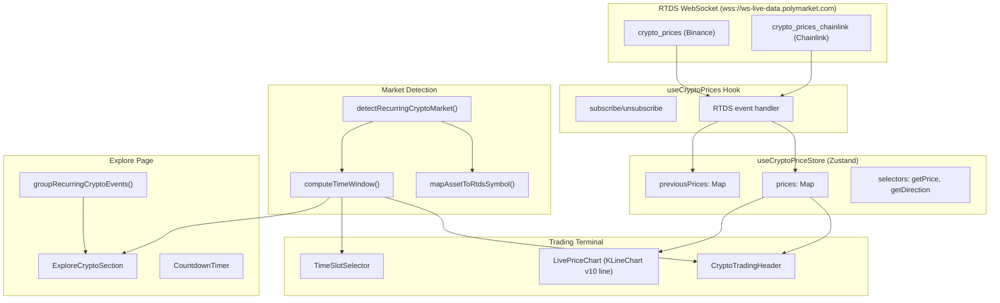

# Design Document: Live Crypto Trading

## Overview

This design adds a live crypto trading experience for Polymarket's recurring crypto markets. It connects to the existing RTDS WebSocket infrastructure for real-time cryptocurrency prices (Binance + Chainlink feeds), introduces a centralized Zustand store for crypto price state, replaces the OHLC chart with a live price line chart for recurring markets, and provides specialized trading UI (crypto header, time slot selector, explore section).

The design integrates with existing patterns:
- **WebSocket**: Extends `RtdsClient` (already supports `crypto_prices` / `crypto_prices_chainlink` topics) with a dedicated React hook
- **State**: New Zustand store following `useOrderbookStore` patterns (flat state, pure helper exports)
- **Charts**: KLineChart v10 line series alongside existing OHLC infrastructure
- **Trading UI**: Conditional rendering in `TradingLayoutTerminal` based on market detection
- **Explore**: Extends `groupRecurringCryptoEvents` and `crypto-sidebar-constants.ts`

## Architecture



### Data Flow

1. **RTDS → Hook → Store**: `useCryptoPrices(symbols)` connects to RTDS, subscribes to both Binance and Chainlink topics, validates payloads via existing `CryptoPricePayloadSchema`, and writes to `useCryptoPriceStore`.
2. **Store → Components**: `CryptoTradingHeader`, `LivePriceChart`, and `ExploreCryptoSection` read from the store via selectors (`getPrice(symbol)`, `getDirection(symbol)`).
3. **Market Detection → Conditional UI**: `detectRecurringCryptoMarket(market, event)` returns metadata (asset, timeframe, RTDS symbols, time window) or `null`. `TradingLayoutTerminal` uses this to swap OHLC chart for `LivePriceChart` and `MarketHeader` for `CryptoTradingHeader`.
4. **Time Window Utils → All timing UI**: Pure functions compute window boundaries, countdowns, and slot lists. Used by header, time slot selector, and explore section.

## Components and Interfaces

### 1. `useCryptoPrices` Hook (`apps/web/src/hooks/use-crypto-prices.ts`)

React hook that manages RTDS subscriptions for crypto price data. Follows the pattern of existing hooks like `use-live-trades.ts`.

```typescript
interface UseCryptoPricesOptions {
  /** RTDS symbols to subscribe to, e.g. ["btcusdt"] */
  symbols: string[];
  /** Whether to subscribe (default true) */
  enabled?: boolean;
}

function useCryptoPrices(options: UseCryptoPricesOptions): void;
```

- Calls `rtdsClient.connect()` on mount, subscribes to `crypto_prices` (type `update`) and `crypto_prices_chainlink` (type `*`)
- Adds an RTDS handler that filters by subscribed symbols and writes to `useCryptoPriceStore`
- Unsubscribes on unmount if no other subscribers remain (ref-counted via RTDS client)
- PING keepalive is already handled by `RtdsClient.startPing()` (5-second interval)

### 2. `useCryptoPriceStore` (`apps/web/src/stores/crypto-prices.ts`)

Zustand store for live crypto prices. Flat state with pure helper exports (matches `orderbook.ts` pattern).

```typescript
interface CryptoPrice {
  symbol: string;
  value: number;
  timestamp: number;
  source: "binance" | "chainlink";
}

interface CryptoPriceState {
  /** Current prices keyed by `${symbol}:${source}` */
  prices: Map<string, CryptoPrice>;
  /** Previous price values for direction calculation, keyed by symbol */
  previousPrices: Map<string, number>;
}

interface CryptoPriceActions {
  updatePrice: (price: CryptoPrice) => void;
  reset: () => void;
}
```

Selectors (exported as standalone functions for module-level referential stability):
- `getPrice(state, symbol)` — returns latest price, preferring Binance over Chainlink
- `getDirection(state, symbol)` — returns `"up" | "down" | "neutral"` comparing current to previous
- `getPriceDifference(state, symbol, targetPrice)` — returns `{ amount: number; direction: "up" | "down" | "neutral" }`

Max 50 entries enforced in `updatePrice` — evicts oldest by timestamp when limit reached.

### 3. `detectRecurringCryptoMarket` (`apps/web/src/lib/markets/recurring-crypto.ts`)

Pure utility for market detection. No React dependency — safe for Server Components.

```typescript
interface RecurringCryptoMarketInfo {
  /** e.g. "bitcoin" */
  asset: string;
  /** e.g. "5m" | "15m" | "1h" | "4h" | "daily" */
  timeframe: string;
  /** Duration in milliseconds */
  timeframeDurationMs: number;
  /** Binance symbol, e.g. "btcusdt" */
  binanceSymbol: string;
  /** Chainlink symbol, e.g. "btc/usd" */
  chainlinkSymbol: string;
  /** Time window start timestamp (ms) */
  windowStart: number;
  /** Time window end timestamp (ms) */
  windowEnd: number;
  /** Target price extracted from market description/title */
  targetPrice: number | null;
}

function detectRecurringCryptoMarket(
  market: Market,
  event?: Event | null
): RecurringCryptoMarketInfo | null;
```

Detection logic:
1. Check event tags for `recurring` + timeframe tag (`5M`, `15M`, `1H`, `4H`, `daily`) — reuses tag matching from `crypto-sidebar-constants.ts`
2. Extract asset from event tags using `KNOWN_ASSET_TAGS`
3. Map asset → RTDS symbols via lookup table (e.g. `bitcoin` → `btcusdt` / `btc/usd`)
4. Extract time window from market title/description text (regex for time ranges like "11:40-11:45PM ET")
5. Extract target price from market description if available
6. Return `null` if any detection step fails → standard OHLC chart renders

### 4. `LivePriceChart` (`apps/web/src/components/charts/live-price-chart.tsx`)

KLineChart v10 line chart for real-time crypto prices. Client component (`"use client"`).

```typescript
interface LivePriceChartProps {
  /** Crypto symbol for price subscription */
  symbol: string;
  /** Target price for the horizontal reference line */
  targetPrice: number | null;
  /** Time window start (ms) */
  windowStart: number;
  /** Time window end (ms) */
  windowEnd: number;
}
```

Implementation approach:
- Uses KLineChart v10 `init()` with `type: "line"` (not candle/OHLC)
- Registers a custom overlay for the "Price To Beat" dashed horizontal line at `targetPrice`
- Subscribes to `useCryptoPriceStore` and appends new data points via `chart.updateData()`
- Y-axis: dollar values (right side). X-axis: timestamps within the time window
- Line color: conditional on price vs target — green (`--color-profit`) above, red (`--color-loss`) below
- Auto-scroll: chart is LOCKED — all user interaction (pan, scroll, zoom) is disabled via KLineChart `scrollEnabled: false`, `zoomEnabled: false`. Chart always auto-follows the latest price tick.
- Dynamic import with `ssr: false` (canvas APIs are client-only, matching existing `PolymarketKLineChartInner` pattern)
- Disposed on unmount via `dispose()`

### 5. `CryptoTradingHeader` (`apps/web/src/components/trading/crypto-trading-header.tsx`)

Specialized header for recurring crypto markets. Replaces `MarketHeader` in the trading terminal.

```typescript
interface CryptoTradingHeaderProps {
  /** Recurring crypto market info from detection */
  cryptoInfo: RecurringCryptoMarketInfo;
  /** Market data for fallback display */
  market: Market;
}
```

Layout (left to right):
- Market title: "[Asset] Up or Down - [Timeframe]" (e.g. "Bitcoin Up or Down - 5 Minutes")
- Subtitle: "[Month] [Day], [StartTime]-[EndTime] ET" (e.g. "April 1, 11:40-11:45PM ET")
- Price To Beat: `targetPrice` formatted as USD
- Current Price: live from `useCryptoPriceStore`, with flash animation on update
- Price Difference: `|current - target|` with directional color and arrow icon
- Countdown Timer: `CountdownTimer` component showing MM:SS remaining

Design tokens: `text-lg` for title, `text-sm` for subtitle/prices, `text-xs` for labels. `font-medium` for price values. Green/red via `text-profit`/`text-loss` semantic tokens.

### 6. `CountdownTimer` (`apps/web/src/components/trading/countdown-timer.tsx`)

Reusable countdown component. Used by both `CryptoTradingHeader` and `ExploreCryptoSection`.

```typescript
interface CountdownTimerProps {
  /** Target end time (ms) */
  endTime: number;
  /** Callback when countdown reaches zero */
  onExpire?: () => void;
  /** CSS class for styling */
  className?: string;
}
```

- Uses `useEffect` + `setInterval(1000)` to tick every second
- Displays `MM:SS` format
- Shows "Ended" when `endTime` is in the past
- Calls `onExpire` once when transitioning from active to expired

### 7. `TimeSlotSelector` (`apps/web/src/components/trading/time-slot-selector.tsx`)

Navigation component for time windows. Client component.

```typescript
interface TimeSlot {
  /** Market condition ID or slug for navigation */
  marketId: string;
  /** Slot start time (ms) */
  startTime: number;
  /** Display label, e.g. "11:45 PM" */
  label: string;
  /** Whether this is the currently active slot */
  isActive: boolean;
  /** Whether this slot is in the past */
  isPast: boolean;
}

interface TimeSlotSelectorProps {
  /** Available time slots */
  slots: TimeSlot[];
  /** Currently selected slot index */
  activeIndex: number;
  /** Callback when a slot is selected */
  onSelect: (slot: TimeSlot) => void;
  /** Whether to show Past/More dropdowns */
  showDropdowns?: boolean;
}
```

- Displays up to 5 visible slots as `SelectorChip` components (from `@/components/ui/selector-chip`)
- Active slot: live dot indicator + distinct background (Doji green ring)
- "Past" dropdown (left): completed slots beyond visible range
- "More" dropdown (right): future slots beyond visible range
- Selection navigates to the corresponding market via Next.js router

### 8. `ExploreCryptoSection` (`apps/web/src/components/explore/explore-crypto-section.tsx`)

Explore page section for recurring crypto markets within a timeframe category.

```typescript
interface ExploreCryptoSectionProps {
  /** Timeframe label, e.g. "5M Markets" */
  timeframeLabel: string;
  /** Grouped events for this timeframe */
  events: Event[];
  /** Current time window info */
  windowInfo: { start: number; end: number; label: string };
}
```

- Header: timeframe label + time window range + `CountdownTimer`
- Event cards: one per asset, showing title, time window, Up/Down buttons with Yes/No prices, volume, liquidity, end date
- Uses existing `groupRecurringCryptoEvents()` from `crypto-sidebar-constants.ts`
- On countdown expiry: triggers refresh to show next time window

### 9. Time Window Utilities (`apps/web/src/utils/time-window.ts`)

Pure utility functions. No React or DOM dependencies — safe for any context.

```typescript
/** Compute the current time window boundaries */
function computeTimeWindow(
  timeframeDurationMs: number,
  now?: number
): { start: number; end: number };

/** Compute remaining seconds until window end */
function computeRemainingSeconds(
  windowEnd: number,
  now?: number
): number;

/** Generate a list of time slots centered around the current window */
function generateTimeSlots(
  timeframeDurationMs: number,
  count: number,
  now?: number
): Array<{ start: number; end: number; label: string; isPast: boolean; isActive: boolean }>;

/** Format a time window for display in Eastern Time */
function formatTimeWindowET(
  start: number,
  end: number
): string;

/** Format a single timestamp as a time label in ET */
function formatTimeSlotLabelET(timestamp: number): string;

```

`computeTimeWindow` aligns to the timeframe grid: `start = floor(now / duration) * duration`, `end = start + duration`. Daily windows align to midnight ET.

## Data Models

### CryptoPrice (Store Entry)

```typescript
interface CryptoPrice {
  symbol: string;        // e.g. "btcusdt" (Binance) or "btc/usd" (Chainlink)
  value: number;         // Price in USD, e.g. 67432.50
  timestamp: number;     // Unix timestamp (seconds) from RTDS
  source: "binance" | "chainlink";
}
```

### Store Key Format

Prices are keyed by `${symbol}:${source}` (e.g. `btcusdt:binance`, `btc/usd:chainlink`). The `getPrice` selector resolves the best available price for a given asset by checking Binance first, then Chainlink.

### RecurringCryptoMarketInfo (Detection Result)

```typescript
interface RecurringCryptoMarketInfo {
  asset: string;                // "bitcoin" | "ethereum" | "solana" | "xrp" | "dogecoin" | "bnb"
  timeframe: string;            // "5m" | "15m" | "1h" | "4h" | "daily"
  timeframeDurationMs: number;  // 300_000 | 900_000 | 3_600_000 | 14_400_000 | 86_400_000
  binanceSymbol: string;        // "btcusdt" | "ethusdt" | "solusdt" | "xrpusdt"
  chainlinkSymbol: string;      // "btc/usd" | "eth/usd" | "sol/usd" | "xrp/usd"
  windowStart: number;          // ms timestamp
  windowEnd: number;            // ms timestamp
  targetPrice: number | null;   // USD price to beat, extracted from market text
}
```

### Asset → Symbol Mapping

```typescript
const ASSET_SYMBOL_MAP: Record<string, { binance: string; chainlink: string }> = {
  bitcoin:  { binance: "btcusdt",  chainlink: "btc/usd" },
  ethereum: { binance: "ethusdt",  chainlink: "eth/usd" },
  solana:   { binance: "solusdt",  chainlink: "sol/usd" },
  xrp:      { binance: "xrpusdt", chainlink: "xrp/usd" },
  dogecoin: { binance: "dogeusdt", chainlink: "doge/usd" },
  bnb:      { binance: "bnbusdt",  chainlink: "bnb/usd" },
};
```

### TimeSlot (Navigation)

```typescript
interface TimeSlot {
  marketId: string;    // Market slug or condition ID for navigation
  startTime: number;   // Window start (ms)
  label: string;       // Display label, e.g. "11:45 PM"
  isActive: boolean;   // Currently active window
  isPast: boolean;     // Completed window
}
```

### Chart Data Point

```typescript
interface LivePriceDataPoint {
  timestamp: number;  // ms
  value: number;      // USD price
}
```

The `LivePriceChart` maintains an internal array of `LivePriceDataPoint` entries, appending new points as they arrive from the store. KLineChart v10 receives these as `KLineData` with `close = value` and `timestamp` in ms.


## Correctness Properties

*A property is a characteristic or behavior that should hold true across all valid executions of a system — essentially, a formal statement about what the system should do. Properties serve as the bridge between human-readable specifications and machine-verifiable correctness guarantees.*

### Property 1: CryptoPricePayload schema validation round-trip

*For any* valid `CryptoPrice` object (with string `symbol`, number `timestamp`, number `value`), serializing it to a plain object and parsing with `CryptoPricePayloadSchema` should succeed and produce an equivalent object. *For any* object missing required fields or with wrong types, parsing should fail.

**Validates: Requirements 1.4, 1.5**

### Property 2: Store update preserves latest entry and retains previous price

*For any* sequence of two price updates for the same symbol and source, after both updates the store should contain the second price as the current entry, and the `previousPrices` map should hold the first price's value for that symbol.

**Validates: Requirements 2.1, 2.2**

### Property 3: Binance source preference

*For any* store state containing both a Binance and a Chainlink price for the same underlying asset, `getPrice(state, asset)` should return the Binance price value. *For any* state with only a Chainlink price, `getPrice` should return the Chainlink value.

**Validates: Requirements 2.3**

### Property 4: Price direction computation

*For any* two numbers `current` and `previous`, `getDirection` should return `"up"` when `current > previous`, `"down"` when `current < previous`, and `"neutral"` when `current === previous`.

**Validates: Requirements 2.4**

### Property 5: Store max size invariant

*For any* sequence of N distinct symbol-source price updates where N > 50, the store's `prices` map size should never exceed 50 entries.

**Validates: Requirements 2.5**

### Property 6: Price difference computation

*For any* `currentPrice` and `targetPrice` (both positive numbers), `getPriceDifference` should return an `amount` equal to `|currentPrice - targetPrice|` and a `direction` of `"up"` when `currentPrice > targetPrice`, `"down"` when `currentPrice < targetPrice`, and `"neutral"` when equal.

**Validates: Requirements 4.3**

### Property 7: Header text formatting

*For any* valid asset name and timeframe string, the title formatter should produce a string matching the pattern `"[Asset] Up or Down - [Timeframe]"`. *For any* valid start and end timestamps, the subtitle formatter should produce a string containing month, day, and ET time range components.

**Validates: Requirements 4.6, 4.7**

### Property 8: Recurring crypto market detection

*For any* event carrying both a `recurring` tag and a valid timeframe tag (`5M`, `15M`, `1H`, `4H`, or `daily`) plus a known asset tag, `detectRecurringCryptoMarket` should return a non-null `RecurringCryptoMarketInfo`. *For any* event missing the `recurring` tag or missing a timeframe tag, it should return `null`.

**Validates: Requirements 6.1, 6.5**

### Property 9: Asset-to-RTDS-symbol mapping

*For any* known asset tag (bitcoin, ethereum, solana, xrp, dogecoin, bnb), the detection result should contain a valid `binanceSymbol` ending in `usdt` and a valid `chainlinkSymbol` in `xxx/usd` format.

**Validates: Requirements 6.2, 6.3**

### Property 10: Recurring event grouping

*For any* list of events where some carry `recurring` + timeframe + asset tags, `groupRecurringCryptoEvents` should produce a list where each unique asset+timeframe combination appears at most once, and non-recurring events pass through unchanged. The total count of non-recurring events in the output should equal the count in the input.

**Validates: Requirements 7.7**

### Property 11: Time window round-trip

*For any* valid timeframe duration (300000, 900000, 3600000, 14400000, 86400000 ms) and any timestamp, `computeTimeWindow(duration, now).end` should equal `computeTimeWindow(duration, now).start + duration`.

**Validates: Requirements 8.5**

### Property 12: Remaining seconds invariant

*For any* valid timestamp within a time window (i.e., `windowStart <= now < windowEnd`), `computeRemainingSeconds(windowEnd, now)` should be non-negative and less than or equal to `duration / 1000`.

**Validates: Requirements 8.6**

### Property 13: Time slot generation contiguity and uniqueness

*For any* valid timeframe duration and count parameter, `generateTimeSlots` should return exactly `count` slots that are contiguous (each slot's end equals the next slot's start), non-overlapping, and contain exactly one slot where `isActive` is true.

**Validates: Requirements 8.3**

### Property 14: Time formatting produces valid ET strings

*For any* valid timestamp, `formatTimeSlotLabelET` should produce a non-empty string containing AM or PM. *For any* valid start/end pair, `formatTimeWindowET` should produce a string containing a month name, a day number, and an ET time range with AM/PM.

**Validates: Requirements 5.6, 8.4**

## Error Handling

### WebSocket Errors

- **Connection failure**: `RtdsClient` already implements exponential backoff via `computeBackoffDelay` from `backoff.ts`. The `useCryptoPrices` hook does not need additional retry logic.
- **Invalid payload**: `safeParseRtdsEvent` (existing) rejects malformed messages before they reach the store. Invalid payloads are silently dropped (logged in debug mode).
- **Connection status**: `useConnectionStore` tracks RTDS channel status. Components can show a connection indicator if needed.

### Store Errors

- **Stale data**: If no price update arrives for 30+ seconds, components should show the last known price with a "stale" indicator. The store tracks `timestamp` per entry for staleness detection.
- **Memory bounds**: The 50-entry cap in `updatePrice` prevents unbounded growth. Eviction removes the oldest entry by timestamp.
- **Missing price**: `getPrice` returns `null` when no price exists for a symbol. Components handle `null` with placeholder UI (e.g., `--` or skeleton).

### Market Detection Errors

- **Missing tags**: `detectRecurringCryptoMarket` returns `null` → standard OHLC chart and default header render. No error thrown.
- **Unparseable time window**: If the market title doesn't contain a recognizable time range, `windowStart`/`windowEnd` fall back to `computeTimeWindow` based on the timeframe duration and current time.
- **Unknown asset**: If the event has `recurring` + timeframe tags but no known asset tag, detection returns `null`.

### Chart Errors

- **No data**: `LivePriceChart` shows an empty chart with the target price line and axes. No error state needed.
- **KLineChart init failure**: Wrapped in try-catch; falls back to a "Chart unavailable" message (matching existing `PolymarketKLineChartInner` error handling pattern).

### Time Window Errors

- **Invalid duration**: `computeTimeWindow` validates that duration is one of the known values. Invalid durations throw a descriptive error.
- **Clock skew**: All time computations accept an optional `now` parameter for testability. In production, `Date.now()` is used. Components use `suppressHydrationWarning` for time-dependent renders.

## Testing Strategy

### Property-Based Testing

Use `fast-check` (already available in the project via Vitest) for property-based tests. Each property test runs a minimum of 100 iterations.

**Test file**: `tests/unit/live-crypto-trading.test.ts`

Properties to implement:

1. **Feature: live-crypto-trading, Property 1: CryptoPricePayload schema validation round-trip** — Generate random valid/invalid payloads, verify schema parse results.
2. **Feature: live-crypto-trading, Property 2: Store update preserves latest entry and retains previous price** — Generate sequences of price updates, verify store state after each.
3. **Feature: live-crypto-trading, Property 3: Binance source preference** — Generate states with mixed sources, verify `getPrice` returns Binance when available.
4. **Feature: live-crypto-trading, Property 4: Price direction computation** — Generate random number pairs, verify direction output.
5. **Feature: live-crypto-trading, Property 5: Store max size invariant** — Generate 51+ distinct updates, verify map size <= 50.
6. **Feature: live-crypto-trading, Property 6: Price difference computation** — Generate random price pairs, verify amount and direction.
7. **Feature: live-crypto-trading, Property 7: Header text formatting** — Generate random asset/timeframe combos, verify output pattern.
8. **Feature: live-crypto-trading, Property 8: Recurring crypto market detection** — Generate events with various tag combinations, verify detection result.
9. **Feature: live-crypto-trading, Property 9: Asset-to-RTDS-symbol mapping** — For each known asset, verify symbol format.
10. **Feature: live-crypto-trading, Property 10: Recurring event grouping** — Generate lists of events with mixed recurring/non-recurring, verify grouping invariants.
11. **Feature: live-crypto-trading, Property 11: Time window round-trip** — Generate random durations and timestamps, verify start + duration = end.
12. **Feature: live-crypto-trading, Property 12: Remaining seconds invariant** — Generate timestamps within windows, verify bounds.
13. **Feature: live-crypto-trading, Property 13: Time slot generation contiguity** — Generate random durations and counts, verify contiguity and active slot uniqueness.
14. **Feature: live-crypto-trading, Property 14: Time formatting produces valid ET strings** — Generate random timestamps, verify output format.

### Unit Tests

**Test file**: `tests/unit/live-crypto-trading-unit.test.ts`

Specific examples and edge cases:

- **Schema validation**: Known valid Binance payload `{ symbol: "btcusdt", timestamp: 1234567890, value: 67432.5 }` parses correctly
- **Time window extraction**: Market title "Bitcoin Up or Down 11:40-11:45PM ET" extracts correct start/end
- **Detection edge case**: Event with `recurring` tag but no timeframe tag returns `null`
- **Detection edge case**: Event with `recurring` + `5M` but no asset tag returns `null`
- **Store eviction**: After 51 updates with distinct keys, oldest entry is evicted
- **Countdown at zero**: `computeRemainingSeconds` returns 0 when `now >= windowEnd`
- **Daily window alignment**: Daily windows align to midnight ET, not UTC
- **groupRecurringCryptoEvents**: Max 5 markets per group (existing behavior preserved)

### Integration Tests

- **RTDS subscription lifecycle**: Mock WebSocket, verify subscribe/unsubscribe calls
- **Store ↔ Component**: Verify `CryptoTradingHeader` re-renders when store updates
- **Market detection ↔ Terminal**: Verify `TradingLayoutTerminal` renders `LivePriceChart` for recurring markets and `ChartSlot` for standard markets
