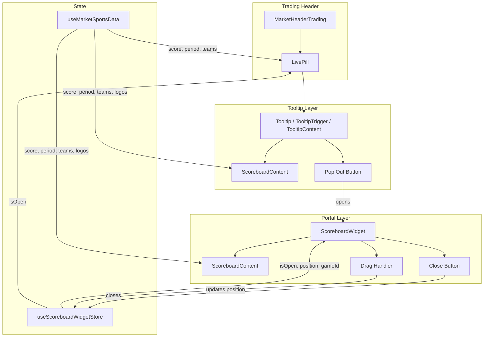

# Design Document: Live Scoreboard Pill with Tooltip and Draggable Widget

## Overview

This feature replaces the current inline `Scoreboard` component in the trading terminal header with a three-tier progressive disclosure model:

1. **Live Pill** — A compact `● LIVE` or `FINAL` indicator that occupies minimal header space.
2. **Scoreboard Tooltip** — A rich hover tooltip showing team logos, full names, score, and game status, with a "Pop out" action.
3. **Popout Widget** — A draggable floating panel (React portal) that persists the scoreboard on screen while the trader interacts with charts and orderbook.

All three tiers consume the same `useMarketSportsData` hook and reuse existing utilities (`parseScore`, `formatPeriod`, `formatScore`, `getTeamImage`, `ImageWithFallback`). The widget uses raw pointer events for drag (not the existing `DndContext` which is reserved for panel layout) and a small Zustand store for position/open state.

### Design Decisions

| Decision | Rationale |
|----------|-----------|
| Raw pointer events for drag instead of `@dnd-kit` | The trading terminal's `DndContext` manages grid panel layout. A separate DnD context would conflict or add unnecessary complexity. Pointer events are lightweight and sufficient for a single draggable element. |
| React portal for widget | The header has `overflow: hidden`. A portal escapes this constraint and allows the widget to float anywhere on the viewport. |
| Zustand store without persistence | Widget position is session-scoped — it should reset on tab close. No `persist` middleware needed, keeping the store simple. |
| Shared `ScoreboardContent` component | Tooltip and widget display identical content. A single component eliminates duplication and ensures visual consistency. |
| z-index ~9000 for widget | Above trading content but below modals (z-[9999]) and tooltips (z-10050). Prevents the widget from blocking critical UI. |
| `resolveGameState` for pill visibility | Reuses the existing utility that normalizes `live`/`ended`/`status`/`period` fields into a definitive state, avoiding duplicated logic. |

## Architecture



### Data Flow

1. `useMarketSportsData` (existing) provides `ScoreboardProps` — score, period, elapsed, status, live, ended, team names, abbreviations, sibling markets for logo lookup.
2. `MarketHeaderTrading` passes this data to `LivePill` instead of the current `Scoreboard`.
3. `LivePill` renders the compact pill and wraps it in a `Tooltip`. The tooltip content renders `ScoreboardContent` plus a "Pop out" button.
4. Clicking "Pop out" calls `useScoreboardWidgetStore.open(gameId, position)`, which sets `isOpen: true` and records the current `gameId`.
5. `ScoreboardWidget` (rendered via portal at the trading page level) reads `isOpen` and `position` from the store, renders `ScoreboardContent`, and handles drag via pointer events.
6. When the user navigates to a different game (different `gameId`), the widget auto-closes.

## Components and Interfaces

### LivePill

**File:** `apps/web/src/features/trading/components/market/live-pill.tsx`

```typescript
interface LivePillProps {
  /** Away team abbreviation */
  awayAbbrev: string;
  /** Away team full name */
  awayTeamName?: string | null;
  /** Elapsed time */
  elapsed?: string | null;
  /** Whether game has ended */
  ended?: boolean;
  /** Event image URL (for filtering league logos) */
  eventImage?: string | null;
  /** Home team abbreviation */
  homeAbbrev: string;
  /** Home team full name */
  homeTeamName?: string | null;
  /** Whether game is live */
  live?: boolean;
  /** Sibling markets for team image scanning */
  markets?: Market[];
  /** Raw period string */
  period?: string | null;
  /** Raw score string */
  score?: string | null;
  /** WebSocket status field */
  status?: string | null;
}
```

**Behavior:**
- Calls `resolveGameState({ live, ended, status, period })` to determine visibility and display mode.
- Returns `null` when game state is `null` (not started or no data).
- Renders `● LIVE` (red ping dot + red text) when state is `"live"`.
- Renders `FINAL` (secondary text, no dot) when state is `"ended"`.
- Wraps in `Tooltip` / `TooltipTrigger` / `TooltipContent`. Tooltip is suppressed (not rendered) when the widget is open (reads `isOpen` from store).
- Builds an `aria-label` string from team names, score, and period for screen readers.

### ScoreboardContent

**File:** `apps/web/src/features/trading/components/market/scoreboard-content.tsx`

```typescript
interface ScoreboardContentProps {
  /** Away team abbreviation */
  awayAbbrev: string;
  /** Away team full name */
  awayTeamName?: string | null;
  /** Elapsed time */
  elapsed?: string | null;
  /** Whether game has ended */
  ended?: boolean;
  /** Event image URL (for filtering league logos) */
  eventImage?: string | null;
  /** Home team abbreviation */
  homeAbbrev: string;
  /** Home team full name */
  homeTeamName?: string | null;
  /** Whether game is live */
  live?: boolean;
  /** Sibling markets for team image scanning */
  markets?: Market[];
  /** Raw period string */
  period?: string | null;
  /** Raw score string */
  score?: string | null;
  /** WebSocket status field */
  status?: string | null;
}
```

**Layout:**
```
┌──────────────────────────────────────┐
│  [HomeLogo]  Home Name   0 - 1   Away Name  [AwayLogo]  │
│                  LIVE · Q4 08:42                         │
└──────────────────────────────────────┘
```

- Team logos: `ImageWithFallback` at `size="md"` (48px), `rounded="full"`, with team abbreviation as `fallbackChar`.
- Team names: `text-sm font-medium text-text-primary`. Falls back to abbreviation when name is unavailable.
- Score: `text-lg font-medium text-text-primary`, formatted via `formatScore(parseScore(score))`.
- Status line: `text-xs`, `text-red-500` when live (with ping dot), `text-text-secondary` when ended/other. Formatted via `formatPeriod(...)`.
- Handles partial data gracefully — if score is null, shows `–` placeholder; if period is null, omits the status line.

### ScoreboardWidget

**File:** `apps/web/src/features/trading/components/market/scoreboard-widget.tsx`

```typescript
interface ScoreboardWidgetProps {
  /** All ScoreboardContent props passed through */
  awayAbbrev: string;
  awayTeamName?: string | null;
  elapsed?: string | null;
  ended?: boolean;
  eventImage?: string | null;
  homeAbbrev: string;
  homeTeamName?: string | null;
  live?: boolean;
  markets?: Market[];
  period?: string | null;
  score?: string | null;
  status?: string | null;
}
```

**Behavior:**
- Rendered via `createPortal` to `document.body`.
- Reads `isOpen`, `position`, `gameId` from `useScoreboardWidgetStore`.
- Returns `null` when `!isOpen`.
- Renders a `~300px` wide card with `bg-card border border-border rounded-lg shadow-lg`.
- Header area (drag handle): contains a grip icon and "Live Score" label. `cursor-grab` / `cursor-grabbing`.
- Close button: `Button` component with `variant="ghost"` `size="icon-xs"`, `X` icon, `aria-label="Close scoreboard widget"`.
- Content: `ScoreboardContent` with the same props.
- z-index: `z-[9000]`.
- `role="dialog"` and `aria-label="Live scoreboard: {homeTeamName} vs {awayTeamName}"`.

**Drag implementation:**
- `onPointerDown` on the header area captures the initial pointer position and widget position.
- `onPointerMove` (attached to `document` during drag) updates position via store.
- `onPointerUp` (attached to `document`) ends drag.
- Position is clamped to viewport boundaries: `x ∈ [0, window.innerWidth - widgetWidth]`, `y ∈ [0, window.innerHeight - widgetHeight]`.
- Uses `useRef` for drag state (startX, startY, isDragging) to avoid re-renders during drag.
- Applies `transform: translate(x, y)` for GPU-accelerated positioning.

### useScoreboardWidgetStore

**File:** `apps/web/src/features/trading/stores/scoreboard-widget.ts`

```typescript
interface ScoreboardWidgetState {
  /** Current game identifier — used to auto-close on game change */
  gameId: string | null;
  /** Whether the widget is currently open */
  isOpen: boolean;
  /** Widget position on screen */
  position: { x: number; y: number };

  /** Close the widget and clear state */
  close: () => void;
  /** Open the widget for a specific game */
  open: (gameId: string) => void;
  /** Update the widget position (during drag) */
  setPosition: (pos: { x: number; y: number }) => void;
}
```

**Behavior:**
- `open(gameId)`: Sets `isOpen: true`, `gameId`, and `position` to a default (centered or last known).
- `close()`: Sets `isOpen: false`, `gameId: null`. Preserves `position` so reopening uses the last position.
- `setPosition(pos)`: Updates `position` — called during drag.
- No `persist` middleware — state is session-scoped and resets on tab close.
- The `gameId` is derived from the event slug (or a combination of team abbreviations) since the numeric `gameId` from Gamma may not always be available. The event slug is stable across markets within the same game.

### Integration with MarketHeaderTrading

The existing `MarketHeaderTrading` component will be modified to:

1. Replace the `<Scoreboard {...scoreboardProps} />` block with `<LivePill {...scoreboardProps} />`.
2. Render `<ScoreboardWidget {...scoreboardProps} />` (conditionally, when `scoreboardProps` is non-null) — this can be placed at the end of the component since it portals to `document.body`.
3. Add an effect that watches the event slug: when it changes and the widget is open for a different game, call `store.close()`.

## Data Models

### Existing Data (no changes)

| Source | Shape | Notes |
|--------|-------|-------|
| `useMarketSportsData` return | `ScoreboardProps` | score, period, elapsed, status, live, ended, homeAbbrev, awayAbbrev, homeTeamName, awayTeamName, markets, eventImage |
| `parseScore(raw)` | `ParsedScore \| null` | `{ home: string, away: string }` |
| `formatPeriod(fields)` | `string \| null` | Human-readable period text |
| `formatScore(parsed)` | `string` | `"home - away"` display string |
| `resolveGameState(fields)` | `"live" \| "ended" \| null` | Definitive game state |
| `getTeamImage(name, markets)` | `string \| null` | Team logo URL from sibling markets |

### New Data

| Model | Shape | Scope |
|-------|-------|-------|
| `ScoreboardWidgetState` | `{ isOpen, gameId, position: {x, y}, open(), close(), setPosition() }` | Zustand store, session-scoped |

No database changes. No new API endpoints. All data comes from the existing Sports WebSocket via `useMarketSportsData`.


## Correctness Properties

*A property is a characteristic or behavior that should hold true across all valid executions of a system — essentially, a formal statement about what the system should do. Properties serve as the bridge between human-readable specifications and machine-verifiable correctness guarantees.*

### Property 1: Pill display is consistent with resolveGameState

*For any* combination of `{ live, ended, status, period }` fields, the LivePill display mode SHALL match the output of `resolveGameState`:
- When `resolveGameState` returns `"live"`, the pill renders "LIVE" text with a ping dot indicator.
- When `resolveGameState` returns `"ended"`, the pill renders "FINAL" text without a ping dot.
- When `resolveGameState` returns `null`, the pill is not rendered (returns null).

**Validates: Requirements 1.1, 1.2, 1.3**

### Property 2: ScoreboardContent renders without errors and displays available data

*For any* valid combination of `{ score, period, elapsed, status, live, ended, homeAbbrev, awayAbbrev, homeTeamName, awayTeamName }` (where abbreviations are non-empty strings and other fields are optional), the `ScoreboardContent` component SHALL render without throwing an error, AND the rendered output SHALL contain both team identifiers (full name when available, abbreviation as fallback).

**Validates: Requirements 2.2, 2.9, 7.5**

### Property 3: Drag position is clamped to viewport boundaries

*For any* widget position `{ x, y }`, widget dimensions `{ width, height }`, and viewport dimensions `{ viewportWidth, viewportHeight }`, the clamped position SHALL satisfy:
- `0 <= clampedX <= viewportWidth - width`
- `0 <= clampedY <= viewportHeight - height`

Such that the widget is always fully visible within the viewport.

**Validates: Requirements 3.4, 3.8**

### Property 4: Widget open state persists if and only if gameId matches

*For any* two game identifiers `gameIdA` and `gameIdB`, when the widget is open for `gameIdA` and navigation occurs to `gameIdB`:
- If `gameIdA === gameIdB`, the widget SHALL remain open at the same position.
- If `gameIdA !== gameIdB`, the widget SHALL close automatically.

**Validates: Requirements 4.2, 4.3**

### Property 5: Tooltip is suppressed when widget is open

*For any* scoreboard data and widget store state where `isOpen === true`, the LivePill SHALL NOT render the Scoreboard_Tooltip on hover. When `isOpen === false`, the tooltip SHALL be available.

**Validates: Requirements 5.1, 5.2**

### Property 6: aria-label contains team and score information

*For any* combination of team names, score string, and period string provided to the LivePill, the `aria-label` attribute SHALL contain both team identifiers and the formatted score (when score is available).

**Validates: Requirements 6.1**

## Error Handling

### Missing or Partial Data

| Scenario | Behavior |
|----------|----------|
| `useMarketSportsData` returns `null` | LivePill is not rendered. Widget auto-closes if open. |
| Score is `null` or unparseable | ScoreboardContent shows `–` placeholder instead of score. |
| Period/status/elapsed all null | Status line is omitted from ScoreboardContent. |
| Team name is `null` | Falls back to abbreviation for display. |
| Team logo fails to load | `ImageWithFallback` shows abbreviation letter as fallback. |
| Both team name and abbreviation missing | Uses hardcoded fallbacks `"HOM"` / `"AWY"` (from existing `useMarketSportsData` logic). |

### WebSocket Disconnection

When the Sports WebSocket disconnects, `useMarketSportsData` may return `null` or stale data. The components handle this gracefully:
- If data becomes `null`, the pill hides and the widget auto-closes (Requirement 5.4).
- If data is stale (last known values), the UI continues to display the last known state — no special handling needed since the hook already manages this.

### Drag Edge Cases

| Scenario | Behavior |
|----------|----------|
| Window resize while widget is open | Widget position is not automatically adjusted (acceptable — user can re-drag). |
| Drag starts but pointer leaves window | `pointerup` on `document` ends drag. Position stays at last valid clamped value. |
| Touch events on mobile | Pointer events handle both mouse and touch. `touch-action: none` on drag handle prevents scroll interference. |

### State Transition Edge Cases

| Scenario | Behavior |
|----------|----------|
| "Pop out" clicked while widget already open for same game | No-op — widget stays at current position. |
| "Pop out" clicked while widget open for different game | Widget updates to new game's data and resets position. |
| Game ends while widget is open | Widget updates to show "FINAL" status — does not auto-close. |
| Multiple rapid market switches | Each switch checks gameId against store. Only the final navigation state matters. |

## Testing Strategy

### Property-Based Tests (Vitest + fast-check)

Property-based tests validate the six correctness properties above. Each test runs a minimum of 100 iterations with randomly generated inputs.

**Library:** `fast-check` (already available in the Vitest ecosystem; if not installed, add as a dev dependency).

**Test file:** `tests/unit/live-scoreboard-widget.test.ts`

| Property | What's Generated | What's Verified |
|----------|-----------------|-----------------|
| Property 1: Pill display consistency | Random `{ live: boolean, ended: boolean, status: string \| null, period: string \| null }` | Pill output matches `resolveGameState` |
| Property 2: ScoreboardContent robustness | Random `{ score, period, elapsed, status, live, ended, homeAbbrev, awayAbbrev, homeTeamName, awayTeamName }` | No render errors; team identifiers present |
| Property 3: Viewport clamping | Random `{ x, y, width, height, viewportWidth, viewportHeight }` (positive numbers) | Clamped position within bounds |
| Property 4: Widget gameId persistence | Random pairs of `gameId` strings | Widget open iff gameIds match |
| Property 5: Tooltip suppression | Random scoreboard data + `isOpen` boolean | Tooltip rendered iff `!isOpen` |
| Property 6: aria-label content | Random team names, scores, periods | Label contains team identifiers and score |

**Configuration:**
- Minimum 100 iterations per property (`fc.assert(..., { numRuns: 100 })`)
- Each test tagged with: `// Feature: live-scoreboard-widget, Property N: {title}`

### Unit Tests (Example-Based)

Focused on specific scenarios, edge cases, and integration points that property tests don't cover:

| Test | Validates |
|------|-----------|
| LivePill returns null when scoreboardProps is null | Req 1.4 |
| LivePill uses text-red-500 for live, text-text-secondary for final | Req 1.5 |
| MarketHeaderTrading renders LivePill instead of Scoreboard | Req 1.7 |
| Tooltip opens on hover | Req 2.1 |
| "Pop out" button present in tooltip | Req 2.5 |
| Clicking "Pop out" opens widget and closes tooltip | Req 2.6 |
| Widget renders via portal | Req 3.1 |
| Close button dismisses widget | Req 3.6 |
| Store clears open state on close | Req 4.4 |
| Game transition from live to ended updates all tiers | Req 5.3 |
| Data disappearing hides pill and closes widget | Req 5.4 |
| Keyboard focus opens tooltip | Req 6.2 |
| Pop-out button has aria-label "Pop out scoreboard" | Req 6.3 |
| Close button has aria-label "Close scoreboard widget" | Req 6.4 |
| Widget has role="dialog" | Req 6.5 |
| Ping dot has aria-hidden="true" | Req 6.6 |
| ImageWithFallback used with correct size and fallbackChar | Req 7.2 |

### Test Infrastructure

- **Rendering:** `@testing-library/react` for component rendering and assertions.
- **Store testing:** Direct Zustand store manipulation (no component rendering needed for Property 4).
- **Pure function testing:** Properties 1, 3, and 6 can be tested as pure functions without React rendering.
- **Mocking:** `useMarketSportsData` mocked to return controlled data. `createPortal` behavior verified via `@testing-library/react`'s container queries.
