# Design Document: Next.js Performance Optimization

## Overview

This design addresses the findings from a comprehensive Next.js 16 + TanStack Query v5 audit of the Doji web application. The audit graded the app Next.js B+ / TanStack Query A-, identifying that while the App Router is fully adopted and client-side query management is mature, the application severely underutilizes server-side rendering, caching, streaming, and Partial Prerendering (PPR).

The core problem: users see a loading spinner before any useful UI because the root layout wraps the entire component tree in a single `<Suspense>` boundary, making the PPR static shell meaningless. Only 3 of 10+ data-heavy pages prefetch data server-side. The remaining pages are effectively SPAs — empty HTML shells that fetch data only after JavaScript loads and hydrates.

This design restructures the rendering pipeline across 40 requirements (P0–P4) so that:

1. Layout chrome (header, nav, sidebar) appears instantly in the static shell
2. Server-prefetched data eliminates client-side waterfalls on key pages
3. Streaming delivers progressive content via `<Suspense>` boundaries
4. Caching (`"use cache"`, LRU, `cacheTag`) reduces redundant API round trips
5. Client-side optimizations (content-visibility, startTransition, Activity, select) improve runtime performance

### Key Constraints

- Next.js 16.2.2 with App Router, PPR via `cacheComponents: true`, React Compiler enabled
- TanStack Query v5.90.21 with tRPC v11 options proxy pattern
- Hono API server as a separate deployment (HTTP hop for `serverTrpc` is unavoidable unless co-located)
- Polymarket Data API has indexing lag — the existing `invalidatePostTradeQueriesWithRetry` pattern with exponential retry (3s → 8s → 15s → 30s) must be preserved
- Trading mutations must remain client-side tRPC — Server Actions are only appropriate for non-trading mutations (profile, settings)

## Architecture

The optimization work is organized into six architectural layers, each addressing a distinct part of the rendering pipeline:

```mermaid
graph TD
    subgraph "Layer 1: Static Shell (P0)"
        A[Root Layout Restructure] --> B[AppShell → Server Component]
        A --> C[Suspense Boundaries Pushed Down]
        B --> D[Layout Chrome in Static Shell]
    end

    subgraph "Layer 2: Server Caching (P1-P2)"
        E["use cache + cacheLife"] --> F[Market Data Cache]
        E --> G[Event Data Cache]
        E --> H[Leaderboard Cache]
        I[cacheTag + revalidateTag] --> F
        I --> G
        J[LRU Cache Layer] --> F
        J --> G
    end

    subgraph "Layer 3: Server Prefetch (P1-P2)"
        K[getQueryClient + dehydrate] --> L[Leaderboard Prefetch]
        K --> M[Trading Page Prefetch]
        K --> N[Streaming Dehydration]
    end

    subgraph "Layer 4: Streaming (P1-P3)"
        O[Suspense Boundaries] --> P[Event Page Streaming]
        O --> Q[Market Page Streaming]
        R[searchParams Deferral] --> S[Explore PPR Shell]
        T[loading.tsx Files] --> U[Route Transition Skeletons]
    end

    subgraph "Layer 5: Client Optimizations (P1-P4)"
        V[content-visibility CSS] --> W[Explore Table / Orderbook]
        X[startTransition] --> Y[Sort/Filter Handlers]
        Z[Activity Component] --> AA[Trading Panel Tabs]
        AB[select / keepPreviousData] --> AC[Query Render Optimization]
    end

    subgraph "Layer 6: DX & Guards (P0, P4)"
        AD[ReactQuery DevTools] --> AE[Dev Debugging]
        AF[unstable_instant] --> AG[Navigation Validation]
        AH[server-only Guard] --> AI[Build-time Safety]
        AJ[Error Handling] --> AK[Consistent RSC Error States]
    end
```



### Rendering Pipeline — Before vs After

**Current flow (most pages):**

```
Server renders empty HTML shell → Browser downloads JS → JS hydrates →
useQuery fires → HTTP to Hono → Data arrives → Render content
```

Time to meaningful content: ~2-4 seconds (5 steps, 2 network round trips)

**Target flow:**

```
Server sends static shell (header, nav, skeleton) instantly →
Server prefetches data + streams it via HydrationBoundary →
Client hydrates with data already present → Render content
```

Time to meaningful content: ~200-500ms (static shell instant, data streams in)

## Components and Interfaces

### Layer 1: Root Layout & Static Shell

#### Root Layout Restructure (`apps/web/src/app/layout.tsx`)

The current root layout wraps `<Providers>/<AppShell>/{children}` in a single `<Suspense>` boundary. The static shell is just a loading spinner.

**Target structure:**

```tsx
// layout.tsx — Server Component
export default function RootLayout({ children }) {
  return (
    <html lang="en" suppressHydrationWarning>
      <body className={...}>
        <Script ... strategy="beforeInteractive" />
        <Providers>
          {/* AppShell is now a Server Component — chrome is in static shell */}
          <AppShell>{children}</AppShell>
          {/* Analytics deferred via dynamic import */}
          <Suspense fallback={null}>
            <DatadogRumInit />
            <DatadogRumViewTracker />
            <DatadogRumUserSync />
            <DatadogLogsInit />
          </Suspense>
          {isProduction && (
            <>
              <DynamicAnalytics />
              <DynamicSpeedInsights />
            </>
          )}
        </Providers>
        <Toaster richColors />
      </body>
    </html>
  );
}
```

Key changes:

- Remove the outer `<Suspense>` that wraps everything
- `<Providers>` remains `"use client"` (required for QueryClientProvider, ThemeProvider)
- `<AppShell>` becomes a Server Component (see below)
- Analytics/SpeedInsights loaded via `next/dynamic` with `{ ssr: false }`

#### AppShell Refactor (`apps/web/src/components/layout/app-shell.tsx`)

Extract `usePathname()` into a small client component. The outer shell becomes a Server Component so header/nav/sidebar are in the static shell.

```tsx
// app-shell.tsx — Server Component
export function AppShell({ children }: { children: React.ReactNode }) {
  return (
    <div className="flex h-svh min-h-0 min-w-0 flex-col overflow-y-hidden overflow-x-visible">
      <Suspense fallback={<AppShellFallback>{children}</AppShellFallback>}>
        <AppShellRouter>{children}</AppShellRouter>
      </Suspense>
    </div>
  );
}

// app-shell-router.tsx — "use client" (small, only routing logic)
"use client";
export function AppShellRouter({ children }: { children: React.ReactNode }) {
  const pathname = usePathname();
  // ... routing-dependent layout logic
}
```

#### CommentsContext

The current `AppShell` provides a `CommentsContext` via `useState`. This must move to a small client wrapper or be lifted into `<Providers>` since Server Components cannot use `useState`/`createContext`.

### Layer 2: Server Caching

#### `"use cache"` + `cacheLife` Functions

New cached server fetch functions in `apps/web/src/lib/trpc/query-client.ts`:

```typescript
// Interface for all cached server fetches
interface CachedServerFetch<TInput, TOutput> {
  (input: TInput): Promise<TOutput>;
}

// Market data — cacheLife('minutes') for PPR static shell eligibility
export async function getCachedMarketBySlug(slug: string) {
  "use cache";
  cacheLife("minutes");
  cacheTag("market", slug);
  return serverTrpc.markets.getBySlug.query({ slug });
}

// Event data
export async function getCachedEventBySlug(slug: string) {
  "use cache";
  cacheLife("minutes");
  cacheTag("event", slug);
  return serverTrpc.events.getBySlug.query({ slug });
}

// Leaderboard data
export async function getCachedLeaderboard(input: LeaderboardInput) {
  "use cache";
  cacheLife("minutes");
  cacheTag("leaderboard");
  return serverTrpc.leaderboard.list.query(input);
}
```

#### `getCachedEventsList` Fix

Current: `cacheLife({ revalidate: 30, expire: 60 })` — 60s expire is under 5 minutes, making it a short-lived cache excluded from the prerender static shell.

Fix: `cacheLife("minutes")` (1h expire, 1m revalidate) or accept it as a dynamic hole wrapped in `<Suspense>`.

#### LRU Cache Layer (`apps/web/src/lib/server-cache.ts`)

Cross-request in-memory cache for hot data. Complements `React.cache()` (single-request dedup) and `"use cache"` (framework-level cache).

```typescript
import { LRUCache } from "lru-cache";

export const marketCache = new LRUCache<string, unknown>({
  max: 200,
  ttl: 30_000, // 30s
});

export const eventCache = new LRUCache<string, unknown>({
  max: 200,
  ttl: 60_000, // 60s
});
```

### Layer 3: Server Prefetch & Streaming Dehydration

#### Server QueryClient Factory Update

```typescript
import { defaultShouldDehydrateQuery } from "@tanstack/react-query";

export function getQueryClient() {
  return new QueryClient({
    defaultOptions: {
      queries: { staleTime: 30_000 },
      dehydrate: {
        shouldDehydrateQuery: (query) =>
          defaultShouldDehydrateQuery(query) ||
          query.state.status === "pending",
        shouldRedactErrors: () => false,
      },
    },
  });
}
```

This enables streaming dehydration — `prefetchQuery()` without `await` serializes the pending promise, which streams to the client as it resolves.

#### Server Prefetch Pattern (applied to leaderboard, market, event pages)

```tsx
// Generic pattern for any page with server prefetch
export default async function Page({ params }) {
  const queryClient = getQueryClient();

  // Prefetch data (can await or not — streaming dehydration handles pending)
  await queryClient.prefetchQuery(
    trpc.someData.queryOptions(input)
  );

  return (
    <HydrationBoundary state={dehydrate(queryClient)}>
      <Suspense fallback={<Skeleton />}>
        <ClientComponent />
      </Suspense>
    </HydrationBoundary>
  );
}
```

### Layer 4: Streaming

#### Event Page Streaming

Current: `Promise.all` blocks the entire page on all price history fetches (N×2 for N markets).

Target: Event header renders immediately, price histories stream in behind individual `<Suspense>` boundaries.

```tsx
export default async function EventDetailPage({ params }) {
  const { slug } = await params;
  const event = await getCachedEventBySlug(slug);

  return (
    <>
      <EventHeader event={event} />
      <Suspense fallback={<PriceHistorySkeleton />}>
        <EventPriceHistories event={event} />
      </Suspense>
    </>
  );
}
```

#### Market Page Streaming

```tsx
export default async function MarketDetailPage({ params }) {
  const { slug } = await params;
  const market = await getCachedMarketBySlug(slug);

  return (
    <>
      <MarketHeader market={market} />
      <Suspense fallback={<TradingPanelSkeleton />}>
        <TradingPanel market={market} />
      </Suspense>
      <Suspense fallback={<ChartSkeleton />}>
        <ChartSection market={market} />
      </Suspense>
    </>
  );
}
```

#### searchParams Deferral (Explore Page)

Current: `const params = await searchParams` at the top blocks the entire page.

Target: Pass the `searchParams` promise to a child component inside `<Suspense>`:

```tsx
export default async function ExplorePage({ searchParams }) {
  // Don't await searchParams here — pass the promise down
  return (
    <ContentWidth variant="full">
      <Suspense fallback={<MarketsSkeleton />}>
        <ExploreContent searchParams={searchParams} />
      </Suspense>
    </ContentWidth>
  );
}
```

### Layer 5: Client Optimizations

#### content-visibility CSS

Applied to long list containers — no React code changes:

```css
/* Explore table rows */
.explore-row {
  content-visibility: auto;
  contain-intrinsic-size: 0 52px;
}

/* Orderbook levels */
.orderbook-level {
  content-visibility: auto;
  contain-intrinsic-size: 0 24px;
}
```

#### staleTime Constants (`apps/web/src/constants/query.ts`)

```typescript
export const STALE_REALTIME = 10_000;    // 10s — orderbook, prices
export const STALE_DEFAULT = 30_000;     // 30s — general data (current global default)
export const STALE_STABLE = 300_000;     // 5min — profile, leaderboard, tags, categories
export const STALE_STATIC = 1_800_000;   // 30min — rarely changing reference data
```

#### Activity Component for Trading Tabs

```tsx
import { Activity } from "react";

// Instead of conditional rendering that unmounts/remounts:
<Activity mode={activeTab === "orderbook" ? "visible" : "hidden"}>
  <Orderbook />
</Activity>
<Activity mode={activeTab === "chart" ? "visible" : "hidden"}>
  <Chart />
</Activity>
```

### Layer 6: DX & Guards

#### React Query DevTools

```tsx
// providers.tsx — inside QueryClientProvider
import { ReactQueryDevtools } from "@tanstack/react-query-devtools";

{process.env.NODE_ENV === "development" && (
  <ReactQueryDevtools initialIsOpen={false} />
)}
```

#### unstable_instant Validation

```typescript
// apps/web/src/app/(trading)/market/[slug]/page.tsx
export const unstable_instant = { prefetch: "static" };

// apps/web/src/app/explore/page.tsx
export const unstable_instant = { prefetch: "static" };
```

#### server-only Guard

```typescript
// apps/web/src/lib/trpc/server.ts — first line
import "server-only";
```

#### Consistent RSC Error Handling

```typescript
// apps/web/src/lib/server-utils.ts
export async function withServerError<T>(
  fn: () => Promise<T>,
  fallback: T
): Promise<T> {
  try {
    return await fn();
  } catch (err) {
    logger.error({ err }, "Server fetch failed");
    return fallback;
  }
}
```

## Data Models

### Cache Configuration

| Data Domain | `cacheLife` Profile | `cacheTag` | LRU TTL | Client `staleTime` |
|---|---|---|---|---|
| Market metadata | `minutes` (1h expire) | `market`, `{slug}` | 30s | `STALE_DEFAULT` (30s) |
| Event metadata | `minutes` (1h expire) | `event`, `{slug}` | 60s | `STALE_DEFAULT` (30s) |
| Events list (explore) | `minutes` (1h expire) | `events-list` | — | `STALE_DEFAULT` (30s) |
| Leaderboard | `minutes` (1h expire) | `leaderboard` | — | `STALE_STABLE` (5min) |
| Profile data | — | `user-profile` | — | `STALE_STABLE` (5min) |
| Tags/categories | — | — | — | `STALE_STABLE` (5min) |
| Price history | — | — | — | `STALE_DEFAULT` (30s) |
| Orderbook | — | — | — | `STALE_REALTIME` (10s) |

### Server QueryClient Configuration

```typescript
interface ServerQueryClientConfig {
  defaultOptions: {
    queries: {
      staleTime: 30_000;
    };
    dehydrate: {
      shouldDehydrateQuery: (query: Query) => boolean; // includes pending
      shouldRedactErrors: () => false;
    };
  };
}
```

### LRU Cache Configuration

```typescript
interface LRUCacheConfig {
  market: { max: 200; ttl: 30_000 };
  event: { max: 200; ttl: 60_000 };
}
```

### localStorage Cache Utility

```typescript
interface StorageCacheAPI {
  getCachedStorage(key: string): string | null;
  invalidateStorageCache(key: string): void;
}
```

### Route-Level Configuration

| Route | `loading.tsx` | `unstable_instant` | `generateStaticParams` | Server Prefetch |
|---|---|---|---|---|
| `/explore` | ✅ (exists) | Add | — | ✅ (exists) |
| `/market/[slug]` | Add | Add | Add (top 50) | Add |
| `/event/[slug]` | Add | — | Add (top 50) | ✅ (exists, needs streaming) |
| `/leaderboard` | ✅ (exists) | — | — | Add |
| `/portfolio` | ✅ (exists) | — | — | — |
| `/bridge` | ✅ (exists) | — | — | — |

### Next.js Config Additions

```typescript
// next.config.ts experimental additions
experimental: {
  useCache: true,
  staleTimes: { dynamic: 30 },
  instantNavigationDevToolsToggle: true,
  // ... existing options
}
```

## Correctness Properties

*A property is a characteristic or behavior that should hold true across all valid executions of a system — essentially, a formal statement about what the system should do. Properties serve as the bridge between human-readable specifications and machine-verifiable correctness guarantees.*

Many of the 40 requirements in this feature are structural/architectural (code organization, component tree shape, CSS properties, configuration values) rather than functional behaviors amenable to property-based testing. The testable properties below focus on the data layer — caching, dehydration, error handling, optimistic updates, and utility functions — where universal quantification over generated inputs provides meaningful correctness guarantees.

### Property 1: Streaming Dehydration Includes Pending Queries

*For any* TanStack Query with `status === 'pending'`, the server `QueryClient`'s `shouldDehydrateQuery` function SHALL return `true`, ensuring pending queries are included in the dehydrated state for streaming to the client.

**Validates: Requirements 5.1**

### Property 2: Server Cache Idempotence

*For any* cached server function (market, event, leaderboard) and any valid input arguments, calling the function twice with the same arguments within the cache lifetime SHALL return equivalent results — the second call must not produce a different value than the first.

**Validates: Requirements 10.4**

### Property 3: LRU Cache Round-Trip

*For any* cache key (string) and value (serializable object), setting a value in the LRU cache and then immediately getting it SHALL return the same value. Additionally, for any key not in the cache, `get` SHALL return `undefined`.

**Validates: Requirements 16.3**

### Property 4: React.cache() Request-Scoped Deduplication

*For any* function wrapped in `React.cache()` and any set of arguments, calling the wrapped function twice with the same arguments within the same React server request SHALL return the exact same object reference (referential equality), confirming the underlying fetch executes only once.

**Validates: Requirements 21.2, 36.2**

### Property 5: Server Error Wrapper Produces Fallback

*For any* error thrown by a `serverTrpc` call (including network errors, timeout errors, tRPC errors with any code), the `withServerError` utility SHALL catch the error and return the provided fallback value without throwing. The returned value must be the exact fallback passed to the wrapper.

**Validates: Requirements 31.1**

### Property 6: generateMetadata Error Resilience

*For any* error thrown during server data fetching in a page's `generateMetadata` function, the function SHALL return a valid metadata object with at minimum a `title` string property, never throwing an unhandled error to the framework.

**Validates: Requirements 31.4**

### Property 7: localStorage Cache Utility Round-Trip

*For any* localStorage key that has a stored value, `getCachedStorage(key)` SHALL return the same value as `localStorage.getItem(key)` on the first call. On subsequent calls with the same key, `getCachedStorage` SHALL return the cached value without invoking `localStorage.getItem` again (call count must not increase).

**Validates: Requirements 32.1, 32.2**

### Property 8: Optimistic Update Cache Mutation

*For any* wallet address string, executing the wallet tracker add mutation's `onMutate` handler SHALL result in the address appearing in the cached tracked wallets list. Conversely, executing the remove mutation's `onMutate` handler for a tracked address SHALL result in the address no longer appearing in the cached list.

**Validates: Requirements 35.1, 35.2**

### Property 9: Optimistic Update Rollback on Failure

*For any* initial tracked wallets list and any wallet address, if the add mutation's `onMutate` handler is executed (producing a snapshot and optimistic cache update) and then the `onError` handler is called with the snapshot context, the cached tracked wallets list SHALL be restored to exactly the original list from before `onMutate`.

**Validates: Requirements 35.3**

### Property 10: RelativeTime Non-Empty First Render

*For any* valid Unix timestamp (positive integer), the `RelativeTime` component SHALL render a non-empty string on its first render — never an empty string or null. The rendered string must be the output of `formatTimeAgo(ts)`.

**Validates: Requirements 38.1**

### Property 11: Sticky Data Ref Preserves Last Defined Value

*For any* sequence of values where some are defined objects and some are `undefined`, the sticky data pattern (using `useRef`) SHALL always return the most recently seen defined value. When the current value transitions from defined to `undefined`, the output SHALL be the last defined value, not `undefined`.

**Validates: Requirements 39.1, 39.2**

### Property 12: Event Object Trimming Preserves Required Fields

*For any* full event object from the Polymarket API, the trimming function SHALL produce an object that: (a) contains all fields actually consumed by `EventPageComposition` and its children, (b) contains no fields not consumed by the client component tree, and (c) is serializable (no functions, circular references, or non-JSON-safe values). The trimmed object must be a strict subset of the original.

**Validates: Requirements 40.2, 40.3**

## Error Handling

### Server-Side Error Handling

#### RSC Page Errors (`withServerError` utility)

All Server Component pages that call `serverTrpc` must use consistent error handling:

```typescript
// Pattern for page components
export default async function Page({ params }) {
  const { slug } = await params;
  const data = await withServerError(
    () => getCachedMarketBySlug(slug),
    null // fallback
  );

  if (!data) {
    // Render error state with retry
    return <ServerErrorState message="Unable to load market data" />;
  }

  return <PageContent data={data} />;
}
```

#### generateMetadata Errors

Every `generateMetadata` function must catch errors and return generic metadata:

```typescript
export async function generateMetadata({ params }) {
  const { slug } = await params;
  try {
    const data = await getCachedData(slug);
    return createPageMetadata({ title: data.title, description: data.description });
  } catch {
    return createPageMetadata({ title: "Market" }); // generic fallback
  }
}
```

This pattern already exists on the market page — it must be applied consistently to event, leaderboard, and any new server-fetched pages.

#### Cache Function Errors

`"use cache"` functions should not throw to callers. The explore page already handles this correctly:

```typescript
try {
  const cachedData = await getCachedEventsList(queryInput);
  queryClient.setQueryData(queryKey, cachedData);
} catch (err) {
  logger.warn({ err }, "Cache miss, falling back to client fetch");
}
```

This pattern must be applied to all new cached functions (market, event, leaderboard).

### Client-Side Error Handling

The existing `QueryCache.onError` handler is excellent and should not be modified. It provides:

- Silent handling for input validation errors (Zod)
- Silent handling for `PRECONDITION_FAILED` (user mid-onboarding)
- Silent handling for specific `NOT_FOUND` paths
- Toast with retry button for recoverable errors
- Toast without retry for `INTERNAL_SERVER_ERROR` / `CIRCUIT_OPEN` / `SERVICE_UNAVAILABLE`

#### Optimistic Update Error Handling

The wallet tracker optimistic updates must follow the existing watchlist toggle pattern:

```typescript
onMutate: async (newWallet) => {
  await queryClient.cancelQueries({ queryKey });
  const snapshot = queryClient.getQueryData(queryKey);
  queryClient.setQueryData(queryKey, (old) => [...old, newWallet]);
  return { snapshot };
},
onError: (_err, _vars, context) => {
  queryClient.setQueryData(queryKey, context?.snapshot);
  toast.error("Failed to add wallet");
},
onSettled: () => {
  queryClient.invalidateQueries({ queryKey });
},
```

### Error Boundaries

Existing error boundaries are well-placed (root, global, bridge, portfolio, market, event, leaderboard). No new error boundaries are needed for this feature — the `loading.tsx` files added to `/market/[slug]` and `/event/[slug]` complement the existing `error.tsx` files.

## Testing Strategy

### Dual Testing Approach

This feature requires both unit tests and property-based tests:

- **Unit tests**: Verify specific configurations, structural checks, edge cases, and integration points
- **Property tests**: Verify universal properties across generated inputs for caching, error handling, optimistic updates, and utility functions

### Property-Based Testing Configuration

- **Library**: `fast-check` (already available in the ecosystem via Vitest)
- **Minimum iterations**: 100 per property test
- **Tag format**: `Feature: nextjs-performance-optimization, Property {N}: {title}`
- **Location**: `tests/unit/web/performance/` directory

Each correctness property from the design document maps to exactly one property-based test:

| Property | Test File | Key Generators |
|---|---|---|
| P1: Streaming Dehydration | `dehydration.property.test.ts` | Query state objects with varying status |
| P2: Server Cache Idempotence | `server-cache.property.test.ts` | Valid query inputs (slugs, list params) |
| P3: LRU Cache Round-Trip | `lru-cache.property.test.ts` | Arbitrary string keys, serializable objects |
| P4: React.cache() Dedup | `react-cache.property.test.ts` | Function arguments (strings, objects) |
| P5: Error Wrapper Fallback | `error-handling.property.test.ts` | Error types (TRPCError, network, timeout) |
| P6: Metadata Error Resilience | `metadata-fallback.property.test.ts` | Error types, slug strings |
| P7: localStorage Cache | `storage-cache.property.test.ts` | String keys, string values |
| P8: Optimistic Add/Remove | `optimistic-updates.property.test.ts` | Wallet address strings, initial lists |
| P9: Optimistic Rollback | `optimistic-updates.property.test.ts` | Same as P8 + error scenarios |
| P10: RelativeTime Render | `relative-time.property.test.ts` | Positive integer timestamps |
| P11: Sticky Data Ref | `sticky-data.property.test.ts` | Sequences of defined/undefined values |
| P12: Event Object Trimming | `event-trimming.property.test.ts` | Full event objects with random fields |

### Unit Tests (Examples and Edge Cases)

Unit tests cover the configuration checks, structural verifications, and specific examples identified in the prework:

| Area | Test File | What It Verifies |
|---|---|---|
| Cache config | `cache-config.test.ts` | cacheLife profiles, cacheTag values, LRU max/TTL |
| Query config | `query-config.test.ts` | staleTime constants, keepPreviousData, select stability |
| Route config | `route-config.test.ts` | unstable_instant exports, loading.tsx existence, generateStaticParams |
| DevTools | `devtools.test.ts` | ReactQueryDevtools rendered in dev, absent in prod |
| CSS | `content-visibility.test.ts` | content-visibility applied to explore rows, orderbook levels |
| server-only | `server-guard.test.ts` | trpc-server.ts imports 'server-only' |
| Source maps | `next-config.test.ts` | productionBrowserSourceMaps, staleTimes, instantNavigationDevToolsToggle |

### Test Execution

```bash
# Run all performance optimization tests
pnpm vitest --run tests/unit/web/performance/

# Run only property tests
pnpm vitest --run tests/unit/web/performance/*.property.test.ts

# Run with coverage
pnpm vitest --run --coverage tests/unit/web/performance/
```
