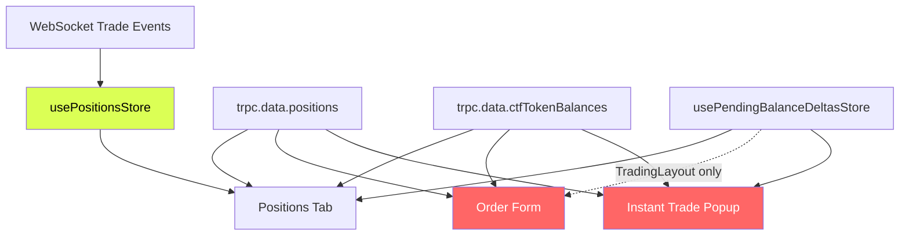
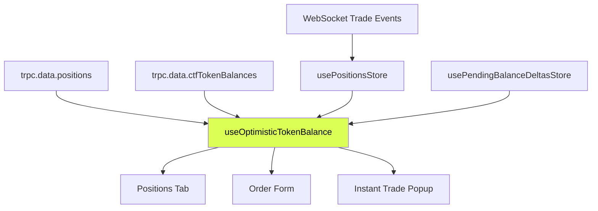

# Design Document: Optimistic Balance Display

## Overview

Three trading surfaces display share balances: the Positions Tab, the Order Form (in `TradingLayout` and `TradingLayoutTerminal`), and the Instant Trade Popup. The Positions Tab already updates instantly via WebSocket-local positions merged through `mergeMarketPositionsForCondition`. The Order Form and Instant Trade Popup lag by up to 5 seconds because they only use polled chain balances and API positions.

This design introduces a shared `useOptimisticTokenBalance` hook that encapsulates the merge logic for a single token, subscribing to both `usePositionsStore` and `usePendingBalanceDeltasStore`. All three surfaces will use this hook (or its underlying logic) to compute balances identically, eliminating the lag discrepancy.

## Architecture

### Current Data Flow



The red nodes lack `usePositionsStore` subscription. The terminal layout's `positionSizeForToken` also doesn't call `getEffectiveBalance`, making it doubly stale.

### Proposed Data Flow



All three surfaces converge on the same hook, guaranteeing identical merge behavior.

### Key Design Decision: Single-Token Hook vs. Full Merge Reuse

The existing `mergeMarketPositionsForCondition` operates on an entire condition (all tokens for a market). The Order Form and Instant Trade Popup only need the balance for a single token at a time. Rather than calling the full merge function and extracting one row, we extract the per-token merge logic into a focused hook. This avoids unnecessary computation and keeps the API surface minimal.

The hook replicates the same priority chain from `mergeMarketPositionsForCondition`:
1. Use chain balance as base when available, otherwise fall back to API position size
2. Apply `getEffectiveBalance` for pending delta reconciliation
3. If result is below threshold AND a local position exists for this token, use the local position's accumulated size (the "local overlay")
4. Once chain/API catches up, the local overlay is naturally superseded

## Components and Interfaces

### New Hook: `useOptimisticTokenBalance`

**File:** `apps/web/src/hooks/use-optimistic-token-balance.ts`

```typescript
/**
 * Compute the optimistic balance for a single token, merging:
 * - Chain balance (most authoritative when available)
 * - API position size (fallback when chain hasn't indexed)
 * - Pending balance deltas (getEffectiveBalance anti-double-counting)
 * - WebSocket-local positions (instant overlay until chain/API catch up)
 *
 * Mirrors the per-token logic inside mergeMarketPositionsForCondition.
 */
export function useOptimisticTokenBalance(params: {
  tokenId: string;
  conditionId: string;
  safeAddress: string | null;
  chainBalance: number | undefined;
  apiPositionSize: number | undefined;
}): number
```

**Behavior:**
1. Subscribe to `usePositionsStore` (filtered to matching `tokenId` + `conditionId`)
2. Subscribe to `usePendingBalanceDeltasStore` (reactive to entry changes)
3. Compute `serverSize = chainBalance ?? apiPositionSize ?? 0`
4. Compute `effective = getEffectiveBalance(serverSize, safeAddress, tokenId)`
5. If `effective < CLOB_SIZE_DISPLAY_THRESHOLD` and a local position exists for this token in this condition with `size > 0`, return `localPosition.size`
6. Otherwise return `effective < CLOB_SIZE_DISPLAY_THRESHOLD ? 0 : effective`

### Modified Components

#### `TradingLayout` (`trading-layout.tsx`)

Replace inline `positionSizeForToken` with `useOptimisticTokenBalance`. The existing chain balance and API position queries remain; their results are passed into the hook.

#### `TradingLayoutTerminal` (`trading-layout-terminal.tsx`)

Replace inline `positionSizeForToken` with `useOptimisticTokenBalance`. The `positionSizeForTokenRaw` function is preserved unchanged for split/merge correctness.

#### `InstantTradePopup` (`instant-trade-popup.tsx`)

Replace the inline `positionSize` memo in `useInstantTradeData` with `useOptimisticTokenBalance`.

### Interface Changes

No prop changes to `OrderForm` or `InstantTradePopup`. The `positionSize` value passed to `OrderForm` and computed inside `useInstantTradeData` will simply come from the new hook instead of inline logic.

## Data Models

### Existing Stores (Unchanged)

**`usePositionsStore`** — `LocalPosition[]`
```typescript
interface LocalPosition {
  asset: string;        // token ID
  conditionId: string;  // market condition
  size: number;         // accumulated from WS trade events
  curPrice: number;
  outcome: string;
}
```

**`usePendingBalanceDeltasStore`** — `Map<string, PendingEntry>`
```typescript
interface PendingEntry {
  delta: number;
  baseline: number;   // server balance snapshot at delta creation
  clearAt: number;     // auto-expire timestamp (18s)
}
```

### Data Priority Chain (Per Token)

| Priority | Source | Latency | Notes |
|----------|--------|---------|-------|
| 1 | Chain balance (`ctfTokenBalances`) | 5–15s poll | Most authoritative once indexed |
| 2 | API position (`data.positions`) | ~5s stale | Fallback when chain hasn't indexed |
| 3 | Pending deltas (`getEffectiveBalance`) | Instant | Applied on top of #1/#2, baseline prevents double-count |
| 4 | Local position (`usePositionsStore`) | Instant | Only used when #1+#2+#3 yields below-threshold, meaning chain/API haven't caught up yet |


## Correctness Properties

*A property is a characteristic or behavior that should hold true across all valid executions of a system — essentially, a formal statement about what the system should do. Properties serve as the bridge between human-readable specifications and machine-verifiable correctness guarantees.*

### Property 1: Local Position Overlay When Chain Is Stale

*For any* token ID, condition ID, and safe address, if the chain balance and API position size are both undefined or below `CLOB_SIZE_DISPLAY_THRESHOLD`, and a local position exists in `usePositionsStore` for that token and condition with `size >= CLOB_SIZE_DISPLAY_THRESHOLD`, then `useOptimisticTokenBalance` shall return the local position's size.

**Validates: Requirements 1.2, 1.3, 2.2, 2.3**

### Property 2: Chain Supersedes Local Position

*For any* token ID, condition ID, and safe address, if the chain balance (after applying `getEffectiveBalance`) is at or above `CLOB_SIZE_DISPLAY_THRESHOLD`, then `useOptimisticTokenBalance` shall return the `getEffectiveBalance` result regardless of whether a local position exists for that token.

**Validates: Requirements 1.4, 2.4**

### Property 3: Equivalence With Full Merge

*For any* valid combination of chain balance, API position size, local positions, and pending deltas for a single token within a condition, the output of `useOptimisticTokenBalance` shall equal the `size` field of the corresponding row produced by `mergeMarketPositionsForCondition` when given the same inputs (with the token present in `scopedPositions` or `localPositions` as appropriate).

**Validates: Requirements 3.1, 3.3, 3.4, 6.1**

### Property 4: Anti-Double-Counting (Example)

When chain balance is 100 shares for a token and the local position also shows 100 shares from the same trade, `useOptimisticTokenBalance` shall return 100, not 200.

**Validates: Requirements 3.2**

### Property 5: Monotonic Convergence

*For any* sequence of input states representing data source convergence after a buy trade (chain balance increasing from 0 toward the traded amount), the output of `useOptimisticTokenBalance` shall be monotonically non-decreasing. For a sell trade (chain balance decreasing toward the post-sell amount), the output shall be monotonically non-increasing.

**Validates: Requirements 4.2, 4.3**

## Error Handling

### CLOB "Not Enough Balance" Errors

The optimistic balance may allow users to attempt sells before on-chain settlement completes. Per Requirement 5, the system intentionally does not add client-side guards. When the CLOB rejects with "not enough balance":

- **Order Form**: The existing error handling flow in `OrderForm` displays the CLOB error message via toast. No changes needed.
- **Instant Trade Popup**: The existing error handling in `usePostOrder` / `executeMarketSell` displays the error via toast. No changes needed.

### Edge Cases

| Scenario | Behavior |
|----------|----------|
| `safeAddress` is null | Hook returns 0 (no balance computation without a wallet) |
| `tokenId` is empty string | Hook returns 0 |
| Local position has negative size (sell) | `getEffectiveBalance` handles sell-side via `min(server, expected)` |
| Pending delta expires (18s TTL) | `getEffectiveBalance` returns server balance; local overlay may briefly show until chain catches up |
| Chain balance and local position both below threshold | Hook returns 0 (dust suppression) |

## Testing Strategy

### Unit Tests

Unit tests cover specific examples and edge cases:

- Anti-double-counting example (Property 4): chain=100, local=100 → output=100
- Null/empty inputs: no safeAddress, no tokenId, no chain data
- Dust suppression: values below `CLOB_SIZE_DISPLAY_THRESHOLD` return 0
- Sell-side local position: negative size handling
- Pending delta expiry: after 18s, delta is ignored

### Property-Based Tests

Property tests use `fast-check` (already available in the monorepo's Vitest setup) with minimum 100 iterations per property.

Each property test must be tagged with a comment referencing the design property:
```
// Feature: optimistic-balance-display, Property N: <title>
```

| Property | Generator Strategy |
|----------|-------------------|
| Property 1: Local overlay | Generate random tokenId, conditionId, safeAddress. Set chainBalance/apiSize to `undefined` or below threshold. Generate a LocalPosition with size above threshold. Assert hook returns local size. |
| Property 2: Chain supersedes | Generate random inputs with chainBalance above threshold. Generate optional LocalPosition. Assert hook returns getEffectiveBalance result. |
| Property 3: Equivalence | Generate full input sets (chain, API, local, pending). Run both the hook logic and mergeMarketPositionsForCondition. Compare the token's size in both outputs. |
| Property 5: Monotonic convergence | Generate a buy amount. Create a sequence of states where chain balance increases from 0 to the buy amount. Assert output sequence is non-decreasing. |

### Test Configuration

- Library: `fast-check` with Vitest
- Iterations: 100 minimum per property (`fc.assert(property, { numRuns: 100 })`)
- Test location: `tests/unit/optimistic-balance-display.test.ts`
- Each property-based test references its design document property via comment tag
- Tag format: `Feature: optimistic-balance-display, Property {number}: {title}`
