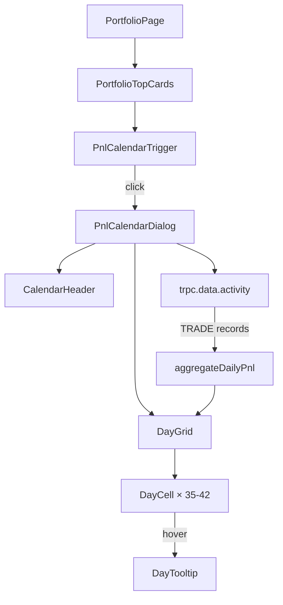

# Design Document: PNL Calendar

## Overview

The PNL Calendar is a dialog-based monthly calendar view that visualizes daily trading profit and loss on the portfolio page. A calendar icon trigger in the portfolio top cards area opens a modal showing a 7-column day grid. Each day cell displays the net PNL (sell volume − buy volume) color-coded green/red. Hovering a day with activity shows a tooltip with buy/sell counts and volumes. Data is sourced from the existing `trpc.data.activity` endpoint filtered to TRADE type.

The component lives at `apps/web/src/components/portfolio/pnl-calendar.tsx` and is rendered inside the portfolio page when the user's wallet is connected.

## Architecture



The feature is a single client component file with these internal pieces:

1. **PnlCalendarTrigger** — icon button rendered inside `PortfolioTopCards`, opens the dialog.
2. **PnlCalendarDialog** — `Dialog` from `@/components/ui/dialog`, contains header + grid.
3. **CalendarHeader** — title "PNL Calendar", trophy placeholder with tooltip, month/year display with prev/next navigation.
4. **DayGrid** — 7-column CSS grid (Mon–Sun) with weekday headers and week rows.
5. **DayCell** — `memo`-ized cell showing day number + PNL value, color-coded.
6. **DayTooltip** — `Tooltip` from `@/components/ui/tooltip`, shown on hover for days with activity.

Data flow:
- The dialog fetches activity for the displayed month via `useQuery(trpc.data.activity.queryOptions(...))`.
- A pure function `aggregateDailyPnl` groups trades by day and computes per-day stats (PNL, buy/sell counts, buy/sell volumes).
- The grid maps calendar days to their aggregated stats for rendering.

## Components and Interfaces

### PnlCalendarTrigger

```typescript
interface PnlCalendarTriggerProps {
  // No props needed — uses internal dialog state
}
```

- Renders a `Button` (variant `ghost`, size `icon-sm`) with `CalendarDays` icon from lucide-react.
- `aria-label="Open PNL Calendar"`.
- Controls `open` state for the dialog via `useState`.

### PnlCalendarDialog

```typescript
interface PnlCalendarDialogProps {
  open: boolean;
  onOpenChange: (open: boolean) => void;
  address: string;
}
```

- Uses `Dialog` / `DialogContent` from `@/components/ui/dialog`.
- Manages `viewMonth` state (`Date`) for month navigation.
- Fetches activity data for the displayed month boundaries.
- Passes aggregated daily data to the grid.

### CalendarHeader

Internal to the dialog. Contains:
- Left: "PNL Calendar" title (`text-sm font-medium`).
- Right group: Trophy button with `Tooltip` ("Flex your monthly PNL"), month/year label, prev/next `Button` (variant `ghost`).

### DayCell

```typescript
interface DayCellProps {
  day: Date;
  isCurrentMonth: boolean;
  isToday: boolean;
  stats: DayStats | null;
}
```

- `memo`-ized component.
- Shows day number top-left (`text-xs`).
- Shows PNL value centered (`text-[10px]`) in `text-positive` or `text-negative`.
- Days with no activity: no PNL shown, day number in `text-text-tertiary`.
- Padding days (prev/next month): reduced opacity via `text-text-tertiary`.
- Today: subtle `bg-surface-2` background.

### DayTooltip

Wraps each `DayCell` that has activity in a `Tooltip`. Content:
- Date header: `format(day, "EEE, MMM d, yyyy")` (`text-xs font-medium`).
- "Buys / Sells" row: buy count in `text-positive`, sell count in `text-negative`.
- "Buy Vol. (incl. fees)" row: total buy volume in `text-positive`.
- "Sell Vol. (incl. fees)" row: total sell volume in `text-negative`.

## Data Models

### Activity Record (from API)

```typescript
// Existing shape from trpc.data.activity
interface ActivityRecord {
  type: string;        // "TRADE"
  timestamp: number;   // Unix seconds
  side: string;        // "BUY" | "SELL"
  usdcSize: string;    // USD amount as string
  // ... other fields not used
}
```

### DayStats (computed)

```typescript
interface DayStats {
  pnl: number;         // sellVolume - buyVolume
  buyCount: number;
  sellCount: number;
  buyVolume: number;   // sum of BUY usdcSize
  sellVolume: number;  // sum of SELL usdcSize
}
```

### Aggregation Function

```typescript
/**
 * Pure function: groups activity records by calendar day and computes stats.
 * Key is ISO date string "YYYY-MM-DD".
 */
function aggregateDailyPnl(
  activities: ActivityRecord[],
  monthStart: Date,
  monthEnd: Date
): Map<string, DayStats>
```

This function:
1. Filters to records within the month boundaries.
2. Converts each `timestamp` (unix seconds) to a date key via `format(new Date(timestamp * 1000), "yyyy-MM-dd")`.
3. Accumulates buy/sell counts and volumes per day.
4. Computes `pnl = sellVolume - buyVolume` for each day.

### Query Parameters

```typescript
// For the displayed month
const queryInput = {
  user: address,
  type: ["TRADE"] as const,
  start: Math.floor(startOfMonth(viewMonth).getTime() / 1000),
  end: Math.floor(endOfMonth(viewMonth).getTime() / 1000) + 86400, // inclusive
  sortBy: "TIMESTAMP" as const,
  sortDirection: "ASC" as const,
  limit: 1000,
};
```


## Correctness Properties

*A property is a characteristic or behavior that should hold true across all valid executions of a system — essentially, a formal statement about what the system should do. Properties serve as the bridge between human-readable specifications and machine-verifiable correctness guarantees.*

The core testable logic in this feature is the `aggregateDailyPnl` pure function. It takes a list of activity records and produces per-day statistics. The UI rendering (color coding, formatting) is driven by these stats. Two properties capture the essential correctness guarantees.

### Property 1: Daily PNL aggregation correctness

*For any* list of activity records with type "TRADE", valid timestamps within a given month, side "BUY" or "SELL", and positive numeric usdcSize values, the `aggregateDailyPnl` function SHALL produce a `DayStats` entry for each day that has trades, where:
- `pnl` equals the sum of SELL `usdcSize` values minus the sum of BUY `usdcSize` values for that day
- `buyCount` equals the number of records with side "BUY" for that day
- `sellCount` equals the number of records with side "SELL" for that day
- `buyVolume` equals the sum of BUY `usdcSize` values for that day
- `sellVolume` equals the sum of SELL `usdcSize` values for that day
- `buyCount + sellCount` equals the total number of trade records for that day

**Validates: Requirements 6.2, 6.3, 6.4**

### Property 2: PNL sign determines color class

*For any* `DayStats` with a non-zero `pnl` value, the rendered Day_Cell SHALL apply `text-positive` when `pnl > 0` and `text-negative` when `pnl < 0`. Days with `pnl === 0` or no stats SHALL not display a PNL value.

**Validates: Requirements 4.4, 4.5, 4.6**

## Error Handling

| Scenario | Handling |
|----------|----------|
| Activity fetch fails (network error, server error) | Render the calendar grid with empty cells (no PNL data). The grid structure and navigation remain functional. No error toast — silent degradation. |
| Activity fetch returns empty array | Render all days with no PNL values. This is the normal state for months with no trading. |
| `usdcSize` is missing or non-numeric on a record | Treat as `0` via `Number(record.usdcSize) || 0`. Skip records that can't be parsed. |
| `timestamp` is missing or invalid | Skip the record during aggregation. |
| Wallet not connected | Calendar trigger is hidden entirely (Requirement 1.4). |
| Month navigation to far future/past | No restriction — the query will return empty results, grid renders with no data. |

## Testing Strategy

### Unit Tests (example-based)

Focus on specific rendering and interaction scenarios:

- **Trigger rendering**: Verify the calendar icon button renders inside portfolio top cards with correct `aria-label`.
- **Trigger hidden when disconnected**: Verify trigger is not rendered when wallet is not connected.
- **Dialog open/close**: Click trigger → dialog opens; press Escape → dialog closes.
- **Header content**: Dialog shows "PNL Calendar" title, month/year, navigation arrows, trophy icon.
- **Trophy tooltip**: Hover trophy → tooltip with "Flex your monthly PNL" appears.
- **Weekday headers**: Mon through Sun headers render in order.
- **Today highlight**: Current date cell has `bg-surface-2` background.
- **Loading state**: While data is pending, skeleton placeholders render in the grid.
- **Error state**: On fetch failure, grid renders with empty cells.
- **Empty day hover**: Hovering a day with no activity does not show a tooltip.
- **Accessibility**: All `aria-label` attributes present on trigger, nav buttons, trophy button.

### Property-Based Tests

Use `fast-check` for property-based testing. Minimum 100 iterations per property.

**Property 1: Daily PNL aggregation correctness**
- Generate random lists of activity records with:
  - `type: "TRADE"`
  - `timestamp`: random unix seconds within a random month
  - `side`: randomly "BUY" or "SELL"
  - `usdcSize`: random positive number (string format)
- Call `aggregateDailyPnl` and verify all invariants from Property 1.
- Tag: `Feature: pnl-calendar, Property 1: Daily PNL aggregation correctness`

**Property 2: PNL sign determines color class**
- Generate random `DayStats` objects with varying `pnl` values (positive, negative, zero).
- Verify the color class selection logic returns the correct token for each case.
- Tag: `Feature: pnl-calendar, Property 2: PNL sign determines color class`

### Integration Tests

- **Month navigation triggers refetch**: Navigate to a different month, verify `trpc.data.activity` is called with updated `start`/`end` timestamps matching the new month boundaries.
- **Correct wallet address**: Verify the query uses `safeAddress ?? funderAddress ?? address` consistent with the portfolio page pattern.
