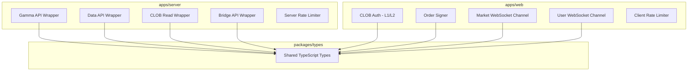

# Design Document: Polymarket API Audit

## Overview

This design describes the changes needed to align the Polymarket API integration codebase with the official API documentation (`docs/POLYMARKET.md`). The audit spans shared TypeScript types (`packages/types`), server-side API wrappers (`apps/server/src/lib/polymarket`), client-side auth and WebSocket code (`apps/web/src/lib`), and rate limiter configurations. Each change is a targeted fix — renaming a field, adding missing fields, swapping an HTTP method, or correcting an endpoint path — rather than a rewrite.

## Architecture

The existing architecture remains unchanged. The monorepo has three layers relevant to this audit:



All changes flow bottom-up: fix shared types first, then update wrappers and consumers that depend on those types.

## Components and Interfaces

### 1. Shared Types (`packages/types/src/`)

**Files affected**: `market.ts`, `order.ts`, `trade.ts`, `websocket.ts`

**Changes**:

- **`Market` type** (`market.ts`): Add fields `accepting_order_timestamp`, `enable_order_book`, `maker_base_fee`, `taker_base_fee`, `seconds_delay`, `fpmm`, `game_start_time`, `is_50_50_outcome` as optional fields.

- **`OpenOrder` type** (`order.ts`):
  - Rename `order_type` → `type` (values remain `GTC | GTD | FOK | FAK`)
  - Change `created_at: number` → `created_at: string`
  - Add fields: `owner`, `maker_address`, `associate_trades`

- **`Trade` type** (`trade.ts`):
  - Add fields: `taker_order_id`, `last_update`, `bucket_index`, `owner`, `maker_address`
  - Add field: `type` with values `"TAKER" | "MAKER"`

- **`MakerOrder` type** (`trade.ts`):
  - Add fields: `fee_rate_bps`, `asset_id`, `outcome`, `side`, `owner`, `maker_address`

- **`BestBidAskEvent` type** (`websocket.ts`):
  - Add field: `spread: string`

- **`UserTradeEvent` type** (`websocket.ts`):
  - Add fields: `taker_order_id`, `last_update`, `fee_rate_bps`, `match_time`, `outcome`, `owner`, `maker_address`, `transaction_hash`, `bucket_index`
  - Add field: `type` with literal value `"TRADE"`
  - Expand `maker_orders` array item to include: `fee_rate_bps`, `asset_id`, `outcome`, `side`, `owner`, `maker_address`

- **`UserOrderEvent` type** (`websocket.ts`):
  - Add fields: `associate_trades`, `owner`, `outcome`, `maker_address`, `status`, `expiration`, `created_at`, `order_type` (values `GTC | GTD | FOK | FAK`)

- **`NewMarketEvent`** (currently in `market-channel.ts`, should also be in `websocket.ts`):
  - Add fields: `question`, `slug`, `description`, `assets_ids`, `outcomes`, `event_message`

- **`MarketResolvedEvent`** (currently in `market-channel.ts`, should also be in `websocket.ts`):
  - Add fields: `winning_asset_id`, `winning_outcome`, `event_message`

### 2. Gamma API Wrapper (`apps/server/src/lib/polymarket/gamma.ts`)

**Changes**:
- `getMarketBySlug`: Replace list-and-filter with `GET /markets/slug/{slug}`
- `getEventBySlug`: Replace list-and-filter with `GET /events/slug/{slug}`
- `getPublicProfile`: Change from path param `GET /public-profile/{address}` to query param `GET /public-profile?address={address}`
- Error handler: Include response body text in error messages

### 3. Data API Wrapper (`apps/server/src/lib/polymarket/data.ts`)

**Changes**:
- `getOpenInterest`: Change endpoint from `/open-interest` to `/oi`
- `getTrades`: Add Zod validation enforcing `limit <= 500` and `offset <= 1000`
- `getActivity`: Add Zod validation enforcing `limit <= 500` and `offset <= 1000`

### 4. CLOB Read Wrapper (`apps/server/src/lib/polymarket/clob-read.ts`)

**Changes**:
- `OrderBookSnapshot` type: Add `min_order_size`, `tick_size`, `neg_risk` fields
- Add new function: `getTraded(tokenId: string)` → `GET /traded`
- Add new function: `getHeartbeat()` → `GET /` or heartbeat endpoint
- Add new function: `getFeeRate(apiKey: string)` → `GET /fee-rate`
- Note: `getPriceHistory` already exists but verify it maps to `/prices-history` correctly

### 5. CLOB Auth (`apps/web/src/lib/auth/clob-auth.ts`)

**Changes**:
- `L2Headers` type: Add `POLY_NONCE: string` field
- `performL1Auth`: Include `POLY_NONCE` header in the request to `/auth/api-key`
- `deriveApiKeyFromServer`: Change HTTP method from `POST` to `GET`, send params as query string instead of body
- `deriveApiKeyFromServer`: Include `POLY_NONCE` header in the request

### 6. Builder Auth (NEW file: `apps/web/src/lib/auth/builder-auth.ts`)

**New file** implementing builder program authentication:
- `BuilderL2Headers` type with `POLY_BUILDER_SIGNATURE`, `POLY_BUILDER_TIMESTAMP`, `POLY_BUILDER_API_KEY`, `POLY_BUILDER_PASSPHRASE`
- `signBuilderRequest` function producing HMAC-SHA256 signatures using builder credentials
- Builder volume endpoint wrapper: `GET /v1/builders/volume`

### 7. Order Signer (`apps/web/src/lib/polymarket/order-signer.ts`)

**Changes**:
- `signAndPostOrder`: Include `owner` field (API key) in POST body
- `postBatchOrders`: Include `owner` field in each order payload
- `cancelOrder`: Use `DELETE /order` with `orderID` in body instead of path param
- `cancelMarketOrders`: Support both `market` and `asset_id` parameters
- `OrderResponse` type: Add `takingAmount` and `makingAmount` fields
- `CancelOrdersResponse.not_canceled`: Change from `string[]` to `Record<string, string>`

### 8. WebSocket Channels

**`market-channel.ts`**:
- Move `NewMarketEvent` and `MarketResolvedEvent` type definitions to `packages/types/src/websocket.ts` with full documented fields
- Import from `@poly/types` instead of defining locally

**`user-channel.ts`**:
- No structural changes needed — types flow from `@poly/types`

### 9. Rate Limiters

**Server rate limiter** (`apps/server/src/lib/rate-limiter.ts`):
- `clob_book`: Change from `{ limit: 1500, windowMs: 10_000 }` to `{ limit: 50, windowMs: 10_000 }` (documented non-website limit)
- `clob_price_history`: Change from `{ limit: 1000, windowMs: 10_000 }` to `{ limit: 100, windowMs: 10_000 }` (documented price endpoint limit)

**Client rate limiter** (`apps/web/src/lib/rate-limiter.ts`):
- `POST /order`: Verify burst limit of 500/10s for order posting (current config shows 3500 — needs audit against docs for website vs non-website distinction)

### 10. Bridge API Wrapper (`apps/server/src/lib/polymarket/bridge.ts`)

**Changes**:
- `SupportedAsset` type: Rename `minDeposit` → `minCheckoutUsd`

## Data Models

### Updated `OpenOrder`

```typescript
interface OpenOrder {
  id: string;
  status: string;
  market: string;
  asset_id: string;
  side: "BUY" | "SELL";
  original_size: string;
  size_matched: string;
  price: string;
  outcome: string;
  created_at: string;          // was: number
  expiration: string;
  type: "GTC" | "GTD" | "FOK" | "FAK";  // was: order_type
  owner: string;               // NEW
  maker_address: string;       // NEW
  associate_trades: string[];  // NEW
}
```

### Updated `Trade`

```typescript
interface Trade {
  id: string;
  market: string;
  asset_id: string;
  side: "BUY" | "SELL";
  size: string;
  price: string;
  fee_rate_bps: string;
  status: string;
  match_time: string;
  outcome: string;
  transaction_hash: string;
  trader_side: "TAKER" | "MAKER";
  taker_order_id: string;     // NEW
  last_update: string;        // NEW
  bucket_index: number;       // NEW
  owner: string;              // NEW
  maker_address: string;      // NEW
  type: "TAKER" | "MAKER";   // NEW
}
```

### Updated `MakerOrder`

```typescript
interface MakerOrder {
  order_id: string;
  matched_amount: string;
  price: string;
  fee_rate_bps: string;   // NEW
  asset_id: string;       // NEW
  outcome: string;        // NEW
  side: string;           // NEW
  owner: string;          // NEW
  maker_address: string;  // NEW
}
```

### Updated `UserTradeEvent`

```typescript
interface UserTradeEvent {
  event_type: "trade";
  type: "TRADE";                // NEW
  id: string;
  asset_id: string;
  market: string;
  side: "BUY" | "SELL";
  size: string;
  price: string;
  status: "MATCHED" | "MINED" | "CONFIRMED" | "RETRYING" | "FAILED";
  taker_order_id: string;      // NEW
  last_update: string;         // NEW
  fee_rate_bps: string;        // NEW
  match_time: string;          // NEW
  outcome: string;             // NEW
  owner: string;               // NEW
  maker_address: string;       // NEW
  transaction_hash: string;    // NEW
  bucket_index: number;        // NEW
  maker_orders: Array<{
    order_id: string;
    matched_amount: string;
    price: string;
    fee_rate_bps: string;      // NEW
    asset_id: string;          // NEW
    outcome: string;           // NEW
    side: string;              // NEW
    owner: string;             // NEW
    maker_address: string;     // NEW
  }>;
}
```

### Updated `UserOrderEvent`

```typescript
interface UserOrderEvent {
  event_type: "order";
  type: "PLACEMENT" | "UPDATE" | "CANCELLATION";
  id: string;
  asset_id: string;
  market: string;
  side: "BUY" | "SELL";
  original_size: string;
  size_matched: string;
  price: string;
  associate_trades: string[];  // NEW
  owner: string;               // NEW
  outcome: string;             // NEW
  maker_address: string;       // NEW
  status: string;              // NEW
  expiration: string;          // NEW
  created_at: string;          // NEW
  order_type: "GTC" | "GTD" | "FOK" | "FAK";  // NEW
}
```

### Updated `BestBidAskEvent`

```typescript
interface BestBidAskEvent {
  event_type: "best_bid_ask";
  asset_id: string;
  market: string;
  best_bid: string;
  best_ask: string;
  spread: string;     // NEW
  timestamp: string;
}
```

### Updated `NewMarketEvent`

```typescript
interface NewMarketEvent {
  event_type: "new_market";
  market: string;
  question: string;        // NEW
  slug: string;            // NEW
  description: string;     // NEW
  assets_ids: string[];    // NEW
  outcomes: string[];      // NEW
  event_message: string;   // NEW
  timestamp: string;
}
```

### Updated `MarketResolvedEvent`

```typescript
interface MarketResolvedEvent {
  event_type: "market_resolved";
  market: string;
  winning_asset_id: string;   // NEW
  winning_outcome: string;    // NEW
  event_message: string;      // NEW
  timestamp: string;
}
```

### New `BuilderL2Headers`

```typescript
interface BuilderL2Headers {
  POLY_BUILDER_SIGNATURE: string;
  POLY_BUILDER_TIMESTAMP: string;
  POLY_BUILDER_API_KEY: string;
  POLY_BUILDER_PASSPHRASE: string;
}
```

### Updated `L2Headers`

```typescript
interface L2Headers {
  POLY_ADDRESS: string;
  POLY_SIGNATURE: string;
  POLY_TIMESTAMP: string;
  POLY_API_KEY: string;
  POLY_PASSPHRASE: string;
  POLY_NONCE: string;  // NEW
}
```


## Correctness Properties

*A property is a characteristic or behavior that should hold true across all valid executions of a system — essentially, a formal statement about what the system should do. Properties serve as the bridge between human-readable specifications and machine-verifiable correctness guarantees.*

Most acceptance criteria in this audit are structural type fixes or endpoint URL corrections. These are best validated at compile time (TypeScript will reject incorrect field names/types) and via example-based unit tests (mock fetch, verify URL/method/body). However, several criteria yield meaningful universal properties:

### Property 1: Data API pagination validation rejects out-of-bounds inputs

*For any* `limit` value greater than 500 or any `offset` value greater than 1000, the Zod input schema for paginated Data API endpoints (trades, activity) SHALL reject the input with a validation error.

**Validates: Requirements 2.2, 2.3**

### Property 2: HMAC-SHA256 signing produces correct base64 output

*For any* secret string and any message string, the `hmacSha256` signing function SHALL produce a base64-encoded string that, when decoded and compared byte-by-byte, matches the output of a reference HMAC-SHA256 computation over the same inputs.

**Validates: Requirements 5.3, 10.2**

### Property 3: Error response body text is included in thrown errors

*For any* non-OK HTTP response with any body text, the API wrapper error handler (for Bridge, Gamma, and CLOB APIs) SHALL throw an error whose message contains the original response body text.

**Validates: Requirements 8.1, 8.3**

### Property 4: Batch order payloads always include owner field

*For any* batch of orders submitted via `postBatchOrders`, every order object in the request payload SHALL contain a non-empty `owner` field set to the API key.

**Validates: Requirements 4.3**

## Error Handling

### API Wrapper Error Handling Pattern

All API wrappers (Gamma, Data, CLOB, Bridge) follow the same error pattern:

1. Check `response.ok`
2. If not OK, read `response.text()` for the body
3. Throw an `Error` with format: `{API Name} error: {status} {statusText} for {path} - {bodyText}`

The Bridge API wrapper currently omits the body text — this must be fixed.

### CLOB Order Error Codes

The order signer should parse CLOB error responses and surface specific error codes:
- `INVALID_ORDER_MIN_TICK_SIZE`
- `INVALID_ORDER_NOT_ENOUGH_BALANCE`
- `INVALID_ORDER_SIZE_TOO_SMALL`
- Other documented codes

### Geoblock Failure Handling

- Network errors during geoblock check: fail open for read-only (allow browsing), fail closed for trading (block order submission)
- This requires distinguishing between "geoblock returned blocked" vs "geoblock check failed"

## Testing Strategy

### Approach

This audit is primarily a type-alignment and endpoint-correction effort. The testing strategy uses two complementary approaches:

1. **TypeScript compilation** — Most type completeness criteria (adding fields, renaming fields, changing types) are validated by the TypeScript compiler. If a field is missing or mistyped, `pnpm check-types` will fail.

2. **Unit tests** — Endpoint URL corrections, HTTP method changes, header presence, and request body shape are tested with mocked `fetch` calls.

3. **Property-based tests** — Universal properties (input validation, signing correctness, error handling) are tested with generated inputs.

### Property-Based Testing Configuration

- Library: **fast-check** (TypeScript-native, works with Vitest)
- Minimum iterations: 100 per property
- Each test tagged with: `Feature: polymarket-api-audit, Property {N}: {title}`

### Test Organization

Tests live alongside the code they verify:
- `packages/types/src/__tests__/` — Type compilation tests (ensure updated types accept valid data)
- `apps/server/src/lib/polymarket/__tests__/` — API wrapper tests (endpoint URLs, methods, error handling)
- `apps/web/src/lib/auth/__tests__/` — Auth tests (headers, signing, HTTP methods)
- `apps/web/src/lib/polymarket/__tests__/` — Order signer tests (owner field, cancel body shape)

### Unit Test Coverage

| Requirement | Test Type | What's Verified |
|---|---|---|
| 1.1-1.3 | Unit (mock fetch) | Correct endpoint URLs and query params |
| 2.1 | Unit (mock fetch) | `/oi` endpoint path |
| 3.1-3.6 | TypeScript compilation | Type shapes compile correctly |
| 4.1-4.2, 4.4-4.5 | Unit (mock fetch) | HTTP methods, body shape, query params |
| 5.1-5.2, 5.4 | Unit (mock fetch) | Header presence, domain constants |
| 6.1-6.11 | TypeScript compilation + unit | Event types and handler sets |
| 7.1-7.7 | TypeScript compilation | Type shapes compile correctly |
| 9.1-9.3 | Unit (constant check) | Rate limit config values |
| 10.1, 10.3-10.4 | Unit (mock fetch) | Builder headers and endpoint |
| 11.1-11.4 | Unit (mock fetch) | New endpoint wrappers |

### Property Test Coverage

| Property | Test Type | What's Verified |
|---|---|---|
| Property 1 | fast-check | Pagination bounds rejection |
| Property 2 | fast-check | HMAC-SHA256 signing correctness |
| Property 3 | fast-check | Error body inclusion |
| Property 4 | fast-check | Batch owner field presence |
