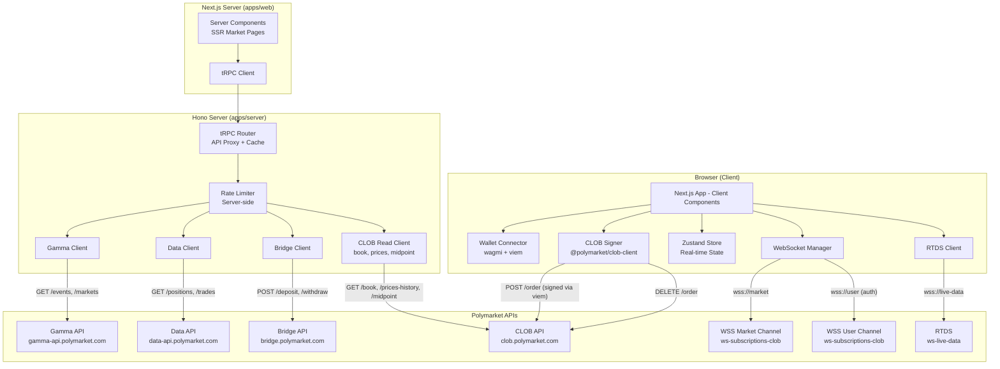

# Design Document: Polymarket Trading Terminal

## Overview

The Polymarket Trading Terminal is a Next.js App Router application that provides a full-featured trading interface for Polymarket prediction markets. The architecture follows a strict client-server boundary: all private key operations and order signing happen exclusively on the client, while market data fetching and caching leverage Next.js Server Components and Route Handlers as a proxy/cache layer.

The system integrates with five Polymarket APIs (CLOB, Gamma, Data, Bridge, RTDS) and two WebSocket channels (market, user). The frontend uses shadcn/ui + Tailwind CSS for the UI layer, with Zustand for client-side state management of real-time trading data.

### Key Architecture Decisions

1. **Client-side order signing via viem**: Private keys never leave the browser. Order signing is reimplemented using `viem` (already a wagmi dependency) to avoid bundling the Node.js-only `@polymarket/clob-client` SDK in the browser. The `@polymarket/clob-client` is used server-side only for read operations (book, prices). The EIP-712 order struct signing and HMAC-SHA256 L2 auth are implemented directly with viem's `signTypedData` and Web Crypto API.
2. **Hono server as API proxy**: Gamma API, Data API, Bridge API, and CLOB read endpoints are proxied through a Hono backend (`apps/server`) via tRPC, enabling server-side caching, rate limiting, and hiding API structure.
3. **Better-T-Stack monorepo**: Scaffolded with `next` + `hono` + `postgres` + `drizzle` + `trpc` + `turborepo`. Shared types via `packages/api`.
4. **WebSocket connections are client-side**: Both CLOB market/user channels and RTDS connect directly from the browser.
5. **Wallet-based auth (no Better-Auth/Clerk)**: Polymarket uses EIP-712 → HMAC auth, not traditional username/password. Auth is `none` in Better-T-Stack; custom wallet auth via wagmi + viem.
6. **Builder Program integration deferred**: Builder signing, gasless relayer, and order attribution are Phase 2 features requiring Polymarket approval.
7. **Neg-risk market support**: Multi-outcome markets use a different exchange contract (`NEG_RISK_CTF_EXCHANGE`) for order signing. The client-side signing logic handles both contract addresses based on the market's `neg_risk` flag.

## Tech Stack (Better-T-Stack Configuration)

The project will be scaffolded using Better-T-Stack CLI with the following configuration:

```bash
npx create-better-t-stack@latest polymarket-terminal \
  --frontend next \
  --backend hono \
  --runtime node \
  --database postgres \
  --orm drizzle \
  --api trpc \
  --auth none \
  --addons turborepo biome ultracite skills \
  --examples none \
  --package-manager pnpm \
  --db-setup none
```

### Stack Selection Rationale

| Choice   | Option                                      | Rationale                                                                                                                                                                                                                 |
| -------- | ------------------------------------------- | ------------------------------------------------------------------------------------------------------------------------------------------------------------------------------------------------------------------------- |
| Frontend | `next`                                      | SSR for SEO on market pages, App Router for server/client component split, Route Handlers as API proxy. Skills available: `next-best-practices`, `vercel-composition-patterns`, `vercel-react-best-practices`.            |
| Backend  | `hono`                                      | Lightweight, fast API proxy for Polymarket APIs. Runs in `apps/server` for server-side rate limiting, caching, and data aggregation. Separates proxy logic from Next.js.                                                  |
| Runtime  | `node`                                      | Standard Node.js runtime. Cloudflare Workers deferred to Phase 2 (WebSocket limitations).                                                                                                                                 |
| Database | `postgres`                                  | Needed for Phase 2 features: whale tracking analytics, user preferences, referral system, copy trading state. Not strictly needed for MVP but avoids re-scaffolding later.                                                |
| ORM      | `drizzle`                                   | TypeScript-first, lightweight, excellent DX. Compatible with Postgres.                                                                                                                                                    |
| API      | `trpc`                                      | Type-safe internal API between Next.js frontend and Hono backend. Full support with Next.js frontend.                                                                                                                     |
| Auth     | `none`                                      | Authentication is wallet-based (EIP-712 → HMAC). Polymarket's L1/L2 auth flow replaces traditional auth. Custom wallet auth implemented via wagmi + viem. Better-Auth/Clerk don't support wallet signing.                 |
| Addons   | `turborepo`, `biome`, `ultracite`, `skills` | Turborepo for monorepo build orchestration. Biome for fast linting/formatting. Ultracite for strict TypeScript/ESLint config. Skills installs AI agent skills for coding assistants (Cursor, Claude Code, Copilot, Kiro). |
| DB Setup | `none`                                      | Manual Postgres setup. Can use Neon/Supabase in production, Docker Compose locally (ref: `docker-expert` skill for multi-stage builds and compose patterns).                                                              |

### Compatibility Validation

Per Better-T-Stack compatibility rules:

- ✅ `next` + `trpc`: Full support
- ✅ `hono` + `node`: Compatible
- ✅ `postgres` + `drizzle`: Compatible
- ✅ `auth: none` with `backend: hono`: Valid (no auth requirements)
- ✅ `turborepo` + `biome` + `ultracite` + `skills`: Compatible addons

### Generated Monorepo Structure

Better-T-Stack will generate:

```
polymarket-terminal/
├── apps/
│   ├── web/          # Next.js App Router (frontend)
│   └── server/       # Hono API server (proxy + backend)
├── packages/
│   ├── api/          # tRPC router definitions (shared types)
│   ├── config/       # Shared TypeScript config
│   ├── db/           # Drizzle schema + migrations
│   └── env/          # Environment variable validation
├── turbo.json
├── biome.json
├── bts.jsonc
└── package.json
```

### Additional Dependencies (Post-Scaffold)

These packages are added on top of the Better-T-Stack scaffold:

| Package                   | Purpose                                                                     | Install Location    |
| ------------------------- | --------------------------------------------------------------------------- | ------------------- |
| `wagmi`                   | React hooks for wallet connection                                           | `apps/web`          |
| `viem`                    | TypeScript Ethereum library — wallet connection, EIP-712 signing, HMAC auth | `apps/web`          |
| `@tanstack/react-query`   | Server state management, data fetching                                      | `apps/web`          |
| `zustand`                 | Client-side state for real-time trading data                                | `apps/web`          |
| `lightweight-charts`      | TradingView-style price charts                                              | `apps/web`          |
| `fast-check`              | Property-based testing library                                              | `apps/web` (devDep) |
| `@testing-library/react`  | Component testing                                                           | `apps/web` (devDep) |
| `shadcn/ui` components    | UI primitives (already included by Better-T-Stack)                          | `apps/web`          |
| `@polymarket/clob-client` | CLOB API client SDK (server-side read operations: book, prices, midpoint)   | `apps/server`       |
| `ethers@5`                | Required by `@polymarket/clob-client` (server-side only)                    | `apps/server`       |
| `sonner`                  | Toast notifications for trade alerts and order events                       | `apps/web`          |

### UI Framework

- shadcn/ui + Tailwind CSS (scaffolded by Better-T-Stack with Next.js)
- Skills available: `shadcn-ui`, `tailwind-design-system`, `frontend-design`, `ui-ux-pro-max`, `interface-design`, `superdesign`
- Dark mode by default (trading terminal aesthetic)
- Responsive layout with collapsible sidebar

### Interface Design Principles

The trading terminal is a data-dense, precision-focused interface. All UI implementation MUST follow these principles derived from the `interface-design` skill (ref: `interface-design/references/principles.md`):

**Depth Strategy: Borders-Only**

- Use subtle low-opacity rgba borders (`rgba(255,255,255,0.06)` to `rgba(255,255,255,0.12)`) for region separation — no drop shadows
- Borders should disappear when you're not looking for them, but be findable when you need structure
- This matches the dense, technical feel of professional trading terminals (Linear, Raycast approach)

**Surface Elevation (Dark Mode)**

- Build a 5-level surface system with barely-perceptible lightness shifts between levels:
  - Level 0: App canvas (darkest base)
  - Level 1: Cards, panels (orderbook container, order form container)
  - Level 2: Dropdowns, popovers (order type selector, wallet modal)
  - Level 3: Nested overlays (confirmation dialogs)
  - Level 4: Highest elevation (rare — toast notifications)
- Each level should be only 2-3% lighter than the previous — you feel the hierarchy, you don't see it

**Typography for Trading Data**

- All price, size, volume, P&L, and numeric data columns MUST use monospace font with `font-variant-numeric: tabular-nums` for columnar alignment
- Build four text contrast levels: primary (prices, headings), secondary (labels, descriptions), tertiary (timestamps, metadata), muted (disabled, placeholder)
- Headlines: heavier weight, tight letter-spacing. Data: monospace. Labels: medium weight at smaller sizes.

**Color Semantics**

- Green for BUY side, profit, positive P&L — consistent across orderbook, positions, activity feed
- Red for SELL side, loss, negative P&L
- Gray builds structure. Color communicates status, action, emphasis. Unmotivated color is noise.
- Semantic colors (success, warning, error) should be slightly desaturated for dark backgrounds

**Animation**

- Micro-interactions (hover, focus, orderbook level updates): ~150ms with smooth deceleration easing
- Larger transitions (modals, panel slides): 200-250ms
- No spring/bounce effects — professional trading interfaces require calm precision

**Interactive States**

- Every interactive element needs: default, hover, active, focus, disabled states
- Data states: loading (skeleton), empty (zero positions), error (API failure with retry)
- No native `<select>` or `<input type="date">` — use shadcn/ui custom components exclusively

**Domain-Specific Design Notes**

- The trading terminal world is: precision, density, urgency, numerical. Not friendly, playful, or spacious.
- Orderbook should feel like a live instrument — tight spacing, high information density
- Use the `superdesign` skill during implementation to create design drafts before building complex UI components (orderbook, market detail layout, portfolio dashboard)

### Zustand v5 Implementation Patterns

All Zustand stores MUST follow these patterns to avoid documented issues (ref: `zustand-state-management` skill):

1. **TypeScript double parentheses**: Always use `create<T>()()` — single parentheses breaks middleware type inference
2. **Next.js hydration**: Any store using `persist` middleware must implement the `_hasHydrated` flag pattern with `onRehydrateStorage` callback to prevent hydration mismatches
3. **Multi-value selectors**: Use `useShallow` from `zustand/shallow` when selecting multiple values — creating new objects in selectors causes infinite render loops (Zustand v5 made this error explicit)
4. **Version pinning**: Pin `zustand@^5.0.10` minimum — v5.0.10 fixes a persist middleware race condition during concurrent rehydration
5. **No persist for trading state**: Real-time trading stores (orderbook, orders, positions) should NOT use persist middleware — they're populated from WebSocket/API on each session. Only user preferences (Phase 2) would use persist.

### Performance Patterns

Key patterns from `vercel-react-best-practices` skill (57 rules) that affect architecture:

- **Dynamic imports**: Use `next/dynamic` for heavy client components (`lightweight-charts`, orderbook renderer) to avoid blocking initial page load
- **Parallel fetching**: Use `Promise.all()` for independent data fetches in Server Components (e.g., market detail + price history + holders)
- **Per-request dedup**: Use `React.cache()` in Server Components to deduplicate identical fetches within a single request
- **Suspense streaming**: Wrap slow data sections in `<Suspense>` with skeleton fallbacks to stream content progressively
- **No barrel imports**: Import directly from component files, not barrel `index.ts` files — barrel files prevent tree-shaking
- **Async APIs (Next.js 15+)**: `params`, `searchParams`, `cookies()`, and `headers()` are all async — every page/layout using them must `await` them

## Architecture

### High-Level Architecture



### Data Flow Patterns

| Data Type                     | Source API                       | Fetch Location                          | Reason                                                                            |
| ----------------------------- | -------------------------------- | --------------------------------------- | --------------------------------------------------------------------------------- |
| Market listings, events, tags | Gamma API                        | Hono server (tRPC)                      | Cacheable, SEO-friendly SSR via Server Components                                 |
| Market detail, description    | Gamma API                        | Hono server (tRPC) → Server Component   | SSR for SEO                                                                       |
| Order book snapshot           | CLOB API `/book`                 | Hono server (tRPC) via CLOB read client | Initial load, then WebSocket takes over. Cacheable for short TTL.                 |
| Order book updates            | CLOB WebSocket `market`          | Client (WebSocket)                      | Real-time, low latency                                                            |
| Price history                 | CLOB API `/prices-history`       | Hono server (tRPC) via CLOB read client | Cacheable with revalidation                                                       |
| Order signing + submission    | CLOB API `/order`                | Client only (viem EIP-712 signing)      | Private key must stay in browser                                                  |
| Order cancellation            | CLOB API `/order`, `/cancel-all` | Client only                             | Requires L2 auth headers from client                                              |
| User positions, trades        | Data API                         | Client via tRPC                         | User-specific, minimal caching benefit. Server proxies for rate limit management. |
| User order/trade updates      | CLOB WebSocket `user`            | Client (WebSocket)                      | Real-time, authenticated                                                          |
| Bridge operations             | Bridge API                       | Hono server (tRPC)                      | Sensitive operations proxied                                                      |
| Geoblock check                | polymarket.com/api/geoblock      | Client                                  | IP-based, must come from user's IP                                                |
| Comments                      | RTDS WebSocket                   | Client (WebSocket)                      | Real-time streaming                                                               |
| Crypto prices                 | RTDS WebSocket                   | Client (WebSocket)                      | Real-time streaming                                                               |
| Leaderboard                   | Data API                         | Hono server (tRPC)                      | Cacheable, public data                                                            |
| Public profiles               | Gamma API                        | Hono server (tRPC) → Server Component   | SSR for SEO                                                                       |
| Top holders (whale data)      | Data API `/holders`              | Hono server (tRPC)                      | Cacheable, public data                                                            |

### Monorepo Structure (Better-T-Stack + Custom)

```
polymarket-terminal/
├── apps/
│   ├── web/                          # Next.js App Router (frontend)
│   │   ├── src/
│   │   │   ├── app/
│   │   │   │   ├── layout.tsx        # Root layout with providers
│   │   │   │   ├── page.tsx          # Home / market discovery
│   │   │   │   ├── (trading)/
│   │   │   │   │   └── market/
│   │   │   │   │       └── [slug]/
│   │   │   │   │           └── page.tsx  # Market detail + trading
│   │   │   │   ├── portfolio/
│   │   │   │   │   └── page.tsx
│   │   │   │   ├── leaderboard/
│   │   │   │   │   └── page.tsx
│   │   │   │   ├── profile/
│   │   │   │   │   └── [address]/
│   │   │   │   │       └── page.tsx
│   │   │   │   └── bridge/
│   │   │   │       └── page.tsx
│   │   │   ├── components/
│   │   │   │   ├── ui/               # shadcn/ui (scaffolded)
│   │   │   │   ├── trading/          # Orderbook, OrderForm, etc.
│   │   │   │   ├── market/           # MarketCard, MarketList, etc.
│   │   │   │   ├── portfolio/        # PositionTable, TradeHistory
│   │   │   │   ├── layout/           # Header, Sidebar, Footer
│   │   │   │   └── wallet/           # WalletButton, ConnectModal
│   │   │   ├── lib/
│   │   │   │   ├── polymarket/       # API client wrappers
│   │   │   │   │   ├── order-signer.ts # EIP-712 order signing via viem (client-side)
│   │   │   │   │   ├── order-validation.ts # Client-side order validation
│   │   │   │   │   └── geoblock.ts   # Geoblock checker (client-side)
│   │   │   │   ├── websocket/
│   │   │   │   │   ├── manager.ts    # WebSocket connection manager
│   │   │   │   │   ├── market-channel.ts
│   │   │   │   │   ├── user-channel.ts
│   │   │   │   │   └── rtds.ts       # RTDS client
│   │   │   │   ├── auth/
│   │   │   │   │   ├── wallet.ts     # Wallet connection (wagmi config)
│   │   │   │   │   └── clob-auth.ts  # L1/L2 auth flow
│   │   │   │   └── rate-limiter.ts   # Client-side rate limiter
│   │   │   ├── stores/               # Zustand stores
│   │   │   │   ├── orderbook.ts
│   │   │   │   ├── orders.ts
│   │   │   │   ├── positions.ts
│   │   │   │   ├── notifications.ts  # Toast notifications for trade events
│   │   │   │   └── wallet.ts
│   │   │   ├── utils/
│   │   │   │   └── trpc.ts           # tRPC client (scaffolded)
│   │   │   └── hooks/
│   │   │       ├── use-orderbook.ts   # WebSocket + store integration
│   │   │       └── use-notifications.ts # Trade event notifications
│   │   ├── next.config.ts
│   │   ├── components.json           # shadcn/ui config (scaffolded)
│   │   └── package.json
│   └── server/                       # Hono API server (scaffolded)
│       └── src/
│           ├── index.ts              # Hono app entry
│           ├── routers/
│           │   └── index.ts          # tRPC router (scaffolded)
│           ├── lib/
│           │   ├── polymarket/       # Server-side API clients
│           │   │   ├── gamma.ts      # Gamma API wrapper
│           │   │   ├── data.ts       # Data API wrapper
│           │   │   ├── bridge.ts     # Bridge API wrapper
│           │   │   └── clob-read.ts  # CLOB API read-only wrapper (book, prices, midpoint)
│           │   └── rate-limiter.ts   # Server-side rate limiter
│           └── package.json
├── packages/
│   ├── api/                          # tRPC router type exports + shared procedure definitions (scaffolded)
│   │   └── src/
│   │       └── index.ts              # AppRouter type export (procedures implemented in apps/server/src/routers/)
│   ├── config/                       # Shared TS config (scaffolded)
│   ├── db/                           # Drizzle schema + migrations (scaffolded)
│   ├── env/                          # Env validation (scaffolded)
│   └── types/                        # Shared TypeScript types (Polymarket data models)
│       ├── market.ts
│       ├── order.ts
│       ├── trade.ts
│       └── websocket.ts
├── turbo.json                        # Turborepo config (scaffolded)
├── biome.json                        # Biome config (scaffolded)
├── bts.jsonc                         # Better-T-Stack config
└── package.json
```

## Components and Interfaces

### 1. Wallet Connector (`lib/auth/wallet.ts`)

Uses `wagmi` + `viem` for wallet connection. Supports MetaMask, WalletConnect, Coinbase Wallet, and other EIP-1193 providers.

```typescript
interface WalletState {
  address: string | null;
  chainId: number | null;
  isConnected: boolean;
  signatureType: SignatureType; // 0=EOA, 1=POLY_PROXY, 2=GNOSIS_SAFE
  funderAddress: string | null;
}

enum SignatureType {
  EOA = 0,
  POLY_PROXY = 1,
  GNOSIS_SAFE = 2,
}
```

### 2. Auth Service (`lib/auth/clob-auth.ts`)

Manages the L1 → L2 authentication flow. L1 signs an EIP-712 `ClobAuth` message. L2 credentials are derived and stored in memory (never persisted to disk/localStorage for security).

```typescript
interface ApiCredentials {
  apiKey: string;
  secret: string;
  passphrase: string;
}

interface AuthService {
  performL1Auth(signer: Signer): Promise<ApiCredentials>;
  deriveApiKey(signer: Signer, nonce?: number): Promise<ApiCredentials>;
  getStoredCredentials(): ApiCredentials | null;
  clearCredentials(): void;
  signL2Request(method: string, path: string, body?: string): L2Headers;
  disconnect(): void; // Clears credentials, closes user WS, resets auth state
}

interface L2Headers {
  POLY_ADDRESS: string;
  POLY_SIGNATURE: string;
  POLY_TIMESTAMP: string;
  POLY_API_KEY: string;
  POLY_PASSPHRASE: string;
}
```

### 3. WebSocket Manager (`lib/websocket/manager.ts`)

Manages persistent WebSocket connections with automatic reconnection, subscription management, and message routing.

```typescript
interface WebSocketManagerConfig {
  url: string;
  channel: "market" | "user";
  auth?: ApiCredentials;
  onMessage: (event: WebSocketEvent) => void;
  onReconnect?: () => void;
}

interface WebSocketManager {
  connect(config: WebSocketManagerConfig): void;
  disconnect(): void;
  subscribe(assetIds: string[]): void;
  unsubscribe(assetIds: string[]): void;
  isConnected(): boolean;
}

type WebSocketEvent =
  | BookEvent
  | PriceChangeEvent
  | LastTradePriceEvent
  | BestBidAskEvent
  | NewMarketEvent
  | MarketResolvedEvent
  | TradeEvent
  | OrderEvent;
```

### 4. Order Manager (`components/trading/`)

Client-side component that handles order creation, signing, and submission. Uses `viem` for EIP-712 order struct signing directly in the browser, avoiding the Node.js-only `@polymarket/clob-client` SDK. The signing logic implements the CTF Exchange order struct with support for both standard and neg_risk exchange contracts.

```typescript
// Contract addresses for order signing
const CONTRACTS = {
  CTF_EXCHANGE: "0x4bFb41d5B3570DeFd03C39a9A4D8dE6Bd8B8982E",
  NEG_RISK_CTF_EXCHANGE: "0xC5d563A36AE78145C45a50134d48A1215220f80a",
  NEG_RISK_ADAPTER: "0xd91E80cF2E7be2e162c6513ceD06f1dD0dA35296",
};

interface OrderFormState {
  tokenId: string;
  side: "BUY" | "SELL";
  price: number;
  size: number;
  orderType: "GTC" | "GTD" | "FOK" | "FAK";
  postOnly: boolean;
  expiration?: number; // UTC timestamp for GTD
  negRisk: boolean; // Determines which exchange contract to use
}

interface OrderManagerActions {
  createAndPostOrder(order: OrderFormState): Promise<OrderResponse>;
  createAndPostMarketOrder(order: MarketOrderInput): Promise<OrderResponse>;
  postBatchOrders(orders: OrderFormState[]): Promise<OrderResponse[]>;
  cancelOrder(orderId: string): Promise<CancelResponse>;
  cancelAllOrders(): Promise<CancelResponse>;
  cancelMarketOrders(conditionId: string): Promise<CancelResponse>;
}

interface OrderResponse {
  success: boolean;
  errorMsg: string;
  orderID: string;
  transactionsHashes: string[];
  status: "matched" | "live" | "delayed" | "unmatched";
}
```

### 5. Rate Limiter (`lib/rate-limiter.ts`)

Token bucket rate limiter for both client-side CLOB requests and server-side proxy requests. Limits match Polymarket's documented rate limits (May 2025 update).

```typescript
interface RateLimiterConfig {
  burstLimit: number; // e.g., 3500 per 10s for POST /order
  sustainedLimit: number; // e.g., 36000 per 10min for POST /order
  burstWindow: number; // ms (10000 for 10s window)
  sustainedWindow: number; // ms (600000 for 10min window)
}

// Polymarket CLOB Trading Rate Limits (actual values)
const CLOB_RATE_LIMITS = {
  "POST /order": { burst: 3500, burstWindow: 10_000, sustained: 36000, sustainedWindow: 600_000 },
  "DELETE /order": { burst: 3000, burstWindow: 10_000, sustained: 30000, sustainedWindow: 600_000 },
  "POST /orders": { burst: 1000, burstWindow: 10_000, sustained: 15000, sustainedWindow: 600_000 },
  "DELETE /orders": {
    burst: 1000,
    burstWindow: 10_000,
    sustained: 15000,
    sustainedWindow: 600_000,
  },
  "DELETE /cancel-all": {
    burst: 250,
    burstWindow: 10_000,
    sustained: 6000,
    sustainedWindow: 600_000,
  },
  "DELETE /cancel-market-orders": {
    burst: 1000,
    burstWindow: 10_000,
    sustained: 1500,
    sustainedWindow: 600_000,
  },
};

// Server-side proxy rate limits
const SERVER_RATE_LIMITS = {
  gamma: { limit: 4000, window: 10_000 },
  data: { limit: 1000, window: 10_000 },
  clob_book: { limit: 1500, window: 10_000 },
  clob_price_history: { limit: 1000, window: 10_000 },
};

interface RateLimiter {
  acquire(): Promise<void>; // Blocks until capacity available
  tryAcquire(): boolean; // Returns false if no capacity
  getQueueLength(): number;
}
```

### 6. Order State Machine

Reference implementation from `polymarket-knowledge` skill. All order status transitions must follow this state machine:

```
PENDING → OPEN → PARTIALLY_FILLED → FILLED (terminal)
  ↓         ↓           ↓
REJECTED  CANCELLED   CANCELLED
          EXPIRED     EXPIRED
```

**API status mapping**: `live` → OPEN, `matched` → check `size_matched` vs `original_size` (PARTIALLY_FILLED or FILLED), `delayed` → PENDING, `cancelled` → CANCELLED, `expired` → EXPIRED.

**Terminal states** (no outgoing transitions): FILLED, CANCELLED, EXPIRED, REJECTED.

**Cancellable states**: OPEN, PARTIALLY_FILLED only.

The orders Zustand store must validate transitions — ignore any WebSocket event that would produce an invalid state transition.

### 7. Orderbook Renderer (`components/trading/orderbook.tsx`)

Client Component that renders the order book with real-time updates from WebSocket.

```typescript
interface OrderbookProps {
  tokenId: string;
  conditionId: string;
}

interface OrderbookState {
  bids: OrderLevel[]; // Sorted descending by price
  asks: OrderLevel[]; // Sorted ascending by price
  spread: number;
  midpoint: number;
  bestBid: number;
  bestAsk: number;
  lastTradePrice: number;
  lastTradeSide: "BUY" | "SELL";
}

interface OrderLevel {
  price: string;
  size: string;
  total: string; // Cumulative size
}
```

### 8. Geoblock Checker (`lib/geoblock.ts`)

```typescript
interface GeoblockResult {
  blocked: boolean;
  ip: string;
  country: string;
  region: string;
}

interface GeoblockChecker {
  check(): Promise<GeoblockResult>;
  getCachedResult(): GeoblockResult | null;
  isBlocked(): boolean;
}
```

### 9. Market Browser (Server + Client Components)

Server Components fetch market data via Gamma API for SSR. Client Components handle filtering, search, and infinite scroll.

```typescript
// Server-side data fetching
interface MarketFetcher {
  getEvents(params?: EventParams): Promise<PaginatedEvents>;
  getMarketBySlug(slug: string): Promise<Market>;
  getEventBySlug(slug: string): Promise<Event>;
  searchMarkets(query: string): Promise<SearchResults>;
  getTags(): Promise<Tag[]>;
  getSeries(): Promise<Series[]>;
  getSportsMetadata(): Promise<SportsMetadata>;
}

// Client-side state
interface MarketBrowserState {
  selectedTag: string | null;
  searchQuery: string;
  sortBy: "volume" | "newest" | "ending_soon";
  markets: Market[];
  isLoading: boolean;
  hasMore: boolean;
}
```

### 10. Bridge Service (`lib/polymarket/bridge.ts`)

Server-side proxy for Bridge API operations.

```typescript
interface BridgeService {
  createDepositAddresses(walletAddress: string): Promise<DepositAddresses>;
  createWithdrawalAddresses(params: WithdrawParams): Promise<WithdrawAddresses>;
  getQuote(params: QuoteParams): Promise<Quote>;
  getSupportedAssets(): Promise<SupportedAssets>;
  getTransactionStatus(address: string): Promise<TransactionStatus[]>;
}

interface Quote {
  quoteId: string;
  outputAmount: string;
  checkoutTime: string;
  fees: FeeBreakdown;
}

type TransactionStatusValue =
  | "DEPOSIT_DETECTED"
  | "PROCESSING"
  | "ORIGIN_TX_CONFIRMED"
  | "SUBMITTED"
  | "COMPLETED"
  | "FAILED";
```

## Data Models

### Market

```typescript
interface Market {
  condition_id: string;
  question_id: string;
  question: string;
  description: string;
  market_slug: string;
  image: string;
  icon: string;
  end_date_iso: string;
  active: boolean;
  closed: boolean;
  archived: boolean;
  accepting_orders: boolean;
  neg_risk: boolean;
  neg_risk_market_id: string;
  neg_risk_request_id: string;
  minimum_order_size: number;
  minimum_tick_size: number;
  order_price_min_tick_size: number; // 0.01 or 0.001
  tokens: MarketToken[];
  tags: string[];
  volume?: number;
  open_interest?: number;
  rewards?: {
    rates: Array<{ asset_address: string; rewards_daily_rate: number }>;
    min_size: number;
    max_spread: number;
  };
  notifications_enabled: boolean;
}

interface MarketToken {
  token_id: string;
  outcome: string; // "Yes" | "No"
  price: number;
  winner: boolean;
}
```

### Order

```typescript
interface SignedOrder {
  salt: string;
  maker: string;
  signer: string;
  taker: string;
  tokenId: string;
  makerAmount: string;
  takerAmount: string;
  side: 0 | 1; // 0=BUY, 1=SELL
  expiration: string;
  nonce: string;
  feeRateBps: string;
  signatureType: number;
  signature: string;
}

interface OpenOrder {
  id: string;
  status: string;
  market: string;
  asset_id: string;
  side: "BUY" | "SELL";
  original_size: string;
  size_matched: string;
  price: string;
  outcome: string;
  created_at: number;
  expiration: string;
  order_type: "GTC" | "GTD" | "FOK" | "FAK";
}
```

### Position

```typescript
interface Position {
  asset: string; // token_id
  conditionId: string;
  size: number;
  curPrice: number;
  outcome: string;
  market: MarketSummary;
  unrealizedPnl: number;
  realizedPnl: number;
}

interface ClosedPosition extends Position {
  exitPrice: number;
  closedAt: string;
}
```

### Trade

```typescript
interface Trade {
  id: string;
  market: string;
  asset_id: string;
  side: "BUY" | "SELL";
  size: string;
  price: string;
  fee_rate_bps: string;
  status: string;
  match_time: string;
  outcome: string;
  transaction_hash: string;
  trader_side: "TAKER" | "MAKER";
}
```

### WebSocket Events

```typescript
interface BookEvent {
  event_type: "book";
  asset_id: string;
  market: string;
  bids: Array<{ price: string; size: string }>;
  asks: Array<{ price: string; size: string }>;
  timestamp: string;
  hash: string;
}

interface PriceChangeEvent {
  event_type: "price_change";
  market: string;
  price_changes: Array<{
    asset_id: string;
    price: string;
    size: string;
    side: "BUY" | "SELL";
    hash: string;
    best_bid: string;
    best_ask: string;
  }>;
  timestamp: string;
}

interface UserTradeEvent {
  event_type: "trade";
  id: string;
  asset_id: string;
  market: string;
  side: "BUY" | "SELL";
  size: string;
  price: string;
  status: "MATCHED" | "MINED" | "CONFIRMED" | "RETRYING" | "FAILED";
  maker_orders: Array<{
    order_id: string;
    matched_amount: string;
    price: string;
  }>;
}

interface UserOrderEvent {
  event_type: "order";
  id: string;
  asset_id: string;
  market: string;
  side: "BUY" | "SELL";
  original_size: string;
  size_matched: string;
  price: string;
  type: "PLACEMENT" | "UPDATE" | "CANCELLATION";
}
```

## Correctness Properties

_A property is a characteristic or behavior that should hold true across all valid executions of a system — essentially, a formal statement about what the system should do. Properties serve as the bridge between human-readable specifications and machine-verifiable correctness guarantees._

### Property 1: Tag filtering returns only matching markets

_For any_ set of markets and any selected tag, filtering the markets by that tag should produce a result set where every market contains the selected tag in its `tags` array, and no market without that tag is included.

**Validates: Requirements 1.2**

### Property 2: Market detail rendering includes all required fields

_For any_ valid Market object, the rendered market detail view should contain the market question, description, resolution criteria (end_date_iso), volume, open interest, and end date.

**Validates: Requirements 1.4**

### Property 3: Series grouping correctness

_For any_ set of markets with series associations, grouping by series should produce groups where every market within a group shares the same series ID, and no market appears in more than one group.

**Validates: Requirements 1.6**

### Property 4: Order book sort invariant

_For any_ order book snapshot, the bids array should be sorted in descending order by price, and the asks array should be sorted in ascending order by price.

**Validates: Requirements 2.1**

### Property 5: Price change event applies correctly

_For any_ order book state and any `price_change` event, applying the event should update only the affected price level to the new aggregate size, leaving all other price levels unchanged.

**Validates: Requirements 2.3**

### Property 6: Spread and midpoint computation

_For any_ order book with at least one bid and one ask, the spread should equal `best_ask - best_bid` and the midpoint should equal `(best_ask + best_bid) / 2`.

**Validates: Requirements 2.4, 2.5**

### Property 7: Limit order amount consistency

_For any_ valid price (within tick size) and size, the signed order's `makerAmount` and `takerAmount` should be consistent with the price such that `takerAmount / makerAmount ≈ price` for BUY orders and `makerAmount / takerAmount ≈ price` for SELL orders.

**Validates: Requirements 3.1**

### Property 8: Market order type constraint

_For any_ market order created by the Order_Manager, the order type should be either FOK or FAK, never GTC or GTD.

**Validates: Requirements 3.2**

### Property 9: Post-only order validation

_For any_ order with `postOnly=true`, if the order type is FOK or FAK, the Order_Manager should reject the order client-side before submission. If the order type is GTC or GTD, the order should be accepted.

**Validates: Requirements 3.3**

### Property 10: Batch order size constraint

_For any_ batch of orders, if the batch size is between 1 and 15 inclusive, the batch should be accepted. If the batch size exceeds 15 or is 0, the batch should be rejected client-side.

**Validates: Requirements 3.4**

### Property 11: CLOB error message propagation

_For any_ CLOB API error response containing a non-empty `errorMsg`, the Order_Manager should surface that exact error message to the user.

**Validates: Requirements 3.8**

### Property 12: GTD expiration threshold

_For any_ user-specified expiration timestamp T, the resulting GTD order's expiration field should equal T + 60 (the one-minute security threshold in seconds).

**Validates: Requirements 3.9**

### Property 13: WebSocket trade event updates positions

_For any_ trade event received on the user channel, the positions store should reflect the trade: if the trade is for an existing position, the position size should be updated; if it's a new position, it should be added.

**Validates: Requirements 4.2**

### Property 14: WebSocket PLACEMENT event adds order

_For any_ order event of type PLACEMENT, the open orders store should contain an order with the matching ID, price, size, and side after processing.

**Validates: Requirements 4.3**

### Property 15: WebSocket CANCELLATION event removes order

_For any_ order event of type CANCELLATION, the open orders store should no longer contain an order with the matching ID after processing.

**Validates: Requirements 4.4**

### Property 16: WebSocket UPDATE event modifies size_matched

_For any_ order event of type UPDATE, the corresponding order in the open orders store should have its `size_matched` field updated to the value from the event.

**Validates: Requirements 4.5**

### Property 17: Trade history pagination invariant

_For any_ page of trade history results, the number of items should be less than or equal to 500 (the maximum page size).

**Validates: Requirements 5.3**

### Property 18: Portfolio value computation

_For any_ set of positions, the total portfolio value should equal the sum of `(size × curPrice)` for each position, matching the value returned by the `/value` endpoint.

**Validates: Requirements 5.6**

### Property 19: Price chart data append

_For any_ chart data state and any new `last_trade_price` event, appending the event should increase the chart data length by exactly one, and the last element should have the timestamp and price from the event.

**Validates: Requirements 6.3**

### Property 20: HMAC-SHA256 signing determinism

_For any_ (HTTP method, request path, request body, API secret) tuple, the L2 HMAC-SHA256 signature should be deterministic — signing the same inputs twice should produce the same signature.

**Validates: Requirements 7.4**

### Property 21: Wallet type to signature type mapping

_For any_ wallet type, the mapping to Polymarket signature type should be deterministic and correct: EOA wallets map to 0, POLY_PROXY wallets map to 1, GNOSIS_SAFE wallets map to 2.

**Validates: Requirements 7.5**

### Property 22: Geoblock disables trading

_For any_ geoblock response with `blocked: true`, the trading UI state should have order placement disabled and display a restriction message.

**Validates: Requirements 8.2**

### Property 23: Geoblock caching idempotence

_For any_ session, after the first geoblock check, subsequent calls to the geoblock checker should return the cached result without making additional API calls. The result should be identical to the first check.

**Validates: Requirements 8.3**

### Property 24: Quote display completeness

_For any_ Bridge API quote response, the displayed quote should contain the estimated output amount, checkout time, and fee breakdown.

**Validates: Requirements 9.3**

### Property 25: Transaction status validity

_For any_ Bridge API status response, the displayed status should be one of the valid status values: DEPOSIT_DETECTED, PROCESSING, ORIGIN_TX_CONFIRMED, SUBMITTED, COMPLETED, or FAILED.

**Validates: Requirements 9.4**

### Property 26: Profile rendering completeness

_For any_ public profile response, the rendered profile page should contain the username, profile picture, and trading statistics.

**Validates: Requirements 11.1**

### Property 27: PNL card data completeness

_For any_ active position, the generated PNL card data should contain the market question, position details (side, size), entry price, current price, and P&L percentage.

**Validates: Requirements 11.3**

### Property 28: Rate limiter enforcement

_For any_ sequence of N requests submitted to the rate limiter within a burst window, at most `burstLimit` requests should be executed within that window. Excess requests should be queued, not dropped.

**Validates: Requirements 12.1, 12.2, 12.3**

### Property 29: Exponential backoff on rate limit errors

_For any_ sequence of consecutive rate limit errors, the delay before each retry should be greater than the delay before the previous retry (exponentially increasing).

**Validates: Requirements 12.4**

### Property 30: Comment event appends to list

_For any_ comments list state and any new comment event, processing the event should increase the comments list length by one and the new comment should appear in the list.

**Validates: Requirements 13.2**

### Property 31: WebSocket reconnection with exponential backoff

_For any_ sequence of WebSocket disconnections (on either market or user channel), the reconnection delay should increase exponentially with each consecutive failure, and upon successful reconnection, all previously subscribed asset IDs (or markets for user channel) should be re-subscribed.

**Validates: Requirements 14.1, 14.2**

### Property 32: Subscription set union on subscribe

_For any_ existing subscription set S and any new set of asset IDs A, after subscribing to A, the active subscription set should equal S ∪ A.

**Validates: Requirements 14.3**

### Property 33: Subscription set difference on unsubscribe

_For any_ existing subscription set S and any set of asset IDs A to remove, after unsubscribing from A, the active subscription set should equal S \ A.

**Validates: Requirements 14.4**

### Property 34: Activity feed item rendering completeness

_For any_ trade object displayed in the activity feed, the rendered item should contain the market name, trade side, size, price, and timestamp.

**Validates: Requirements 15.2**

### Property 35: Whale threshold filtering

_For any_ set of positions and any configurable threshold, the whale tracker should return only positions with size greater than or equal to the threshold.

**Validates: Requirements 16.2**

### Property 36: Whale trade highlighting

_For any_ trade made by an address in the tracked whale set, that trade should be marked as highlighted in the activity feed.

**Validates: Requirements 16.3**

### Property 37: Neg-risk order uses correct exchange contract

_For any_ order on a market with `neg_risk=true`, the order signing should use the `NEG_RISK_CTF_EXCHANGE` contract address. For markets with `neg_risk=false`, the standard `CTF_EXCHANGE` address should be used.

**Validates: Requirements 17.2**

### Property 38: Wallet disconnect clears all user state

_For any_ wallet disconnect event, the resulting state should have: no stored L2 credentials, empty open orders list, empty positions list, trading UI disabled, and market WebSocket still connected.

**Validates: Requirements 18.1, 18.2, 18.3, 18.4, 18.5**

### Property 39: Trade notification on fill

_For any_ trade event received on the user WebSocket channel, a notification should be generated containing the market name, trade side, size, and price.

**Validates: Requirements 20.1**

### Property 40: Order state machine valid transitions

_For any_ order in state S and any incoming WebSocket event that would transition it to state S', the transition (S → S') must be in the valid transitions map. If the transition is invalid, the event should be ignored and the order state should remain unchanged.

**Validates: Requirements 4.3, 4.4, 4.5**

## Environment Variables

The `packages/env` package validates all required environment variables at build time using T3 Env + Zod (ref: `t3-dot-env-zod` skill).

- `packages/env/src/web.ts` uses `@t3-oss/env-nextjs` with `experimental__runtimeEnv` for client-side variables (Next.js-aware bundling)
- `packages/env/src/server.ts` uses `@t3-oss/env-core` for server-only variables (framework-agnostic, consumed by Hono)
- Both files set `emptyStringAsUndefined: true` to handle empty `.env` values correctly
- Build-time validation: `next.config.ts` imports the env module so missing variables fail the build, not runtime

```typescript
// packages/env/src/web.ts — uses @t3-oss/env-nextjs
import { createEnv } from "@t3-oss/env-nextjs";
import { z } from "zod";

export const env = createEnv({
  client: {
    NEXT_PUBLIC_CLOB_API_URL: z.string().url(),
    NEXT_PUBLIC_WS_MARKET_URL: z.string().url(),
    NEXT_PUBLIC_WS_USER_URL: z.string().url(),
    NEXT_PUBLIC_RTDS_URL: z.string().url(),
    NEXT_PUBLIC_WALLETCONNECT_PROJECT_ID: z.string().min(1),
    NEXT_PUBLIC_CHAIN_ID: z.string().default("137"),
  },
  experimental__runtimeEnv: {
    NEXT_PUBLIC_CLOB_API_URL: process.env.NEXT_PUBLIC_CLOB_API_URL,
    NEXT_PUBLIC_WS_MARKET_URL: process.env.NEXT_PUBLIC_WS_MARKET_URL,
    NEXT_PUBLIC_WS_USER_URL: process.env.NEXT_PUBLIC_WS_USER_URL,
    NEXT_PUBLIC_RTDS_URL: process.env.NEXT_PUBLIC_RTDS_URL,
    NEXT_PUBLIC_WALLETCONNECT_PROJECT_ID: process.env.NEXT_PUBLIC_WALLETCONNECT_PROJECT_ID,
    NEXT_PUBLIC_CHAIN_ID: process.env.NEXT_PUBLIC_CHAIN_ID,
  },
  emptyStringAsUndefined: true,
});

// packages/env/src/server.ts — uses @t3-oss/env-core
import { createEnv } from "@t3-oss/env-core";
import { z } from "zod";

export const env = createEnv({
  server: {
    GAMMA_API_URL: z.string().url().default("https://gamma-api.polymarket.com"),
    DATA_API_URL: z.string().url().default("https://data-api.polymarket.com"),
    BRIDGE_API_URL: z.string().url().default("https://bridge.polymarket.com"),
    CLOB_API_URL: z.string().url().default("https://clob.polymarket.com"),
    DATABASE_URL: z.string().url(),
    PORT: z.string().default("3001"),
  },
  runtimeEnv: process.env,
  emptyStringAsUndefined: true,
});
```

### Default Values

```
// Server-side (apps/server)
GAMMA_API_URL=https://gamma-api.polymarket.com
DATA_API_URL=https://data-api.polymarket.com
BRIDGE_API_URL=https://bridge.polymarket.com
CLOB_API_URL=https://clob.polymarket.com
DATABASE_URL=postgresql://...
PORT=3001

// Client-side (apps/web) — prefixed with NEXT_PUBLIC_
NEXT_PUBLIC_CLOB_API_URL=https://clob.polymarket.com
NEXT_PUBLIC_WS_MARKET_URL=wss://ws-subscriptions-clob.polymarket.com/ws/market
NEXT_PUBLIC_WS_USER_URL=wss://ws-subscriptions-clob.polymarket.com/ws/user
NEXT_PUBLIC_RTDS_URL=wss://ws-live-data.polymarket.com
NEXT_PUBLIC_WALLETCONNECT_PROJECT_ID=<your-project-id>
NEXT_PUBLIC_CHAIN_ID=137
```

## Twelve-Factor Compliance

The architecture follows [12-factor app](https://12factor.net/) principles where applicable (ref: `12-factor-app` skill). Key compliance areas:

### Logging (Factor XI)

- The Hono server (`apps/server`) MUST log structured JSON to stdout — no file-based logging, no log routing from the application
- Use a lightweight structured logger (e.g., `pino` or Hono's built-in logger middleware) configured for JSON output
- Log categories: API proxy requests (method, path, status, duration), rate limit events (endpoint, queue depth, throttle), CLOB client errors, tRPC procedure errors
- Logs are unbuffered and written directly to stdout — log aggregation/routing is the deployment platform's responsibility, not the app's
- Client-side: no structured logging requirement; use `console.warn`/`console.error` for development only

### Graceful Shutdown (Factor IX — Disposability)

- The Hono server MUST handle `SIGTERM` by:
  1. Stopping acceptance of new connections
  2. Finishing in-flight tRPC requests (with a timeout, e.g., 10 seconds)
  3. Closing the CLOB read client connection
  4. Exiting cleanly with code 0
- Fast startup: the server should be ready to accept requests within 2 seconds (no heavy initialization)
- This enables zero-downtime deploys and clean container orchestration

### Port Binding (Factor VII)

- The Hono server binds to `PORT` env var (default `3001`), exported via the env validation package
- Next.js uses its own `PORT` (default `3000`) — no conflict in development
- Both services are self-contained and export their HTTP service by binding to a port

### Stateless Processes (Factor VI)

- The Hono server is stateless except for the in-memory rate limiter, which maintains per-process token bucket counters
- Trade-off: for a single-instance deployment (MVP), this is acceptable. For multi-instance scaling, the rate limiter must move to a shared store (Redis) — documented in Phase 2 Roadmap
- No session state, no local filesystem writes, no sticky sessions

### Backing Services as Attached Resources (Factor IV)

- All Polymarket APIs (CLOB, Gamma, Data, Bridge, RTDS) are treated as attached resources, swappable via environment variables without code changes
- Database (Postgres) connection string is an env var — can point to local Docker, Neon, Supabase, or any Postgres-compatible service
- This enables seamless environment switching (dev → staging → production) by changing env vars only

### Idempotent Operations (Factor IX)

- Order cancellation (`DELETE /order`, `DELETE /cancel-all`) is naturally idempotent — canceling an already-canceled order returns success
- Order placement uses a unique `salt` (random nonce) per order, preventing duplicate submissions from producing duplicate fills
- Geoblock checks are idempotent — same IP always returns same result within a session

### Secrets Management (Factor III)

- `.env` files MUST be in `.gitignore` — never commit credentials to version control
- `.env.example` at repo root documents all required variables with placeholder values (no real secrets)
- L2 API credentials (apiKey, secret, passphrase) are stored in browser memory only — never persisted to localStorage or transmitted to the Hono server

### Deterministic Builds (Factor II)

- `pnpm-lock.yaml` MUST be committed to version control for reproducible installs
- All dependencies are explicitly declared in `package.json` files — no implicit system-level dependencies
- The monorepo uses `pnpm` with strict hoisting to prevent phantom dependencies

## Phase 2 Roadmap

Features deferred to Phase 2 (post-MVP):

| Feature                      | Dependencies                                              | Notes                                                                                                                         |
| ---------------------------- | --------------------------------------------------------- | ----------------------------------------------------------------------------------------------------------------------------- |
| Copy Trading                 | Database (user preferences, copy state), Data API polling | Requires persistent storage for copy relationships and trade mirroring logic                                                  |
| Builder Program              | Polymarket approval, Builder API keys                     | Gasless relayer, order attribution, builder leaderboard rewards                                                               |
| Referral System              | Database (referral links, tracking)                       | Custom referral link generation, referral leaderboard                                                                         |
| User Preferences             | Database (settings persistence)                           | Saved layouts, default order types, notification preferences                                                                  |
| Cloudflare Workers           | Runtime migration                                         | WebSocket limitations need evaluation                                                                                         |
| Docker Production Deployment | `docker-expert` skill                                     | Multi-stage builds for Next.js + Hono, Docker Compose for full stack orchestration, security hardening (non-root, distroless) |
| E2E Testing                  | Playwright setup                                          | Full integration tests with mocked Polymarket APIs                                                                            |
| Redis Rate Limiting          | Redis instance                                            | Move in-memory rate limiter to shared Redis store for multi-instance Hono scaling                                             |

## Error Handling

### API Errors

| Error Source                             | Handling Strategy                                                                                      |
| ---------------------------------------- | ------------------------------------------------------------------------------------------------------ |
| CLOB API order errors (INVALID*ORDER*\*) | Display specific error message from `errorMsg` field. Map known error codes to user-friendly messages. |
| CLOB API rate limit (429)                | Queue request, apply exponential backoff, retry automatically. Show "Rate limited, retrying..." toast. |
| Gamma API errors                         | Show fallback UI with "Unable to load markets" message. Retry with backoff.                            |
| Data API errors                          | Show stale data with "Last updated X ago" indicator. Retry in background.                              |
| Bridge API errors                        | Display error in bridge modal. Do not retry automatically (financial operations).                      |
| Geoblock endpoint failure                | Fail open for read-only access (market browsing). Fail closed for trading (disable order placement).   |

### WebSocket Errors

| Error Type                       | Handling Strategy                                                                                                            |
| -------------------------------- | ---------------------------------------------------------------------------------------------------------------------------- |
| Connection drop (market channel) | Exponential backoff reconnection (1s, 2s, 4s, 8s, max 30s). Re-subscribe to all asset IDs. Show "Reconnecting..." indicator. |
| Connection drop (user channel)   | Same backoff strategy. Re-authenticate with stored L2 credentials. If auth fails, prompt re-authentication.                  |
| RTDS connection drop             | Reconnect with backoff. Re-subscribe to topics. Comments may have gaps — fetch recent comments via REST on reconnect.        |
| Stale data detection             | Compare WebSocket `hash` field with local orderbook hash. If mismatch, fetch full book snapshot via REST.                    |

### Authentication Errors

| Error Type             | Handling Strategy                                                              |
| ---------------------- | ------------------------------------------------------------------------------ |
| INVALID_SIGNATURE      | Prompt user to reconnect wallet. Clear stored credentials.                     |
| NONCE_ALREADY_USED     | Attempt `deriveApiKey()` with same nonce. If fails, create new credentials.    |
| Expired L2 credentials | Silently re-derive using L1 auth. If wallet disconnected, prompt reconnection. |
| Wallet disconnection   | Clear all auth state. Disable trading UI. Show "Connect Wallet" prompt.        |

### Client-Side Validation Errors

| Validation                          | Error Message                                     |
| ----------------------------------- | ------------------------------------------------- |
| Order price below minimum tick size | "Price must be a multiple of {tickSize}"          |
| Order size below minimum            | "Minimum order size is {minSize}"                 |
| Post-only with FOK/FAK              | "Post-only orders must be GTC or GTD"             |
| Batch size > 15                     | "Maximum 15 orders per batch"                     |
| GTD expiration in the past          | "Expiration must be in the future"                |
| Insufficient balance                | "Insufficient balance. Available: {balance} USDC" |

## Testing Strategy

### Testing Framework

- **Unit tests**: Vitest (recommended by Next.js docs for App Router projects)
- **Property-based tests**: `fast-check` library for TypeScript
- **Component tests**: React Testing Library + Vitest
- **E2E tests**: Playwright (deferred to later phase)

### Property-Based Testing Configuration

- Library: `fast-check` (https://github.com/dubzzz/fast-check)
- Minimum 100 iterations per property test
- Each property test must reference its design document property
- Tag format: `Feature: polymarket-trading-terminal, Property {number}: {property_text}`

### Test Organization

```
apps/web/src/
├── __tests__/
│   ├── properties/           # Property-based tests
│   │   ├── orderbook.prop.test.ts    # Properties 4, 5, 6
│   │   ├── orders.prop.test.ts       # Properties 7, 8, 9, 10, 11, 12, 37
│   │   ├── websocket.prop.test.ts    # Properties 13, 14, 15, 16, 31, 32, 33, 38, 39
│   │   ├── portfolio.prop.test.ts    # Properties 17, 18
│   │   ├── rate-limiter.prop.test.ts # Properties 28, 29
│   │   ├── auth.prop.test.ts         # Properties 20, 21
│   │   ├── geoblock.prop.test.ts     # Properties 22, 23
│   │   ├── market.prop.test.ts       # Properties 1, 2, 3
│   │   ├── bridge.prop.test.ts       # Properties 24, 25
│   │   ├── profile.prop.test.ts      # Properties 26, 27
│   │   ├── activity.prop.test.ts     # Properties 30, 34
│   │   └── whale.prop.test.ts        # Properties 35, 36
│   ├── unit/                 # Unit tests for specific examples/edge cases
│   │   ├── orderbook.test.ts
│   │   ├── orders.test.ts
│   │   ├── order-signer.test.ts      # viem EIP-712 signing tests
│   │   ├── auth.test.ts
│   │   ├── rate-limiter.test.ts
│   │   └── geoblock.test.ts
│   └── components/           # Component rendering tests
│       ├── market-card.test.tsx
│       ├── orderbook.test.tsx
│       └── order-form.test.tsx
```

### Dual Testing Approach

- **Unit tests** focus on: specific API response handling, edge cases (empty orderbook, zero positions), error condition mapping, component rendering with specific props
- **Property tests** focus on: universal invariants (sort order, computation correctness), state machine transitions (WebSocket events → store updates), validation rules (order constraints, rate limits), set operations (subscriptions)
- Both are complementary: unit tests catch concrete bugs with known inputs, property tests verify general correctness across randomized inputs

### Key Test Generators (fast-check arbitraries)

```typescript
// Market generator
const arbMarket = fc.record({
  condition_id: fc.hexaString({ minLength: 64, maxLength: 64 }),
  question: fc.string({ minLength: 1, maxLength: 200 }),
  tags: fc.array(fc.string({ minLength: 1, maxLength: 30 }), { maxLength: 10 }),
  tokens: fc.array(arbMarketToken, { minLength: 2, maxLength: 2 }),
  // ...
});

// Order book level generator
const arbOrderLevel = fc.record({
  price: fc.float({ min: 0.001, max: 0.999, noNaN: true }),
  size: fc.float({ min: 1, max: 100000, noNaN: true }),
});

// WebSocket event generators
const arbPriceChangeEvent = fc.record({
  event_type: fc.constant("price_change"),
  market: fc.hexaString({ minLength: 64, maxLength: 64 }),
  price_changes: fc.array(arbPriceChange, { minLength: 1, maxLength: 5 }),
  timestamp: fc.stringify(fc.nat()),
});
```
