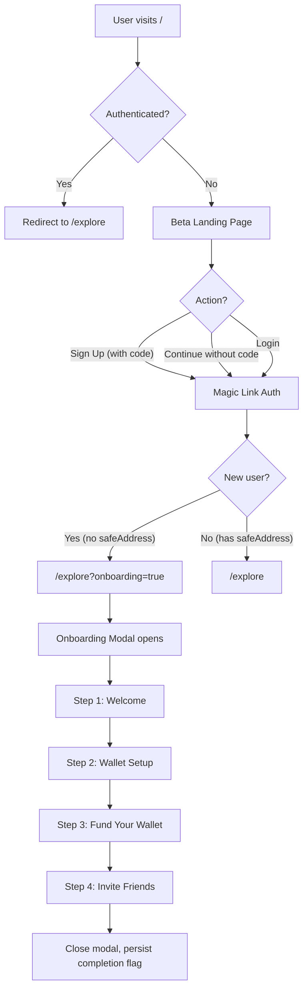
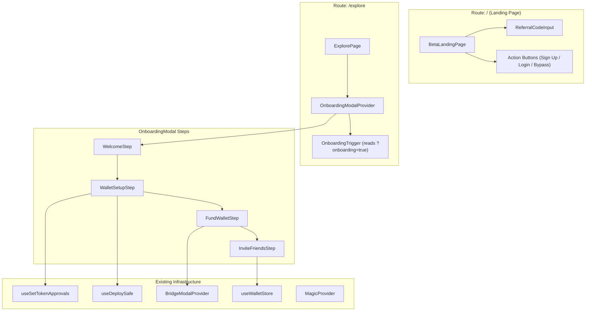

# Design Document: Private Beta Onboarding

## Overview

This design covers the private beta onboarding flow for Doji — a gated landing page at `/` with referral code entry, Magic Link authentication, and a multi-step post-signup modal that walks new users through wallet setup, funding, and referral sharing before they begin trading on `/explore`.

The feature introduces two main UI surfaces:

1. **Beta Landing Page** (`/`) — A full-screen, chrome-free page with referral code input, sign-up, login, and a bypass option. Replaces the current `redirect("/explore")` at the root route.
2. **Onboarding Modal** (on `/explore`) — A 4-step Dialog-based modal sequence (Welcome → Wallet Setup → Fund → Invite Friends) shown once after a new user's first authenticated session.

All referral data is mocked client-side for the initial release. Wallet setup reuses the existing `useDeploySafe` and `useSetTokenApprovals` hooks. The bridge flow reuses `useBridgeModal`.

## Architecture

### High-Level Flow



### Component Architecture



### Routing Changes

| Route | Current Behavior | New Behavior |
|-------|-----------------|--------------|
| `/` | `redirect("/explore")` server-side | Renders `BetaLandingPage` (public, no AuthGuard). Authenticated users redirect to `/explore`. |
| `/explore` | Discovery page with AuthGuard (none currently) | Same, but `OnboardingModalProvider` wraps content. Reads `?onboarding=true` to auto-open modal. |
| `/login` | Magic Link login page | Unchanged. Landing page "Login" button navigates here. |
| `/onboarding` | SafeOnboarding page (AuthGuard) | Deprecated for new users. Wallet setup moves into the modal. Kept for backward compatibility. |

### AppShell Chrome Hiding

The `AppShellMain` component currently hides chrome for `/unlock`. We add `/` to the `hideChrome` condition:

```typescript
const hideChrome = pathname === "/unlock" || pathname === "/";
```

## Components and Interfaces

### 1. BetaLandingPage (`apps/web/src/app/page.tsx`)

Replaces the current server-side redirect. This becomes a client component that checks auth status and either redirects authenticated users to `/explore` or renders the landing page.

```typescript
// app/page.tsx — Server component wrapper
// Renders BetaLandingPage (client component)

// components/landing/beta-landing-page.tsx — Client component
interface BetaLandingPageProps {}

// Internal state:
// - referralCode: string
// - validationError: string | null
// - isRedirecting: boolean
```

The page renders:
- Doji logo (SVG)
- Headline (`text-2xl font-medium text-text-primary`)
- Tagline (`text-sm text-text-secondary`)
- Referral code `Input` component
- "Sign Up" `Button` (variant `default`)
- "Login" `Button` (variant `outline`)
- "Continue without code" `Button` (variant `ghost`)

Auth check: Uses `useWalletStore` to read `sessionToken`. If present, redirects to `/explore` via `router.replace`.

Sign-up flow: On "Sign Up" click, validates referral code is non-empty (mock validation), stores code in state, then navigates to `/login`. The referral code is stored in `sessionStorage` for later retrieval by the onboarding modal.

### 2. OnboardingModalProvider (`apps/web/src/components/onboarding/onboarding-modal-provider.tsx`)

Follows the `BridgeModalProvider` pattern exactly:

```typescript
interface OnboardingModalContextValue {
  openOnboarding: () => void;
}

// Steps managed internally
type OnboardingStep = "welcome" | "wallet-setup" | "fund" | "invite-friends";

// Provider state:
// - open: boolean
// - step: OnboardingStep
```

Renders a `Dialog` with `showCloseButton={false}` (non-dismissible). The `DialogContent` renders the appropriate step component based on `step` state.

Exposes `useOnboardingModal()` hook.

### 3. OnboardingTrigger (`apps/web/src/components/onboarding/onboarding-trigger.tsx`)

A client component placed inside the `/explore` layout that:
1. Reads `?onboarding=true` from the URL (via `useSearchParams`)
2. Checks if onboarding completion flag exists in the wallet store
3. If onboarding is needed and not completed, calls `openOnboarding()`
4. Removes the query parameter from the URL (via `router.replace`) to clean up

### 4. Step Components

All step components are internal to the `OnboardingModalProvider` — they receive callbacks via props to advance the step.

#### WelcomeStep

```typescript
interface WelcomeStepProps {
  onContinue: () => void;
}
```

Renders welcome heading, message, and "Continue" button.

#### WalletSetupStep

```typescript
interface WalletSetupStepProps {
  onNext: () => void;
}

type SubTaskStatus = "pending" | "in-progress" | "complete" | "error";

interface SubTask {
  label: string;
  status: SubTaskStatus;
}
```

Orchestrates the wallet setup flow using `useDeploySafe` and `useSetTokenApprovals`. Displays a task list with 6 sub-tasks and a progress counter (e.g., "3/6"). On completion, shows a checkmark and "Next" button. On error, shows error message and "Retry" button.

#### FundWalletStep

```typescript
interface FundWalletStepProps {
  onNext: () => void;
}
```

Two buttons: "Deposit" (opens bridge modal via `useBridgeModal().openBridge("deposit")`) and "Skip for now" (calls `onNext`). After bridge modal closes, advances to next step.

#### InviteFriendsStep

```typescript
interface InviteFriendsStepProps {
  onComplete: () => void;
}
```

Displays auto-generated referral code (mock: random alphanumeric string). Provides edit toggle, "Share to X" (opens Twitter intent URL), "Copy Link" (clipboard API), and "Start Trading" button.

### 5. Provider Tree Integration

```typescript
// providers.tsx — Updated nesting
<MagicProvider>
  <AddTrackWalletModalProvider>
    <BridgeModalProvider>
      <OnboardingModalProvider>  {/* NEW */}
        <ProfileModalProvider>
          ...
        </ProfileModalProvider>
      </OnboardingModalProvider>
    </BridgeModalProvider>
  </AddTrackWalletModalProvider>
</MagicProvider>
```

`OnboardingModalProvider` is nested inside `BridgeModalProvider` so it can access `useBridgeModal()` for the fund step.

### 6. WalletKitLogin Changes

The `handleSuccess` callback in `WalletKitLogin` currently routes:
- New users (no `safeAddress`) → `/onboarding`
- Existing users → `/`

Updated routing:
- New users (no `safeAddress`) → `/explore?onboarding=true`
- Existing users → `/explore`

```typescript
let nextPath = "/explore?onboarding=true";
if (u.safeAddress) {
  nextPath = "/explore";
}
```

## Data Models

### Onboarding State (Zustand Wallet Store Extension)

Add an `onboardingCompleted` field to the wallet store:

```typescript
// In WalletState interface
onboardingCompleted: boolean;

// In WalletActions interface
setOnboardingCompleted: (completed: boolean) => void;

// Initial state
onboardingCompleted: false,

// Action
setOnboardingCompleted: (completed) => set({ onboardingCompleted: completed }),

// Persist partialize — add onboardingCompleted
```

This field is persisted via the existing `persist` middleware in `wallet-storage` localStorage key. It is cleared when `setDisconnected()` / `clearAuthSession()` is called (resets to `initialState`).

### Referral Code State (Session-scoped)

Referral codes are mocked and client-side only:

```typescript
// Stored in sessionStorage during sign-up flow
interface ReferralData {
  enteredCode: string | null;     // Code entered on landing page
  userCode: string;               // Auto-generated code for sharing
  isEdited: boolean;              // Whether user customized their code
}
```

- `enteredCode` is written to `sessionStorage` on the landing page when the user submits a referral code.
- `userCode` is generated on the Invite Friends step (mock: `doji-${userId.slice(0, 8)}`).
- No server persistence — all referral data lives in component state and sessionStorage.

### Onboarding Step State (Component-local)

The `OnboardingModalProvider` manages step state internally via `useState<OnboardingStep>`. This is not persisted — if the user refreshes mid-onboarding, the modal reopens from the beginning (the `onboardingCompleted` flag is only set on final completion).

### Wallet Setup Sub-task State

```typescript
const WALLET_SETUP_TASKS: SubTask[] = [
  { label: "Deploying Gnosis Safe", status: "pending" },
  { label: "Approving USDC for CTF Exchange", status: "pending" },
  { label: "Approving USDC for Neg Risk CTF Exchange", status: "pending" },
  { label: "Approving USDC for Neg Risk Adapter", status: "pending" },
  { label: "Deriving CLOB credentials", status: "pending" },
  { label: "Registering with server", status: "pending" },
];
```

Managed as local state within `WalletSetupStep`. Updated as the `useDeploySafe` and `useSetTokenApprovals` hooks progress through their steps.


## Correctness Properties

*A property is a characteristic or behavior that should hold true across all valid executions of a system — essentially, a formal statement about what the system should do. Properties serve as the bridge between human-readable specifications and machine-verifiable correctness guarantees.*

### Property 1: Non-empty referral codes pass mock validation

*For any* non-empty string (containing at least one non-whitespace character), submitting it as a referral code on the landing page should be accepted by the validation function and allow the user to proceed to the sign-up flow.

**Validates: Requirements 1.6**

### Property 2: Post-auth redirect is determined by safeAddress presence

*For any* authentication result, if the user has no `safeAddress` (null), the redirect path should be `/explore?onboarding=true`. If the user has a `safeAddress` (non-null string), the redirect path should be `/explore` (no onboarding parameter).

**Validates: Requirements 2.1, 2.2**

### Property 3: Onboarding step machine transitions are deterministic

*For any* current onboarding step and a valid advance action, the next step should follow the defined order: `welcome` → `wallet-setup` → `fund` → `invite-friends` → `complete`. No step should be skipped, and the transition function should be pure (same input always produces same output).

**Validates: Requirements 3.3, 4.7, 5.3, 9.4**

### Property 4: Wallet setup progress counter is accurate

*For any* number of completed sub-tasks `n` (0 ≤ n ≤ 6) and a total of 6 sub-tasks, the progress counter should display `"{n}/{total} {currentTaskLabel}..."` where `currentTaskLabel` is the label of the first non-complete task, or a completion message if all tasks are done.

**Validates: Requirements 4.4**

### Property 5: Referral code generation produces valid codes

*For any* userId string, the referral code generation function should produce a non-empty alphanumeric string that is deterministic (same userId always produces the same code).

**Validates: Requirements 6.1**

### Property 6: Editing referral code updates displayed value

*For any* string entered by the user in the referral code edit field, confirming the edit should update the displayed referral code to match the entered string exactly.

**Validates: Requirements 6.3**

### Property 7: Twitter share URL contains referral link

*For any* referral code string, the generated Twitter intent URL should be a valid URL containing `https://twitter.com/intent/tweet` (or `https://x.com/intent/tweet`) and should include the referral code within the tweet text parameter.

**Validates: Requirements 6.4**

### Property 8: Onboarding completion flag round-trip

*For any* user, setting the `onboardingCompleted` flag to `true` and then checking whether the onboarding modal should open should return `false` (modal should not open). Conversely, when `onboardingCompleted` is `false` (or cleared), the modal should open when the onboarding trigger conditions are met.

**Validates: Requirements 7.1, 7.2, 7.3**

### Property 9: AppShell hideChrome includes landing page route

*For any* pathname string, the `hideChrome` logic should return `true` if and only if the pathname is `"/"` or `"/unlock"`. All other pathnames should return `false`.

**Validates: Requirements 10.2**

### Property 10: Authenticated users are redirected from landing page

*For any* user with a valid `sessionToken` in the wallet store, navigating to `/` should trigger a redirect to `/explore`. Users without a `sessionToken` should see the landing page without redirect.

**Validates: Requirements 10.3**

## Error Handling

### Landing Page

| Scenario | Handling |
|----------|----------|
| Empty referral code submitted | Inline validation message below input: "Please enter a referral code". No navigation. |
| Magic SDK fails to initialize | Handled by existing `WalletKitLogin` error state (shows refresh button). Landing page "Login" and "Sign Up" navigate to `/login` which renders `WalletKitLogin`. |
| Auth check fails on page load | Treat as unauthenticated — show landing page. Fail-open for the public route. |

### Onboarding Modal

| Scenario | Handling |
|----------|----------|
| Wallet setup deploy fails | Show error message in the WalletSetupStep with "Retry" button. Error message comes from `useDeploySafe` hook's `error.message`. |
| Token approval fails | Non-blocking (matches existing SafeOnboarding behavior). Step continues to next sub-task. User can fix approvals later via user menu. |
| CLOB credential derivation fails | Show error in WalletSetupStep. "Retry" re-attempts from the failed sub-task. |
| Server registration fails | Show error with "Retry" button. Registration is the final sub-task. |
| Bridge modal errors during Fund step | Handled by existing BridgeModalProvider. When bridge modal closes (success or error), onboarding advances to Invite Friends step. |
| Clipboard API fails (Copy Link) | Show fallback toast: "Failed to copy. Please copy manually." The referral link is visible in the input field. |
| User refreshes mid-onboarding | Modal reopens from Step 1 (Welcome). `onboardingCompleted` flag is only set on final completion. Wallet setup will detect existing Safe via the `checkExistingSafe` logic and skip to completion. |
| sessionStorage unavailable | Referral code from landing page is lost. Invite Friends step generates a new code regardless. No functional impact since referral data is mocked. |

### State Recovery

The wallet setup step reuses the same recovery logic as `SafeOnboarding`:
- If a Safe already exists (store or server), skip deploy and go straight to approvals/registration.
- "Already deployed" errors trigger server lookup + on-chain verification.
- Manual entry fallback is not needed in the modal flow (the existing `/onboarding` page remains available as a fallback).

## Testing Strategy

### Unit Tests

Unit tests cover specific examples, edge cases, and integration points:

- **Landing page rendering**: Verify presence of logo, headline, input, buttons.
- **Empty referral code validation**: Submit empty string → validation error displayed.
- **Landing page auth redirect**: Authenticated user → redirect to `/explore`.
- **Onboarding modal auto-open**: `?onboarding=true` + no completion flag → modal opens.
- **Onboarding modal does not open**: No query param or completion flag set → modal stays closed.
- **Welcome step UI**: Renders heading, message, Continue button.
- **Wallet setup auto-start**: Step transitions to wallet-setup → deploy initiated.
- **Wallet setup error display**: Deploy error → error message + Retry button shown.
- **Fund step deposit**: Click Deposit → `openBridge("deposit")` called.
- **Fund step skip**: Click Skip → advances to invite-friends.
- **Invite friends edit toggle**: Click Edit → input becomes editable.
- **Invite friends copy link**: Click Copy Link → clipboard API called with correct URL.
- **Start Trading closes modal**: Click Start Trading → modal closes, completion flag set.

### Property-Based Tests

Property-based tests verify universal properties across randomly generated inputs. Each test runs a minimum of 100 iterations.

Library: **fast-check** (already available in the ecosystem or easily added via pnpm).

Each property test references its design document property:

1. **Feature: private-beta-onboarding, Property 1: Non-empty referral codes pass mock validation** — Generate random non-empty strings, verify all pass validation.
2. **Feature: private-beta-onboarding, Property 2: Post-auth redirect is determined by safeAddress presence** — Generate random auth results with null/non-null safeAddress, verify correct redirect path.
3. **Feature: private-beta-onboarding, Property 3: Onboarding step machine transitions are deterministic** — Generate random sequences of advance actions, verify step order is always welcome → wallet-setup → fund → invite-friends → complete.
4. **Feature: private-beta-onboarding, Property 4: Wallet setup progress counter is accurate** — Generate random completed counts (0-6), verify counter string format.
5. **Feature: private-beta-onboarding, Property 5: Referral code generation produces valid codes** — Generate random userId strings, verify output is non-empty and deterministic.
6. **Feature: private-beta-onboarding, Property 6: Editing referral code updates displayed value** — Generate random strings, verify state update matches input.
7. **Feature: private-beta-onboarding, Property 7: Twitter share URL contains referral link** — Generate random referral codes, verify URL structure and content.
8. **Feature: private-beta-onboarding, Property 8: Onboarding completion flag round-trip** — Set flag to true/false, verify modal open/close decision matches.
9. **Feature: private-beta-onboarding, Property 9: AppShell hideChrome includes landing page route** — Generate random pathname strings plus "/" and "/unlock", verify boolean output.
10. **Feature: private-beta-onboarding, Property 10: Authenticated users are redirected from landing page** — Generate random wallet states with/without sessionToken, verify redirect behavior.

### Test Configuration

- Property tests: minimum 100 iterations per property (configurable via `fc.assert(property, { numRuns: 100 })`)
- Each property test tagged with a comment: `// Feature: private-beta-onboarding, Property N: {title}`
- Unit tests use Vitest + React Testing Library
- Property tests use Vitest + fast-check
- Tests located in `tests/unit/onboarding/` directory
