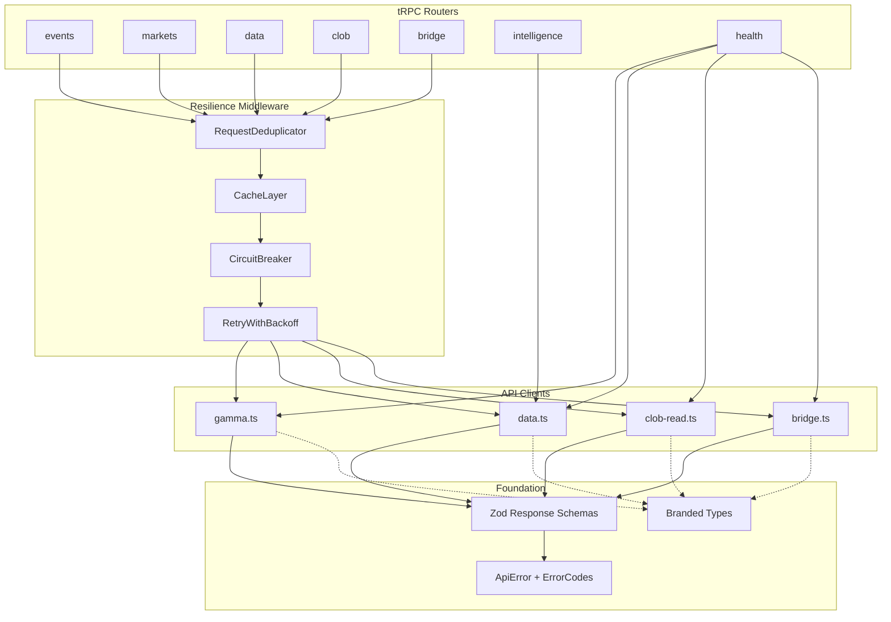

# Design Document: Reference Audit Improvements

## Overview

This design introduces a layered resilience and intelligence stack into the Doji monorepo's server-side API integration layer. The changes are organized into three tiers:

1. **Foundation Layer** — Structured errors, branded types, Zod response validation (Requirements 1, 2, 6)
2. **Resilience Layer** — TTL cache, circuit breaker with retry, request deduplication (Requirements 3, 4, 5)
3. **Service Layer** — Health endpoint, OpenAPI generation, trader intelligence, arbitrage detection (Requirements 7, 8, 9, 10)
4. **Optional Utilities** — OHLCV aggregation, portfolio analytics, market enrichment (Requirements 11, 12, 13)

Each layer builds on the previous. The foundation types and errors are consumed by the resilience middleware, which wraps the existing API clients. The service layer then uses the hardened clients.

## Architecture



The resilience middleware is composed as a pipeline: `dedup → cache → circuitBreaker → retry → fetchJson`. Each API client's `fetchJson` function is replaced with a version that runs through this pipeline.

## Components and Interfaces

### 1. ApiError and Error Codes (`apps/server/src/lib/errors.ts`)

A structured error class replacing all `new Error()` throws in API clients.

```typescript
enum ErrorCode {
  NETWORK = "NETWORK",
  AUTH = "AUTH",
  RATE_LIMIT = "RATE_LIMIT",
  VALIDATION = "VALIDATION",
  SERVER = "SERVER",
  CIRCUIT_OPEN = "CIRCUIT_OPEN",
  UNKNOWN = "UNKNOWN",
}

class ApiError extends Error {
  readonly code: ErrorCode;
  readonly httpStatus: number | null;
  readonly source: string;        // "gamma" | "data" | "clob" | "bridge"
  readonly path: string;
  readonly retryable: boolean;
  readonly retryDelayMs: number | null;
  readonly details?: unknown;     // Zod errors, response body, etc.
}

function classifyHttpError(status: number, source: string, path: string): ApiError;
function classifyNetworkError(error: unknown, source: string, path: string): ApiError;
```

Classification rules:
- 401, 403 → `AUTH`, not retryable
- 429 → `RATE_LIMIT`, retryable, `retryDelayMs` from `Retry-After` header or default 1000ms
- 500-599 → `SERVER`, retryable
- DNS/timeout/connection errors → `NETWORK`, retryable
- Zod parse failures → `VALIDATION`, not retryable

### 2. Branded Types (`packages/types/src/branded.ts`)

Nominal types using a phantom brand field to prevent mixing identifiers at compile time.

```typescript
declare const __brand: unique symbol;
type Brand<T, B extends string> = T & { readonly [__brand]: B };

type TokenId = Brand<string, "TokenId">;
type ConditionId = Brand<string, "ConditionId">;
type QuestionId = Brand<string, "QuestionId">;
type MarketSlug = Brand<string, "MarketSlug">;
type WalletAddress = Brand<string, "WalletAddress">;
type OrderId = Brand<string, "OrderId">;

function tokenId(value: string): TokenId;
function conditionId(value: string): ConditionId;
// ... etc for each type
```

These are exported from `@poly/types` and gradually adopted in API client signatures.

### 3. Zod Response Schemas (`apps/server/src/lib/polymarket/schemas/`)

Co-located Zod schemas for each API client. Each schema file exports both the Zod schema and the inferred TypeScript type.

```typescript
// schemas/gamma.ts
const EventSchema = z.object({
  id: z.string(),
  slug: z.string(),
  title: z.string(),
  // ... all fields from the Event interface
});
type ValidatedEvent = z.infer<typeof EventSchema>;

const MarketSchema = z.object({ /* ... */ });
const TagSchema = z.object({ /* ... */ });

// schemas/data.ts
const PositionSchema = z.object({ /* ... */ });
const TradeSchema = z.object({ /* ... */ });
const LeaderboardEntrySchema = z.object({ /* ... */ });

// schemas/clob.ts
const OrderBookSnapshotSchema = z.object({ /* ... */ });
const PriceHistoryPointSchema = z.object({ /* ... */ });

// schemas/bridge.ts
const QuoteSchema = z.object({ /* ... */ });
const SupportedAssetSchema = z.object({ /* ... */ });
```

Each API client's `fetchJson` is updated to parse responses through the schema:

```typescript
async function fetchJson<T>(path: string, schema: z.ZodType<T>, params?: Record<string, string>): Promise<T> {
  // ... fetch ...
  const json = await response.json();
  const result = schema.safeParse(json);
  if (!result.success) {
    throw new ApiError({ code: ErrorCode.VALIDATION, details: result.error, ... });
  }
  return result.data;
}
```

### 4. Cache Layer (`apps/server/src/lib/cache.ts`)

In-memory TTL cache with LRU eviction.

```typescript
interface CacheConfig {
  defaultTtlMs: number;
  maxEntries: number;
}

interface CacheEntry<T> {
  value: T;
  expiresAt: number;
  lastAccessed: number;
}

class TtlCache {
  constructor(config: CacheConfig);
  get<T>(key: string): T | undefined;
  set<T>(key: string, value: T, ttlMs?: number): void;
  invalidate(keyPrefix?: string): void;
  size(): number;
}
```

Default TTL configuration per endpoint category:
| Category | TTL |
|----------|-----|
| Orderbook data | 5s |
| Event data | 30s |
| Market lists | 60s |
| Profiles | 120s |
| Tags, sports, series | 300s |

Cache key derivation: `${source}:${path}?${sortedQueryParams}`.

### 5. Circuit Breaker (`apps/server/src/lib/circuit-breaker.ts`)

Per-API-source circuit breaker with three states.

```typescript
enum CircuitState {
  CLOSED = "CLOSED",
  OPEN = "OPEN",
  HALF_OPEN = "HALF_OPEN",
}

interface CircuitBreakerConfig {
  failureThreshold: number;  // default 5
  cooldownMs: number;        // default 30_000
}

class CircuitBreaker {
  constructor(source: string, config?: CircuitBreakerConfig);
  
  get state(): CircuitState;
  
  /** Call before making a request. Throws ApiError with CIRCUIT_OPEN if open. */
  preRequest(): void;
  
  /** Call after a successful request. Resets failure count, transitions HALF_OPEN → CLOSED. */
  onSuccess(): void;
  
  /** Call after a failed request. Increments failures, may transition CLOSED → OPEN. */
  onFailure(): void;
  
  reset(): void;
}
```

State transitions:
- CLOSED: normal operation. Failures increment counter. When counter ≥ threshold → OPEN.
- OPEN: all requests rejected immediately. After cooldownMs → HALF_OPEN.
- HALF_OPEN: one request allowed through. Success → CLOSED. Failure → OPEN.

### 6. Retry with Backoff (`apps/server/src/lib/retry.ts`)

Wraps API calls with configurable retry logic for retryable errors.

```typescript
interface RetryConfig {
  maxAttempts: number;     // default 3
  baseDelayMs: number;     // default 500
  maxDelayMs: number;      // default 10_000
  jitterFactor: number;    // default 0.2 (±20%)
}

async function withRetry<T>(
  fn: () => Promise<T>,
  config?: Partial<RetryConfig>
): Promise<T>;
```

The retry function catches `ApiError` instances, checks `retryable`, and retries with exponential backoff plus jitter. Non-retryable errors are rethrown immediately.

### 7. Request Deduplicator (`apps/server/src/lib/deduplicator.ts`)

Coalesces concurrent identical in-flight requests.

```typescript
class RequestDeduplicator {
  /** 
   * Execute fn, but if an identical key is already in-flight, 
   * return the same promise instead of calling fn again.
   */
  dedupe<T>(key: string, fn: () => Promise<T>): Promise<T>;
  
  /** Number of currently in-flight requests. */
  inflight(): number;
}
```

The key is the same cache key format: `${source}:${path}?${sortedQueryParams}`. When the promise resolves or rejects, the entry is removed so subsequent calls trigger a fresh request.

### 8. Resilient Fetch Wrapper (`apps/server/src/lib/polymarket/resilient-fetch.ts`)

Composes all middleware into a single `fetchJson` replacement used by all API clients.

```typescript
interface ResilientFetchConfig {
  source: string;
  cache?: { ttlMs: number } | false;
  retry?: Partial<RetryConfig>;
  dedupe?: boolean;
}

function createResilientFetch(config: ResilientFetchConfig) {
  return async function fetchJson<T>(
    path: string,
    schema: z.ZodType<T>,
    params?: Record<string, string>
  ): Promise<T>;
}
```

Each API client creates its own instance:
```typescript
// gamma.ts
const fetchJson = createResilientFetch({ source: "gamma", cache: { ttlMs: 60_000 } });
// clob-read.ts  
const fetchJson = createResilientFetch({ source: "clob", cache: { ttlMs: 5_000 } });
```

### 9. Health Endpoint (`apps/server/src/routers/health.ts`)

A Hono route (not tRPC) at `/api/health` that checks all upstream APIs and the database.

```typescript
interface ServiceStatus {
  name: string;
  status: "healthy" | "unhealthy";
  responseTimeMs: number;
}

interface HealthResponse {
  status: "healthy" | "degraded";
  services: ServiceStatus[];
  timestamp: string;
}
```

Each service check has a 10s timeout. The endpoint returns 200 if all healthy, 503 if any unhealthy.

Checks performed:
- Gamma API: `GET /tags` (lightweight)
- Data API: `GET /v1/leaderboard?limit=1`
- CLOB API: `GET /` (heartbeat)
- Bridge API: `GET /supported-assets`
- PostgreSQL: `SELECT 1`

### 10. OpenAPI Generation (`apps/server/src/routers/openapi.ts`)

Uses `trpc-to-openapi` or `trpc-openapi` adapter to generate an OpenAPI spec from the tRPC router.

```typescript
// Served at /api/openapi.json
app.get("/api/openapi.json", (c) => {
  return c.json(generateOpenApiDocument(appRouter, {
    title: "Poly API",
    version: "1.0.0",
    baseUrl: env.API_BASE_URL,
  }));
});
```

This requires annotating tRPC procedures with `.meta()` for HTTP method and path mapping. The Zod input/output schemas are automatically included.

### 11. Trader Intelligence Service (`apps/server/src/lib/intelligence/trader.ts`)

Computes trader profiles from leaderboard and trade data.

```typescript
interface TraderProfile {
  address: WalletAddress;
  tier: "whale" | "shark" | "dolphin" | "fish";
  score: number;
  volume: number;
  pnl: number;
  winRate: number;
  positionCount: number;
  anomalyFlag: boolean;
  computedAt: string;
}

interface TierThresholds {
  whale: number;    // default 90th percentile
  shark: number;    // default 70th percentile
  dolphin: number;  // default 40th percentile
}

class TraderProfiler {
  constructor(thresholds?: TierThresholds);
  
  computeScore(entry: LeaderboardEntry): number;
  assignTier(score: number): TraderProfile["tier"];
  detectAnomaly(current: LeaderboardEntry, historical: LeaderboardEntry[]): boolean;
  getProfile(address: WalletAddress): Promise<TraderProfile>;
}
```

Score computation: weighted combination of normalized volume (40%), PnL (30%), win rate (20%), position count (10%). Anomaly detection flags when current volume or PnL deviates by more than 2 standard deviations from the trader's historical mean.

Profiles are cached with a 15-minute TTL using the Cache Layer.

### 12. Arbitrage Detection Service (`apps/server/src/lib/intelligence/arbitrage.ts`)

Scans orderbook data for mispriced YES/NO token pairs.

```typescript
interface ArbitrageOpportunity {
  conditionId: ConditionId;
  yesTokenId: TokenId;
  noTokenId: TokenId;
  yesAskPrice: number;
  noAskPrice: number;
  totalCost: number;
  expectedProfit: number;
  requiredCapital: number;
  feeRate: number;
}

class ArbitrageDetector {
  constructor(defaultFeeRateBps?: number);
  
  /** Check a single market for arbitrage. */
  checkMarket(
    yesBook: OrderBookSnapshot,
    noBook: OrderBookSnapshot,
    feeRateBps: number
  ): ArbitrageOpportunity | null;
  
  /** Scan multiple markets. */
  scanMarkets(conditionIds: ConditionId[]): Promise<ArbitrageOpportunity[]>;
}
```

Arbitrage condition: `yesAskPrice + noAskPrice + (2 * feeRate) < 1.0`. The profit is `1.0 - totalCost`. Required capital is `max(yesAskSize, noAskSize) * totalCost` at the best ask level.

### 13. Optional: Market Data Utilities (`apps/server/src/lib/intelligence/market-utils.ts`)

```typescript
interface OHLCVCandle {
  open: number;
  high: number;
  low: number;
  close: number;
  volume: number;
  timestamp: number;
}

function aggregateToOHLCV(trades: Trade[], intervalMs: number): OHLCVCandle[];
function computeEffectivePrice(book: OrderBookSnapshot, side: "buy" | "sell", size: number): number | null;
```

### 14. Optional: Portfolio Analytics (`apps/server/src/lib/intelligence/portfolio.ts`)

```typescript
interface PortfolioAnalytics {
  winRate: number;
  totalPnl: number;
  categoryBreakdown: Record<string, { pnl: number; count: number }>;
  dailySnapshots: Array<{ date: string; value: number }>;
}

function computePortfolioAnalytics(
  positions: Position[],
  closedPositions: ClosedPosition[],
  trades: Trade[]
): PortfolioAnalytics;
```

### 15. Optional: Market Enrichment (`apps/server/src/lib/intelligence/enrichment.ts`)

```typescript
interface EnrichedMarket extends Market {
  volumeTrend: "rising" | "falling" | "stable";
  priceMomentum: number;
  liquidityScore: number;
}

function enrichMarket(market: Market, recentTrades: Trade[], book: OrderBookSnapshot): EnrichedMarket;
```

## Data Models

### Error Code Enum

```typescript
enum ErrorCode {
  NETWORK = "NETWORK",
  AUTH = "AUTH",
  RATE_LIMIT = "RATE_LIMIT",
  VALIDATION = "VALIDATION",
  SERVER = "SERVER",
  CIRCUIT_OPEN = "CIRCUIT_OPEN",
  UNKNOWN = "UNKNOWN",
}
```

### Circuit Breaker State

```typescript
enum CircuitState {
  CLOSED = "CLOSED",
  OPEN = "OPEN",
  HALF_OPEN = "HALF_OPEN",
}
```

### Cache Entry

```typescript
interface CacheEntry<T> {
  value: T;
  expiresAt: number;     // Date.now() + ttlMs
  lastAccessed: number;  // Date.now() at last get()
}
```

### Trader Tier Thresholds

Default score thresholds (0-100 scale):
| Tier | Min Score |
|------|-----------|
| Whale | 90 |
| Shark | 70 |
| Dolphin | 40 |
| Fish | 0 |

### Health Check Response

```typescript
interface HealthResponse {
  status: "healthy" | "degraded";
  services: Array<{
    name: string;
    status: "healthy" | "unhealthy";
    responseTimeMs: number;
  }>;
  timestamp: string;
}
```


## Correctness Properties

*A property is a characteristic or behavior that should hold true across all valid executions of a system — essentially, a formal statement about what the system should do. Properties serve as the bridge between human-readable specifications and machine-verifiable correctness guarantees.*

### Property 1: Error classification completeness

*For any* HTTP status code (1xx–5xx) and any source/path combination, the `classifyHttpError` function should produce an `ApiError` with a valid `ErrorCode` enum value, a non-null `httpStatus`, a non-empty `source`, a non-empty `path`, and a boolean `retryable` field. Edge cases: 429 → RATE_LIMIT + retryable, 401/403 → AUTH + not retryable, 5xx → SERVER + retryable.

**Validates: Requirements 1.1, 1.2, 1.3, 1.4, 1.5**

### Property 2: Retryable errors include retry delay

*For any* `ApiError` where `retryable` is `true`, the `retryDelayMs` field should be a positive number. *For any* `ApiError` where `retryable` is `false`, `retryDelayMs` should be `null`.

**Validates: Requirements 1.6**

### Property 3: Zod schema round-trip for valid objects

*For any* valid typed object (Event, Market, Trade, Position, etc.) generated from the schema's type definition, serializing to JSON and parsing through the corresponding Zod schema should produce an object deeply equal to the original.

**Validates: Requirements 2.2**

### Property 4: Invalid objects produce VALIDATION ApiError

*For any* JSON object that violates a Zod response schema (missing required fields, wrong types), parsing through the schema-validated `fetchJson` should produce an `ApiError` with `code === ErrorCode.VALIDATION` and non-empty `details`.

**Validates: Requirements 2.3**

### Property 5: Cache key determinism regardless of parameter order

*For any* API path and set of query parameters, the cache key derivation function should produce the same key regardless of the order in which parameters are provided.

**Validates: Requirements 3.1**

### Property 6: Cache TTL correctness

*For any* value stored in the cache with a TTL of `t` milliseconds, calling `get` before `t` has elapsed should return the stored value, and calling `get` after `t` has elapsed should return `undefined`.

**Validates: Requirements 3.2, 3.3**

### Property 7: Cache LRU eviction at max capacity

*For any* cache with `maxEntries = N`, after inserting `N + K` distinct entries (K ≥ 1), the cache size should be exactly `N`, and the `K` least-recently-used entries should have been evicted.

**Validates: Requirements 3.5**

### Property 8: Cache invalidation by prefix

*For any* set of cached entries, calling `invalidate()` with no argument should result in `size() === 0`. Calling `invalidate(prefix)` should remove exactly those entries whose keys start with `prefix` and leave all others intact.

**Validates: Requirements 3.6**

### Property 9: Circuit breaker state machine

*For any* failure threshold `N` and any sequence of `onSuccess()` / `onFailure()` calls, the circuit breaker state should be `OPEN` if and only if the trailing consecutive failure count is ≥ `N`. After each `onSuccess()`, the failure counter should reset to 0 and the state should be `CLOSED`.

**Validates: Requirements 4.2, 4.3**

### Property 10: Circuit breaker cooldown transitions to HALF_OPEN

*For any* circuit breaker in `OPEN` state with cooldown `C` ms, after `C` ms have elapsed, calling `preRequest()` should not throw (indicating `HALF_OPEN` state). Before `C` ms, `preRequest()` should throw a `CIRCUIT_OPEN` error.

**Validates: Requirements 4.4**

### Property 11: Retry attempts match configuration

*For any* `maxAttempts = N` and a function that always throws a retryable `ApiError`, `withRetry` should invoke the function exactly `N` times before re-throwing the error.

**Validates: Requirements 4.1**

### Property 12: Request deduplication — single upstream call for concurrent callers

*For any* number of concurrent callers `N ≥ 2` requesting the same key, the underlying function should be invoked exactly once. If it resolves, all `N` callers should receive the same resolved value. If it rejects, all `N` callers should receive the same rejection.

**Validates: Requirements 5.1, 5.4**

### Property 13: Deduplicator cleanup after completion

*For any* deduped request that has completed (resolved or rejected), the `inflight()` count for that key should be 0, and a subsequent call with the same key should invoke the underlying function again (not return a stale result).

**Validates: Requirements 5.3**

### Property 14: Branded type constructor round-trip

*For any* string `s`, creating a branded value via the constructor (e.g., `tokenId(s)`) and comparing it to `s` at runtime should be equal (`===`). The branded value should be usable anywhere a string is expected at runtime.

**Validates: Requirements 6.2**

### Property 15: Health endpoint degraded status

*For any* non-empty subset of services that are unreachable, the health endpoint response should have `status === "degraded"`, HTTP status 503, and each service entry should have a `responseTimeMs` field that is a non-negative number.

**Validates: Requirements 7.4, 7.5**

### Property 16: OpenAPI spec includes schemas for Zod-typed procedures

*For any* tRPC procedure that has Zod input and/or output schemas, the generated OpenAPI document should contain a corresponding path entry with request/response schema definitions that match the Zod schema structure.

**Validates: Requirements 8.3**

### Property 17: Trader score and tier assignment consistency

*For any* leaderboard entry with non-negative volume, PnL (any sign), win rate in [0, 1], and non-negative position count, the computed score should be a finite number in [0, 100], and the assigned tier should be the highest tier whose threshold the score meets or exceeds.

**Validates: Requirements 9.1, 9.2**

### Property 18: Anomaly detection flags deviations beyond threshold

*For any* historical data series of length ≥ 2 and a current value, the anomaly flag should be `true` if and only if the current value deviates from the historical mean by more than 2 standard deviations.

**Validates: Requirements 9.3**

### Property 19: Arbitrage detection correctness

*For any* pair of YES/NO orderbooks with non-empty ask sides and a fee rate, the arbitrage detector should return an opportunity if and only if `bestYesAsk + bestNoAsk + (2 * feeRate) < 1.0`. When an opportunity is returned, it should contain valid `conditionId`, `yesTokenId`, `noTokenId`, `yesAskPrice`, `noAskPrice`, `expectedProfit`, and `requiredCapital` fields.

**Validates: Requirements 10.1, 10.3, 10.5**

### Property 20: Arbitrage profit calculation accuracy

*For any* detected arbitrage opportunity, the `expectedProfit` should equal `1.0 - (yesAskPrice + noAskPrice + 2 * feeRate)` within floating-point tolerance (±0.0001).

**Validates: Requirements 10.2**

### Property 21: OHLCV aggregation invariants (Optional)

*For any* non-empty list of trades and a positive interval, each OHLCV candle should satisfy: `open` equals the first trade's price in the interval, `close` equals the last trade's price, `high ≥ max(open, close)`, `low ≤ min(open, close)`, `high ≥ low`, and `volume` equals the sum of trade sizes in the interval.

**Validates: Requirements 11.1**

### Property 22: Effective price from orderbook depth (Optional)

*For any* orderbook with at least one level and a positive order size that does not exceed total available liquidity, the computed effective price should be the volume-weighted average price across consumed levels, and should be between the best and worst price levels consumed.

**Validates: Requirements 11.2**

### Property 23: Portfolio analytics invariants (Optional)

*For any* set of closed positions, the computed `winRate` should equal the count of positions with positive PnL divided by total position count. The `totalPnl` should equal the sum of individual position PnLs. The sum of all per-category PnL values in `categoryBreakdown` should equal `totalPnl`.

**Validates: Requirements 12.1**

### Property 24: Market enrichment volume trend consistency (Optional)

*For any* market with a sequence of recent trades, if the total volume in the second half of the sequence exceeds the first half, `volumeTrend` should be `"rising"`. If it is less, `"falling"`. If approximately equal (within 10%), `"stable"`.

**Validates: Requirements 13.1**

## Error Handling

### Error Propagation Strategy

All errors originating from upstream API calls are wrapped in `ApiError` instances at the `fetchJson` level. The resilience middleware (retry, circuit breaker) catches and re-throws `ApiError` instances, adding context as needed:

1. **fetchJson** → catches HTTP errors and network errors, produces `ApiError`
2. **Zod validation** → catches parse failures, produces `ApiError` with `VALIDATION` code
3. **Retry** → catches retryable `ApiError`, retries, then re-throws if exhausted
4. **Circuit Breaker** → throws `ApiError` with `CIRCUIT_OPEN` code when open; catches failures from downstream to update state
5. **Cache** → transparent; errors are never cached
6. **Deduplicator** → propagates errors to all waiting callers

### tRPC Error Mapping

In tRPC routers, `ApiError` instances are caught and mapped to tRPC error codes:

| ApiError Code | tRPC Code | HTTP Status |
|---------------|-----------|-------------|
| AUTH | UNAUTHORIZED | 401 |
| RATE_LIMIT | TOO_MANY_REQUESTS | 429 |
| VALIDATION | BAD_REQUEST | 400 |
| NETWORK | INTERNAL_SERVER_ERROR | 502 |
| SERVER | INTERNAL_SERVER_ERROR | 502 |
| CIRCUIT_OPEN | SERVICE_UNAVAILABLE | 503 |
| UNKNOWN | INTERNAL_SERVER_ERROR | 500 |

### Graceful Degradation

- Circuit breaker prevents cascading failures when an upstream API is down
- Cache serves stale data during brief outages (stale-while-revalidate could be added later)
- Health endpoint enables external monitoring to detect degraded state
- Request deduplication prevents thundering herd on cache miss

## Testing Strategy

### Testing Framework

- **Test runner**: Vitest (already configured in `apps/server/vitest.config.mts`)
- **Property-based testing**: fast-check (already a devDependency in `apps/server`)
- **Mocking**: Vitest built-in `vi.fn()` and `vi.spyOn()` for upstream API mocking

### Dual Testing Approach

**Unit tests** cover:
- Specific examples and edge cases (e.g., HTTP 429 → RATE_LIMIT, circuit breaker state transitions)
- Integration points between components (e.g., resilient fetch pipeline)
- Error conditions and boundary values

**Property-based tests** cover:
- Universal properties that hold for all valid inputs (Properties 1–24 above)
- Each property test runs a minimum of 100 iterations
- Each property test is tagged with: `Feature: reference-audit-improvements, Property {N}: {title}`

### Test Organization

```
apps/server/src/lib/__tests__/
  errors.test.ts                    # Unit tests for ApiError
  errors.property.test.ts           # Property tests P1, P2
  cache.test.ts                     # Unit tests for TtlCache
  cache.property.test.ts            # Property tests P5, P6, P7, P8
  circuit-breaker.test.ts           # Unit tests for CircuitBreaker
  circuit-breaker.property.test.ts  # Property tests P9, P10
  retry.test.ts                     # Unit tests for withRetry
  retry.property.test.ts            # Property test P11
  deduplicator.test.ts              # Unit tests for RequestDeduplicator
  deduplicator.property.test.ts     # Property tests P12, P13

apps/server/src/lib/polymarket/__tests__/
  schemas.property.test.ts          # Property tests P3, P4
  resilient-fetch.test.ts           # Integration tests

apps/server/src/lib/intelligence/__tests__/
  trader.test.ts                    # Unit tests for TraderProfiler
  trader.property.test.ts           # Property tests P17, P18
  arbitrage.test.ts                 # Unit tests for ArbitrageDetector
  arbitrage.property.test.ts        # Property tests P19, P20
  market-utils.property.test.ts     # Property tests P21, P22 (optional)
  portfolio.property.test.ts        # Property test P23 (optional)
  enrichment.property.test.ts       # Property test P24 (optional)

packages/types/src/__tests__/
  branded.property.test.ts          # Property test P14
```

### Property-Based Test Configuration

Each property test file follows this pattern:

```typescript
import fc from "fast-check";
import { describe, expect, it } from "vitest";

describe("Feature: reference-audit-improvements, Property N: Title", () => {
  it("property description", () => {
    fc.assert(
      fc.property(
        /* arbitraries */,
        (/* generated values */) => {
          // assertions
        }
      ),
      { numRuns: 100 }
    );
  });
});
```
