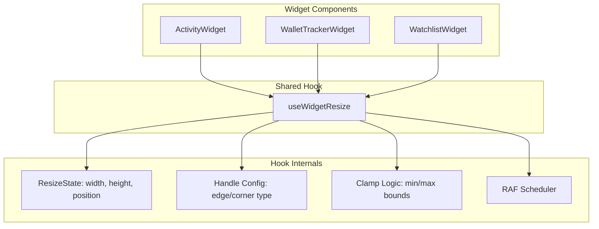

# Design Document: Resizable Widgets

## Overview

This feature adds edge and corner resize handles to the three bottom-bar floating widgets (Activity, Wallet Tracker, Watchlist). Each widget currently renders as a `fixed z-50` panel with drag-to-move via a GripVertical header button. The resize behavior will be implemented as a shared React hook (`useWidgetResize`) that all three widgets consume, accepting per-widget configuration for minimum width, minimum height, and default dimensions.

The core interaction model: invisible hit-area divs are rendered along the four edges and four corners of the widget panel. When the user mousedowns on a handle, the hook tracks pointer movement via `mousemove`/`mouseup` on `window`, updates width/height (and position for top/left edges) in real time using `requestAnimationFrame`, and clamps values to per-widget minimums and viewport maximums. The existing drag-to-move interaction is untouched — resize handles and the drag handle are separate DOM elements with no overlap.

Pressing Escape during an active resize cancels the operation, reverts dimensions to pre-resize values, and closes the widget.

## Architecture



### Data Flow

1. Widget mounts → calls `useWidgetResize({ minWidth, minHeight, defaultWidth, defaultHeight })`
2. Hook returns `{ size, resizeHandles, isResizing }` plus the existing position/drag state
3. Widget renders `resizeHandles` as edge/corner divs around the panel
4. On mousedown on a handle → hook captures start pointer, start size, start position, and handle direction
5. On mousemove → hook computes new size via delta, clamps to min/viewport max, updates state via RAF
6. On mouseup → hook commits final size to state, clears resize tracking
7. On Escape during resize → hook reverts to pre-resize size and calls `onClose`

## Components and Interfaces

### `useWidgetResize` Hook

Location: `apps/web/src/hooks/use-widget-resize.ts`

```typescript
interface UseWidgetResizeConfig {
  /** Per-widget minimum width in px */
  minWidth: number;
  /** Minimum height in px (300 for all widgets) */
  minHeight: number;
  /** Default width when widget opens */
  defaultWidth: number;
  /** Default height when widget opens */
  defaultHeight: number;
  /** Bottom bar height to subtract from viewport (48px) */
  bottomBarHeight?: number;
}

interface WidgetSize {
  width: number;
  height: number;
}

interface WidgetPosition {
  x: number;
  y: number;
}

type ResizeDirection =
  | "top" | "right" | "bottom" | "left"
  | "top-left" | "top-right" | "bottom-left" | "bottom-right";

interface UseWidgetResizeReturn {
  /** Current widget size */
  size: WidgetSize;
  /** Current widget position */
  position: WidgetPosition;
  /** Whether a resize is in progress */
  isResizing: boolean;
  /** Whether a drag is in progress */
  isDragging: boolean;
  /** Ref to attach to the panel div */
  panelRef: React.RefObject<HTMLDivElement | null>;
  /** Props to spread on the drag handle button */
  dragHandleProps: {
    onMouseDown: (e: React.MouseEvent<HTMLButtonElement>) => void;
  };
  /** Render resize handle divs — call inside the panel */
  renderResizeHandles: () => React.ReactNode;
  /** Reset position to centered (call when widget opens) */
  resetPosition: () => void;
}
```

### Resize Handle Elements

Each handle is an absolutely-positioned `<div>` with:
- Edge handles: 6px thick hit area along the full edge length
- Corner handles: 12×12px hit areas at each corner
- Appropriate cursor styles (`ns-resize`, `ew-resize`, `nwse-resize`, `nesw-resize`)
- `z-10` to sit above widget content but below other floating UI

### Clamp Logic (pure function)

```typescript
function clampSize(
  proposed: { width: number; height: number; x: number; y: number },
  config: { minWidth: number; minHeight: number; bottomBarHeight: number },
  viewport: { width: number; height: number }
): { width: number; height: number; x: number; y: number }
```

This pure function enforces:
- `width >= config.minWidth`
- `height >= config.minHeight`
- `x + width <= viewport.width` (right edge)
- `y + height <= viewport.height - config.bottomBarHeight` (bottom edge)
- `x >= 0` (left edge, for top/left resize)
- `y >= 0` (top edge, for top/left resize)

### Widget Integration Pattern

Each widget replaces its inline drag logic and fixed dimensions with the shared hook:

```tsx
// Before (each widget had its own drag + fixed size)
const WIDTH = 760;
// ...mouse event handlers...

// After
const { size, position, isResizing, isDragging, panelRef, dragHandleProps, renderResizeHandles } =
  useWidgetResize({
    minWidth: 580,    // or 800 for Wallet Tracker / Watchlist
    minHeight: 300,
    defaultWidth: 760,
    defaultHeight: 680,
  });
```

## Data Models

### Resize State (internal to hook)

```typescript
interface ResizeState {
  /** Which handle initiated the resize */
  direction: ResizeDirection;
  /** Pointer position at mousedown */
  startPointer: { x: number; y: number };
  /** Widget size at mousedown (for revert on Escape) */
  startSize: WidgetSize;
  /** Widget position at mousedown (for revert on Escape) */
  startPosition: WidgetPosition;
}
```

This is stored in a `useRef` (not state) to avoid re-renders during the resize drag. The committed `size` and `position` are React state, updated via RAF batching.

### Per-Widget Configuration

| Widget         | minWidth | minHeight | defaultWidth | defaultHeight |
|----------------|----------|-----------|--------------|---------------|
| Activity       | 580      | 300       | 760          | 680           |
| Wallet Tracker | 800      | 300       | 1100         | 650           |
| Watchlist      | 800      | 300       | 1100         | 650           |

No persistent storage — widget size resets to defaults each time it opens. This matches the current behavior where position also resets on open.

## Correctness Properties

*A property is a characteristic or behavior that should hold true across all valid executions of a system — essentially, a formal statement about what the system should do. Properties serve as the bridge between human-readable specifications and machine-verifiable correctness guarantees.*

### Property 1: Clamp invariant — output always satisfies min and viewport constraints

*For any* widget configuration (minWidth, minHeight), *for any* proposed dimensions (width, height) and position (x, y), and *for any* viewport size, the output of `clampSize` must satisfy all of the following simultaneously:
- `width >= minWidth`
- `height >= minHeight`
- `x + width <= viewport.width`
- `y + height <= viewport.height - bottomBarHeight`
- `x >= 0`
- `y >= 0`

**Validates: Requirements 3.1, 3.2, 3.3, 3.4, 3.5, 4.1, 4.2, 4.3**

### Property 2: Resize dimension follows pointer delta within clamped bounds

*For any* resize direction (edge or corner), *for any* starting size and position within valid bounds, and *for any* pointer delta, the resulting dimensions from `computeResize` should equal the starting dimensions plus the appropriate delta components, after clamping. Specifically:
- For a right-edge resize with delta dx: `result.width === clamp(startWidth + dx)`
- For a bottom-edge resize with delta dy: `result.height === clamp(startHeight + dy)`
- For a corner resize with delta (dx, dy): both width and height follow their respective deltas after clamping

**Validates: Requirements 1.4, 1.5, 2.3**

### Property 3: Right/bottom edge resize preserves position

*For any* resize initiated from the right or bottom edge, and *for any* pointer delta, the widget's (x, y) position must remain identical to its position before the resize began.

**Validates: Requirements 5.1**

### Property 4: Top/left edge resize anchors the opposite edge

*For any* resize initiated from the top edge, the bottom edge of the widget (y + height) must remain constant. *For any* resize initiated from the left edge, the right edge of the widget (x + width) must remain constant. In both cases, the position adjusts to compensate for the size change.

**Validates: Requirements 4.3, 5.1**

### Property 5: Drag preserves widget size

*For any* drag operation with *any* pointer delta, the widget's width and height must remain identical to their values before the drag began.

**Validates: Requirements 5.2**

### Property 6: Escape during resize reverts to pre-resize dimensions

*For any* starting widget size, after initiating a resize and moving the pointer by *any* delta, pressing Escape must result in the widget size reverting exactly to the starting size before the resize began. This is a round-trip property: `startSize → resize(delta) → Escape → startSize`.

**Validates: Requirements 8.2**

## Error Handling

| Scenario | Handling |
|----------|----------|
| Pointer leaves viewport during resize | `mouseup` on `window` catches release; if pointer exits without mouseup, the resize continues tracking until mouseup fires (standard browser behavior) |
| Viewport resizes during resize operation | Not handled during active resize — the clamp runs against the viewport size captured at resize start. Acceptable since viewport resize during widget resize is an extreme edge case |
| Widget position becomes invalid after viewport shrink | Out of scope — matches current drag behavior where position can become stale after viewport changes |
| RAF callback fires after component unmount | Cleanup in `useEffect` return cancels pending RAF and removes window listeners |
| Multiple simultaneous resize attempts | Only one resize can be active — `resizeState.current` is a single ref. Mousedown on a second handle while resizing is a no-op |

## Testing Strategy

### Property-Based Tests (fast-check)

The project already has `fast-check@^4.5.3` in devDependencies. Each correctness property maps to a single property-based test with a minimum of 100 iterations.

Test file: `tests/unit/resizable-widgets.property.test.ts`

Each test must be tagged with a comment referencing the design property:
```typescript
// Feature: resizable-widgets, Property 1: Clamp invariant — output always satisfies min and viewport constraints
```

The `clampSize` and `computeResize` functions will be exported as pure functions from the hook module, making them directly testable without DOM or React rendering.

Generators needed:
- `arbWidgetConfig`: generates `{ minWidth, minHeight }` with realistic ranges (200–2000px)
- `arbViewport`: generates `{ width, height }` with realistic ranges (320–3840px)
- `arbPosition`: generates `{ x, y }` within viewport bounds
- `arbSize`: generates `{ width, height }` within reasonable ranges
- `arbDelta`: generates `{ dx, dy }` pointer deltas (-2000 to +2000)
- `arbResizeDirection`: generates one of the 8 resize directions

Property tests to implement:
1. **Property 1** — Generate random config, viewport, position, and proposed size → verify all constraints hold on `clampSize` output
2. **Property 2** — Generate random direction, start state, and delta → verify `computeResize` output matches expected clamped delta
3. **Property 3** — Generate right/bottom direction, start state, and delta → verify position unchanged
4. **Property 4** — Generate top/left direction, start state, and delta → verify opposite edge anchored
5. **Property 5** — Generate start size and drag delta → verify size unchanged
6. **Property 6** — Generate start size and resize delta → simulate Escape → verify size reverts

### Unit Tests

Test file: `tests/unit/resizable-widgets.test.ts`

Specific example and edge-case tests:
- Render each widget and verify 4 edge handles + 4 corner handles are present (validates 1.1, 2.1)
- Verify cursor styles on edge handles (`ns-resize`, `ew-resize`) and corner handles (`nwse-resize`, `nesw-resize`) (validates 1.2, 1.3, 2.2)
- Verify `select-none` class is applied during resize (validates 5.3)
- Verify pointer-events guard is applied during resize (validates 5.4)
- Verify Escape during resize triggers close callback (validates 8.1)
- Edge case: resize at exact minimum dimensions — verify no change
- Edge case: resize at viewport boundary — verify clamping
- Edge case: widget positioned at (0, 0) with top/left resize — verify position doesn't go negative
