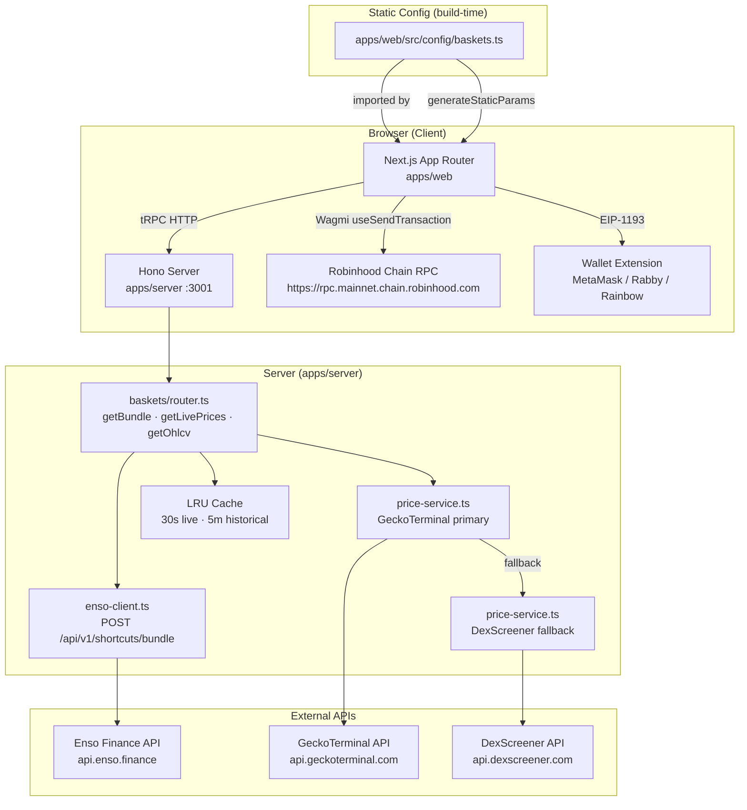

# Design Document

## Robinhood Chain Basket Terminal

---

## Overview

This document covers the technical design for refactoring the Doji Polymarket prediction market terminal into a dedicated **Index & Basket Trading Terminal** targeting Robinhood Chain (Chain ID: 4663, an Arbitrum Orbit L2).

The refactor has two parallel concerns:

1. **Removal** — Strip all Polymarket-specific infrastructure: `@polymarket/clob-client`, EIP-712 order signing, binary outcome tokens, Polygon network config, Gamma API clients, CLOB order book UI, Split/Merge/Redeem actions, Magic SDK auth, and Gnosis Safe onboarding.
2. **Replacement** — Build a basket-centric trading system: static basket configuration, GeckoTerminal/DexScreener price feeds with composite index charting, Enso bundle routing for buy/exit transactions, Wagmi-powered EVM wallet connection, and new pages at `/`, `/baskets`, and `/baskets/[basketId]`.

The existing monorepo structure (Next.js 16 + Hono + tRPC + Turborepo) is retained. The design reuses established project patterns: tRPC for server/client communication, TanStack Query for data fetching, LRU in-memory caching on the server, PPR with `<Suspense>` for streaming, and the existing design system tokens.

---

## Architecture

### System Diagram



### Rendering Strategy

| Route | Strategy | Notes |
|-------|----------|-------|
| `/` (Home) | Server Component + PPR | Static shell, server-prefetch basket preview data |
| `/baskets` | Server Component + PPR | Static shell, server-prefetch live prices |
| `/baskets/[basketId]` | Server Component + PPR + `generateStaticParams` | Routes pre-generated at build time; chart + order panel are client islands |
| Chart components | `"use client"` | KLineChart/Recharts need DOM access |
| Order panel | `"use client"` | Wagmi hooks, transaction state |
| Network guard | `"use client"` | Reads wallet store chainId |
| Wallet header actions | `"use client"` | Reads wallet store |

PPR constraint: server prefetch calls that create a `QueryClient` must call `await connection()` from `next/server` before instantiation, with a `<Suspense>` boundary above the component.

---

## Components and Interfaces

### New Domain: `apps/web/src/domains/baskets/`

```
domains/baskets/
├── components/
│   ├── basket-card.tsx               # Card used in home preview + directory
│   ├── basket-card-skeleton.tsx      # Loading skeleton for basket card
│   ├── basket-catalog-grid.tsx       # Responsive grid wrapper (1→2→3 cols)
│   ├── basket-selector.tsx           # Basket switcher in terminal header
│   ├── constituent-list.tsx          # Token list with price + weight + delta
│   ├── constituent-list-item.tsx     # Single constituent row
│   ├── basket-chart.tsx              # Client wrapper: composite + candlestick
│   ├── composite-index-chart.tsx     # Recharts AreaChart for composite index
│   ├── token-candlestick-chart.tsx   # KLineChart v10 wrapper
│   ├── timeframe-selector.tsx        # 24H / 7D / 30D chip row
│   ├── token-toggle-chips.tsx        # Per-token overlay toggle chips
│   ├── order-panel.tsx               # Root order panel (buy/exit tabs)
│   ├── buy-panel.tsx                 # Buy flow UI
│   ├── exit-panel.tsx                # Exit flow UI
│   ├── allocation-preview.tsx        # Weight breakdown preview table
│   ├── currency-toggle.tsx           # ETH / USDG toggle
│   ├── quick-buy-presets.tsx         # 0.05 / 0.1 / 0.5 / 1 ETH preset buttons
│   ├── tx-status-badge.tsx           # Pending / confirmed / error state
│   └── wrong-network-banner.tsx      # Network switch prompt
├── hooks/
│   ├── use-basket-buy.ts             # Buy flow orchestrator hook
│   ├── use-basket-exit.ts            # Exit flow orchestrator hook
│   ├── use-allocation-preview.ts     # Debounced allocation split computation
│   ├── use-basket-prices.ts          # Live price polling (30s)
│   └── use-ohlcv.ts                  # OHLCV fetch per timeframe
├── lib/
│   ├── composite-index.ts            # computeCompositeIndex() pure function
│   ├── allocation.ts                 # computeAllocation() pure function
│   └── format-tx.ts                  # formatTxHash(), block explorer URL helpers
└── stores/
    └── basket-terminal.ts            # Selected basketId, active timeframe, token toggles
```

### New Domain: `apps/server/src/domains/baskets/`

```
domains/baskets/
├── router.ts                         # tRPC router: getBundle, getLivePrices, getOhlcv
├── enso-client.ts                    # Enso Shortcut API HTTP wrapper
├── price-service.ts                  # GeckoTerminal + DexScreener + LRU cache
└── schemas.ts                        # Zod schemas for all inputs/outputs
```

### New / Modified Shell & Config Files

```
apps/web/src/
├── config/
│   ├── baskets.ts        # NEW — all basket definitions + weight validator
│   ├── chains.ts         # NEW — Robinhood Chain constant
│   └── app.ts            # MODIFY — update APP_NAME, APP_TITLE, APP_DESCRIPTION
├── shell/
│   ├── providers.tsx          # MODIFY — replace Magic/Safe with WagmiProvider + wagmi config
│   ├── header-nav.tsx         # MODIFY — replace Polymarket links with / and /baskets
│   ├── site-header.tsx        # MODIFY — update logo link href, remove HeaderSearch
│   ├── bottom-bar.tsx         # MODIFY — strip Polymarket widgets, keep social links
│   └── header-actions.tsx     # MODIFY — replace auth state with wagmi wallet display
├── app/
│   ├── page.tsx               # MODIFY — new Home page (no redirect)
│   ├── (app)/
│   │   ├── baskets/
│   │   │   ├── page.tsx              # NEW — Baskets Directory
│   │   │   └── [basketId]/
│   │   │       └── page.tsx          # NEW — Basket Terminal
│   │   └── (all other routes)        # DELETE — explore, portfolio, leaderboard, etc.
│   └── (auth)/                       # DELETE — login page
├── stores/
│   └── wallet.ts          # MODIFY — remove sessionToken, signatureType; keep address, chainId, isConnected
```

### Files to Delete

**`apps/web/src/`:**
- `app/(app)/explore/`
- `app/(app)/portfolio/`
- `app/(app)/leaderboard/`
- `app/(app)/watchlist/`
- `app/(app)/wallet-tracker/`
- `app/(app)/referrals/`
- `app/(app)/market/`
- `app/(auth)/login/`
- `app/api/geoblock/`
- `app/api/session/`
- `app/api/share-pnl/`
- `app/api/polymarket/`
- `domains/auth/`
- `domains/bridge/`
- `domains/comments/`
- `domains/explore/`
- `domains/leaderboard/`
- `domains/portfolio/`
- `domains/profile/`
- `domains/referrals/`
- `domains/tracker/`
- `domains/trading/`
- `domains/watchlist/`
- `shell/global-search.tsx`, `shell/global-search-utils.ts`
- `shell/search-results.tsx`, `shell/search-ends-cell.tsx`, `shell/use-filtered-search.ts`
- `shell/header-search.tsx`
- `shell/watchlist-bar.tsx`
- `shell/trading-settings-widget.tsx`
- `shell/widgets/activity-widget.tsx`, `shell/widgets/activity-widget-content.tsx`
- `shell/widgets/calendar-widget.tsx`
- `shell/widgets/portfolio-widget.tsx`, `shell/widgets/portfolio-widget-content.tsx`
- `shell/hooks/use-global-activity-feed.ts`
- `lib/ws/` (entire WebSocket infrastructure)
- `hooks/use-session.ts`
- `hooks/use-geoblock.ts`
- `hooks/use-post-trade-invalidation.ts`

**`apps/server/src/domains/`** (all existing domain routers that are Polymarket-specific):
- `activity/`
- `auth/`
- `bridge/`
- `data/`
- `events/`
- `leaderboard/`
- `markets/`
- `orders/`
- `portfolio/`
- `referrals/`
- `rewards/`
- `tracker/`
- `trading/`

**Root monorepo packages** (remove from `package.json`):
- `@polymarket/clob-client`
- `magic-sdk`, `@magic-ext/oauth2`
- `@safe-global/*` packages
- All Polygon/CTF-specific dependencies

---

## Data Models

### Basket Configuration (`config/baskets.ts`)

```typescript
/** A single ERC-20 constituent token within a basket. */
export interface BasketConstituent {
  /** Token symbol, e.g. "WETH" */
  symbol: string;
  /** Display name, e.g. "Wrapped Ether" */
  name: string;
  /** ERC-20 contract address on Robinhood Chain */
  address: `0x${string}`;
  /** DEX pool address used for price feeds (GeckoTerminal / DexScreener) */
  poolAddress: `0x${string}`;
  /**
   * Normalized weight in range (0, 1).
   * All weights in a basket MUST sum to 1.0 ± WEIGHT_TOLERANCE.
   */
  weight: number;
  /** Optional CoinGecko coin ID for icon lookup */
  coingeckoId?: string;
}

/** A curated token basket tradeable as a single transaction bundle. */
export interface BasketConfig {
  /** URL-safe unique slug, e.g. "defi-blue-chips" */
  id: string;
  /** Display name shown in header and cards */
  name: string;
  /** Short description shown on cards and terminal header */
  description: string;
  /** Ordered list of constituent tokens */
  constituents: BasketConstituent[];
}

export const WEIGHT_TOLERANCE = 0.001;
export const ROBINHOOD_CHAIN_ID = 4663;
```

### Price & OHLCV Types

```typescript
/** A single OHLCV candlestick from GeckoTerminal or DexScreener. */
export interface OhlcvCandle {
  /** Unix timestamp (seconds) */
  timestamp: number;
  open: number;
  high: number;
  low: number;
  close: number;
  volume: number;
}

/** Latest price data for a single token. */
export interface TokenPrice {
  symbol: string;
  address: string;
  priceUsd: number;
  /** Percentage change over 24h, e.g. -3.5 */
  change24h: number | null;
}

/** A single point in the normalized composite index series. */
export interface CompositeIndexPoint {
  /** Unix timestamp (seconds) */
  timestamp: number;
  /** Normalized index value (100.0 at t₀) */
  value: number;
}

export type Timeframe = "24H" | "7D" | "30D";

export interface OhlcvResponse {
  /** Symbol → OHLCV candle array */
  candles: Record<string, OhlcvCandle[]>;
  /** Symbols for which all price sources failed */
  failedSymbols: string[];
}
```

### Enso API Types

```typescript
/** Input to the Enso bundle route builder. */
export interface EnsoRouteRequest {
  /** Chain ID of the target network */
  chainId: number;
  /** Sender / from address (user's EOA) */
  fromAddress: `0x${string}`;
  /** Array of swap actions: one per constituent token */
  actions: EnsoSwapAction[];
}

export interface EnsoSwapAction {
  /** ERC-20 token address to receive, or "0xeeee...eeee" for ETH */
  tokenOut: `0x${string}`;
  /** Proportion of input ETH to allocate (0–1 float, summing to 1.0) */
  amountInRatio: number;
}

/** Transaction bundle returned by Enso. */
export interface TxBundle {
  /** Contract address to call (Enso router) */
  to: `0x${string}`;
  /** Encoded calldata */
  data: `0x${string}`;
  /** ETH value to send in wei (hex string) */
  value: `0x${string}`;
}

export interface EnsoRouteResponse {
  tx: TxBundle;
  /** Human-readable summary of route steps */
  route: unknown[];
}
```

### GeckoTerminal API Response (relevant subset)

The public GeckoTerminal onchain endpoint is:
```
GET https://api.geckoterminal.com/api/v2/networks/{network}/pools/{pool_address}/ohlcv/{timeframe}
```
Where `timeframe` is `minute`, `hour`, or `day`, and query params include `aggregate` (1, 4, etc.) and `limit` (max 1000).

Response shape (relevant fields):
```typescript
interface GeckoTerminalOhlcvResponse {
  data: {
    id: string;
    type: "ohlcv_request_response";
    attributes: {
      /** Array of [timestamp, open, high, low, close, volume] tuples */
      ohlcv_list: [number, number, number, number, number, number][];
    };
  };
  meta: {
    base: { symbol: string; address: string };
    quote: { symbol: string; address: string };
  };
}
```

### DexScreener Pairs Endpoint (fallback)

```
GET https://api.dexscreener.com/latest/dex/pairs/{chainId}/{pairAddress}
```
DexScreener does not expose a native OHLCV endpoint in its free API tier — it returns current pair data including 24h price change and price history as a series object. For historical OHLCV, the fallback uses DexScreener's price series from the pair endpoint and resamples into candle-compatible buckets.

---

## Basket Configuration Schema

### Full Implementation (`apps/web/src/config/baskets.ts`)

```typescript
import type { BasketConfig } from "@/types/basket";

export const WEIGHT_TOLERANCE = 0.001;
export const ROBINHOOD_CHAIN_ID = 4663 as const;

/**
 * Build-time weight validation. Throws if weights in any basket do not sum
 * to 1.0 within WEIGHT_TOLERANCE. Called at module load time so static
 * route generation fails fast on bad config.
 */
function validateBaskets(baskets: BasketConfig[]): BasketConfig[] {
  for (const basket of baskets) {
    const sum = basket.constituents.reduce((acc, c) => acc + c.weight, 0);
    if (Math.abs(sum - 1.0) > WEIGHT_TOLERANCE) {
      throw new Error(
        `Basket "${basket.id}" has invalid weights: sum is ${sum.toFixed(6)}, expected 1.0 ± ${WEIGHT_TOLERANCE}`
      );
    }
  }
  return baskets;
}

/** All available baskets. Add new entries here — no component changes required. */
export const BASKETS: BasketConfig[] = validateBaskets([
  {
    id: "defi-blue-chips",
    name: "DeFi Blue Chips",
    description: "Top-cap DeFi protocols on Robinhood Chain",
    constituents: [
      {
        symbol: "WETH",
        name: "Wrapped Ether",
        address: "0x4200000000000000000000000000000000000006",
        poolAddress: "0xabc1230000000000000000000000000000000001",
        weight: 0.5,
        coingeckoId: "weth",
      },
      {
        symbol: "USDG",
        name: "Robinhood USD",
        address: "0x4200000000000000000000000000000000000007",
        poolAddress: "0xabc1230000000000000000000000000000000002",
        weight: 0.25,
        coingeckoId: "usd-coin",
      },
      {
        symbol: "ARB",
        name: "Arbitrum",
        address: "0x912ce59144191c1204e64559fe8253a0e49e6548",
        poolAddress: "0xabc1230000000000000000000000000000000003",
        weight: 0.25,
        coingeckoId: "arbitrum",
      },
    ],
  },
  {
    id: "l2-momentum",
    name: "L2 Momentum",
    description: "Layer-2 scaling infrastructure tokens",
    constituents: [
      {
        symbol: "OP",
        name: "Optimism",
        address: "0x4200000000000000000000000000000000000042",
        poolAddress: "0xdef4560000000000000000000000000000000001",
        weight: 0.4,
        coingeckoId: "optimism",
      },
      {
        symbol: "MATIC",
        name: "Polygon",
        address: "0x7d1afa7b718fb893db30a3abc0cfc608aacfebb0",
        poolAddress: "0xdef4560000000000000000000000000000000002",
        weight: 0.35,
        coingeckoId: "matic-network",
      },
      {
        symbol: "BASE",
        name: "Base Token",
        address: "0x0000000000000000000000000000000000000001",
        poolAddress: "0xdef4560000000000000000000000000000000003",
        weight: 0.25,
        coingeckoId: "base",
      },
    ],
  },
  {
    id: "stablecoin-yield",
    name: "Stablecoin Yield",
    description: "Yield-bearing stablecoins and liquid cash equivalents",
    constituents: [
      {
        symbol: "USDG",
        name: "Robinhood USD",
        address: "0x4200000000000000000000000000000000000007",
        poolAddress: "0xfed5670000000000000000000000000000000001",
        weight: 0.6,
      },
      {
        symbol: "USDC",
        name: "USD Coin",
        address: "0xaf88d065e77c8cc2239327c5edb3a432268e5831",
        poolAddress: "0xfed5670000000000000000000000000000000002",
        weight: 0.4,
      },
    ],
  },
]);

/** Look up a basket by its id slug. Returns undefined when not found. */
export function getBasketById(id: string): BasketConfig | undefined {
  return BASKETS.find((b) => b.id === id);
}
```

> **Note:** The token addresses above are illustrative placeholders for Robinhood Chain. Replace with actual contract addresses once the chain's canonical token registry is published.

---

## Server-Side Modules

### `apps/server/src/domains/baskets/schemas.ts`

```typescript
import { z } from "zod";

export const BasketConstituentSchema = z.object({
  symbol: z.string(),
  address: z.string().regex(/^0x[0-9a-fA-F]{40}$/),
  poolAddress: z.string().regex(/^0x[0-9a-fA-F]{40}$/),
  weight: z.number().positive(),
});

export const GetBundleInputSchema = z.object({
  basketId: z.string().min(1),
  fromAddress: z.string().regex(/^0x[0-9a-fA-F]{40}$/),
  /** Input amount in wei as a decimal string */
  amountInWei: z.string().regex(/^\d+$/),
  tokenIn: z
    .string()
    .regex(/^0x[0-9a-fA-F]{40}$/)
    .describe("ETH = 0xeeeeeeeeeeeeeeeeeeeeeeeeeeeeeeeeeeeeeeee"),
  isExit: z.boolean().default(false),
  /** Required for exit flow: current balance of each constituent in wei */
  exitBalances: z
    .array(
      z.object({
        address: z.string(),
        balanceWei: z.string(),
      })
    )
    .optional(),
});

export const GetLivePricesInputSchema = z.object({
  poolAddresses: z.array(z.string().regex(/^0x[0-9a-fA-F]{40}$/)).min(1),
});

export const GetOhlcvInputSchema = z.object({
  poolAddresses: z.array(z.string().regex(/^0x[0-9a-fA-F]{40}$/)).min(1),
  timeframe: z.enum(["24H", "7D", "30D"]),
});

export const TxBundleSchema = z.object({
  to: z.string(),
  data: z.string(),
  value: z.string(),
});

export const GetBundleOutputSchema = z.object({
  tx: TxBundleSchema,
});

export const TokenPriceSchema = z.object({
  symbol: z.string(),
  address: z.string(),
  priceUsd: z.number(),
  change24h: z.number().nullable(),
});

export const OhlcvCandleSchema = z.tuple([
  z.number(), // timestamp
  z.number(), // open
  z.number(), // high
  z.number(), // low
  z.number(), // close
  z.number(), // volume
]);

export const OhlcvResponseSchema = z.object({
  candles: z.record(z.string(), z.array(OhlcvCandleSchema)),
  failedSymbols: z.array(z.string()),
});
```

### `apps/server/src/domains/baskets/enso-client.ts`

The Enso Bundle API accepts a POST to `https://api.enso.finance/api/v1/shortcuts/bundle` with a JSON body describing a sequence of swap actions and returns a single transaction object.

```typescript
import { AppError } from "@doji/api";
import type { TxBundle } from "./schemas";

const ENSO_BASE_URL = "https://api.enso.finance/api/v1";
const ROBINHOOD_CHAIN_ID = 4663;

/** Sentinel address for native ETH in Enso routing */
const ETH_ADDRESS = "0xeeeeeeeeeeeeeeeeeeeeeeeeeeeeeeeeeeeeeeee" as const;

export interface EnsoSwapAction {
  protocol: "enso";
  action: "route";
  args: {
    tokenIn: `0x${string}`;
    tokenOut: `0x${string}`;
    /** Amount in wei as a hex or decimal string */
    amountIn: string;
    slippage?: number;
  };
}

export interface EnsoBundleRequest {
  chainId: number;
  fromAddress: `0x${string}`;
  /** Routing strategy: "router" for multi-hop AMM routing */
  routingStrategy: "router";
  actions: EnsoSwapAction[];
}

/**
 * Builds a buy-into-basket transaction bundle.
 * Splits inputAmountWei across constituent tokens proportionally by weight.
 */
export async function buildBuyBundle(params: {
  fromAddress: `0x${string}`;
  constituents: Array<{ address: `0x${string}`; weight: number }>;
  inputAmountWei: bigint;
  tokenIn?: `0x${string}`;
  apiKey: string;
}): Promise<TxBundle> {
  const { fromAddress, constituents, inputAmountWei, tokenIn = ETH_ADDRESS, apiKey } = params;

  const actions: EnsoSwapAction[] = constituents.map((c) => ({
    protocol: "enso",
    action: "route",
    args: {
      tokenIn,
      tokenOut: c.address,
      amountIn: (
        (inputAmountWei * BigInt(Math.round(c.weight * 1e6))) /
        BigInt(1e6)
      ).toString(),
      slippage: 50, // 0.5% slippage tolerance in basis points
    },
  }));

  return callEnsoBundle({ fromAddress, actions, apiKey });
}

/**
 * Builds an exit-basket transaction bundle.
 * Swaps all constituent token balances back to ETH.
 */
export async function buildExitBundle(params: {
  fromAddress: `0x${string}`;
  exitBalances: Array<{ address: `0x${string}`; balanceWei: string }>;
  apiKey: string;
}): Promise<TxBundle> {
  const { fromAddress, exitBalances, apiKey } = params;

  const actions: EnsoSwapAction[] = exitBalances
    .filter((b) => BigInt(b.balanceWei) > 0n)
    .map((b) => ({
      protocol: "enso",
      action: "route",
      args: {
        tokenIn: b.address,
        tokenOut: ETH_ADDRESS,
        amountIn: b.balanceWei,
        slippage: 100, // 1% on exit
      },
    }));

  if (actions.length === 0) {
    throw new AppError({
      code: "BAD_REQUEST",
      message: "No token balances to exit",
      why: "All constituent token balances are zero",
      fix: "Buy into the basket first before attempting to exit",
    });
  }

  return callEnsoBundle({ fromAddress, actions, apiKey });
}

async function callEnsoBundle(params: {
  fromAddress: `0x${string}`;
  actions: EnsoSwapAction[];
  apiKey: string;
}): Promise<TxBundle> {
  const body: EnsoBundleRequest = {
    chainId: ROBINHOOD_CHAIN_ID,
    fromAddress: params.fromAddress,
    routingStrategy: "router",
    actions: params.actions,
  };

  const res = await fetch(`${ENSO_BASE_URL}/shortcuts/bundle`, {
    method: "POST",
    headers: {
      "Content-Type": "application/json",
      Authorization: `Bearer ${params.apiKey}`,
    },
    body: JSON.stringify(body),
  });

  if (!res.ok) {
    const errorBody = await res.text().catch(() => "");
    throw new AppError({
      code: res.status === 400 ? "BAD_REQUEST" : "INTERNAL_SERVER_ERROR",
      message: `Enso API error (${res.status})`,
      why: errorBody || "The routing API returned a non-2xx response",
      fix: "Check input amounts are above the minimum and try again",
    });
  }

  const json = (await res.json()) as { tx: TxBundle };
  return json.tx;
}
```

### `apps/server/src/domains/baskets/price-service.ts`

```typescript
import LRUCache from "lru-cache";
import type { OhlcvCandle, OhlcvResponse, Timeframe, TokenPrice } from "./schemas";

const GECKO_BASE = "https://api.geckoterminal.com/api/v2";
const DEXSCREENER_BASE = "https://api.dexscreener.com/latest/dex";
const ROBINHOOD_CHAIN_GECKO_ID = "robinhood-chain"; // network slug in GeckoTerminal

/** TTLs in milliseconds */
const TTL_LIVE = 30 * 1000;       // 30 seconds for live prices
const TTL_HISTORICAL = 5 * 60 * 1000; // 5 minutes for OHLCV history

/** Timeframe → GeckoTerminal API params */
const TIMEFRAME_PARAMS: Record<Timeframe, { timeframe: string; aggregate: number; limit: number }> = {
  "24H": { timeframe: "hour", aggregate: 1, limit: 24 },
  "7D":  { timeframe: "hour", aggregate: 4, limit: 42 },
  "30D": { timeframe: "day",  aggregate: 1, limit: 30 },
};

const livePriceCache = new LRUCache<string, TokenPrice>({ max: 200, ttl: TTL_LIVE });
const ohlcvCache = new LRUCache<string, OhlcvCandle[]>({ max: 100, ttl: TTL_HISTORICAL });

// --- Live prices ---

export async function getLivePrices(
  poolAddresses: string[]
): Promise<{ prices: TokenPrice[]; failedSymbols: string[] }> {
  const results: TokenPrice[] = [];
  const failedSymbols: string[] = [];

  await Promise.all(
    poolAddresses.map(async (poolAddress) => {
      const cacheKey = `live:${poolAddress}`;
      const cached = livePriceCache.get(cacheKey);
      if (cached) {
        results.push(cached);
        return;
      }

      try {
        const price = await fetchLivePriceGecko(poolAddress);
        livePriceCache.set(cacheKey, price);
        results.push(price);
      } catch {
        try {
          const price = await fetchLivePriceDexScreener(poolAddress);
          livePriceCache.set(cacheKey, price);
          results.push(price);
        } catch {
          failedSymbols.push(poolAddress);
        }
      }
    })
  );

  return { prices: results, failedSymbols };
}

async function fetchLivePriceGecko(poolAddress: string): Promise<TokenPrice> {
  const url = `${GECKO_BASE}/networks/${ROBINHOOD_CHAIN_GECKO_ID}/pools/${poolAddress}`;
  const res = await fetch(url, {
    headers: { Accept: "application/json;version=20230302" },
  });
  if (!res.ok) throw new Error(`GeckoTerminal ${res.status}`);
  const json = await res.json();
  const attrs = json?.data?.attributes;
  return {
    symbol: attrs?.base_token_symbol ?? "UNKNOWN",
    address: poolAddress,
    priceUsd: Number(attrs?.base_token_price_usd ?? 0),
    change24h: attrs?.price_change_percentage?.h24 != null
      ? Number(attrs.price_change_percentage.h24)
      : null,
  };
}

async function fetchLivePriceDexScreener(poolAddress: string): Promise<TokenPrice> {
  const url = `${DEXSCREENER_BASE}/pairs/robinhood/${poolAddress}`;
  const res = await fetch(url);
  if (!res.ok) throw new Error(`DexScreener ${res.status}`);
  const json = await res.json();
  const pair = json?.pair ?? json?.pairs?.[0];
  return {
    symbol: pair?.baseToken?.symbol ?? "UNKNOWN",
    address: poolAddress,
    priceUsd: Number(pair?.priceUsd ?? 0),
    change24h: pair?.priceChange?.h24 != null ? Number(pair.priceChange.h24) : null,
  };
}

// --- OHLCV history ---

export async function getOhlcv(
  poolAddresses: string[],
  timeframe: Timeframe
): Promise<OhlcvResponse> {
  const candles: Record<string, OhlcvCandle[]> = {};
  const failedSymbols: string[] = [];

  await Promise.all(
    poolAddresses.map(async (poolAddress) => {
      const cacheKey = `ohlcv:${timeframe}:${poolAddress}`;
      const cached = ohlcvCache.get(cacheKey);
      if (cached) {
        candles[poolAddress] = cached;
        return;
      }

      try {
        const data = await fetchOhlcvGecko(poolAddress, timeframe);
        ohlcvCache.set(cacheKey, data);
        candles[poolAddress] = data;
      } catch {
        try {
          const data = await fetchOhlcvDexScreener(poolAddress, timeframe);
          ohlcvCache.set(cacheKey, data);
          candles[poolAddress] = data;
        } catch {
          failedSymbols.push(poolAddress);
        }
      }
    })
  );

  return { candles, failedSymbols };
}

async function fetchOhlcvGecko(poolAddress: string, timeframe: Timeframe): Promise<OhlcvCandle[]> {
  const { timeframe: tf, aggregate, limit } = TIMEFRAME_PARAMS[timeframe];
  const url = `${GECKO_BASE}/networks/${ROBINHOOD_CHAIN_GECKO_ID}/pools/${poolAddress}/ohlcv/${tf}?aggregate=${aggregate}&limit=${limit}&currency=usd`;
  const res = await fetch(url, {
    headers: { Accept: "application/json;version=20230302" },
  });
  if (!res.ok) throw new Error(`GeckoTerminal OHLCV ${res.status}`);
  const json = await res.json();
  const list: [number, number, number, number, number, number][] =
    json?.data?.attributes?.ohlcv_list ?? [];
  return list.map(([timestamp, open, high, low, close, volume]) => ({
    timestamp,
    open,
    high,
    low,
    close,
    volume,
  }));
}

async function fetchOhlcvDexScreener(poolAddress: string, timeframe: Timeframe): Promise<OhlcvCandle[]> {
  // DexScreener free tier does not expose raw OHLCV. We synthesize candles from
  // the pair's priceNative history. This is a best-effort fallback.
  const url = `${DEXSCREENER_BASE}/pairs/robinhood/${poolAddress}`;
  const res = await fetch(url);
  if (!res.ok) throw new Error(`DexScreener OHLCV ${res.status}`);
  const json = await res.json();
  const pair = json?.pair ?? json?.pairs?.[0];
  const priceUsd = Number(pair?.priceUsd ?? 0);
  // Return a minimal synthetic single candle representing the current price
  const now = Math.floor(Date.now() / 1000);
  return [{ timestamp: now, open: priceUsd, high: priceUsd, low: priceUsd, close: priceUsd, volume: 0 }];
}
```

### `apps/server/src/domains/baskets/router.ts`

```typescript
import { publicProcedure, router } from "@doji/api";
import { TRPCError } from "@trpc/server";
import { env } from "@doji/env/server";
import { buildBuyBundle, buildExitBundle } from "./enso-client";
import { getLivePrices, getOhlcv } from "./price-service";
import {
  GetBundleInputSchema,
  GetLivePricesInputSchema,
  GetOhlcvInputSchema,
} from "./schemas";
// Basket config is loaded server-side from the shared config
// (the config/baskets.ts is in apps/web — for server access, basket config
//  is duplicated as a minimal lookup or exposed via a shared package)
import { BASKETS } from "../../config/baskets"; // or @doji/types basket config

export const basketsRouter = router({
  /**
   * Build an Enso transaction bundle for basket buy or exit.
   * Uses publicProcedure — wallet address is sent as input, no server session needed.
   */
  getBundle: publicProcedure
    .input(GetBundleInputSchema)
    .mutation(async ({ input }) => {
      const basket = BASKETS.find((b) => b.id === input.basketId);
      if (!basket) {
        throw new TRPCError({
          code: "NOT_FOUND",
          message: `Basket "${input.basketId}" not found`,
        });
      }

      const apiKey = env.ENSO_API_KEY;

      if (input.isExit) {
        if (!input.exitBalances?.length) {
          throw new TRPCError({
            code: "BAD_REQUEST",
            message: "exitBalances required for exit flow",
          });
        }
        const tx = await buildExitBundle({
          fromAddress: input.fromAddress as `0x${string}`,
          exitBalances: input.exitBalances.map((b) => ({
            address: b.address as `0x${string}`,
            balanceWei: b.balanceWei,
          })),
          apiKey,
        });
        return { tx };
      }

      const tx = await buildBuyBundle({
        fromAddress: input.fromAddress as `0x${string}`,
        constituents: basket.constituents.map((c) => ({
          address: c.address,
          weight: c.weight,
        })),
        inputAmountWei: BigInt(input.amountInWei),
        tokenIn: input.tokenIn as `0x${string}` | undefined,
        apiKey,
      });

      return { tx };
    }),

  /** Live spot prices for a list of pool addresses. Cached 30s. */
  getLivePrices: publicProcedure
    .input(GetLivePricesInputSchema)
    .query(async ({ input }) => {
      return getLivePrices(input.poolAddresses);
    }),

  /** OHLCV history for charting. Cached 5 minutes for 7D/30D, 30s for 24H. */
  getOhlcv: publicProcedure
    .input(GetOhlcvInputSchema)
    .query(async ({ input }) => {
      return getOhlcv(input.poolAddresses, input.timeframe);
    }),
});
```

Register in `apps/server/src/routers/index.ts`:
```typescript
// Replace the full appRouter with a stripped-down version:
export const appRouter = router({
  healthCheck: publicProcedure.query(() => "OK"),
  baskets: basketsRouter,
});
```

---

## Composite Index Calculation

### Algorithm

The composite index normalizes each constituent's price series to 100 at `t₀` (the earliest shared timestamp), then computes a weighted sum at each subsequent timestamp.

**Step-by-step:**

1. **Align timestamps** — Find the intersection of timestamps across all constituent candle series (or the union if gap-filling is preferred). Sort ascending.
2. **Determine `t₀`** — The earliest timestamp present in all series after alignment.
3. **Anchor price** — For each constituent `i`, record `P_i,0 = candle[t₀].close`.
4. **Normalize each point** — For each timestamp `t` and constituent `i`: `n_i,t = (P_i,t / P_i,0) * 100`
5. **Apply weights and sum** — `IndexValue_t = Σ (n_i,t * w_i)` where `Σw_i = 1.0`

```typescript
// apps/web/src/domains/baskets/lib/composite-index.ts

import type { OhlcvCandle } from "@/types/basket";

export interface TokenCandles {
  symbol: string;
  weight: number;
  candles: OhlcvCandle[];
}

export interface CompositeIndexPoint {
  timestamp: number;
  value: number;
}

/**
 * Computes the normalized composite index from an array of per-token OHLCV series.
 *
 * For any non-empty input with at least one valid token, the returned first
 * point always has value === 100.0 (invariant: Property 1).
 *
 * Tokens with no candle data are excluded from the computation (partial degradation).
 */
export function computeCompositeIndex(
  tokens: TokenCandles[]
): CompositeIndexPoint[] {
  // Filter out tokens with no candle data
  const validTokens = tokens.filter((t) => t.candles.length > 0);
  if (validTokens.length === 0) return [];

  // Re-normalize weights for remaining tokens (exclude failed tokens)
  const totalWeight = validTokens.reduce((sum, t) => sum + t.weight, 0);
  const normalizedWeights = validTokens.map((t) => t.weight / totalWeight);

  // Build a sorted set of all timestamps (union strategy)
  const allTimestamps = [
    ...new Set(validTokens.flatMap((t) => t.candles.map((c) => c.timestamp))),
  ].sort((a, b) => a - b);

  if (allTimestamps.length === 0) return [];

  const t0 = allTimestamps[0];

  // Build per-token lookup maps for O(1) access
  const priceMaps = validTokens.map((token) =>
    new Map(token.candles.map((c) => [c.timestamp, c.close]))
  );

  // Get anchor prices at t₀ (fallback: use first available candle if t₀ missing)
  const anchorPrices = validTokens.map((token, i) => {
    const p = priceMaps[i].get(t0);
    if (p !== undefined && p > 0) return p;
    // Use first candle price as anchor if t₀ not available
    return token.candles[0].close;
  });

  const result: CompositeIndexPoint[] = [];

  for (const ts of allTimestamps) {
    let indexValue = 0;
    let hasData = false;

    for (let i = 0; i < validTokens.length; i++) {
      const priceNow = priceMaps[i].get(ts);
      if (priceNow === undefined || anchorPrices[i] === 0) continue;

      const normalized = (priceNow / anchorPrices[i]) * 100;
      indexValue += normalized * normalizedWeights[i];
      hasData = true;
    }

    if (hasData) {
      result.push({ timestamp: ts, value: indexValue });
    }
  }

  return result;
}
```

**Edge cases handled:**

| Case | Behaviour |
|------|-----------|
| Token missing from OHLCV response | Excluded; remaining weights re-normalized |
| Gap in candle series (timestamp present in some tokens, absent in others) | Missing price is skipped for that token at that timestamp; other tokens contribute |
| All tokens fail | Returns empty array `[]` |
| `t₀` candle missing for one token | Falls back to first available candle as anchor |
| Anchor price is zero | Denominator guard: token excluded from that timestamp |

---

## Charting Component Architecture

### Component Tree

```
BasketChart (client, "use client")
├── TimeframeSelector          — 24H / 7D / 30D chips
├── TokenToggleChips           — per-token overlay chips
├── CompositeIndexChart        — Recharts AreaChart (always visible)
└── TokenCandlestickChart      — KLineChart v10 (rendered per active token toggle)
```

### `BasketChart` (orchestrator)

- Reads `selectedTimeframe` and `activeTokens` from `useBasketTerminalStore`
- Fetches OHLCV via `useOhlcv(poolAddresses, timeframe)` — 30s `refetchInterval`
- Runs `computeCompositeIndex()` on fetched data
- Passes composite series to `CompositeIndexChart`
- For each `activeToken`, renders a `TokenCandlestickChart` in an `<Activity mode="visible"|"hidden">` wrapper (React 19, preserves chart state on toggle)

```typescript
// apps/web/src/domains/baskets/components/basket-chart.tsx
"use client";

import { Activity } from "react"; // React 19
import { useBasketTerminalStore } from "@/domains/baskets/stores/basket-terminal";
import { useOhlcv } from "@/domains/baskets/hooks/use-ohlcv";
import { computeCompositeIndex } from "@/domains/baskets/lib/composite-index";
import { CompositeIndexChart } from "./composite-index-chart";
import { TimeframeSelector } from "./timeframe-selector";
import { TokenCandlestickChart } from "./token-candlestick-chart";
import { TokenToggleChips } from "./token-toggle-chips";
import type { BasketConfig } from "@/config/baskets";

interface BasketChartProps {
  basket: BasketConfig;
}

export function BasketChart({ basket }: BasketChartProps) {
  const timeframe = useBasketTerminalStore((s) => s.timeframe);
  const activeTokens = useBasketTerminalStore((s) => s.activeTokens);

  const { data, isLoading } = useOhlcv(
    basket.constituents.map((c) => c.poolAddress),
    timeframe
  );

  const compositePoints = data
    ? computeCompositeIndex(
        basket.constituents.map((c) => ({
          symbol: c.symbol,
          weight: c.weight,
          candles: data.candles[c.poolAddress] ?? [],
        }))
      )
    : [];

  return (
    <div className="flex flex-col gap-3">
      <div className="flex items-center justify-between">
        <TimeframeSelector />
        <TokenToggleChips constituents={basket.constituents} />
      </div>
      <CompositeIndexChart
        data={compositePoints}
        isLoading={isLoading}
        failedSymbols={data?.failedSymbols ?? []}
      />
      {basket.constituents.map((c) => (
        <Activity
          key={c.symbol}
          mode={activeTokens.includes(c.symbol) ? "visible" : "hidden"}
        >
          <TokenCandlestickChart
            candles={data?.candles[c.poolAddress] ?? []}
            symbol={c.symbol}
            isLoading={isLoading}
          />
        </Activity>
      ))}
    </div>
  );
}
```

### `CompositeIndexChart`

Uses Recharts `<AreaChart>` (already installed). The Y-axis shows the normalized index value anchored at 100. Gradient fill uses brand green `--doji-green`.

```typescript
// Minimal interface:
interface CompositeIndexChartProps {
  data: CompositeIndexPoint[];
  isLoading: boolean;
  failedSymbols: string[];
}
```

### `TokenCandlestickChart`

Wraps KLineChart v10 (`klinecharts`). KLineChart requires a DOM container ref and imperative chart initialization — this is a `"use client"` component using `useEffect` + `useRef`.

```typescript
interface TokenCandlestickChartProps {
  candles: OhlcvCandle[];
  symbol: string;
  isLoading: boolean;
}
```

KLineChart ingests data as `{ timestamp, open, high, low, close, volume }` objects — exactly matching `OhlcvCandle`.

### Data Fetching Hooks

```typescript
// use-ohlcv.ts
export function useOhlcv(poolAddresses: string[], timeframe: Timeframe) {
  return useQuery(
    trpc.baskets.getOhlcv.queryOptions(
      { poolAddresses, timeframe },
      { refetchInterval: timeframe === "24H" ? 30_000 : undefined }
    )
  );
}

// use-basket-prices.ts — live prices for constituent list + allocation preview
export function useBasketPrices(poolAddresses: string[]) {
  return useQuery(
    trpc.baskets.getLivePrices.queryOptions(
      { poolAddresses },
      { refetchInterval: 30_000, staleTime: STALE_REALTIME }
    )
  );
}
```

---

## Order Execution Panel Architecture

### State Machine

The order panel uses an explicit state machine managed by `useState`:

```
idle → building (Enso API call in flight)
     → confirming (wallet signature prompt shown)
     → pending (tx submitted, awaiting on-chain confirmation)
     → confirmed (success)
     → error (any failure state)
error → idle (user dismisses)
confirmed → idle (auto-reset after 5s or user action)
```

### `useBasketBuy` Hook

```typescript
// apps/web/src/domains/baskets/hooks/use-basket-buy.ts
"use client";

import { useState } from "react";
import { useSendTransaction, useWaitForTransactionReceipt } from "wagmi";
import { trpcClient } from "@/lib/trpc";
import { useWalletStore } from "@/stores/wallet";
import type { BasketConfig } from "@/config/baskets";

type BuyState = "idle" | "building" | "confirming" | "pending" | "confirmed" | "error";

export function useBasketBuy(basket: BasketConfig) {
  const [state, setState] = useState<BuyState>("idle");
  const [txHash, setTxHash] = useState<`0x${string}` | undefined>();
  const [error, setError] = useState<string | null>(null);

  const address = useWalletStore((s) => s.address);
  const { sendTransactionAsync } = useSendTransaction();
  const { data: receipt } = useWaitForTransactionReceipt({ hash: txHash });

  // Receipt watcher: transition to confirmed
  // (use useEffect in component to watch receipt changes)

  const executeBuy = async (amountInWei: bigint, tokenIn: `0x${string}`) => {
    if (!address) return;
    setState("building");
    setError(null);

    try {
      const { tx } = await trpcClient.baskets.getBundle.mutate({
        basketId: basket.id,
        fromAddress: address as `0x${string}`,
        amountInWei: amountInWei.toString(),
        tokenIn,
        isExit: false,
      });

      setState("confirming");
      const hash = await sendTransactionAsync({
        to: tx.to as `0x${string}`,
        data: tx.data as `0x${string}`,
        value: BigInt(tx.value),
      });
      setTxHash(hash);
      setState("pending");
    } catch (err) {
      const message = err instanceof Error ? err.message : "Transaction failed";
      // User rejection check
      if (message.includes("rejected") || message.includes("denied")) {
        setState("idle"); // return to ready state silently
      } else {
        setError(message);
        setState("error");
      }
    }
  };

  return { state, txHash, error, executeBuy, receipt };
}
```

### `useAllocationPreview` Hook

Computes how a deposit amount splits across basket constituents. Debounced 500ms to avoid recomputing on every keystroke.

```typescript
// apps/web/src/domains/baskets/hooks/use-allocation-preview.ts
"use client";

import { useMemo } from "react";
import { useDebounce } from "@doji/hooks";
import { useBasketPrices } from "./use-basket-prices";
import type { BasketConfig } from "@/config/baskets";

export interface AllocationLine {
  symbol: string;
  address: string;
  weight: number;
  ethAmount: number;
  tokenAmount: number | null; // null when price unavailable
  usdAmount: number | null;
}

export function useAllocationPreview(
  basket: BasketConfig,
  amountEth: number
): AllocationLine[] {
  const debouncedAmount = useDebounce(amountEth, 500);

  const { data: priceData } = useBasketPrices(
    basket.constituents.map((c) => c.poolAddress)
  );

  return useMemo(() => {
    const priceMap = new Map(
      priceData?.prices.map((p) => [p.address.toLowerCase(), p.priceUsd]) ?? []
    );

    return basket.constituents.map((c) => {
      const ethSlice = debouncedAmount * c.weight;
      const priceUsd = priceMap.get(c.address.toLowerCase()) ?? null;
      const ethPriceUsd = priceMap.get("eth") ?? null; // ETH price for USD conversion

      return {
        symbol: c.symbol,
        address: c.address,
        weight: c.weight,
        ethAmount: ethSlice,
        tokenAmount:
          priceUsd && ethPriceUsd ? (ethSlice * ethPriceUsd) / priceUsd : null,
        usdAmount: ethPriceUsd ? ethSlice * ethPriceUsd : null,
      };
    });
  }, [basket.constituents, debouncedAmount, priceData]);
}
```

### Basket Terminal Store

```typescript
// apps/web/src/domains/baskets/stores/basket-terminal.ts
import { create } from "zustand";
import type { Timeframe } from "@/types/basket";

interface BasketTerminalState {
  timeframe: Timeframe;
  activeTokens: string[];
  setTimeframe: (tf: Timeframe) => void;
  toggleToken: (symbol: string) => void;
}

export const useBasketTerminalStore = create<BasketTerminalState>((set) => ({
  timeframe: "24H",
  activeTokens: [],
  setTimeframe: (timeframe) => set({ timeframe }),
  toggleToken: (symbol) =>
    set((s) => ({
      activeTokens: s.activeTokens.includes(symbol)
        ? s.activeTokens.filter((t) => t !== symbol)
        : [...s.activeTokens, symbol],
    })),
}));
```

---

## Wallet & Chain Configuration

### `apps/web/src/config/chains.ts`

Uses `viem`'s `defineChain` for full type compatibility with Wagmi v2.

```typescript
import { defineChain } from "viem";

export const robinhoodChain = defineChain({
  id: 4663,
  name: "Robinhood Chain",
  nativeCurrency: {
    name: "Ether",
    symbol: "ETH",
    decimals: 18,
  },
  rpcUrls: {
    default: {
      http: ["https://rpc.mainnet.chain.robinhood.com"],
    },
  },
  blockExplorers: {
    default: {
      name: "Robinhood Chain Explorer",
      url: "https://robinhoodchain.blockscout.com",
    },
  },
});

export const SUPPORTED_CHAINS = [robinhoodChain] as const;
export const ROBINHOOD_CHAIN_ID = robinhoodChain.id; // 4663
```

### Updated `shell/providers.tsx`

Magic SDK, Gnosis Safe providers, and Polymarket-specific modals are removed. Wagmi `WagmiProvider` is added.

```typescript
"use client";

import { QueryClientProvider } from "@tanstack/react-query";
import { WagmiProvider, createConfig, http } from "wagmi";
import { injected } from "wagmi/connectors";
import { LazyMotion, domAnimation } from "framer-motion";
import { NuqsAdapter } from "nuqs/adapters/next/app";
import { Suspense } from "react";
import { robinhoodChain } from "@/config/chains";
import { queryClient } from "@/lib/trpc";
import { TopLoadingBar } from "@/shell/top-loading-bar";
import { Toaster } from "@/ui/sonner";
import { TooltipProvider } from "@/ui/tooltip";

const wagmiConfig = createConfig({
  chains: [robinhoodChain],
  connectors: [
    injected(), // Covers MetaMask, Rabby, Rainbow, Robinhood Wallet via EIP-1193
  ],
  transports: {
    [robinhoodChain.id]: http("https://rpc.mainnet.chain.robinhood.com"),
  },
});

export default function Providers({ children }: { children: React.ReactNode }) {
  return (
    <WagmiProvider config={wagmiConfig}>
      <LazyMotion features={domAnimation} strict>
        <NuqsAdapter>
          <TooltipProvider delay={300}>
            <QueryClientProvider client={queryClient}>
              <Suspense fallback={null}>
                <TopLoadingBar />
              </Suspense>
              {children}
            </QueryClientProvider>
            <Toaster richColors />
          </TooltipProvider>
        </NuqsAdapter>
      </LazyMotion>
    </WagmiProvider>
  );
}
```

### `WrongNetworkBanner` Component

Reads `chainId` from Wagmi's `useChainId()` hook and renders a sticky prompt when the user is on the wrong network.

```typescript
// apps/web/src/domains/baskets/components/wrong-network-banner.tsx
"use client";

import { useChainId, useSwitchChain } from "wagmi";
import { ROBINHOOD_CHAIN_ID } from "@/config/chains";
import { Button } from "@/ui/button";

export function WrongNetworkBanner() {
  const chainId = useChainId();
  const { switchChain, isPending, error } = useSwitchChain();

  if (chainId === ROBINHOOD_CHAIN_ID) return null;

  return (
    <div
      className="flex items-center justify-between rounded-md border border-yellow-500/30 bg-yellow-500/10 px-4 py-2"
      role="alert"
    >
      <span className="text-sm text-text-primary">
        Wrong network. Switch to Robinhood Chain to trade.
      </span>
      <Button
        disabled={isPending}
        onClick={() => switchChain({ chainId: ROBINHOOD_CHAIN_ID })}
        size="sm"
        variant="outline"
      >
        {isPending ? "Switching…" : "Switch Network"}
      </Button>
      {error && (
        <span className="text-xs text-destructive">
          {error.message.includes("rejected")
            ? "Switch rejected by wallet"
            : "Switch failed"}
        </span>
      )}
    </div>
  );
}
```

### Updated `stores/wallet.ts`

Remove `sessionToken`, `signatureType`, and Magic/Safe-specific fields. Keep the minimal state needed for the basket terminal.

```typescript
import { create } from "zustand";
import { persist } from "zustand/middleware";

export interface WalletState {
  address: string | null;
  chainId: number | null;
  isConnected: boolean;
}

interface WalletActions {
  setConnected: (address: string, chainId: number) => void;
  setDisconnected: () => void;
  setChainId: (chainId: number) => void;
}

// NOTE: Wagmi's useAccount() is the authoritative source for wallet state.
// This store is kept for SSR-safe reads and non-component access only.
export const useWalletStore = create<WalletState & WalletActions>()(
  persist(
    (set) => ({
      address: null,
      chainId: null,
      isConnected: false,
      setConnected: (address, chainId) =>
        set({ address, chainId, isConnected: true }),
      setDisconnected: () =>
        set({ address: null, chainId: null, isConnected: false }),
      setChainId: (chainId) => set({ chainId }),
    }),
    {
      name: "wallet-storage",
      partialize: (state) => ({
        address: state.address,
        isConnected: state.isConnected,
      }),
    }
  )
);
```

A `WalletSyncProvider` client component syncs Wagmi's `useAccount()` into the store on connect/disconnect, bridging Wagmi and the Zustand store for any code that reads the store directly.

---

## Page Architecture

### `app/page.tsx` — Home Page

```typescript
// Server Component
import { connection } from "next/server";
import { Suspense } from "react";
import { getQueryClient } from "@/lib/trpc/query-client";
import { serverTrpc } from "@/lib/trpc/server";
import { HydrationBoundary, dehydrate } from "@tanstack/react-query";
import { BASKETS } from "@/config/baskets";
import { HomeHero } from "@/domains/baskets/components/home-hero";
import { BasketPreviewGrid } from "@/domains/baskets/components/basket-catalog-grid";

export default async function HomePage() {
  await connection(); // PPR: opt into dynamic rendering
  const queryClient = getQueryClient();

  // Prefetch live prices for first 4 baskets
  const previewBaskets = BASKETS.slice(0, 4);
  const poolAddresses = previewBaskets.flatMap((b) =>
    b.constituents.map((c) => c.poolAddress)
  );
  await queryClient.prefetchQuery(
    serverTrpc.baskets.getLivePrices.queryOptions({ poolAddresses })
  );

  return (
    <HydrationBoundary state={dehydrate(queryClient)}>
      <main>
        <HomeHero />
        <Suspense fallback={<BasketPreviewGridSkeleton />}>
          <BasketPreviewGrid baskets={previewBaskets} />
        </Suspense>
      </main>
    </HydrationBoundary>
  );
}
```

### `app/(app)/baskets/page.tsx` — Baskets Directory

```typescript
// Server Component
export default async function BasketsPage() {
  await connection();
  const queryClient = getQueryClient();

  const allPoolAddresses = BASKETS.flatMap((b) =>
    b.constituents.map((c) => c.poolAddress)
  );
  await queryClient.prefetchQuery(
    serverTrpc.baskets.getLivePrices.queryOptions({ poolAddresses: allPoolAddresses })
  );

  return (
    <HydrationBoundary state={dehydrate(queryClient)}>
      <ContentWidth variant="wide">
        <ContentSpacing>
          <h1 className="text-2xl font-medium">Baskets</h1>
          <Suspense fallback={<BasketCatalogSkeleton />}>
            <BasketCatalogGrid baskets={BASKETS} />
          </Suspense>
        </ContentSpacing>
      </ContentWidth>
    </HydrationBoundary>
  );
}
```

### `app/(app)/baskets/[basketId]/page.tsx` — Basket Terminal

```typescript
import { notFound } from "next/navigation";
import { getBasketById, BASKETS } from "@/config/baskets";
import type { Metadata } from "next";

// Pre-generate all basket routes at build time
export async function generateStaticParams() {
  return BASKETS.map((b) => ({ basketId: b.id }));
}

export async function generateMetadata({
  params,
}: {
  params: Promise<{ basketId: string }>;
}): Promise<Metadata> {
  const { basketId } = await params;
  const basket = getBasketById(basketId);
  if (!basket) return {};
  return {
    title: `${basket.name} — Robinhood Chain Basket Terminal`,
    description: basket.description,
  };
}

export default async function BasketTerminalPage({
  params,
}: {
  params: Promise<{ basketId: string }>;
}) {
  const { basketId } = await params;
  const basket = getBasketById(basketId);

  if (!basket) {
    notFound();
  }

  await connection();
  const queryClient = getQueryClient();

  // Prefetch live prices for this basket's constituents
  const poolAddresses = basket.constituents.map((c) => c.poolAddress);
  await queryClient.prefetchQuery(
    serverTrpc.baskets.getLivePrices.queryOptions({ poolAddresses })
  );

  return (
    <HydrationBoundary state={dehydrate(queryClient)}>
      {/* Responsive layout: single col mobile, two col ≥768px */}
      <div className="flex flex-col gap-4 p-4 md:flex-row md:items-start">
        <div className="min-w-0 flex-1">
          <BasketSelector currentBasketId={basketId} />
          <ConstituentList basket={basket} />
          {/* Client island: chart */}
          <Suspense fallback={<ChartSkeleton />}>
            <BasketChart basket={basket} />
          </Suspense>
        </div>
        <aside className="w-full md:w-80 md:shrink-0">
          <WrongNetworkBanner />
          <OrderPanel basket={basket} />
        </aside>
      </div>
    </HydrationBoundary>
  );
}
```

---

## Navigation & Shell Changes

### `shell/header-nav.tsx` — Replacement

```typescript
"use client";

import Link from "next/link";
import { usePathname } from "next/navigation";
import { cn } from "@/utils/cn";
import {
  headerNavLinkActiveClass,
  headerNavLinkBaseClass,
  headerNavLinkInactiveClass,
} from "./header-control-styles";

const NAV_LINKS = [
  { href: "/", label: "Home" },
  { href: "/baskets", label: "Baskets" },
] as const;

export function HeaderNav() {
  const pathname = usePathname();
  return (
    <nav aria-label="Main navigation" className="flex items-center gap-1">
      {NAV_LINKS.map(({ href, label }) => {
        const isActive =
          href === "/" ? pathname === "/" : pathname.startsWith(href);
        return (
          <Link
            aria-current={isActive ? "page" : undefined}
            className={cn(
              "relative",
              headerNavLinkBaseClass,
              isActive ? headerNavLinkActiveClass : headerNavLinkInactiveClass
            )}
            href={href}
            key={href}
            prefetch
          >
            {label}
          </Link>
        );
      })}
    </nav>
  );
}

export function HeaderNavFallback() {
  return (
    <nav aria-label="Main navigation" className="flex items-center gap-1">
      {NAV_LINKS.map(({ href, label }) => (
        <Link
          className={cn(headerNavLinkBaseClass, headerNavLinkInactiveClass)}
          href={href}
          key={href}
          prefetch
        >
          {label}
        </Link>
      ))}
    </nav>
  );
}
```

### `shell/bottom-bar.tsx` — Simplified

The Polymarket-specific widgets (Wallet Tracker, Watchlist, Calendar, Activity Feed, Portfolio, Trading Settings) are removed. The bottom bar becomes a minimal footer with social links and a bug-report button only.

```typescript
// Minimal replacement — no dock toggle buttons
export function BottomBar() {
  return (
    <footer className="fixed right-0 bottom-0 left-0 z-30 flex h-8 shrink-0 items-center justify-end border-border border-t bg-background px-4">
      <div className="flex items-center gap-2 text-muted-foreground">
        {/* Social links + bug report only */}
        <BugReportWidget />
        <BottomBarStatusLink />
      </div>
    </footer>
  );
}
```

### `shell/site-header.tsx` — Updates

- Logo `<Link href>` changes from `/explore` to `/`
- `<HeaderSearch />` removed
- `<HeaderActions />` updated to use Wagmi `useAccount()` for wallet display instead of Magic/session

---

## Correctness Properties

*A property is a characteristic or behavior that should hold true across all valid executions of a system — essentially, a formal statement about what the system should do. Properties serve as the bridge between human-readable specifications and machine-verifiable correctness guarantees.*

The recommended property-based testing library for this project is **[fast-check](https://fast-check.dev/)**, used with Vitest.

---

### Property 1: Composite index equals 100.0 at t₀

*For any* non-empty set of token OHLCV candle arrays with at least one valid series, the first point returned by `computeCompositeIndex` always has a value of exactly `100.0`.

**Validates: Requirements 7.2, 7.3**

```typescript
// tests/unit/composite-index.test.ts
import fc from "fast-check";
import { describe, it, expect } from "vitest";
import { computeCompositeIndex } from "@/domains/baskets/lib/composite-index";

const candleArb = fc.record({
  timestamp: fc.integer({ min: 1_000_000, max: 9_999_999 }),
  open:  fc.float({ min: 0.01, max: 100_000 }),
  high:  fc.float({ min: 0.01, max: 100_000 }),
  low:   fc.float({ min: 0.01, max: 100_000 }),
  close: fc.float({ min: 0.01, max: 100_000 }),
  volume: fc.float({ min: 0 }),
});

const tokenCandlesArb = fc.record({
  symbol: fc.string({ minLength: 2, maxLength: 6 }),
  weight: fc.float({ min: 0.01, max: 1 }),
  candles: fc.array(candleArb, { minLength: 1, maxLength: 100 }).map((cs) =>
    cs.sort((a, b) => a.timestamp - b.timestamp)
  ),
});

describe("computeCompositeIndex", () => {
  it(
    // Feature: robinhood-basket-terminal, Property 1: composite index equals 100.0 at t₀
    "always returns 100.0 as the first index value",
    () => {
      fc.assert(
        fc.property(
          fc.array(tokenCandlesArb, { minLength: 1, maxLength: 5 }),
          (tokens) => {
            // Ensure weights sum near 1
            const totalW = tokens.reduce((s, t) => s + t.weight, 0);
            const normalized = tokens.map((t) => ({
              ...t,
              weight: t.weight / totalW,
            }));

            const result = computeCompositeIndex(normalized);
            if (result.length === 0) return true; // empty input is valid
            expect(result[0].value).toBeCloseTo(100.0, 5);
          }
        ),
        { numRuns: 200 }
      );
    }
  );
});
```

---

### Property 2: Basket weight sum validation

*For any* array of basket constituents, the `validateBaskets` function must throw if and only if the constituent weights do not sum to `1.0 ± 0.001`.

**Validates: Requirements 10.3, 10.6**

```typescript
// tests/unit/basket-config.test.ts
import fc from "fast-check";
import { describe, it, expect } from "vitest";

// Import the internal validate function for unit testing
import { WEIGHT_TOLERANCE } from "@/config/baskets";

function sumWeights(weights: number[]): number {
  return weights.reduce((a, b) => a + b, 0);
}

function isValidWeightSum(weights: number[]): boolean {
  return Math.abs(sumWeights(weights) - 1.0) <= WEIGHT_TOLERANCE;
}

describe("basket weight validation", () => {
  it(
    // Feature: robinhood-basket-terminal, Property 2: basket weight sum validation
    "accepts any weight array summing to 1.0 ± 0.001 and rejects all others",
    () => {
      fc.assert(
        fc.property(
          fc.array(fc.float({ min: 0.01, max: 1 }), { minLength: 1, maxLength: 10 }),
          (rawWeights) => {
            // Normalize so sum = exactly 1.0 (valid case)
            const total = rawWeights.reduce((a, b) => a + b, 0);
            const validWeights = rawWeights.map((w) => w / total);

            // Perturb slightly beyond tolerance (invalid case)
            const invalidWeights = [...validWeights];
            invalidWeights[0] += WEIGHT_TOLERANCE * 10;

            expect(isValidWeightSum(validWeights)).toBe(true);
            expect(isValidWeightSum(invalidWeights)).toBe(false);
          }
        ),
        { numRuns: 500 }
      );
    }
  );
});
```

---

### Property 3: Allocation preview splits sum to input amount

*For any* valid basket (weights summing to 1.0) and any non-negative deposit amount, the sum of all constituent ETH allocations in the preview must equal the deposit amount within floating-point tolerance.

**Validates: Requirements 8.3, 8.4**

```typescript
// tests/unit/allocation.test.ts
import fc from "fast-check";
import { describe, it, expect } from "vitest";
import { computeAllocation } from "@/domains/baskets/lib/allocation";

const constituentArb = fc.record({
  symbol: fc.string({ minLength: 2 }),
  address: fc.constant("0x0000000000000000000000000000000000000001" as `0x${string}`),
  weight: fc.float({ min: 0.01, max: 1 }),
});

describe("computeAllocation", () => {
  it(
    // Feature: robinhood-basket-terminal, Property 3: allocation splits sum to input amount
    "allocation ETH amounts always sum to the input deposit amount",
    () => {
      fc.assert(
        fc.property(
          fc.array(constituentArb, { minLength: 1, maxLength: 8 }),
          fc.float({ min: 0.0001, max: 100 }),
          (rawConstituents, depositEth) => {
            // Normalize weights
            const total = rawConstituents.reduce((s, c) => s + c.weight, 0);
            const constituents = rawConstituents.map((c) => ({
              ...c,
              weight: c.weight / total,
            }));

            const lines = constituents.map((c) => ({
              ethAmount: depositEth * c.weight,
            }));

            const sumAllocated = lines.reduce((s, l) => s + l.ethAmount, 0);
            expect(sumAllocated).toBeCloseTo(depositEth, 10);
          }
        ),
        { numRuns: 500 }
      );
    }
  );
});
```

---

### Property 4: Price service fallback invariant

*For any* pool address, if GeckoTerminal returns a non-2xx response, the price service must attempt DexScreener as a fallback (not silently return null or throw before trying).

**Validates: Requirements 12.1, 12.2**

```typescript
// tests/unit/price-service.test.ts
import fc from "fast-check";
import { describe, it, expect, vi } from "vitest";

// Test the fallback logic in isolation using vi.spyOn on internal fetch functions
describe("price service fallback", () => {
  it(
    // Feature: robinhood-basket-terminal, Property 4: DexScreener fallback always attempted on GeckoTerminal failure
    "always attempts DexScreener when GeckoTerminal fails for any pool address",
    async () => {
      await fc.assert(
        fc.asyncProperty(
          fc.string({ minLength: 42, maxLength: 42 }),
          async (poolAddress) => {
            // Mock: GeckoTerminal throws, DexScreener succeeds
            const mockGeckoFetch = vi.fn().mockRejectedValue(new Error("GT 404"));
            const mockDexFetch = vi.fn().mockResolvedValue({
              priceUsd: 1.23,
              symbol: "TEST",
              address: poolAddress,
              change24h: 1.0,
            });

            // Call the internal function with injected fetchers
            const { testableGetLivePrices } = await import(
              "./price-service.test-helpers"
            );
            await testableGetLivePrices([poolAddress], mockGeckoFetch, mockDexFetch);

            expect(mockGeckoFetch).toHaveBeenCalledWith(poolAddress);
            expect(mockDexFetch).toHaveBeenCalledWith(poolAddress);
          }
        ),
        { numRuns: 100 }
      );
    }
  );
});
```

---

### Property 5: Partial result on total price source failure

*For any* non-empty set of pool addresses where all price sources fail for a subset, the response must include data for the remaining addresses and list the failed ones, rather than failing the entire request.

**Validates: Requirements 12.5**

```typescript
// tests/unit/price-service-partial.test.ts
import fc from "fast-check";
import { describe, it, expect } from "vitest";

describe("price service partial failure", () => {
  it(
    // Feature: robinhood-basket-terminal, Property 5: partial results on partial source failure
    "returns data for successful tokens and lists failed tokens when a subset fails",
    async () => {
      await fc.assert(
        fc.asyncProperty(
          fc.array(
            fc.record({
              address: fc.string({ minLength: 42, maxLength: 42 }),
              shouldFail: fc.boolean(),
            }),
            { minLength: 2, maxLength: 5 }
          ),
          async (tokens) => {
            const successTokens = tokens.filter((t) => !t.shouldFail);
            const failTokens = tokens.filter((t) => t.shouldFail);

            // Inject mocked fetch that fails for failTokens
            const result = await simulatePriceService(tokens);

            expect(result.prices).toHaveLength(successTokens.length);
            expect(result.failedSymbols).toHaveLength(failTokens.length);

            const resultTotal = result.prices.length + result.failedSymbols.length;
            expect(resultTotal).toBe(tokens.length);
          }
        ),
        { numRuns: 200 }
      );
    }
  );
});
```

---

## Error Handling

### Client-Side

| Scenario | Handling |
|----------|---------|
| Enso API error | `useBasketBuy` catches and sets `state = "error"`, displays message; input preserved |
| Wallet transaction rejected | `state` returns to `"idle"` without showing error (user-initiated) |
| Wrong network on execute | Execute button disabled; `WrongNetworkBanner` shows switch prompt |
| Wallet not connected | Execute button disabled; "Connect Wallet" prompt shown |
| Price data unavailable | Skeleton placeholder shown for affected constituent row; allocation preview shows `—` for unavailable tokens |
| Unknown `basketId` param | `notFound()` call in page Server Component → Next.js 404 |

### Server-Side

| Scenario | Handling |
|----------|---------|
| Enso API non-2xx | `AppError` with `why` + `fix` fields for client toast |
| GeckoTerminal fails | Retry with DexScreener; if both fail, token added to `failedSymbols` in response |
| Invalid basket ID in mutation | `TRPCError` `NOT_FOUND` |
| Invalid weight sum | Runtime `Error` thrown at module load (build-time validation) |
| Missing `ENSO_API_KEY` env | `TRPCError` `INTERNAL_SERVER_ERROR` with sanitized message |

All tRPC procedures use `AppError` for user-facing errors (buy/exit flow) and `TRPCError` for structural errors (bad input, missing basket).

---

## Testing Strategy

### Unit Tests

Unit tests cover the pure logic layer where behavior is deterministic:

- `composite-index.ts` — `computeCompositeIndex()`: anchor normalization, gap filling, empty input, weight re-normalization on missing tokens
- `allocation.ts` — `computeAllocation()`: weight-proportional splits, zero-amount edge case
- `config/baskets.ts` — `validateBaskets()`: valid and invalid weight sums, tolerance boundary
- `enso-client.ts` — `buildBuyBundle()`, `buildExitBundle()`: verifies correct Enso action structure, amount splitting (using mocked `callEnsoBundle`)
- `price-service.ts` — fallback logic, cache TTL behavior, partial failure aggregation (using mocked fetch)
- `format-tx.ts` — block explorer URL construction, truncated address formatting

### Property-Based Tests

Using **fast-check** with Vitest. Minimum 200 iterations per property. See the 5 properties defined in the Correctness Properties section above.

| Property | Target file | Runs |
|----------|-------------|------|
| P1: Composite index at t₀ = 100.0 | `composite-index.ts` | 200 |
| P2: Weight sum validation | `config/baskets.ts` | 500 |
| P3: Allocation splits sum to deposit | `allocation.ts` | 500 |
| P4: DexScreener fallback always attempted | `price-service.ts` | 100 |
| P5: Partial result on partial source failure | `price-service.ts` | 200 |

### Integration Tests

Integration tests run against the actual tRPC router with mocked external HTTP calls:

- `trpc.baskets.getLivePrices` — verify response shape, partial failure case
- `trpc.baskets.getOhlcv` — verify timeframe parameter mapping, cache hit/miss
- `trpc.baskets.getBundle` — verify `getBundle` calls Enso with correct `chainId: 4663`, correct weight-split amounts

### E2E / Smoke Tests

- Basket terminal page loads without JS errors for all `generateStaticParams` IDs
- Order panel disables execute button when wallet not connected
- Network switch banner appears on wrong chain

PBT is not appropriate for:
- Page rendering tests (use example-based)
- Wallet connection flows (external browser wallet, side-effect-only)
- Navigation active-link logic (UI rendering)
- Chart rendering correctness (visual)

---

*Content was rephrased for compliance with licensing restrictions.*
