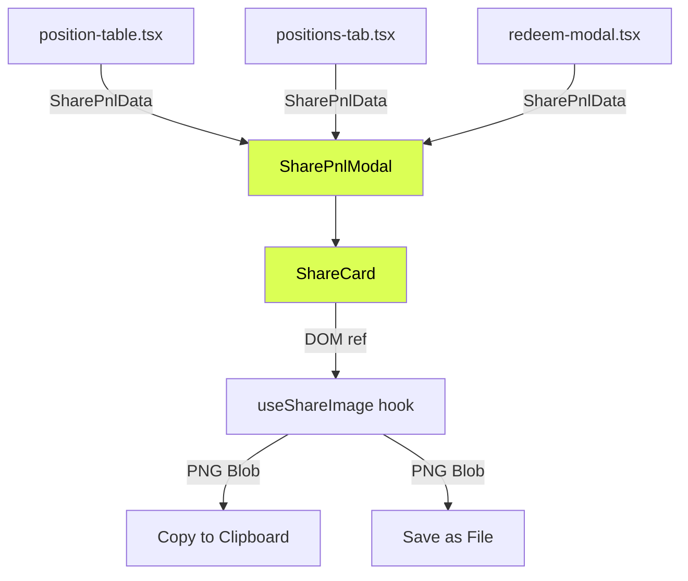

# Design Document: Share PNL

## Overview

The Share PNL feature builds a client-side system for generating, previewing, copying, and downloading a branded PNL card image from any position surface in the app. Three entry points (portfolio position table, market positions tab, redeem modal) open a shared `SharePnlModal` containing a rendered `ShareCard` preview with Copy and Save actions.

The card is rendered as a React component styled with Doji design tokens (dark theme forced), then captured as a PNG via `html-to-image`. No new API endpoints are needed — all position data is already available in the component tree. External images (market icons, user avatars) are proxied through Next.js image optimization or converted to data URLs to avoid CORS issues during capture.

The system is designed for extensibility: visual configuration (background style, layout variant) is separated from position data via props, so future editing controls (background picker, layout selector) can be added without restructuring.

## Architecture

### Data Flow



### Key Design Decisions

1. **Unified data interface (`SharePnlData`)**: All three entry points normalize their position data into a single shape before passing to the modal. This avoids conditional logic inside the card component and makes adding new entry points trivial.

2. **HTML-to-image over Canvas API**: Using `html-to-image` (specifically `toPng` from the library) lets us render the card as a normal React component with Tailwind classes and CSS variables, then capture it. This avoids duplicating layout logic in a Canvas 2D context and keeps the card WYSIWYG.

3. **Forced dark theme on card**: The card always renders in the Doji dark theme regardless of the user's active theme. This is achieved by wrapping the card in a container with the `doji` class (which triggers the dark variant per `index.css`).

4. **Image proxying for CORS**: Market icons and user avatars are external URLs that would cause `html-to-image` to fail with tainted canvas errors. We convert these to data URLs via `fetch` + `blob` + `FileReader` before rendering them in the card. The `isLikelyPng` utility already exists for fallback handling.

5. **Ref-based capture**: The `ShareCard` exposes a `ref` to its root DOM node. The `useShareImage` hook takes this ref and runs `toPng` with 2x pixel ratio for retina quality. The blob is cached in state so Copy and Save don't re-render.

## Components and Interfaces

### `SharePnlData` (shared interface)

**File:** `apps/web/src/components/share-pnl/types.ts`

```typescript
export interface SharePnlData {
  /** Market title / question text */
  marketTitle: string;
  /** Market icon URL (nullable — falls back to first char of title) */
  marketIcon: string | null;
  /** Outcome label: "Yes", "No", or a named outcome */
  outcome: string;
  /** Average entry price as a decimal (0–1) */
  avgPrice: number;
  /** Current or exit price as a decimal (0–1) */
  currentPrice: number;
  /** PNL in USD (positive = profit, negative = loss) */
  pnlUsd: number;
  /** User's Polymarket avatar URL (nullable) */
  userAvatar: string | null;
  /** User's display name / username */
  username: string;
  /** Event or market slug for filename generation */
  slug: string;
}
```

### `ShareCardConfig` (visual configuration)

```typescript
export interface ShareCardConfig {
  /** Background style variant — extensible for future options */
  backgroundStyle: "default";
  /** Layout variant — extensible for future options */
  layoutVariant: "default";
}
```

### `ShareCard` component

**File:** `apps/web/src/components/share-pnl/share-card.tsx`

A pure presentational component that renders the PNL card layout. Accepts `SharePnlData` and `ShareCardConfig` as props. Forwards a `ref` to its root `<div>` for image capture.

Layout (top to bottom):
- **Header row**: Doji logo wordmark (left) · circular avatar + @username (right)
- **Center section**: Market icon (rounded square, 48px) + market title (wrapping) + outcome pill
- **Bottom row**: "Avg Entry Price" + value in cents (left) · "Exit Price" + value in cents (center-left) · large PNL amount (right, green/red)
- **Background**: `--card` base · subtle grid overlay using `--surface-1` · large tilted `DojiLogoMarkPaths` watermark at ~15–20° rotation, same subtle color

The card is wrapped in a container with the `doji` class to force dark theme, and uses a fixed aspect ratio of approximately 16:9 (e.g. 600×338px at 1x, captured at 1200×676px for 2x).

### `useShareImage` hook

**File:** `apps/web/src/components/share-pnl/use-share-image.ts`

```typescript
export function useShareImage(cardRef: RefObject<HTMLDivElement | null>): {
  blob: Blob | null;
  isRendering: boolean;
  error: string | null;
  regenerate: () => void;
}
```

- On mount (and when `regenerate` is called), converts external image URLs in the card to data URLs, then calls `toPng` from `html-to-image` with `pixelRatio: 2`.
- Stores the resulting PNG blob in state.
- Exposes `isRendering` for button disabled states and `error` for toast display.

### `SharePnlModal` component

**File:** `apps/web/src/components/share-pnl/share-pnl-modal.tsx`

Uses the existing `Dialog` / `DialogContent` from `@/components/ui/dialog`. Contains:
- The `ShareCard` (rendered at display size inside a centered container)
- A footer with "Copy" and "Save" buttons (both disabled while `isRendering` is true)
- Error display via `sonner` toast on image generation failure, copy failure, or clipboard unavailability

The modal container is structured so future editing controls (sidebar/toolbar) can be added alongside the card preview without restructuring.

### `copyImageToClipboard` utility

**File:** `apps/web/src/components/share-pnl/share-actions.ts`

```typescript
export async function copyImageToClipboard(blob: Blob): Promise<void>
```

Writes the PNG blob to clipboard via `navigator.clipboard.write([new ClipboardItem({ 'image/png': blob })])`. Throws if Clipboard API is unavailable.

### `saveImageAsFile` utility

```typescript
export async function saveImageAsFile(blob: Blob, slug: string): Promise<void>
```

Creates an object URL, triggers a download via a temporary `<a>` element with `download="doji-pnl-{slug}.png"`, then revokes the URL.

### Entry Point Modifications

**`position-table.tsx`**: The Share2 button `onClick` opens `SharePnlModal` with `SharePnlData` derived from the `Position` row. Requires adding state for the selected position and the modal open flag.

**`positions-tab.tsx`**: Same pattern — Share2 button opens the modal with data from the `PositionRow`.

**`redeem-modal.tsx`**: The existing disabled "Share PNL" button is enabled. On click, it opens `SharePnlModal` with data derived from the `RedeemableGroup` (title, icon, bet, pnl). PNL percentage is computed from `pnl / bet`.

All three entry points import a shared `toSharePnlData` helper that normalizes their respective data shapes into `SharePnlData`.

## Data Models

### Position → SharePnlData Mapping

| SharePnlData field | From Position (position-table / positions-tab) | From RedeemableGroup (redeem-modal) |
|---|---|---|
| `marketTitle` | `position.title ?? position.market?.question` | `group.title` |
| `marketIcon` | `position.icon` | `group.icon` |
| `outcome` | `position.outcomeLabel ?? derived from market tokens` | Derived from group context (winning outcome) |
| `avgPrice` | `position.avgPrice` | `group.bet / shares` (approximated) |
| `currentPrice` | `position.curPrice` | `1.0` (resolved market, winning token = $1) |
| `pnlUsd` | `getPositionUnrealizedPnlDisplayUsd(...)` | `group.pnl` |
| `userAvatar` | From auth/profile context | From auth/profile context |
| `username` | From auth/profile context | From auth/profile context |
| `slug` | `position.marketSlug ?? position.eventSlug` | `group.eventSlug` |

### External Dependencies

| Dependency | Purpose | Install |
|---|---|---|
| `html-to-image` | DOM-to-PNG capture | `pnpm add html-to-image --filter web` |

No other new dependencies. The project already has `sonner` (toasts), `lucide-react` (icons), `next/image`, and all shadcn/ui primitives.


## Correctness Properties

*A property is a characteristic or behavior that should hold true across all valid executions of a system — essentially, a formal statement about what the system should do. Properties serve as the bridge between human-readable specifications and machine-verifiable correctness guarantees.*

### Property 1: Card Content Completeness

*For any* valid `SharePnlData` with a non-empty `username` and `marketTitle`, the rendered `ShareCard` DOM should contain the text `@{username}` and the full `marketTitle` string.

**Validates: Requirements 2.2, 2.4**

### Property 2: Icon Fallback Character

*For any* `SharePnlData` where `marketIcon` is `null` and `marketTitle` is non-empty, the rendered `ShareCard` should display a fallback element containing the first character of `marketTitle`.

**Validates: Requirements 2.3**

### Property 3: Outcome Pill Color Mapping

*For any* outcome string, the outcome pill color class should return `bg-positive/10 text-positive` when the lowercase outcome is `"yes"`, `bg-negative/10 text-negative` when `"no"`, and `bg-muted text-muted-foreground` for all other strings.

**Validates: Requirements 2.5**

### Property 4: Price Formatting in Cents

*For any* price value `p` in the range [0, 1], formatting it as cents should produce a string ending in `¢` with the numeric portion equal to `round(p * 100)` (or a decimal representation for sub-cent precision).

**Validates: Requirements 2.6, 2.7**

### Property 5: PNL Display Formatting and Color

*For any* PNL value in USD, the formatted display should use a `+` prefix when the value is ≥ 0 and a `-` prefix when negative, formatted as USD with commas. The color class should be `text-doji-green` (or the profit token) when PNL ≥ 0 and `text-loss` (or the loss token) when PNL < 0.

**Validates: Requirements 2.8, 2.9**

### Property 6: Download Filename Pattern

*For any* non-empty slug string, the generated download filename should match the pattern `doji-pnl-{slug}.png`.

**Validates: Requirements 5.2**

### Property 7: Data Normalization Produces Valid SharePnlData

*For any* valid `Position` object (with non-empty title, valid avgPrice, curPrice, and size) or valid `RedeemableGroup` (with non-empty title, bet > 0), the `toSharePnlData` conversion function should produce a `SharePnlData` object where `marketTitle` is non-empty, `avgPrice` and `currentPrice` are in [0, 1], and `pnlUsd` is a finite number.

**Validates: Requirements 7.4**

### Property 8: PNL Percentage Computation

*For any* `RedeemableGroup` with `bet > 0`, the PNL percentage should equal `(pnl / bet) * 100`.

**Validates: Requirements 6.2**

## Error Handling

| Scenario | Behavior |
|----------|----------|
| `html-to-image` `toPng` throws | `useShareImage` sets `error` state; modal displays error via `sonner` toast. Copy/Save buttons remain disabled. |
| Clipboard API unavailable (`navigator.clipboard` undefined) | `copyImageToClipboard` throws; modal catches and shows error toast "Copying not supported in this browser". |
| `clipboard.write` rejects (e.g. permissions denied) | Same as above — error toast with the rejection reason. |
| External image URL fails to fetch (CORS / 404) | Image is replaced with fallback (first char for market icon, generic avatar for user pic) before capture. Card still renders and captures successfully. |
| Blob is null when user clicks Copy/Save | Buttons are disabled while `isRendering` is true and while `blob` is null. This state should not be reachable, but if it is, the action functions check for null and show a toast. |
| Market icon URL is not http/https | Treated as unavailable — fallback character is shown (same as existing `MarketImage` behavior in position-table). |
| Username is empty/null | Display "@anonymous" or omit the username section. The card still renders. |

## Testing Strategy

### Unit Tests

Unit tests cover specific examples and edge cases:

- **Modal open/close**: Clicking share button opens modal with correct data; closing unmounts card
- **Button disabled states**: Copy and Save buttons are disabled while `isRendering` is true
- **Copy success feedback**: After successful clipboard write, success toast is shown
- **Copy error feedback**: When clipboard API throws, error toast is shown
- **Save triggers download**: Clicking Save creates a download link with correct filename
- **Image generation error**: When `toPng` throws, error toast is shown and buttons stay disabled
- **Redeem modal integration**: Share PNL button is enabled and opens modal with RedeemableGroup data
- **Dark theme forced**: Card wrapper has `doji` class regardless of active theme
- **Fallback avatar**: When `userAvatar` is null, a generic fallback is rendered

### Property-Based Tests

Property tests use `fast-check` with Vitest, minimum 100 iterations per property.

Each property test must be tagged with a comment referencing the design property:
```
// Feature: share-pnl, Property N: <title>
```

| Property | Generator Strategy |
|----------|-------------------|
| Property 1: Card content completeness | Generate random non-empty `username` and `marketTitle` strings. Render `ShareCard` with generated `SharePnlData`. Assert DOM contains `@{username}` and `marketTitle`. |
| Property 2: Icon fallback character | Generate random non-empty `marketTitle` with `marketIcon: null`. Render `ShareCard`. Assert fallback element contains `marketTitle.charAt(0)`. |
| Property 3: Outcome pill color mapping | Generate random outcome strings (including "yes", "Yes", "YES", "no", "No", "NO", and arbitrary strings). Assert the color class function returns the correct class for each. |
| Property 4: Price formatting in cents | Generate random floats in [0, 1]. Assert formatted string ends with `¢` and numeric value matches `round(p * 100)`. |
| Property 5: PNL display formatting and color | Generate random finite numbers (positive, negative, zero). Assert prefix is `+` for ≥ 0, `-` for < 0. Assert color class is profit for ≥ 0, loss for < 0. |
| Property 6: Download filename pattern | Generate random non-empty slug strings (alphanumeric + hyphens). Assert filename matches `doji-pnl-{slug}.png`. |
| Property 7: Data normalization | Generate random Position-like objects with valid fields. Run `toSharePnlData`. Assert output has non-empty `marketTitle`, `avgPrice` in [0,1], `currentPrice` in [0,1], finite `pnlUsd`. |
| Property 8: PNL percentage computation | Generate random `bet` (> 0) and `pnl` numbers. Assert computed percentage equals `(pnl / bet) * 100`. |

### Test Configuration

- Library: `fast-check` with Vitest
- Iterations: 100 minimum per property (`fc.assert(property, { numRuns: 100 })`)
- Test location: `tests/unit/share-pnl.test.ts`
- Each property-based test references its design document property via comment tag
- Tag format: `Feature: share-pnl, Property {number}: {title}`
