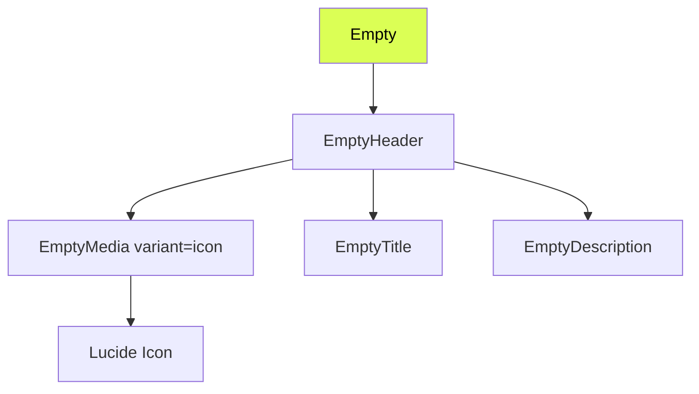

# Design Document: Table Empty States

## Overview

Replace all plain-text empty states across trading terminal tabs and portfolio tables with polished compositions using the existing `Empty`, `EmptyHeader`, `EmptyMedia`, `EmptyTitle`, and `EmptyDescription` primitives from `@/components/ui/empty`. Each empty state renders a contextual Lucide icon inside a rounded muted container, a `text-sm font-medium` title, and a `text-xs text-text-muted` description. No action buttons or CTAs.

The current implementations are scattered `<span>` elements with inconsistent styling (`text-text-tertiary` vs `text-text-muted`, `text-xs` vs `text-sm`). This feature consolidates them into a single composition pattern that is visually consistent and uses the project's design token system.

## Architecture

### Composition Pattern

The feature does not introduce new shared wrapper components. Each call site composes the existing `Empty` primitives inline, following a consistent structure:



### Affected Files

**Trading Terminal (market tabs):**
- `apps/web/src/components/market/tabs/trade-utils.tsx` — Replace the shared `EmptyState` component
- `apps/web/src/components/market/tabs/positions-tab.tsx` — Update call sites for connected/disconnected states
- `apps/web/src/components/market/tabs/orders-tab.tsx` — Update call site
- `apps/web/src/components/market/tabs/history-tab.tsx` — Update call sites for connected/disconnected states
- `apps/web/src/components/market/tabs/trades-tab.tsx` — Update call site
- `apps/web/src/components/market/tabs/holders-tab.tsx` — Update call site

**Trading Terminal (sidebar):**
- `apps/web/src/components/trading/orders/open-orders.tsx` — Replace inline `EmptyState`

**Portfolio:**
- `apps/web/src/components/portfolio/position-table.tsx` — Replace inline `EmptyState`
- `apps/web/src/components/portfolio/closed-positions.tsx` — Replace inline `EmptyState`
- `apps/web/src/components/portfolio/orders-table.tsx` — Replace inline `EmptyState`
- `apps/web/src/components/portfolio/activity-history.tsx` — Replace inline `EmptyState`
- `apps/web/src/components/portfolio/redeem-tab.tsx` — Replace inline empty state

### Key Design Decisions

1. **No new wrapper component**: The `Empty` primitives are already composable. Creating a `TableEmptyState` wrapper would add an unnecessary abstraction layer. Each call site composes `Empty > EmptyHeader > EmptyMedia + EmptyTitle + EmptyDescription` directly. This keeps the code explicit and avoids prop-drilling icon/title/description through yet another component.

2. **Refactor `trade-utils.tsx` EmptyState**: The current `EmptyState({ message })` in `trade-utils.tsx` is used by all trading terminal tabs. Rather than replacing it with a new wrapper, we update it to accept `icon`, `title`, and `description` props and compose the `Empty` primitives internally. This minimizes diff across the 6 tab files that import it.

3. **Icon selection per context**: Each table gets a contextual Lucide icon that communicates the data type:
   - Positions → `BarChart3` (chart bars suggest holdings)
   - Orders → `ClipboardList` (list suggests pending items)
   - History → `Clock` (time-based activity)
   - Trades → `ArrowLeftRight` (exchange/swap)
   - Holders → `Users` (people)
   - Redeem → `Gift` (reward/claim)
   - Search no-match → `Search` (magnifying glass)
   - Wallet disconnected → `Wallet` (wallet connection)

4. **Dual messaging for auth-gated tabs**: Positions, Orders, and History tabs in the trading terminal show different copy when the wallet is disconnected vs when data is simply empty. The `trade-utils.tsx` `EmptyState` handles both cases via props.

5. **Search filter empty states**: Portfolio tables that support search (positions, closed positions, orders) show a distinct "No X match your search" message with a `Search` icon when a filter is active but returns no results.

## Components and Interfaces

### Updated `EmptyState` in `trade-utils.tsx`

**File:** `apps/web/src/components/market/tabs/trade-utils.tsx`

```typescript
import { type LucideIcon } from "lucide-react";
import {
  Empty,
  EmptyHeader,
  EmptyMedia,
  EmptyTitle,
  EmptyDescription,
} from "@/components/ui/empty";

interface EmptyStateProps {
  icon: LucideIcon;
  title: string;
  description: string;
}

export function EmptyState({ icon: Icon, title, description }: EmptyStateProps) {
  return (
    <Empty className="py-8">
      <EmptyHeader>
        <EmptyMedia variant="icon">
          <Icon className="size-4 text-text-muted" />
        </EmptyMedia>
        <EmptyTitle>{title}</EmptyTitle>
        <EmptyDescription>{description}</EmptyDescription>
      </EmptyHeader>
    </Empty>
  );
}
```

### Portfolio `EmptyState` Pattern

Each portfolio file replaces its local `EmptyState` with the same inline composition:

```typescript
import { BarChart3 } from "lucide-react";
import {
  Empty,
  EmptyHeader,
  EmptyMedia,
  EmptyTitle,
  EmptyDescription,
} from "@/components/ui/empty";

function EmptyState({ title, description, icon: Icon }: {
  title: string;
  description: string;
  icon: LucideIcon;
}) {
  return (
    <Empty className="py-8">
      <EmptyHeader>
        <EmptyMedia variant="icon">
          <Icon className="size-4 text-text-muted" />
        </EmptyMedia>
        <EmptyTitle>{title}</EmptyTitle>
        <EmptyDescription>{description}</EmptyDescription>
      </EmptyHeader>
    </Empty>
  );
}
```

### Icon Mapping

| Context | Icon | Title | Description |
|---------|------|-------|-------------|
| Trading Positions (empty) | `BarChart3` | No open positions | Your positions for this market will appear here |
| Trading Positions (disconnected) | `Wallet` | Connect wallet to see positions | Log in to view your positions for this market |
| Trading Orders | `ClipboardList` | No open orders | Your limit orders for this market will appear here |
| Trading History (empty) | `Clock` | No history yet | Your trades and activity for this market will appear here |
| Trading History (disconnected) | `Wallet` | Connect wallet to see history | Log in to view your trade history for this market |
| Trading Trades | `ArrowLeftRight` | No trades yet | Trades for this market will appear here |
| Trading Holders | `Users` | No holders data | Holder information for this market will appear here |
| Trading Open Orders Panel | `ClipboardList` | No open orders | Orders you place will appear here |
| Portfolio Positions (empty) | `BarChart3` | No open positions | Markets you hold positions in will appear here |
| Portfolio Positions (search) | `Search` | No positions match your search | Try adjusting your search terms |
| Portfolio Closed (empty) | `BarChart3` | No closed positions | Resolved or sold positions will appear here |
| Portfolio Closed (search) | `Search` | No positions match your search | Try adjusting your search terms |
| Portfolio Orders (empty) | `ClipboardList` | No open orders | Your pending limit orders will appear here |
| Portfolio Orders (search) | `Search` | No orders match your search | Try adjusting your search terms |
| Portfolio Activity | `Clock` | No history found | Your trade activity and transactions will appear here |
| Portfolio Redeem | `Gift` | No positions eligible to redeem | Resolved winning positions will appear here for redemption |

## Data Models

No new data models are introduced. This feature is purely presentational — it consumes the same data (positions, orders, trades, holders arrays) that already exists and only changes what renders when those arrays are empty.

The only "data" involved is the static mapping of context → icon + title + description, which is hardcoded at each call site as string literals and icon imports.


## Correctness Properties

*A property is a characteristic or behavior that should hold true across all valid executions of a system — essentially, a formal statement about what the system should do. Properties serve as the bridge between human-readable specifications and machine-verifiable correctness guarantees.*

### Property 1: Empty state structural composition

*For any* valid combination of Lucide icon, title string, and description string passed to an empty state composition, the rendered output SHALL contain exactly three child regions in order: an icon container (with `data-slot="empty-icon"`), a title element (with `data-slot="empty-title"`), and a description element (with `data-slot="empty-description"`), where the icon precedes the title and the title precedes the description in DOM order.

**Validates: Requirements 1.1**

### Property 2: No action elements in empty states

*For any* empty state composition rendered across all table contexts, the rendered output SHALL NOT contain any `<button>`, `<a>`, or elements with `role="button"` or `role="link"` as descendants of the empty state container.

**Validates: Requirements 1.5**

### Property 3: Design token compliance

*For any* empty state composition, the rendered class names SHALL satisfy all of the following: (a) text color classes are exclusively from `{text-text-primary, text-text-secondary, text-text-tertiary, text-text-muted, text-muted-foreground}` with no hardcoded hex color values, (b) font size classes are exclusively from `{text-3xl, text-2xl, text-lg, text-sm, text-xs, text-[10px]}` with no unsanctioned sizes like `text-base` or `text-xl`, (c) font weight classes are exclusively `font-normal` or `font-medium` with no `font-semibold` or `font-bold`, and (d) the icon element uses `text-text-muted` or `text-muted-foreground`.

**Validates: Requirements 13.1, 13.2, 13.3, 13.4**

## Error Handling

This feature is purely presentational and renders static content when data arrays are empty. There are no error-prone operations (no network calls, no parsing, no user input processing).

The only conditional logic is:
- **Auth-gated tabs** (Positions, History): Check if `user` is falsy to show the "Connect wallet" variant vs the "No data" variant. This uses the same `user` check that already exists in these components.
- **Search-filtered tables** (Portfolio positions, closed positions, orders): Check if `searchQuery` is non-empty and the filtered array is empty to show the "No X match your search" variant. This uses the same search logic that already exists.

No new error boundaries, try/catch blocks, or fallback states are needed.

## Testing Strategy

### Unit Tests (examples and edge cases)

Unit tests verify that each specific table context renders the correct icon, title, and description text. These are example-based tests covering the exact copy specified in requirements 2–12:

- Trading terminal Positions tab: empty state with "No open positions" (Req 2.1)
- Trading terminal Positions tab: disconnected state with "Connect wallet to see positions" (Req 2.2)
- Trading terminal Orders tab: "No open orders" (Req 3.1)
- Trading terminal History tab: "No history yet" (Req 4.1)
- Trading terminal History tab: disconnected "Connect wallet to see history" (Req 4.2)
- Trading terminal Trades tab: "No trades yet" (Req 5.1)
- Trading terminal Holders tab: "No holders data" (Req 6.1)
- Portfolio open positions: "No open positions" (Req 7.1)
- Portfolio open positions: search filter "No positions match your search" (Req 7.2)
- Portfolio closed positions: "No closed positions" (Req 8.1)
- Portfolio closed positions: search filter (Req 8.2)
- Portfolio orders: "No open orders" (Req 9.1)
- Portfolio orders: search filter (Req 9.2)
- Portfolio activity: "No history found" (Req 10.1)
- Portfolio redeem: "No positions eligible to redeem" (Req 11.1)
- Trading sidebar open orders: "No open orders" (Req 12.1)
- EmptyMedia variant="icon" renders with `bg-muted` and `rounded-md` classes (Req 1.2)
- EmptyTitle has `text-sm` and `font-medium` classes (Req 1.3)
- EmptyDescription has `text-xs` and `text-muted-foreground` classes (Req 1.4)

### Property-Based Tests

Property tests use `fast-check` (already available in the project's Vitest setup) to verify universal properties across generated inputs. Each test runs a minimum of 100 iterations.

- **Property 1 test**: Generate arbitrary non-empty strings for title and description, pick a random Lucide icon from a predefined set, render the `EmptyState` composition, and verify the DOM contains the three `data-slot` elements in correct order.
  - Tag: `Feature: table-empty-states, Property 1: Empty state structural composition`

- **Property 2 test**: Generate arbitrary title/description strings, render the empty state, and assert no `button`, `a`, `[role="button"]`, or `[role="link"]` elements exist within the container.
  - Tag: `Feature: table-empty-states, Property 2: No action elements in empty states`

- **Property 3 test**: Generate arbitrary title/description strings, render the empty state, extract all class names from the container and its descendants, and verify they conform to the design token allowlists (no hardcoded hex colors, no unsanctioned font sizes, no bold/semibold weights, icon uses muted color).
  - Tag: `Feature: table-empty-states, Property 3: Design token compliance`

### Test Configuration

- **Library**: `fast-check` with Vitest
- **Iterations**: Minimum 100 per property test
- **Rendering**: `@testing-library/react` for DOM assertions
- Each property test MUST reference its design document property via a comment tag
- Each correctness property is implemented by a single property-based test
