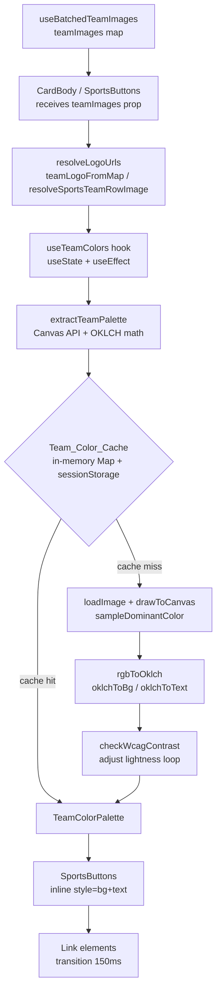
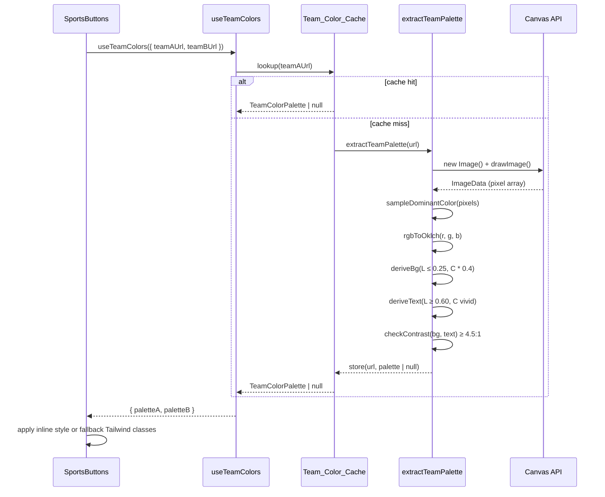
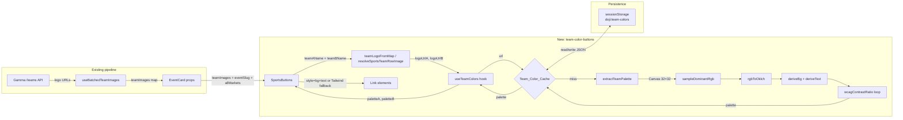

# Design Document: Team Color Buttons

## Overview

Sports moneyline buttons on the Doji explore page currently use static green/red colors for Team A and Team B. This feature extracts the dominant color from each team's logo (already fetched via the Gamma `/teams` pipeline) and derives a dark muted background variant and a vivid text variant in OKLCH color space. The colors are applied via inline `style` props on the `Link` elements inside `SportsButtons`, with a 150ms CSS transition so the swap from fallback to palette is smooth. The Draw button always stays neutral. No new API calls or npm packages are required.

## Architecture



## Sequence Diagram: Color Extraction Flow



## Components and Interfaces

### 1. `TeamColorPalette` type

**File:** `apps/web/src/domains/trading/hooks/sports/use-team-colors.ts`

```typescript
export interface TeamColorPalette {
  /** Dark muted background — OKLCH lightness ≤ 0.25 */
  bg: string;   // e.g. "oklch(0.18 0.04 240)"
  /** Vivid foreground — OKLCH lightness ≥ 0.60 */
  text: string; // e.g. "oklch(0.72 0.18 240)"
}
```

**Responsibilities:**
- Carries the two CSS color strings that replace the static Tailwind classes on a team button.
- Both values are valid CSS `oklch(...)` strings, ready for inline `style` props.

---

### 2. `Team_Color_Cache` (module-level singleton)

**File:** `apps/web/src/domains/trading/hooks/sports/use-team-colors.ts`

```typescript
const STORAGE_KEY = "doji:team-colors" as const;

// Resolved palettes (null = extraction attempted but failed)
const paletteCache = new Map<string, TeamColorPalette | null>();

// In-flight dedup: same URL requested concurrently shares one Promise
const inflight = new Map<string, Promise<TeamColorPalette | null>>();
```

**Responsibilities:**
- `paletteCache` — module-level `Map` keyed by logo URL. Survives re-renders; cleared on full page reload.
- `inflight` — deduplicates concurrent calls for the same URL so the image is fetched and processed at most once.
- On module init, reads `sessionStorage.getItem(STORAGE_KEY)` and pre-populates `paletteCache` (silent try/catch).
- After each successful extraction, serialises `paletteCache` to `sessionStorage` (silent try/catch on quota errors).

**sessionStorage schema:**
```typescript
// Value stored at "doji:team-colors"
type PersistedColorData = Record<string, TeamColorPalette | null>;
// { "https://cdn.../spurs.png": { bg: "oklch(...)", text: "oklch(...)" }, ... }
```

---

### 3. `extractTeamPalette(url: string): Promise<TeamColorPalette | null>`

**File:** `apps/web/src/domains/trading/hooks/sports/use-team-colors.ts`

```typescript
async function extractTeamPalette(
  url: string
): Promise<TeamColorPalette | null>
```

**Preconditions:**
- `url` is a non-empty string that has already passed the `isUsableTeamRowImageUrl` guard (not null, not the generic soccer ball URL).
- Called only in browser context (`typeof window !== "undefined"`).

**Postconditions:**
- Returns a `TeamColorPalette` where `bg` has OKLCH lightness ≤ 0.25 and `text` has OKLCH lightness ≥ 0.60.
- The contrast ratio between `text` and `bg` is ≥ 4.5:1 (WCAG AA).
- Returns `null` on any failure: image load error, CORS block, canvas taint, or contrast unachievable within bounds.
- Never throws — all errors are caught and converted to `null`.

**Algorithm:**

```pascal
FUNCTION extractTeamPalette(url)
  INPUT: url: string
  OUTPUT: TeamColorPalette | null

  BEGIN
    // 1. Load image with crossOrigin = "anonymous"
    img ← new Image()
    img.crossOrigin ← "anonymous"
    loaded ← await loadImagePromise(img, url)  // resolves true/false
    IF NOT loaded THEN RETURN null END IF

    // 2. Draw to offscreen canvas (32×32 — enough for color sampling, fast)
    canvas ← new OffscreenCanvas(32, 32)
    ctx ← canvas.getContext("2d")
    ctx.drawImage(img, 0, 0, 32, 32)

    // 3. Sample pixels — try/catch for canvas taint (CORS)
    TRY
      data ← ctx.getImageData(0, 0, 32, 32).data
    CATCH
      RETURN null
    END TRY

    // 4. Find dominant color via frequency bucketing (8-bit → 4-bit per channel)
    rgb ← sampleDominantRgb(data)
    IF rgb IS null THEN RETURN null END IF

    // 5. Convert to OKLCH
    oklch ← rgbToOklch(rgb.r, rgb.g, rgb.b)

    // 6. Derive bg variant: clamp lightness ≤ 0.25, desaturate chroma × 0.4
    bgL ← min(oklch.L, 0.25)
    bgC ← oklch.C * 0.4
    bgH ← oklch.H
    bg ← formatOklch(bgL, bgC, bgH)

    // 7. Derive text variant: clamp lightness ≥ 0.60, keep vivid chroma
    textL ← max(oklch.L, 0.60)
    textC ← oklch.C
    textH ← oklch.H
    text ← formatOklch(textL, textC, textH)

    // 8. WCAG AA contrast check with adjustment loop
    contrast ← wcagContrastRatio(bg, text)
    WHILE contrast < 4.5 AND textL < 0.95 DO
      textL ← textL + 0.02
      text ← formatOklch(textL, textC, textH)
      contrast ← wcagContrastRatio(bg, text)
    END WHILE

    IF contrast < 4.5 THEN RETURN null END IF

    RETURN { bg, text }
  END
```

**Loop invariant:** At each iteration, `textL` increases monotonically and `contrast` is recalculated against the fixed `bg`. The loop terminates because `textL` is bounded by 0.95 (at most ~18 iterations of 0.02 steps from 0.60).

---

### 4. Color Math Helpers

**File:** `apps/web/src/domains/trading/hooks/sports/use-team-colors.ts` (unexported, module-private)

#### `sampleDominantRgb(data: Uint8ClampedArray): { r: number; g: number; b: number } | null`

Buckets each pixel's RGB into 4-bit per channel (4096 buckets). Skips near-transparent pixels (alpha < 128) and near-white/near-black pixels (all channels > 240 or all < 15) to avoid extracting background fill colors. Returns the RGB centroid of the most-populated bucket.

#### `rgbToOklch(r: number, g: number, b: number): { L: number; C: number; H: number }`

Converts sRGB (0–255) → linear RGB → XYZ D65 → Oklab → OKLCH. Uses the standard Björn Ottosson Oklab matrix. All intermediate values are computed in floating point.

#### `wcagContrastRatio(bg: string, text: string): number`

Parses `oklch(L C H)` strings back to relative luminance via OKLCH → Oklab → XYZ → sRGB → linearise → Y. Returns the WCAG contrast ratio `(L1 + 0.05) / (L2 + 0.05)` where L1 is the lighter value.

#### `formatOklch(L: number, C: number, H: number): string`

Returns `oklch(${L.toFixed(4)} ${C.toFixed(4)} ${H.toFixed(2)})`. All three values are clamped to valid ranges before formatting (L: 0–1, C: 0–0.4, H: 0–360).

---

### 5. `useTeamColors` hook

**File:** `apps/web/src/domains/trading/hooks/sports/use-team-colors.ts`

```typescript
export function useTeamColors(params: {
  teamAUrl: string | null;
  teamBUrl: string | null;
}): {
  paletteA: TeamColorPalette | null;
  paletteB: TeamColorPalette | null;
}
```

**Preconditions:**
- Called only from a `"use client"` component.
- `teamAUrl` and `teamBUrl` may be null (no logo available).

**Postconditions:**
- Returns `{ paletteA: null, paletteB: null }` on initial render (SSR-safe).
- After mount, triggers `extractTeamPalette` for each non-null URL not already in cache.
- State updates cause a re-render that applies the resolved palette.
- If a URL is null or extraction returns null, the corresponding palette remains null (fallback colors apply).

**Implementation sketch:**

```typescript
"use client";

export function useTeamColors({ teamAUrl, teamBUrl }: {
  teamAUrl: string | null;
  teamBUrl: string | null;
}) {
  const [paletteA, setPaletteA] = useState<TeamColorPalette | null>(null);
  const [paletteB, setPaletteB] = useState<TeamColorPalette | null>(null);

  useEffect(() => {
    if (!teamAUrl) return;
    // Check cache first (synchronous)
    if (paletteCache.has(teamAUrl)) {
      setPaletteA(paletteCache.get(teamAUrl) ?? null);
      return;
    }
    // Async extraction with in-flight dedup
    getOrExtract(teamAUrl).then(setPaletteA);
  }, [teamAUrl]);

  useEffect(() => {
    if (!teamBUrl) return;
    if (paletteCache.has(teamBUrl)) {
      setPaletteB(paletteCache.get(teamBUrl) ?? null);
      return;
    }
    getOrExtract(teamBUrl).then(setPaletteB);
  }, [teamBUrl]);

  return { paletteA, paletteB };
}
```

`getOrExtract(url)` checks `inflight`, creates a new Promise if absent, stores it in `inflight`, awaits `extractTeamPalette`, stores result in `paletteCache`, removes from `inflight`, persists to sessionStorage, and returns the palette.

---

### 6. `SportsButtons` integration

**File:** `apps/web/src/domains/explore/components/event-card.tsx`

`SportsButtons` receives a new `teamImages` prop (the same `Record<string, string | null>` already flowing through `CardBody`). It resolves the logo URLs for Team A and Team B using the same `teamLogoFromMap` / `resolveSportsTeamRowImage` logic already in the file, then calls `useTeamColors`.

**Updated prop signature:**

```typescript
function SportsButtons({
  market,
  buttonLabels,
  moneylineMarkets,
  esportsTeamNames,
  teamImages,        // NEW — same map already in CardBody
  eventSlug,         // NEW — needed for slug-token logo lookup
  allMarkets,        // NEW — needed for resolveSportsTeamRowImage fallback
  eventImage,        // NEW — needed for isUsableTeamRowImageUrl guard
}: {
  market: Market | null | undefined;
  buttonLabels?: Record<string, string>;
  moneylineMarkets?: Market[];
  esportsTeamNames?: { teamA: string | null; teamB: string | null } | null;
  teamImages?: Record<string, string | null>;
  eventSlug?: string | null;
  allMarkets?: Market[];
  eventImage?: string | null;
})
```

**Logo URL resolution inside SportsButtons:**

```typescript
// Resolve logo URLs using the same helpers already in event-card.tsx
const logoUrlA = teamImages && teamAName
  ? resolveSportsTeamRowImage(
      teamImages, teamAName, teamAMarket, allMarkets ?? [],
      eventImage, null, eventSlug, slugTokA
    )
  : null;

const logoUrlB = teamImages && teamBName
  ? resolveSportsTeamRowImage(
      teamImages, teamBName, teamBMarket, allMarkets ?? [],
      eventImage, null, eventSlug, slugTokB
    )
  : null;

const { paletteA, paletteB } = useTeamColors({
  teamAUrl: logoUrlA,
  teamBUrl: logoUrlB,
});
```

**Applying palette to Link elements:**

```typescript
// Team A button — palette or fallback
<Link
  className={cn(
    "flex flex-1 items-center justify-center rounded-md px-3 py-2 no-underline",
    paletteA
      ? "transition-[background-color,color]"   // palette path: CSS transition only
      : "bg-positive/10 transition-colors hover:bg-positive/20"  // fallback path
  )}
  style={
    paletteA
      ? {
          backgroundColor: paletteA.bg,
          color: paletteA.text,
          transition: "background-color 150ms ease, color 150ms ease",
        }
      : undefined
  }
  href={(hrefA ?? "#") as "/"}
  prefetch={false}
>
  <span
    className={cn(
      "truncate font-normal text-xs",
      !paletteA && "text-positive"
    )}
  >
    {teamALabel}
  </span>
</Link>

// Draw button — always neutral, never receives palette
<Link
  className="flex flex-1 items-center justify-center rounded-md bg-muted-foreground/10 px-2 py-2 no-underline transition-colors hover:bg-muted-foreground/20"
  href={(hrefDraw ?? "#") as "/"}
  prefetch={false}
>
  <span className="font-normal text-muted-foreground text-xs">Draw</span>
</Link>
```

The same pattern applies to the 2-way and esports fallback layouts within `SportsButtons`.

---

## Data Models

### `TeamColorPalette`

| Field | Type | Constraint |
|-------|------|-----------|
| `bg` | `string` | CSS `oklch(L C H)` — L ≤ 0.25 |
| `text` | `string` | CSS `oklch(L C H)` — L ≥ 0.60 |

### `PersistedColorData` (sessionStorage)

```typescript
type PersistedColorData = Record<string, TeamColorPalette | null>;
```

Stored as JSON at `doji:team-colors`. Null entries are preserved so failed extractions are not retried on page reload.

---

## Data Flow Diagram



---

## Error Handling

### Image load failure (network, CORS, invalid URL)

**Condition:** `img.onerror` fires or `img.onload` never fires within the extraction attempt.  
**Response:** `extractTeamPalette` resolves to `null`. The URL is stored as `null` in `paletteCache` so it is not retried.  
**Recovery:** `SportsButtons` renders with fallback Tailwind classes (`bg-positive/10 text-positive` / `bg-negative/10 text-negative`).

### Canvas taint (CORS)

**Condition:** `ctx.getImageData()` throws a `SecurityError`.  
**Response:** Caught in the try/catch around `getImageData`; returns `null`.  
**Recovery:** Same as image load failure.

### Contrast unachievable

**Condition:** After the lightness adjustment loop reaches `textL = 0.95`, contrast is still < 4.5:1.  
**Response:** `extractTeamPalette` returns `null`.  
**Recovery:** Fallback colors apply. This is expected for very dark logos (e.g. black-on-black crests).

### sessionStorage quota / private browsing

**Condition:** `sessionStorage.setItem` throws.  
**Response:** Caught silently; in-memory `paletteCache` continues to work for the current page session.  
**Recovery:** Colors are re-extracted on next page load (no persistent cache), but extraction is fast enough (< 200ms) that this is acceptable.

### SSR / no `window`

**Condition:** Module is evaluated during server-side rendering.  
**Response:** `useTeamColors` returns `{ paletteA: null, paletteB: null }` immediately (initial state). The `useEffect` that triggers extraction never runs on the server.  
**Recovery:** Buttons render with fallback Tailwind classes on first paint; palette is applied after hydration.

---

## Testing Strategy

### Unit Testing

**File:** `tests/unit/team-color-extractor.test.ts`

Key test cases:
- `rgbToOklch` round-trips: known sRGB values produce expected OKLCH L/C/H within tolerance.
- `sampleDominantRgb` skips transparent pixels (alpha < 128) and near-white/near-black pixels.
- `extractTeamPalette` returns `null` for null/empty URL without touching Canvas.
- `extractTeamPalette` returns `null` for the generic soccer ball URL pattern.
- Derived `bg` always has L ≤ 0.25.
- Derived `text` always has L ≥ 0.60.
- Contrast ratio between returned `bg` and `text` is always ≥ 4.5.
- Returns `null` when contrast cannot be achieved (mock a very dark logo).

### Property-Based Testing

**Library:** `fast-check` (already in the project's test dependencies)

**File:** `tests/unit/team-color-extractor.property.test.ts`

```typescript
// Property: for any valid RGB triple, if extractTeamPalette succeeds,
// the returned palette always satisfies lightness and contrast constraints.
fc.assert(
  fc.asyncProperty(
    fc.tuple(fc.integer({ min: 0, max: 255 }), ...),  // r, g, b
    async ([r, g, b]) => {
      const palette = derivePaletteFromRgb(r, g, b); // internal helper
      if (palette === null) return true; // null is always valid
      const bgL = parseOklchL(palette.bg);
      const textL = parseOklchL(palette.text);
      const contrast = wcagContrastRatio(palette.bg, palette.text);
      return bgL <= 0.25 && textL >= 0.60 && contrast >= 4.5;
    }
  )
);
```

### Integration Testing

- `useTeamColors` hook: mock `extractTeamPalette` to return a known palette; verify `paletteA`/`paletteB` state updates after mount.
- Cache dedup: call `getOrExtract` with the same URL twice concurrently; verify `extractTeamPalette` is called exactly once.
- sessionStorage round-trip: extract a palette, reload the cache from sessionStorage, verify the palette is equivalent.

---

## Performance Considerations

- **Canvas size:** 32×32 pixels (1024 pixels total) is sufficient for dominant color sampling and processes in < 1ms on modern hardware. The 200ms budget is dominated by image network fetch, not canvas ops.
- **In-flight dedup:** Prevents N concurrent extractions for the same URL when N cards with the same team appear on screen simultaneously (e.g. multiple Arsenal matches).
- **sessionStorage pre-population:** On module init, the cache is pre-populated synchronously from sessionStorage so cards that were already colored in a previous navigation render with the correct palette immediately, without a flash.
- **No re-extraction on re-render:** `paletteCache` is module-level (not React state), so it survives component unmount/remount cycles within the same page session.
- **Lazy extraction:** `useEffect` runs after paint, so color extraction never blocks the initial render or causes layout shifts.

---

## Security Considerations

- **CORS:** `img.crossOrigin = "anonymous"` is set before `img.src` to request CORS headers. If the CDN does not send `Access-Control-Allow-Origin`, `getImageData` will throw a `SecurityError` which is caught and returns `null`. No pixel data from cross-origin images is ever exposed.
- **No eval / no dangerouslySetInnerHTML:** All color values are constructed from numeric OKLCH components formatted with `toFixed`. They are applied via the `style` prop object (React escapes these), not via string injection.
- **sessionStorage:** Only `TeamColorPalette` objects (two CSS color strings per entry) are persisted. No user data, tokens, or secrets are stored.

---

## Dependencies

No new npm packages. Uses only:

- **Native Canvas API** (`OffscreenCanvas` or `HTMLCanvasElement`) — available in all modern browsers.
- **CSS `oklch()` color function** — supported in all evergreen browsers (Chrome 111+, Firefox 113+, Safari 15.4+).
- **React `useState` + `useEffect`** — already in use throughout the codebase.
- **`sessionStorage`** — Web Storage API, same pattern as `doji:team-data` in `use-batched-team-images.ts`.

Existing internal utilities reused:
- `isGenericPolymarketSoccerBallImageUrl` from `merge-gamma-team-row.ts`
- `teamLogoFromMap` / `resolveSportsTeamRowImage` from `event-card.tsx`
- `extractOrderedSlugTeamTokens` from `event-card-sports-utils.ts`
