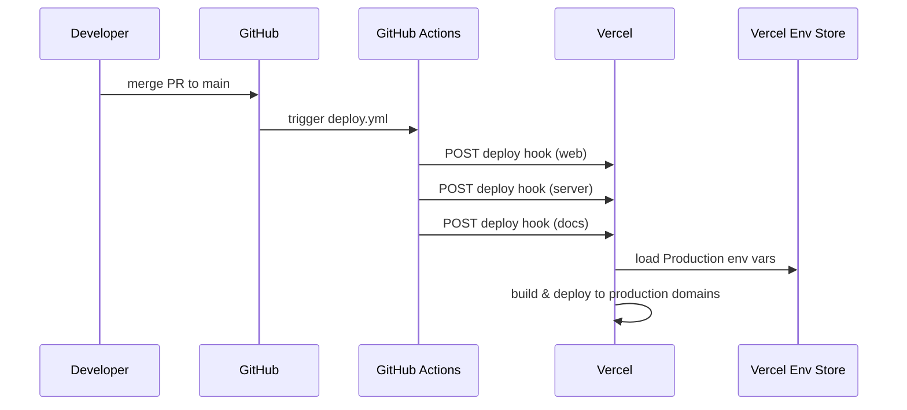
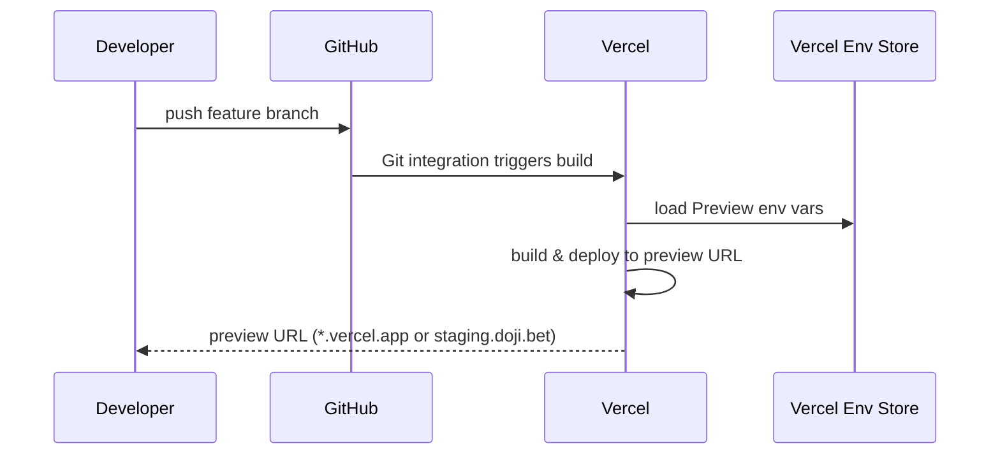
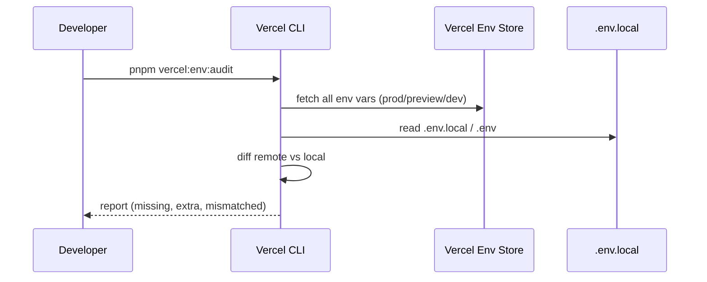

# Design Document: Vercel Environment Alignment

## Overview

This feature establishes a complete environment alignment strategy for the Doji monorepo across three Vercel deployment targets: Production (`main` branch), Preview/Staging (feature branches), and Development (local). The goal is to ensure every environment variable is correctly set per environment, CORS origins match the domain scheme, branch-based deployments route correctly, and developers can audit/sync env vars using the Vercel CLI.

The monorepo has three Vercel projects (web, server, docs) each needing environment-specific configuration. Currently, production deploys via GitHub Actions deploy hooks on `main`, while preview deployments are partially disabled (`git.deploymentEnabled.main: false`). This design unifies the deployment model: production continues via deploy hooks, preview deployments are re-enabled for non-main branches, and environment variables are aligned across all three Vercel environments with proper per-environment overrides.

The design also introduces a `VERCEL_ENV`-aware CORS configuration, an audit script to diff local `.env` files against Vercel-stored values, and updated CLI scripts for pulling/pushing env vars per environment.

## Architecture

```mermaid
graph TD
    subgraph "Git Branches"
        MAIN["main branch"]
        FEAT["feature/* branches"]
    end

    subgraph "GitHub Actions"
        DEPLOY_HOOKS["deploy.yml<br/>(Deploy Hooks)"]
        CI["ci.yml<br/>(Lint, Types, Build)"]
    end

    subgraph "Vercel Projects"
        WEB_PROJ["doji-web<br/>(apps/web)"]
        SERVER_PROJ["doji-server<br/>(apps/server)"]
        DOCS_PROJ["doji-docs<br/>(apps/docs)"]
    end

    subgraph "Vercel Environments"
        PROD["Production<br/>doji.bet / api.doji.bet"]
        PREVIEW["Preview (Staging)<br/>staging.doji.bet / staging-api.doji.bet"]
        DEV["Development<br/>localhost:3000 / localhost:3001"]
    end

    subgraph "External Services"
        NEON_PROD["Neon DB<br/>(production branch)"]
        NEON_PREVIEW["Neon DB<br/>(preview branch)"]
        SENTRY["Sentry<br/>(per-environment)"]
    end

    MAIN -->|push| DEPLOY_HOOKS
    FEAT -->|PR| CI
    FEAT -->|push| WEB_PROJ
    FEAT -->|push| SERVER_PROJ
    FEAT -->|push| DOCS_PROJ

    DEPLOY_HOOKS -->|hook| WEB_PROJ
    DEPLOY_HOOKS -->|hook| SERVER_PROJ
    DEPLOY_HOOKS -->|hook| DOCS_PROJ

    WEB_PROJ --> PROD
    WEB_PROJ --> PREVIEW
    SERVER_PROJ --> PROD
    SERVER_PROJ --> PREVIEW

    PROD --> NEON_PROD
    PREVIEW --> NEON_PREVIEW
    PROD --> SENTRY
    PREVIEW --> SENTRY
end
```

## Sequence Diagrams

### Production Deployment Flow



### Preview Deployment Flow



### Env Var Audit Flow



## Components and Interfaces

### Component 1: Domain Configuration Map

Centralized mapping of environment → domain for all apps.

```typescript
interface DomainConfig {
  web: string;
  server: string;
  docs: string;
}

type VercelEnvironment = "production" | "preview" | "development";

const DOMAIN_MAP: Record<VercelEnvironment, DomainConfig> = {
  production: {
    web: "https://doji.bet",
    server: "https://api.doji.bet",
    docs: "https://docs.doji.bet",
  },
  preview: {
    web: "https://staging.doji.bet",
    server: "https://staging-api.doji.bet",
    docs: "https://staging-docs.doji.bet",
  },
  development: {
    web: "http://localhost:3000",
    server: "http://localhost:3001",
    docs: "http://localhost:3002",
  },
};
```

**Responsibilities**:

- Single source of truth for all domain URLs per environment
- Referenced by CORS config, env var templates, and audit scripts

### Component 2: CORS Origin Configuration

Per-environment CORS origin lists for the server app.

```typescript
interface CorsConfig {
  origins: string[];
}

const CORS_ORIGINS: Record<VercelEnvironment, CorsConfig> = {
  production: {
    origins: [
      "https://doji.bet",
      "https://www.doji.bet",
    ],
  },
  preview: {
    origins: [
      "https://staging.doji.bet",
      "https://doji.bet",          // allow prod web → staging API during testing
      "https://www.doji.bet",
    ],
  },
  development: {
    origins: [
      "http://localhost:3000",
      "http://127.0.0.1:3000",
    ],
  },
};
```

**Responsibilities**:

- Define allowed origins per Vercel environment
- Stored as comma-separated `CORS_ORIGIN` env var in Vercel

### Component 3: Environment Variable Matrix

Complete mapping of every env var to its value per environment and per app.

```typescript
interface EnvVarEntry {
  key: string;
  app: "web" | "server" | "docs";
  production: string | undefined;
  preview: string | undefined;
  development: string | undefined;
  sensitive: boolean;
  notes?: string;
}
```

**Responsibilities**:

- Tracks which vars differ per environment
- Identifies sensitive vars that must not be logged
- Serves as the reference for the audit script

### Component 4: Vercel Git Configuration

Updated `vercel.json` files to enable preview deployments on non-main branches.

```typescript
interface VercelGitConfig {
  deploymentEnabled: {
    main: boolean;       // false — production via deploy hooks
    [branch: string]: boolean;  // other branches: true (default)
  };
}
```

**Responsibilities**:

- Keep `main: false` so production only deploys via GitHub Actions hooks
- Allow all other branches to trigger preview deployments via Vercel Git integration

### Component 5: Env Audit Script

CLI tool to compare local `.env` files against Vercel-stored env vars.

```typescript
interface AuditResult {
  app: "web" | "server";
  missingLocal: string[];      // in Vercel but not in .env.local
  missingRemote: string[];     // in .env.local but not in Vercel
  valueMismatch: string[];     // key exists in both but values differ
  matched: string[];           // key + value match
}

interface AuditReport {
  results: AuditResult[];
  timestamp: string;
  environment: VercelEnvironment;
}
```

**Responsibilities**:

- Pull env vars from Vercel via CLI
- Parse local `.env.local` / `.env` files
- Produce a diff report
- Never print sensitive values — only key names and match/mismatch status

## Data Models

### Model 1: Environment Variable Specification

```typescript
interface EnvVarSpec {
  key: string;
  required: boolean;
  defaultValue?: string;
  perEnvironment: boolean;  // true if value differs across prod/preview/dev
  sensitive: boolean;       // true if value should be masked in logs
  apps: ("web" | "server" | "docs")[];
  description: string;
}
```

**Validation Rules**:

- `key` must be non-empty and match `^[A-Z][A-Z0-9_]*$`
- If `required` is true and `defaultValue` is undefined, the var must be set in Vercel
- If `perEnvironment` is true, the var must have distinct values for prod/preview/dev
- `sensitive` vars are never printed in audit output values

### Model 2: Vercel Project Configuration

```typescript
interface VercelProjectConfig {
  projectName: string;
  rootDirectory: string;
  framework: "nextjs" | "hono" | "other";
  productionBranch: "main";
  domains: {
    production: string[];
    preview: string[];
  };
  envVars: EnvVarSpec[];
}
```

**Validation Rules**:

- `rootDirectory` must match an existing `apps/*` path
- `productionBranch` is always `"main"`
- Each domain must be a valid FQDN
- `envVars` must cover all required vars from `packages/env/src/server.ts` and `web.ts`

## Algorithmic Pseudocode

### Environment Variable Resolution Algorithm

```typescript
/**
 * Resolves the correct value for an environment variable given the
 * Vercel environment and app context.
 *
 * Preconditions:
 *   - envKey is a valid env var name from EnvVarSpec
 *   - vercelEnv is one of "production" | "preview" | "development"
 *   - app is one of "web" | "server" | "docs"
 *
 * Postconditions:
 *   - Returns the resolved value string, or undefined if optional and unset
 *   - Throws if required and no value found
 *
 * Priority: Vercel env store (per-environment) > .env.local > schema default
 */
function resolveEnvVar(
  envKey: string,
  vercelEnv: VercelEnvironment,
  app: "web" | "server" | "docs",
  spec: EnvVarSpec,
): string | undefined {
  // Step 1: Check Vercel env store for environment-specific value
  const vercelValue = getVercelEnvVar(envKey, vercelEnv, app);
  if (vercelValue !== undefined) {
    return vercelValue;
  }

  // Step 2: Check local .env.local (development only)
  if (vercelEnv === "development") {
    const localValue = readLocalEnvFile(app, envKey);
    if (localValue !== undefined) {
      return localValue;
    }
  }

  // Step 3: Fall back to schema default
  if (spec.defaultValue !== undefined) {
    return spec.defaultValue;
  }

  // Step 4: Required but missing — error
  if (spec.required) {
    throw new Error(
      `Required env var ${envKey} is not set for ${vercelEnv}/${app}`
    );
  }

  return undefined;
}
```

### CORS Origin Assembly Algorithm

```typescript
/**
 * Builds the CORS_ORIGIN string for the server app based on
 * the current Vercel environment.
 *
 * Preconditions:
 *   - vercelEnv is a valid VercelEnvironment
 *   - CORS_ORIGINS map is populated
 *
 * Postconditions:
 *   - Returns a comma-separated string of valid URL origins
 *   - All origins are valid URLs (protocol + host, no trailing slash)
 *   - At least one origin is returned
 */
function buildCorsOrigin(vercelEnv: VercelEnvironment): string {
  const config = CORS_ORIGINS[vercelEnv];

  // Validate each origin
  for (const origin of config.origins) {
    const url = new URL(origin);
    if (url.pathname !== "/" || url.search !== "" || url.hash !== "") {
      throw new Error(`CORS origin must be protocol+host only: ${origin}`);
    }
  }

  // Assert at least one origin
  if (config.origins.length === 0) {
    throw new Error(`No CORS origins defined for ${vercelEnv}`);
  }

  return config.origins.join(",");
}
```

### Env Audit Algorithm

```typescript
/**
 * Audits local env files against Vercel-stored env vars.
 *
 * Preconditions:
 *   - Vercel CLI is authenticated and linked to the project
 *   - Local .env.local files exist for the specified apps
 *
 * Postconditions:
 *   - Returns AuditReport with per-app diff results
 *   - Sensitive values are never included in the report
 *   - All env var keys are accounted for (missing, extra, matched, mismatched)
 *
 * Loop Invariant:
 *   - After processing key i, all keys 0..i are classified into exactly
 *     one of: matched, missingLocal, missingRemote, valueMismatch
 */
function auditEnvVars(
  environment: VercelEnvironment,
  apps: ("web" | "server")[],
): AuditReport {
  const results: AuditResult[] = [];

  for (const app of apps) {
    // Pull remote env vars
    const remoteVars = pullVercelEnvVars(app, environment);
    const localVars = parseEnvFile(getEnvFilePath(app));

    const allKeys = new Set([
      ...Object.keys(remoteVars),
      ...Object.keys(localVars),
    ]);

    const result: AuditResult = {
      app,
      missingLocal: [],
      missingRemote: [],
      valueMismatch: [],
      matched: [],
    };

    for (const key of allKeys) {
      const inRemote = key in remoteVars;
      const inLocal = key in localVars;

      if (inRemote && !inLocal) {
        result.missingLocal.push(key);
      } else if (!inRemote && inLocal) {
        result.missingRemote.push(key);
      } else if (inRemote && inLocal) {
        if (remoteVars[key] === localVars[key]) {
          result.matched.push(key);
        } else {
          result.valueMismatch.push(key);
        }
      }
    }

    results.push(result);
  }

  return {
    results,
    timestamp: new Date().toISOString(),
    environment,
  };
}
```

## Key Functions with Formal Specifications

### Function 1: resolveEnvVar()

```typescript
function resolveEnvVar(
  envKey: string,
  vercelEnv: VercelEnvironment,
  app: "web" | "server" | "docs",
  spec: EnvVarSpec,
): string | undefined
```

**Preconditions:**

- `envKey` matches `/^[A-Z][A-Z0-9_]*$/`
- `vercelEnv` is one of `"production"`, `"preview"`, `"development"`
- `app` is one of `"web"`, `"server"`, `"docs"`
- `spec` is a valid `EnvVarSpec` for the given key

**Postconditions:**

- If `spec.required` and no value found at any level → throws Error
- If value found → returns string (never empty string due to `emptyStringAsUndefined`)
- Resolution order: Vercel store > local file > schema default

### Function 2: buildCorsOrigin()

```typescript
function buildCorsOrigin(vercelEnv: VercelEnvironment): string
```

**Preconditions:**

- `vercelEnv` is a valid `VercelEnvironment`
- `CORS_ORIGINS[vercelEnv].origins` has at least one entry

**Postconditions:**

- Returns comma-separated string of valid URL origins
- Each origin has no trailing slash, no path, no query
- Result is parseable by the T3 Env `CORS_ORIGIN` transform in `server.ts`

### Function 3: auditEnvVars()

```typescript
function auditEnvVars(
  environment: VercelEnvironment,
  apps: ("web" | "server")[],
): AuditReport
```

**Preconditions:**

- Vercel CLI is authenticated (`vercel whoami` succeeds)
- Each app's Vercel project is linked (`vercel link` completed)
- Local `.env.local` or `.env` exists for each specified app

**Postconditions:**

- Every key in remote ∪ local is classified into exactly one category
- Sensitive values are never included in the report (keys only)
- `timestamp` is a valid ISO 8601 string

## Example Usage

### Setting Vercel Env Vars via CLI

```bash
# Production — server project
vercel env add CORS_ORIGIN production --cwd apps/server
# Value: https://doji.bet,https://www.doji.bet

vercel env add SERVER_URL production --cwd apps/server
# Value: https://api.doji.bet

# Preview — server project
vercel env add CORS_ORIGIN preview --cwd apps/server
# Value: https://staging.doji.bet,https://doji.bet,https://www.doji.bet

vercel env add SERVER_URL preview --cwd apps/server
# Value: https://staging-api.doji.bet

# Production — web project
vercel env add NEXT_PUBLIC_SERVER_URL production --cwd apps/web
# Value: https://api.doji.bet

vercel env add NEXT_PUBLIC_APP_URL production --cwd apps/web
# Value: https://doji.bet

# Preview — web project
vercel env add NEXT_PUBLIC_SERVER_URL preview --cwd apps/web
# Value: https://staging-api.doji.bet

vercel env add NEXT_PUBLIC_APP_URL preview --cwd apps/web
# Value: https://staging.doji.bet
```

### Pulling Env Vars Locally

```bash
# Pull development env vars for web
pnpm vercel:env:pull:web
# Creates apps/web/.env.local with Development-scoped vars

# Pull preview env vars for web (staging)
vercel env pull apps/web/.env.staging --environment preview --cwd apps/web

# Pull development env vars for server
pnpm vercel:env:pull:server
# Creates apps/server/.env.local with Development-scoped vars

# List all env vars for server project (audit)
vercel env ls --cwd apps/server
# Shows key, target environments, and sensitive status
```

### Running the Audit

```bash
# Audit web app env vars against Vercel production
pnpm vercel:env:audit --app web --env production

# Output:
# ┌─────────────────────────────────┬──────────┐
# │ Key                             │ Status   │
# ├─────────────────────────────────┼──────────┤
# │ NEXT_PUBLIC_SERVER_URL          │ ✓ match  │
# │ NEXT_PUBLIC_APP_URL             │ ✗ missing│
# │ SENTRY_TRACES_SAMPLE_RATE      │ ≠ differ │
# └─────────────────────────────────┴──────────┘
```

## Correctness Properties

*A property is a characteristic or behavior that should hold true across all valid executions of a system — essentially, a formal statement about what the system should do. Properties serve as the bridge between human-readable specifications and machine-verifiable correctness guarantees.*

### Property 1: Domain Map Completeness

*For any* Vercel environment in {production, preview, development} and *for any* app in {web, server, docs}, the Domain_Map must define a non-empty, valid URL.

**Validates: Requirement 1.1**

### Property 2: Domain Consistency

*For any* Vercel environment `e`, the `NEXT_PUBLIC_SERVER_URL` env var in the web project must equal `DOMAIN_MAP[e].server`, and the `NEXT_PUBLIC_APP_URL` env var must equal `DOMAIN_MAP[e].web`.

**Validates: Requirements 1.5, 1.6**

### Property 3: CORS Validity

*For any* Vercel environment, every origin in the `CORS_ORIGIN` value must be a valid URL containing protocol and host only (no path, query, or fragment), the origins array must contain at least one entry, and no origin may be the wildcard `*`.

**Validates: Requirements 2.4, 2.5, 2.7**

### Property 4: CORS Parsing Round-Trip

*For any* valid comma-separated URL string accepted by the T3 Env `CORS_ORIGIN` transform, parsing it into an array of URLs and joining the array back with commas must produce the original string.

**Validates: Requirement 2.6**

### Property 5: Turbo Cache Alignment

*For any* env var key `V` validated by `packages/env/src/server.ts` or `packages/env/src/web.ts`, `V` must appear in either `turbo.json` `globalEnv` or `turbo.json` `tasks.build.env`. Formally: T3_ENV_KEYS ⊆ TURBO_BUILD_ENV.

**Validates: Requirement 5.1**

### Property 6: Turbo Stale Var Exclusion

*For any* var in the known stale var set {`SITE_PASSWORD`, `DATABASE_URL_UNPOOLED`, `POSTGRES_PRISMA_URL`}, that var must not appear in `turbo.json` `tasks.build.env`.

**Validates: Requirements 5.4, 6.1, 6.2, 6.3**

### Property 7: Audit Classification Partition

*For any* set of remote env var keys R and local env var keys L, the audit diff algorithm must classify every key in R ∪ L into exactly one of: `matched`, `missingLocal`, `missingRemote`, or `valueMismatch`. The four result arrays must form a complete, disjoint partition of R ∪ L.

**Validates: Requirement 7.3**

### Property 8: Audit Sensitive Value Masking

*For any* audit report output and *for any* env var marked as sensitive, the audit output must contain only the key name and match/mismatch status — the sensitive value must never appear in the output.

**Validates: Requirements 7.4, 11.2**

### Property 9: Env Var Resolution Priority

*For any* env var key with values defined at multiple resolution levels (Vercel store, local `.env.local`, T3 Env schema default), the `resolveEnvVar` function must return the value from the highest-priority source: Vercel store > local file > schema default.

**Validates: Requirement 12.1**

### Property 10: Required Env Var Error on Missing

*For any* `EnvVarSpec` where `required === true` and no value exists at any resolution level (Vercel store, local file, schema default), the `resolveEnvVar` function must throw an error identifying the missing variable, the Vercel environment, and the app.

**Validates: Requirements 12.2, 10.5**

## Error Handling

### Error Scenario 1: Missing Required Env Var at Build Time

**Condition**: T3 Env validation fails during Vercel build because a required var is not set for the target environment.
**Response**: Build fails with a clear error message listing the missing var(s). T3 Env's built-in error formatting shows exactly which vars are invalid.
**Recovery**: Developer adds the missing var via `vercel env add <KEY> <environment>` and re-triggers the build.

### Error Scenario 2: CORS Mismatch in Preview

**Condition**: A preview deployment's web app makes requests to the preview API, but `CORS_ORIGIN` doesn't include the preview web domain.
**Response**: Browser blocks the request with a CORS error. The API returns no `Access-Control-Allow-Origin` header.
**Recovery**: Update `CORS_ORIGIN` for the preview environment to include the staging web domain. Re-deploy the server.

### Error Scenario 3: Deploy Hook Fires But Env Vars Are Stale

**Condition**: A deploy hook triggers a production build, but env vars were recently changed and the build uses cached values.
**Response**: The deployment may use outdated env vars.
**Recovery**: Vercel always reads env vars fresh at build time — this is not actually an issue. If suspected, re-trigger the deploy hook.

### Error Scenario 4: Audit Script Cannot Authenticate

**Condition**: `vercel whoami` fails because the CLI is not logged in or the token expired.
**Response**: Audit script exits with an authentication error.
**Recovery**: Run `vercel login` to re-authenticate, then retry the audit.

### Error Scenario 5: Local .env File Has Vars Not in Vercel

**Condition**: Developer has added vars to `.env.local` that aren't in the Vercel env store.
**Response**: Audit reports these as `missingRemote` — present locally but not in Vercel.
**Recovery**: Developer decides whether to add them to Vercel (if needed for deployed environments) or keep them local-only (development overrides).

## Testing Strategy

### Unit Testing Approach

- Test `buildCorsOrigin()` with each environment to verify correct comma-separated output
- Test `resolveEnvVar()` priority chain: Vercel value > local file > default > required error
- Test audit diff logic with mock remote/local var sets
- Test domain map completeness (every environment has all three app domains)

### Property-Based Testing Approach

**Property Test Library**: fast-check (already in devDependencies)

- **CORS origin parsing roundtrip**: For any valid comma-separated URL string, the T3 Env transform should produce an array of valid URLs, and joining them back should produce the original string.
- **Audit classification exhaustiveness**: For any set of remote keys R and local keys L, every key in R ∪ L must appear in exactly one of: matched, missingLocal, missingRemote, valueMismatch.
- **Domain map completeness**: For every VercelEnvironment, all three app domains (web, server, docs) must be defined and be valid URLs.

### Integration Testing Approach

- Verify that `vercel env pull` produces a valid `.env.local` that passes T3 Env validation
- Verify that a preview deployment with the correct env vars can make CORS-allowed requests to the preview API
- Verify that the deploy hook workflow triggers exactly one build per app on `main` push

## Performance Considerations

- Env var resolution happens at build time, not runtime — no performance impact on request handling
- The audit script shells out to `vercel env ls` which makes API calls — rate-limited but acceptable for developer tooling
- CORS middleware in Hono checks the origin against an in-memory array — O(n) where n is the number of allowed origins (max ~5), negligible

## Security Considerations

- Sensitive env vars (API keys, secrets, encryption keys) must be set as "Sensitive" in Vercel to prevent them from being read back via the API or dashboard after creation
- The audit script must never print sensitive values — only key names and match/mismatch status
- Preview environments should use separate API keys where possible (e.g., separate Magic keys, separate Polymarket builder credentials for testing)
- `CORS_ORIGIN` must never include wildcard (`*`) — always explicit origins
- Database isolation between production and preview prevents accidental data corruption

### Magic Link Domain Allowlist

Magic SDK enforces a Domain Allowlist that restricts which domains can make requests to the Magic application. All deployment domains must be added to the Magic Dashboard (Settings → Allowed Origins & Redirects):

- Production: `doji.bet`, `www.doji.bet`
- Staging/Preview: `staging.doji.bet`
- Development: `localhost`, `localhost:3000`

If a domain is not in the allowlist, Magic will block authentication requests from that domain and show an error modal to the user. This must be configured in the Magic Dashboard for both the production and test Magic apps.

The Magic Dashboard also supports a Redirect Allowlist for OAuth flows (Google OAuth). All callback URLs must be added:

- `https://doji.bet/callback` (or wherever the OAuth redirect lands)
- `https://staging.doji.bet/callback`
- `http://localhost:3000/callback`

## Vercel Platform Capabilities (from docs)

The following Vercel features are leveraged in this design:

### Custom Environments (Pro Plan)

Pro plan supports 1 custom environment per project. This allows creating a dedicated "Staging" environment (beyond the default Production/Preview/Development) with its own env vars and optional branch tracking. For each Vercel project (web, server, docs), a "Staging" custom environment can be created that:

- Tracks a specific branch (e.g., `staging` or `develop`) for automatic deployments
- Has its own set of environment variables distinct from Preview
- Can have a custom domain attached (e.g., `staging.doji.bet`)

This is configured via: Dashboard → Project → Settings → Environments → Create Environment.

### Sensitive Environment Variables

Use `vercel env add KEY production --sensitive` for secrets. Sensitive vars:

- Are hidden in the Vercel Dashboard after creation (non-readable)
- Behave identically at runtime
- Only available in Production and Preview environments (not Development)
- Should be used for: `MAGIC_SECRET_KEY`, `CREDENTIAL_ENCRYPTION_KEY`, `JWT_SESSION_SECRET`, `POLYMARKET_BUILDER_*`, `DATABASE_URL`

### Branch-Specific Preview Variables

Preview env vars can be scoped to a specific Git branch:

```bash
vercel env add NEXT_PUBLIC_SERVER_URL preview --git-branch staging
```

This allows different API URLs for different feature branches if needed, though the default approach is a single set of Preview vars for all non-main branches.

### Deploy Hooks Limits

Pro plan allows 5 deploy hooks per project. Current usage: 3 hooks (web, API, docs) — leaving 2 available for future use (e.g., content-triggered deploys from a CMS).

### Environment-Specific Pull

The CLI supports pulling vars for specific environments:

```bash
vercel env pull .env.local --environment production
vercel env pull .env.local --environment preview
vercel env pull .env.local --environment development
```

This is the foundation for the audit script — pull remote vars, compare with local.

### `vercel env ls` for Auditing

List all env vars for a project with their environment targets:

```bash
vercel env ls --cwd apps/web
vercel env ls --cwd apps/server
```

Output shows key, target environments, and whether the var is sensitive (value hidden).

## Dependencies

- **Vercel CLI** (`vercel`): Required for env var management, project linking, and the audit script
- **T3 Env** (`@t3-oss/env-core`, `@t3-oss/env-nextjs`): Existing — validates env vars at build/runtime
- **Zod**: Existing — schema validation for env vars
- **Neon**: Database provider — supports branch-based databases for preview environments
- **GitHub Actions**: Existing — deploy hooks workflow for production
- **Vercel Git Integration**: Existing but partially disabled — needs re-enabling for preview branches

## Environment Variable Matrix

### Server App (`apps/server`) — Per-Environment Values

| Variable | Production | Preview | Development | Notes |
|----------|-----------|---------|-------------|-------|
| `CORS_ORIGIN` | `https://doji.bet,https://www.doji.bet` | `https://staging.doji.bet,https://doji.bet,https://www.doji.bet` | `http://localhost:3000,http://127.0.0.1:3000` | Comma-separated |
| `SERVER_URL` | `https://api.doji.bet` | `https://staging-api.doji.bet` | `http://localhost:3001` | Self-reference for sign endpoint |
| `NODE_ENV` | `production` | `production` | `development` | Vercel sets production for both prod+preview |
| `SENTRY_ENVIRONMENT` | `production` | `staging` | `development` | Must set explicitly |
| `DATABASE_URL` | Neon main branch | Neon preview branch | Local postgres | Neon integration injects |
| `REFERRAL_GATE_ENABLED` | `true` | `false` | `false` | Gate only in production |
| `MAGIC_SECRET_KEY` | prod key | prod key (or test key) | test key | Sensitive |
| `CREDENTIAL_ENCRYPTION_KEY` | prod key | prod key | dev key | Sensitive, 64 hex |
| `JWT_SESSION_SECRET` | prod secret | prod secret | dev secret | Sensitive, 32+ chars |
| `POLYMARKET_BUILDER_*` | prod credentials | prod credentials | dev credentials | 3 vars, all sensitive |

### Web App (`apps/web`) — Per-Environment Values

| Variable | Production | Preview | Development | Notes |
|----------|-----------|---------|-------------|-------|
| `NEXT_PUBLIC_SERVER_URL` | `https://api.doji.bet` | `https://staging-api.doji.bet` | `http://localhost:3001` | Points to correct API |
| `NEXT_PUBLIC_APP_URL` | `https://doji.bet` | `https://staging.doji.bet` | `http://localhost:3000` | Metadata/sitemap |
| `SENTRY_TRACES_SAMPLE_RATE` | `0.1` | `0.5` | `1` | Higher sampling in non-prod |
| `NEXT_PUBLIC_SENTRY_DSN` | prod DSN | prod DSN | (optional) | Same Sentry project, different env tag |
| `NEXT_PUBLIC_MAGIC_PUBLISHABLE_KEY` | prod key | prod key | test key | |
| `NEXT_PUBLIC_DISABLE_GEOBLOCK` | (unset) | `true` | `true` | Bypass geoblock in non-prod |
| `NEXT_PUBLIC_FEATURE_REFERRALS` | `true` | `true` | (unset) | Test features in preview |
| `NEXT_PUBLIC_FEATURE_FUNNELS` | (unset) | `true` | (unset) | Test in preview before prod |

### Vercel Domain Configuration

| App | Production Domain | Preview Domain | Notes |
|-----|------------------|----------------|-------|
| Web | `doji.bet`, `www.doji.bet` | `staging.doji.bet` | www redirects to apex |
| Server | `api.doji.bet` | `staging-api.doji.bet` | |
| Docs | `docs.doji.bet` | `staging-docs.doji.bet` | Optional for preview |

### Vercel Project Settings

| Setting | Web | Server | Docs |
|---------|-----|--------|------|
| Root Directory | `apps/web` | `apps/server` | `apps/docs` |
| Framework | Next.js | Other (Hono) | Next.js |
| Production Branch | `main` | `main` | `main` |
| Git Deploy (main) | Disabled (hooks) | Disabled (hooks) | Disabled (hooks) |
| Git Deploy (other) | Enabled | Enabled | Enabled |
| Region | `dub1` | `dub1` | `dub1` |
| Custom Env (Pro) | "Staging" (optional) | "Staging" (optional) | — |

### Sensitive Env Vars (use `--sensitive` flag)

These vars must be marked as sensitive in Vercel to prevent dashboard readback:

- `MAGIC_SECRET_KEY`
- `CREDENTIAL_ENCRYPTION_KEY`
- `JWT_SESSION_SECRET`
- `POLYMARKET_BUILDER_ID`
- `POLYMARKET_BUILDER_SIGNING_KEY`
- `POLYMARKET_BUILDER_PASSPHRASE`
- `DATABASE_URL`
- `DATABASE_URL_DIRECT`
- `POLYMARKET_SIGN_TOKENS`
- `DISCORD_OPS_WEBHOOK_URL`
- `DISCORD_BUG_REPORT_WEBHOOK_URL`

## Turborepo Env Var Cache Key Audit

Turborepo uses `globalEnv` and per-task `env` arrays to determine cache keys. If an env var affects build output but isn't listed, Turbo may serve stale cached builds when that var changes. Conversely, listing vars that don't affect output causes unnecessary cache misses.

Source of truth: `turbo.json` → `globalEnv` + `tasks.build.env`

### Current `turbo.json` State

```json
{
  "globalEnv": ["NODE_ENV", "CI", "VERCEL", "VERCEL_ENV"],
  "tasks": {
    "build": {
      "env": [
        // ~45 vars listed (server, web, Neon-injected)
      ]
    }
  }
}
```

### Audit: Vars in T3 Env Schemas but MISSING from `turbo.json build.env`

These vars are validated by `packages/env/src/server.ts` or `packages/env/src/web.ts` and affect build output, but Turbo doesn't know about them — meaning a change to any of these won't bust the cache.

#### Server (`packages/env/src/server.ts`) — Missing from turbo.json

| Variable | Impact | Priority |
|----------|--------|----------|
| `SENTRY_DSN` | Changes Sentry error reporting endpoint | Medium |
| `SENTRY_CSP_REPORT_URI` | Changes CSP report-to header | Low |
| `SENTRY_ORG_ID` | Sentry org context | Low |
| `SENTRY_ENVIRONMENT` | Tags all Sentry events — critical for prod vs staging | High |
| `SENTRY_RELEASE` | Sentry release tracking | Medium |
| `SENTRY_DEBUG` | Enables verbose Sentry logging | Low |
| `SENTRY_STRICT_TRACE_CONTINUATION` | Trace propagation behavior | Low |
| `SENTRY_ERROR_SAMPLE_RATE` | Error sampling rate | Medium |
| `SENTRY_TRACES_SAMPLE_RATE` | Trace sampling rate | Medium |
| `SENTRY_PROFILES_SAMPLE_RATE` | Profile sampling rate | Low |
| `POLYGON_RPC_URL` | RPC endpoint for on-chain reads | Medium |
| `ETHERSCAN_API_KEY` | Activity tab fallback | Low |
| `POLYMARKET_SUBGRAPH_OI_URL` | Subgraph endpoint override | Low |
| `POLYMARKET_SUBGRAPH_ORDERS_URL` | Subgraph endpoint override | Low |
| `POLYMARKET_SUBGRAPH_ACTIVITY_URL` | Subgraph endpoint override | Low |
| `POLYMARKET_SUBGRAPH_PNL_URL` | Subgraph endpoint override | Low |
| `POLYMARKET_SUBGRAPH_POSITIONS_URL` | Subgraph endpoint override | Low |
| `REFERRAL_GATE_ENABLED` | **Feature flag — gates new user registration** | **High** |
| `SUBGRAPH_ENABLE_TRADE_COUNTS` | Feature flag — trade count source | Medium |
| `BRIDGE_DISABLED_CHAINS` | Bridge chain filtering | Medium |
| `BRIDGE_DISABLED_TOKENS` | Bridge token filtering | Medium |
| `DISCORD_OPS_WEBHOOK_URL` | Ops notifications endpoint | Low |
| `DATABASE_URL_DIRECT` | Migration connection string | Low |

#### Web Server-Side (`packages/env/src/web.ts` server section) — Missing from turbo.json

| Variable | Impact | Priority |
|----------|--------|----------|
| `VERCEL_URL` | Fallback for `NEXT_PUBLIC_APP_URL` | Medium |
| `LOG_LEVEL` | Logger verbosity | Low |
| `DISCORD_BUG_REPORT_WEBHOOK_URL` | Bug report webhook | Low |
| `SENTRY_TRACES_SAMPLE_RATE` (web) | Trace sampling for Next.js server/edge | Medium |

#### Web Client-Side (`packages/env/src/web.ts` client section) — Missing from turbo.json

| Variable | Impact | Priority |
|----------|--------|----------|
| `NEXT_PUBLIC_SENTRY_CSP_REPORT_URI` | CSP violation reporting | Low |
| `NEXT_PUBLIC_SENTRY_DSN` | **Client-side Sentry initialization** | **High** |
| `NEXT_PUBLIC_APP_URL` | **Metadata, sitemap, share links** | **High** |
| `NEXT_PUBLIC_DISABLE_GEOBLOCK` | Dev geoblock bypass | Low |
| `NEXT_PUBLIC_SIMULATE_GEOBLOCKED` | Dev UI preview | Low |
| `NEXT_PUBLIC_FEATURE_REFERRALS` | **Feature flag — referral program UI** | **High** |
| `NEXT_PUBLIC_FEATURE_FUNNELS` | Feature flag — table funnel controls | Medium |

### Audit: Vars in `turbo.json build.env` but NOT in T3 Env Schemas (Stale/Legacy)

These are listed in turbo.json but not validated by T3 Env — they may be stale, legacy, or injected by Vercel integrations.

| Variable | Status | Action |
|----------|--------|--------|
| `SITE_PASSWORD` | **Retired** — `.env.example` says "Legacy site protection — retired" | **Remove** |
| `NODEJS_HELPERS` | Vercel-specific runtime flag, not validated by T3 Env | Keep (Vercel needs it) |
| `NEXT_PUBLIC_DEBUG` | Used in code but not in T3 Env schema | Add to T3 Env or remove from turbo |
| `DATABASE_URL_UNPOOLED` | Neon-injected; T3 Env uses `DATABASE_URL_DIRECT` instead | **Rename to `DATABASE_URL_DIRECT`** |
| `POSTGRES_URL` | Neon-injected, not used by app code | Keep (Neon integration) |
| `POSTGRES_URL_NON_POOLING` | Neon-injected, not used by app code | Keep (Neon integration) |
| `POSTGRES_URL_NO_SSL` | Neon-injected, not used by app code | Keep (Neon integration) |
| `POSTGRES_PRISMA_URL` | Neon-injected, **Prisma-specific** — we use Drizzle | **Remove** (not applicable) |
| `POSTGRES_HOST` | Neon-injected | Keep (Neon integration) |
| `POSTGRES_USER` | Neon-injected | Keep (Neon integration) |
| `POSTGRES_PASSWORD` | Neon-injected | Keep (Neon integration) |
| `POSTGRES_DATABASE` | Neon-injected | Keep (Neon integration) |
| `PGHOST` | Neon-injected | Keep (Neon integration) |
| `PGHOST_UNPOOLED` | Neon-injected | Keep (Neon integration) |
| `PGUSER` | Neon-injected | Keep (Neon integration) |
| `PGPASSWORD` | Neon-injected | Keep (Neon integration) |
| `PGDATABASE` | Neon-injected | Keep (Neon integration) |
| `NEON_PROJECT_ID` | Neon-injected | Keep (Neon integration) |

### Recommended `turbo.json` Changes

#### 1. Add missing high-priority vars to `build.env`

```diff
  "env": [
+   "SENTRY_ENVIRONMENT",
+   "SENTRY_DSN",
+   "SENTRY_RELEASE",
+   "SENTRY_ERROR_SAMPLE_RATE",
+   "SENTRY_TRACES_SAMPLE_RATE",
+   "SENTRY_PROFILES_SAMPLE_RATE",
+   "POLYGON_RPC_URL",
+   "REFERRAL_GATE_ENABLED",
+   "SUBGRAPH_ENABLE_TRADE_COUNTS",
+   "BRIDGE_DISABLED_CHAINS",
+   "BRIDGE_DISABLED_TOKENS",
+   "DATABASE_URL_DIRECT",
+   "DISCORD_OPS_WEBHOOK_URL",
+   "DISCORD_BUG_REPORT_WEBHOOK_URL",
+   "LOG_LEVEL",
+   "NEXT_PUBLIC_SENTRY_DSN",
+   "NEXT_PUBLIC_APP_URL",
+   "NEXT_PUBLIC_FEATURE_REFERRALS",
+   "NEXT_PUBLIC_FEATURE_FUNNELS",
+   "NEXT_PUBLIC_DISABLE_GEOBLOCK",
+   "NEXT_PUBLIC_SIMULATE_GEOBLOCKED",
+   "NEXT_PUBLIC_SENTRY_CSP_REPORT_URI",
    // ... existing vars
  ]
```

#### 2. Remove stale vars

```diff
  "env": [
-   "SITE_PASSWORD",
-   "DATABASE_URL_UNPOOLED",
-   "POSTGRES_PRISMA_URL",
    // ... keep other Neon vars
  ]
```

#### 3. Add `VERCEL_URL` to `globalEnv`

`VERCEL_URL` is injected by Vercel on every deployment and used as fallback for `NEXT_PUBLIC_APP_URL`. It should be in `globalEnv` since it affects all tasks.

```diff
- "globalEnv": ["NODE_ENV", "CI", "VERCEL", "VERCEL_ENV"],
+ "globalEnv": ["NODE_ENV", "CI", "VERCEL", "VERCEL_ENV", "VERCEL_URL"],
```

#### 4. Consider low-priority optional vars

These are optional and rarely change. Adding them prevents edge-case stale caches but increases cache miss surface. Recommended to add for completeness:

```diff
  "env": [
+   "SENTRY_CSP_REPORT_URI",
+   "SENTRY_ORG_ID",
+   "SENTRY_DEBUG",
+   "SENTRY_STRICT_TRACE_CONTINUATION",
+   "ETHERSCAN_API_KEY",
+   "POLYMARKET_SUBGRAPH_OI_URL",
+   "POLYMARKET_SUBGRAPH_ORDERS_URL",
+   "POLYMARKET_SUBGRAPH_ACTIVITY_URL",
+   "POLYMARKET_SUBGRAPH_PNL_URL",
+   "POLYMARKET_SUBGRAPH_POSITIONS_URL",
    // ... existing vars
  ]
```

### `NEXT_PUBLIC_DEBUG` Decision

`NEXT_PUBLIC_DEBUG` is referenced in code (`.env.example` documents it) but is not in the T3 Env web schema. Two options:

1. **Add to T3 Env web.ts** as an optional boolean transform (like `NEXT_PUBLIC_DISABLE_GEOBLOCK`) — keeps it validated and typed
2. **Remove from turbo.json** if it's only used via raw `process.env` checks — but then cache won't bust when toggling debug mode

Recommendation: Add to T3 Env for consistency, keep in turbo.json.

### Correctness Property: Turbo Cache Alignment

**Property**: For every env var `V` validated by `packages/env/src/server.ts` or `packages/env/src/web.ts`, `V` must appear in either `turbo.json globalEnv` or `turbo.json tasks.build.env`. This ensures that changing any validated env var busts the Turbo build cache.

**Formal**: Let `T3_VARS` = set of all env var keys in T3 Env schemas. Let `TURBO_VARS` = `globalEnv ∪ build.env`. Then `T3_VARS ⊆ TURBO_VARS` must hold.

**Test**: An audit script or property test can extract keys from both sources and assert the subset relationship. Any key in `T3_VARS \ TURBO_VARS` is a cache correctness bug.

**Validates: Requirement 5.1**

## Complete Environment Variable Reference

Comprehensive audit of every env var across the monorepo. Each var is checked against T3 Env schemas, turbo.json, .env.example files, and actual code usage.

Legend:

- **Status**: ✅ Active (used in code) · ⚠️ Schema-only (in T3 Env but no code usage found) · 🗑️ Stale (not in T3 Env, possibly unused) · 🔧 Vercel-injected (platform var)
- **T3 Env**: Which schema validates it (`server.ts`, `web.ts`, or none)
- **Turbo**: Whether it's in `turbo.json` (`globalEnv` or `build.env`)
- **Sensitive**: Should use `--sensitive` flag in Vercel

### Server App Env Vars (`apps/server`)

#### Core Infrastructure

| Variable | Status | T3 Env | Turbo | Required | Default | Sensitive | Used In | Notes |
|----------|--------|--------|-------|----------|---------|-----------|---------|-------|
| `DATABASE_URL` | ✅ | `server.ts` | ✅ | Yes | — | Yes | `packages/db`, Drizzle client | Neon pooled connection string |
| `DATABASE_URL_DIRECT` | ✅ | `server.ts` | ❌ **Missing** | No | — | Yes | `packages/db` migrate, baseline, seed | Non-pooled Neon connection for DDL. **Add to turbo.json** |
| `SERVER_URL` | ✅ | `server.ts` | ✅ | No | `http://localhost:3001` | No | `app.ts` (Scalar docs), `clob-factory.ts` (self-referencing sign endpoint) | Must be public URL in prod (not localhost) |
| `PORT` | ✅ | `server.ts` | ✅ | No | `"3001"` | No | `index.ts` (Node server listen) | Only used in local dev; Vercel ignores |
| `NODE_ENV` | ✅ | `server.ts` | ✅ (global) | No | `"development"` | No | Everywhere (conditionals, defaults) | Vercel sets `production` for both prod+preview |
| `CORS_ORIGIN` | ✅ | `server.ts` | ✅ | Yes | — | No | `app.ts` (Hono CORS middleware) | Comma-separated URLs. **Critical per-environment var** |
| `NODEJS_HELPERS` | ✅ | ❌ None | ❌ | No | — | No | Vercel runtime (Hono POST/body) | Not in T3 Env but required for Vercel serverless. Set `0` in Vercel |
| `LOG_LEVEL` | ✅ | `web.ts` (server) | ❌ **Missing** | No | — | No | `packages/logger` | Controls Pino log level. **Add to turbo.json** |

#### Authentication & Security

| Variable | Status | T3 Env | Turbo | Required | Default | Sensitive | Used In | Notes |
|----------|--------|--------|-------|----------|---------|-----------|---------|-------|
| `MAGIC_SECRET_KEY` | ✅ | `server.ts` | ✅ | Yes | — | Yes | `features/auth/router.ts` (Magic admin SDK) | Different keys for prod vs dev Magic apps |
| `CREDENTIAL_ENCRYPTION_KEY` | ✅ | `server.ts` | ✅ | Yes | — | Yes | `features/auth/` (encrypt/decrypt CLOB credentials) | 64 hex chars. Same key across environments if sharing user data |
| `JWT_SESSION_SECRET` | ✅ | `server.ts` | ✅ | Yes | — | Yes | `features/auth/` (session token signing) | 32+ chars. Different per environment recommended |

#### Polymarket Builder Program

| Variable | Status | T3 Env | Turbo | Required | Default | Sensitive | Used In | Notes |
|----------|--------|--------|-------|----------|---------|-----------|---------|-------|
| `POLYMARKET_BUILDER_ID` | ✅ | `server.ts` | ✅ | Yes | — | Yes | `features/bridge/routes/sign.ts`, `clob-factory.ts` | Builder program credentials |
| `POLYMARKET_BUILDER_SIGNING_KEY` | ✅ | `server.ts` | ✅ | Yes | — | Yes | `features/bridge/routes/sign.ts` | HMAC signing key |
| `POLYMARKET_BUILDER_PASSPHRASE` | ✅ | `server.ts` | ✅ | Yes | — | Yes | `features/bridge/routes/sign.ts` | Builder passphrase |
| `POLYMARKET_SIGN_TOKENS` | ✅ | `server.ts` | ✅ | No | — | Yes | `features/bridge/routes/sign.ts`, `validate-config.ts` | Comma-separated Bearer tokens. **Required when builder creds are set** (enforced at startup) |

#### Polymarket API Endpoints

| Variable | Status | T3 Env | Turbo | Required | Default | Sensitive | Used In | Notes |
|----------|--------|--------|-------|----------|---------|-----------|---------|-------|
| `GAMMA_API_URL` | ✅ | `server.ts` | ✅ | No | `https://gamma-api.polymarket.com` | No | `features/markets/`, `features/events/` | Market/event data |
| `DATA_API_URL` | ✅ | `server.ts` | ✅ | No | `https://data-api.polymarket.com` | No | `features/data/` | Positions, trades, leaderboard |
| `BRIDGE_API_URL` | ✅ | `server.ts` | ✅ | No | `https://bridge.polymarket.com` | No | `features/bridge/` | Token bridging |
| `CLOB_API_URL` | ✅ | `server.ts` | ✅ | No | `https://clob.polymarket.com` | No | `features/trading/` | Order book, orders |
| `CHAIN_ID` | ✅ | `server.ts` | ✅ | No | `137` | No | CLOB client, builder config | Polygon mainnet |

#### Blockchain / On-Chain

| Variable | Status | T3 Env | Turbo | Required | Default | Sensitive | Used In | Notes |
|----------|--------|--------|-------|----------|---------|-----------|---------|-------|
| `POLYGON_RPC_URL` | ✅ | `server.ts` | ❌ **Missing** | No | `https://polygon.drpc.org` | No | `features/auth/router.ts` (Safe bytecode), `shared/onchain/` (balances, approvals), `features/trading/lib/` (UMA) | **Add to turbo.json**. Use Alchemy/Infura in prod |
| `ETHERSCAN_API_KEY` | ✅ | `server.ts` | ❌ **Missing** | No | — | No | `shared/onchain/balance.ts` (tokentx fallback), `validate-config.ts` (warning) | **Add to turbo.json** |

#### Sentry (Server)

| Variable | Status | T3 Env | Turbo | Required | Default | Sensitive | Used In | Notes |
|----------|--------|--------|-------|----------|---------|-----------|---------|-------|
| `SENTRY_DSN` | ✅ | `server.ts` | ❌ **Missing** | No | — | No | `instrument.ts` (Sentry.init) | **Add to turbo.json** |
| `SENTRY_ENVIRONMENT` | ✅ | `server.ts` | ❌ **Missing** | No | — | No | `instrument.ts`, `app.ts` (CSP headers), `index.ts` (startup log) | Falls back to `NODE_ENV`. **Add to turbo.json — High priority** |
| `SENTRY_RELEASE` | ✅ | `server.ts` | ❌ **Missing** | No | — | No | `instrument.ts`, `app.ts` (CSP headers) | **Add to turbo.json** |
| `SENTRY_DEBUG` | ✅ | `server.ts` | ❌ **Missing** | No | `false` | No | `instrument.ts` | **Add to turbo.json** |
| `SENTRY_ORG_ID` | ✅ | `server.ts` | ❌ **Missing** | No | — | No | `instrument.ts` (orgId, strictTraceContinuation gate) | **Add to turbo.json** |
| `SENTRY_CSP_REPORT_URI` | ✅ | `server.ts` | ❌ **Missing** | No | — | No | `app.ts` (CSP Report-To headers) | **Add to turbo.json** |
| `SENTRY_STRICT_TRACE_CONTINUATION` | ✅ | `server.ts` | ❌ **Missing** | No | `false` | No | `instrument.ts` | **Add to turbo.json** |
| `SENTRY_ERROR_SAMPLE_RATE` | ✅ | `server.ts` | ❌ **Missing** | No | `1` | No | `instrument.ts` | **Add to turbo.json** |
| `SENTRY_TRACES_SAMPLE_RATE` | ✅ | `server.ts` | ❌ **Missing** | No | `0.1` (prod) / `1` (dev) | No | `instrument.ts` | **Add to turbo.json** |
| `SENTRY_PROFILES_SAMPLE_RATE` | ✅ | `server.ts` | ❌ **Missing** | No | `0.1` (prod) / `1` (dev) | No | `instrument.ts` | **Add to turbo.json** |

#### Feature Flags (Server)

| Variable | Status | T3 Env | Turbo | Required | Default | Sensitive | Used In | Notes |
|----------|--------|--------|-------|----------|---------|-----------|---------|-------|
| `REFERRAL_GATE_ENABLED` | ✅ | `server.ts` | ❌ **Missing** | No | `false` | No | `features/auth/router.ts` (gates new user registration) | **Add to turbo.json — High priority**. `true` in prod for private beta |
| `SUBGRAPH_ENABLE_TRADE_COUNTS` | ✅ | `server.ts` | ❌ **Missing** | No | `true` | No | `features/data/router.ts` (trade count source) | **Add to turbo.json** |
| `BRIDGE_DISABLED_CHAINS` | ✅ | `server.ts` | ❌ **Missing** | No | — | No | `features/bridge/config/bridge.ts` | Comma-separated chain IDs. **Add to turbo.json** |
| `BRIDGE_DISABLED_TOKENS` | ✅ | `server.ts` | ❌ **Missing** | No | — | No | `features/bridge/config/bridge.ts` | Comma-separated symbols. **Add to turbo.json** |

#### Subgraph Endpoints (Server)

| Variable | Status | T3 Env | Turbo | Required | Default | Sensitive | Used In | Notes |
|----------|--------|--------|-------|----------|---------|-----------|---------|-------|
| `POLYMARKET_SUBGRAPH_OI_URL` | ✅ | `server.ts` | ❌ **Missing** | No | Goldsky default | No | `features/data/lib/subgraph/client.ts` | **Add to turbo.json** |
| `POLYMARKET_SUBGRAPH_ORDERS_URL` | ✅ | `server.ts` | ❌ **Missing** | No | Goldsky default | No | `features/data/lib/subgraph/client.ts` | **Add to turbo.json** |
| `POLYMARKET_SUBGRAPH_ACTIVITY_URL` | ✅ | `server.ts` | ❌ **Missing** | No | Goldsky default | No | `features/data/lib/subgraph/client.ts` | **Add to turbo.json** |
| `POLYMARKET_SUBGRAPH_PNL_URL` | ✅ | `server.ts` | ❌ **Missing** | No | Goldsky default | No | `features/data/lib/subgraph/client.ts` | **Add to turbo.json** |
| `POLYMARKET_SUBGRAPH_POSITIONS_URL` | ✅ | `server.ts` | ❌ **Missing** | No | Goldsky default | No | `features/data/lib/subgraph/client.ts` | **Add to turbo.json** |

#### Discord Webhooks (Server)

| Variable | Status | T3 Env | Turbo | Required | Default | Sensitive | Used In | Notes |
|----------|--------|--------|-------|----------|---------|-----------|---------|-------|
| `DISCORD_OPS_WEBHOOK_URL` | ✅ | `server.ts` | ❌ **Missing** | No | — | Yes | `shared/discord-ops-webhook.ts` (signups, orders) | **Add to turbo.json** |

### Web App Env Vars (`apps/web`)

#### Client-Side (`NEXT_PUBLIC_*`)

| Variable | Status | T3 Env | Turbo | Required | Default | Sensitive | Used In | Notes |
|----------|--------|--------|-------|----------|---------|-----------|---------|-------|
| `NEXT_PUBLIC_SERVER_URL` | ✅ | `web.ts` | ✅ | No | `http://localhost:3001` | No | tRPC client, all API calls | **Critical per-environment var** |
| `NEXT_PUBLIC_APP_URL` | ✅ | `web.ts` | ❌ **Missing** | No | — | No | `shared/config/app.ts` (BASE_URL for metadata, sitemap, share links) | Falls back to `VERCEL_URL`. **Add to turbo.json — High priority** |
| `NEXT_PUBLIC_MAGIC_PUBLISHABLE_KEY` | ✅ | `web.ts` | ✅ | No | `"placeholder"` | No | `features/auth/lib/magic/provider.tsx` | Different keys for prod vs dev Magic apps |
| `NEXT_PUBLIC_CLOB_API_URL` | ✅ | `web.ts` | ✅ | No | `https://clob.polymarket.com` | No | WebSocket connections, CLOB client | |
| `NEXT_PUBLIC_WS_MARKET_URL` | ✅ | `web.ts` | ✅ | No | `wss://ws-subscriptions-clob.polymarket.com/ws/market` | No | `shared/lib/websocket/market-channel.ts` | |
| `NEXT_PUBLIC_WS_USER_URL` | ✅ | `web.ts` | ✅ | No | `wss://ws-subscriptions-clob.polymarket.com/ws/user` | No | `shared/lib/websocket/user-channel.ts` | |
| `NEXT_PUBLIC_RTDS_URL` | ✅ | `web.ts` | ✅ | No | `wss://ws-live-data.polymarket.com` | No | `shared/lib/websocket/` (RTDS client) | |
| `NEXT_PUBLIC_WS_SPORTS_URL` | ✅ | `web.ts` | ✅ | No | `wss://sports-api.polymarket.com/ws` | No | `features/trading/hooks/sports/` | |
| `NEXT_PUBLIC_CHAIN_ID` | ✅ | `web.ts` | ✅ | No | `"137"` | No | Magic provider, wallet config | |
| `NEXT_PUBLIC_POLYGON_RPC_URL` | ✅ | `web.ts` | ✅ | No | `https://polygon.drpc.org` | No | `features/auth/lib/magic/provider.tsx`, `import-safe.ts` | |
| `NEXT_PUBLIC_WALLETCONNECT_PROJECT_ID` | ⚠️ | `web.ts` | ✅ | No | `"placeholder"` | No | **No code usage found in `apps/web/src/`** | In T3 Env schema but no component references it. May be unused or planned |
| `NEXT_PUBLIC_SENTRY_DSN` | ✅ | `web.ts` | ❌ **Missing** | No | — | No | `sentry.server.config.ts`, `sentry.edge.config.ts`, `instrumentation-client.ts` | **Add to turbo.json — High priority** |
| `NEXT_PUBLIC_SENTRY_CSP_REPORT_URI` | ✅ | `web.ts` | ❌ **Missing** | No | — | No | `next.config.ts` (CSP connect-src, report-uri) | **Add to turbo.json** |

#### Client-Side Feature Flags

| Variable | Status | T3 Env | Turbo | Required | Default | Sensitive | Used In | Notes |
|----------|--------|--------|-------|----------|---------|-----------|---------|-------|
| `NEXT_PUBLIC_FEATURE_REFERRALS` | ✅ | `web.ts` | ❌ **Missing** | No | `false` | No | `shared/config/feature-flags.ts` → referrals UI | **Add to turbo.json — High priority** |
| `NEXT_PUBLIC_FEATURE_FUNNELS` | ✅ | `web.ts` | ❌ **Missing** | No | `false` | No | `shared/config/feature-flags.ts` → explore/leaderboard funnel controls | **Add to turbo.json** |
| `NEXT_PUBLIC_POST_ORDER_CLIENT_SIDE` | ⚠️ | `web.ts` | ✅ | No | `false` | No | **No code usage found in `apps/web/src/`** | In T3 Env schema + turbo.json but no component references it. Debug flag — may be dead code |
| `NEXT_PUBLIC_DISABLE_GEOBLOCK` | ✅ | `web.ts` | ❌ **Missing** | No | `false` | No | `features/trading/lib/geoblock.ts` (dev bypass) | Dev-only. **Add to turbo.json** |
| `NEXT_PUBLIC_SIMULATE_GEOBLOCKED` | ✅ | `web.ts` | ❌ **Missing** | No | `false` | No | `shared/hooks/use-geoblock.ts` (dev UI preview) | Dev-only. **Add to turbo.json** |

#### Client-Side Debug

| Variable | Status | T3 Env | Turbo | Required | Default | Sensitive | Used In | Notes |
|----------|--------|--------|-------|----------|---------|-----------|---------|-------|
| `NEXT_PUBLIC_DEBUG` | ⚠️ | ❌ None | ✅ | No | — | No | **No `.ts`/`.tsx` code usage found** — only referenced in AGENTS.md docs | In turbo.json but not T3 Env and no code imports it. Documented in `.env.example` and AGENTS.md but appears unused. **Candidate for removal or needs T3 Env schema** |

#### Web Server-Side (non-`NEXT_PUBLIC_`)

| Variable | Status | T3 Env | Turbo | Required | Default | Sensitive | Used In | Notes |
|----------|--------|--------|-------|----------|---------|-----------|---------|-------|
| `POLYMARKET_SIGN_TOKEN` | ✅ | `web.ts` (server) | ✅ | No | — | Yes | `app/api/polymarket/sign/route.ts` (Bearer token for sign proxy) | Must match one token in server's `POLYMARKET_SIGN_TOKENS` |
| `VERCEL_URL` | ✅ | `web.ts` (server) | ❌ **Missing** | No | — | No | `shared/config/app.ts` (fallback for `NEXT_PUBLIC_APP_URL`) | Vercel-injected. **Add to turbo.json `globalEnv`** |
| `DISCORD_BUG_REPORT_WEBHOOK_URL` | ✅ | `web.ts` (server) | ❌ **Missing** | No | — | Yes | `app/api/report-bug/route.ts` | **Add to turbo.json** |
| `SENTRY_TRACES_SAMPLE_RATE` (web) | ✅ | `web.ts` (server) | ❌ **Missing** | No | `0.1` (prod) / `1` (dev) | No | Sentry tracesSampler | **Add to turbo.json** |

#### Web Sentry Vars (used via `process.env` directly, NOT in T3 Env)

These are used in Sentry config files (`sentry.*.config.ts`, `next.config.ts`, `instrumentation-client.ts`) via raw `process.env` — they bypass T3 Env validation.

| Variable | Status | T3 Env | Turbo | Required | Default | Sensitive | Used In | Notes |
|----------|--------|--------|-------|----------|---------|-----------|---------|-------|
| `SENTRY_DEBUG` | ✅ | ❌ None (web) | ❌ | No | — | No | `sentry.server.config.ts`, `sentry.edge.config.ts`, `next.config.ts` | Used via raw `process.env`. Consider adding to `web.ts` T3 Env |
| `SENTRY_RELEASE` | ✅ | ❌ None (web) | ❌ | No | — | No | `sentry.*.config.ts`, `next.config.ts` (source map upload) | Used via raw `process.env`. Consider adding to `web.ts` T3 Env |
| `SENTRY_AUTH_TOKEN` | ✅ | ❌ None | ❌ | No | — | Yes | `next.config.ts` (withSentryConfig authToken for source map upload) | Build-time only. **Add to turbo.json**. Sensitive |
| `NEXT_PUBLIC_SENTRY_DEBUG` | ✅ | ❌ None | ❌ | No | — | No | `instrumentation-client.ts` (client-side Sentry debug) | Used via raw `process.env`. Not in T3 Env — **add to `web.ts`** |

### Stale / Legacy Vars (in turbo.json but not in T3 Env or code)

| Variable | In turbo.json | In T3 Env | Code Usage | Verdict |
|----------|:---:|:---:|------------|---------|
| `SITE_PASSWORD` | ✅ | ❌ | None — retired per `.env.example` and cursor plan | 🗑️ **Remove from turbo.json** |
| `DATABASE_URL_UNPOOLED` | ✅ | ❌ | None — T3 Env uses `DATABASE_URL_DIRECT` | 🗑️ **Remove from turbo.json** (replace with `DATABASE_URL_DIRECT`) |
| `POSTGRES_PRISMA_URL` | ✅ | ❌ | None — Prisma-specific, we use Drizzle | 🗑️ **Remove from turbo.json** |

### Neon-Injected Vars (in turbo.json, injected by Vercel Neon integration)

These are injected by the Vercel Neon integration and may be referenced by the Neon serverless driver or connection pooler. They're not in T3 Env because the app uses `DATABASE_URL` directly, but keeping them in turbo.json ensures cache correctness if Neon changes them.

| Variable | In turbo.json | In T3 Env | Code Usage | Verdict |
|----------|:---:|:---:|------------|---------|
| `POSTGRES_URL` | ✅ | ❌ | None (Neon integration) | Keep — Neon may reference internally |
| `POSTGRES_URL_NON_POOLING` | ✅ | ❌ | None (Neon integration) | Keep |
| `POSTGRES_URL_NO_SSL` | ✅ | ❌ | None (Neon integration) | Keep |
| `POSTGRES_HOST` | ✅ | ❌ | None (Neon integration) | Keep |
| `POSTGRES_USER` | ✅ | ❌ | None (Neon integration) | Keep |
| `POSTGRES_PASSWORD` | ✅ | ❌ | None (Neon integration) | Keep |
| `POSTGRES_DATABASE` | ✅ | ❌ | None (Neon integration) | Keep |
| `PGHOST` | ✅ | ❌ | None (Neon integration) | Keep |
| `PGHOST_UNPOOLED` | ✅ | ❌ | None (Neon integration) | Keep |
| `PGUSER` | ✅ | ❌ | None (Neon integration) | Keep |
| `PGPASSWORD` | ✅ | ❌ | None (Neon integration) | Keep |
| `PGDATABASE` | ✅ | ❌ | None (Neon integration) | Keep |
| `NEON_PROJECT_ID` | ✅ | ❌ | None (Neon integration) | Keep |

### Vars Needing Investigation

| Variable | Issue | Action |
|----------|-------|--------|
| `NEXT_PUBLIC_WALLETCONNECT_PROJECT_ID` | In T3 Env + turbo.json but **no code usage found** in `apps/web/src/` | Investigate: is WalletConnect still planned? If not, remove from schema + turbo |
| `NEXT_PUBLIC_POST_ORDER_CLIENT_SIDE` | In T3 Env + turbo.json but **no code usage found** in `apps/web/src/` | Investigate: debug flag may be dead code after server-side order path stabilized |
| `NEXT_PUBLIC_DEBUG` | In turbo.json + `.env.example` but **no `.ts`/`.tsx` usage found** and not in T3 Env | Investigate: documented in AGENTS.md for WebSocket debug logging but no code references `process.env.NEXT_PUBLIC_DEBUG` |
| `NEXT_PUBLIC_SENTRY_DEBUG` | Used in `instrumentation-client.ts` via raw `process.env` but **not in T3 Env** | Add to `web.ts` T3 Env schema for validation |
| `SENTRY_DEBUG` (web) | Used in `sentry.*.config.ts` + `next.config.ts` via raw `process.env` but **not in web T3 Env** | Add to `web.ts` T3 Env schema |
| `SENTRY_RELEASE` (web) | Used in `sentry.*.config.ts` + `next.config.ts` via raw `process.env` but **not in web T3 Env** | Add to `web.ts` T3 Env schema |
| `SENTRY_AUTH_TOKEN` | Used in `next.config.ts` for source map upload but **not in any T3 Env or turbo.json** | Add to turbo.json (build-time). Consider T3 Env |

### Summary Statistics

| Category | Count |
|----------|-------|
| Total unique env vars across monorepo | ~75 |
| In T3 Env schemas (validated) | ~55 |
| In turbo.json build.env | ~45 |
| Missing from turbo.json (should add) | ~25 |
| Stale in turbo.json (should remove) | 3 |
| In T3 Env but no code usage found | 2–3 |
| Used via raw `process.env` (not T3 Env) | 4–5 |
| Neon-injected (keep as-is) | 13 |
