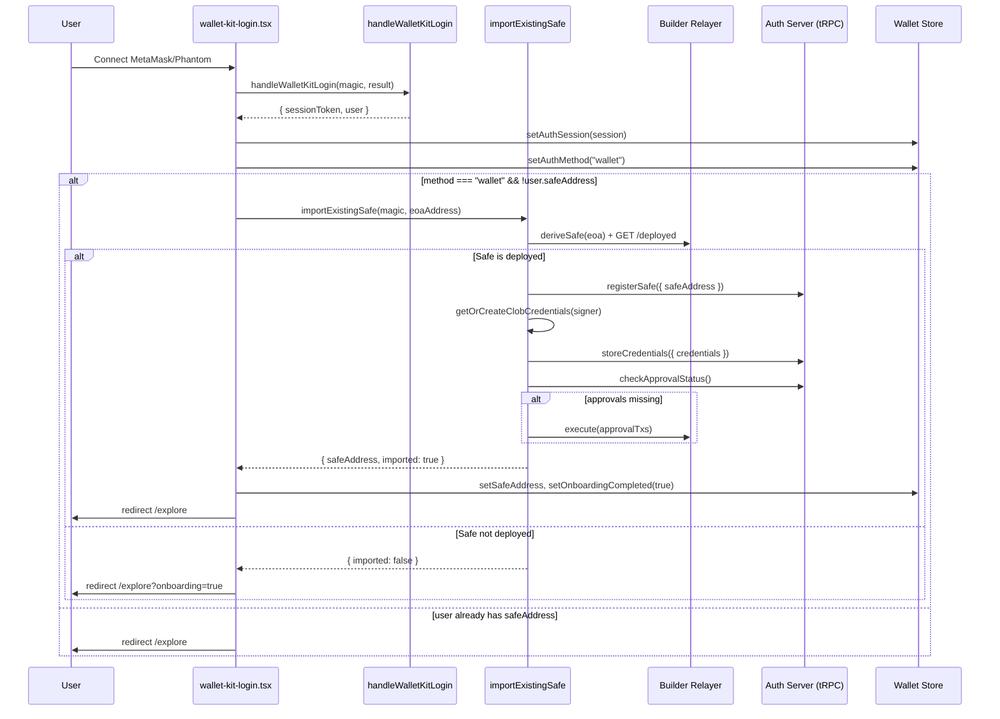

# Design Document: Wallet Auth & Polymarket Safe Import

## Overview

This feature extends Doji's existing Magic-based authentication to support external wallet connections (MetaMask and Phantom) via Magic Wallet Kit. When a user connects an external wallet that already has a deployed Polymarket Gnosis Safe, the system detects and imports it — registering the Safe, deriving CLOB credentials from the external wallet's signer, checking approval status, and redirecting the user straight to trading. Users without an existing Safe fall through to the standard onboarding flow.

The design touches four layers:
1. **UI** — `wallet-kit-login.tsx` (wallet list config + post-auth import orchestration)
2. **Auth** — `handleWalletKitLogin` in `auth.ts` (unchanged core, but caller adds import step)
3. **Import logic** — New `importExistingSafe` helper function in `lib/magic/import-safe.ts`
4. **State** — Wallet store gains `authMethod` field to distinguish email vs. external wallet users

No server-side changes are required — `registerSafe`, `storeCredentials`, and `checkApprovalStatus` already exist and handle the import use case.

## Architecture



## Components and Interfaces

### 1. `wallet-kit-login.tsx` — Modified

**Changes:**
- Update `wallets` prop from `["metamask", "coinbase", "walletconnect"]` to `["metamask", "phantom"]`.
- After `handleWalletKitLogin` succeeds, check if `result.method === "wallet"` and the server returned no `safeAddress`. If so, call `importExistingSafe`.
- Set `authMethod` in the wallet store based on `result.method`.
- If import succeeds, set `onboardingCompleted: true` and redirect to `/explore`.
- If import fails or no Safe found, fall through to existing redirect logic (`getPostAuthRedirectPath`).

```typescript
// In handleSuccess callback (simplified)
const auth = await handleWalletKitLogin(magic, result);
const isWallet = result.method === "wallet";

setAuthSession({ ...auth session fields });
useWalletStore.getState().setAuthMethod(isWallet ? "wallet" : "email");

if (isWallet && !auth.user.safeAddress) {
  try {
    const importResult = await importExistingSafe(magic, auth.user.walletAddress);
    if (importResult.imported) {
      setSafeAddress(importResult.safeAddress);
      setOnboardingCompleted(true);
      router.push("/explore");
      return;
    }
  } catch {
    // Fall through to standard onboarding
  }
}

router.push(getPostAuthRedirectPath(auth.user.safeAddress));
```

### 2. `importExistingSafe` — New helper (`lib/magic/import-safe.ts`)

A pure async function (not a hook) that orchestrates the import flow. Keeps the component thin.

```typescript
interface ImportSafeResult {
  imported: boolean;
  safeAddress: string | null;
}

async function importExistingSafe(
  magic: Magic,
  eoaAddress: string,
): Promise<ImportSafeResult>
```

**Steps:**
1. **Derive Safe address** — `deriveSafe(eoa.toLowerCase(), safeFactory)` using `getContractConfig(POLYGON_CHAIN_ID)`.
2. **Check deployment** — `GET ${RELAYER_URL}/deployed?address=${derivedSafe}`. If not deployed or network error, return `{ imported: false, safeAddress: null }`.
3. **Register Safe** — `trpcClient.auth.registerSafe.mutate({ safeAddress })`. Server verifies bytecode + ownership on-chain.
4. **Derive CLOB credentials** — Create signer from Magic's `rpcProvider` (which bridges to the external wallet), call `getOrCreateClobCredentials(signer)`, then `trpcClient.auth.storeCredentials.mutate(...)`.
5. **Check approvals** — `trpcClient.auth.checkApprovalStatus.query()`. If `needsApproval`, execute approval transactions via `RelayClient.execute(createApprovalTransactions())`.
6. **Return** — `{ imported: true, safeAddress }`.

**Error handling at each step:**
- Step 2 failure → return `{ imported: false }` (network error fallback).
- Step 3 failure → throw with descriptive message (e.g., "EOA is not an owner of this Safe").
- Step 4 failure (credential derivation or user rejects signature) → log warning, return `{ imported: true, safeAddress }` without credentials. `useClobClient` will auto-derive later.
- Step 5 failure → proceed without approvals (fail-open, same as `checkApprovalStatus` server behavior).

### 3. `handleWalletKitLogin` — No changes needed

The existing `case "wallet"` branch already:
- Gets `didToken` via `magic.user.getIdToken()`
- Extracts `walletAddress` from `result.walletAddress`
- Calls `trpcClient.auth.login.mutate({ didToken, walletAddress })`

The import logic lives in the caller (`wallet-kit-login.tsx`), not in `handleWalletKitLogin`, keeping auth and import concerns separate.

### 4. Wallet Store — Add `authMethod` field

```typescript
// New field in WalletState
authMethod: "email" | "wallet" | null;

// New action
setAuthMethod: (method: "email" | "wallet") => void;
```

**Changes to `useWalletStore`:**
- Add `authMethod: null` to `initialState`.
- Add `setAuthMethod` action: `set({ authMethod })`.
- Add `authMethod` to `setDisconnected` reset (back to `null`).
- Add `authMethod` to `partialize` for persistence across page reloads.

### 5. `getMagicSigner` — Behavior with external wallets

`getMagicSigner` already works for external wallets because Magic's `rpcProvider` bridges RPC calls to the connected external wallet. When a user connects MetaMask, `magic.rpcProvider` routes `eth_requestAccounts` and signing requests to MetaMask. No changes needed to `getMagicSigner` itself.

The `walletAddress` parameter (passed from `result.walletAddress` in the wallet case) ensures the signer is bound to the correct EOA.

### 6. Onboarding bypass

When `importExistingSafe` succeeds:
- `wallet-kit-login.tsx` sets `onboardingCompleted: true` in the wallet store.
- `safeAddress` is set in the store.
- The redirect goes to `/explore` (not `/explore?onboarding=true`).
- `shouldOpenOnboarding` returns `false` because `onboardingCompleted` is `true`.
- The `SafeOnboarding` component is never mounted.

## Data Models

### Wallet Store State (updated)

```typescript
interface WalletState {
  // Existing fields
  address: string | null;
  chainId: number | null;
  isConnected: boolean;
  signatureType: SignatureType;
  funderAddress: string | null;
  sessionToken: string | null;
  userId: string | null;
  email: string | null;
  safeAddress: string | null;
  hasCredentials: boolean;
  onboardingCompleted: boolean;

  // New field
  authMethod: "email" | "wallet" | null;
}
```

### ImportSafeResult

```typescript
interface ImportSafeResult {
  imported: boolean;
  safeAddress: string | null;
}
```

### No database schema changes

The existing `users` table already stores `walletAddress`, `safeAddress`, and `encryptedCreds`. External wallet users are stored identically to email users — the EOA from MetaMask/Phantom becomes the `walletAddress`, and the imported Safe becomes the `safeAddress`. The `authMethod` distinction lives only in the client-side wallet store.


## Correctness Properties

*A property is a characteristic or behavior that should hold true across all valid executions of a system — essentially, a formal statement about what the system should do. Properties serve as the bridge between human-readable specifications and machine-verifiable correctness guarantees.*

### Property 1: Safe derivation is deterministic

*For any* valid Ethereum EOA address, calling `deriveSafe(eoa, safeFactory)` multiple times with the same inputs SHALL always produce the same Safe address.

**Validates: Requirements 3.1**

### Property 2: Import result mirrors deployment status

*For any* EOA address, the `imported` field returned by `importExistingSafe` SHALL equal the `deployed` status returned by the Builder Relayer's `/deployed` endpoint. When the relayer reports `deployed: true`, the result is `{ imported: true }`; when `deployed: false` or the check fails with a network error, the result is `{ imported: false }`.

**Validates: Requirements 3.3, 3.4, 3.5**

### Property 3: Post-import wallet store invariant

*For any* successful Safe import (where `imported === true`), the wallet store SHALL have `safeAddress` set to the imported Safe address, `signatureType` set to `GNOSIS_SAFE` (2), `funderAddress` set to the Safe address, and `onboardingCompleted` set to `true`.

**Validates: Requirements 4.3, 7.2**

### Property 4: Approval execution matches approval status

*For any* imported Safe, approval transactions SHALL be executed if and only if `checkApprovalStatus` returns `needsApproval: true`. When `needsApproval: false`, no approval transactions are sent. When the approval check itself fails, approvals SHALL be executed as a safe default.

**Validates: Requirements 5.2, 5.3, 5.4**

### Property 5: ClobClient configuration for imported Safe

*For any* external wallet user with an imported Safe, the ClobClient SHALL be created with `funderAddress` equal to the imported Safe address and `signatureType` equal to `GNOSIS_SAFE` (2).

**Validates: Requirements 6.3**

### Property 6: Successful import bypasses onboarding

*For any* successful Safe import, the post-auth redirect path SHALL be `/explore` (without the `?onboarding=true` query parameter), and `shouldOpenOnboarding` SHALL return `false`.

**Validates: Requirements 7.1**

### Property 7: authMethod reflects login method

*For any* authentication event, the wallet store's `authMethod` field SHALL be `"wallet"` when the login method is `"wallet"` and `"email"` when the login method is `"email"`.

**Validates: Requirements 8.2, 8.3**

### Property 8: authMethod round-trip persistence

*For any* `authMethod` value set in the wallet store, serializing the store to localStorage and deserializing it back SHALL produce the same `authMethod` value.

**Validates: Requirements 8.4**

### Property 9: Auth session persistence

*For any* valid auth result (sessionToken, userId, email, walletAddress, safeAddress), calling `setAuthSession` on the wallet store SHALL result in the store containing all provided fields with their exact values.

**Validates: Requirements 2.4**

## Error Handling

### Import flow error matrix

| Step | Error Condition | Behavior | User Impact |
|------|----------------|----------|-------------|
| Safe derivation | Invalid EOA format | Throw — caught by caller | Falls to standard onboarding |
| Relayer `/deployed` check | Network error / non-200 | Return `{ imported: false }` | Standard onboarding (no error shown) |
| `registerSafe` | EOA not owner / no bytecode | Throw TRPCError BAD_REQUEST | Error toast + standard onboarding |
| `registerSafe` | Server/DB error | Throw TRPCError INTERNAL_SERVER_ERROR | Error toast + standard onboarding |
| Credential derivation | User rejects signature | Catch, log warning, return `{ imported: true }` without creds | Safe registered, `useClobClient` auto-derives later |
| Credential derivation | Signer/network error | Catch, log warning, return `{ imported: true }` without creds | Same as above |
| `storeCredentials` | Server error | Catch, log warning (non-blocking) | Credentials derived but not persisted; re-derived next session |
| `checkApprovalStatus` | Server/RPC error | Fail-open: proceed with approvals | Unnecessary but safe approval tx |
| Approval execution | Relayer error | Catch, log warning (non-blocking) | User can fix via "Fix Approvals" in user menu |

### Structured logging

All errors during import are logged with:
- `eoaPrefix`: First 6 chars of EOA address (e.g., `0x1234...`)
- `step`: Which import step failed (`detect`, `register`, `credentials`, `approvals`)
- `errorType`: Error constructor name
- `message`: Error message string

### Partial import states

The import is designed to be resilient to partial failures:

1. **Safe registered, no credentials** — `useClobClient` detects `hasCredentials: false` with a valid `safeAddress` and auto-derives credentials on next page load.
2. **Safe registered, no approvals** — User sees "Fix Approvals" option in the user menu, which triggers `useSetTokenApprovals`.
3. **Import fails entirely** — User lands on standard onboarding flow as if they never had a Polymarket account.

## Testing Strategy

### Property-based testing

Use `fast-check` as the property-based testing library (already available in the monorepo's test infrastructure with Vitest).

Each property test runs a minimum of 100 iterations and is tagged with a comment referencing the design property:

```typescript
// Feature: wallet-auth-polymarket-import, Property 1: Safe derivation is deterministic
```

Property tests focus on:
- `importExistingSafe` logic with mocked relayer/server responses (Properties 2, 3, 4, 6)
- Wallet store state transitions (Properties 3, 7, 8, 9)
- `deriveSafe` determinism (Property 1)
- ClobClient configuration (Property 5)

### Unit tests

Unit tests complement property tests for specific examples and edge cases:
- Wallet list configuration is exactly `["metamask", "phantom"]` (Req 1.1)
- `handleWalletKitLogin` extracts DID token and wallet address for `method: "wallet"` (Req 2.1)
- Relayer `/deployed` endpoint is called with the derived Safe address (Req 3.2)
- `registerSafe` is called when a deployed Safe is detected (Req 4.1)
- `checkApprovalStatus` is called during import (Req 5.1)
- Error logging includes structured context (Req 9.4)
- Edge cases: network errors during Safe detection (Req 3.5), registration failure fallback (Req 9.1), credential derivation failure (Req 9.2), user signature rejection (Req 9.3)

### Test file organization

```
tests/unit/
  import-safe.test.ts          # importExistingSafe logic (properties 1-6)
  wallet-store-auth.test.ts    # authMethod + persistence (properties 7-9)
  wallet-kit-login.test.ts     # Component integration (unit tests)
```
