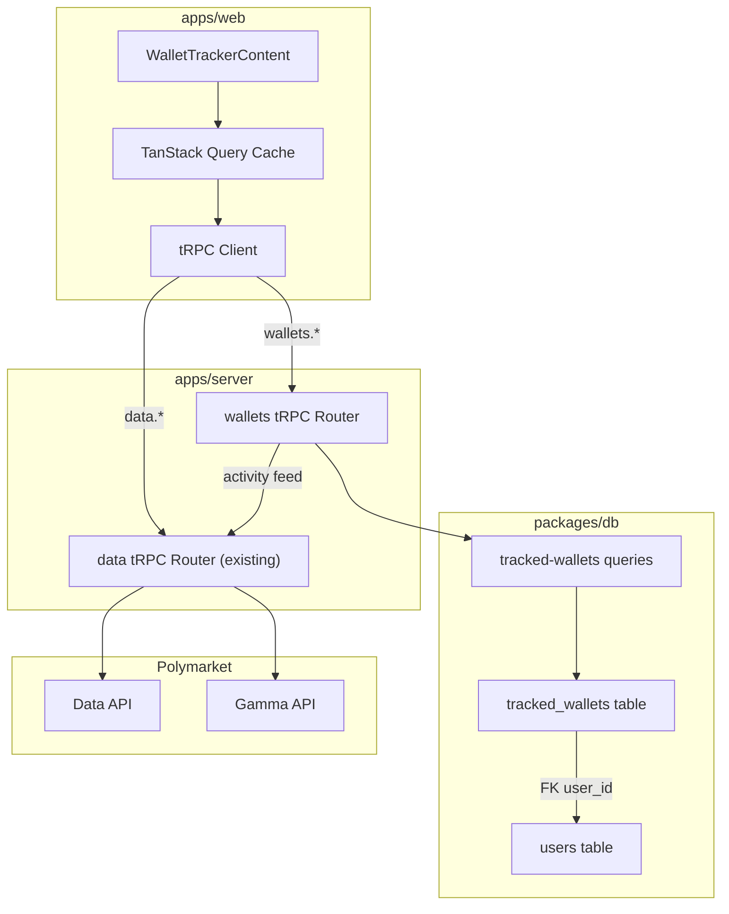

# Design Document: Wallet Tracking

## Overview

Wallet Tracking migrates the current browser-localStorage wallet tracker to a server-persisted, PostgreSQL-backed system exposed via tRPC. Authenticated users can CRUD up to 50 tracked wallets, view an aggregated activity feed (trades enriched with Gamma metadata), and see per-wallet portfolio values — all consistent across devices and sessions.

The feature adds:
1. A `tracked_wallets` Drizzle table in `packages/db` with a foreign key to `users`.
2. A query module (`packages/db/src/queries/tracked-wallets.ts`) encapsulating all DB operations.
3. A `wallets` tRPC router (`apps/server/src/routers/wallets.ts`) using `protectedProcedure`.
4. Frontend migration of `WalletTrackerContent` from localStorage to tRPC + TanStack Query.

No new external dependencies are required — the stack already includes Drizzle, tRPC, Zod, and TanStack Query.

## Architecture



### Request Flow

1. Frontend calls `trpc.wallets.*` procedures via TanStack Query.
2. `protectedProcedure` middleware validates the JWT and injects `ctx.session.userId`.
3. The `wallets` router delegates DB operations to the query module in `packages/db`.
4. For activity feed and portfolio values, the router calls existing Data API proxy functions (`getTrades`, `getValue`, `getMarkets`) directly — no nested tRPC calls.
5. Responses flow back through tRPC serialization to the TanStack Query cache.

### Design Decisions

- **Query module in `packages/db`** rather than inline SQL in the router: follows the existing `queries/users.ts` pattern, keeps the router thin, and makes queries independently testable.
- **Direct function calls for Data API** (not tRPC-to-tRPC): the `wallets` router imports `getTrades`, `getValue`, `getMarkets` from `lib/polymarket/data` and `lib/polymarket/gamma` directly, avoiding unnecessary HTTP round-trips.
- **No localStorage fallback**: the feature is auth-only. Unauthenticated users see a prompt to log in.
- **50-wallet limit enforced at DB query level**: the `addTrackedWallet` query checks `COUNT(*)` before insert inside a transaction, preventing race conditions.

## Components and Interfaces

### 1. Database Schema (`packages/db/src/schema/tracked-wallets.ts`)

New Drizzle table definition exported from the schema barrel.

```typescript
import { index, pgTable, text, timestamp, unique, uuid } from "drizzle-orm/pg-core";
import { users } from "./users";

export const trackedWallets = pgTable(
  "tracked_wallets",
  {
    id: uuid("id").defaultRandom().primaryKey(),
    userId: uuid("user_id").notNull().references(() => users.id, { onDelete: "cascade" }),
    address: text("address").notNull(),
    label: text("label").notNull(),
    createdAt: timestamp("created_at").defaultNow().notNull(),
    updatedAt: timestamp("updated_at").defaultNow().notNull(),
  },
  (table) => [
    unique("tracked_wallets_user_address_unique").on(table.userId, table.address),
    index("tracked_wallets_user_id_idx").on(table.userId),
  ]
);
```

### 2. Query Module (`packages/db/src/queries/tracked-wallets.ts`)

Follows the `queries/users.ts` pattern. Accepts a `Database` type parameter.

| Function | Signature | Description |
|----------|-----------|-------------|
| `addTrackedWallet` | `(db, userId, address, label?) → TrackedWallet` | Validates 50-wallet limit in a transaction, normalizes address to lowercase, assigns default label if omitted. Throws on duplicate or limit exceeded. |
| `listTrackedWallets` | `(db, userId) → TrackedWallet[]` | Returns all wallets for user, ordered by `createdAt DESC`. |
| `updateTrackedWallet` | `(db, userId, walletId, label) → TrackedWallet \| null` | Updates label and `updatedAt`. Returns null if not found or not owned by user. |
| `removeTrackedWallet` | `(db, userId, walletId) → boolean` | Deletes wallet if owned by user. Returns true if deleted, false if not found. |
| `countTrackedWallets` | `(db, userId) → number` | Returns count of wallets for user (used internally by `addTrackedWallet`). |

### 3. tRPC Router (`apps/server/src/routers/wallets.ts`)

All procedures use `protectedProcedure` from `@doji/api/middleware/auth`.

```typescript
// Procedure definitions (Zod schemas inline)
wallets.add      — mutation({ address: z.string().regex(ETH_ADDRESS_RE), label: z.string().max(100).optional() })
wallets.list     — query()  // no input, userId from session
wallets.update   — mutation({ id: z.string().uuid(), label: z.string().min(1).max(100) })
wallets.remove   — mutation({ id: z.string().uuid() })
wallets.activity — query({ limit: z.number().min(1).max(500).default(100), offset: z.number().min(0).default(0) })
wallets.values   — query()  // no input, returns all wallet values
```

### 4. Router Registration (`apps/server/src/routers/index.ts`)

Add `wallets: walletsRouter` to the `appRouter` object.

### 5. Frontend Migration (`apps/web/src/components/wallet-tracker/wallet-tracker-content.tsx`)

Replace localStorage reads/writes with tRPC queries/mutations:

| Current (localStorage) | New (tRPC) |
|------------------------|------------|
| `parseStoredWallets()` | `useQuery(trpc.wallets.list.queryOptions())` |
| `persistWallets(wallets)` | `useMutation` on `trpc.wallets.add` / `trpc.wallets.update` / `trpc.wallets.remove` |
| `useQueries` on `trpc.data.tradesWithMarkets` per wallet | `useQuery(trpc.wallets.activity.queryOptions({ limit, offset }))` |
| `useQueries` on `trpc.data.value` per wallet | `useQuery(trpc.wallets.values.queryOptions())` |

Cache invalidation: after any mutation, invalidate `wallets.list`, `wallets.activity`, and `wallets.values` query keys.

## Data Models

### TrackedWallet (Database Record)

| Column | Type | Constraints | Description |
|--------|------|-------------|-------------|
| `id` | `uuid` | PK, default random | Unique wallet tracking record ID |
| `user_id` | `uuid` | FK → users.id, NOT NULL, ON DELETE CASCADE | Owning user |
| `address` | `text` | NOT NULL | Ethereum address (stored lowercase) |
| `label` | `text` | NOT NULL | User-assigned label (max 100 chars) |
| `created_at` | `timestamp` | NOT NULL, default now | Creation time |
| `updated_at` | `timestamp` | NOT NULL, default now | Last modification time |

Composite unique: `(user_id, address)`
Index: `user_id` (for list queries)

### Zod Schemas

```typescript
// Shared validation constants
const ETH_ADDRESS_RE = /^0x[a-fA-F0-9]{40}$/;

// Input schemas
const addWalletInput = z.object({
  address: z.string().regex(ETH_ADDRESS_RE, "Invalid Ethereum address"),
  label: z.string().min(1).max(100).optional(),
});

const updateWalletInput = z.object({
  id: z.string().uuid(),
  label: z.string().min(1).max(100),
});

const removeWalletInput = z.object({
  id: z.string().uuid(),
});

const activityInput = z.object({
  limit: z.number().int().min(1).max(500).default(100),
  offset: z.number().int().min(0).default(0),
});
```

### Activity Feed Response Shape

```typescript
interface ActivityFeedResponse {
  trades: Array<TradeWithMarket & { walletLabel: string; walletAddress: string }>;
  total: number;
  hasMore: boolean;
  failures: string[];  // wallet addresses that failed to fetch
}
```

### Portfolio Values Response Shape

```typescript
interface WalletValue {
  walletId: string;
  address: string;
  label: string;
  value: number | null;  // null if Data API failed for this wallet
}
```


## Correctness Properties

*A property is a characteristic or behavior that should hold true across all valid executions of a system — essentially, a formal statement about what the system should do. Properties serve as the bridge between human-readable specifications and machine-verifiable correctness guarantees.*

### Property 1: Add returns a complete record

*For any* valid Ethereum address and any optional label (or no label), calling `addTrackedWallet` should return a record containing a non-null UUID `id`, the correct `userId`, the lowercase `address`, a non-empty `label`, and non-null `createdAt`/`updatedAt` timestamps.

**Validates: Requirements 1.1, 2.1, 3.2**

### Property 2: Invalid address rejection

*For any* string that does not match the pattern `0x[a-fA-F0-9]{40}`, submitting it as a wallet address should be rejected with a validation error, and no record should be created.

**Validates: Requirements 2.2**

### Property 3: Duplicate address prevention

*For any* user and any valid Ethereum address, if the address is already tracked by that user, attempting to add it again should fail with a conflict error, and the total wallet count should remain unchanged.

**Validates: Requirements 1.2, 2.3**

### Property 4: Default label from truncated address

*For any* valid Ethereum address, if no label is provided when adding a wallet, the resulting record's label should equal the concatenation of the first 6 characters and the last 4 characters of the address.

**Validates: Requirements 2.4**

### Property 5: Wallet limit enforcement

*For any* user, the number of tracked wallets should never exceed 50. When a user already has 50 wallets, any additional add attempt should be rejected with a limit error.

**Validates: Requirements 2.5, 2.6**

### Property 6: List returns all wallets sorted by creation date descending

*For any* user with N tracked wallets, calling `listTrackedWallets` should return exactly N records, and for every consecutive pair (i, i+1) in the result, `result[i].createdAt >= result[i+1].createdAt`.

**Validates: Requirements 3.1**

### Property 7: Update changes label and timestamp

*For any* existing tracked wallet and any valid label (1–100 characters, non-empty), updating the wallet should return a record with the new label, an `updatedAt` >= the previous `updatedAt`, and all other fields unchanged. For any empty string or string longer than 100 characters, the update should be rejected.

**Validates: Requirements 4.1, 4.3**

### Property 8: Remove then absent

*For any* tracked wallet owned by the requesting user, after removal, that wallet's ID should not appear in the user's list, and the list length should decrease by one.

**Validates: Requirements 5.1**

### Property 9: Ownership isolation

*For any* wallet ID that does not exist or belongs to a different user, both update and remove operations should fail with a not-found error, and no records belonging to any user should be modified or deleted.

**Validates: Requirements 4.2, 5.2**

### Property 10: Activity feed merge sort

*For any* set of trade lists from multiple tracked wallets, the merged activity feed should be sorted by timestamp descending — i.e., for every consecutive pair of trades (i, i+1), `trades[i].timestamp >= trades[i+1].timestamp`.

**Validates: Requirements 6.2**

### Property 11: Activity feed wallet label enrichment

*For any* trade in the activity feed, the `walletLabel` field should match the label of the tracked wallet whose address produced that trade.

**Validates: Requirements 6.3**

### Property 12: Pagination respects bounds

*For any* valid limit (1–500) and offset (≥ 0), the activity feed should return at most `limit` trades. When offset exceeds the total trade count, the result should be empty.

**Validates: Requirements 6.4**

### Property 13: Portfolio value mapping completeness

*For any* user with N tracked wallets, the portfolio values response should contain exactly N entries, one per wallet ID, with each value being either a number or null.

**Validates: Requirements 7.2**

## Error Handling

### Validation Errors

| Scenario | tRPC Code | Message |
|----------|-----------|---------|
| Invalid Ethereum address format | `BAD_REQUEST` | "Invalid Ethereum address" |
| Empty or >100 char label | `BAD_REQUEST` | "Label must be 1–100 characters" |
| Invalid UUID for wallet ID | `BAD_REQUEST` | Zod validation error (automatic) |
| Limit/offset out of range | `BAD_REQUEST` | Zod validation error (automatic) |

### Business Logic Errors

| Scenario | tRPC Code | Message |
|----------|-----------|---------|
| Duplicate address for same user | `CONFLICT` | "This wallet address is already tracked" |
| 50-wallet limit exceeded | `FORBIDDEN` | "Maximum of 50 tracked wallets reached" |
| Wallet not found or not owned | `NOT_FOUND` | "Tracked wallet not found" |
| Unauthenticated request | `UNAUTHORIZED` | "Missing or malformed Authorization header" (from existing middleware) |

### Infrastructure Errors

| Scenario | tRPC Code | Behavior |
|----------|-----------|----------|
| Unexpected DB error | `INTERNAL_SERVER_ERROR` | Log full error with `logger.error`, return generic "An unexpected error occurred" |
| Data API failure (single wallet in feed) | N/A | Continue processing other wallets, include failed address in `failures` array |
| Data API failure (single wallet value) | N/A | Return `null` for that wallet's value, continue processing others |

### Error Handling Pattern

```typescript
// Router-level error handling (consistent with auth.ts pattern)
try {
  const result = await addTrackedWallet(db, ctx.session.userId, input.address, input.label);
  return result;
} catch (err) {
  if (err instanceof TRPCError) throw err; // re-throw known errors
  logger.error({ err, procedure: "wallets.add", userId: ctx.session.userId }, "Unexpected error");
  throw new TRPCError({ code: "INTERNAL_SERVER_ERROR", message: "An unexpected error occurred" });
}
```

### Partial Failure Pattern (Activity Feed & Portfolio Values)

```typescript
const results = await Promise.allSettled(
  wallets.map(w => getTrades({ user: w.address, limit: perWalletLimit }))
);

const trades: EnrichedTrade[] = [];
const failures: string[] = [];

for (let i = 0; i < results.length; i++) {
  const result = results[i];
  if (result.status === "fulfilled") {
    trades.push(...enrichTrades(result.value, wallets[i]));
  } else {
    failures.push(wallets[i].address);
    logger.warn({ err: result.reason, address: wallets[i].address }, "Failed to fetch trades");
  }
}
```

## Testing Strategy

### Property-Based Testing

Library: **fast-check** (already compatible with Vitest, the project's test runner).

Each correctness property maps to a single property-based test with a minimum of 100 iterations. Tests live in `tests/unit/wallet-tracking/`.

| Property | Test File | Generator Strategy |
|----------|-----------|-------------------|
| P1: Add returns complete record | `tracked-wallets-queries.test.ts` | Random valid Ethereum addresses (0x + 40 hex chars), random labels (0–100 chars) |
| P2: Invalid address rejection | `tracked-wallets-queries.test.ts` | Random strings NOT matching `0x[a-fA-F0-9]{40}` |
| P3: Duplicate prevention | `tracked-wallets-queries.test.ts` | Random valid address, insert twice for same userId |
| P4: Default label | `tracked-wallets-queries.test.ts` | Random valid addresses with no label |
| P5: Wallet limit | `tracked-wallets-queries.test.ts` | Generate 50 unique addresses, attempt 51st |
| P6: List sort order | `tracked-wallets-queries.test.ts` | Random N wallets (1–20), verify sort |
| P7: Update label + timestamp | `tracked-wallets-queries.test.ts` | Random valid labels (1–100 chars) and invalid labels (empty, >100) |
| P8: Remove then absent | `tracked-wallets-queries.test.ts` | Random wallet from user's list |
| P9: Ownership isolation | `tracked-wallets-queries.test.ts` | Two random userIds, attempt cross-user operations |
| P10: Merge sort | `activity-feed.test.ts` | Random arrays of trades with random timestamps |
| P11: Wallet label enrichment | `activity-feed.test.ts` | Random trades mapped to random wallet labels |
| P12: Pagination bounds | `activity-feed.test.ts` | Random limit (1–500), random offset |
| P13: Value mapping completeness | `portfolio-values.test.ts` | Random N wallets with random/null values |

Tag format for each test:
```typescript
// Feature: wallet-tracking, Property 1: Add returns a complete record
```

### Unit Tests

Unit tests complement property tests for specific examples and edge cases:

- Address normalization: `"0xAbC..."` stored as `"0xabc..."`
- Default label for shortest valid address: `"0x" + "0".repeat(40)` → `"0x0000...0000"`
- Concurrent add of same address (race condition handling)
- Activity feed with zero tracked wallets returns empty
- Portfolio values with zero tracked wallets returns empty
- DB error produces INTERNAL_SERVER_ERROR without leaking details (Req 8.4)
- Foreign key constraint: tracked wallet with non-existent userId fails (Req 1.3)

### Integration Tests

- Full tRPC procedure round-trip: add → list → update → list → remove → list
- Auth enforcement: all procedures reject unauthenticated requests (Req 8.2)
- Partial failure: mock Data API failure for one wallet, verify others succeed (Req 6.5, 7.3)

### Test Configuration

```typescript
// vitest property test example
import { fc } from "fast-check";

// Generators
const ethAddressArb = fc.hexaString({ minLength: 40, maxLength: 40 })
  .map(hex => `0x${hex}`);

const labelArb = fc.string({ minLength: 1, maxLength: 100 })
  .filter(s => s.trim().length > 0);

const invalidAddressArb = fc.string()
  .filter(s => !/^0x[a-fA-F0-9]{40}$/.test(s));
```

All property tests run with `{ numRuns: 100 }` minimum. Tests use an in-memory or test-scoped PostgreSQL database (consistent with existing test infrastructure).
